# 编译器

编译器：将源代码翻译为可重定位的目标代码的软件
- 链接：操作系统加载目标代码生成可运行的目标机器代码
- 解释器：翻译并同步执行

编译器前端的结构：编译器是前后端分离的流水线结构，并通过中间代码连接
- 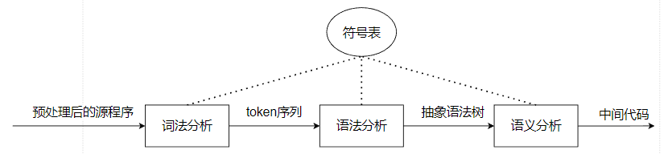
- 预处理：
  - 将多个文件聚合为单一字符流
  - 替换宏

# 词法分析

词法分析：扫描预处理后的字符流，识别词素，将词素映射为token
- token数据结构定义

```JAVA

public class Token {
  // 可以附加更多的信息，例如行号
    private TokenType type;
    private String value;
}


```

使用转移图手工编码实现词法分析器

- 转移图-关系运算符
  - 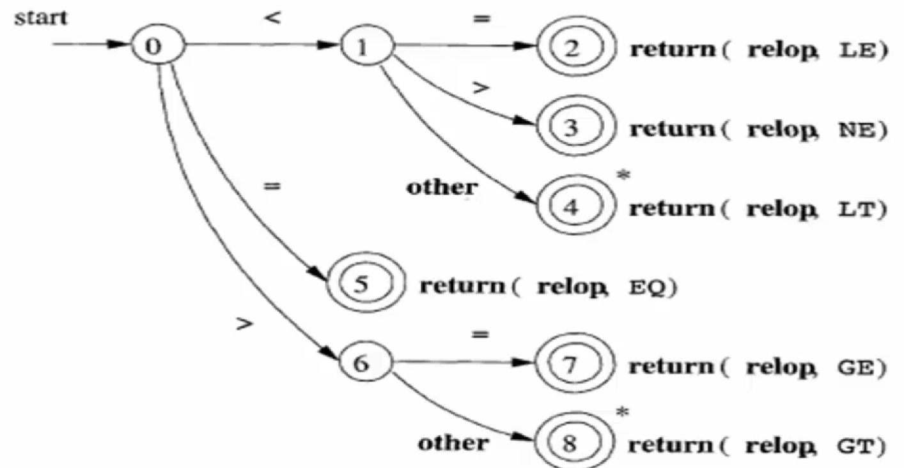
  - 其中状态4和状态8表示回退一个字符

- 转移图-标识符
  - 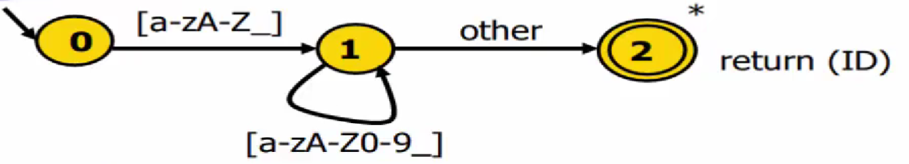
  - 关键字作为标识符的子集，可以扩展标识符转移图，或者维护一个完美哈希表存放关键字，查找时间复杂度为$O(1)$


转移图的实现方式属于硬编码，实现方式繁琐且易错，接下来讲解词法分析器的生成器实现，核心内容是正则表达式转换为有限自动机的一系列算法
- 生成器工具：lex、flex...，以声明式的规范作为输入，输出词法分析器


## 正则表达式


正则表达式的归纳法定义
- 归纳基础
  - 在给定的字符集$\Sigma=\{c_1,c_2,...,c_n\}$上，任意串$c_i$是正则表达式
  - 特别的，空串$\varepsilon$是正则表达式
- 归纳递归：如果M和N是正则表达式，则下面的串也是正则表达式
  - 选择$$\mathrm{M\mid N=\{M,N\}}$$
  - 连接$$\mathrm{MN}\quad=\{\mathrm{mn|~m\in M,~n\in N}\}$$
  - 闭包$$\mathrm{M^{*}}\quad=\{\varepsilon,M,\mathrm{MM,~MMM,}\cdots\}$$
- 正则表达式M的闭包
  - 正闭包：记作$M^{\boldsymbol{+}}$
  - 克林闭包：$M^{\boldsymbol{*}}=\varepsilon+M^{\boldsymbol{+}}$

文字描述->正则表达式
- 为简化正则表达式的书写，引入以下语法糖
  - $[c_1-c_n]$：$c_1|c_2|...|c_n$
  - $e^{\boldsymbol{+}}$：一个或多个e
  - $e^{\boldsymbol{?}}$： 0个或多个e
  - $"a*"$：a*自身
  - $e\{i,j\}$ ：i到j个e的连接
  - $.$  ：除`\n`外的任意字符
- 以字母或下划线开头，后跟零个或多个字母、数字或下划线
  - $[a-z|A-Z|_]([a-z|A-Z|_|0-9])$

## 有限状态自动机FA

$FA=(\Sigma,S,q0,F,\delta)$：输入字符串，输出布尔值
- $\Sigma$字符集、$S$状态集、$q0$初始状态、$F$终结状态集合、$\delta$转移函数集合
- 初始状态：仅有一个，一条start边以初始状态为后继状态，且该边没有源状态
- 转移函数：以源状态和一个字符为输入，以后继状态为输出
- 终结状态：若串被读完时处于终结状态，则该串是可接受的

DFA和NFA
- DFA：给定一个状态，对于每个输入符号，都有一个确定的状态转移函数。
- NFA：允许在给定状态和输入符号下有多个可能的状态转移，或者根本没有转移。这表示NFA可以沿着多个路径进行状态转移，甚至可能没有明确的下一个状态。
- 在NFA中，一个串可能在一条路径上被接受，在另一条路径上被拒绝。因此如果将NFA作为生成器的算法，需要采用回溯，时间复杂度高
- 在DFA中，任意字符串总是沿一个固定的路径进行状态转移
- 因此只能采用DFA作为生成器的算法，然而将正则表达式直接转换为DFA具有一定难度，可以采用以下转换算法：正则表达式->NFA->DFA
  - 从正则表达式构建DFA通常是线性时间复杂度，即$O(n)$，其中$n$是正则表达式的字符长度
  - 最小化DFA可以减少状态函数的数量，减少内存占用，尽管不会减少处理字符串的时间复杂度，但是可以通过减少状态转移数量提高自动机效率，优化自动机性能

生成器工具：接受正则表达式集合作为输入，以DFA为输出，正则表达式集合作为声明式规范，DFA作为词法分析器核心数据结构，配合少量驱动代码即可生成词法分析器

- Thompson算法：正则表达式->NFA
- 子集构造算法：NFA->DFA
- Hopcroft最小化算法：最小化DFA并作为最终的词法分析器核心数据结构


### 正则表达式 -> NFA

Thompson算法：对RE(正则表达式)的递归算法
- 归纳基础，直接构建所有的基本单元

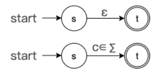

- 递归
  - 选择/并：额外构造一个初始状态和终结状态并进行空串连接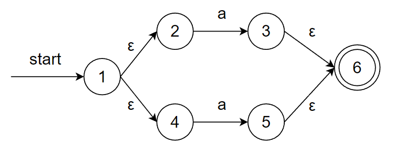
  - 连接：删除一个初始状态和一个终结状态并进行空串连接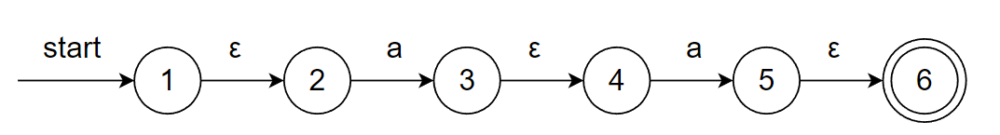
    - 注意状态3、4的合并操作会给递归算法实现带来额外的无效工作量
  - 闭包：使用空串连接原正则表达式的终结状态和初始状态，并额外构造一个初始状态和终结状态，使用空串连接，并使用空串将新的初始状态指向新的终结状态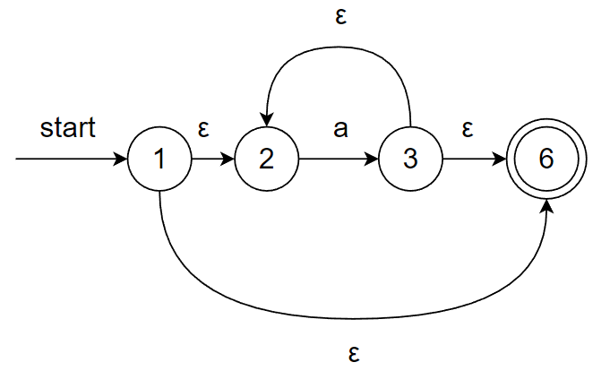
- 易错点
  - 连接运算时，需要用空串连接两个正则表达式，而不能直接合并原终结状态和起始状态


### NFA->DFA

首先引入一些定义便于描述子集构造法
- FA的等价性：两个不同构造的FA，被接受的串集合、被拒绝的串集合分别等价
- $\varepsilon$闭包：NFA中的状态集合，该集合中的状态可且仅可通过$\varepsilon$边相互转换
- $\mathrm{move(A,a)：A\in S_{DFA},a}$是一个$\varepsilon$闭包，DFA中的一个状态消耗一个字符转换为一个$\varepsilon$闭包

$\mathrm{a(b|c)^*}$使用子集构造法模拟NFA的动作结果如下

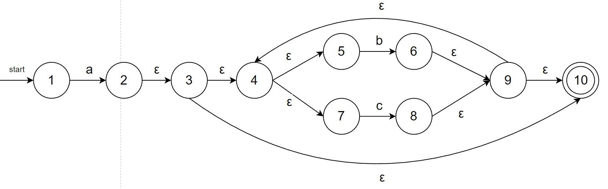


| NFA状态集合 | DFA状态 | a | b | c       |
|-------------|---------|---|---|---------|
| {n1}           | A       |  B |   |     |
| {n2,n3,n4,n5,n7,n10}           | B       |   | C  | D |
| {n4,n5,n6,n7,n9,n10}           | C       |   |  C |   D      |
| {n4,n5,n7,n8,n9,n10}           | D       |   |  C |    D     |

- A={n1}
- B={n2,n3,n4,n5,n7,n10}
- C={n4,n5,n6,n7,n9,n10}
- D={n4,n5,n7,n8,n9,n10}


分析子集构造法
- n元素的子集个数为$2^n$个，因此算法一定能够终止运行
- 时间复杂度最坏是$O(2^n)$，但是大多数子集并不会出现；以上述DFA为例，10个NFA状态子集共$2^10=1024$个，但是最后仅出现4个$\varepsilon$闭包，往往是线性复杂度

$\varepsilon$闭包的计算
- 深度优先搜索
  - 其中本次闭包计算未被访问的标志是不在闭包当作
  - 时间复杂度最坏是$O(n)$，即所有的节点都访问一遍


```c++
set closure = {}

void eps_closure(x) {
    closure += {x}
    foreach (y in x.transitions['ε']) {
        if (!visited(y)) {
            eps_closure(y)
        }
    }
}
```
- 广度优先搜索

```C++
set closure = {}
queue Q = []

void eps_closure(x) {
    Q.enqueue(x)
    while (Q not empty) {
        q = Q.dequeue()
        closure += q
        foreach (y in q.transitions['ε']) {
            if (!visited(y)) {
                Q.enqueue(y)
            }
        }
    }
}

```

子集构造算法实现
- 工作表存放有待计算的$\varepsilon$闭包
- 其中eps_closure(no)是上述的$\varepsilon$闭包计算方法，参数是作为起点的NFA状态，该状态是上一闭包消耗一个字符达到的状态
- 对每一个状态，都需要计算一次每个字符输入后转换到的NFA状态
- D[q, c]二维矩阵记录计算后的结果，并且将计算得到的$\varepsilon$闭包放入工作表
- 如果闭包包含NFA的终结状态，则该闭包所对应的DFA状态是终结状态
```C++
q0 <- eps_closure(no)
Q <- {q0}
workList <- qo
while (workList != [])
    remove q from workList
    foreach (character c)
        t <- e-closure(delta(q, c))
        D[q, c] <- t
        if (t not in Q)
            add t to Q and workList


```


### DFA最小化


上一节通过子集构造法得到的DFA图如下

- 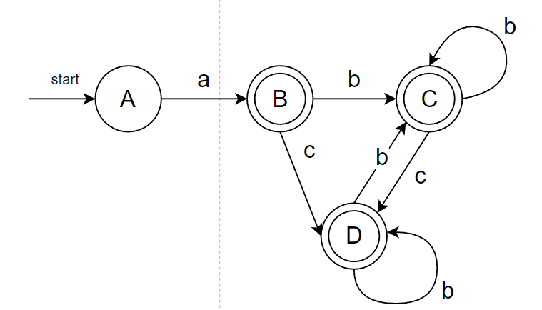

- 在DFA中，非接受状态集合、终结状态集合分别可以进行状态合并操作；上述DFA可以执行两次终结状态合并

  - 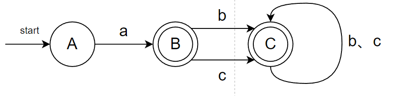

  - 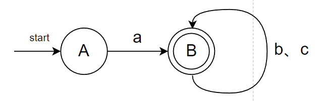


Hopcroft最小化算法：基于等价类
- 每次输入一个暂时认为是等价类的集合s，检查该集合中的每个状态输入某个字符后的转移状态，假设转移状态相同则可以暂时认为仍是等价类，假设转移到不同的状态，则需要进一步切割到不同的等价类中

```C++
split(s)
  foreach (character c)
      if (c can split)
          split s into T1, ..., Tk

```

- 初始化函数：首先将状态切割为两个等价类，非接受状态和接受状态，暂时认为它们是等价的
- 算法停止标志：仍有等价类在变化

```C++
hopcroft()
  split all nodes into N, A
  while (set is still changing)
      split(s)

```

以上述DFA为例
- 
- 首先N是单元素不可能拆分
- A包括三个状态，输入a、b、c都不能将状态转移出等价类，并且这三个状态都能接受b、c，都不接受a
- 因此三个状态是等价的，可以直接合并为一个状态，自循环输入b、c


接下来观察一个更复杂的例子，正则表达式$fee|fie$的DFA
- 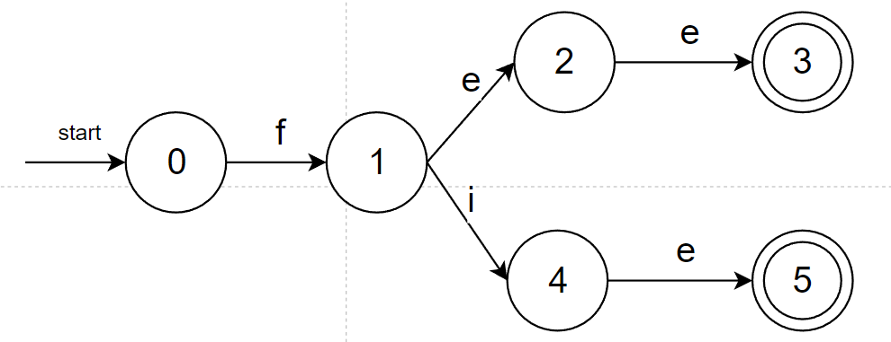
- 初始化
  - N:0,1,2,4
  - A:3,5
- 第一次划分
  - e不能让0、1转换出N，e能让2、4转换到3、5
  - {0,1},{2,4},{3,5}
- 第二次划分
  - e不能让0转移出{0,1}，e能让1转移出{0,1}
  - {2,4}只接受e不可能再划分
  - {0},{1},{2,4},{3,5}
- 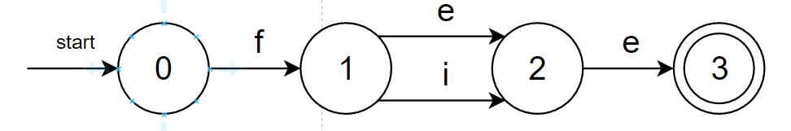


### DFA的代码表示

DFA的数据结构和算法实现有多种方式：转移表、哈希表、跳转表
- DFA的转移表实现

| 状态 | a | b |
|------|---|---|
| 0    | 1 | 0 |
| 1    | 2 | 1 |
| 2    | 2 | 2 |


# 语法分析

## 文法与分析树
 
 语法分析的核心任务：输入token流和语法规则，输出AST
- AST：抽象语法树Abstract Syntax Tree
  
核心内容
  - 使用数学语言描述语法规则
  - 分析token流以构建AST的算法


### 上下文无关文法

乔姆斯基文法体系：自0到3依次兼容
- 3级文法：正则表达式，用于描述词法结构
- 2级文法：上下文无关文法，用于描述语法结构
- 1级文法：上下文有关文法
- 0级文法：任意文法


从简化的形式化入手
- 自然语言：
  - 名词N：羊s、老虎t、草g(rass)、水w
  - 动词V：吃e、喝d
- 形式化如下
  - 非终结符：｛S，N，V｝
  - 终结符：｛s，t，g，w，e，d｝
  - 开始符号：S

```
S->N V N

N->s t g w

V->e d
```

上下文无关文法G是一个四元组：$G =(T,N,P,S)$
- $T$：终结符集合
- $N$：非终结符集合
- $P$：产生式规则集合
  - 规则：$X->β_1 β_2 ... β_n$
  - $X\in N \;\;\;\;\;\Beta\in (T\cup N)$
- $S$：唯一的开始符号，是一个非终结符$S\in N$


推导
- 给定文法G，从G的开始符号S开始循环
- 每次循环：用终结符替换非终结符
  - 最右推导：每次替换选择最右边的非终结符进行替换
- 循环结束条件：左侧不出现非终结符为止，该串称为句子

进一步明确语法分析器的核心任务：
- 将token组成句子，并判断该句子是否符合语言的语法规则，这些语法规则使用上下文无关文法表示
- 语法分析器在这个阶段输出布尔值，并且在输出false时将错误信息反馈给程序员


### 分析树与二义性


上下文无关文法的推导过程使用分析树作为代码的数据结构

- 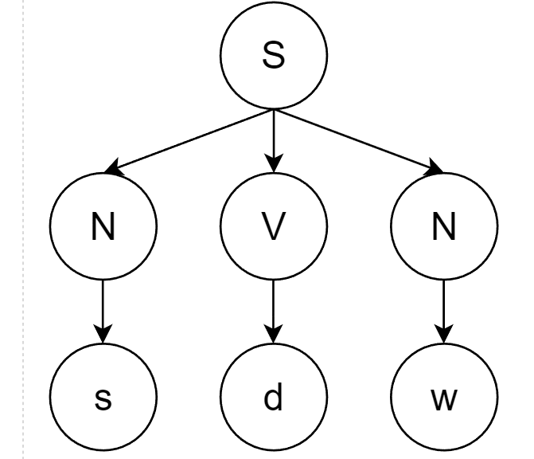
- 树的遍历顺序等价于推导的顺序，树的结构与遍历顺序无关
- 内部节点：非终结符；叶子节点：终结符

根据文法$\boldsymbol{E\rightarrow num | id|E+E|E*E}$，给出句子$3+4*5$的树结构
- 该文法是约定写法，等价如下写法
  - $\boldsymbol{E\rightarrow num}$
  - $\boldsymbol{E\rightarrow id}$
  - $\boldsymbol{E\rightarrow E+E}$
  - $\boldsymbol{E\rightarrow E*E}$
- 使用最左推导构造分析树如下
  - 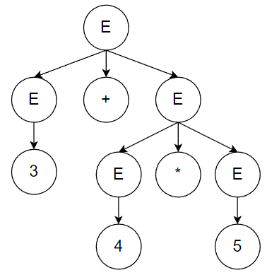
- 使用最右推导构造分析树如下
  - 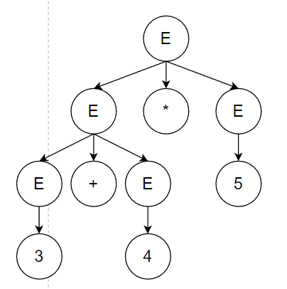
- 推导过程中，如果文法规则有多个，每次构造开始符号的子节点时，都需要选择一个文法，并根据该文法构造子节点
- 上述使用不同文法、采用相同推导顺序的分析树，其含义是否相同，取决于后序遍历的结果是否相同
  - 第一种分析树后序遍历结果：$3+(4*5)$
  - 第二种分析树后序遍历结果：$(3+4)*5$

上述推导证明，文法表示及其推导具有二义性


### 二义性文法


句子s根据二义性文法G可构造为两棵不同的分析树；
- 二义性将导致程序运行结果不一致
- 解决方案：重写文法


上一节文法是二义性文法，可重写为如下文法
- $\boldsymbol{E\rightarrow E+T|T}$
  - 该规则属于递归算法，递归停止的条件是句子仅剩$i$个$T$
- $\boldsymbol{T\rightarrow T*F|F}$
  - 该规则属于递归算法，递归停止的条件是句子仅剩$j$个F
- $\boldsymbol{F\rightarrow num|id}$

- 根据上述规则构造分析树如下
  - 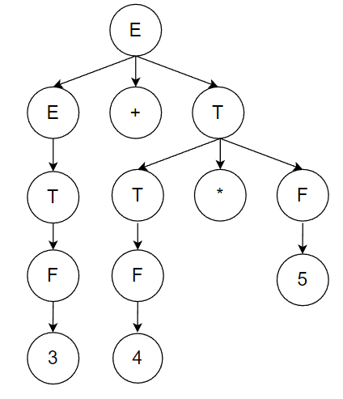
- 后序遍历总是先计算子树，因此优先级高的操作应远离根节点，同时保证同优先级的运算是左结合的

## 自顶向下分析算法

分析算法目标：输入文法G和句子s，输出布尔值


自顶向下算法构造分析树：循环判断栈顶元素是不是终结符
- 如果是终结符，则判断是不是和当前token等价
  - 等价，则将ptr前移并弹出栈顶元素
  - 不等价，回溯上次循环，按顺序选择下一个替换规则；如果当前的替换规则已用完，说明需要进一步回溯
- 如果不是终结符，则选择下一个未尝试的替换规则构造子节点
  - 注意构造子节点的顺序是左结合的，自顶向下算法使用栈存储当前的子节点，因此规则右侧的部分先放入栈中
- 循环结束时，栈空且i+1等于tokens数量返回true；否则，返回false
```C++
tokens[]  
i = 0// 当前处理的token下标
stack = [S]  

while (stack !=[]) {
  if (stack[top] is a terminal t) {
    if (t == tokens[i]) {
        Pop();
        i++;
    } else {
        backtrack();
    }
  } else if (stack[top] is a nonterminal T) { 
    pop();
    push(the next right hand side of T);
  }
}

```

自顶向下的问题：采用回溯算法，时间复杂度高，下面说明递归下降分析算法和LL(1)分析算法的思想：用前看符号避免回溯
- 回溯的原因：每次使用终结符替代非终结符时，没有依赖当前检查的token信息
- 回溯连续发生的原因：每次使用非终结符替代非终结符时，没有依赖下一个要检查的token信息


## 自底向上：递归下降分析算法


算法基本思想：
- 分治法：每个非终结符构造一个分析函数
  - 每个非终结符的产生式可能有终结符和非终结符
  - 先判断终结符是否符合要求，如果不符合抛出error
  - 非终结符使用switch-case结构作为入口
- 用前看符号指导产生式规则的选择
- 递归下降算法需要巧妙的手工编码以避免回溯

```C++
parse_S()
  parse_N()
  parse_V()
  parse_N()

parse_N()
  token = tokens[i]
  i++
  if (token==s||token==t|| token==gl|token==w) 
    return;
  error("..."); 

parse_V()
  token=tokens[i]
  i++
  if (token==e||token==d) 
    return;
  error("..."); 
```


## 自顶向下：LL(1)算法

在现在编译器中，词法分析器作为语法分析器的子模块实现；当且仅当语法分析器需要token流时，词法分析器才会进行生成。上述内容简略描述了手工实现语法分析器的基本思想，自本节开始详细讨论语法分析器的自动生成技术

LL(1)分析算法：表驱动的分析算法
- 结构：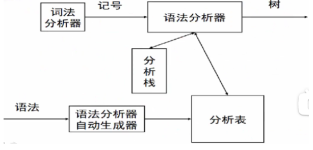
  - 在自顶向下分析中也使用了分析栈
  - LL(1)使用分析表避免回溯问题，分析表由生成器接受声明式规范输出
  - 如果每次LL(1)能选择正确的终结符进行替换，当不匹配时就可以直接输出error，而不是回溯
- L：从左向右读入程序
- L：最左推导，即选择串的最左边的非终结符进行替换
- 1：向前查看1个符号，判断使用哪个串进行推导
- 时间复杂度$O(n)$

LL(1)的驱动代码与自顶向下分析算法的区别：
- 非终结符替换时，总是选择唯一可能正确的串进行递归；
- 终结符不匹配时，直接报错而不是回溯

```C++
tokens[]  
i = 0// 当前处理的token下标
stack = [S]  

while (stack !=[]) {
  if (stack[top] is a terminal t) {
    if (t == tokens[i]) {
        Pop();
        i++;
    } else {
        error("...");
    }
  } else if (stack[top] is a nonterminal T) { 
    pop();
    push(the correct right hand side of T);
  }
}
```

- 以下文法转换为分析表如下

$0:S->N V N$

$1:N->s$

$2:\;\;\;->t$

$3:\;\;\;->g$

$4:\;\;\;->w$

$5:V->e$

$6:\;\;\;->d$

| N\T | s | t | g | W | e | d |
|----|---|---|---|---|---|---|
| S  | 0 | 0 | 0 | 0 |   |   |
| N  | 1 | 2 | 3| 4 |    |   |
| V  |    |    |   | |5 | 6  |

- 输入串gdw时分析栈的变化如下
  - 每次查表根据(栈顶元素，输入token)查找用于替换的串
  - 输入g，栈顶S，使用$0:S->N V N$
  - 输入g，栈顶N，使用$3:N->g$
  - ...依此类推


### 分析表生成

从上述推导不难看出，匹配正确串的关键在于：允许替换的串的第一个字符的集合包含输入的符号，否则报错
- 引入First(N)：从非终结符N开始推导得出的句子开头的所有可能终结符集合；
  - 考虑规则$0:M->N_1 V N_2$，$N_1$一定有$First(N_1)\subseteq First(M)$
  - 假设$N_1$是空串，那么一定有$First(V)\subseteq First(M)$
- 因此还需引入NULLABLE集合，判断能接受的串的第一个字符是否为空字符$\varepsilon$；
- 引入First_S：假设左部S有多个串可以推导，那么S的第一个字符就应该考虑所有的串，现在对S中的一个串$N -> β_1...β_n$进行分类讨论
  - 若$β_i$是终结符，将$β_i$并入First_S集合然后直接计算下一个串
  - 若$β_i$是非终结符
    - 首先一定需要将$β_i$的$FIRST(β_1)$加入到First_S集合
    - 其次判断$β_i$是不是NULLABLE
      - 如果不是，直接退出计算下一个串
      - 如果是，那么需要继续循环，下一次处理$β_{i+1}$
  - 如果循环处理到$β_{n+1}$，证明$β_1...β_n$全空，那么就需要将能够跟在N后面的首位非终结符集合并入First_S集合
- 因此需要引入FOLLOW(N)集合：跟在N后面的首位非终结符集合

此外，LL(1)算法还需解决分析表冲突问题，即(栈顶元素，输入token)的值有多个
  - 为什么会冲突：文法可能出现左递归，即右侧的非终结符可能出现在左边
  - 解决方法：重写文法更改为右递归，确保只有右侧的非终结符出现在左边，反之不允许

接下来讲述分析表生成方法

$0:Z->d$

$1:\;\;\;->X Y Z$

$2:Y->c$

$3:\;\;\;->\varepsilon$

$4:X->Y$

$5:\;\;\;->a$


计算NULLABLE集合。
- 非终结符$X$属于集合NULLABLE，当且仅当：
  - $X->\varepsilon$
  - $X-> Y_1 ... Y_n$，$Y_1,……,Y_n$都是非终结符且都属于NULLABLE集

```C++
NULLABLE = {}
while (nullable is still changing) {
    foreach (production p: X -> β) {
        if (β == ε) {
            NULLABLE U= {X}
        }
        if (β == Y1... Yn) {
            if (Y1 E NULLABLE && ... && Yn E NULLABLE) {
                NULLABLE U= {X}
            }
        }
    }
}

```


使用NULLABLE计算FIRST(N)
- 计算方法
  - $X->a：FIRST(X)\;\cup\;= \{a\}$
  - $X-> Y_1 Y_2...Y_n：$
    - $FIRST(X)\;\cup\;= FIRST(Y1)$
    - $if \;Y_1\in NULLABLE, FIRST (X) \;\cup\;= FIRST(Y2)$
    - $if \;Y_1,Y_2 \in NULLABLE, FIRST(X) U= FIRST(Y3)$
    - ...$if \;Y_1...Y_n \in NULLABLE$正常结束算法无需额外操作，因为该算法仅计算非终结符的单条产生式

```C++
foreach (nonterminal N) {
    FIRST(N) = {}
}

while (some set is changing) {
    foreach (production p: N -> β1...βn) {
        foreach (βi from β1 up to βn) {
            if (βi == a...) {
                FIRST(N) U= {a}
                break
            }
            if (βi == M...) {
                FIRST(N) U= FIRST(M)
                if (M is not in NULLABLE) {
                    break
                }
            }
        }
    }
}

```
- 分析表

|    | a | c | d |
|----|---|---|---|
| Z  |  1 | 1  |  0，1 |
| Y  |  3 |2，3   |  3 |
| X  |  4，5 |  4 | 4  |


确定FOLLOW(N)集

```C++
foreach (nonterminal N) {
    FOLLOW(N) = {}
}

while (some set is changing) {
    foreach (production p: N -> β1...βn) {
        temp = FOLLOW(N)
        foreach (βi from βn downto β1) { // 逆序！
            if (βi == a...) {
                temp = {a}
            }
            if (βi == M...) {
                FOLLOW(N) U= temp
                if (M is not NULLABLE) {
                    temp = FIRST(M)
                } else {
                    temp U= FIRST(M)
                }
            }
        }
    }
}

```

使用FOLLOW集、NOLLABLE、FIRST(N)构造FIRST_S集合

```C++
foreach (production p) 
  FIRST_S(p)={}


calculte_FIRST_S(production p: N->β1...βn)
  foreach (βi from B1 to Bn) {
    if (βi == a...) {
      FIRST_S(p) ∪ ={a}
      return;
    }
    if (βi == M...) {
        FIRST_S(p) ∪= FIRST(M)
        if (M is not NULLABLE) 
            return
    }
  }
  FIRST_S(p) ∪= FOLLOW(N)


```
```C++
tokens = [...]; 
i = 0; 
stack = [S]; 

while (stack != []) {
    if (stack[top] is a terminal t) {
        if (t == tokens[i++])
            pop();
        else
            error(...); 
    } else if (stack[top] is a nonterminal T) {
        pop(); 
        push(table[T, tokens[i]]); 
    }
}

```
- 对上述文法求FIRST_S如下


|          | 0       | 1   | 2       | 3       | 4   | 5   |
|----------|---------|-----|---------|---------|-----|-----|
| FIRST_S  | {d} | {a,c,d}| {c} | {a,c,d} | {c,a,d} | {a} |

驱动代码
```C++
tokens = [...]; 
i = 0; 
stack = [S]; 

while (stack != []) {
    if (stack[top] is a terminal t) {
        if (t == tokens[i++])
            pop();
        else
            error(...); 
    } else if (stack[top] is a nonterminal T) {
        pop(); 
        push(table[T, tokens[i]]); 
    }
}

```

### 分析表冲突处理


上一讲中的分析表如下
|    | a | c | d |
|----|---|---|---|
| Z  |  1 | 1  |  <FONT COLOR=RED>0，1 |
| Y  |  3 |<FONT COLOR=RED>2，3   |  3 |
| X  |  <FONT COLOR=RED>4，5</FONT> |  4 | 4  |

|          | 0       | 1   | 2       | 3       | 4   | 5   |
|----------|---------|-----|---------|---------|-----|-----|
| FIRST_S  | {d} | {a,c,d}| {c} | {a,c,d} | {c,a,d} | {a} |


对于某些文法可以通过改写文法消除冲突，使用LL(1)算法生成的分析表不存在冲突的话，就是合格的LL(1)算法

消除左递归，即LL(1)文法只能有右递归，

- 冲突文法

$0:E->E+T$

$1:\;\;\;->T$

$2:T->T*F$

$3:\;\;\;->F$

$4:F->n$

- 改写后

$0:E->T E'$

$1:E'->+ T E'$

$2:\;\;\;\;->$

$3:T->F T'$

$4:T'->* F T'$

$5:\;\;\;\;->$

$6:F->n$

提取左公因子


$0:X->a\;\;\;Y$

$1:\;\;\;->a \;\;\;z$

$2:Y->b$

$3:z->c$

$0:X->a\;\;\;Y$

- 改写后

$0:X->a\;\;\;X'$

$1:X'->Y$

$1:\;\;\;\;->z$

$2:Y->b$

$3:z->c$

## 自底向上：LR算法

LL(1)算法运行高效、有现成的工具可用；但是能分析的文法类型受限，即使是能分析的文法往往也需要改写

LR分析算法/移进—归约算法，是编译器的广泛采用的算法，能接受所有文法且无需对文法进行改性
- 推导：从左到右替换；归约：从右向左替换
- 归约算法是最右推导的逆过程

首先观察移进归约的一个正确例子
- 移进：每次从左到右读入一个token
- 归约：从右向左将token替换为产生式左部
- 文法

$0:S->E$

$1:E->E+T$

$2:\;\;\;->T$

$3:T->T*F$

$4:\;\;\;->F$

$5:F->n$

- 假设我们现在知道什么时候移进，什么时候归约，那么可以有如下LR过程

- 移进

  - ${\color{RED}2}+3*4$
- 归约

  - ${\color{RED}F}+3*4$
- 归约

  - ${\color{RED}T}+3*4$
- 归约

  - ${\color{RED}E}+3*4$
- 移进

  - $E+{\color{RED}F}*4$
- 归约

  - $E+{\color{RED}T}*4$
- 移进
- 归约
  - $E+T*{\color{RED}F}$
- 归约

  - $E+{\color{RED}T}$
- 归约

  - ${\color{RED}E}$
- 归约

  - ${\color{RED}S}$


观察可知LR过程是最右推导的逆过程
- 为了形式化分析该过程，引入点记号，标记已读入token与未读入token的界限；
  - 因此可以使用分析栈作为LR的数据结构
  - LR的分析栈恰好是自顶向下算法的逆过程，移进代表push操作，归约代表pop和替换操作
- 不难发现LR的难点在于：移进和归约的时机，接下来解决这个问题

以仅接受串xxy的文法演示LR的算法思想
- LR算法总是引入$0:S'→S$$，目的有两个
  - 因为$S$可以出现在产生式右部，而$S'$保证不出现在任何产生式的右部
  - 末尾总是有一个$或其它能表示串结尾的符号


$0:S'→S$$

$1:S→x\;\;\;x\;\;\;T$

$2:T→y$


## SLR分析算法


## LR(1)分析算法

## 第二章总结

LL(1)算法
- 构造NULLABLE集合
- 构造FIRST(N)集合
- 构造FOLLOW集合
- 构造FIRST集合
# EOF


LR(1)分析算法\SLR分析算法\LR算法\LL(1)算法\递归下降分析算法\自顶向下分析算法