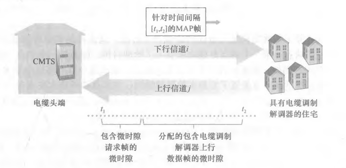

# TCP/IP

Physical Layer：对应OSI的物理层

Link Layer：对应OSI的数据链路层

Internet Layer： 对应OSI的网络层

Transport Layer： 对应OSI的传输层

Application Layer： 对应OSI的应用层

# Physical Layer

Physical Layer

- 向链路层提供的服务：对链路层而言，物理层抽象为能够确保传输比特的链路，该链路不会跨越局域网

- 物理层中不同局域网中的设备不能直接交流（具有不同的网段）
  - 链路层中的设备能够在不同的局域网（具有不同的网段）中交流

物理层有两个重要设备
- 中继器Repeater职责：重新生成信号，延长LAN局域网的网络距离
  - 中继器又称放大器：仅有两个端口，一个端口接受信号，另一个端口发送重新生成的信号

- 集线器Hub职责：作为多端口中继器构建星型网络，连接不同的计算机到同一局域网
  - 集线器Hub接收任意信号后，所有端口都会发送重新生成的信号
  
  - 集线器Hub因信号碰撞概率高被交换机替代
# Link Layer

***Data Link Layer***数据链路层
- 链路层向网络层提供的服务：
  - framing：接收网络层数据报，并封装为帧frame
  - MAC协议--Medium Access Control：链路接入、节点之间传输frame帧的规则
  - 差错检测和纠正：可以不提供可靠交付服务，如果提供必须确保数据报无差错交付
- 链路层的组成：*node、link*
  - *node*：链路层中的任何设备
    - 主机->网卡（Wifi接入点）->路由器/交换机->网卡（Wifi接入点）->主机
  - *link*：相邻*node*节点之间的通信信道；
    - *link*链路使用物理层提供的服务（物理层设备对链路层透明，交换机除外）

## bit level error detection and correction

*network adapter*网络适配器、*Network Interface Card, NIC*网络接口卡

- 主机和网卡之间是一段*link*链路，主机将数据报经该链路交付给网卡
- 网卡负责farming、比特级差错检测和纠正、链路接入

**bit level error detection and correction**比特级差错检测和纠正
- 检测 = 判断发生几个错误
- 定位 = 判断某个bit位是否发生错误（因此定位和纠正错误是相同的语义）

### parity bit
**parity bit**：奇偶校验位

*n bit*的数据，*1 bit*奇偶校验位
- 接收方和发送方事先约定采用奇校验或偶校验；

- 采用偶校验时
  - 发送方确保*n+1*位数据中共有偶数个1
  - 如果接收到奇数个1，那么证明出现了差错
- 采用奇校验
  - 发送方确保*n+1*位数据中共有奇数个1
  - 如果接收到偶数个1，那么证明出现了差错
- 综上所述：
  - 无论是奇校验还是偶校验，单位奇偶校验只能判断是否发生奇数个bit位错误
  - 如果出现偶数个bit位错误，接收方仍认为是正确的数据

二维奇偶校验

- 接收方和发送方事先约定采用奇校验或偶校验，并约定将*n*位数据划分为*i * j*矩阵
- 发送方
  - 将*n*位数据分为*i * j*矩阵，每一行和每一列都执行一次单位奇偶校验
  - 按顺序将列单位奇偶校验、行单位奇偶校验、数据放入帧中发送给接收方
  - 下图假定采用偶校验

|       | column1 | column2 | column3 | 行单位奇偶校验 |
|-------|---------|---------|---------|------------|
| row1  |    0    |    1    |    1    |      0     |
| row2  |    1    |    0    |    1    |      0     |
| row3  |    1    |    1    |    0    |      0     |
| row4  |    0    |    1    |    1    |      0     |
| row5  |    1    |    0    |    0    |      1     |
| 列单位奇偶校验 |    1    |    1    |    1    |     1       |

- 接收方
  - 从帧中取出列单位奇偶校验、行单位奇偶校验、数据，并填入表格
  - 每一行每一列都执行一次单位奇偶校验
  - 假设(row4、column2)上的数据出错，可以定位到该错误

|       | column1 | column2 | column3 | 行单位奇偶校验 |
|-------|---------|---------|---------|------------|
| row1  |    0    |    1    |    1    |      0     |
| row2  |    1    |    0    |    1    |      0     |
| row3  |    1    |    1    |    0    |      0     |
| row4  |    0    |    0    |    1    |      0     |
| row5  |    1    |    0    |    0    |      1     |
| 列单位奇偶校验 |    1    |    1    |    1    |     1       |

小结

- 单位奇偶检验
  - 只能判断是否发生奇数个错误，没有定位（和纠正）能力
- 二维奇偶校验
  - 具有定位（并纠正）一个错误的能力
  - 具有检测0个错误、一个错误、两个错误的能力，否则只能判别发生3个或更多的错误

### Cyclic Redundancy Check, CRC

***Forward Error Correction, FEC***前向纠错
- 指接收方具有检测和纠正差错的能力
- 减少发送方重发的次数，允许接收方立即纠正差错，避免不得不等待的往返时延
- 奇偶校验仅是为了介绍前向纠错的原理，下面介绍实际应用的检测

***Cyclic Redundancy Check, CRC***

- 发送方和接收方事先协商一个*generator*记为$G$，约定$n$位数据需要附加 $r$ 位校验位
- 发送方
  - $n$位数据左移$r$位，得到的结果对G进行模2运算的到$R$
  - 模2运算举例
    - 在运算过程中的加减运算不进位也不借位，等价于XOR异或运算
    - 
- 接收方
  - 提取出$n+r$位的二进制序列，对该序列进行模$2$运算
    - 若余数是0，则有很大概率没有差错
    - 若余数$0<R<r+1$，则$R$的值定位到出错的$bit$位
- 更多的$CRC$知识：略

## multiple access protocol

点对点链路连接一个发送方和一个接收方
- 点对点链路的协议：PPP（point-to-point protocol，点对点协议）、HDLC（high level data link control，高级数据链路控制）

广播链路

- 定义：一条链路连接多个发送方和多个接收方
- 任何一个节点传输一个帧，每个其他节点都收到一个副本
  - 注：以太网Ethernet：该技术标准使用广播链路实现局域网通信，是一种技术标准；大多数局域网使用Ethernet标准是计算机网络实际上采用Tcp/Ip模型的根本原因
  - 注：无线局域网同样采用广播链路技术
- 广播链路需要解决的问题：如何协调多个发送节点和多个接收节点对一个共享的广播信道的访问，即多路访问问题(muhiple access problem)；

muhiple access problem多路访问问题

- collide：当一个节点正在接收帧时，同时接收到其它帧；这意味着此时，所有节点大概率都同时接收到多个帧，即发生碰撞的帧的比特流纠缠在一起，这些帧将不会被任何一个节点正确获取；
- 因此，当发生碰撞时，称此次碰撞的所有帧丢失，有帧纠缠在一起的时间里广播信道被浪费；
- 若只要一个节点发送帧，则不存在多路访问问题，例如电视广播；
- 只要有多于一个节点频繁发送帧，大量碰撞将浪费大量链路带宽
- 因此只要一个信道被多个发送节点、接收节点共享，就需要实现（并遵守）multiple access protocol多路访问协议

multiple access protocol多路访问协议

- 三种类型的multiple access protocol：channel partitioning protocol ,random access protocol、taking-turns protocol
- 若广播信道速率为$R\;bps$，只要该信道采用并遵守多路访问协议，则该信道具有如下性质：
  - 当仅有$1$个节点发送数据时，该节点具有$R \;bps$的吞吐量；
    - 吞吐量：在较长的时间间隔中，传输成功的平均时间字节数
  - 当有$n$个节点发送数据时，每个节点吞吐量为$R/n\;bps$
  - 信道不依赖于节点，节点故障不会影响系统崩溃
  - 协议易于实现

### channel partitioning protocol

channel partitioning protocol：信道划分协议将广播信道的带宽划分为n份，然后分发给n个节点专用，有两种经典的协议：TDM、FDM

***Time Division Multiplexing：TDM***

- 时分多路复用：将时间线划分为*time frame*时间帧，每个时间帧由$n$个slot时隙组成，将第$i$个时隙分配给节点$i$，在每个时间帧的第$i$个slot中，节点$i$单独使用链路；
- 避免碰撞，但是完全的公平意味着低效率，每个节点的吞吐量上限为$R/n\;bps$，即使它是唯一活跃的节点

***Frequency Division Multiplexing：FDM***
- 频分多路复用：将信道划分为$n$个频段，因此每个频段具有$R/n\;bps$的带宽，将第$i$个频段分配给第$i$个节点
- 避免碰撞，每个节点的吞吐量上限为$R/n\;bps$，即使它是唯一活跃的节点

***Code Division Multiple Access：CDMA***

- CDMA使用唯一的编码一一标识节点；节点使用其获得的唯一编码对数据进行编码，即使发生碰撞也不会导致接收方正确接收，只要接收方持有用于标识发送方的编码；
- 无线信道使用CDMA技术

### Random Access Protocol

Random Access Protocol：符合以下概念的协议即属于随机接入协议
- 允许节点占用信道的全部吞吐量发送帧；
- 允许涉及碰撞的每个节点检测到碰撞，并且在合适的时机不断重发，知道该帧无碰撞被接收；
- 合适的时机：在检测到碰撞后，每个节点独立选择一个随机的时延，随机时延到期后进行重发；
- 经典的随机接入协议：*ALOHA*协议、*CSMA*协议
- 理想的Random Access Protocol
  - 仅有$1$个节点活跃吋，该活跃节点的吞吐量为$R\;bps$
  - 有$n$个节点活跃时，每个活跃节点的吞吐量接近$R/n\; bps$

#### Slotted ALOHA

本节将计算时隙ALOHA的效率，因此假设如下模型介绍$Slotted\;ALOHA$
- 所有帧长$L\;bit$
- 使用$L/R\;s$的时隙划分时间线，使得单个时隙恰好能够传输单个帧
- 只允许节点在每个时隙开始时传输单个帧，时隙结束时恰好传输完；通过这种方式时每个节点的发送和接收动作同步；
- 若某个时隙发生碰撞，假设在该时隙结束前，所有节点都能检测到该碰撞
- 节点$i$监听到帧传输失败后，在此后的每个时隙以概率$p$决定是否重传，即第$k$个节点的随机时延$T_k$服从几何分布；
- 当且仅当帧被无碰撞接收时，准备下一个帧的发送；

*Slotted ALOHA*的效率
- 当有多个活跃节点时，若发生碰撞，则以下时隙被浪费
  - 碰撞所涉及的帧被发送时，所占用的时隙的并集
  - 碰撞发生后的时隙将处于空闲状态，空闲状态占用的时隙个数为$min{T_k}$
  - 未浪费的时隙个数：有且只有一个节点在传输帧的时隙；称为成功时隙$successful\;slot$
- 效率efficiency定义为：当有大量的活跃节点且每个节点总有大量的帧要发送时，长期运行的间隔中成功时隙的占比

对*Slotted ALOHA*的效率估计
- 假设在第*i*时隙开始时，每个节点发送帧的概率都为$p$，则$$P(slot\;i\;is\;successful\;slot)=C^1_n p(1-p)^{(n-1)}$$
- $$max(\lim_{n\to \infin}np(1-p)^{(n-1)})=\frac{1}{e}=0.37$$

因此，尽管*Slotted ALOHA*能够在单个节点活跃时达到$100\%$的效率，但是长时间运行的吞吐量低于$37\%R$

#### ALOHA

*ALOHA*协议
- 与*Slotted ALOHA*协议的不同之处：帧需要传送时，不必等待，节点立即将该帧传入信道

估计*ALOHA*的最大效率

- 仍将时间线分割为时隙，每个时隙恰好能传送一个帧
- 若一个时隙是成功时隙，则某个节点在该时隙的任何位置开始发送帧，直到下一个时隙的该位置处结束，其它节点不发送帧；因此$$P(slot\;i\;is\;successful\;slot)=C^1_n p(1-p)^{2(n-1)}$$
- 取极限求得*ALOHA*协议的最大效率仅为$\displaystyle\frac{1}{2e}$，刚好是*Slotted ALOHA*的一半

#### CSMA

下面分析*Slotted ALOHA*效率低下的原因以及CSMA改进的方法
- 一个节点是否决定传输帧，仅依赖于概率$p$；而不依赖于其它节点的状态
  - 假设节点持有某一时刻其它节点的状态信息，并且决定只有该时刻没有节点占用信道时才占用帧，那么碰撞的几率或许能够减小；
  - 节点通过carrier sensing（载波侦听）嗅探某时刻是否有其它节点使用信道；
- 一个节点开始传输帧后，即使该节点知道已经发生碰撞，但是仍不停止帧的发送
  - collision detection碰撞检测：要求节点在传输时必须侦听信道，如果检测到碰撞，该节点必须停止传输帧
  - 停止传输后，等待一段长为$T$的随机时间后，重复侦听-当空闲时传输-碰撞检测的动作循环

***Carrier Sense Multiple Access,：CSMA***
- CSMA为什么会发生碰撞？
  - 一个节点是否在$t$时刻决定传输帧，仅取决于$t$时刻信道在该节点处的状态
  - 若$t$时刻信道在该节点处没有帧传输，则该节点认为信道全部空闲，实际上在$t_0\leq t$时刻，可能已经有多个其它节点同样认为信道空闲并开始传输，但是其帧未到达该节点处；
  - 同样的，该帧开始传输后，其它帧同样可能会误判信道状态，并开始传输帧
  - 即：受限于协议的实现成本，一个节点不可能持有所有节点的同步信息，载波监听的信息延迟误差导致碰撞仍可能发生；
- 综上所述，信道传播时延越小，载波监听侦听到网络中另一个节点已经开始传输的概率越大

***CSMA with Collision Detection, CSMA/CD*** 
- *CSMA/MD*要求节点只要监听到碰撞就立即停止传输，然后等待一个随机时间量$T$，下面介绍$T$的选取
- 选取标准
  - $T$的均值不会在碰撞节点少时相对大，避免$min\{T_i\}$的均值过大，以至于信道空闲时间长；
  - $T$的均值不会在碰撞节点多时相对小，否则两个碰撞节点取相近$T$的概率将增加
- binary exponential backoff二进制指数后退算法符合上述选取标准
  - Ethernet采用该算法，并且规定随机时间量$$T=k\times \frac{512\;bit}{R\;bps},k\in A=\{0,1,2,\cdots,2^{n}-1\}$$其中，$n$代表这是第几次碰撞，每次发生碰撞时，从集合$A$中等概率选出一个值作为$k$的值

下面估计*CSMA*的效率
- 首先定义*CSMA/CD*的效率：当有大量的活跃节点且每个节点有大量的帧要发送时，帧在信道中无碰撞地传输的那部分时间在长期运行时间中所占的份额；
- 模型定义如下
  - $d_prop=$信号在两个节点之间传播所需的最长时间
  - $d_trans=$帧完整的从节点进入信道的时间
- 可推导（略）$$Efficiency=\frac1{1+5\displaystyle \frac{d_{\mathrm{prop}}}{d_{\mathrm{trans}}}}$$
  - $d_prop=0$时，效率接近1
  - $d_trans很大$时，效率接近1，因为节点占用信道的信息更容易被其它节点获取

### taking- turns protocol

Random Access Protocol的缺点
- 当有n个活跃节点时，每个节点的吞吐量低于$R/n\; bps$

***taking-turns protocol***：
- 在*taking-turns protocol*中，每个节点的状态不再由自己决定，所有节点的状态信息被某个主体持有、决定，从而避免碰撞和空时隙

- 两种方向实现*taking-turns protocol*：*polling protocol*（轮询协议）、*token-passing protocol*（令牌传递协议）

***polling protocol*** 
- 为每个链路指定一个主节点，主节点循环轮询poll每个节点
  - 轮询动作：向节点$i$发送一个报文，告知节点$i$最多能传输多少帧
  - 若节点当前有帧需要发送，则要求该帧立即发送，否则直到下次被轮询时都不能发送帧
  - 主节点发送报文后载波侦听，在合理时间间隔内若没有嗅探到帧传播则直接向下一个节点发起轮询动作；
- 缺点：
  - 引入轮询时延
  - 当仅有一个节点活跃时，该节点以小于$R\;bps$的速率传输帧
  - 若主节点出现故障，则信道停止工作；

***token-passing protocol***

- 令牌传递协议没有主节点，token令牌（一种特殊帧）代表使用信道的权利；节点以固定的次序交换token令牌
- 当一个节点收到令牌时，当且仅当它有帧要发送时，才可以持有令牌，然后开始发送帧，直到发送帧数达到上限或直到无帧可发；否则，该节点立即向下一个节点转发该令牌
- 缺点
  - 一个节点的故障可能会使整个信道崩溃

### DOCSIS

***Data-Over-Cable Service Interface-DOCSIS***：规定电缆因特网接入链路层规则的协议；
- 电缆接入网
  - 
  - Cable Modem Termination System, CMTS电缆调制解调器端接系统
  - $n$个电缆调制解调器共享上行信道和下行信道接入CMTS
  - DOCSIS规定上行信道和下行信道使用FDM技术，其中下行信道不存在多路访问问题
- 上行信道使用FDM技术划分为多条上行信道，每条信道使用TDM技术分割为时隙序列
  - CMTS允许电缆调制解调器在特定的时隙中向CMTS发送请求帧
  - CMTS收到请求帧后，在下行信道发送MAP控制报文，告知所有发送请求帧的电缆调制解调器可使用的特定信道的特定时隙
- 综上DOCSIS能够在上行信道中避免碰撞
- 电缆调制解调器向CMTS发送的请求帧以Random Access Protocal的方式接入链路，因此可能碰撞
  - 若某个电缆调制解调器发送请求帧后，收到了MAP控制报文，但是没有获取准许，则可推断该电缆调制解调器收到的微时隙请求帧经历了一次碰撞，从而无需载波监听和碰撞检测
  - 当电缆调制解调器确定这是第$k$次碰撞，将使用二进制指数回退算法确定随机时延，并在时延结束后重新发送请求帧
- 当上行信道上有很少的流量时，允许电缆调制解调器直接使用特定信道的特定时隙，而无需等待时隙的分配；这个时隙是在名义上分配给该电缆调制解调器的

## Switched Local Area Network

### Data Link Layer Switch

Switch交换机的职责：从入链路接收帧，并决定转发到哪些出链路，入链路和出链路属于相同的局域网

***switch table***交换机表
- 表项$x、T、A$的意义：接口$x$曾在$T$时刻收到过源MAC地址为$A$的帧
  - 在$t>T$时刻，从接口$x$出发有概率能够到达MAC地址为$A$的节点；
- 仅存放该交换机所属局域网中，部分主机、路由器、交换机的MAC地址

| 接口 | 时刻 | MAC地址 |
|------|------|------------------|
| 1    | 9:32 | 62-FE-F7-11-89-A3 |
| 3    | 9:36 | 7C-BA-B2-B4-91-10 |

***filtering***过滤：决定是否丢弃该帧，若不丢弃则执行forwarding
- 当且仅当目的*MAC*地址为$D$的帧从接口$x$到达，在交换机表项中存在一条接口为$x$、*MAC*地址为$D$的表项时，丢弃该帧，因为将帧原路返回没有意义

***forwarding***转发：决定该帧应被转发到哪些出链路的接口
- 当目的*MAC*地址为$D$的帧从接口$x$到达时
- 若存在一条接口为$y\neq x$、*MAC*地址为$D$的表项，则将该帧放入接口$y$的输出缓存
- 若不存在MAC地址为$D$的帧，则将该帧放入除接口$x$外的所有接口的输出缓存

***switch table***交换机表的自学习过程
- 交换机是*selflearning*的，动态的自治的，即插即用，无需手动配置表项
- 交换机表初始为空。
- 每收到一个入帧，若不存在该入帧的源MAC地址，则插入一个新的表项，否则更新已有表项的接口和时间
- 按时间排序表项，删除*agingtime*之外的帧，代表这段时间没有接收到以该地址作为源地址的帧

链路层中的交换机
- 假设局域网使用交换机连接，则每个链路一定被两个接口相连，这两个接口属于两个不同的节点；
- 交换机的输出缓存每次只发送一个帧，因此没有碰撞
- 链路独立，加入新的链路不会影响旧链路的工作

毒化交换机
- 假定目的主机和源主机已被交换机维护，则交换机不会发送广播帧，第三方攻击者不能嗅探到目标帧
- 毒化交换机：向交换机发送大量的具有不同伪造源MAC地址的分组，用伪造表项填满交换机表，合法主机将只能使用广播帧，因而能被攻击者嗅探

交换机的局限性

- 仅从互联主机的角度来看，交换机能够胜任可达的任务；
- 但是交换机不具备隔离性，即若某个主机持续发送大量的帧，交换机将向所有节点转发这些帧；
- 因此交换机仅用于几百台主机的局域网网段的互联；
- 对于更大的网路，则必须使用路由器
  - <A HREF='#networklayer'>路由器参阅</A>

## Virtula Local Network

交换机的端口可连接到主机或交换机；一级交换机连接主机，二级交换机连接一级网络形成更大的子网；
- 交换机不能完全隔离流量，广播帧和其它特殊的广播帧会跨越整个交换机网络，这个特性具有安全和隐私风险
  - 当某个节点因故障持续发送大量帧时，交换机将转发这些帧；
  - 使用<A HREF='#networklayer'>路由器</A>、或支持VLAN的交换机以实现完全的流量隔离

***Virtula Local Network-VLAN***

- 允许经一个单一的物理局域网基础设施定义多个虚拟局域网
# NetworkLayer