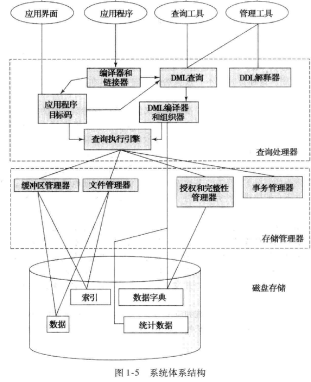

# DBMS

- DBMS抽象为三个层次:视图层、逻辑层、物理层
  - 
- 代码以mysql代码为标准
## 关系数据库

- 关系
  - 同一个关系不能含有相同元组
  - 超码superkey：一个或多个属性，不同元组的唯一标识
  - 候选码candidate key：superkey的真子集
  - 主码primary key：candidatekey的一个
  - 外码foreign key：其它关系的主码作为本关系的属性

```sql

/**为Orders表增加属性fk_CustomerID，作为外键参考Customers表的属性CustomerID*/
ALTER TABLE Orders
ADD CONSTRAINT fk_CustomerID
FOREIGN KEY (CustomerID)
REFERENCES Customers(CustomerID);

```
- DDL：Data Definition Language：数据定义语言
  - 关系模式的定义、修改、删除
  - 完整性约束
  - 视图定义
  - 对视图或关系的访问授权
- DML：Data Manipulation Language：数据操纵语言

## 注释

```sql

-- 单行注释

/*带API说明的注释，或者多行注释
可注释API包括查询、关系、属性等*/
```
## 数据类型

- 整数：`INT`、`TINYINT`、`SMALLINT`、`MEDIUMINT`
- 浮点：`FLOAT`、`DOUBLE`、
  - `DECIMAL`、`NUMERIC`：适用于货币等高精度数据
- 字符串
  - 单引号标识字符串，两个连续的单引号表示打印单引号，双引号不能标识字符串，双引号可以直接打印，单引号也可以使用转义字符打印
   - `CHAR`：固定长度字符
   - `VARCHAR`：可变长度字符
   - `TEXT`：大文本数据
```sql

-- 查看当前服务器、数据库使用的字符集，默认utf8mb4或utf8
SHOW VARIABLES LIKE 'character_set_%';

```
- 日期和时间
   - `DATE`：年-月-日
   - `TIME`：时:分:秒
   - `DATETIME`：日期和时间
   - `TIMESTAMP`：UTC时间戳

- 布尔：`BOOLEAN` 、`BOOL`
- 二进制Binary Types
  - `BINARY`：固定长度二进制
   - `VARBINARY`：可变长度的二进制数据
   - `BLOB`：大二进制数据，如图像或文件

- 枚举：用于存储预定义的枚举值列表中的一个
- 集合：用于存储预定义的字符串值集合中的一个或多个
- 自动增量类型：`AUTO_INCREMENT`：通常用于创建自动增长的整数主键

## 模式定义与完整性约束命令

- 逻辑连词：`and、or、not`
```sql

/**创建数据库*/
CREATE DATABASE mydb;

/**选择数据库*/
USE mydb;


```

- 查看关系模式

```sql

DESCRIBE table_name;
SHOW COLUMNS FROM table_name;

```

- 使用`ALTER TABLE`命令修改表结构

```SQL

//更改表结构

/**创建表格
 * 约束主键将拒绝主码为空、相同的修改，使用AUTO_INCREMENT数据格式将同时满足这两个条件
 *同一个关系只能有一个属性是AUTO_INCREMENT
 */
CREATE TABLE employees (
    employee_id INT AUTO_INCREMENT PRIMARY KEY,
    first_name VARCHAR(50) NOT NULL,
    last_name VARCHAR(50) DEFAULT 'Unknown',
    hire_date DATE
);

/**将已有列设为主键*/
ALTER TABLE employees
ADD PRIMARY KEY (employee_id);

/**将已有列设置为候选码，保证其值唯一*/
ALTER TABLE employees
ADD UNIQUE (email);

/**将已有列设为外键
 * 拒绝外码值不属于被参照关系对应属性的修改
 */
ALTER TABLE orders
ADD FOREIGN KEY (customer_id)
REFERENCES customers(customer_id);

/**为已有列添加断言，断言失败将拒绝修改元组*/
ALTER TABLE employees
ADD CHECK (salary >= 0);

/**为已有列添加默认值，若该关系已有元组在该列值为null，将设置为*/
ALTER TABLE employees
ALTER COLUMN salary SET DEFAULT 50000;

/*添加列*/
ALTER TABLE table_name
ADD column_name datatype;

/*删除列*/
ALTER TABLE table_name
DROP COLUMN column_name;

/*更改数据类型*/
ALTER TABLE table_name
MODIFY column_name new_datatype;

/*更改表名*/
ALTER TABLE old_table_name
RENAME TO new_table_name;

```

- 授权

```SQL

//授权

/**授予SELECT权限给用户：授权用户执行SELECT查询的权限*/
GRANT SELECT ON database_name.table_name TO 'username'@'hostname';

/**授予INSERT权限给用户：授权用户执行INSERT插入数据的权限*/
GRANT INSERT ON database_name.table_name TO 'username'@'hostname';

/**授予UPDATE权限给用户：授权用户执行UPDATE更新数据的权限*/
GRANT UPDATE ON database_name.table_name TO 'username'@'hostname';

/**授予DELETE权限给用户：授权用户执行DELETE删除数据的权限*/
GRANT DELETE ON database_name.table_name TO 'username'@'hostname';

/**授予ALL PRIVILEGES权限给用户：授予用户执行所有操作的权限，包括SELECT、INSERT、UPDATE、DELETE等*/
GRANT ALL PRIVILEGES ON database_name.table_name TO 'username'@'hostname';

/**授予特定数据库的权限：如果要授权用户对整个数据库的权限，而不是单个表格，可以使用以下命令*/
GRANT permission_type ON database_name.* TO 'username'@'hostname';

/**授权所有数据库的权限：如果要授权用户对所有数据库的权限，可以使用通配符* */
GRANT permission_type ON *.* TO 'username'@'hostname';

/**授予GRANT OPTION权限：GRANT OPTION权限允许用户授予他人权限。通常，只有具有SUPER权限的用户才能使用GRANT OPTION*/
GRANT permission_type ON database_name.table_name TO 'username'@'hostname' WITH GRANT OPTION;

/**回收权限：使用REVOKE命令可以撤销之前授予的权限*/
REVOKE permission_type ON database_name.table_name FROM 'username'@'hostname';


```

## 数据库DML命令

```sql

USE database_name;

SHOW DATABASES;

DROP DATABASE database_name;


```


```sql

/**增加元组*/
INSERT INTO table_name (column1, column2, ...)
VALUES (value1, value2, ...);

/**更新元组*/
UPDATE table_name
SET column1 = new_value1, column2 = new_value2, ...
WHERE condition;

/**删除元组*/
DELETE FROM table_name
WHERE condition;


/**检索元组*/
SELECT column1, column2, ...
FROM table_name
WHERE condition;

/**如果主键重复则更新元组，否则插入元组*/
INSERT INTO table_name (column1, column2, ...)
VALUES (value1, value2, ...)
ON DUPLICATE KEY UPDATE column1 = new_value1, column2 = new_value2, ...;

/**插入元组，如果主键重复则删除旧元组并插入新元组*/
REPLACE INTO table_name (column1, column2, ...)
VALUES (value1, value2, ...);

```

- insert into

```sql

/**默认选中关系的所有列*/
INSERT INTO student
VALUES (1, 'John', 25);


/**选中指定列
 * 未选中的列将使用默认值存储，如果未指定默认值，将采用NULL存储，如果约定NOT NULL将不允许插入该列
 */
INSERT INTO student (column1, column2, ...)
VALUES 
    (value1_1, value1_2, ...),
    (value2_1, value2_2, ...),
    (value3_1, value3_2, ...);
INSERT INTO student (column1, column2, ...)
SELECT *
FROM another_student_table

```

- delete

```sql


/**删除所有元组后，将不会重置auto increment*/
DELETE FROM table_name
WHERE condition1 AND condition2
LIMIT N;--仅选中前N行

/**重置auto_increment的值为指定值*/
DELETE FROM table_name;
ALTER TABLE table_name AUTO_INCREMENT = 1;

```

- drop：不可逆的删除

```sql

DROP TABLE table_name; -- 删除关系

DROP DATABASE database_name;-- 删除数据库

DROP VIEW student_view;-- 删除视图

DROP PROCEDURE procedure_name;-- 删除存储过程

DROP TRIGGER trigger_name;-- 删除触发器

```

- update

```sql

UPDATE table_name
SET column1 = value1, column2 = value2,...
WHERE condition;


```

## 查询与谓词

- select：返回一个关系模式及满足谓词为真的元组
- 使用as重命名属性名、关系名、算术表达式
  - 查询过程中、返回的关系中将使用新名称
  - 解决命名冲突(关系命名冲突，即一个关系和自己进行笛卡尔积运算的情况)
  - `select *`：选中from返回关系中的所有属性
  - select默认元组可重复，等价于`select all`，使用`select distinct`去除重复元组
```sql

/*解释
 *笛卡尔积将产生一个关系，其属性名为A.name,B.salary,B.departure等
 *where子句将检查每一个元组的属性是否满足A.salary > B.salary & B.department = 'computer'
 *因此该sql语句的含义是：工资至少比计算机部门其中一个教授高的教授集合
 */
-- 关系名instructor，属性：name、department、salary
select T.name
from instructor as A , instructor as B 
where A.salary > B.salary and B.department = 'computer';

```
- 比较:比较对象可以是单个或多个属性
  - `<=		=		<>`
  - `between...and...`、`not between...and...`

```SQL

where (A.ID,C.name)=(B.ID,D.name)

```

- case end

```sql

-- case end将按顺序依次检查是否满足条件，如果第一次满足条件则立即返回该值，并结束匹配检查

CASE
    WHEN condition1 THEN result1
    WHEN condition2 THEN result2
    ...
    ELSE else_result
END

SELECT
    employee_id,
    first_name,
    last_name,
    CASE
        WHEN salary > 50000 THEN 'High Salary'
        WHEN salary > 30000 THEN 'Medium Salary'
        ELSE 'Low Salary'
    END AS salary_category
FROM
    employees;


```

### 子查询

- where子句嵌套子查询：外查询的元组满足与子查询的指定关系时被保留(必要条件是属性相同)
  - `IN`：检查外查询的元组是否在内查询中
  - `SOME`：至少与子查询中的一个元组满足关系
  - `ALL`：与子查询的每个元组都满足关系
  - 连接词`SOME、ALL`通常与比较运算符一起使用

```sql

SELECT name
FROM students
WHERE age IN (25, 30);

SELECT name
FROM students
WHERE age > SOME (SELECT age FROM other_students WHERE grade = 'A');

SELECT name
FROM students
WHERE age > ALL (SELECT age FROM other_students WHERE grade = 'A');


```

- exists/not exists条件谓词
  - 当且仅当子查询不为空时，该where exists返回true，即保留该元组
  - 通常用于相关子查询，即子查询使用外查询的关系/属性
    - 子查询与父查询命名冲突时，只有子查询的命名有效
  - `where not exists(B except A)`检查B是否为A的子集

```sql

SELECT customer_name
FROM customers c
WHERE EXISTS (
    SELECT 1
    FROM orders o
    WHERE o.customer_id = c.customer_id
);


```


- from子查询

```sql

SELECT city, AVG(grade) AS avg_grade
FROM (
    SELECT s.city, g.grade
    FROM students s
    JOIN grades g ON s.student_id = g.student_id
) AS subquery
GROUP BY city;


```
- with子句
1.with子句：构建一个或多个临时关系；
(1)with
(2)table-name-A(attribute A,attribute B) as(clause)
(3)table-name-B(attribute A,attribute B) as(clause))
(4)...
2.with子句构造的临时关系存储在临时表空间
(1)该临时关系可以被后续SQL语句使用
3.一个with子句内部不能嵌套with子句
在同级select前有多个查询定义的时候，第1个用with，后面的不用with，并且用逗号隔开
## 过滤

- order by
  - 默认为升序，按字典顺序排列
```sql

ORDER BY column1 ASC | DESC, column2 ASC | DESC,;

```

- 分组聚集：
  - 副作用：更改元组顺序，更改聚集函数的作用域
- 聚集函数视为单个属性，其属性名为聚集函数名(被聚集的属性名)，可以使用as为该属性重命名
  - 通常与group by一起使用
  - 除count外，其它聚集函数忽略空值

```sql

SELECT city, SUM(sales)
FROM sales_data
GROUP BY city;


```
- having：必须在group by子句后使用，这意味着having可操控的属性有限

```sql

SELECT customer_id, SUM(order_total) AS total_order
FROM orders
GROUP BY customer_id
HAVING SUM(order_total) > 1000;


```
- 标量子查询：返回具有单一属性、仅有一个元组的关系
## 数据处理函数与模式匹配

- 字符串处理

```sql

/*字符串处理*/

CONCAT()--串联字符串
SUBSTR()/SUBSTRING() --提取子串
LENGTH() 或 LEN()
UPPER() 或 UCASE()
LOWER() 或 LCASE()
REPLACE(原始文本，原始文本中被替代的部分，需要替换的新文本)
TRIM('   Hello   ')去除字符串的前导和尾随空格或指定字符
LEFT() 和 RIGHT()： 用于从字符串的左边或右边截取指定数量的字符
INSTR() 或 LOCATE()： 用于查找子串在字符串中的位置
CONVERT() 或 CAST()： 用于将字符串从一种字符集转换为另一种字符集。

```

- LIKE对单个属性进行通配符匹配
  - '%'匹配0个或多个字符，'_'匹配单个字符，使用'/'进行转移

```sql
SELECT * FROM products WHERE product_name LIKE 'Apple%'; -- 匹配以 "Apple" 开头的产品名
SELECT * FROM customers WHERE last_name LIKE 'Smi_h'; -- 匹配 "Smith" 或 "Smyth" 等姓氏


```

- REGEXP：正则表达式匹配
  - .：匹配任何字符
  - *：匹配前一个字符的零次或多次重复。
  - +：匹配前一个字符的一次或多次重复。
  - ?：匹配前一个字符的零次或一次重复。
  - []：用于定义字符类，例如 [abc] 匹配 'a'、'b' 或 'c' 中的一个字符。
  - [^]：用于否定字符类，例如 [^0-9] 匹配除数字之外的任何字符。
  - ()：用于创建子模式。
  - |：用于表示或
  - \：用于转义特殊字符

## 集合运算

- 运算对象：关系模式兼容的两个关系，返回关系模式与首个关系相同的关系及其元组；
- union
  - union /union distinct：保证元组不重复
    - 最后的结果是有序的，因为在排列前排序元组，所有元组只需要遍历一次就可以确保去除重复元组
  - union all：将所有元组合并到同一个关系中，最后的结果不会是有序的
- intersect
  - intersect all：仅求交集，保留交集中的所有重复元组
  - intersect：去除交集中的重复元组，最后的结果是有序的
- except
  - except：如果参与运算的两个关系都含有相同元组，那么该元组将不会出现在集合中；
  - except all：关系A exccept all 关系B；如果一个元组在A中出现x次，在B中出现y次，x<=y，将不会保留该元组；x>y，将保留x-y个该元组

## 空值

- 算术运算：有空值参与的算术表达式结果为空
- 比较运算：
  - 逻辑值：`true、unknown、false`
  - `not unknown`返回`unknown`
  - 任意值与`null`进行逻辑比较总是返回`unknown`
  - `where A is null`将返回所有A属性为空值的元组
  - `where A=null`将返回空表，因为等价于子句where unknown
- 集合运算包括select distinct中，null将不参与元组相等条件的判定；

## 连接

- 笛卡尔积：返回一个关系，属性由所有关系的属性组成，无论是否同名(因此不要求关系有相同属性)

```sql

SELECT * 
FROM table1, table2;

```

- 内连接：返回的关系模式包括所有关系的属性
  - 与笛卡尔积不同的是：当且仅当在指定属性上值相等(必要条件是数据类型兼容)时，才会进行组合；

```sql

-- 使用on子句进行连接
SELECT * FROM TableA
INNER JOIN TableB ON TableA.Column1 = TableB.Column2;

-- 使用using指定相同属性名作为连接条件
SELECT * FROM TableA
INNER JOIN TableB USING (CommonColumn);

-- 为笛卡尔积使用where子句相当于内连接
SELECT * FROM TableA, TableB
WHERE TableA.Column1 = TableB.Column2;

```

- 自然连接：主动匹配的内连接
  - 与内连接不同的是，用于匹配的属性仅出现一次
  - 通常不与on、using一起使用

```SQL

-- 自动寻找两个表中所有同名的属性作为值匹配条件
SELECT * FROM TableA
NATURAL JOIN TableB;

```
- 外连接：
  - `Left Join`：保留左表的所有元组，如果左表的某个元组与右表中的某个元组相同则将该元组写入返回结果的另一半，否则返回结果中的右表属性全部设为NULL
  - `Right Join`
  - 'full outer Join'：保留左表和右表的所有行，当且仅当两个元组在指定属性上相等时才会处于返回结果的同一个元组中
  - 匹配条件：ON子句、USING子句

## 递归

- 定义初始查询：首先，你需要定义一个初始查询，这是递归查询的起点。该查询将返回基本（或初始）结果集。
- 定义递归部分：然后，你需要定义一个递归部分，这是一个 RCTE，它将引用自身。递归部分通常包括一个 UNION 运算符和一个引用自身的查询。
- 结合初始查询和递归部分：最后，你需要使用 UNION 运算符将初始查询和递归部分组合在一起。

```sql

WITH RECURSIVE EmployeeHierarchy AS (
    -- 初始查询，找出根节点（顶级员工）
    SELECT employee_id, employee_name, manager_id
    FROM employees
    WHERE manager_id IS NULL
    
    UNION ALL
    
    -- 递归部分，连接下级员工
    SELECT e.employee_id, e.employee_name, e.manager_id
    FROM employees e
    JOIN EmployeeHierarchy eh ON e.manager_id = eh.employee_id
)
-- 最终查询，选择所有下属
SELECT * FROM EmployeeHierarchy;


```

# 数据库设计


# 索引和散列
# 查询处理和优化
# 事务
# 并发控制
# 恢复系统
# END