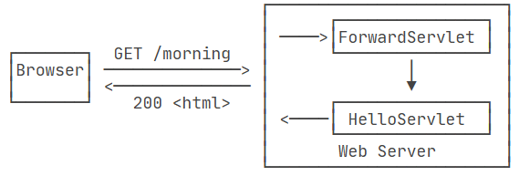

# JVM

## JRE
JRE=JVM、Java标准库、Java运行时的环境支持文件、执行Java程序的工具、jar包
- JVM：Java虚拟机Java Virtual Machine：将Java字节码编译成操作系统机器代码并执行Java应用程序
- jar包：字节码文件，可以直接运行
  - 第三方jar包不应再次编译
## .class

- classpath：一组目录的集合，格式和系统相关；指示jvm在指定目录集合中搜索.class文件
  - 不应该在系统环境变量中设置classpath，而是应该在运行java命令时附带classpath参数
  - IDE自动传入的cp参数是当前工程的bin目录和引入的jar包
  - 约定既不在系统环境变量设置classpath，也不在java命令传入参数，而是在工程根目录运行java命令
```bash

# .代表当前目录
# 分号代表目录的分隔符
# 目录格式与分隔符的格式由操作系统决定
java -classpath .;C:\work\project1\bin;C:\shared abc.xyz.Hello

# 可以将classpath简写为cp
java -cp .;C:\work\project1\bin;C:\shared abc.xyz.Hello

# 按约定不设置系统环境变量，并且没有传入cp参数时，默认classpath是当前命令的目录
java abc.xyz.Hello

```


# JavaSE

library & framework
  - 开发者的代码遵循规定以调用library
  - framework按约定调用开发者的代码
  - Inversion of Control：your code calls a library but a framework calls your code

## 数据类型
变量的类型 = 基本数据类型 + 引用类型
- 引用类型仅可指向对象实例、数组实例的位置，若引用指向的位置没有实例，则该引用的值为`null`
- 引用的值只能通过赋值更改，更改引用的值将使引用指向不同的对象实例、数组，规定引用不能用于计算

声明与初始化
  - 声明变量的类型，将指定数量的内存单元标识为变量名
  - 初始化：在变量名标识的内存空间中存储二进制数
  - 基本数据类型变量所存储的值完全由开发者决定
  - 引用类型变量所存储的值，由垃圾回收器管理，开发者仅需也仅可管理引用与实例之间的指向关系

若对象声明时未显式初始化，JVM将为该对象的域赋予初始值
- number->0、boolean->false、reference->null
- 若局部变量必须在声明时显式初始化

final
- 被final修饰的变量一经初始化就不可更改值
- 被final修饰的reference：代表引用关系固定，该引用应指向不可变对象实例，若指向可变对象则引用变量没有必要被final修饰
- 被final修饰的基本数据类型变量的名字全大写

boolean：不能与其它类型发生类型转换；其值域为true、false，不能写入其它类型的值

数字变量的值只能使用二进制存储
- 整型和浮点型的二进制序列表示方法不同
- 整型采用二进制补码
- 浮点数遵循<A HREF="https://zh.wikipedia.org/zh-hans/IEEE_754">IEEE-754规范</A>
- java不支持无符号数

数字变量的值可翻译为二进制0b、八进制0、十六进制0x、十进制供人阅读
- java：数据的存储和显示分离

数字基本数据类型
  - 
    - 一个小方块代表一个内存单元
    - 一个内存单元代表`1byte=8bit`，使用两个十六进制数表示
  - 约定开发者应总是使用int/double，仅在整型变量的值可能截断时替换为long
    - 200->int，200L/l->long
    - 1.1F/f->单精度浮点数，1.1、1.1D/d->双精度浮点数
  - 类型转换
    - 不允许将使用内存单元更多的字面量或变量，赋值给使用内存单元更少的变量，可以通过强制类型转换打破该规定
    - 
    - 实线：允许隐式类型转换，无溢出风险
    - 虚线：只允许强制类型转换，有溢出/指数截断、尾数截断风险
      - int转float，float指数可偏移127位不存在指数截断的风险，但是尾数只有23位，而int最大数0x7FFF_FFFF，会发生尾数截断造成精度丢失
    - 浮点数转整型时，转科学计数法后直接抛弃小数部分，表现为向下取整；
      - ps：Math.round()工具类提供四舍五入

| 语句                               | 是否合法 | 是否类型转换 | 解释                                                                         |
| ---------------------------------- | -------- | ------------ | ------------------------------------------------------------------------------ |
| `long n = 0xF_FFFF_FFFF`            | 不合法   |            | 数字字面量超过int类型范围，编译器将报错                          |
| `long n = 0xF_FFFF_FFFFL`           | 合法     | 否           | 开发者初始化long变量时，应总是为字面量添加后缀`L/l`                                  |
| `short n = 0xFFFF_FFFF`             | 合法     | 是           | 发生溢出并被计算机截断，变量值为-1                                    |
|float f=3.14|非法||
int = (int)0xFl|合法|是

  
IEEE-754
  - 浮点数二进制序列构成：符号位、指数、尾数
    - 双精度浮点数：符号位1位、指数8位、尾数23位
    - 单精度浮点数：符号位1位、指数11位、尾数52位
  - 浮点数二进制序列转浮点数科学计数法：
    - 假定采用小端法，尾数域的最左边权为$2^{-1}$，转为小数后记为$a$
    - 指数视为无符号二进制转整数记为$b$
    - $1+a$作为有效数字部分
    - 浮点数的科学计数法表示为$(1+a)E(b-127)$或$(1+a)E(b-1023)$
  - IEEE-754规范定义了特殊的变量值的二进制序列，及其翻译出来的记号

| 二进制序列                                   | 记号         | 中文意义        |
| -------------------------------------------- | ------------ | --------------- |
| `01111111100000000000000000000000`           | +∞           | 正无穷大         |
| `11111111100000000000000000000000`           | -∞           | 负无穷大         |
| `00000000000000000000000000000000`  | +0           | 正零             |
| `10000000000000000000000000000000`  | -0           | 负零             |
| `0111111111xxxxxxxxxxxxxxxxxxxxxx`           | NaN          | 非数值（Not a Number） |


运算
  - 关系运算：==、！=、>=等运算符返回boolean类型的字面量
  - 逻辑运算：&&、||采用短路方式从左往右运算
    - `x != 0 && 1/x > x+y`避免产生0除异常
    - && 的优先级高于 ||
  - 三元操作符`?:`
  - 位运算：以二进制位而不是内存单元作为原子单位进行运算
    - `&、|、^、~`
    - 位运算不采用短路
    - \>\>使用符号位填充高位，>>>使用0填充高位，<<使用0填充低位；

char由两个字节存储，使用单引号标注char字面量
- 编码方式决定存储文本文件的二进制序列
- Unicode编码指UTF-16定长编码，英文字符的高字节总是00浪费空间，因此Java使用UTF-8变长编码
- UTF-8共17个语言级别，将char分割为两个码点，通过判断码点的值范围，判断这个码点所属的编码属于哪个语言级别，然后读取1-4个字节转义为文本字符
- UTF-8编码的容错能力强；传输时某些字符出错，不会影响后续字符
- java将UTF-8编码的字符串转换为使用其它编码方式编码的二进制序列方法如下：

```JAVA
/**转换为系统默认编码后的二进制序列*/
byte[] b1 = "Hello".getBytes(); 

/**转换为UTF-8编码后的二进制序列*/
byte[] b2 = "Hello".getBytes("UTF-8"); 

/**转换为GBK编码后的二进制序列*/
byte[] b2 = "Hello".getBytes("GBK");

/**转换为UTF-8编码后的二进制序列*/
byte[] b3 = "Hello".getBytes(StandardCharsets.UTF_8); 

```
- 按指定编码方法，将二进制序列转为UTF-8编码的String
```JAVA

byte[] b = ...
String s1 = new String(b, "GBK");
String s2 = new String(b, StandardCharsets.UTF_8);

```

## 面向对象编程

### 类

名称约定：除类名开头大写，其它命名一律开头小写；

访问控制符可修饰Field、Method、Constructor
- public：所有人可见
- protected：同一个包或子类可见
- 无访问控制符：同一个包可见
- private：类内可见

构造器Constructor
  - 当且仅当没有提供构造器时，编译器才会提供默认的无参构造器
  - 提供自定义构造器后，想调用无参构造器就必须由开发者自行声明
- 与访问控制符、static、final相关的约定：
  - 总是使用private修饰Field
    - 域的名字为$A$时，其更改器访问器方法名为`setA、getA`
  - 不被static修饰的Field标识对象状态，被static修饰的Field标识类状态
  - 当对象状态、类状态一经初始化就不再更改时，应使用final修饰
  - Method不直接或间接依赖对象状态时，应使用static修饰
  - 使用final修饰Method，表示该方法不能被子类重写
- 方法、构造器的参数
  - 参数传递总是进行值的复制
  - 方法、构造器的参数不为空时，代表该方法、构造器对外界具有依赖关系
  - 对非static的方法：传递隐式参数this和显式参数，隐式参数使用this表示，代表调用该方法的对象
  - 对static方法：只有显式参数
  - 对构造器
    - this(parameters)将调用本类的符合参数列表要求的其它构造器，与非static的隐式参数具有不同性质
    - super(parameters)将调用父类的符合参数列表要求的构造器
  - 可变参数列表
    - (int...args)
    - 在方法或构造器内部将args视为数组类型的引用变量进行调用
    - 若没有可变参数列表，就需要定义大量的重载方法，出现大量重复代码
- 局部变量
  - 局部变量的生效范围是整个代码块
  - 对该代码块中的子代码块，不允许定义同名局部变量
  - 局部变量更改值对局部变量代码块之外不可见
  - 局部引用变量更改对象状态后，局部变量代码块之外可见该对象状态的改变
- 方法重载
  - 方法使用方法签名=方法名+参数列表进行标识
    - 方法签名相同时，即使返回值类型不同，编译器也会报错
  - 约定：方法名相同的方法具有单一功能，处理不同的
- 初始化块
  - 对初始化块的数量和位置没有要求
  - 非static初始化块在对象实例化期间进行，每个对象实例化时都会执行一次初始化块
  - static初始化块只会执行一次，在类初次被加载时执行
- 执行顺序
  - 域声明语句，若域声明语句未初始化，则由JVM赋予默认值
  - 按从上到下的顺序依次执行初始化块
  - 按递归的形式执行构造器方法链
  - 约定：
    - 构造器的参数列表不应该依赖于初始化块的执行结果
    - 总是将域的初始化放置在构造器中，确保对象状态的一致性
- 访问器、更改器
  - 约定：即使是在类内部，也不应直接访问域，而是应该通过更改器、访问器方法间接访问，<A HREF="#动态代理">原因</A>
  - 域是布尔类型时，更改器和访问器不应该是get/set，应是is/set
  - 只有getter的域是只读域，只有setter的域是只写域
### 继承相关

- 规范
  - 引用类型是对象类型的父类或接口类型
- 引用、对象实例相关的约定
  - 判断是否为null$\ne$域是否为空
  - 通过引用调用方法前，必须判断引用是否为null
  - 通过引用访问域前，先判断引用是否为null，再判断对象实例的域是否为空
    - 例：String s，`if(s != null && !s.isEmpty())`
  - 设计时应明确分割类职责和对象职责
    - 类职责、对象职责决定类状态、对象状态
    - 类状态由更改器、static初始化块进行控制
    - 对象状态由更改器、构造器、工厂方法、非static初始化块进行控制
- 继承
  - 
  - 引用指向子类对象，可调用子类对象及父类对象的public方法
    - 子类构造器的第一行必须调用父类构造器，子类构造器不能负责控制父类对象状态
    - 如果第一行不是super(parameters)，那么JVM插入代码调用无参构造器，如果父类没有无参构造器将报错；
    - 子类对象内部不仅可通过super.方法名调用父类的public方法，还可以调用父类的protected方法
  - 约定
    - 调用父类方法时只依赖于父类对象的状态
    - 调用子类方法时只依赖于子类对象的状态
  - java只支持公有继承，公有继承与组合的区别：
    - 公有继承时，引用所指的对象中最多只有一个对象，并且该引用既能调用子类对象也能调用父类对象
    - 组合时，引用所指的对象中可有多个对象，每个对象有明确的引用
    - 因此java不支持多重继承，继承链只多只有一条
- 抽象类使用abstract进行标识，表示该类不能实例化
  - 允许抽象类具有域、使用abstract修饰的方法、不被abstract修饰的方法
  - 如果一个类具有被abstract修饰的方法，则必须声明为abstract类
  - 当一个类实现接口或继承抽象类但是不能实现其方法时，必须使用abstract进行修饰
  - 抽象类可以不具有抽象方法
- 重写 & 重载
  - 约定：方法签名不变，职责就不应更改
    - 方法职责 = 参数状态到方法行为的映射集合
    - 方法职责不变 = 映射集合遵守父类定义的契约或映射集合是父类的真子集
    - 方法行为 = 异常、返回的变量、通过引用更改外界定义的对象
  - 重写不应违背里氏替换原则
    - 父类要求子类重构：父类定义契约，子类遵守契约
      - 重写equals()需要遵守五个原则（自反性、对称性、传递性、一致性、null参数总是映射到false）
    - 接口、抽象类要求子类实现抽象方法：子类应遵守接口、抽象类定义的契约
    - 子类因父类算法陈旧等原因重构父类方法：子类不能更改方法职责（参数状态到方法行为的映射关系）；
    - 重写后，指向子类对象的引用不能调用父类方法
    - 重写使用`@Override`注解进行标注
    - 父类不希望子类重写方法时，使用final修饰方法（该方法必须是public否则使用final修饰没有意义），仍可被继承
    - 使用final修饰类，表示不能被继承
  - 重载不应违背里氏替换原则
    - 在子类定义的方法与父类方法同名，但是参数列表不同时，发生重载
    - 子类方法与父类方法处理的参数列表交集为空时，不违背里氏替换原则
    - 子类方法与父类方法处理的参数列表交集不为空时，子类方法的参数列表状态必须是父类参数列表状态的超集
      - 表现为：父类方法能处理的参数状态总是调用父类方法，父类方法无法处理的参数状态才调用子类的重载后的方法
  - 重写、重载后的方法的行为需遵守以下规则
    - 返回值类型是父类方法返回值类型的子类
    - 抛出的异常是父类方法抛出异常的子类，如果父类方法没有抛出异常，则子类不能抛出异常
    - 子类的可见性不能比父类低
  - 遵守上述设计符合里氏替换原则：父类对象能正确工作的地方，替换为子类对象后不会有任何改变
- 继承访问器、更改器方法（不限于setter，包括所有更改域的方法）
  - 当继承访问器、更改器方法时，对外界观察者而言，子类继承了父类的私有域，此时开发者就应当检查访问器、更改器方法是否在子类状态上运算封闭
  - 例如Holiday继承Day的set和get方法时，就必须重写set和get方法，确保指向Holiday的引用不会得到、操控非节假日的日期；
- 优雅地使用多态，而不是愚蠢地使用if

#### Object

- 源码：
  - `getClass()`：不可重写
  - `toString()`所有子类都应重写
  - `hashCode()、equals(Object obj)`：要么都重写要么都不重写
  - `clone()`：要调用就必须先重写

```java
package java.lang;

/** Object类是类层次结构的根，是所有对象的超类：包括数组、异常*/
public class Object {
    public Object() {}

    /**返回运行时静态擦除后的Class对象*/
    public final native Class<?> getClass();

    /**重写hashCode方法必须遵守以下契约：
     *  职责：
     *      返回值作为哈希值供哈希表使用
     *      遵守契约减少冲突概率，提高哈希表性能
     *  一致性：
     *      应用上下文不变（同一个应用程序）且对象状态不变时，多次调用hashCode方法返回相同的哈希值
     *    哈希值不能在对象序列化和反序列化时标识对象
     *  自反、等价：
     *      对象A调用equals方法传入对象B返回true时，A.hashCode()==B.hashCode()返回true
     *      对象A调用equals方法传入对象B返回false时，A.hashCode()==B.hashCode()返回false
     * Object实现了此方法，只要对象不同，返回的哈希值就不同
     * 重写equals方法需要同步重写hashCode方法，该契约规定：相等的对象必须具有相等的哈希码*/
    public native int hashCode();

    /**重写equals()应遵守以下契约
     *  职责：
     *     检查某个对象是否与此对象相等
     *  自反性：
     *    对任何非空引用x，x.equals(x)返回true
     *  对称性：
     *     对任何非空引用x、y，若x.equals(y)返回true，则y.equals(x)返回true
     *  传递性：
     *      对任何非空引用x、y、z，若x.equals(y)返回true且y.equals(z)返回true，则x.equals(z)返回true
     *  一致性：
     *      对任何非空引用x、y，若对象状态未更改，则多次调用x.equals(y)一致地返回true或一致地返回false
     *  null不等价于任何对象
     *    对于任何非空引用值x，x.equals(null)应返回false
     * 遵循以上契约的equals将所有对象划分为等价类或非等价类，等价类的所有成员相互相等
     * Object实现了equals方法，当且仅当引用值相等时，equals返回true，即每个等价类有且只有一个元素，即该对象本身
     * 重写equals方法需要同步重写hashCode方法，该契约规定：相等的对象必须具有相等的哈希码
    */
    public boolean equals(Object obj) {
        return (this == obj);
    }

    /**Object实现clone()方法：构造一个新的对象，该对象状态等于源对象状态，Object实现的clone()方法满足以下约定
     *    x.clone()!=x返回true
     *    x.clone().getClass() == x.getClass()返回true
     *    x.clone().equals(x)返回true
     *    x.hashCode()==x.clone().hashCode()返回true
     * 子类如何调用clone()方法
     *    将clone()方法的可见性从protected升级到public
     *    实现Cloneable标记接口
     *    更改方法体内容，更改返回值的类型为更严格的子类型
     *    因为子类一定会重写clone方法，浅拷贝和深拷贝的区别只有方法体的实现
     *    如果方法体只有一条语句：super.clone()，则代表采用浅拷贝
     *    如果方法体对每个指向可变对象的引用调用clone()方法，则代表采用深拷贝
     * 浅拷贝与深拷贝
     *    若对象状态仅由基本数据类型和指向不可变对象的引用组成，则适合使用浅拷贝；只要对象状态具有指向可变对象的引用，则必须采用深拷贝
     *    因为需要对每个指向可变对象的引用调用clone()方法，因此需要保证这些可变对象的类重写clone()方法并实现Cloneable接口，通过这种方法，替换引用所指的对象和引用的值；
     * 约定
     *    只要遵守上述步骤实现浅拷贝或深拷贝，就能满足Object定义Clone方法的契约，尽管这不是必须遵守的
     *    数组对象实现Cloneable接口，只要可变的数组元素引用实现Cloneable接口就能正常调用Cloneable接口
    */
    protected native Object clone() throws CloneNotSupportedException;

    /**Object实现的toString方法
     *    类名@无符号十六进制哈希值
     * 默认的toString方法依赖于哈希值，间接依赖于对象状态、JVM实现、应用程序上下文
     *    不能在不同时间、不同JVM之间稳定
     * 所有子类都应该覆盖此方法
    */
    public String toString() {
        return getClass().getName() + "@" + Integer.toHexString(hashCode());
    }
}


```
- ==与equals
  - ==的含义：是否引用同一个对象实例
  - equals的含义：两个对象实例是否属于同一个等价类
- 调用equals()、hashCode()前应判断是否为null，一共四种状态共需判断三次，因此采用方法二使用静态方法对方法一进行封装
  - java.util.Objects.equals(s1,s2)
  - 基本数据类型转换为封装类：统一使用静态方法Double.hashCode()
  - Objects.hashCode()
    - 对象为null时返回0
  - Arrays.hashCode()
    - 将使用所有数组元素返回的hashCode进行运算
  - Objects.hash(变量)
    - 对所有变量（引用变量和基本数据类型）调用hashCode进行加权运算
```java

/*方法一：不推荐使用*/
if (s1 == null && s2 == null)
    return true;
else if (s1 == null || s2 == null)
    return false;
else
    return s1.equals (s2)

/*方法二*/
java.util.Objects.equals(s1,s2)

```
- 重写toString()
  - 测试（Assert&debug）、日志、打印对象、打印Collection
  - 约定：
    - 对象总是应该重写toString方法，如果不重写，就不该通过实例化对象调用toString方法
    - 重写toString方法时，打印对象状态，每个域使用,进行分割
    - 子类重写toString方法时通过super.toString进行调用
  - 自定义实现
    - 使用StringBuilder(初始容量)进行固定格式的拼接（使用String的拼接性能差）
    - 例如：`id=1,name=小王,sex=女`
  - 数组对象没有重写toString方法，因此不该通过数组引用调用toString
    - 使用静态方法Arrays.toString()返回String
- 重写equals()、hashCode()
  - 约定
    - 要么同时重写equals和hashCode方法，要么都不重写
    - 重写时，只要对象状态相同，equals就应该返回true，其hashCode也是相同的
    - 重写时，如果语义相等是对象状态的子集，那么equals和hashCode使用的子集应是相等的；
    - 重写时，不能直接使用引用的值判断，而应使用静态方法`java.util.Objects.equals`，因为要求参与比较的对象也重写了equals方法
  - 重写的细节
    - equals内部需要判断是否指向同一个对象
    - 然后判断该对象是否为null
    - 然后判断两个对象的类型关系，这里涉及两个对象在同一条继承链上的问题，如果用于判断是否相等的域子类和父类都有，那么只需要判断能否转型为某个父类（instanceof），如果用于判断是否相等的域只有本类拥有，就需要判断能否转型为该子类（getClass然后判断两个Class对象是否相等）
    - 然后依次判断基本数据类型，对引用字段调用`java.util.Objects.equals`
  - 集合判断key是否相同时，使用hashCode而不是equals
  - 重写hashCode时需要选择每个域所使用的倍数，通常选择17等质数；
- 重写clone()
  - implement Cloneable接口
  - 重写clone方法，第一句总是调用thisClass a = (thisClass)super.clone()方法，并转型
  - 然后对a域中的引用类型依次调用clone方法，返回值通过更改器方法重新赋予给该字段
    - 注意按照约定，即使是内类部也应该通过更改器对域进行访问，避免动态代理报错；
  - 将访问控制提升到public（非必要）
  - 将返回类型从Object提升到thisClass


#### 内部类

- 内部类是编译器级别的处理，虚拟机只知道内部类对象通过隐式引用访问外部类对象；
- 截止23.12.4，除封装性外，并未遇见内部类的重要使用；
### 接口相关


#### 接口
- 接口的设计思想
  - 接口是对实现类职责的公开声明，当不向他人提供服务时，就不该定义接口；当使用他人服务时，必须通过接口调用其服务
  - 信任规范所定义的接口，不信任接口的实现，使用接口类型的引用而不是实现类型的引用，避免第三方服务侵入业务逻辑代码；
- 语法
  - 每个类有且仅有一条继承链，但是可以拥有$[0,\infin)$个接口链
    - 判断接口的类型：`object instanceof aInterface`
  - 允许接口链与继承链拥有相同的方法签名，但是当接口链提供方法实现时可能会产生冲突
    - 定义相同的方法签名往往是为了在注释中说明不同的职责，实现者应同时承担接口链中与继承链中的职责；
    - 若继承链在相同的方法签名中提供实现，那么接口链中提供实现是一种错误设计，因为接口中的实现总是会被覆盖；此时允许接口链中提供相同的方法签名，在注释中写明额外职责并期望实现者会遵守约束
    - 若继承链未在相同的方法签名中提供实现，那么在接口链中提供实现默认继承链中的相同方法现在不会，以后也不会提供实现；
    - 接口链中有且至少有一个相同方法提供实现时，会在实现类产生冲突，解决冲突的方式有两种：当冲突无法在该实现类解决时，使用abstract修饰实现类；当冲突可以在该实现类解决时，提供实现即可（重写
```java
public interface service {
    //不能声明非static域
    private static double StandardPI = 3.14;
    private static double ExtendedPI = 3.1415;
    //非default、static修饰的方法不能添加方法体
    static double getStandardPI(){
        return StandardPI;
    }
    default double getExtendedPI(){
        return ExtendedPI;
    }
}

```
- 遗留问题
  - jdk1.8之前不允许在接口中定义方法，出现许多成对的接口-工具类（提供静态方法）
  - 实际上完全可以将工具类的静态方法添加到接口中；为了所谓的符合抽象规范（实际上为接口方法添加实现并没有任何不合理的地方），提高了设计成本、使用成本；是一种过度设计

#### 函数式接口
Java不支持单独定义函数，静态方法可视为独立的函数，实例方法隐含地传入了一个this变量

在`java.util.function`中定义了大量函数式接口
  - 
  - 
  - 约定
    - 小写字母代表主数据类型，大写字母代表类
    - 函数式接口的名称及其意义与参数列表、返回类型匹配
    - 函数式接口存在大量形如intSupplier的接口，以避免自动装箱拆箱
```java

/**@FunctionalInterface注解：声明该接口为函数式接口
 *    启动编译时检查，若该接口定义多个抽象方法或未定义抽象方法，将不会通过编译
 *    启用对lambda表达式、方法引用、构造器引用的支持
*/
@FunctionalInterface
/**T类型的对象集合映射到R类型的对象集合*/
public interface Function<T, R> {
    R apply(T t);

    /**@return复合函数Function<V, R> @param <V> {@code before}：
     *    先调用before接口的抽象方法：T apply(V v)
     *    再调用本接口的R apply(T t)
     *    V类型的对象集合(调用者输入的参数)->T类型的对象集合->R类型的对象集合(调用者得到的参数)
     * @throws NullPointerException               ，若before是null
     */
    default <V> Function<V, R> compose(Function<? super V, ? extends T> before) {
        Objects.requireNonNull(before);
        return (V v) -> apply(before.apply(v));
    }

    /**@return复合函数Function<T, V> @param <T> {@code after}：
     *    先调用本接口的抽象方法：R apply(T t)
     *    再调用after接口的V apply(R r)
     *    T类型的对象集合(调用者输入的参数)->R类型的对象集合->V类型的对象集合(调用者得到的参数)
     * @throws NullPointerException 如果after为null
     */
    default <V> Function<T, V> andThen(Function<? super R, ? extends V> after) {
        Objects.requireNonNull(after);
        return (T t) -> after.apply(apply(t));
    }
}
```

- 将所有只拥有一个抽象方法的接口视为函数式接口并开启函数式编程的支持；
  - `@FunctionalInterface`注解将单方法接口标注为函数式接口
  - 函数式接口仅拥有一个方法，其它方法都是default方法或static方法

```java

@FunctionalInterface
public interface Comparator<T> {
  int compare(T o1, T o2);
}


@FunctionalInterface
public interface runService {
    void runService();
}
public static void main(String[] args){
    runService run = (i)->{System.out.println (i);};
    int i=0;
    while(i<10){
        run.runService (i++);
    }
}
```
- lambda语法

```java
/**括号
 *    无参数或多个参数时必须书写()
 *    仅有一个参数时省略()
 * 花括号
 *    仅有一条语句时，省略花括号和return
 * 类型说明
 *    代码块所装入的方法明确约束类型参数时，可在lambda中省略类型说明
 * return
 *    若存在if语句，则必须在每个条件分支都写上return语句
 *    当只有一条语句时，省略return并将该语句的表达值作为返回值（如果有的话）
 * 
*/
(params here)->{code here};
/**此处代码块所装载的方法明确指出参数类型是String，所以无需在lambda表达式中说明类型参数为String，交给JVM自行判断*/
Comparator<String> comp=(first, second)->first.length()-second.length(); 


```

- lambda作用域
  - lambda语句中可使用外围作用域中的自由变量，当传递代码块时，被lambda使用的自由变量将会被捕获装入匿名类一同传递，遵守值的复制
  - 当lambda延迟调用时，源自由变量被析构不会对lambda中使用的变量有任何危害
  - 当lambda并发调用时，源自由变量更改或者代码块中更改被捕获的自由变量都有可能造成并发问题，因此要求源自由变量是最终值，代码块中不允许对自由变量进行更改；
  - lambda中的变量，与lambda所在作用域中的变量不能同名
- 自定义函数式接口
  - 使用注解`@FunctionalInterface`标记接口
  - 任意有且仅拥有一个抽象方法的接口都是函数式接口，但是使用注解将避免增加抽象方法
- lambda、方法引用、构造器引用有且只有一个能力：将参数、代码块、返回值分别装入函数式接口的抽象方法
  - 在没有函数式编程时，需要定义一个实现类，实现某个仅拥有一个抽象方法的接口，并用业务逻辑代码实现抽象方法，然后实例化这个实现类，并通过传递对象的形式间接传递代码块；
  - Jdk1.8之后对所有仅拥有一个抽象方法的接口开启函数式编程的支持
  - 调用参数中拥有函数式接口的方法时，只需传入lambda表达式、构造器引用、方法引用，Jvm将自动实现匿名类
  - 函数式编程的优势：清晰简洁地传递代码块，而无需考虑代码块的命名，只需关注业务逻辑，包括：参数、实现、返回值；方法名不再重要；

```java
Function<Integer,Integer> function = (num)->{return num*num;};
function.apply (1);
```

- 再谈Comparator
  - Comparator是仅有一个抽象方法的接口，Arrays.sort静态方法允许传入数组及比较器，其定义和使用lambda的方式如下
  - 数组元素T本身可实现Comparable接口，但是Comparable接口只能定义一种自然顺序，当T类型的对象组成的集合拥有不止一种自然顺序时，就需要Comparator比较器定义另一种自然顺序；
  - 例如，String实现了Comparable接口，使用字典顺序作为自然顺序；但是当业务逻辑需要使用字符数量作为自然顺序时，自然就需要Comparator；
  - 假定我们需要复用排序规则以确定更复杂的自然排序，那么就需要使用thenComparing系列方法，此处省略，在需要时阅读源码即可
  - comparing、thenComparing提供形如comparingInt等形式的方法，避免自动装箱拆箱
  - 同时Comparator提供reverseOrder以支持将自然顺序进行逆序

```java

public static <T> void sort(T[] a, Comparator<? super T> c){
  if (c == null) {
    sort(a);
  } else {
    if (LegacyMergeSort.userRequested)
      legacyMergeSort(a, c);
    else
      TimSort.sort(a, 0, a.length, c, null, 0, 0);
  }
}
public static void main(String[] args){
  String[] a={"1234","12","1","123"};
  Arrays.sort (a,(str1,str2)->{return str1.length ()-str2.length ();});
  System.out.println (Arrays.toString (a));
}
//方法引用，等价实现
public static void main(String[] args){
  String[] a={"1234","12","1","123"};
  Arrays.sort (a, Comparator.comparingInt (String::length));
  System.out.println (Arrays.toString (a));
}


```

方法引用、构造器引用
  - 使用现成的方法、构造器完成代码的传递
  - 上述使用键提取器完成比较器的构造使用了方法引用，假设现在的排序规则是对字符串排序而不考虑字母的大小写，可使用以下方法
    - `Arrays.sort({"dsA","acs","Adb"},String::compareToIgnoreCase)`
  - 假设需要传递打印的动作，只需传递以下表达式
    - `System.out::println`
  - 因此方法引用允许三种情况
    - object::instanceMethod，this::instanceMethod，super::instanceMethod
    - Class::staticMethod
    - Class::instanceMethod
  - 比较特殊的是第三种情况，需要在调用时额外传入该类的对象作为第一个参数
    - 例如传递`String::compareToIgnoreCase)`等价于
    - `(x,y)->x.compareToIgnoreCase(y)`
  - 传递方法引用时并未提供参数列表，因此默认开启重载
    - 当调用时，会从上下文选择合适的重载方法
  - 同lambda表达式，方法引用同样会被装入函数式接口
- 构造器引用和方法引用不同的地方在于，通过new引用，也是默认开启重载
  - 比较特殊的数组类型，也可以建立构造器引用
    - `int[]::new`：一个方法参数作为数组的长度
    - 等价于lambda表达式:`x->new int[x]`
  
```java
ArrayList<String> names = {"Jogn","Mose","Regure"};
Stream<Person> stream = names.stream().map(Person::new);
List<Person> people =stream.collect(Collectors.tolist());

```


### Java核心对象

#### wrapper
- 包装类包括：`Integer、Long、Float、Double、Short、Byte、Character`
- 当包装类不是null时，通过自动拆箱和自动装箱实现基本数据类型与包装类的等价
  - 对null进行自动拆箱将抛出异常
  - 因为包装类的域被final修饰，所以混用基本数据类型与包装类时将返回基本数据类型
  - 总是使用静态工厂方法valueOf进行装箱，因为包装类是不变类，同String，不同的引用可以指向相同的实例，如果使用new，底层系统就失去了优化的机会
- parse开头代表将字符串转为指定类型的静态API
    - `Integer.parseInt("100", 16)`按十六进制将指定字符串转义为整数
- 整型转字符串
    - `toString(100)`：转十进制
    - Integer.toString(100, 36)：转36进制
    - Integer.toHexString(100)： 转16进制
    - Integer.toOctalString(100)： 转8进制
    - Integer.toBinaryString(100)： 转2进制
- 所有包装类继承自Number，将一个数装箱后，获取该数的不同表示
    - `Number num = new Integer(999);`
    - `byte b = num.byteValue();`
    - `int n = num.intValue();`
    - `long ln = num.longValue();`
    - `float f = num.floatValue();`
    - `double d = num.doubleValue();`
- 使用静态工具类将有符号数转无符号数
    - `Byte.toUnsignedInt(x)`
    - 若x是-1，则结果为255
#### 枚举
- 枚举类通过enum进行声明
  - 枚举类通过构造函数构造常量，每个常量是枚举类的一个对象实例
- 下面两种class实际上等价，但是枚举类遵守语义更易理解
```java
public enum ErrorResponse{
    ITEM_NOT_FOUND(1001, "项目不存在");
    ErrorResponse (int code, String msg){
        this.code=code;
        this.msg=msg;
    }
    private final int code;
    private final String msg;
}

public class ErrorResponse{
    public final static ErrorResponse ITEM_NOT_FOUND = newErrorResponse(1001, "项目不存在");
    
    ErrorResponse (int code, String msg){
        this.code=code;
        this.msg=msg;
    }
    
    private final int code;
    private final String msg;
}
```
- 所有枚举类继承自Enum接抽象类
```JAVA
public abstract class Enum<E extends Enum<E>>
        implements Constable, Comparable<E>, Serializable {
    /**枚举实例的名字，通过toString进行访问*/
    private final String name;

    /**返回枚举实例的名字*/
    public final String name() {
        return name;
    }

    /**该字段表示枚举实例构造的顺序，表现为在枚举类中从上到下的声明顺序；非必要不使用该字段*/
    private final int ordinal;

    /**返回枚举实例声明的顺序*/
    public final int ordinal() {
        return ordinal;
    }

    /**返回枚举实例的名字，但是可以由开发者重写*/
    public String toString() {
        return name;
    }

    /**因为枚举实例是单例模式，因此使用==和equals效果一样，但是语义不同*/
    public final boolean equals(Object other) {
        return this==other;
    }

    /**不允许克隆，如果在子类内部调用该方法总是抛出异常，标记为final不允许继承*/
    protected final Object clone() throws CloneNotSupportedException {
        throw new CloneNotSupportedException();
    }

    /**首先判断二者的类型能否比较，再判断二者声明顺序的大小*/
    public final int compareTo(E o) {
        Enum<?> other = (Enum<?>)o;
        Enum<E> self = this;
        if (self.getClass() != other.getClass() && // optimization
            self.getDeclaringClass() != other.getDeclaringClass())
            throw new ClassCastException();
        return self.ordinal - other.ordinal;
    }
```

#### String
- 常用核心方法
```java

int length();

boolean equals(Object obj)

/**判断忽略大小写后的字符串是否相等*/
boolean equalsIgnoreCase(String anotherString)

/**字符串长度不为0返回true*/
boolean isEmpty();

/**字符串包含非空白字符返回true*/
boolean isBlank();
```
- 拆分||拼接

```java
/**根据给定的正则表达式拆分字符串*/
String[] split(String regex);

String concat(String s)

/**静态方法*/
String.join(String...strs)
```


- 子串||索引

```java
/**返回指定位置的字符*/
char charAt(int index);

/**返回指定子字符串在此字符串中第一次出现的索引*/
int indexOf(String str);

/**返回指定子字符串在此字符串中最右边出现的索引*/
int lastIndexOf(String str);

/**返回从指定索引开始到末尾的子字符串
 * 包含起始索引上的字符
 * */
String substring(int beginIndex);

/**返回指定范围内的子字符串
 * 包含起始索引上的字符
 * 不包含结束索引上的字符
 * */
String substring(int beginIndex, int endIndex);

/**判断是否以指定字符串为前缀*/
boolean startsWith(String prefix);

/**判断是否以指定字符串为后缀*/
boolean endsWith(String suffix);

/**判断字符串是否包含指定的字符序列*/
boolean contains(CharSequence sequence);
```

- 显示控制
```java
String toLowerCase();

String toUpperCase();

/**删除首尾空格，返回副本*/
String trim();

/**删除首尾空格，包括中文的空格字符\u3000*/
String strip()
```

- 格式化字符串
  
```java
/**将参数依次替换字符串中的占位符*/
String formatted()

/**静态方法*/
String.format()

String s = "Hi %s, your score is %d!";
System.out.println(s.formatted("Alice", 80));
System.out.println(String.format("Hi %s, your score is %.2f!", "Bob", 59.5));
```
- 正则

```java
/**将所有旧字符替换为新字符，返回一个新字符串*/
String replace(char oldChar, char newChar);

/**使用新字符串替换正则表达式匹配的所有子字符串*/
String replaceAll(String regex, String replacement);

/**判断字符串是否与给定的正则表达式匹配*/
boolean matches(String regex);
```

- valueOf

```java
/**返回对象的字符串表示形式*/
static String valueOf(Object obj);

/**返回字符数组的字符串表示形式*/
static String valueOf(char[] data);

/**返回字符数组的指定范围的字符串表示形式*/
static String valueOf(char[] data, int offset, int count);

/**返回布尔值的字符串表示形式*/
static String valueOf(boolean b);

/**返回字符的字符串表示形式*/
static String valueOf(char c);

/**返回整数的字符串表示形式*/
static String valueOf(int i);

/**返回长整数的字符串表示形式*/
static String valueOf(long l);

/**返回浮点数的字符串表示形式*/
static String valueOf(float f);

/**返回双精度浮点数的字符串表示形式*/
static String valueOf(double d);

```
#### StringBuilder

- 每次使用+拼接Stirng或调用String的append操作都会创建临时String对象然后由GC进行回收
  - 不需要使用StringBuilder替代普通的字符串+操作
  - JVM在编译时自动把多个连续的+操作编码为StringConcatFactory，自动优化为StringBuilder
- 现在完全没有必要使用StringBuffer
- StringBuilder
  - 职责：在预分配的可变长度缓冲区中高效操作字符串
- 构造器
```java
/**无参构造器，默认预留16个char大小的空缓冲区*/
public StringBuilder(){
  super(16)
}

/**创建指定大小的空缓冲区*/
public StringBuilder(int capacity) {
    super(capacity);
}

/**创建一个缓冲区，其长度为str.length + 16*/
public StringBuilder(String str) {
    super(str);
}

/**创建一个缓冲区，其长度为seq.length + 16*/
public StringBuilder(CharSequence seq) {
    super(seq);
}
```
- append
  - 追加字符串，如果参数为空，则追加字符串"null"
  - 返回this，因此允许链式操作
```java
public StringBuilder append(Object obj)

public StringBuilder append(String str)

public StringBuilder append(StringBuffer sb)

public StringBuilder append(CharSequence s)

public StringBuilder append(CharSequence s, int start, int end)

public StringBuilder append(char[] str)

public StringBuilder append(char[] str, int offset, int len) 

public StringBuilder append(boolean b)
public StringBuilder append(char c)
public StringBuilder append(int i)
public StringBuilder append(long lng)
public StringBuilder append(float f)
public StringBuilder append(double d)
```

#### SpringJoiner

```JAVA

private final String prefix;
private final String delimiter;
private final String suffix;

/**StringJoiner没有添加prefix、suffix或调用add方法时，调用toString返回空字符串
 * 设置EmptyValue后，当调用toString返回EmptyValue的值
*/
setEmptyValue(CharSequence emptyValue)


/**若既没有调用setEmptyValue，也没有调用add，也没有初始化prefix、suffix，则返回空字符串*/
StringJoiner(CharSequence delimiter)

/**若没有调用add
 *  优先返回setEmptyValue
 * 若没有设置setEmptyValue则返回prefix + suffix*/
StringJoiner(CharSequence delimiter, CharSequence prefix, CharSequence suffix)

/**没有元素返回prefix + suffix或emptyValue
 * 否则返回prefix+到目前为止使用 delimiter 分隔的值+suffix
*/
toString()

/**如果 newElement 为 null，则添加 "null"
 * 分隔符只存在于两个元素之间
*/
add(CharSequence newElement)

/**合并两个StringJoiner
 * 如果other不为空，则将其内容的副本添加为下一个元素
 * 如果other使用不同的分隔符，则将另一个 StringJoiner 中的元素与该分隔符连接起来，将结果附加到此 StringJoiner 作为单个元素。
*/
merge(StringJoiner other)

/**返回toString返回的内容的长度
 * 如果没有调用 add 方法，则将返回字符串表示形式的长度（即 prefix + suffix 或 emptyValue 的长度）*/
length()
```

#### BigInteger
<a href="https://www.liaoxuefeng.com/wiki/1252599548343744/1279767986831393">1</a>

#### BigDecimal
<a href="https://www.liaoxuefeng.com/wiki/1252599548343744/1279768011997217">1</a>


### Java核心接口


#### Comparable接口&Comparator比较器接口
- `Comparable<T>`
  - String实现Comparable接口，按字典顺序比较大小

```java

public interface Comparable<T>{
  /**职责：比较当前T类型对象与指定T类型对象的顺序
   *    T类型对象的集合具有从"小"到"大"的顺序
   *    当前对象"小于"指定对象时，返回负整数
   *    相等，返回零
   *    当前对象"大于"指定对象时，返回正整数
   * 实现者必须确保对于所有的 x 和 y
   *    signum(x.compareTo(y)) == -signum(y.compareTo(x))
   *    若y.compareTo(x)抛出异常，则x.compareTo(y)必须抛出异常
   *    此外还必须确保关系是传递的：(x.compareTo(y) > 0 && y.compareTo(z) > 0) 意味着 x.compareTo(z) > 0
   *    对于所有 z，x.compareTo(y) == 0 意味着 signum(x.compareTo(z)) == signum(y.compareTo(z))
   * 异常说明
   *    如果指定的对象为 null，抛出 NullPointerException
   *    如果指定对象的类型不允许与当前对象进行比较，抛出ClassCastException
   * 强烈建议但不是严格要求
   *    x.compareTo(y) == 0 的同时有 x.equals(y)
   *    若实现类违反上述要求应指明这一事实
   *    建议的标注是：注意：这个类具有与 equals 不一致的自然排序
   * */
  public int compareTo(T o);
}

```

- Comparator比较器接口

```java
@FunctionalInterface
public interface Comparator<T> {
  /**职责：类型T的所有对象组成集合S，比较两个参数在S中的自然顺序
   *    返回一个负整数、零或正整数，分别表示第一个参数小于、等于或大于第二个参数
   * 实现者必须确保对于所有的 x 和 y
   *    signum(compare(x, y)) == -signum(compare(y, x))
   *    只有在 compare(y, x) 抛出异常时，compare(x, y) 才能抛出异常
   *    关系是可传递的：((compare(x, y) > 0) && (compare(y, z) > 0)) 意味着 compare(x, z) > 0。
   *    必须确保 compare(x, y) == 0 意味着对于所有的 z，signum(compare(x, z)) == signum(compare(y, z))。
   * 异常：
   *    NullPointerException：如果一个参数为null，而这个比较器不允许null参数。
   *    ClassCastException：如果参数的类型阻止它们被这个比较器比较
   * 约定
   *    compare(x, y) == 0 等价于 x.equals(y)
   *    任何违反这个条件的比较器应该清楚地指出这一事实
   *    推荐的表述是
   *        注意：此比较器施加的排序与 equals 不一致
   * */
  int compare(T o1, T o2);

  /**从类型T提取用于比较的键，实现键的比较并返回比较器
   * 如果keyExtractor是可序列化的，则返回的比较器也是可序列化的
  */
  public static <T, U extends Comparable<? super U>> Comparator<T> comparing(
          Function<? super T, ? extends U> keyExtractor)
  {
      Objects.requireNonNull(keyExtractor);
      return (Comparator<T> & Serializable)
          (c1, c2) -> keyExtractor.apply(c1).compareTo(keyExtractor.apply(c2));
  }


  default <U> Comparator<T> thenComparing(
            Function<? super T, ? extends U> keyExtractor,
            Comparator<? super U> keyComparator)
    {
        return thenComparing(comparing(keyExtractor, keyComparator));
    }
  /**限制说明   
   *    本方法遵守Object.equals(Object)的一般约定
   *    对于每个对象引用o1和o2，当且仅当signum(comp1.compare(o1, o2)) == signum(comp2.compare(o1, o2))时comp1.equals(comp2)
   * 不重写Object.equals(Object)通常是安全的。然而，在某些情况下，重写此方法可能会提高性能，允许程序确定两个不同的比较器施加相同的顺序
   * */
  boolean equals(Object obj);
```

#### Serializable接口

对象序列化：将实现Serializable接口的对象写入输出流，并在之后读回
- 当对象持有其它对象的引用时，保存该引用的值是没有价值的
- 写入对象的算法
  - 每个对象引用关联一个序列号
  - 每个对象第一次序列化时，保存其对象数据到输出流中
  - 若某个对象之前已经被保存过，那么只写出如下信息：该对象与序列号为x的对象相同，此对象已保存到输出流
- 读入对象的算法
  - 第一次遇到一个对象的序列号时，构建它，并使用流中数据来初始化它，然后记录这个序列号和新对象之间的关联
  - 当遇到如下信息：该对象与序列号为x的对象相同，此对象已保存到输出流时，获取与这个序列号相关联的对象引用

```java
class Employee implements Serializable{...}

ObjectOutputStream out=new ObjectOutputStream(new FileOutputStream("employee.dat"));

Employee harry=new Employee("Harry Hacker", 50000, 1989, 10, 1); 

out.writeObject(harry);

ObjectInputStream in=new ObjectInputStream(new FileInputStream("employee.dat"));

Employee el =(Employee) in.read0bject();
```


某些数据域序列化是无效的，例如本地的文件句柄或敏感信息，使用transient修饰这些域，在对象序列化时跳过这些域


单例模式的类序列化时，不仅需要implements Serializable，而且需要额外的支持才能确保在反序列化时保持单例
- 反序列化机制可绕过私有构造器并构造新的对象，参考如下代码
```JAVA
Orientation original= Orientation.HORIZONTAL;

ObjectOutputStream out=...;
out.write(original);
out.close();

ObjectInputStream in=...;
Orientation saved=(Orientation) in.read();

//测试将失败
if(saved==Orientation.HORIZONTAL)...
```

- 解决办法：定义readResolve方法，在对象被序列化之后调用。该方法必须返回一个对象
## 面向切面编程

### 反射

### 动态代理

#### JDK动态代理

- 运行时反射生成代理实例，通过关联处理器实现对被代理对象
```java
interface Entertainment {
    void offerEntertainment ();
}

class Cinema implements Entertainment {
    @Override
    public void offerEntertainment () {
        System.out.println ("The movie theater is currently offering movie-watching services.");
    }
}

class Stadium implements Entertainment {
    @Override
    public void offerEntertainment () {
        System.out.println ("The stadium is currently providing sports");
    }
}

class EntertainmentProxy implements InvocationHandler {
    private Entertainment entertainment;

    public EntertainmentProxy (Entertainment entertainment) {
        this.entertainment = entertainment;
    }

    @Override
    public Object invoke(Object proxy, Method method, Object[] args) throws Throwable {
        System.out.println("preparing");
        method.invoke(entertainment, args);
        System.out.println("Cleaning");
        return null;
    }
}

public class DynamicProxyExample {
    public static void main(String[] args) {
        Scanner scanner = new Scanner(System.in);
        Entertainment realEntertainment;
        if (scanner.nextInt() == 1)
            realEntertainment = new Cinema();
        else
            realEntertainment = new Stadium();
        Entertainment proxy = (Entertainment) Proxy.newProxyInstance(
                Entertainment.class.getClassLoader(),
                new Class[]{Entertainment.class},
                new EntertainmentProxy(realEntertainment)
        );
        proxy.offerEntertainment();
    }
}
```
#### CGLIB动态代理
### 注解

编译器使用的注解不会被编译进入.class文件
- `@Override`：编译器检查该方法是否正确地实现覆写后丢弃该注解
- `@SuppressWarnings`：通知编译器忽略此处代码产生的警告


工具使用的注解在编译时动态修改.class文件，将这些注解写入.class文件，加载后不留在内存中，不需要程序员处理

程序运行时由Java代码读取的注解，在加载后一直存在于JVM中，
- `@PostConstruct`：被注解的方法在调用构造方法后自动被调用

定义注解时可定义配置参数，配置参数可以是所有的基本类型，但是在编译前必须是常量；
- 允许所有配置参数拥有缺省默认值
- 所有注解拥有一个名为value的配置参数
- 如果只写注解，相当于全部使用默认值
- 如果仅赋予一个值，如`@Check(99)`等价于`@Check(value=99)`
- 如果需要赋予多个值，则必须全部写出，如`@Check(min=0, max=100, value=55)`

注解定义
- 约定最常用的参数命名为value
```JAVA
public @interface Report {
    int type() default 0;//default设定默认值
    String level() default "info";
    String value() default "";
}

```

元注解：修饰其它注解的注解
- @Target：定义注解可使用的合法位置
  - 合法位置可以多个

```JAVA
@Target(ElementType.METHOD)
public @interface Report {...}

@Target({
    ElementType.METHOD,
    ElementType.FIELD
})
public @interface Report {...}
```

| 位置  | 参数 
| ---------------------------------- | -------- | 
| 类或接口            | ElementType.TYPE   |                                |
| 字段           | ElementType.FIELD     |                                           
| 方法           | ElementType.METHOD                | 
|构造方法|ElementType.CONSTRUCTOR|
方法参数|ElementType.PARAMETER

- @Retention定义Annotation的生命周期
  - RetentionPolicy.SOURCE编译期结束后丢弃

  - RetentionPolicy.CLASS：仅保存在class文件中不会被加载进JVM

  -RetentionPolicy.RUNTIME：加载进JVM，并且在运行期可以被程序读取。
- 如果@Retention不存在，则该Annotation默认为CLASS


#### 处理注解

注解是一种class，继承自java.lang.annotation.Annotation，使用反射中的相关API处理某个类、域、方法或构造器中的注解

先判断是否存在再读取
```JAVA
// 判断Person类是否存在@Check注解
Person.class.isAnnotationPresent(Check.class);

// 获取Person类中定义的@Check注解:
Check check = Person.class.getAnnotation(Check.class);

double min = check.min();
double max = check.max();
double value = check.value();
```

直接读取，若不存在则返回null

```JAVA
Class cls = Person.class;
Check check = cls.getAnnotation(Check.class);
if (check != null) {...}
```

获取方法参数的注解需要使用二维数组，因为每个参数可定义多个注解

```java
// 获取Method实例:
Method m = ...
// 获取所有参数的Annotation:
Annotation[][] annos = m.getParameterAnnotations();
// 第一个参数（索引为0）的所有Annotation:
Annotation[] annosOfName = annos[0];
for (Annotation anno : annosOfName) {
    if (anno instanceof Range r) { // @Range注解
        r.max();
    }
    if (anno instanceof NotNull n) { // @NotNull注解
        //
    }
}

```
@Range注解

- 定义

```JAVA
@Retention(RetentionPolicy.RUNTIME)
@Target(ElementType.FIELD)
public @interface Range {
    int min() default 0;
    int max() default 255;
}
```

- 使用

```JAVA

public class Person {
    @Range(min=1, max=20)
    public String name;

    @Range(max=10)
    public String city;
}

```

- 处理
```JAVA
void check(Person person) throws IllegalArgumentException, ReflectiveOperationException {
    // 遍历所有Field:
    for (Field field : person.getClass().getFields()) {
        // 获取Field定义的@Range:
        Range range = field.getAnnotation(Range.class);
        // 如果@Range存在:
        if (range != null) {
            // 获取Field的值:
            Object value = field.get(person);
            // 如果值是String:
            if (value instanceof String s) {
                // 判断值是否满足@Range的min/max:
                if (s.length() < range.min() || s.length() > range.max()) {
                    throw new IllegalArgumentException("Invalid field: " + field.getName());
                }
            }
        }
    }
}
```
### 异常

异常设计的第一个目标：当且仅当开发者需要终止当前线程时线程才会终止

异常设计的第二个目标：正常业务处理逻辑与错误处理逻辑分离

设计BaseException继承自RuntimeException，并从BaseException派生子类
- 为BaseException设计多个构造方法
- 因为继承自RuntimeException，因此属于非受查异常，在方法中抛出后，仅需在全局异常处理器中统一处理
  - 
  - 受查异常：IOException及其子类；要求方法处理或声明
  - 非受查异常：Error及RuntimeException及其子类，不要求捕获或抛出；非受查异常将沿栈抛出直到被捕获


 `try-catch-finally`
  - 无论有多少个catch，每次最多只有一个catch分支会被执行，一个catch分支可以使用|处理多个异常
  - 当`try-catch-finally`用于打开资源

#### 断言

使用assert进行断言，若断言失败将自动抛出AssertionError附带断言内容
- 断言仅用于开发、测试，在生产环境关闭断言

```JAVA
assert x >= 0;

```

### 日志

#### Commons Logging&Log4j

Commons Logging作为日志门户自动挂接Log4j日志系统
- Commons Logging的API：Log、LogFactory
```JAVA
Log log = LogFactory.getLog(Main.class);
```


CommonsLogging日志接口自动搜寻Log4j日志实现，因此只需引入CommonsLogging包，然后确保Log4j设置即可

log4j2.xml

```XML
<?xml version="1.0" encoding="UTF-8"?>
<Configuration>
	<Properties>
        <!-- 定义日志格式 -->
		<Property name="log.pattern">%d{MM-dd HH:mm:ss.SSS} [%t] %-5level %logger{36}%n%msg%n%n</Property>
        <!-- 定义文件名变量 -->
		<Property name="file.err.filename">log/err.log</Property>
		<Property name="file.err.pattern">log/err.%i.log.gz</Property>
	</Properties>
    <!-- 定义Appender，即目的地 -->
	<Appenders>
        <!-- 定义输出到屏幕 -->
		<Console name="console" target="SYSTEM_OUT">
            <!-- 日志格式引用上面定义的log.pattern -->
			<PatternLayout pattern="${log.pattern}" />
		</Console>
        <!-- 定义输出到文件,文件名引用上面定义的file.err.filename -->
		<RollingFile name="err" bufferedIO="true" fileName="${file.err.filename}" filePattern="${file.err.pattern}">
			<PatternLayout pattern="${log.pattern}" />
			<Policies>
                <!-- 根据文件大小自动切割日志 -->
				<SizeBasedTriggeringPolicy size="1 MB" />
			</Policies>
            <!-- 保留最近10份 -->
			<DefaultRolloverStrategy max="10" />
		</RollingFile>
	</Appenders>
	<Loggers>
		<Root level="info">
            <!-- 对info级别的日志，输出到console -->
			<AppenderRef ref="console" level="info" />
            <!-- 对error级别的日志，输出到err，即上面定义的RollingFile -->
			<AppenderRef ref="err" level="error" />
		</Root>
	</Loggers>
</Configuration>
```

#### SLF4J&Logback

工程开发使用SLF4J&Logback

SLF4J：日志接口，API共两个类：Logger、LoggerFactory；

配置logback.xml

```XML
<?xml version="1.0" encoding="UTF-8"?>
<configuration>

	<appender name="CONSOLE" class="ch.qos.logback.core.ConsoleAppender">
		<encoder>
			<pattern>%d{HH:mm:ss.SSS} [%thread] %-5level %logger{36} - %msg%n</pattern>
		</encoder>
	</appender>

	<appender name="FILE" class="ch.qos.logback.core.rolling.RollingFileAppender">
		<encoder>
			<pattern>%d{HH:mm:ss.SSS} [%thread] %-5level %logger{36} - %msg%n</pattern>
			<charset>utf-8</charset>
		</encoder>
		<file>log/output.log</file>
		<rollingPolicy class="ch.qos.logback.core.rolling.FixedWindowRollingPolicy">
			<fileNamePattern>log/output.log.%i</fileNamePattern>
		</rollingPolicy>
		<triggeringPolicy class="ch.qos.logback.core.rolling.SizeBasedTriggeringPolicy">
			<MaxFileSize>1MB</MaxFileSize>
		</triggeringPolicy>
	</appender>

	<root level="INFO">
		<appender-ref ref="CONSOLE" />
		<appender-ref ref="FILE" />
	</root>
</configuration>

```


## 泛型

向上转型，若A是B的子类，T是Y的子类
- `A<T>`可向上转型为`B<T>`
  - 例如`ArrayList<T>`可以向上转型为`List<T>`
- `A<T>`不可向上转型为`A<Y>`、`B<Y>`
  - 假设U是Y的子类，`A<T>`向上转型为`A<Y>`后可接受`A<U>`

使用泛型
```JAVA
// 可省略泛型类型声明
// 此处使用向上转型
List<Number> list = new ArrayList<>();
```

静态方法、静态域使用泛型

```JAVA
// 该代码无法通过编译
// 原因：静态方法使用的T类型需要在运行时才能确定
public class Pair<T> {
    private T first;
    private T last;
    public Pair(T first, T last) {
        this.first = first;
        this.last = last;
    }
    public T getFirst() { ... }
    public T getLast() { ... }

    // 对静态方法使用<T>:
    public static Pair<T> create(T first, T last) {
        return new Pair<T>(first, last);
    }
}

```
- 但是静态域、静态方法可以在泛型类、普通类中单独定义泛型
  - 即使将下述代码中的K更改为T，Pair`<T>`与静态方法中的`<T>`也是不相关的
```JAVA
public class Pair<T> {
    private T first;
    private T last;
    public Pair(T first, T last) {
        this.first = first;
        this.last = last;
    }
    public T getFirst() { ... }
    public T getLast() { ... }

    // 静态泛型方法应该使用其他类型区分:
    public static <K> Pair<K> create(K first, K last) {
        return new Pair<K>(first, last);
    }
}

```

擦除
- 编译器将擦除泛型后的代码交给虚拟机
- 因为采取擦除，所以泛型不能是基本类型，也无法取得运行时实际类型的class，总是返回擦除后的类型
  - 例如`Pair<String>`一定返回`Pair<Object>`；因为虚拟机永远只能看到`Pair<Object>`
- 不能获取泛型的实例，`new T()`是非法的
  - 可以通过Class实例的newInstance方法获取实例
```JAVA

public class Pair<T> {
    private T first;
    private T last;
    public Pair(Class<T> clazz) {
        first = clazz.newInstance();
        last = clazz.newInstance();
    }
}

```

泛型继承
- `public class HttpResult<T> extends HashMap<String,Object>`
- 子类和父类的泛型没有关系，非泛型子类可继承泛型父类`public class MyList extends ArrayList<Integer>`，通常情况下正常使用即可
- 子类确实保存了父类的泛型信息，也可以获取父类的泛型类型(略)

### 通配符

#### extends
使用extends通配符扩展方法参数或方法返回值的泛型类型
- 假设T是K的父类，`A<T>`作为方法参数或方法返回值时，仅匹配`A<T>`或`B<T>`类型（B是A的父类或接口类型），不接受`A<K>`类型
- 使用? extends上界通配符，在方法参数或方法返回值中扩展可匹配类型：`A<? extends T>`接受`A<K>`类型
- 尽管上界通配符在方法参数中能够扩展可匹配类型，但是存在限制；传入的引用只能调用读方法，但是不能调用写方法
  - 调用读方法仍然可以向上转型兼容
  - 调用写方法可能因为不同子类之间相互赋值而不兼容，因此该行为被编译器禁止
  - 如果方法参数传入null，可以通过传递给写方法的参数的检查；
- `List<Integer>`允许读写
- `List<? extends Integer>`只读
```JAVA
// 正确代码
int sumOfList(List<? extends Integer> list) {
    int sum = 0;
    for (int i=0; i<list.size(); i++) {
        Integer n = list.get(i);
        sum = sum + n;
    }
    return sum;
}

// 错误代码
void setAll(List<? extends Integer> list) {
    for (int i = 5; i>0; i--) {
        list.add(i);
    }
}

```

extends通配符限定T类型

```JAVA

//此时只能定义Number及其子类的泛型
public class Pair<T extends Number> { ... }

```

#### super

在方法参数中使用`Pair<? super Integer>`扩展可匹配类型，此时允许传入`Pair<Integer>`、`Pair<Number>`及`Pair<Object>`三种引用
- 在该方法内部，允许对该对象调用set类型的方法，因为实际对象是向下兼容的
  - 若实际对象不允许调用则属于逻辑问题
- 调用get类型的方法时，只能使用Object类型的引用接收，若使用任何其它类型的引用，假设传入的是其父类引用，就会发生向下转型，而向下转型是不允许的
- 综上所述：使用<? super Integer>通配符作为方法参数，表示方法内部代码对于参数只能写，不能读。
```JAVA

void set(Pair<? super Integer> p, Integer first, Integer last) {
    p.setFirst(first);
    p.setLast(last);
}
```
#### extends vs super

该库代码展示extends和super在方法参数中使用的意图
- copy()方法内部不会读取dest，因为不能调用dest.get()来获取T的引用
- copy()方法内部也不会修改src，因为不能调用src.add(T)
```JAVA

public class Collections {
    // 把src的每个元素复制到dest中:
    public static <T> void copy(List<? super T> dest, List<? extends T> src) {
        for (int i=0; i<src.size(); i++) {
            T t = src.get(i);
            dest.add(t);
        }
    }
}
```
#### 无限定通配符

因为<?>通配符既没有extends，也没有super，因此：
- 不允许调用set(T)方法并传入引用（null除外）；
- 不允许调用T get()方法并获取T引用（只能获取Object引用）
- 既不能读，也不能写，那只能做一些null判断：
```JAVA

void sample(Pair<?> p) {
}

```
## 集合

接口与实现分离
- Collection作为除Map外其它集合类的根接口
- java.util包提供三个类型的接口
  - List：有序表接口
  - Set：无重复元素的集合
  - Map：键值对集合
- Java集合通过Iterator提供的统一API进行统一访问，而无需关注集合的存储实现
- 通过每个接口返回的Iterator对象进行遍历的效率总是最高的
  - for-each需要被遍历的集合返回iterator实例，从而将foreach循环变更为使用Iterator遍历

### 数组

数组赋值

```JAVA
public static native void arraycopy(
              Object src, int  srcPos,
              Object dest, int destPos,
              int length);
```

### List

of方法
- 仅适用于List、Set、Map接口
- 该方法返回不能改变的集合，对其返回对象调用set或add将抛出异常；
- Set、Map接口在调用of方法的时，如果有重复的元素将抛出异常

创建List
- 向List.of()方法传入null抛出NullPointerExceptio

```JAVA
List<Integer> list=new ArrayList<>();

List<Integer> list=List.of(1,2,3);
```

- 迭代器遍历
  - <FONT COLOR=RED>总是使用迭代器Iterator（或forEach）进行遍历</FONT>
```JAVA
for (Iterator<String> it = list.iterator(); it.hasNext(); ) {
    String s = it.next();
    System.out.println(s);
}

for (String s : list) {}
```
## 流

java.util.stream提供Stream API

- 与java.io对比

|            | java.io                    | java.util.stream                     |
|------------|----------------------------|--------------------------------------|
| 存储       | 顺序读写的byte或char        | 顺序输出的任意Java对象实例           |
| 用途       | 序列化至文件或网络          | 内存计算/业务逻辑                 |

- List同样能顺序输出Java对象序列，与Stream API的不同

|            | java.util.List               | java.util.stream                   |
|------------|-----------------------------|------------------------------------|
| 元素       | 已分配并存储在内存           | 可能未分配，实时计算                |
| 用途       | 操作一组已存在的Java对象      | 惰性计算                           |


Stream的特点与用例
- 支持函数式编程和链式操作；
- 使用Stream表示全体自然数的集合
```JAVA
Stream<BigInteger> naturals = createNaturalStream(); 
```
- 对每个自然数做一个平方，将该Stream转换为另一个Stream
```JAVA

Stream<BigInteger> streamNxN = naturals.map(n -> n.multiply(n)); 
```
- 对Stream做最终处理，假设截取100个元素`limit()`并对每个元素进行操作`forEach()`

```JAVA

naturals.map(n -> n.multiply(n)) 
        .limit(100)
        .forEach(System.out::println);

streamNxN.limit(100).forEach(System.out::println)
```

- 惰性计算：如果不对流进行最终处理，则流仅存储转换规则，不会做任何计算
- 流支持链式调用，上述代码等价于
```JAVA
createNaturalStream()
    .map(BigInteger::multiply)
    .limit(100)
    .forEach(System.out::println);

```

forEach
- forEach()方法相当于内部循环调用，要求传入的方法引用满足Consumer接口：`void accept(T t)`

### 创建Stream

无论哪种方法创建Stream，Stream本身不会存储元素；

Stream.of静态方法

```JAVA
Stream<String> stream = Stream.of("A", "B", "C", "D");
```

基于Collection或数组创建Stream
- 数组->Stream：使用Arrays.stream()方法
- Collection->Stream，直接对Collection实例调用stream()方法返回`Stream<V>`

```JAVA
Stream<String> stream1 = Arrays.stream(new String[] { "A", "B", "C" });

Stream<String> stream2 = List.of("X", "Y", "Z").stream();
```

基于Supplier
- 向`Stream.generate()`方法传入一个Supplier对象
```JAVA
Stream<String> s = Stream.generate(Supplier<String> sp);

```
- 基于Supplier创建的Stream不仅保存转换规则，而且保存算法，该算法供Supplier.get()方法使用，不断调用该方法以生产下一个元素；通过这种方式表示无限序列；例如自定义自然数Supplier如下

```JAVA
public class Main {
  public static void main(String[] args) {
    Stream<Integer> natual = Stream.generate(new NatualSupplier());
    natual.limit(20).forEach(System.out::println);
  }
}

class NatualSupplier implements Supplier<Integer> {
    int n = 0;
    public Integer get() {
        n++;
        return n;
    }
}
```

- 上述代码可知Stream不会存储元素，而是实时惰性计算

从其它API提供的接口获取Stream
- Files提供lines()方法将文件转变为stream，每个元素代表一行
```JAVA
try (Stream<String> lines = Files.lines(Paths.get("/path/to/file.txt"))) {
    ...
}
```
- 正则表达式的Pattern对象提供splitAsStream()方法，将长字符串分割成Stream序列而不是数组：
```JAVA
Pattern p = Pattern.compile("\\s+");
Stream<String> s = p.splitAsStream("The quick brown fox jumps over the lazy dog");
s.forEach(System.out::println);

```

Stream对基本类型提供支持
- 使用IntStream、LongStream和DoubleStream避免频繁装箱拆箱


### map

map：映射函数，通过map实现流的转换
- map()方法接收Function对象，要求传入apply函数，接收T类型返回R类型，即转换函数
```JAVA
<R> Stream<R> map(Function<? super T, ? extends R> mapper);

@FunctionalInterface
public interface Function<T, R> {
    // 将T类型转换为R:
    R apply(T t);
}
```

```JAVA
List.of("  Apple ", " pear ", " ORANGE", " BaNaNa ").stream()
  .map(String::trim) // 去空格
  .map(String::toLowerCase) // 变小写
  .forEach(System.out::println); // 打印
```

### filter

filter：映射函数，将不满足条件的元素过滤掉
- filter()方法接收的Predicate接口对象，要求传入test()方法，负责判断元素是否符合条件：

```JAVA
@FunctionalInterface
public interface Predicate<T> {
    // 判断元素t是否符合条件:
    boolean test(T t);
}
```
```JAVA
IntStream.of(1, 2, 3, 4, 5, 6, 7, 8, 9)
        .filter(n -> n % 2 != 0)
        .forEach(System.out::println);

```

### reduce

reduce：聚合函数，对所有元素调用计算函数并返回一个结果
- reduce()方法
  - 第一个参数：初值
  - 第二个参数：BinaryOperator对象，要求传入`T apply(T t, T u)`
    - apply的第一个参数：上次调用apply的返回值或初值
    - apply的第二个参数：本次参与运算的元素
  - apply返回值本次运算的结果

```JAVA
@FunctionalInterface
public interface BinaryOperator<T> {
    T apply(T t, T u);
}
```

```JAVA
Stream.of(1, 2, 3, 4, 5, 6, 7, 8, 9)
      .reduce(0, (acc, n) -> acc + n);
```

将配置文件的每一行配置通过map()和reduce()操作聚合成一个`Map<String, String>`


```JAVA

// 按行读取配置文件:
List<String> props = List.of("profile=native", "debug=true", "logging=warn", "interval=500");

Map<String, String> map = props.stream()
        .map(kv -> {
            String[] ss = kv.split("\\=", 2);
            return Map.of(ss[0], ss[1]);
        })
        .reduce(new HashMap<String, String>(), (m, kv) -> {
            m.putAll(kv);
            return m;
        });
// 打印结果:
map.forEach((k, v) -> {
    System.out.println(k + " = " + v);
});

```

### 输出操作
分类Stream操作
- 映射函数：提供Stream之间的转换方法，例如map()、filter()
- 聚合函数：对每个元素进行计算得到一个确定的Java对象，例如reduce()
- 映射函数不会触发任何计算，聚合函数将立即进行计算

stream提供collect方法要求传入`Collector`实例，该实例将作为收集器

collect(Collectors.toList())将流的每个元素收集到List
- Collectors.toList()返回一个List对象
```JAVA
Stream<String> stream = Stream.of("Apple", "", null, "Pear", "  ", "Orange");

List<String> list = 
stream.filter(s -> s != null && !s.isBlank())
      .collect(Collectors.toList());

```
collect(Collectors.toSet())将流的每个元素收集到Set
- Collectors.toSet()返回一个Set对象


toArray()将每个元素收集到Array
- toArray()需要传入`IntFunction<String[]>`对象，要求传入`String[] apply(int)`方法

```JAVA

List<String> list = List.of("Apple", "Banana", "Orange");
String[] array = list.stream().toArray(String[]::new);
```

输出为Map


```JAVA
Stream<String> stream = Stream.of("APPL:Apple", "MSFT:Microsoft");
Map<String, String> map = stream
        .collect(Collectors.toMap(
                // 把元素s映射为key:
                s -> s.substring(0, s.indexOf(':')),
                // 把元素s映射为value:
                s -> s.substring(s.indexOf(':') + 1)));
System.out.println(map);
```

#### 分组输出

Collectors.groupingBy()需要提供两个函数
- 第一个是用于分组的key：要求`R apply(T t)`;
- 第二个是分组的value：要求提供集合
```JAVA
List<String> list = List.of("Apple", "Banana", "Blackberry", "Coconut", "Avocado", "Cherry", "Apricots");
Map<String, List<String>> groups = list.stream()
        .collect(Collectors.groupingBy(s -> s.substring(0, 1), Collectors.toList()));

```

### 其它操作

sorted方法：映射函数，对流进行排序
- 要求Stream的每个元素必须实现Comparable接口
  - 注：自定义排序，传入Comparator即可


```JAVA
List<String> list = List.of("Orange", "apple", "Banana")
    .stream()
    .sorted()
    .collect(Collectors.toList());


List<String> list = List.of("Orange", "apple", "Banana")
    .stream()
    .sorted(String::compareToIgnoreCase)
    .collect(Collectors.toList());
```


去重：映射

```JAVA
List.of("A", "B", "A", "C", "B", "D")
    .stream()
    .distinct()
    .collect(Collectors.toList()); // [A, B, C, D]
```

截取：映射
- 常用于把一个无限的Stream转换成有限的Stream
- skip()：跳过当前Stream的前N个元素
- limit()：截取当前Stream最多前N个元素：
```JAVA
List.of("A", "B", "C", "D", "E", "F")
    .stream()
    .skip(2) // 跳过A, B
    .limit(3) // 截取C, D, E
    .collect(Collectors.toList()); // [C, D, E]
```


合并
- 静态Stream.concat()：
```JAVA
Stream<String> s1 = List.of("A", "B", "C").stream();
Stream<String> s2 = List.of("D", "E").stream();
// 合并:
Stream<String> s = Stream.concat(s1, s2);
System.out.println(s.collect(Collectors.toList())); // [A, B, C, D, E]

```

flatMap
- 如果Stream的元素是集合，使用flatMap将这些元素映射为Stream，然后执行合并
```JAVA
Stream<List<Integer>> s = Stream.of(
        Arrays.asList(1, 2, 3),
        Arrays.asList(4, 5, 6),
        Arrays.asList(7, 8, 9));
Stream<Integer> i = s.flatMap(list -> list.stream());
        
```

并行
- parallel()将普通Stream转换为可以并行处理的Stream
- 转换后无需编写任何多线程代码就可以自动进行并行处理
```JAVA
Stream<String> s = ...
String[] result = s.parallel() 
                   .sorted() //自动进行并行排序
                   .toArray(String[]::new);
```


聚合方法：reduce()、collect()
- count()：返回元素个数；
- max(Comparator<? super T> cp)：找出最大元素；
- min(Comparator<? super T> cp)：找出最小元素。

- 针对IntStream、LongStream和DoubleStream，还额外提供了以下聚合方法：
  - sum()：对所有元素求和；

  - average()：对所有元素求平均数。


测试Stream的元素是否满足以下条件：


- boolean allMatch(Predicate<? super T>)：测试是否所有元素均满足测试条件；

- boolean anyMatch(Predicate<? super T>)：测试是否至少有一个元素满足测试条件。


## I/O

InputStream/OutputStream：读写字节流的类

Reader/Writer：自动编码解码的InputStream和OutputStream
- 按指定编码格式互相转换二进制序列和可视字符流


java.io中的四个抽象类及其子类都是同步IO：InputStream、OutputStream、Reader、Writer
- java.nio为异步IO


### File

路径与操作平台
- 绝对路径：以根目录开头的完整路径
- `File.separator`获取平台分隔符，避免移植到不同平台出错
  - 在windows，File.separator将转换为`\\`
- 主流操作系统遵守
  - .->当前目录
  - ..->上级目录
  - 允许路径包括..或.并从左到右进行目录跳转


构造File对象要求关联文件/目录的路径
- 构造路径时使用`File.separator`，避免代码移植出错
  - 传入相对路径时，相对路径前面加上当前目录就是绝对路径：
- 即使该路径对应的目录或文件不存在，也不会发生错误
- 在进行磁盘操作前调用isFile()、isDirectory()

```JAVA

// 假设当前目录是C:\Docs
File f1 = new File("sub\\javac"); // 绝对路径是C:\Docs\sub\javac
File f3 = new File(".\\sub\\javac"); // 绝对路径是C:\Docs\sub\javac
File f3 = new File("..\\sub\\javac"); // 绝对路径是C:\sub\javac

getPath()// 返回构造方法传入的路径
getAbsolutePath()// 返回绝对路径
getCanonicalPath()// 返回规范路径
```

文件操作
```JAVA
createNewFile()
delete()

boolean canRead()// 是否可读；
boolean canWrite()// 是否可写；
boolean canExecute()// 是否可执行；
long length()// 文件字节大小。

createTempFile()
deleteOnExit()
File f = File.createTempFile("tmp-", ".txt"); // 提供临时文件的前缀和后缀
f.deleteOnExit(); // JVM退出时自动删除
```

目录操作
- 若File对象表示存在的目录，list()/listFiles()返回该目录下的文件和目录名
- listFiles接受FilenameFilter对象，用于过滤不想要的文件或目录

```JAVA

boolean mkdir()：创建当前File对象表示的目录；
boolean mkdirs()：创建当前File对象表示的目录，并在必要时将不存在的父目录也创建出来；
boolean delete()：删除当前File对象表示的目录，当前目录必须为空才能删除成功。

```

### Path
java.nio.file.Path：与File相似，适合对目录进行复杂的拼接、遍历等操作

### InputStream


使用try(resource)语法打开资源，要求资源实现java.lang.AutoCloseable接口


```JAVA
public void readFile() throws IOException {
    try (InputStream input = new FileInputStream("src/readme.txt")) {
        int n;
        while ((n = input.read()) != -1) {
            System.out.println(n);
        }
    } // 编译器在此自动写入finally并调用close()
}

```

InputStream
-  read()方法读取输入流的下一个字节，并返回字节表示的int值（0~255），字节流末尾返回-1
-  每次I/O读取多个字节到缓冲区，每次调用从缓冲区取出一个字符
```JAVA
public abstract int read() throws IOException;
```
- 下面两个方法一次读取多个字节，其中byte[]类型的参数作为缓冲区；返回值表示本次I/O实际读取的字节，若返回-1表示本次I/O后没有数据可读
  - `int read(byte[] b)`：读取若干字节并填充到byte[]数组，返回读取的字节数
  - `int read(byte[] b, int off, int len)`：指定byte[]数组的偏移量和最大填充数

### OutputStream

- write方法写入一个字节到输出流
  - 每次只写入int的低8位，高8位将会被忽略
- OutputStream提供flush()方法将缓冲区的内容真正输出到目的地
  - 通常不需要调用flush方法，若在close时缓冲区未写满也会自动调用flush方法
  - 在要求延迟的用户场景下，可能需要写入几个字符就调用一次flush方法，例如编写聊天软件
```JAVA
public abstract void write(int b) throws IOException;

```
使用try(resource)
```JAVA
public void writeFile() throws IOException {
    try (OutputStream output = new FileOutputStream("out/readme.txt")) {
        output.write("Hello".getBytes("UTF-8")); // Hello
    } // 编译器在此自动为我们写入finally并调用close()
}```

在try(resource) { ... }语句中可以同时写出多个资源，用;隔开

// 读取input.txt，写入output.txt:
try (InputStream input = new FileInputStream("input.txt");
     OutputStream output = new FileOutputStream("output.txt"))
{
    input.transferTo(output); 
}
```
### Filter

I/O家族分为两种：提供数据的类，附加额外功能的类；使用装饰器模式进行使用

```JAVA

InputStream file = new FileInputStream("test.gz");

InputStream buffered = new BufferedInputStream(file);

InputStream gzip = new GZIPInputStream(buffered);

```

### classpath

将资源放置在classpath中，避免项目与平台存储产生依赖

### 序列化

<A HREF='#serializable接口'>serializable接口</A>

### Reader

### Writer

### Files

对小文件使用Files操作文件和目录，大文件仍使用字节流或字符流


## 测试

### JUnit

org.junit.jupiter.api.Test提供@Test注解，对测试方法使用@Test注解

`import static org.junit.jupiter.api.Assertions.*;`提供断言
- assertEquals(expected, actual)
- assertTrue(): 期待结果为true

- assertFalse(): 期待结果为false

- assertNotNull(): 期待结果为非null

- assertArrayEquals(): 期待结果为数组并与期望数组每个元素的值均相等

- assertEquals(double expected, double actual, double delta)

### Fixture

假设一个类需要对多个方法进行单元测试，每个方法内部都进行声明初始化同一个对象时，可使用Fixture
- Fixture：每次测试前准备、测试后清理的固定代码，避免在每个`@Test`方法开始前书写相同的初始化方法
  - 注解`@BeforeEach、@AfterEach`

```JAVA

public class CalculatorTest {

    Calculator calculator;

    @BeforeEach
    public void setUp() {
        this.calculator = new Calculator();
    }

    @AfterEach
    public void tearDown() {
        this.calculator = null;
    }

    @Test
    void testAdd() {
        assertEquals(100, this.calculator.add(100));
        assertEquals(150, this.calculator.add(50));
        assertEquals(130, this.calculator.add(-20));
    }

    @Test
    void testSub() {
        assertEquals(-100, this.calculator.sub(100));
        assertEquals(-150, this.calculator.sub(50));
        assertEquals(-130, this.calculator.sub(-20));
    }
}

```


- 对于耗时且能共用的资源，可在所有测试开始前准备，所有测试后清理的固定代码
  - 注解`@BeforeAll、@AfterAll`
  - 在所有`@Test`方法运行前后仅运行一次，只能初始化静态变量
  - 例如数据库连接、文件句柄
```JAVA

public class DatabaseTest {
    static Database db;

    @BeforeAll
    public static void initDatabase() {
        db = createDb(...);
    }
    
    @AfterAll
    public static void dropDatabase() {
        ...
    }
}
```

### 异常测试


若某个方法抛出异常，则应该对该异常进行测试


```JAVA
@Test
void testNegative() {
    assertThrows(IllegalArgumentException.class, new Executable() {
        @Override
        public void execute() throws Throwable {
            //被测试方法
        }
    });
}


//上述匿名类可更换为lambda
@Test
void testNegative() {
    assertThrows(IllegalArgumentException.class, ()->{
      // 被测试方法
    }
}

```

### 条件测试

`@Disabled`：在运行测试时排除特定的@Test方法，而不是直接注释
```java

@Disabled
@Test
void testBug101() {
    // 这个测试始终不会运行，但是会被识别
}

```

`@EnableOnOs()/@DisabledOnOs()`：条件测试判断
```JAVA

@Test
@EnabledOnOs(OS.WINDOWS)
void testWindows() {
    assertEquals("C:\\test.ini", config.getConfigFile("test.ini"));
}

@Test
@EnabledOnOs({ OS.LINUX, OS.MAC })
void testLinuxAndMac() {
    assertEquals("/usr/local/test.cfg", config.getConfigFile("test.cfg"));
}

```

`@EnabledIfEnvironmentVariable`

```JAVA

@Test
@EnabledIfEnvironmentVariable(named = "DEBUG", matches = "true")
void testOnlyOnDebugMode() {
    // TODO: this test is only run on DEBUG=true
}

```

### 参数化测试

@ParameterizedTest：标注该方法需要传入参数，分离测试数据和测试代码

分离方法一：测试方法仅一个参数
```JAVA
// 测试方法将被调用四次
@ParameterizedTest
@ValueSource(ints = { 0, 1, 5, 100 })
void testAbs(int x) {
    assertEquals(x, Math.abs(x));
}
```

分离方法二：测试方法有多个参数
- `@MethodSource`注解：允许编写一个同名的静态方法来提供测试参数
```JAVA
@ParameterizedTest
@MethodSource
void testCapitalize(String input, String result) {
    assertEquals(result, StringUtils.capitalize(input));
}

static List<Arguments> testCapitalize() {
    return List.of( // arguments:
            Arguments.of("abc", "Abc"), //
            Arguments.of("APPLE", "Apple"), //
            Arguments.of("gooD", "Good"));
}

```


分离方法三：测试方法有多个参数
- ` @CsvSource`：每一个字符串表示一行，一行包含的若干参数用,分隔
```JAVA
@ParameterizedTest
@CsvSource({ "abc, Abc", "APPLE, Apple", "gooD, Good" })
void testCapitalize(String input, String result) {
    assertEquals(result, StringUtils.capitalize(input));
}

```
- 若需要测试很多次，则可以将测试数据写入CSV文件，并使用`@CsvFileSource`注解读取
  - 注意CSV文件应放在classpath中（test目录下），JUnit只在classpath中查找指定的CSV文件
```JAVA

@ParameterizedTest
@CsvFileSource(resources = { "/test-capitalize.csv" })
void testCapitalizeUsingCsvFile(String input, String result) {
    assertEquals(result, StringUtils.capitalize(input));
}
```

## 正则

java.util.regex内置正则表达式
- String提供matches方法用于匹配正则

```JAVA
String regex = "20\\d\\d";
System.out.println("2019".matches(regex)); // true
System.out.println("2100".matches(regex)); // false

```

### 匹配规则

正则表达式需要使用\转移特殊字符，在java中正则表达式使用String表示，因此\需要第二次转移；
- 即正则表达式`a\&c`对应的Java字符串`a\\&c`，
## 加密与安全

加密与安全目标：防窃听、防篡改、防伪造

###  编码算法

编码解码：字符与字节序列的相互转换

URL编码
- 许多服务器仅识别ASCII字符，而在URL的参数部分可能出现非ASCII字符
- URL编码规则
  - A~Z、a~z、0~9、-、_、.、*保持不变；
  - 其他字符先转换为UTF-8编码，每个字节表示为%XX
- java.net.URLEncoder的静态方法decode、encode提供字符串的URL编码解码功能

Base64编码：将二进制序列变更为纯文本
- Base64编码规则
  - 读取6bit数据
  - A~Z对应索引0~25、a~z对应索引26~51、0~9对应索引52~61、62对应+、63对应/
- Java提供java.util.Base64在byte[]和String之间相互转换
  - 若二进制序列长度不是3的倍数，则会自动在末尾添加1个或2个0x00，并且在字符串末尾添加一个=或两个==
- 因为标准的Base64编码会出现+、/、=，所以不适合把Base64编码后的字符串放到URL中
  - 在URL中使用针对URL的Base64编码
  - 编码规则：将+变成-，/变成_：

```JAVA
public class Main {
    public static void main(String[] args) {
        byte[] input = new byte[] { 0x01, 0x02, 0x7f, 0x00 };
        String b64encoded = Base64.getUrlEncoder().encodeToString(input);
        System.out.println(b64encoded);
        byte[] output = Base64.getUrlDecoder().decode(b64encoded);
        System.out.println(Arrays.toString(output));
    }
}
```

- Base64编码的目的：将二进制数据变成文本格式，在文本中处理二进制数据
  - 缺点：传输效率降低
- 如果把Base64的64个字符编码表换成32个、48个或者58个，就可以使用Base32编码，Base48编码和Base58编码
  - 字符越少，编码的效率就会越低

### 哈希算法

通过哈希算法将无限的输入集合映射到有限的输出集合，输出的长度固定
- 目的：验证原始数据是否被篡改
- 相同的输入一定得到相同的输出；
- 不同的输入大概率得到不同的输出，因为碰撞一定会发生
- 安全的哈希算法要求：碰撞概率低、不能根据输入到输出的映射猜测输出
  - 输出长度越长，有限输出集合越大，越难产生碰撞，越安全

消息摘要Message digests：安全的单向哈希函数，接受任意大小的数据并输出固定长度的哈希值。
- 常用的哈希算法

| 算法       | 输出长度（位） | 输出长度（字节） |
|------------|---------------|-----------------|
| MD5        | 128 bits      | 16 bytes        |
| SHA-1      | 160 bits      | 20 bytes        |
| RipeMD-160 | 160 bits      | 20 bytes        |
| SHA-256    | 256 bits      | 32 bytes        |
| SHA-512    | 512 bits      | 64 bytes        |


`java.security`提供MessageDigest抽象类，包含多种消息摘要算法
- 根据哈希算法获取一个MessageDigest实例
- 可反复调用update(byte[])输入数据
- 输入结束后，调用digest()方法获得byte[]数组表示的摘要
- 将摘要转换为十六进制的字符串即标准哈希输出

```JAVA

MessageDigest md = MessageDigest.getInstance("MD5");

md.update("Hello".getBytes("UTF-8"));
md.update("World".getBytes("UTF-8"));

byte[] result = md.digest(); // 16 bytes: 68e109f0f40ca72a15e05cc22786f8e6

System.out.println(new BigInteger(1, result).toString(16));

```

哈希算法用途

- 验证文件是否被篡改
  - 向用户展示正确的哈希输出
  - 在用户结束下载后，本地计算哈希值
  - 如果两个哈希值相同，则文件一定正确
- 存储用户口令
  - 目标不存储明文口令
    - 避免数据库管理员看到用户明文口令；
    - 避免数据库数据泄漏后，用户明文口令被第三方获取
  - 系统计算用户输入的明文口令，并计算其MD5，并与数据库存储的MD5相对比
- 彩虹表攻击
  - 黑客注册多个账号，并存储常用明文口令及其加密口令
  - 如果用户使用常用口令，在得到加密口令后就能得到明文
  - 解决办法：对每个明文口令添加随机数（称为加盐），并且在数据库中存储该随机数

| username | salt  | password                            |
|----------|-------|-------------------------------------|
| bob      | H1r0a | a5022319ff4c56955e22a74abcc2c210   |
| alice    | 7$p2w | e5de688c99e961ed6e560b972dab8b6a   |
| tim      | z5Sk9 | 1eee304b92dc0d105904e7ab58fd2f64   |

### BouncyCastle

BouncyCastle作为第三方库提供哈希算法和加密算法；
- 将jar包放到classpath中
- 使用java.security中的Security.addProvider方法注册BouncyCastle
- 正常调用

```JAVA
// 注册BouncyCastle:
Security.addProvider(new BouncyCastleProvider());

// 按名称正常调用:
MessageDigest md = MessageDigest.getInstance("RipeMD160");  
```

### Hmac算法


Hmac算法：基于密钥的消息认证码算法
- Hash-based Message Authentication Code，是一种更安全的消息摘要算法
- Hmac算法是一种标准算法，必须和其它基础哈希算法配合使用
  - 例如HmacMD5算法，等价于加盐的MD5算法

使用步骤
- ；
；

；
；
。

```JAVA
// 1. 通过名称HmacMD5获取KeyGenerator实例
KeyGenerator keyGen = KeyGenerator.getInstance("HmacMD5");

// 2. 通过KeyGenerator创建一个SecretKey实例
SecretKey key = keyGen.generateKey();
byte[] skey = key.getEncoded();

// 3. 通过名称HmacMD5获取Mac实例；
Mac mac = Mac.getInstance("HmacMD5");

// 4. 用SecretKey初始化Mac实例
mac.init(key);

// 5. 对Mac实例反复调用update(byte[])输入数据
mac.update("HelloWorld".getBytes("UTF-8"));

// 6. 调用Mac实例的doFinal()获取最终的哈希值
byte[] result = mac.doFinal();

```

数据库存储如下

| username | secret_key (64 bytes) | password |
|----------|-----------------------|----------|
| bob      | a8c06e05f92e...5e16   | 7e0387872a57c85ef6dddbaa12f376de |
| alice    | e6a343693985...f4be   | c1f929ac2552642b302e739bc0cdbaac |
| tim      | f27a973dfdc0...6003   | af57651c3a8a73303515804d4af43790 |

### 对称加密算法

对称加密算法：使用密码转换明文和密文
  - 加密：明文+密码->密文
  - 解密：密文+密码->明文
- 因此密钥长度直接决定加密强度
- 对称加密算法可选择工作模式和填充模式；可视为选择对称加密算法的参数和格式

Java标准库提供对称加密接口，使用方法
- 根据算法名称/工作模式/填充模式获取Cipher实例；
- 根据算法名称初始化一个SecretKey实例，密钥必须是指定长度；
- 使用SecretKey初始化Cipher实例，并设置加密或解密模式；
- 传入明文或密文，获得密文或明文。

AES加密

```JAVA

public static void main(String[] args) throws Exception {
    // 原文
    String message = "Hello, world!";
    // 128位密钥 
    byte[] key = "1234567890abcdef".getBytes("UTF-8");

    // 加密
    byte[] data = message.getBytes("UTF-8");
    byte[] encrypted = encrypt(key, data);
    
    // 解密:
    byte[] decrypted = decrypt(key, encrypted);
}

// 加密:
public static byte[] encrypt(byte[] key, byte[] input) throws GeneralSecurityException {
    // 1. 根据算法名称/工作模式/填充模式获取Cipher实例；
    Cipher cipher = Cipher.getInstance("AES/ECB/PKCS5Padding");

    // 2. 根据算法名称初始化一个SecretKey实例，密钥必须是指定长度；
    SecretKey keySpec = new SecretKeySpec(key, "AES");

    // 3. 使用SecretKey初始化Cipher实例，并设置加密或解密模式；
    
    cipher.init(Cipher.ENCRYPT_MODE, keySpec);

    // 4. 传入明文或密文，获得密文或明文
    return cipher.doFinal(input);
}

// 解密:
public static byte[] decrypt(byte[] key, byte[] input) throws GeneralSecurityException {

    Cipher cipher = Cipher.getInstance("AES/ECB/PKCS5Padding");

    SecretKey keySpec = new SecretKeySpec(key, "AES");

    cipher.init(Cipher.DECRYPT_MODE, keySpec);

    return cipher.doFinal(input);
}

```

AES加密模式
- ECB模式：只需一个固定长度的密钥，固定的明文生成固定的密文
- CBC模式：需要一个固定长度的密钥和一个随机数，对同一份明文，每次生成的密文都不同


口令加密算法
- AES加密模式中，密钥的长度固定为128/192/256位，用户决定的口令不仅位数不够且随机，而且其口令有一定规律
- 因此需要PBE算法，将用户口令和一个安全随机的口令映射到密钥，再进行AES加密

PBE：Password Based Encryption
- 注册BouncyCastle，并指定算法为PBEwithSHA1and128bitAES-CBC-BC

```JAVA
public static void main(String[] args) throws Exception {
    // 注册BouncyCastle
    Security.addProvider(new BouncyCastleProvider());
    // 原文
    String message = "Hello, world!";
    // 用户口令
    String password = "hello12345";
    // 随机生成salt
    byte[] salt = SecureRandom.getInstanceStrong().generateSeed(16);
    
    // 加密:
    byte[] data = message.getBytes("UTF-8");
    byte[] encrypted = encrypt(password, salt, data);
    
    // 解密:
    byte[] decrypted = decrypt(password, salt, encrypted);

}
// 加密:
public static byte[] encrypt(String password, byte[] salt, byte[] input) throws GeneralSecurityException {
    PBEKeySpec keySpec = new PBEKeySpec(password.toCharArray());

    SecretKeyFactory skeyFactory = SecretKeyFactory.getInstance("PBEwithSHA1and128bitAES-CBC-BC");

    SecretKey skey = skeyFactory.generateSecret(keySpec);

    //指定循环次数；循环次数越多，暴力破解需要的计算量就越大
    PBEParameterSpec pbeps = new PBEParameterSpec(salt, 1000);

    // 指定使用PBEwithSHA1and128bitAES-CBC-BC算法
    Cipher cipher = Cipher.getInstance("PBEwithSHA1and128bitAES-CBC-BC");

    // 同时传入SecretKey和PBEParameterSpec生成AES密钥
    cipher.init(Cipher.ENCRYPT_MODE, skey, pbeps);

    // 使用密钥生成密文
    return cipher.doFinal(input);
}

// 解密:
public static byte[] decrypt(String password, byte[] salt, byte[] input) throws GeneralSecurityException {

    PBEKeySpec keySpec = new PBEKeySpec(password.toCharArray());

    SecretKeyFactory skeyFactory = SecretKeyFactory.getInstance("PBEwithSHA1and128bitAES-CBC-BC");

    SecretKey skey = skeyFactory.generateSecret(keySpec);

    PBEParameterSpec pbeps = new PBEParameterSpec(salt, 1000);

    Cipher cipher = Cipher.getInstance("PBEwithSHA1and128bitAES-CBC-BC");

    cipher.init(Cipher.DECRYPT_MODE, skey, pbeps);

    return cipher.doFinal(input);
}


```

同时保存随机生成的salt，即使用户口令非常弱，安全性也非常高


### 密钥交换算法

Diffie-Hellman密钥协商算法：在不安全信道上，双方协商一个共同的密钥，这个密钥不会通过网络传输
- 方法：双方各自生成一个私钥和一个公钥，私钥仅对自己可见，互相交换公钥，并根据自己的私钥和对方的公钥，生成最终的密钥，DH算法保证双方各自计算出的密钥相同

Java使用DH算法
- 生成私钥和公钥，计算出私钥，并且使用该密钥加密AES
- 使用时请另找代码记录在此处

### 非对称加密算法

假设有N个人相互传递文件，那么需要协商N*(N-1)/2次，因此需要RSA算法
- 做法：接收方向发送方发送公钥，发送方使用公钥加密信息，接收方使用私钥解密；
  - 优点：不需要协商密钥
  - 缺点：运算速度非常慢
- 受限于上述特点，非对称加密算法在交换密钥时使用

1. 接收方向发送方发送公钥
2. 发送方使用公钥加密口令
3. 接收方使用私钥解密口令
4. 双方使用口令进行AES加密通信

- 使用时请另找代码记录在此处

### 签名解密

签名：私钥加密，公钥解密
- 所有人都能获取信息，但是只有一个人能发送信息，即没有人可以伪造消息，发送方也不能抵赖
- MD5withRSA、SHA1withRSA、SHA256withRSA

```JAVA

// 对信息的哈希进行签名，而不是信息本身
signature = encrypt(privateKey, sha256(message))
对签名进行验证实际上就是用公钥解密：

// 使用公钥对签名进行解密
hash = decrypt(publicKey, signature)


```

### 数字证书

数字证书=摘要算法+非对称加密算法+签名算法
- 摘要算法：确保数据没有被篡改
- 非对称加密算法：对数据进行加解密
- 签名算法：确保数据完整性和抗否认性

数字证书可防止中间人攻击
- 采用链式签名认证，即通过根证书（Root CA）去签名下一级证书，这样层层签名，直到最终的用户证书
- 而Root CA证书内置于操作系统中，所以，任何经过CA认证的数字证书都可以对其本身进行校验，确保证书本身不是伪造的。
- HTTPS协议是数字证书的应用；浏览器会自动验证证书的有效性

## 多线程

线程调度完全由操作系统决定，Java程序不能决定线程什么时候执行，以及执行多长时间
- Java程序启动的时将启动一个JVM进程，JVM在该进程中启动主线程执行main()方法
- 创建Thread实例后，通过调用其start()方法启动新线程
  - 注意直接调用Thread实例的run()方法是无效的

```JAVA

Thread t = new Thread();
//因为该线程未装入代码，因此什么都不会做就会结束
t.start();

```

方法一：从Thread派生一个自定义类，然后覆写run()方法

```JAVA
public class Main {
    public static void main(String[] args) {
        Thread t = new MyThread();
        t.start(); // 启动新线程
    }
}

class MyThread extends Thread {
    @Override
    public void run() {
        System.out.println("start new thread!");
    }
}

```

方法二：创建Thread实例时，传入一个Runnable实例：
- 可以使用lambda简写匿名类

```JAVA

public class Main {
    public static void main(String[] args) {
        Thread t = new Thread(() -> {
            System.out.println("start new thread!");
        });
        t.start(); // 启动新线程
    }
}

```


可以对线程设定优先级
- 不能通过优先级保证某个线程一定先执行

```java
Thread.setPriority(int n) // 1~10, 默认值5

```


### 线程的状态

线程的状态
- New：已创建，未执行

- Runnable：运行中，正在执行run()方法

- Blocked：运行中，被阻塞

- Waiting：运行中，等待

- Timed Waiting：运行中，执行sleep()方法正在计时等待

- Terminated：已终止，run()方法执行完毕


在一个线程中获取对其它线程的引用t，执行t.join()方法：等待另一个线程结束才运行
- join(long)：等待指定时间后不再继续等待

在一个线程中获取对其它线程的引用t，执行t.interrupt()方法，通知目标线程立即中断
-  t.interrupt()仅发出中断请求
-  目标线程是否响应中断请求取决于该线程是否具有相应代码

```JAVA
class MyThread extends Thread {
    public void run() {
        int n = 0;
        while (! isInterrupted()) {
          //若此处不判断，则代码会一直执行下去
            n ++;
            System.out.println(n);
        }
    }
}

```

- 若目标线程接收到中断请求，且处于等待中，则该等待方法立刻结束等待并抛出InterruptedException
- 在目标线程中断之前，目标线程应向其等待的线程也发送interrupt请求
- 在执行sleep方法时，如果被其它线程中断，将立即抛出InterruptedException

```JAVA
public class Main {
    public static void main(String[] args) throws InterruptedException {
        Thread t = new MyThread();
        t.start();
        Thread.sleep(1000);
        t.interrupt(); // 中断t线程
        t.join(); // 等待t线程结束
        System.out.println("end");
    }
}

class MyThread extends Thread {
    public void run() {
        Thread hello = new HelloThread();
        hello.start(); // 启动hello线程
        try {
            hello.join(); // 等待hello线程结束
        } catch (InterruptedException e) {
            System.out.println("interrupted!");
        }
        hello.interrupt();
    }
}

class HelloThread extends Thread {
    public void run() {
        int n = 0;
        while (!isInterrupted()) {
            n++;
            System.out.println(n + " hello!");
            try {
                Thread.sleep(100);
            } catch (InterruptedException e) {
                break;
            }
        }
    }
}

```

通过线程间共享变量设置标志位中断线程
- 线程间共享变量需要使用volatile修饰
  - volatile修饰变量：每次访问变量时，总是获取主内存的最新值；每次修改变量后，立刻回写到主内存。
  - volatile关键字解决的是可见性问题：当一个线程修改了某个共享变量的值，其他线程能够立刻看到修改后的值
  - volatile关键字禁止编译器重排序指令
  - volatile关键字不保证原子性：仍需使用synchronized保证原子性
```JAVA

public class Main {
    public static void main(String[] args)  throws InterruptedException {
        HelloThread t = new HelloThread();
        t.start();
        Thread.sleep(100);
        t.running = false; // 标志位置为false
    }
}

class HelloThread extends Thread {
    public volatile boolean running = true;
    public void run() {
        int n = 0;
        while (running) {
            n ++;
            System.out.println(n + " hello!");
        }
        System.out.println("end!");
    }
}


```

### 守护线程

什么时候需要守护线程Daemon Thread：为其他线程提供服务，该线程无限执行且不会阻止JVM退出
- 非守护线程未结束前，JVM都不会退出


```JAVA

Thread t = new MyThread();
t.setDaemon(true);
t.start();


```


### 同步

多个线程读写同一个变量时，需要同步：一个线程读写该变量时，其它线程等待
- 获取目标

```JAVA
synchronized(Counter.lock) { // 获取锁
    ...
} // 释放锁
```

不需要同步的操作
- 基本类型赋值
  - 若不是x64平台的JVM，则long和double除外
- 引用类型赋值
- 不可变对象


若方法被synchronized修饰，则被锁住的对象是调用该方法的实例
- 下面的写法等价

```JAVA

public void add(int n) {
    synchronized(this) { // 锁住this
        count += n;
    } // 解锁
}
public synchronized void add(int n) { // 锁住this
    count += n;
} // 解锁

```

- 若静态方法被synchronized修饰，则被锁住的对象是调用该方法的类的Class实例
- 若读方法仅返回一个原子变量，则不需要同步；若返回两个以上则需要同步


### 死锁

Java的线程锁是可重入的锁：即允许同一个线程重复获取同一个锁，jvm需要记录每个线程获取某个锁多少次，直到持有该锁数量为0时才释放该锁

死锁：两个线程各自持有不同的锁，然后各自试图获取对方手里的锁


### wait、notify

多线程协调运行的原则
- 当条件不满足时，线程进入等待状态
- 当条件满足时，线程被唤醒，继续执行任务

wait、notify必须在synchronized同步块中使用，其次wait、notify必须通过被同步的对象调用
- wait()方法执行时一定至少拥有一个锁，此时该锁将会被释放
- 当该线程被唤醒时，wait()方法将尝试获取一次锁，获取到后返回
- wait()方法必须在当前获取的锁对象上调用
```JAVA
public synchronized String getTask() {
    while (queue.isEmpty()) {
        this.wait();
    }
    return queue.remove();
}
```

- 必须使用notify()方法唤醒指定锁下某个在wait中的线程
  - 只要执行notify方法，就代表当前线程持有一个锁进行写操作，此时其它读线程必定处于wait状态

```JAVA
public synchronized void addTask(String s) {
    this.queue.add(s);
    this.notify(); // 唤醒在this锁等待的线程
}
```


- notifyAll()方法将唤醒所有处于指定锁下处于wait状态的线程
  - 所有线程被唤醒进入竟态条件，被唤醒的线程将依次获取锁


```JAVA

// 该代码是错误代码，当wait方法返回时即使获取到锁，可能也有其它线程先获取到锁并消费了产品
public synchronized String getTask() throws InterruptedException {
    if (queue.isEmpty()) {
        this.wait();
    }
    return queue.remove();
}

```

### java.util.concurrent

#### ReentrantLock 

ReentrantLock替代synchronized

```JAVA

public class Counter {
    private final Lock lock = new ReentrantLock();
    private int count;

    public void add(int n) {
        lock.lock();
        try {
            count += n;
        } finally {
            lock.unlock();
        }
    }
}

```

ReentrantLock可以尝试获取锁
- 在指定时间内未获取到锁就立即返回false，避免死锁

```JAVA

if (lock.tryLock(1, TimeUnit.SECONDS)) {
    try {
        ...
    } finally {
        lock.unlock();
    }
}

```
#### Condition

ReentrantLock和Condition对象配合实现wait和notify的功能
1. Condition对象绑定ReentrantLock对象
2. 使用ReentrantLock对象获取锁，并通过Condition对象执行await()、signal()、signalAll()方法
3. 在等待指定时间后，若没有其他线程通过signal()或signalAll()唤醒当前线程，则await()可以自己醒来


```JAVA

class TaskQueue {
    private final Lock lock = new ReentrantLock();
    private final Condition condition = lock.newCondition();
    private Queue<String> queue = new LinkedList<>();

    public void addTask(String s) {
        lock.lock();
        try {
            queue.add(s);
            condition.signalAll();
        } finally {
            lock.unlock();
        }
    }

    public String getTask() {
        lock.lock();
        try {
            while (queue.isEmpty()) {
                condition.await();
            }
            return queue.remove();
        } finally {
            lock.unlock();
        }
    }
}

```

#### ReadWriteLock

什么时候使用：大量读少量写
- 只允许一个线程写入；
- 允许多个线程在没有写入时同时读取；
- 缺点：悲观锁，读操作优先，写线程必须等待所有读线程释放锁
```JAVA
public class Counter {
    private final ReadWriteLock rwlock = new ReentrantReadWriteLock();
    private final Lock rlock = rwlock.readLock();
    private final Lock wlock = rwlock.writeLock();
    private int[] counts = new int[10];

    public void inc(int index) {
        wlock.lock(); // 加写锁
        try {
            counts[index] += 1;
        } finally {
            wlock.unlock(); // 释放写锁
        }
    }

    public int[] get() {
        rlock.lock(); // 加读锁
        try {
            return Arrays.copyOf(counts, counts.length);
        } finally {
            rlock.unlock(); // 释放读锁
        }
    }
}

```

#### StampedLock
StampedLock：允许读锁未释放时获取写锁并写入
- 使用StampedLock会导致读数据不一致，所以需要额外的代码来判断读的过程中是否有写入
- 乐观锁：乐观地估计读的过程中大概率不会有写入
- 悲观锁：读的过程中拒绝写入，写入必须等待

- StampedLock和ReadWriteLock的加写锁操作完全一样
- StampedLock在获取写锁的前后判断快照的版本号，如果版本号不一致需要重复读取值，由于写入操作少，所以再次读取值时版本号大概率能一致
- 缺点：StampedLock是不可重入锁，不能在一个线程中反复获取同一个锁
```JAVA
public class Point {
    private final StampedLock stampedLock = new StampedLock();

    private double x;
    private double y;

    public void move(double deltaX, double deltaY) {
        long stamp = stampedLock.writeLock(); // 获取写锁
        try {
            x += deltaX;
            y += deltaY;
        } finally {
            stampedLock.unlockWrite(stamp); // 释放写锁
        }
    }

    public double distanceFromOrigin() {
        long stamp = stampedLock.tryOptimisticRead(); // 获得一个乐观读锁
        double currentX = x;
        double currentY = y;

        if (!stampedLock.validate(stamp)) { // 检查乐观读锁后是否有其他写锁发生
            stamp = stampedLock.readLock(); // 获取一个悲观读锁
            try {
                currentX = x;
                currentY = y;
            } finally {
                stampedLock.unlockRead(stamp); // 释放悲观读锁
            }
        }
        return Math.sqrt(currentX * currentX + currentY * currentY);
    }
}

```

#### Semaphore

Semaphore：同一时刻最多有N个线程能访问

```JAVA
public class AccessLimitControl {
    // 任意时刻仅允许最多3个线程获取许可:
    final Semaphore semaphore = new Semaphore(3);

    public String access() throws Exception {
        // 如果超过了许可数量,其他线程将在此等待:
        semaphore.acquire();
        try {
            // TODO:
            return UUID.randomUUID().toString();
        } finally {
            semaphore.release();
        }
    }
}

```

#### 线程安全的并发集合类


java.util.concurrent包提供的线程安全的并发集合类：下面是您提供的内容转换为 Markdown 格式的表格：

| Interface | Non-thread-safe                | Thread-safe                         |
|-----------|--------------------------------|-------------------------------------|
| List      | ArrayList                      | CopyOnWriteArrayList                |
| Map       | HashMap                        | ConcurrentHashMap                   |
| Set       | HashSet / TreeSet              | CopyOnWriteArraySet                 |
| Queue     | ArrayDeque / LinkedList        | ArrayBlockingQueue / LinkedBlockingQueue |
| Deque     | ArrayDeque / LinkedList        | LinkedBlockingDeque                 |


#### Atomic

java.util.concurrent.atomic包提供一组原子操作的封装类

例如AtomicInteger
- 增加值并返回新值：int addAndGet(int delta)

- 加1后返回新值：int incrementAndGet()

- 获取当前值：int get()

- 用CAS方式设置：int compareAndSet(int expect, int update)

CAS：Compare and Set，无锁实现线程安全

```JAVA
public int incrementAndGet(AtomicInteger var) {
    int prev, next;
    do {
        prev = var.get();
        next = prev + 1;
    } while ( ! var.compareAndSet(prev, next));
    return next;
}
```

什么时候使用atomic包
- 多线程环境下的计数器，累加器
- 优点：使用无锁的线程安全实现的封装好的原子操作
- 利用AtomicLong编写多线程安全的全局唯一ID生成器：

```JAVA
class IdGenerator {
    AtomicLong var = new AtomicLong(0);

    public long getNextId() {
        return var.incrementAndGet();
    }
}

```

### 线程池

什么时候使用线程池：接收大量小任务并进行分发处理


ExecutorService接口+Executors类

- ExecutorService接口代表线程池，Executors类封装三种常用的实现类
- ExecutorService接口提供submit方法，接受Runnable接口
- 提供三个线程池关闭方法
  - shutdown()等待所有任务执行结束后关闭线程池
  - shutdownNow()立刻停止正在执行的任务，并关闭线程池
  - awaitTermination()等待指定的时间后再关闭线程池
- 

```JAVA
// 创建固定大小的线程池:
ExecutorService executor = Executors.newFixedThreadPool(3);
// 提交任务:
executor.submit(task1);
executor.submit(task2);
executor.submit(task3);
executor.submit(task4);
executor.submit(task5);

```

Executors类封装创建线程池的方法
- FixedThreadPool：线程数固定的线程池

- CachedThreadPool：线程数根据任务动态调整的线程池

- SingleThreadExecutor：仅单线程执行的线程池

使用ScheduledThreadPool替代java.util.Timer类
- 原因；java.util.Timer每次都会启动一个线程执行一次Timer
- ScheduledThreadPool仅启用一个线程定时重复执行一个任务
- ScheduledThreadPool保证
  - 任务不会在同一时间点执行两次
  - 一旦任务抛出异常，后续任务将不再进行
- 提交一次性任务，在指定延迟后只执行一次：

```JAVA
// 1秒后执行一次性任务:
ses.schedule(new Task("one-time"), 1, TimeUnit.SECONDS);

```
- 每3秒执行一次任务

```JAVA
// 2秒后开始执行定时任务，每3秒执行:
ses.scheduleAtFixedRate(new Task("fixed-rate"), 2, 3, TimeUnit.SECONDS);

```
- 每两个任务间隔3秒
```JAVA
// 2秒后开始执行定时任务，以3秒为间隔执行:
ses.scheduleWithFixedDelay(new Task("fixed-delay"), 2, 3, TimeUnit.SECONDS);

```
注意FixedRate和FixedDelay的区别
- FixedRate：任务总是以固定时间间隔触发，不管任务执行多长时间
  - 若任务执行时间可能超过固定时间间隔，则每次任务执行时间超过固定时间间隔时，都会将固定时间间隔进行一次自增

│░░░░   │░░░░░░ │░░░    │░░░░░  │░░░  
├───────┼───────┼───────┼───────┼────>
│<─────>│<─────>│<─────>│<─────>│

- FixedDelay：上一次任务执行完毕后，等待固定的时间间隔，再执行下一次任务：

│░░░│       │░░░░░│       │░░│       │░
└───┼───────┼─────┼───────┼──┼───────┼──>
    │<─────>│     │<─────>│  │<─────>│

### Callable接口& Future

Runnable接口中的run方法没有返回值，使用Callable接口配合`Future<V>`泛型接口实现不同返回并获取值


```JAVA
class Task implements Callable<String> {
    public String call() throws Exception {
        return longTimeCalculation(); 
    }
}
```

ExecutorService.submit()方法返回`Future<T>`
- 对`Future<T>`调用get方法，返回T类型的对象，该方法可能会阻塞当前线程

```JAVA
ExecutorService executor = Executors.newFixedThreadPool(4); 
// 定义任务:
Callable<String> task = new Task();
// 提交任务并获得Future:
Future<String> future = executor.submit(task);
// 从Future获取异步执行返回的结果:
String result = future.get(); // 可能阻塞
```


`Future<V>`接口定义的方法

- get()：获取结果（可能会等待）

- get(long timeout, TimeUnit unit)：获取结果，但只等待指定的时间；

- cancel(boolean mayInterruptIfRunning)：取消当前任务；

- isDone()：判断任务是否已完成

### CompletableFuture

Future阻塞方法get()或轮询isDone()两种方法都不好，因此使用CompletableFuture异步调用，类似js的promise
- `CompletableFuture<V>`接口需要传入一个Supplier接口的对象
  - Supplier接口要求lambda形式：`T get();`
- 正常时CompletableFuture调用Consumer对象：

```JAVA
public interface Consumer<T> {
    void accept(T t);
}
```
- 异常时CompletableFuture调用Function对象：

```JAVA
public interface Function<T, R> {
    R apply(T t);
}
```

```JAVA
public class Main {
    public static void main(String[] args) throws Exception {
        // 创建异步执行任务:
        CompletableFuture<Double> cf = CompletableFuture.supplyAsync(Main::fetchPrice);
        // 如果执行成功:
        cf.thenAccept((result) -> {
            System.out.println("price: " + result);
        });
        // 如果执行异常:
        cf.exceptionally((e) -> {
            e.printStackTrace();
            return null;
        });
        // 主线程不要立刻结束，否则CompletableFuture默认使用的线程池会立刻关闭:
        Thread.sleep(200);
    }

    static Double fetchPrice() {
        try {
            Thread.sleep(100);
        } catch (InterruptedException e) {
        }
        if (Math.random() < 0.3) {
            throw new RuntimeException("fetch price failed!");
        }
        return 5 + Math.random() * 20;
    }
}

```

使用CompletableFuture链式执行串行任务

```JAVA
public class Main {
    public static void main(String[] args) throws Exception {
        // 第一个任务:
        CompletableFuture<String> cfQuery = CompletableFuture.supplyAsync(() -> {
            return queryCode("中国石油");
        });
        // cfQuery成功后继续执行下一个任务:
        CompletableFuture<Double> cfFetch = cfQuery.thenApplyAsync((code) -> {
            return fetchPrice(code);
        });
        // cfFetch成功后打印结果:
        cfFetch.thenAccept((result) -> {
            System.out.println("price: " + result);
        });
        // 主线程不要立刻结束，否则CompletableFuture默认使用的线程池会立刻关闭:
        Thread.sleep(2000);
    }

    static String queryCode(String name) {
        try {
            Thread.sleep(100);
        } catch (InterruptedException e) {
        }
        return "601857";
    }

    static Double fetchPrice(String code) {
        try {
            Thread.sleep(100);
        } catch (InterruptedException e) {
        }
        return 5 + Math.random() * 20;
    }
}

```

CompletableFuture并行执行

### Fork/Join线程池

适用场景：把一个大任务拆成多个小任务并行执行
- 判断一个任务是否足够小，如果是，直接计算，否则，就分拆成几个小任务分别计算

### ThreadLocal

在同一个线程中跨方法共享对象，这些对象组成线程的上下文Context

在静态字段初始化ThreadLocal实例
```java

static ThreadLocal<User> threadLocalUser = new ThreadLocal<>();

```

使用
- 如果未回收ThreadLocal实例，该线程放回线程池并再次被使用时，其它代码将会看见此次状态
```JAVA
void processUser(user) {
    try {
        threadLocalUser.set(user);
        step1();
        step2();
    } finally {
        threadLocalUser.remove();
    }
}

void step1() {
    User u = threadLocalUser.get();
    log();
    printUser();
}

void log() {
    User u = threadLocalUser.get();
    println(u.name);
}

void step2() {
    User u = threadLocalUser.get();
    checkUser(u.id);
}
```

通过AutoCloseable接口配合try (resource) {...}结构，让编译器自动关闭资源
```JAVA
public class UserContext implements AutoCloseable {

  static final ThreadLocal<String> ctx = new ThreadLocal<>();

  public UserContext(String user) {
      ctx.set(user);
  }

  public static String currentUser() {
      return ctx.get();
  }

  @Override
  public void close() {
      ctx.remove();
  }
}

```
- 使用
```JAVA
try (var ctx = new UserContext("Bob")) {
    // 可任意调用UserContext.currentUser():
    String currentUser = UserContext.currentUser();
} // 在此自动调用UserContext.close()方法释放ThreadLocal关联对象
```

### 虚拟线程

虚拟线程需要java 21支持，由一个普通线程管理数千个虚拟线程，并交替执行IO密集型任务
- IO密集型任务：CPU执行代码消耗的时间非常少，线程的大部分时间都在等待IO


## Maven

### 概述

Maven-java项目标准的项目结构
  - pom.xml：项目描述文件
  - src
    - main
      - java：Java源码
      - resources：资源文件
    - test
      - java：测试源码
      - resources：测试资源
  - target：.class、jar


maven使用3个变量唯一标识jar包
- groupId：组织/公司名，artifactId：jar包名，version：jar包版本
- 三个向量依次构成在本地仓库的路径

### 依赖关系

$A\to B\to C$，A能否使用C取决于B依赖C的关系的生效时期；
  - $B\to C$：compile，允许传递
  - $B\to C$：test or provided，不允许传递
- $A\to B\to C$，当$B\to C$是compile时，使用以下方式破坏$A\to C$的依赖关系
```xml
<dependency>
  <groupId>A</groupId>
  <artifactId>A</artifactId>
  <version>A</version>
  <!-- 使用excludes标签配置依赖的排除  -->
  <exclusions>
    <!-- 在exclude标签中配置一个具体的排除 -->
    <exclusion>
      <!-- 指定坐标（不需要写version） -->
      <groupId>C/D/E...</groupId>
      <artifactId>C/D/E...</artifactId>
    </exclusion>
  </exclusions>
</dependency>

```

### 生命周期

Maven有三个标准生命周期：clean、default/build、site
- clean：删除上一次构建的结果，为下一次构建做好准备
  - pre-clean
  - clean
  - post-clean
- default/build
  - compile：将源程序编译成 .class字节码文件
  - test：运行提前准备好的测试程序
  - package：jar包/war包
  - install：将jar/war存入Maven的本地仓库
  - deploy：jar部署到Nexus私服服务器，通过Maven插件将war部署到Tomcat；
- 每个lifecycle由各phase组成，phase作为maven的接口，需要插件作为实现

| 插件     | 描述                           |
|----------|--------------------------------|
| clean    | 构建之后清理目标文件。删除目标目录。|
| compiler | 编译 Java 源文件。               |
| surefile | 运行 JUnit 单元测试。创建测试报告。|
| jar      | 从当前工程中构建 JAR 文件。        |
| war      | 从当前工程中构建 WAR 文件。        |
| javadoc  | 为工程生成 Javadoc。              |
| antrun   | 从构建过程的任意一个阶段中运行一个 ant 任务的集合。|

- 每个插件可挂钩多个goal


### maven命令

| 命令                 | 作用                                                         |
|----------------------|--------------------------------------------------------------|
| mvn clean            | 清理所有生成的 class 和 jar                                 |
| mvn clean compile    | 先清理，再执行到 compile                                   |
| mvn clean test       | 先清理，再执行到 test，因为执行 test 前必须执行 compile，所以这里不必指定 compile |
| mvn clean package    | 先清理，再执行到 package                                   |
| mvn dependency:list  | 列出所有依赖，包括直接依赖和间接依赖                       |
| mvn -v               | 显示 Maven 的版本信息                                        |
| mvn archetype:generate              | 在该目录生成Maven工程                                        |


### pom.xml

子工程引入依赖时不应指定version版本信息

```XML
<!-- 当前Maven工程的坐标 -->
<groupId>com.atguigu.maven</groupId>
<artifactId>pro01-maven-java</artifactId>
<version>1.0-SNAPSHOT</version>

<!-- 子工程的坐标 -->
<!-- 如果子工程坐标中的groupId和version与父工程一致，那么可以省略 -->
<!-- <groupId>com.atguigu.maven</groupId> -->
<artifactId>pro04-maven-module</artifactId>
<!-- <version>1.0-SNAPSHOT</version> -->

<!-- 当前Maven工程的打包方式，可选值有下面三种： -->
<!-- jar：该配置管理Java工程  -->
<!-- war：该配置管理Web工程 -->
<!-- pom：该配置管理其它配置文件 -->
<packaging>jar</packaging>

<!-- 使用parent标签指定当前工程的父工程 -->
<parent>
  <!-- 父工程的坐标 -->
  <groupId>com.atguigu.maven</groupId>
  <artifactId>pro03-maven-parent</artifactId>
  <version>1.0-SNAPSHOT</version>
</parent>

<modules>  
  <module>son-module</module>
</modules>

<properties>
  <!-- 工程构建过程中读取源码时使用的字符集 -->
  <project.build.sourceEncoding>UTF-8</project.build.sourceEncoding>
</properties>

 <!-- 该标签标注的jar包将被下载并放入classpath -->
<dependency>
  <groupId>junit</groupId>
  <artifactId>junit</artifactId>
  <version>4.12</version>
<!-- scope标签配置依赖的范围 -->
<!-- test：仅测试时使用 -->
<!-- compile：默认的依赖范围，在编译、测试、运行时都有效，因为在源码中引用了其接口、类或资源-->
<!-- runtime：不会被编译，只在运行时被加载，因为源码仅需要其库/框架，例如JDBC驱动 -->
<!-- provided：编译时需要但运行时不需要，运行环境已有相关字节码，避免与运行环境产生冲突，例如Servlet服务器内置Servlet API -->
  <scope>test</scope>
</dependency>
```


## Network

### Java TCP

服务端代码
- 通过ServerSocket实例监听指定端口，通过该端口不断接受客户端请求，并在其它未使用端口建立与该客户端的TCP/IP连接
```JAVA
public class Server {
  public static void main(String[] args) throws IOException {
      ServerSocket ss = new ServerSocket(6666); // 监听指定端口
      
      while(true) {
        // 该方法将阻塞主线程
        Socket sock = ss.accept();
        //可使用lambda传入run方法
        Thread t = new Handler(sock);
        t.start();
      }
  }
}

class Handler extends Thread {
  Socket sock;
  public Handler(Socket sock) {
      this.sock = sock;
  }
  @Override
  public void run() {...}
}
```

客户端代码

```JAVA
public class Client {
  public static void main(String[] args) throws IOException {
    Socket sock = new Socket("localhost", 6666); // 连接指定服务器和端口
    try (InputStream input = sock.getInputStream()) {
      try (OutputStream output = sock.getOutputStream()) 
        {...}
    }
    sock.close();
  }
}
```

Socket实例
- 使用InputStream和OutputStream封装Socket的数据流
```JAVA
// 用于读取网络数据:
InputStream in = sock.getInputStream();
// 用于写入网络数据:
OutputStream out = sock.getOutputStream();
```
- 写入网络数据时调用`flush()`方法，避免等待缓冲区满才发送

### Java UDP

UDP和TCP使用端口号0~65535，但是两套端口独立，即TCP使用端口xxx时，UDP同样能使用端口xxx

服务器端代码
- 因为没有UDP是无状态协议，所以每接收一个UDP包就需要立即回复UDP包
```JAVA
DatagramSocket ds = new DatagramSocket(6666); // 监听指定端口
while(true){

  byte[] buffer = new byte[1024];// 数据缓冲区:
  DatagramPacket packet = new DatagramPacket(buffer, buffer.length);
  ds.receive(packet); // 收取一个UDP数据包


  // 收取到的数据存储在buffer中，由packet.getOffset(), packet.getLength()指定起始位置和长度
  String s = new String(packet.getData(),
      packet.getOffset(),
      packet.getLength(),
      StandardCharsets.UTF_8);


  // 发送数据:
  byte[] data = "ACK".getBytes(StandardCharsets.UTF_8);
  packet.setData(data);
  ds.send(packet);
}
```


客户端代码
- 客户端无需指定端口，由操作系统自动指定一个当前未使用的端口
- 使用UDP时，只需要指定服务器端的ip和端口发送UDP包，然后接收返回的UDP包
- 客户端需要指定延迟，否则会持续阻塞

- 第一种方法：创建两个DatagramSocket实例，用connect()连接到不同的服务器；
```JAVA
DatagramSocket ds = new DatagramSocket();
ds.setSoTimeout(1000);
ds.connect(InetAddress.getByName("localhost"), 6666);

// 发送:
byte[] data = "Hello".getBytes();
DatagramPacket packet = new DatagramPacket(data, data.length);
ds.send(packet);


// 接收:
byte[] buffer = new byte[1024];
packet = new DatagramPacket(buffer, buffer.length);
ds.receive(packet);
String resp = new String(packet.getData(), packet.getOffset(), packet.getLength());


ds.disconnect();//取消对端口的占用

// 关闭:
ds.close();
```

- 第二种方法：不使用connect()，在创建DatagramPacket的时候指定服务器地址，用一个DatagramSocket实例发送DatagramPacket到不同的服务器

```JAVA
DatagramSocket ds = new DatagramSocket();
ds.setSoTimeout(1000);

// 发送到localhost:6666:
byte[] data1 = "Hello".getBytes();
var packet1 = new DatagramPacket(data1, data1.length, InetAddress.getByName("localhost"), 6666);
ds.send(packet1);

// 发送到localhost:8888:
byte[] data2 = "Hi".getBytes();
var packet2 = new DatagramPacket(data2, data2.length, InetAddress.getByName("localhost"), 8888);
ds.send(packet2);

// 关闭:
ds.close();
```
### 发送Email

SMTP
- java使用标准API：JavaMail直接发送邮件
- 流程：编写MUA：Mail User Agent，将邮件发送到MTA：Mail Transfer Agent
  - 邮件将存储在MDA：Mail Delivery Agent上
  - MUA使用SMTP协议向MTA发送邮件，使用标准端口25或加密端口465/587


MUA代码需要如下信息
- 发送人邮件地址+用户口令
- 接收人邮件地址
- MTA邮件服务器地址和端口号

| 邮箱类型 | SMTP服务器     | 端口   |
|----------|----------------|--------|
| QQ邮箱   | smtp.qq.com    | 465/587|
| 163邮箱  | smtp.163.com   | 465    |
| Gmail邮箱| smtp.gmail.com | 465/587|


```JAVA
String smtp = "smtp.office365.com";
String username = "";
String password = "";

// 连接到SMTP服务器587端口:
Properties props = new Properties();
props.put("mail.smtp.host", smtp); // SMTP主机名
props.put("mail.smtp.port", "587"); // 主机端口号
props.put("mail.smtp.auth", "true"); // 是否需要用户认证
props.put("mail.smtp.starttls.enable", "true"); // 启用TLS加密

// 获取Session实例:
Session session = Session.getInstance(props, new Authenticator() {
    protected PasswordAuthentication getPasswordAuthentication() {
        return new PasswordAuthentication(username, password);
    }
});

// 设置debug模式便于调试:
session.setDebug(true);
```

发送邮件
- 使用session实例发送文本邮件

```JAVA
MimeMessage message = new MimeMessage(session);
// 设置发送方地址:
message.setFrom(new InternetAddress("me@example.com"));
// 设置接收方地址:
message.setRecipient(Message.RecipientType.TO, new InternetAddress("xiaoming@somewhere.com"));
// 设置邮件主题:
message.setSubject("Hello", "UTF-8");
// 设置邮件正文:
message.setText("Hi Xiaoming...", "UTF-8");
// 发送:
Transport.send(message);

```

发送HTML邮件
- 发送HTML邮件和文本邮件是类似的，只需要把`message.setText(body, "UTF-8");`改为：`message.setText(body, "UTF-8", "html");`
- 要求发送的body中的字符串满足HTML格式，在邮件客户端直接显示为网页格式

发送附件
- 在邮件中携带附件不能直接调用`message.setText()`方法，而是要构造一个Multipart对象
- 一个Multipart对象可以添加若干个BodyPart
- BodyPart依靠setContent()决定添加的内容
  - 纯文本：setContent("...", "text/plain;charset=utf-8")
  - HTML文本：setContent("...", "text/html;charset=utf-8")
  - 附件：
    - 设置文件名（不一定和真实文件名一致）
    - 添加一个DataHandler()，传入文件的MIME类型
    - 二进制文件：application/octet-stream
    - Word文档则是application/msword
- 通过setContent()把Multipart添加到Message中
```JAVA
Multipart multipart = new MimeMultipart();
// 添加text:
BodyPart textpart = new MimeBodyPart();
textpart.setContent(body, "text/html;charset=utf-8");
multipart.addBodyPart(textpart);

// 添加image:
BodyPart imagepart = new MimeBodyPart();
imagepart.setFileName(fileName);
imagepart.setDataHandler(new DataHandler(new ByteArrayDataSource(input, "application/octet-stream")));
multipart.addBodyPart(imagepart);

// 设置邮件内容为multipart:
message.setContent(multipart);
```

发送内嵌图片的HTML邮件
- 外部图片链接通常会被邮件客户端过滤
- 图片必须内嵌才能正常在邮件中显示，而内嵌图片实际上也是一个附件，即邮件本身也是Multipart
- 在HTML邮件中引用图片时，需要设定一个ID，用类似引用
- 添加图片作为BodyPart时，除了要正确设置MIME类型，还需要设置一个Header：`imagepart.setHeader("Content-ID", "<img01>")`，这个ID和HTML中引用的ID对应起来
```JAVA
Multipart multipart = new MimeMultipart();

// 添加text:
BodyPart textpart = new MimeBodyPart();
textpart.setContent("<h1>Hello</h1><p></p>", "text/html;charset=utf-8");
multipart.addBodyPart(textpart);

// 添加image:
BodyPart imagepart = new MimeBodyPart();
imagepart.setFileName(fileName);
imagepart.setDataHandler(new DataHandler(new ByteArrayDataSource(input, "image/jpeg")));

// 与HTML的关联:
imagepart.setHeader("Content-ID", "<img01>");
multipart.addBodyPart(imagepart);
```

### 接收Email

接收Email：MTA将邮件发送给MDA后，客户端从MDA抓取邮件到本地；
- 协议POP3：Post Office Protocol version 3，建立在TCP连接之上，使用标准端口是110或加密端口995
- 协议IMAP：Internet Mail Access Protocol，使用标准端口143或加密端口993
- IMAP和POP3的主要区别
  - IMAP协议在本地的所有操作都会自动同步到服务器上
  - IMAP允许用户在邮件服务器的收件箱中创建文件夹
- JavaMail同时支持POP3和IMAP

获取Store对象
```JAVA
// 准备登录信息:
String host = "pop3.example.com";
int port = 995;
String username = "";
String password = "";

Properties props = new Properties();
props.setProperty("mail.store.protocol", "pop3"); // 协议名称
props.setProperty("mail.pop3.host", host);// POP3主机名
props.setProperty("mail.pop3.port", String.valueOf(port)); // 端口号

// 启动SSL:
props.put("mail.smtp.socketFactory.class", "javax.net.ssl.SSLSocketFactory");
props.put("mail.smtp.socketFactory.port", String.valueOf(port));

// 连接到Store:
URLName url = new URLName("pop3", host, post, "", username, password);
Session session = Session.getInstance(props, null);
session.setDebug(true); // 显示调试信息
Store store = new POP3SSLStore(session, url);
store.connect();
```

取邮件

```JAVA
// 获取收件箱:
Folder folder = store.getFolder("INBOX");
// 以读写方式打开:
folder.open(Folder.READ_WRITE);

// 打印邮件总数/新邮件数量/未读数量/已删除数量:
System.out.println("Total messages: " + folder.getMessageCount());
System.out.println("New messages: " + folder.getNewMessageCount());
System.out.println("Unread messages: " + folder.getUnreadMessageCount());
System.out.println("Deleted messages: " + folder.getDeletedMessageCount());

// 获取每一封邮件:
Message[] messages = folder.getMessages();
for (Message message : messages) {
    // 打印每一封邮件:
    printMessage((MimeMessage) message);
}
```

- 获取到一个Message对象时，可以强制转型为MimeMessage，然后打印出邮件主题、发件人、收件人等信息：
```JAVA
void printMessage(MimeMessage msg) throws IOException, MessagingException {
    // 邮件主题:
    System.out.println("Subject: " + MimeUtility.decodeText(msg.getSubject()));
    // 发件人:
    Address[] froms = msg.getFrom();
    InternetAddress address = (InternetAddress) froms[0];
    String personal = address.getPersonal();
    String from = personal == null ? address.getAddress() : (MimeUtility.decodeText(personal) + " <" + address.getAddress() + ">");
    System.out.println("From: " + from);
    // 继续打印收件人:
    ...
}
```

- 一个MimeMessage对象也是一个Part对象，它可能只包含一个文本，也可能是一个Multipart对象，即由几个Part构成，因此，需要递归地解析出完整的正文：
```JAVA
String getBody(Part part) throws MessagingException, IOException {
    if (part.isMimeType("text/*")) {
        // Part是文本:
        return part.getContent().toString();
    }
    if (part.isMimeType("multipart/*")) {
        // Part是一个Multipart对象:
        Multipart multipart = (Multipart) part.getContent();
        // 循环解析每个子Part:
        for (int i = 0; i < multipart.getCount(); i++) {
            BodyPart bodyPart = multipart.getBodyPart(i);
            String body = getBody(bodyPart);
            if (!body.isEmpty()) {
                return body;
            }
        }
    }
    return "";
}

//关闭Folder和Store
folder.close(true); // 传入true表示删除操作会同步到服务器上（即删除服务器收件箱的邮件）
store.close();
```
### Http
HTTP请求由HTTP Header和HTTP Body组成
- 除Get请求外都具有HTTP Body
- HTTP Body要求设置Content-Type表示Body的类型，Content-Length表示Body的长度
- GET请求的参数必须附加在URL上，并以URLEncode方式编码
  - URL具有长度限制，因此GET请求的参数不能太多
- 其它请求的参数必须放到Body中，因此请求的参数没有长度限制，请求参数的编码方式由Content-Type决定

HTTP响应由Header和Body两部分组成

- Http具有固定的响应代码

| 响应代码 | 含义                                                                                     | 示例                                      |
|----------|------------------------------------------------------------------------------------------|-------------------------------------------|
| 1xx      | 表示一个提示性响应，例如101表示将切换协议，常见于WebSocket连接                           | 101 切换协议                             |
| 2xx      | 表示一个成功的响应，例如200表示成功，206表示只发送了部分内容                               | 200 成功，206 部分内容                    |
| 3xx      | 表示一个重定向的响应，例如301表示永久重定向，303表示客户端应该按指定路径重新发送请求         | 301 永久重定向，303 重新发送请求           |
| 4xx      | 表示一个因为客户端问题导致的错误响应，例如400表示因为Content-Type等各种原因导致的无效请求 | 400 无效请求，404 路径不存在              |
| 5xx      | 表示一个因为服务器问题导致的错误响应，例如500表示服务器内部故障，503表示服务器暂时无法响应   | 500 服务器故障，503 无法响应             |


客户端的HTTP编程
- jDK11使用HttpClient进行链式调用
  - HttpClient实例应设置为全局单例，因为HttpClient内部使用线程池优化多个HTTP连接
  - `static HttpClient httpClient = HttpClient.newBuilder().build();`
- 如果是Get请求文本内容，则使用HttpResponse.BodyHandlers.ofString()返回`HttpResponse<String>`
- 如果是Get请求二进制内容，则使用HttpResponse.BodyHandlers.ofByteArray()返回`HttpResponse<byte[]>`
- 如果响应的内容很大，不希望一次性全部加载到内存，可以使用`HttpResponse.BodyHandlers.ofInputStream()`获取一个InputStream流

```JAVA
public class Main {
    // 全局HttpClient:
    static HttpClient httpClient = HttpClient.newBuilder().build();

    public static void main(String[] args) throws Exception {
        String url = "https://www.sina.com.cn/";
        HttpRequest request = HttpRequest.newBuilder(new URI(url))
            // 设置Header:
            .header("User-Agent", "Java HttpClient").header("Accept", "*/*")
            // 设置超时:
            .timeout(Duration.ofSeconds(5))
            // 设置版本:
            .version(Version.HTTP_2).build();
        HttpResponse<String> response = httpClient.send(request, HttpResponse.BodyHandlers.ofString());
        // HTTP允许重复的Header，因此一个Header可对应多个Value:
        Map<String, List<String>> headers = response.headers().map();
        for (String header : headers.keySet()) {
            System.out.println(header + ": " + headers.get(header).get(0));
        }
        System.out.println(response.body().substring(0, 1024) + "...");
    }
}
```
- Post请求:准备好发送的Body数据并正确设置Content-Type：

```JAVA

String url = "http://www.example.com/login";
String body = "username=bob&password=123456";
HttpRequest request = HttpRequest.newBuilder(new URI(url))
    // 设置Header:
    .header("Accept", "*/*")
    .header("Content-Type", "application/x-www-form-urlencoded")
    // 设置超时:
    .timeout(Duration.ofSeconds(5))
    // 设置版本:
    .version(Version.HTTP_2)
    // 使用POST并设置Body:
    .POST(BodyPublishers.ofString(body, StandardCharsets.UTF_8)).build();
HttpResponse<String> response = httpClient.send(request, HttpResponse.BodyHandlers.ofString());
String s = response.body();

```
- Jdk11之前
```JAVA
URL url = new URL("http://www.example.com/path/to/target?a=1&b=2");
HttpURLConnection conn = (HttpURLConnection) url.openConnection();
conn.setRequestMethod("GET");
conn.setUseCaches(false);
conn.setConnectTimeout(5000); // 请求超时5秒
// 设置HTTP头:
conn.setRequestProperty("Accept", "*/*");
conn.setRequestProperty("User-Agent", "Mozilla/5.0 (compatible; MSIE 11; Windows NT 5.1)");
// 连接并发送HTTP请求:
conn.connect();
// 判断HTTP响应是否200:
if (conn.getResponseCode() != 200) {
    throw new RuntimeException("bad response");
}		
// 获取所有响应Header:
Map<String, List<String>> map = conn.getHeaderFields();
for (String key : map.keySet()) {
    System.out.println(key + ": " + map.get(key));
}
// 获取响应内容:
InputStream input = conn.getInputStream();
...
```


### RMI远程调用

RMI：Remote Method Invocation：一个JVM中的代码可以通过网络实现远程调用另一个JVM的某个方法
- 提供服务的一方称之为服务器，而实现远程调用的一方我们称之为客户端
- 要实现RMI，服务器和客户端必须共享同一个接口派生自java.rmi.Remote，并在每个方法声明抛出RemoteException

```JAVA
public interface WorldClock extends Remote {
    LocalDateTime getLocalDateTime(String zoneId) throws RemoteException;
}
```

服务器
- 实现该共同接口

```JAVA
public class WorldClockService implements WorldClock {
    @Override
    public LocalDateTime getLocalDateTime(String zoneId) throws RemoteException {
        return LocalDateTime.now(ZoneId.of(zoneId)).withNano(0);
    }
}
```

- 转换为远程服务接口
```JAVA
public class Server {
    public static void main(String[] args) throws RemoteException {
        System.out.println("create World clock remote service...");
        // 实例化一个WorldClock:
        WorldClock worldClock = new WorldClockService();
        // 将此服务转换为远程服务接口:
        WorldClock skeleton = (WorldClock) UnicastRemoteObject.exportObject(worldClock, 0);
        // 将RMI服务注册到1099端口:
        Registry registry = LocateRegistry.createRegistry(1099);
        // 注册此服务，服务名为"WorldClock":
        registry.rebind("WorldClock", skeleton);
    }
}

```

客户端调用
- 定义相同的接口，并连接服务器进行调用

```JAVA
public class Client {
    public static void main(String[] args) throws RemoteException, NotBoundException {
        // 连接到服务器localhost，端口1099:
        Registry registry = LocateRegistry.getRegistry("localhost", 1099);
        // 查找名称为"WorldClock"的服务并强制转型为WorldClock接口:
        WorldClock worldClock = (WorldClock) registry.lookup("WorldClock");
        // 正常调用接口方法:
        LocalDateTime now = worldClock.getLocalDateTime("Asia/Shanghai");
        // 打印调用结果:
        System.out.println(now);
    }
}
```

Java的RMI严重依赖序列化和反序列化，而这种情况下可能会造成严重的安全漏洞，因为Java的序列化和反序列化不但涉及到数据，还涉及到二进制的字节码，即使使用白名单机制也很难保证100%排除恶意构造的字节码。因此，使用RMI时，双方必须是内网互相信任的机器，不要把1099端口暴露在公网上作为对外服务。
‘
此外，Java的RMI调用机制决定了双方必须是Java程序，其他语言很难调用Java的RMI。如果要使用不同语言进行RPC调用，可以选择更通用的协议，例如gRPC。
## XML & Json

XMLl:默认使用UTF-8编码的纯文本，可嵌套，适合表示结构化数据

### Jackson

使用Jackson将XML转换为JavaBean


### Json

JSON作为数据传输的格式，有几个显著的优点：

- JSON只允许使用UTF-8编码，不存在编码问题；

- JSON只允许使用双引号作为key，特殊字符用\转义，格式简单；

- 浏览器内置JSON支持，如果把数据用JSON发送给浏览器，可以用JavaScript直接处理。

数据类型：


- 键值对：{"key": value}

- 数组：[1, 2, 3]

- 字符串："abc"

- 数值（整数和浮点数）：12.34

- 布尔值：true或false

- 空值：null

解析json的第三方库：Jackson、Gson、Fastjson
```JAVA
InputStream input = Main.class.getResourceAsStream("/book.json");
ObjectMapper mapper = new ObjectMapper();

// 反序列化时忽略不存在的JavaBean属性:
mapper.configure(DeserializationFeature.FAIL_ON_UNKNOWN_PROPERTIES, false);

//反序列化
Book book = mapper.readValue(input, Book.class);
// 序列化
String json = mapper.writeValueAsString(book);
```

使用Jackson时自定义解析规则
- 假设Book类的isbn是一个BigInteger：

```JAVA
public class Book {
	public String name;
	public BigInteger isbn;
}
```
- 但JSON数据并不是标准的整形格式：
```JSON
{
    "name": "Java核心技术",
    "isbn": "978-7-111-54742-6"
}
```
- 直接解析，肯定报错。这时，我们需要自定义一个IsbnDeserializer，用于解析含有非数字的字符串：
```JAVA
public class IsbnDeserializer extends JsonDeserializer<BigInteger> {
    public BigInteger deserialize(JsonParser p, DeserializationContext ctxt) throws IOException, JsonProcessingException {
        // 读取原始的JSON字符串内容:
        String s = p.getValueAsString();
        if (s != null) {
            try {
                return new BigInteger(s.replace("-", ""));
            } catch (NumberFormatException e) {
                throw new JsonParseException(p, s, e);
            }
        }
        return null;
    }
}
```

- 然后，在Book类中使用注解标注：
```JAVA
public class Book {
    public String name;
    // 表示反序列化isbn时使用自定义的IsbnDeserializer:
    @JsonDeserialize(using = IsbnDeserializer.class)
    public BigInteger isbn;
}
```

- 类似的，自定义序列化时我们需要自定义一个IsbnSerializer，然后在Book类中标注@JsonSerialize(using = ...)即可
## JDBC

Connection：代表一个JDBC连接，相当于Java程序到数据库的TCP连接；
- 打开一个Connection时，需要准备URL、用户名和口令
- URL是由数据库厂商指定的格式
  - MySQL的URL：
```
jdbc:mysql://<hostname>:<port>/<db>?key1=value1&key2=value2
```


获取数据库连接
- DriverManager自动扫描classpath，找到所有的JDBC驱动，然后根据传入的URL自动挑选一个合适的驱动

```JAVA
获取数据库连接，使用如下代码：

// JDBC连接的URL, 不同数据库有不同的格式:
String JDBC_URL = "jdbc:mysql://localhost:3306/test";
String JDBC_USER = "root";
String JDBC_PASSWORD = "password";
// 获取连接:
try (Connection conn = DriverManager.getConnection(JDBC_URL, JDBC_USER, JDBC_PASSWORD)) {
    ...
}
// TODO: 访问数据库...
// 关闭连接:
conn.close();

```

JDBC查询步骤
- 通过Connection提供的createStatement()方法创建一个Statement对象，用于执行一个查询；
- 执行Statement对象提供的executeQuery()，传入SQL语句，返回ResultSet结果集；
- 反复调用ResultSet的next()方法并读取每一行结果
```JAVA
try (Connection conn = DriverManager.getConnection(JDBC_URL, JDBC_USER, JDBC_PASSWORD)) {
    try (Statement stmt = conn.createStatement()) {
        try (ResultSet rs = stmt.executeQuery("SELECT id, grade, name, gender FROM students WHERE gender=1")) {
            while (rs.next()) {
                long id = rs.getLong(1); // 注意：索引从1开始
                long grade = rs.getLong(2);
                String name = rs.getString(3);
                int gender = rs.getInt(4);
            }
        }
    }
}
```

注意
- Statement和ResultSet都是需要关闭的资源，因此嵌套使用try (resource)确保及时关闭；


- rs.next()用于判断是否有下一行记录，如果有，将自动把当前行移动到下一行（一开始获得ResultSet时当前行不是第一行）；


- ResultSet获取列时，索引从1开始而不是0；


- 必须根据SELECT的列的对应位置来调用getLong(1)，getString(2)这些方法，否则对应位置的数据类型不对，将报错

使用PreparedStatement而非Statement避免SQL注入
- PreparedStatement比Statement更安全，而且更快。
```JAVA
User login(String name, String pass) {
    ...
    String sql = "SELECT * FROM user WHERE login=? AND pass=?";
    PreparedStatement ps = conn.prepareStatement(sql);
    ps.setObject(1, name);
    ps.setObject(2, pass);
    ...

    try (Connection conn = DriverManager.getConnection(JDBC_URL, JDBC_USER, JDBC_PASSWORD)) {
    try (PreparedStatement ps = conn.prepareStatement("SELECT id, grade, name, gender FROM students WHERE gender=? AND grade=?")) {
        ps.setObject(1, "M"); // 注意：索引从1开始
        ps.setObject(2, 3);
        try (ResultSet rs = ps.executeQuery()) {
            while (rs.next()) {
                long id = rs.getLong("id");
                long grade = rs.getLong("grade");
                String name = rs.getString("name");
                String gender = rs.getString("gender");
            }
        }
    }
}
}

```


SQL数据与java数据类型的映射


| SQL数据类型 | Java数据类型           |
|-------------|------------------------|
| BIT, BOOL   | boolean                |
| INTEGER     | int                    |
| BIGINT      | long                   |
| REAL        | float                  |
| FLOAT, DOUBLE | double               |
| CHAR, VARCHAR | String               |
| DECIMAL     | BigDecimal             |
| DATE        | java.sql.Date, LocalDate|
| TIME        | java.sql.Time, LocalTime|

插入
- 使用executeUpdate()执行insert语句，返回int代表插入的记录数量
```JAVA
try (Connection conn = DriverManager.getConnection(JDBC_URL, JDBC_USER, JDBC_PASSWORD)) {
    try (PreparedStatement ps = conn.prepareStatement(
            "INSERT INTO students (id, grade, name, gender) VALUES (?,?,?,?)")) {
        ps.setObject(1, 999); // 注意：索引从1开始
        ps.setObject(2, 1); // grade
        ps.setObject(3, "Bob"); // name
        ps.setObject(4, "M"); // gender
        int n = ps.executeUpdate(); // 1
    }
}
```

插入并获取自增主键
- 在创建PreparedStatement时，指定一个RETURN_GENERATED_KEYS标志位，表示JDBC驱动必须返回插入的自增主键
- 执行后必须调用.getGeneratedKeys获取一个ResultSet对象，这个对象仅包含所有自增的值，可能有多行多列
- Statement.RETURN_GENERATED_KEYS是一个常量
```JAVA
try (Connection conn = DriverManager.getConnection(JDBC_URL, JDBC_USER, JDBC_PASSWORD)) {
    try (PreparedStatement ps = conn.prepareStatement(
            "INSERT INTO students (grade, name, gender) VALUES (?,?,?)",
            Statement.RETURN_GENERATED_KEYS)) {
        ps.setObject(1, 1); // grade
        ps.setObject(2, "Bob"); // name
        ps.setObject(3, "M"); // gender
        int n = ps.executeUpdate(); // 1
        try (ResultSet rs = ps.getGeneratedKeys()) {
            if (rs.next()) {
                long id = rs.getLong(1); // 注意：索引从1开始
            }
        }
    }
}
```

更新


```JAVA
try (Connection conn = DriverManager.getConnection(JDBC_URL, JDBC_USER, JDBC_PASSWORD)) {
    try (PreparedStatement ps = conn.prepareStatement("UPDATE students SET name=? WHERE id=?")) {
        ps.setObject(1, "Bob"); // 注意：索引从1开始
        ps.setObject(2, 999);
        int n = ps.executeUpdate(); // 返回更新的行数
    }
}
```

删除
```JAVA
try (Connection conn = DriverManager.getConnection(JDBC_URL, JDBC_USER, JDBC_PASSWORD)) {
    try (PreparedStatement ps = conn.prepareStatement("DELETE FROM students WHERE id=?")) {
        ps.setObject(1, 999); // 注意：索引从1开始
        int n = ps.executeUpdate(); // 删除的行数
    }
}
```

### 事务

事务执行
- conn.setAutoCommit(false)：关闭自动提交
  - 自动提交时，每条sql作为一个事务执行
- 事务以commit()方法结束。
- 事务执行失败抛出异常，捕捉后执行conn.rollback()回滚事务
- 在finally中通过conn.setAutoCommit(true)把Connection对象的状态恢复到初始值
```JAVA
Connection conn = openConnection();
try {
    // 关闭自动提交:
    conn.setAutoCommit(false);
    // 执行多条SQL语句:
    insert(); update(); delete();
    // 提交事务:
    conn.commit();
} catch (SQLException e) {
    // 回滚事务:
    conn.rollback();
} finally {
    conn.setAutoCommit(true);
    conn.close();
}
```

隔离级别
- MySQL的默认隔离级别是REPEATABLE_READ

| Isolation Level    | 脏读（Dirty Read） | 不可重复读（Non Repeatable Read） | 幻读（Phantom Read） |
|---------------------|---------------------|------------------------------------|----------------------|
| Read Uncommitted    | Yes                 | Yes                                | Yes                  |
| Read Committed      | -                   | Yes                                | Yes                  |
| Repeatable Read     | -                   | -                                  | Yes                  |
| Serializable        | -                   | -                                  | -                    |
```JAVA

// 设定隔离级别为READ COMMITTED:
conn.setTransactionIsolation(Connection.TRANSACTION_READ_COMMITTED);
```

### BATCH

SQL数据库对SQL语句相同，但只有参数不同的若干语句可以作为batch执行，即批量执行


执行
- 对同一个PreparedStatement反复设置参数并调用addBatch()
- 调用executeBatch()而非executeUpdate()，并返回int[]

```JAVA
try (PreparedStatement ps = conn.prepareStatement("INSERT INTO students (name, gender, grade, score) VALUES (?, ?, ?, ?)")) {
    // 对同一个PreparedStatement反复设置参数并调用addBatch():
    for (Student s : students) {
        ps.setString(1, s.name);
        ps.setBoolean(2, s.gender);
        ps.setInt(3, s.grade);
        ps.setInt(4, s.score);
        ps.addBatch(); // 添加到batch
    }
    // 执行batch:
    int[] ns = ps.executeBatch();
    for (int n : ns) {
        System.out.println(n + " inserted."); // batch中每个SQL执行的结果数量
    }
}
```

### 连接池

标准接口javax.sql.DataSource，常用的JDBC连接池：HikariCP、C3P0、BoneCP、Druid
- 添加相应JDBC连接池依赖
- 创建DataSource全局实例

```JAVA
HikariConfig config = new HikariConfig();
config.setJdbcUrl("jdbc:mysql://localhost:3306/test");
config.setUsername("root");
config.setPassword("password");
config.addDataSourceProperty("connectionTimeout", "1000"); // 连接超时：1秒
config.addDataSourceProperty("idleTimeout", "60000"); // 空闲超时：60秒
config.addDataSourceProperty("maximumPoolSize", "10"); // 最大连接数：10
DataSource ds = new HikariDataSource(config);
```
- 从DataSource全局实例获取Connection连接
```JAVA
try (Connection conn = ds.getConnection()) { // 在此获取连接
    ...
} // 在此“关闭”连接
```

通过连接池获取连接时，并不需要指定JDBC的相关URL、用户名、口令等信息，因为这些信息已经存储在连接池内部了（创建HikariDataSource时传入的HikariConfig持有这些信息）。一开始，连接池内部并没有连接，所以，第一次调用ds.getConnection()，会迫使连接池内部先创建一个Connection，再返回给客户端使用。当我们调用conn.close()方法时（在try(resource){...}结束处），不是真正“关闭”连接，而是释放到连接池中，以便下次获取连接时能直接返回。

因此，连接池内部维护了若干个Connection实例，如果调用ds.getConnection()，就选择一个空闲连接，并标记它为“正在使用”然后返回，如果对Connection调用close()，那么就把连接再次标记为“空闲”从而等待下次调用。这样一来，我们就通过连接池维护了少量连接，但可以频繁地执行大量的SQL语句。

通常连接池提供了大量的参数可以配置，例如，维护的最小、最大活动连接数，指定一个连接在空闲一段时间后自动关闭等，需要根据应用程序的负载合理地配置这些参数。此外，大多数连接池都提供了详细的实时状态以便进行监控。
# 设计模式

每一种设计模式都实现了职责分离，因此每种设计模式不再阐述这一特点

设计模式的原则

- 增加代码而不是更改代码

- 调用父类方法成功后再调用子类方法，如果得到相同结果则子类设计良好

- 依赖强弱取决于责任的分离程度

名词

- 用户：类和对象的使用者，主动产生依赖的一方

- 依赖：持有被依赖者的信息

## 创建型模式

核心思想：分离对象的创建和使用

### 工厂方法

目的：对用户隐藏细节
  
  - 用户只需了解产品的功能、产品的使用方法
  
  - 当产品工作良好时，用户不需要知道产品是怎么生产的、工厂在什么时候做了哪些优化

适用标准

 - 抽象产品固定（抽象产品固定时抽象工厂一定可以固定）

完整的工厂方法：
  
  - 用户：持有抽象工厂和抽象产品的信息
  
  - 抽象工厂：负责返回实际工厂，因此抽象工厂一定持有实际工厂的信息
  
  - 实际工厂：负责返回实际产品，实际工厂持有实际产品的信息
  
  - 实际产品：负责满足用户期望、预测并满足用户的隐藏期望

简化的工厂方法：

  - 产品持有工厂方法

Integer类的new方法和valueOf静态方法

```java
/**Integer是产品、抽象工厂、实际工厂
 * valueOf作为返回产品的抽象工厂方法、实际工厂方法
 * 满足用户使用Integer的期望
 * 预测用户高效使用Integer的期望
*/
public final class Integer {
  public static Integer valueOf(int i) {
    if (i >= IntegerCache.low && i <= IntegerCache.high)
      return IntegerCache.cache[i + (-IntegerCache.low)];
    return new Integer(i);
  }
}
```

里氏依赖原则

- 用户只持有抽象产品的信息，而工厂方法可以返回实际产品继承链中的任意一个对象，前提是继承链符合里氏依赖原则
```java

List<String> list = List.of("A", "B", "C");

/**实际上List.of是静态工厂方法，可以根据参数的不同，判断返回ArrayList或其它List的实现*/
```
### 抽象工厂

目的：对用户隐藏细节，解耦工厂、产品

- 用户依然只知道抽象产品和抽象方法
- 实际工厂有n个，实际产品有m种，在确保分离产品的创建与使用的前提下，随时切换到另一个工厂所生产的另一组产品

适用标准：

- 有较多的工厂和产品（工厂方法不足以应对）
- 每个工厂都生产相同种类的产品

完整的抽象工厂方法

- 抽象产品和抽象方法
- 一系列的实际工厂和每个工厂所生产的一系列实际产品
- 


### 生成器
目的：对用户隐藏细节

- 用户只持有产品信息
- 产品过于复杂，需要解耦其生产过程


简化的生成器

- 对用户暴露生产接口，以完成链式调用

```java

StringBuilder builder = new StringBuilder();
builder.append(secure ? "https://" : "http://")
       .append("www.liaoxuefeng.com")
       .append("/")
       .append("?t=0");
String url = builder.toString();

```
### 原型
目的：通过拷贝创建对象

### 单例

目的：保证一个类仅有一个实例，并提供一个访问它的全局访问点

- 约定：不具有状态或线程安全的状态类应主动使用单例模式

使用枚举完成单例模式，避免序列化和反序列化绕过private构造方法从而创建出多个实例
```java
public class Singleton {
  private static final Singleton INSTANCE = new Singleton();

  public static Singleton getInstance() {
    return INSTANCE;
  }

  private Singleton(){}
}


public enum World {
	INSTANCE;

	private String name = "world";

	public String getName() {
		return this.name;
	}

	public void setName(String name) {
		this.name = name;
	}
}
```

- 单例模式下延迟加载且不加锁只能通过ClassLoader机制完成
## 结构型模式

组合优先，不到迫不得已拒绝使用继承

### 适配器Adapter/Wrapper

目的：通过包装复用代码而不是继承

适用标准：已存在的接口和需要的接口不兼容
  
  - 对象A是接口1，持有目标代码/目标数据，通过接口1的方法a调用
  - 对象B需要接口2，通过接口2的方法b调用
  - 适配器是接口2，持有接口1，通过接口1调用方法a实现方法b

如何编写Adapter

- Adapter实现需求接口
- Adapter持有一个已存在的接口引用
- Adapter实现需求接口要求的抽象方法：已存在的接口引用调用已存在的方法

决定Adapter成败的关键

- 面向接口编程：Adapter只依赖于接口，而不是实现
- 如果Adapter不应持有实现引用

```java
/**Task是已存在接口Callable<?>
 * Thread是需求接口Runnable接口
*/
public class Task implements Callable<Long> {
    private long num;
    public Task(long num) {
        this.num = num;
    }
    public Long call() throws Exception {
        long r = 0;
        for (long n = 1; n <= this.num; n++) {
            r = r + n;
        }
        System.out.println("Result: " + r);
        return r;
    }
}


public class RunnableAdapter implements Runnable {
    private Callable<?> callable;

    public RunnableAdapter(Callable<?> callable) {
        this.callable = callable;
    }

    public void run() {
        try {
            callable.call();
        } catch (Exception e) {
            throw new RuntimeException(e);
        }
    }
}

Callable<Long> callable = new Task(123450000L);
Thread thread = new Thread(new RunnableAdapter(callable));
thread.start();

/**Thread接收Runnable接口，但不接收Callable接口
 * Callable<Long> callable = new Task(123450000L);
 * Thread thread = new Thread(callable);
 * thread.start();
*/
```

Java中使用大量适配器

```java
String[] exist = new String[] {"Good", "morning", "Bob", "and", "Alice"};
Set<String> set = new HashSet<>(Arrays.asList(exist));

InputStream input = Files.newInputStream(Paths.get("/path/to/file"));
Reader reader = new InputStreamReader(input, "UTF-8");
readText(reader);
```
### 桥接
目的：分离抽象与实现，使抽象和实现可以独立变化

- 使用继承实现用户购车，需要120个类

| 类层次       | 类描述   | 当前类的数量/种            |
|------------|------------|---------------------|
| Car接口    | 用户需要一辆汽车          | 1                 |
| 品种类      | 用户需要选择一个牌子的汽车          | 1 × 8             |
| 车型类      | 用户需要决定该牌子汽车的动力系统          | 1 × 8 × 3         |
| 颜色类      | 用户需要决定该牌子汽车的某种动力系统的颜色          | 1 × 8 × 3 × 5     |

- 使用桥接实现用户购车，避免继承导致的子类爆炸
  - 抽象部分最少有4个类，实现部分最少有16种

抽象部分

```java

public abstract class Car{
  protected Engine engine;
  protected Color color;
  protected Brand brand;

  public Car(Engine engine, Color color, Brand brand){
    this.engine=engine;
    this.color=color;
    this.brand=brand;
  }
  public abstract void drive(){
    System.out.println("driving");
  }
}

public interface Engine {
    void start();
}

public interface Color {
    void paint();
}

public interface Brand {
    void wrapper();
}

/**如果需要额外的共同的逻辑，可以增加抽象链长度和分支*/
public abstract class RefinedCar extends Car {...}
```

实现部分

- 提供Engine、Color、Brand的不同实现
- 将组装的任务交给用户决定
## 组合

目的：将对象组合成树形结构以表示“部分-整体”的层次结构，使得用户对单个对象和组合对象的使用具有一致性。

- 定义接口0作为树节点的类型，定义类A、B、C...实现接口0
- 每个类持有其它节点的信息，同时也是一个节点
- ps：在Java标准库中，有很多类不仅持有接口A引用，同时也是接口A
- 
### 装饰器

目的：分离核心功能和附加功能，运行时为核心功能添加附加功能

装饰器与桥接

- 目的相同：避免类爆炸，同时由用户决定一个产品的构成

- 装饰器：核心功能能够独立工作，是一个完整的产品，附加功能必须依附于核心功能

- 桥接：只有组件和完整产品两种角色，必须通过组装组件来得到完整产品

```java

// 创建原始的数据源:
InputStream fis = new FileInputStream("test.gz");
// 增加缓冲功能:
InputStream bis = new BufferedInputStream(fis);
// 增加解压缩功能:
InputStream gis = new GZIPInputStream(bis);


InputStream input = new GZIPInputStream(
                      new BufferedInputStream(
                          new FileInputStream("test.gz")
                        ));
```


### 外观

目的：当用户想要达成某一目的所需要交涉的子系统过多时，提供一个中介系统，由中介系统与子系统交涉，用户只与中介系统交涉

### 享元

目的：运用共享技术有效地支持大量细粒度的对象。

- 反复包装同一个值的对象是愚蠢的，例如Byte只有256种状态，因此Byte.valueOf()创建的Byte实例，全部都是缓存对象

适用标准：频繁访问、少量修改、状态可控的对象集

- Redis、Cache...

### 代理

目的：用户以为自己访问的是被代理对象，实际访问的是代理对象；

- 对象一旦被代理，就不应绕过代理对象访问被代理对象，否则就是设计的逻辑错误
  - AOP是对OOP的补充，抽离逻辑仅仅是作为一个切面完成分离职责和测试边界的任务
  - 代码的分离不代表职责的分离，代理对象中的逻辑实际上是被代理对象的一部分，从复用的角度完成OOP做不到的事情

Java代理

- Jdk动态代理
  - 装饰器：Adapter将接口1包装为接口2
    - 装饰器只有一个作用：装饰，它只负责在接口2的方法中调用接口1的方法
  - Jdk动态代理的完成逻辑：
    - Proxy是接口0，因此Proxy持有和被代理对象完全相同的方法集合
    - Proxy持有接口0引用，可指向被代理对象
    - Proxy执行某个方法时不仅会通过接口0引用调用同名方法，还会在执行该方法的前后执行其它逻辑；
  - Jdk动态代理的实现细节：
    - Proxy是运行时通过反射生成的
    - 观察上述所说的完成逻辑，只需要在编译时说明执行方法前后的其它逻辑以及被代理对象，就可以在运行时创建代理对象
- CGLIB动态代理
  - 不要求被代理对象和代理对象具有相同的接口
  - CGLIB动态代理的完成逻辑
    - 代理对象继承被代理对象的类，并在字节码层面重写其方法
  - CGLIB动态代理的实现细节
    - java只支持公有继承，因此final和private方法无法被代理
    - 在被代理对象中直接访问域是危险的，因为运行时访问的域不是被代理对象的域，而是代理对象的域；

## 行为型模式


### 责任链
目的：用户要求请求得到处理，而无需知道是谁在处理


完整的责任链模式

- 抽象处理器：其实现组成责任链
- 抽象请求：责任链所传递的、请求继承链上的对象组成的集合

责任链设计

- 责任链由相同种类的处理器组成，则处理器在责任链中的顺序很重要
- 责任链由不同种类的处理器组成，则必须在某个地方维护处理器的顺序信息，以便处理器主动调用其它处理器；

财务审批责任链：相同处理器构成的责任链

- 员工报销费用时只需持有责任链的信息，而无需持有任何一个处理器的信息
  - Manager：只能审核1000元以下的报销；
  - Director：只能审核10000元以下的报销；
  - CEO：可以审核任意额度
```java

//请求对象
public class Request {
    private String name;
    private BigDecimal amount;

    public Request(String name, BigDecimal amount) {
        this.name = name;
        this.amount = amount;
    }

    public String getName() {
        return name;
    }

    public BigDecimal getAmount() {
        return amount;
    }
}

//处理器抽象
public interface Handler {
  /**@return true成功/false拒绝/null交给下一个处理*/
	Boolean process(Request request);
}

//三个处理器

public class ManagerHandler implements Handler{
  public Boolean process(Request request) {
    if (request.getAmount().compareTo(BigDecimal.valueOf(1000)) > 0)
        return null;
    // 该管理员对Bob有偏见:
    return !request.getName().equalsIgnoreCase("bob");
  }
}

public class DirectorHandler implements Handler{...}
public class CeoHandler implements Handler{...}

//责任链
public class HandlerChain {
  // 持有所有Handler:
  private List<Handler> handlers = new ArrayList<>();

  public void addHandler(Handler handler) {
      this.handlers.add(handler);
  }

  public boolean process(Request request) {
    for (Handler handler : handlers) {
      Boolean r = handler.process(request);
      if (r != null) {
        // 如果返回TRUE或FALSE，处理结束:
        System.out.println(request + " " + (r ? "Approved by " : "Denied by ") + handler.getClass().getSimpleName());
        return r;
      }
    }
    throw new RuntimeException("Could not handle request: " + request);
  }
}
```

Servlet规范定义的过滤器：不同处理器构成的责任链

```java

public class AuditFilter implements Filter {
  public void doFilter(ServletRequest req, ServletResponse resp, FilterChain chain) throws IOException, ServletException {
    log(req);
    if (check(req)) {
      chain.doFilter(req, resp);
    } else {
      sendError(resp);
    }
  }
}

```
### 命令
目的：用户只关心发出命令，而不关心命令如何执行

- 分离命令的创建和执行，封装具体的操作实现
- 通过对象调用方法：实际上创建了命令并执行它
- 将调用封装为命令，在分离创建与执行的基础上，增强创建

```java
public class TextEditor {
  private StringBuilder buffer = new StringBuilder();

  public void add(String s) {...}

  public void delete() {...}

  public String getState() {...}
}

```


- 中间类持有List记录历史命令
- 由中间类将命令映射到Command实现，映射关系可实现以下功能：请求排队、请求日志、请求Undo/Redo

### 解释器

目的：通过正则表达式将语言映射到可执行代码

### 迭代器
目的：当用户知道对象是集合时，就相信该对象持有$n$个迭代器

- 集合应持有的迭代器种类：顺序种类 $\times$ 线程是否安全

### 中介
目的：中介持有所有对象的信息，但是一个对象最多持有中介信息


### 备忘录
目的：在不破坏封装性的前提下，捕获一个对象的内部状态，并在该对象之外保存这个状态。

- Java Bean遵从备忘录模式，封装所有域并设置更改器、访问器方法

### 观察者
目的：

- 观察者告诉被观察者：如果你状态更改，请通知我（注册行为）
- 被观察者状态更改时，通知所有已注册的观察者

观察者模式实现的细节

- 当状态更迭时，通知观察者的动作应是异步的，避免调用观察者注册的方法时阻塞被观察者线程
通过中介实现

- 由中介持有所有观察者的信息，以及每个观察者希望中介做出的动作

通过接口实现：

- 被观察者不关心观察者是谁，只要观察者实现Observe接口，并实现其抽象方法供被观察者调用
- 观察者不需要时刻观察目标，只需要等待回调函数

通过Event实现

- 广义的观察者模式包括所有的消息系统，由消息系统负责将所有生产者的消息转交给消费者，经典的消息系统可参考ROS框架

### 状态
目的：将对象的状态封装到不同的状态类中，通过有限状态机描述对象的状态转换

### 策略
目的：将算法分割为易变部分和固定部分，将易变部分封装为策略（对算法而言，策略是算法的上下文）

```java
/**考虑Java的排序算法
 * 易变部分为比较规则，不变部分为快排算法过程
 * 将比较规则封装为策略
*/
Arrays.sort(T[] a, Comparator<? super T> c)
```

考虑购物车结算算法
- 算法的固定部分：计算总价、返回实际应付金额
- 算法的易变部分：将总价映射到应付金额
- 固定部分封装为Pay，Pay持有一个折扣策略，要求用户在实例化Pay时传入一个折扣策略

```java
/**封装策略*/
public interface DiscountStrategy {
  BigDecimal getDiscount(BigDecimal total);
}

//实现一
public class Pay{
  private BigDecimal getTotal(){...};
  public BigDecimal getPayAmount(DiscountStrategy discountStrategy){
    return discountStrategy.getDiscount(getTotal())
  }
}
//实现二

public class Pay{
  private DiscountStrategy discountStrategy;
  public void setStrategy(DiscountStrategy strategy) {...};
  public DiscountStrategy getStrategy() {...};
}
```
### 模板方法
目的：定义一个操作中的算法的骨架，而将一些步骤延迟到子类中，使得子类可以不改变一个算法的结构即可重定义该算法的某些特定步骤。

- 父类定义骨架，子类实现某些细节
- 父类使用final修饰方法，防止子类覆写骨架
- 需要子类覆写的抽象方法声明为protected

java的clone方法
### 访问者
目的：对已存在的集合，使用访问者在不更改对象本身的条件下，增加对对象的新操作


简化的访问者模式

- 即先拿到对象，再访问对象；可变的是访问对象，不变的是拿到对象；分割对象、拿到对象、访问对象；实现在不更改对象本身的条件下增加操作
- 简化的访问者模式的角色
  - 访问者抽象及其不同实现，代表对每个元素的不同操作
  - 持有访问者的实现，获取对象并以回调方式调用访问者

```java
public interface Visitor {
  // 访问文件夹:
  void visitDir(File dir);
  // 访问文件:
  void visitFile(File file);
}

public class FileStructure {
  // 持有数据:
  private File path;
  public FileStructure(File path) {
      this.path = path;
  }
  //持有访问者
  public void handle(Visitor visitor) {
		scan(this.path, visitor);
	}

	private void scan(File file, Visitor visitor) {
		if (file.isDirectory()) {
			visitor.visitDir(file);
			for (File sub : file.listFiles()) {
				scan(sub, visitor);
			}
		} else if (file.isFile()) {
			visitor.visitFile(file);
		}
	}
}

```


# Servlet


WebServer提供ServletAPI建立业务逻辑，以处理Http请求
- 自定义Servlet继承自HttpServlet，需要覆写doGet()或doPost()方法
- doGet()方法传入两个实例
  - HttpServletRequest封装HTTP请求
  - HttpServletResponse封装HTTP响应
- 发送响应
  - 设置正确的响应类型
  - 获取PrintWriter实例写入响应

```JAVA
// WebServlet注解表示这是一个Servlet，并映射到地址/:
@WebServlet(urlPatterns = "/")
public class HelloServlet extends HttpServlet {
  protected void doGet(HttpServletRequest req, HttpServletResponse resp)
          throws ServletException, IOException {
      // 设置响应类型:
      resp.setContentType("text/html");
      // 获取输出流:
      PrintWriter pw = resp.getWriter();
      // 写入响应:
      pw.write("<h1>Hello, world!</h1>");
      // 最后不要忘记flush强制输出:
      pw.flush();
  }
}

```

WebServer在运行时提供Servlet API，因此设置为provided
- 在4.0及之前由Oracle官方维护servlet-api，引入的依赖项是`javax.servlet:javax.servlet-api`
- 在5.0及之后由Eclipse开源社区维护servlet-api，引入的依赖项是`jakarta.servlet:jakarta.servlet-api`
- 注意war工程下的webapp目录，在高版本Servlet中，不需要/WEB-INF/web.xml配置文件
- 启动支持Servlet API的Web服务器，并由服务器加载war包以处理浏览器发送的请求
  - 支持Servlet API的Web服务器：Tomcat、Jetty、GlassFish
- 在启动Tomcat前，先启动JVM虚拟机执行Tomcat的main()方法，然后由Tomcat负责加载.war文件，并创建HelloServlet实例
  - Tomcat将以多线程的模式来处理HTTP请求
  - 当一个路径匹配的请求到来时，Tomcat将该请求转发到HelloServlet实例
  - 并且封装请求和响应到HttpServletRequest、HttpServletResponse实例
```XML
<dependency>
    <groupId>jakarta.servlet</groupId>
    <artifactId>jakarta.servlet-api</artifactId>
    <version>5.0.0</version>
    <scope>provided</scope>
</dependency>
```


Servlet类
- ServletAPI属于框架，因此无法在代码中直接通过new创建Servlet实例，必须由Servlet容器自动创建Servlet实例；
- Servlet类处于单例模式
- Servlet容器使用多线程执行doGet()或doPost()方法


编写Servlet类
- 要求Servlet类是线程安全的
- HttpServletRequest和HttpServletResponse实例是线程的局部变量，无需线程安全性
- 由于线程复用，因此在doGet()或doPost()方法中使用ThreadLocal结束后必须清理ThreadLocal，否则某个请求复用该线程时将可以看到未被清理的线程状态


自定义Servlet启动方法
1. 在pom.xml中引入Tomcat的jar包
   - 引入Tomcat依赖后将自动引入Servlet API

```XML
<properties>
    <project.build.sourceEncoding>UTF-8</project.build.sourceEncoding>
    <project.reporting.outputEncoding>UTF-8</project.reporting.outputEncoding>
    <maven.compiler.source>17</maven.compiler.source>
    <maven.compiler.target>17</maven.compiler.target>
    <java.version>17</java.version>
    <tomcat.version>10.1.1</tomcat.version>
</properties>


<dependency>
    <groupId>org.apache.tomcat.embed</groupId>
    <artifactId>tomcat-embed-core</artifactId>
    <version>${tomcat.version}</version>
    <scope>provided</scope>
</dependency>
<dependency>
    <groupId>org.apache.tomcat.embed</groupId>
    <artifactId>tomcat-embed-jasper</artifactId>
    <version>${tomcat.version}</version>
    <scope>provided</scope>
</dependency>
```
2. 编写main()方法启动Tomcat
3. 使用Tomcat加载war包

```JAVA
public class Main {
    public static void main(String[] args) throws Exception {
        // 启动Tomcat:
        Tomcat tomcat = new Tomcat();
        tomcat.setPort(Integer.getInteger("port", 8080));
        tomcat.getConnector();
        // 创建webapp:
        Context ctx = tomcat.addWebapp("", new File("src/main/webapp").getAbsolutePath());
        WebResourceRoot resources = new StandardRoot(ctx);
        resources.addPreResources(
                new DirResourceSet(resources, "/WEB-INF/classes", new File("target/classes").getAbsolutePath(), "/"));
        ctx.setResources(resources);
        tomcat.start();
        tomcat.getServer().await();
    }
}

```


通过main()方法启动Tomcat服务器并加载webapp的好处：

- 启动简单，无需下载Tomcat或安装任何IDE插件；
- 调试方便，可在IDE中使用断点调试；
- 使用Maven创建war包后，也可以正常部署到独立的Tomcat服务器中


## Servlet进阶

一个Web App由一个或多个Servlet组成
- 每个Servlet通过注解说明自己能处理的路径
```JAVA
@WebServlet(urlPatterns = "/hello")
public class HelloServlet extends HttpServlet {}

@WebServlet(urlPatterns = "/signin")
public class SignInServlet extends HttpServlet {}

@WebServlet(urlPatterns = "/")
public class IndexServlet extends HttpServlet {}
```


- Dispatcher将请求按路径发送到对应的Servlet
- 每个Servlet都有处理所有Http请求的能力，若该Servlet没有覆写对应的方法，则会返回405或400错误；
- 映射到/的Servlet将接收所有未匹配的路径，等价于/*

 
HttpServletRequest
- HttpServletRequest继承自ServletRequest
  - 设计者希望Servlet能处理多种协议，因此单独抽出了ServletRequest接口，但实际上除了HTTP外，并没有其他协议会用Servlet处理，所以这是一个过度设计

- HttpServletRequest对象可视为`Map<String, Object>`，提供方法`setAttribute()、getAttribute()`，在当前HttpServletRequest对象上附加多个Key-Value


| 方法               | 作用                                                                                           |
|--------------------|------------------------------------------------------------------------------------------------|
| getMethod()        | 返回请求方法，例如，"GET"，"POST"；                                                            |
| getRequestURI()    | 返回请求路径，但不包括请求参数，例如，"/hello"；                                                |
| getQueryString()   | 返回请求参数，例如，"name=Bob&a=1&b=2"；                                                       |
| getParameter(name) | 返回请求参数，GET请求从URL读取参数，POST请求从Body中读取参数；                                   |
| getContentType()   | 获取请求Body的类型，例如，"application/x-www-form-urlencoded"；                                 |
| getContextPath()   | 获取当前Webapp挂载的路径，对于ROOT来说，总是返回空字符串""；                                    |
| getCookies()       | 返回请求携带的所有Cookie；                                                                    |
| getHeader(name)    | 获取指定的Header，对Header名称不区分大小写；                                                    |
| getHeaderNames()   | 返回所有Header名称；                                                                          |
| getInputStream()   | 如果该请求带有HTTP Body，该方法将打开一个输入流用于读取Body；                                   |
| getReader()        | 和getInputStream()类似，但打开的是Reader；                                                    |
| getRemoteAddr()    | 返回客户端的IP地址；                                                                          |
| getScheme()        | 返回协议类型，例如，"http"，"https"；                                                          |


HttpServletResponse
- 常用的设置Header的方法：

| 方法                           | 作用                                                     |
|--------------------------------|----------------------------------------------------------|
| setStatus(sc)                  | 设置响应代码，默认是200；                                 |
| setContentType(type)          | 设置Body的类型，例如，"text/html"；                        |
| setCharacterEncoding(charset) | 设置字符编码，例如，"UTF-8"；                             |
| setHeader(name, value)        | 设置一个Header的值；                                     |
| addCookie(cookie)             | 给响应添加一个Cookie；                                   |
| addHeader(name, value)        | 给响应添加一个Header，因为HTTP协议允许有多个相同的Header； |

- 写入Body
  - 通过getOutputStream()/getWriter()写入Body，只能获取其中一个
  - 无需设置setContentLength()，服务器将根据字节数自动设置
  - 写入完毕后需要调用flush()，否则可能导致缓冲区中的内容无法及时发送到客户端
- 因为TCP连接是复用的，如果关闭写入流，将关闭TCP连接

Servlet多线程模型
- Servlet是单例模式，一个Servlet的doGet()、doPost()等处理请求的方法是多线程并发执行的
- Servlet域需要解决多线程并发访问的问题
  - HttpServletRequest和HttpServletResponse实例是局部变量
```JAVA
public class HelloServlet extends HttpServlet {
    private Map<String, String> map = new ConcurrentHashMap<>();

    protected void doGet(HttpServletRequest req, HttpServletResponse resp) throws ServletException, IOException {
        // 注意读写map字段是多线程并发的:
        this.map.put(key, value);
    }
}
```

## 重定向&转发

重定向：将指定路径下的请求重定向到新路径
- 重定向作用：当Web应用升级后，如果请求路径发生了变化，可以将原来的路径重定向到新路径

临时重定向
- `resp.sendRedirect(redirectToUrl);`方法将向浏览器发送如下消息
```HTTP
HTTP/1.1 302 Found
Location: /hello
```
- 浏览器收到该响应后将立即向新的路径重新发送请求，路由跳转对用户可见，但是无需用户参与
- 这种重定向是临时重定向，代码302

```JAVA
@WebServlet(urlPatterns = "/hi")
public class RedirectServlet extends HttpServlet {
  protected void doGet(HttpServletRequest req, HttpServletResponse resp) throws ServletException, IOException {
      // 构造重定向的路径:
      String name = req.getParameter("name");
      String redirectToUrl = "/hello" + (name == null ? "" : "?name=" + name);
      // 发送重定向响应:
      resp.sendRedirect(redirectToUrl);
  }
}
```

永久重定向：服务器返回301响应代码；浏览器将缓存/hi到/hello这个重定向的关联，下次请求/hi的时候，浏览器将直接发送/hello请求

```JAVA
resp.setStatus(HttpServletResponse.SC_MOVED_PERMANENTLY); // 301
resp.setHeader("Location", "/hello");
```


转发Forward指内部转发；
- 一个Servlet接收到对应请求时，转发给另一个Servlet处理
- 


```JAVA
@WebServlet(urlPatterns = "/morning")
public class ForwardServlet extends HttpServlet {
  protected void doGet(HttpServletRequest req, HttpServletResponse resp) throws ServletException, IOException {
      req.getRequestDispatcher("/hello").forward(req, resp);
  }
}
```

## Session和Cookie
Session：用户第一次访问服务器时，服务器向浏览器分配一个唯一的Session ID，并以Cookie的形式发送给浏览器；浏览器在后续访问中携带该Cookie
- Session ID：如果用户在一段时间内没有访问服务器，则该Session ID会自动失效，下次即使带着上次分配的Session ID访问，服务器也认为这是一个新用户，会分配新的Session ID
- Servlet API提供HttpSession对象支持Session机制；
  - 将用户标识符放入HttpSession对象
  - 用户在一定时间内访问服务器时，能直接从HttpSession取出该用户标识符
  - 当调用req.getSession()时，由Servlet容器自动创建一个Session ID并在报文中附带Cookie

```JAVA
HttpSession session = req.getSession();
session.setAttribute("user", name);
```

- 在后续访问中从HttpSession取出用户名

```JAVA

// 从HttpSession获取当前用户名:
String user = (String) req.getSession().getAttribute("user");
```

- 退出登录的逻辑：从HttpSession中移除用户相关信息
```JAVA
// 从HttpSession移除用户名:
req.getSession().removeAttribute("user");
resp.sendRedirect("/");
```


Cookie
- HttpSession通过一个名为`JSESSIONID`的Cookie跟踪用户会话
- 可自定义除`JSESSIONID`外的名称的Cookie

```JAVA
// 创建一个新的Cookie，指定该Cookie的名称和值
Cookie cookie = new Cookie("lang", lang);
// 该Cookie生效的路径范围，浏览器只会在指定路径下附带该Cookie
cookie.setPath("/");
// 该Cookie有效期:
cookie.setMaxAge(8640000); 
cookie.setSecure(true);
// 将该Cookie添加到响应:
resp.addCookie(cookie);

```


- 从请求中取出Cookie
```JAVA
// 获取请求附带的所有Cookie:
Cookie[] cookies = req.getCookies();

if (cookies != null) {
  // 循环每个Cookie:
  for (Cookie cookie : cookies) {
      // 如果Cookie名称为lang:
      if (cookie.getName().equals("lang")) {
          // 返回Cookie的值:
          return cookie.getValue();
      }
  }
}

```

- 注意，如果网页采用https协议，则需要额外调用`setSecure(true)`，否则浏览器不会发送该Cookie

## Filter

Filter过滤器：在HTTP请求到达Servlet之前，可以被一个或多个Filter预处理，例如打印日志、登录检查
- 要求自定义过滤器实现Filter接口，实现doFilter()方法，并在该方法内部通过调用chain.doFilter()将该请求转交给下一个过滤器，也可以使用重定向直接将该方法转交给某个Servlet
- `@WebFilter`注解：需要被该Filter处理的URL
  - `/*`：表示所有路径
- 将输入输出的编码更改为UTF-8
```JAVA
@WebFilter(urlPatterns = "/*")
public class EncodingFilter implements Filter {
    public void doFilter(ServletRequest request, ServletResponse response, FilterChain chain)
            throws IOException, ServletException {
        System.out.println("EncodingFilter:doFilter");
        request.setCharacterEncoding("UTF-8");
        response.setCharacterEncoding("UTF-8");
        chain.doFilter(request, response);
    }
}
```
- 检查登录
```JAVA
@WebFilter("/user/*")
public class AuthFilter implements Filter {
    public void doFilter(ServletRequest request, ServletResponse response, FilterChain chain)
            throws IOException, ServletException {
        System.out.println("AuthFilter: check authentication");
        HttpServletRequest req = (HttpServletRequest) request;
        HttpServletResponse resp = (HttpServletResponse) response;
        if (req.getSession().getAttribute("user") == null) {
            // 未登录，自动跳转到登录页:
            System.out.println("AuthFilter: not signin!");
            resp.sendRedirect("/signin");
        } else {
            // 已登录，继续处理:
            chain.doFilter(request, response);
        }
    }
}
```
- 拦截Http请求
  - 假设doFilter方法是空白，则浏览器将得到200空白响应页，因为既没有通过chain.doFilter转交，也没有重定向到Servlet
```JAVA
@WebFilter("/*")
public class MyFilter implements Filter {
    public void doFilter(ServletRequest request, ServletResponse response, FilterChain chain)
            throws IOException, ServletException {
        // TODO
    }
}
```
Servlet规范并没有对`@WebFilter`注解标注的Filter规定顺序
- 如果一定要给每个Filter指定顺序，就必须在web.xml文件中对这些Filter再配置一遍

在MVC模式中，先在Dispatcher中分发请求，然后经过Servlet处理，最后到达Servlet

### 修改请求

在某些Filter中需要生成新的HttpServletRequest、HttpServletResponse转交给下一个Filter或Servlet

使用Filter验证用户上传的文件的完整性，并在另一个Servlet中存储该文件
- 当Filter验证通过时，该请求转交给Servlet
- 当Filter验证失败时，直接返回错误信息


```JAVA
@WebFilter("/upload/*")
public class ValidateUploadFilter implements Filter {

  @Override
  public void doFilter(ServletRequest request, ServletResponse response, FilterChain chain)
          throws IOException, ServletException {
      HttpServletRequest req = (HttpServletRequest) request;
      HttpServletResponse resp = (HttpServletResponse) response;
      // 获取客户端传入的签名方法和签名:
      String digest = req.getHeader("Signature-Method");
      String signature = req.getHeader("Signature");
      if (digest == null || digest.isEmpty() || signature == null || signature.isEmpty()) {
          sendErrorPage(resp, "Missing signature.");
          return;
      }
      // 读取Request的Body并验证签名:
      MessageDigest md = getMessageDigest(digest);
      InputStream input = new DigestInputStream(request.getInputStream(), md);
      byte[] buffer = new byte[1024];
      for (;;) {
          int len = input.read(buffer);
          if (len == -1) {
              break;
          }
      }
      String actual = toHexString(md.digest());
      if (!signature.equals(actual)) {
          sendErrorPage(resp, "Invalid signature.");
          return;
      }
      // 验证成功后继续处理:
      chain.doFilter(request, response);
  }

  // 将byte[]转换为hex string:
  private String toHexString(byte[] digest) {
      StringBuilder sb = new StringBuilder();
      for (byte b : digest) {
          sb.append(String.format("%02x", b));
      }
      return sb.toString();
  }

  // 根据名称创建MessageDigest:
  private MessageDigest getMessageDigest(String name) throws ServletException {
      try {
          return MessageDigest.getInstance(name);
      } catch (NoSuchAlgorithmException e) {
          throw new ServletException(e);
      }
  }

  // 发送一个错误响应:
  private void sendErrorPage(HttpServletResponse resp, String errorMessage) throws IOException {
      resp.setStatus(HttpServletResponse.SC_BAD_REQUEST);
      PrintWriter pw = resp.getWriter();
      pw.write("<html><body><h1>");
      pw.write(errorMessage);
      pw.write("</h1></body></html>");
      pw.flush();
  }
}
```

```JAVA
@WebServlet(urlPatterns = "/upload/file")
public class UploadServlet extends HttpServlet {
    protected void doPost(HttpServletRequest req, HttpServletResponse resp) throws ServletException, IOException {
        // 读取Request Body:
        InputStream input = req.getInputStream();
        ByteArrayOutputStream output = new ByteArrayOutputStream();
        byte[] buffer = new byte[1024];
        for (;;) {
            int len = input.read(buffer);
            if (len == -1) {
                break;
            }
            output.write(buffer, 0, len);
        }
        // TODO: 写入文件:
        // 显示上传结果:
        String uploadedText = output.toString(StandardCharsets.UTF_8);
        PrintWriter pw = resp.getWriter();
        pw.write("<h1>Uploaded:</h1>");
        pw.write("<pre><code>");
        pw.write(uploadedText);
        pw.write("</code></pre>");
        pw.flush();
    }
}
```

- 当Filter读取HttpServletRequest并将该请求转交给Servlet后，该Servlet无法读取数据，因为调用getInputStream()读取HttpServletRequest只能读取一次
- 解决办法：使用代理模式伪造HttpServletRequest，对getInputStream()和getReader()返回一个新的流

```JAVA
class ReReadableHttpServletRequest extends HttpServletRequestWrapper {
    private byte[] body;
    private boolean open = false;

    public ReReadableHttpServletRequest(HttpServletRequest request, byte[] body) {
        super(request);
        this.body = body;
    }

    // 返回InputStream:
    public ServletInputStream getInputStream() throws IOException {
        if (open) {
            throw new IllegalStateException("Cannot re-open input stream!");
        }
        open = true;
        return new ServletInputStream() {
            private int offset = 0;

            public boolean isFinished() {
                return offset >= body.length;
            }

            public boolean isReady() {
                return true;
            }

            public void setReadListener(ReadListener listener) {
            }

            public int read() throws IOException {
                if (offset >= body.length) {
                    return -1;
                }
                int n = body[offset] & 0xff;
                offset++;
                return n;
            }
        };
    }

    // 返回Reader:
    public BufferedReader getReader() throws IOException {
        if (open) {
            throw new IllegalStateException("Cannot re-open reader!");
        }
        open = true;
        return new BufferedReader(new InputStreamReader(new ByteArrayInputStream(body), "UTF-8"));
    }
}

```


### 修改响应

假设每次返回的响应内容耗时且固定，就可以使用缓存
- 实现缓存的关键在于，调用doFilter()时，我们不能传入原始的HttpServletResponse，因为这样就会写入Socket，我们也就无法获取下游组件写入的内容。如果我们传入的是“伪造”的HttpServletResponse，让下游组件写入到我们预设的ByteArrayOutputStream，我们就“截获”了下游组件写入的内容，于是，就可以把内容缓存起来，再通过原始的HttpServletResponse实例写入到网络。
```JAVA
@WebFilter("/slow/*")
public class CacheFilter implements Filter {
    // Path到byte[]的缓存:
    private Map<String, byte[]> cache = new ConcurrentHashMap<>();

    public void doFilter(ServletRequest request, ServletResponse response, FilterChain chain)
            throws IOException, ServletException {
        HttpServletRequest req = (HttpServletRequest) request;
        HttpServletResponse resp = (HttpServletResponse) response;
        // 获取Path:
        String url = req.getRequestURI();
        // 获取缓存内容:
        byte[] data = this.cache.get(url);
        resp.setHeader("X-Cache-Hit", data == null ? "No" : "Yes");
        if (data == null) {
            // 缓存未找到,构造一个伪造的Response:
            CachedHttpServletResponse wrapper = new CachedHttpServletResponse(resp);
            // 让下游组件写入数据到伪造的Response:
            chain.doFilter(request, wrapper);
            // 从伪造的Response中读取写入的内容并放入缓存:
            data = wrapper.getContent();
            cache.put(url, data);
        }
        // 写入到原始的Response:
        ServletOutputStream output = resp.getOutputStream();
        output.write(data);
        output.flush();
    }
}
```


## Listener


# Spring

## IoC容器

容器：为特定组件运行提供支持的软件环境；Spring提供IoC容器管理所有的JavaBean组件，IoC容器为组件提供以下服务
- 组件生命周期管理、配置和组装、AOP支持
- 建立在AOP基础上的声明式事务服务


IoC：Inversion of Control/DI：Dependency Injection
- 将组件的创建+配置与组件的使用相分离，由IoC容器负责管理组件的生命周期
- 开发者仅告诉IoC容器组件的创建方法+组件之间的依赖关系；由IoC容器负责实例化所有的组件
- 符合JavaBean规范的类可以称为IoC容器中的组件

DI的方式：属性注入、set注入、构造器注入、方法参数注入

无侵入性：应用程序的组件无需实现Spring的特定接口
- 应用程序组件既可以在Spring的IoC容器中运行，也可以自己编写代码自行组装配置；
- 测试的时候并不依赖Spring容器，可单独进行测试，大大提高了开发效率。

创建IoC容器
- AnnotationConfigApplicationContext要求传入一个被`@Configuration`标注的类名

```JAVA

//自动从classpath中查找指定的XML配置文件
ApplicationContext context = new ClassPathXmlApplicationContext("application.xml");

```

- `@ComponentScan`：让IOC容器自动搜索当前类所在的包以及子包，自动创建被`@Component`标注的JavaBean，并根据`@Autowired`进行装配
```java
@Configuration
@ComponentScan
public class AppConfig {
  public static void main(String[] args) {
    ApplicationContext context = new AnnotationConfigApplicationContext(AppConfig.class);
  }
}
```

### 装配Bean
JavaBean的Scope
- 组件默认单例模式，若需更改为原型则需要添加@Scope注解：
```JAVA
@Component
@Scope(ConfigurableBeanFactory.SCOPE_PROTOTYPE) // @Scope("prototype")
public class MailSession {
    ...
}
```

将多个相同类型的JavaBean注入到同一个组件中
- 使用场景：将多个接口类型的实现类组件装配到List中，再注入同一个组件
```JAVA

// 假设Validator接口有多个实现类

// 在Validators中使用List注入，IoC容器将扫描所有该类型的组件并组装为List再注入
@Component
public class Validators {
    @Autowired
    List<Validator> validators;

    public void validate(String email, String password, String name) {
        for (var validator : this.validators) {
            validator.validate(email, password, name);
        }
    }
}

```

- 若要求按顺序组装进List则可使用@Order注解

```JAVA

@Component
@Order(1)
public class EmailValidator implements Validator {
    ...
}

@Component
@Order(2)
public class PasswordValidator implements Validator {
    ...
}

@Component
@Order(3)
public class NameValidator implements Validator {
    ...
}
```

可选注入
- 若未找到对应类型的组件，不抛出NoSuchBeanDefinitionException，而是使用默认值

```JAVA
@Component
public class MailService {
    @Autowired(required = false)
    ZoneId zoneId = ZoneId.systemDefault();
    ...
}
```

创建第三方Bean
- 第三方提供的组件和接口不在当前package管理范围中，则需要在@Configuration标注的类中通过方法返回，该方法需要被@Bean注解
- @Bean注解默认返回单例
```JAVA
@Configuration
@ComponentScan
public class AppConfig {
    @Bean
    ZoneId createZoneId() {
        return ZoneId.of("Z");
    }
}
```

- @Bean要求返回的Bean类型不能重复，否则抛出NoUniqueBeanDefinitionException
  - 如果一定要返回相同类型的Bean，则不能根据类名标识返回的组件名
  - 通过`@Bean(id名)`、`@Bean+@Qualifier(id名)`指定别名
  - 在注入时也不能根据类型查找，而是要求注入时使用`@Qualifier(id名)`指定`@Bean`的id名

```JAVA
@Configuration
@ComponentScan
public class AppConfig {
    @Bean("z")
    ZoneId createZoneOfZ() {
        return ZoneId.of("Z");
    }

    @Bean
    @Qualifier("utc8")
    ZoneId createZoneOfUTC8() {
        return ZoneId.of("UTC+08:00");
    }
}


@Component
public class MailService {
	@Autowired(required = false)
	@Qualifier("z") // 指定注入名称为"z"的ZoneId
	ZoneId zoneId = ZoneId.systemDefault();
    ...
}
```

- 除指定id名的方法外，可使用@Primary注解避免注入使用类名抛出异常
  - 在注入时，如果没有指出Bean的名字，Spring会注入标记有@Primary的Bean
```JAVA

@Configuration
@ComponentScan
public class AppConfig {
    @Bean
    @Primary // 指定为主要Bean
    @Qualifier("z")
    ZoneId createZoneOfZ() {
        return ZoneId.of("Z");
    }

    @Bean
    @Qualifier("utc8")
    ZoneId createZoneOfUTC8() {
        return ZoneId.of("UTC+08:00");
    }
}
```


对工厂方法的支持：要求工厂类实现`FactoryBean<T>`接口，并实现 getObject()  接口返回真正的Bean
- 该方法不常用

```java
@Component
public class ZoneIdFactoryBean implements FactoryBean<ZoneId> {

    String zone = "Z";

    @Override
    public ZoneId getObject() throws Exception {
        return ZoneId.of(zone);
    }

    @Override
    public Class<?> getObjectType() {
        return ZoneId.class;
    }
}
```


自定义初始化和销毁
- jakarta.annotation-api包提供@PostConstruct和@PreDestroy注解管理初始化和销毁
- @PostConstruct和@PreDestroy注解要求方法是非静态的、void、无参数方法，无论是单例还是原型，都仅执行一次这两个方法
- 执行顺序
  - 调用构造方法创建MailService实例；
  - 根据@Autowired进行注入；
  - 调用标记有@PostConstruct的init()方法进行初始化。

```JAVA
@Component
public class MailService {
    @Autowired(required = false)
    ZoneId zoneId = ZoneId.systemDefault();

    @PostConstruct
    public void init() {
        System.out.println("Init mail service with zoneId = " + this.zoneId);
    }

    @PreDestroy
    public void shutdown() {
        System.out.println("Shutdown mail service");
    }
}
```


### 注入资源

org.springframework.core.io.Resource提供@Value注解：根据文件位置自动定位文件
- `@Value("classpath:/logo.txt")`：在classpath下搜索目标文件
  - 可使用相对、绝对路径
- 调用Resource.getInputStream()获取输入流
```JAVA
@Component
public class AppService {
    @Value("classpath:/logo.txt")
    private Resource resource;

    private String logo;

    @PostConstruct
    public void init() throws IOException {
        try (var reader = new BufferedReader(
                new InputStreamReader(resource.getInputStream(), StandardCharsets.UTF_8))) {
            this.logo = reader.lines().collect(Collectors.joining("\n"));
        }
    }
}


```


### 注入配置

通过`@PropertySource`注解读取目标位置的配置文件，并通过@Value以${key:defaultValue}的形式注入
- "${app.zone}"：注入key为app.zone的value，如果key不存在，启动将报错；
- "${app.zone:Z}"：注入key为app.zone的value，但如果key不存在，就使用默认值Z
```JAVA
@Configuration
@ComponentScan
@PropertySource("app.properties") // 表示读取classpath的app.properties
public class AppConfig {
    @Value("${app.zone:Z}")
    String zoneId;

    @Bean
    ZoneId createZoneId() {
        return ZoneId.of(zoneId);
    }
}
```


<FONT COLOR=RED>常用方法：一个组件仅负责读取配置文件，在其它组件中通过@Value以`#{key:defaultValue}`读取该组件的域完成配置</FONT>

- `#{}` ：和`${key}`不同的是，`#{}`表示从JavaBean通过get方法读取属性
  - "#{smtpConfig.host}"：从名称为smtpConfig的Bean读取host属性，即调用getHost()方法
  - 优先使用Class名，冲突则使用id名


```JAVA
//一个组件持有所有的配置
@Component
public class SmtpConfig {
    @Value("${smtp.host}")
    private String host;

    @Value("${smtp.port:25}")
    private int port;

    public String getHost() {
        return host;
    }

    public int getPort() {
        return port;
    }
}

//在需要的地方通过#{key:defaultValue}注入
@Component
public class MailService {
    @Value("#{smtpConfig.host}")
    private String smtpHost;

    @Value("#{smtpConfig.port}")
    private int smtpPort;
}
```

### 条件装配

使用@Profile定义应用程序环境：native（开发）、test、production（生产）
- @Profile("!test")非test环境时调用
- @Profile("test")test环境时调用

```JAVA
@Configuration
@ComponentScan
public class AppConfig {
    @Bean
    @Profile("!test")
    ZoneId createZoneId() {
        return ZoneId.systemDefault();
    }

    @Bean
    @Profile("test")  
    ZoneId createZoneIdForTest() {
        return ZoneId.of("America/New_York");
    }
}
```

- 启动JVM时添加参数指定环境：`-Dspring.profiles.active=test`
- 使用多个Profile：`-Dspring.profiles.active=test,master`

```JAVA

@Bean
@Profile({ "test", "master" }) // 满足test或master
ZoneId createZoneId() {
    ...
}
```

@Conditional 
- 要求指定用于条件判断的接口实现类

```JAVA
@Component
@Conditional(OnSmtpEnvCondition.class)
public class SmtpMailService implements MailService {
    ...
}
```

- 其中OnSmtpEnvCondition类实现Condition接口，并实现matches方法
```JAVA
public class OnSmtpEnvCondition implements Condition {
    public boolean matches(ConditionContext context, AnnotatedTypeMetadata metadata) {
        return "true".equalsIgnoreCase(System.getenv("smtp"));
    }
}
```

- SpringBoot提供更多条件注解，简化实现
```JAVA

// 如果配置文件中存在app.smtp=true，则创建MailService：
@Component
@ConditionalOnProperty(name="app.smtp", havingValue="true")
public class MailService {
    ...
}

// 如果当前classpath中存在类javax.mail.Transport，则创建MailService：
@Component
@ConditionalOnClass(name = "javax.mail.Transport")
public class MailService {
    ...
}
```


## AOP

AOP 使用Proxy设计模式将横跨多个业务方法的逻辑抽出到切面中，由AOP自动将切面织入到业务代码中，实现业务逻辑与系统逻辑的分离，例如权限检查、日志、事务。AOP有三种织入方式
1. 编译期：在编译时，由编译器把切面调用编译进字节码，这种方式需要定义新的关键字并扩展编译器，AspectJ就扩展了Java编译器，使用关键字aspect来实现织入；
2. 类加载器：在目标类被装载到JVM时，通过一个特殊的类加载器，对目标类的字节码重新“增强”；
3. 运行期：动态代理

在@Configuration类上添加@EnableAspectJAutoProxy注解：自动查找带有@Aspect的Bean，然后根据每个方法的@Before、@Around等注解把AOP注入到特定的Bean中
```JAVA
@Configuration
@ComponentScan
@EnableAspectJAutoProxy
public class AppConfig {
    ...
}
```
Spring在spring-aspects包中提供对AOP的支持
- 在代理方法中注解：@Before、@After、@Around、@AfterReturning、@AfterThrowing
  - @Around：由开发者决定是否执行被代理的目标方法、执行目标方法前后以及抛出异常时的动作
  - @Before：这种拦截器先执行拦截代码，再执行目标代码。如果拦截器抛异常，那么目标代码就不执行了；
  - @After：这种拦截器先执行目标代码，再执行拦截器代码。无论目标代码是否抛异常，拦截器代码都会执行；
  - @AfterReturning：和@After不同的是，只有当目标代码正常返回时，才执行拦截器代码；
  - @AfterThrowing：和@After不同的是，只有当目标代码抛出了异常时，才执行拦截器代码；


- 切面类需要使用@Component及@Aspect注解


```JAVA
@Aspect
@Component
public class LoggingAspect {
    // 在执行UserService的每个方法前执行:
    @Before("execution(public * com.itranswarp.learnjava.service.UserService.*(..))")
    public void doAccessCheck() {
        System.err.println("[Before] do access check...");
    }

    // 在执行MailService的每个方法前后执行:
    @Around("execution(public * com.itranswarp.learnjava.service.MailService.*(..))")
    public Object doLogging(ProceedingJoinPoint pjp) throws Throwable {
        System.err.println("[Around] start " + pjp.getSignature());
        Object retVal = pjp.proceed();
        System.err.println("[Around] done " + pjp.getSignature());
        return retVal;
    }
}
```

Spring使用CGLIB动态代理
- 运行时创建代理对象，该代理对象持有原始实例的引用、切面类引用
- 原始实例中的代码不能直接访问自己的域，而是必须通过get方法访问
  - 原始实例始终会通过构造函数初始化
  - 代理对象是原始实例的子类，因此具有和原始实例相同的域和实例
  - 代理对象会初始化和原始实例相同的域，但是该域不会被初始化，而是初始化为null
    - 尽管编译器规定子类构造器的第一行必须是super()，但是在Spring中是通过反射构造的代理对象，因为没有理由构造super()，因此无需织入super()
    - 通过反射直接生成字节码，而无需通过JVM的编译检查
    - 不实例化代理对象的域是因为避免造成二义性，即set方法会被覆写并委托，因此代理对象中的域一旦初始化将无法更改，此时调用get方法和直接访问域获取到的数据不一致
  - 代理对象将覆写继承而来的方法，并覆写该方法，委托给原始实例
- 原始实例中的代理方法只能是public 非final方法，因为final方法无法被继承

### AspectJ的注入语法

不推荐使用

### 注解装配AOP

使用AspectJ的注入语法
- 好处是被代理的方法不知道自己被代理
- 坏处是被代理的方法不知道自己被代理，拦截语法复杂，且非精准匹配可能会代理无需被代理的方法

使用注解注入
- 例如@Transactional：被注解Bean(在组件上注明该注解，表示所有public非final方法都需要使用事务)或方法清楚自己被代理


定义注解
- 切面方法中使用注解@Around("@annotation(metricTime)")：符合条件的目标方法是带有@MetricTime注解的方法
- 该切面方法的参数类型是MetricTime，参数名是metricTime
- 在拦截器的参数中使用参数名而不是参数类型，因为是通过参数名获取名称
```JAVA
@Target(METHOD)
@Retention(RUNTIME)
public @interface MetricTime {
    String value();
}


@Aspect
@Component
public class MetricAspect {
    @Around("@annotation(metricTime)")
    public Object metric(ProceedingJoinPoint joinPoint, MetricTime metricTime) throws Throwable {
        String name = metricTime.value();
        long start = System.currentTimeMillis();
        try {
            return joinPoint.proceed();
        } finally {
            long t = System.currentTimeMillis() - start;
            // 写入日志或发送至JMX:
            System.err.println("[Metrics] " + name + ": " + t + "ms");
        }
    }
}
```

## 数据库访问

Spring为简化数据库访问所做的工作

- 提供简化的访问JDBC的模板类，不必手动释放资源
- 提供统一的DAO类以实现Data Access Object模式
- 把SQLException封装为DataAccessException，这个异常是一个RuntimeException，能区分SQL异常的原因
- 能方便地集成Hibernate、JPA和MyBatis这些数据库访问框架

### 使用JDBC

JDBC：使用模板方法，需要一系列回调方法定义细节
- 注入配置并使用配置创建DataSource实例，实际类型由供应商提供
- 使用DataSource实例创建JdbcTemplate实例
- 在需要访问数据库的Bean中注入JdbcTemplate实例

`T execute(ConnectionCallback<T> action)`
- 要求通过`ConnectionCallback<T>`接口传入回调代码
- 允许直接使用Connection实例，因为在jdbcTemplate实例中已经准备好该实例，并且不能在回调代码中释放Connection实例
```JAVA
//反编译源码
@Nullable
public <T> T execute(ConnectionCallback<T> action) throws DataAccessException {
  Assert.notNull(action, "Callback object must not be null");
  Connection con = DataSourceUtils.getConnection(this.obtainDataSource());

  Object var10;
  try {
      Connection conToUse = this.createConnectionProxy(con);
      var10 = action.doInConnection(conToUse);
  } catch (SQLException var8) {
      String sql = getSql(action);
      DataSourceUtils.releaseConnection(con, this.getDataSource());
      con = null;
      throw this.translateException("ConnectionCallback", sql, var8);
  } finally {
      DataSourceUtils.releaseConnection(con, this.getDataSource());
  }

  return var10;
}
```
- 在回调代码中创建的PreparedStatement、ResultSet必须用try(...)释放:

```JAVA
public User getUserById(long id) {
  return jdbcTemplate.execute((Connection conn) -> {
    try (var ps = conn.prepareStatement("SELECT * FROM users WHERE id = ?")) {
      ps.setObject(1, id);
      try (var rs = ps.executeQuery()) {
        if (rs.next()) {
            return new User( 
          rs.getLong("id"), 
          rs.getString("email"), 
          rs.getString("password"), 
          rs.getString("name")); 
        }
        throw new RuntimeException("user not found by id.");
      }
    }
  });
}
```

`T execute(String sql, PreparedStatementCallback<T> action)`
- JdbcTemplate已创建好PreparedStatement实例，不能在回调代码中释放
- 
```JAVA
public User getUserByName(String name) {
  return jdbcTemplate.execute("SELECT * FROM users WHERE name = ?", (PreparedStatement ps) -> {
    ps.setObject(1, name);
    try (var rs = ps.executeQuery()) {
      if (rs.next()) {
        return new User( 
            rs.getLong("id"), 
            rs.getString("email"), 
            rs.getString("password"), 
            rs.getString("name")); 
      }
      throw new RuntimeException("user not found by id.");
    }
  });
}
```

`T queryForObject(String sql, RowMapper<T> rowMapper, Object... args)`
- SQL语句、回调函数、参数
- 自动创建ResultSet

```JAVA
public User getUserByEmail(String email) {
  return jdbcTemplate.queryForObject("SELECT * FROM users WHERE email = ?",
    (ResultSet rs, int rowNum) -> {
      return new User( 
          rs.getLong("id"), 
          rs.getString("email"), 
          rs.getString("password"), 
          rs.getString("name")); 
    },
    email);
}
```

T query(String sql, ResultSetExtrator<T> rse)
- Spring提供BeanPropertyRowMapper将一行记录按列名转换为JavaBean，要求表的列名与JavaBean的属性名一致

```JAVA
public List<User> getUsers(int pageIndex) {
    int limit = 100;
    int offset = limit * (pageIndex - 1);
    return jdbcTemplate.query("SELECT * FROM users LIMIT ? OFFSET ?",
            new BeanPropertyRowMapper<>(User.class),
            limit, offset);
}
```

更新操作
```JAVA
public void updateUser(User user) {
    // 传入SQL，SQL参数，返回更新的行数:
    if (1 != jdbcTemplate.update("UPDATE users SET name = ? WHERE id = ?", user.getName(), user.getId())) {
        throw new RuntimeException("User not found by id");
    }
}
```
- 插入后，通过keyHolder获取自增主键的值

```JAVA
public User register(String email, String password, String name) {
    // 创建一个KeyHolder:
    KeyHolder holder = new GeneratedKeyHolder();
    if (1 != jdbcTemplate.update(
        // 参数1:PreparedStatementCreator
        (conn) -> {
            // 创建PreparedStatement时，必须指定RETURN_GENERATED_KEYS:
            var ps = conn.prepareStatement("INSERT INTO users(email, password, name) VALUES(?, ?, ?)",
                    Statement.RETURN_GENERATED_KEYS);
            ps.setObject(1, email);
            ps.setObject(2, password);
            ps.setObject(3, name);
            return ps;
        },
        // 参数2:KeyHolder
        holder)
    ) {
        throw new RuntimeException("Insert failed.");
    }
    // 从KeyHolder中获取返回的自增值:
    return new User(holder.getKey().longValue(), email, password, name);
}
```


### 声明式事务

使用PlatformTransactionManager表示事务管理器，管理所有事务，使用TransactionStatus表示事务
- 除事务外，还有分布式事务JTA-Java Transaction API
- 因此Spring为了同时支持JDBC和JTA两种事务模型，才抽象出PlatformTransactionManager
- 事务可以使用编程式或声明式，编程式很复杂，下面启用声明式事务

在AppConfig添加@EnableTransactionManagement


```JAVA
@Configuration
@ComponentScan
@EnableTransactionManagement // 启用声明式
@PropertySource("jdbc.properties")
public class AppConfig {
    ...
}
```

@Transactional注解通过AOP实现，因此
- @Transactional可以注解在Class、Method上
- 启用@EnableTransactionManagement自动开启AOP支持，而无需再声明@EnableAspectJAutoProxy

事务回滚
- 默认情况下，只要抛出RuntimeException就会回滚
- 在@Transactional中传入rollbackfor参数，指定需要回滚的条件

```JAVA
@Transactional(rollbackFor = {RuntimeException.class, IOException.class})
public buyProducts(long productId, int num) throws IOException {
    ...
}
```
- 因此应用中的异常体系应从RuntimeException上派生


事务传播：假设一个方法调用了另一个方法，而这两个方法分别都定义了一个事务，那么无论哪一方发生异常，期望的行为可能是两个方法中的事务作为一个整体回滚，这种传播行为是默认的
- 默认传播级别REQUIRED：如果当前没有事务，就创建一个新事务，如果当前有事务，就加入到当前事务中执行

定义事务的传播级别
```JAVA
@Transactional(propagation = Propagation.REQUIRES_NEW)
public Product createProduct() {
    ...
}
```


其它事务级别

- MANDATORY：表示必须要存在当前事务并加入执行，否则将抛出异常。这种传播级别可用于核心更新逻辑，比如用户余额变更，它总是被其他事务方法调用，不能直接由非事务方法调用；

- REQUIRES_NEW：表示不管当前有没有事务，都必须开启一个新的事务执行。如果当前已经有事务，那么当前事务会挂起，等新事务完成后，再恢复执行；

- NOT_SUPPORTED：表示不支持事务，如果当前有事务，那么当前事务会挂起，等这个方法执行完成后，再恢复执行；

- NEVER：和NOT_SUPPORTED相比，它不但不支持事务，而且在监测到当前有事务时，会抛出异常拒绝执行；

- NESTED：表示如果当前有事务，则开启一个嵌套级别事务，如果当前没有事务，则开启一个新事务


事务实现
- Spring总是把JDBC相关的Connection和TransactionStatus实例绑定到ThreadLocal
- 如果一个事务方法从ThreadLocal未取到事务，那么它会打开一个新的JDBC连接，同时开启一个新的事务，否则，它就直接使用从ThreadLocal获取的JDBC连接以及TransactionStatus
- 因此事务能正确传播的前提是，方法调用在一个线程内，否则两个线程中的两个方法将开启两个事务


### Dao

Spring提供了一个JdbcDaoSupport类，用于简化DAO的实现
- 核心代码：持有JdbcTemplate，供外界调用getJdbcTemplate()获得JdbcTemplate的实例
- 域jdbcTemplate没有标注@AutoWired
- 因此在自定义子类中继承JdbcDaoSupport并实现样板代码供子类继承

```JAVA
public abstract class AbstractDao<T> extends JdbcDaoSupport {
    private String table;
    private Class<T> entityClass;
    private RowMapper<T> rowMapper;

    public AbstractDao() {
        // 获取当前类型的泛型类型:
        this.entityClass = getParameterizedType();
        this.table = this.entityClass.getSimpleName().toLowerCase() + "s";
        this.rowMapper = new BeanPropertyRowMapper<>(entityClass);
    }

    public T getById(long id) {
        return getJdbcTemplate().queryForObject("SELECT * FROM " + table + " WHERE id = ?", this.rowMapper, id);
    }

    public List<T> getAll(int pageIndex) {
        int limit = 100;
        int offset = limit * (pageIndex - 1);
        return getJdbcTemplate().query("SELECT * FROM " + table + " LIMIT ? OFFSET ?",
                new Object[] { limit, offset },
                this.rowMapper);
    }

    public void deleteById(long id) {
        getJdbcTemplate().update("DELETE FROM " + table + " WHERE id = ?", id);
    }
    ...
}
```


### ORM框架

ORM-Object-Relational Mapping：记录与JavaBean的相互转换

上述知识点使用JdbcTemplate配合RowMapper实现最原始的ORM，现使用ORM框架实现更自动化的ORM
#### Hibernate

略

#### JPA

JPA就是JavaEE的一个ORM标准，它的实现其实和Hibernate没啥本质区别，但是用户如果使用JPA，那么引用的就是jakarta.persistence这个“标准”包，而不是org.hibernate这样的第三方包。因为JPA只是接口，所以，还需要选择一个实现产品，跟JDBC接口和MySQL驱动一个道理。

#### MyBatis

MyBatis作为半自动框架，只负责把ResultSet自动映射到Java Bean，或者自动填充Java Bean参数，但仍需自己写出SQL，但是结果是确定的

开启声明式事务并创建DataSource

```JAVA
@Configuration
@ComponentScan
@EnableTransactionManagement
@PropertySource("jdbc.properties")
public class AppConfig {
    @Bean
    DataSource createDataSource() { ... }
}
```

MyBatis提供SqlSessionFactory和SqlSession
- 创建SqlSessionFactoryBean
```JAVA
@Bean
SqlSessionFactoryBean createSqlSessionFactoryBean(@Autowired DataSource dataSource) {
    var sqlSessionFactoryBean = new SqlSessionFactoryBean();
    sqlSessionFactoryBean.setDataSource(dataSource);
    return sqlSessionFactoryBean;
}
```

- MyBatis使用Spring的事务管理器和声明式事务，因此需要创建事务管理器
```JAVA
@Bean
PlatformTransactionManager createTxManager(@Autowired DataSource dataSource) {
    return new DataSourceTransactionManager(dataSource);
}
```

- 使用Mapper实现映射
- 在使用@Insert执行插入时，使用@Option声明需要获取自增主键
  - keyProperty和keyColumn分别指出JavaBean的属性和数据库的主键列名。
```JAVA
public interface UserMapper {
	@Select("SELECT * FROM users WHERE id = #{id}")
	User getById(@Param("id") long id);
}

@Select("SELECT * FROM users LIMIT #{offset}, #{maxResults}")
List<User> getAll(@Param("offset") int offset, @Param("maxResults") int maxResults);

@Options(useGeneratedKeys = true, keyProperty = "id", keyColumn = "id")
@Insert("INSERT INTO users (email, password, name, createdAt) VALUES (#{user.email}, #{user.password}, #{user.name}, #{user.createdAt})")
void insert(@Param("user") User user);
```

- MyBatis提供MapperFactoryBean自动创建所有Mapper的实现类，使用@MapperScan("com.itranswarp.learnjava.mapper")启用该类


## Web开发

Spring提供Spring MVC框架封装ServletAPI
- DispatcherServlet持有IoC容器实例，通过该实例获取所有的@Controller组件
- DispatcherServlet接收所有的HTTP请求后，并根据Controller方法配置的路径，将请求转发到响应的方法


Controller
- 使用@GetMapping、@PostMapping等注解表示HTTP请求路径
- 使用@RequestParam()表示HTTP参数
- 若需要使用底层HttpServletRequest、HttpServletResponse、HttpSession，直接在参数中添加该类型参数

### RestAPI

Spring提供`@RestController`注解，该组件下的方法将作为RestAPI，接收或发送JSON格式的数据
- 要求输入或输出能被Jackson序列化或反序列化
- 在序列化时，对于JavaBean中不希望被序列化的域，仅需使用@JsonIgnore即可
- 若属性可写不可读可使用`@JsonProperty(access = Access.WRITE_ONLY)`
- 若属性可读不可写可使用`@JsonProperty(access = Access.READ_ONLY)`

### Filter

在MVC中使用Filter，Json仅按UTF-8格式编码，但是Servlet按非UTF-8编码读取参数，现使用EncodingFilter，在全局范围内将所有的HttpServletRequest和HttpServletResponse强制设置为UTF-8编码
- 问题：在Controller中设置目标组件继承自Filter时，该实例将由Servlet容器初始化，而不是Spring容器，因此该类将作为普通的JavaBean进行初始化销毁，注解@Component或@Autowired都不生效
- 解决方法：Spring容器正常组装，并且让Servlet创建的Filter对象间接引用Spring创建的对象
- 解决手段：Spring MVC提供的DelegatingFilterProxy类，通过代理，把Spring管理的Bean注册到Servlet容器中
- Spring只能通过配置文件实现，过于繁琐，参见<A HREF="#添加filter">SpringBoot/添加Filter</A>

### Interceptor
SpringMVC 提供Interceptor达到类似Filter的效果，但是仅针对Controller拦截，即仅在Spring MVC提供的DispatcherServlet的生效时期中
- 实现手段：通过AOP拦截Controller方法
- 好处：避免使用Filter无法直接注入Spring管理的Bean，并且可以通过Order指定拦截器的顺序

实现HandlerInterceptor接口，并选择实现方法
- 实现拦截器后还需要进一步注册，否则就是普通的组件
  - 将所有的Interceptor注入WebMvcConfigurer实例，供SpringMVC框架调用
```JAVA

@Bean
WebMvcConfigurer createWebMvcConfigurer(@Autowired HandlerInterceptor[] interceptors) {
    return new WebMvcConfigurer() {
        public void addInterceptors(InterceptorRegistry registry) {
            for (var interceptor : interceptors) {
                registry.addInterceptor(interceptor);
            }
        }
        ...
    };
}
```
- preHandle()：Controller方法调用前执行
  - 返回true：指示MVC继续转发到相应的Controller
  - 返回false：指示MVC直接返回错误响应
- postHandle()：Controller方法正常返回后执行
  - 通常作为缓存，使用该方法在HttpServletResponse中添加数据，而无需在每个Controller方法中重复添加
- afterCompletion()：无论Controller方法是否抛异常都会执行
  - 参数ex：Controller方法抛出的异常或null

```JAVA
@Order(1)
@Component
public class LoggerInterceptor implements HandlerInterceptor {

    final Logger logger = LoggerFactory.getLogger(getClass());

    @Override
    public boolean preHandle(HttpServletRequest request, HttpServletResponse response, Object handler) throws Exception {
        logger.info("preHandle {}...", request.getRequestURI());
        if (request.getParameter("debug") != null) {
            PrintWriter pw = response.getWriter();
            pw.write("<p>DEBUG MODE</p>");
            pw.flush();
            return false;
        }
        return true;
    }

    @Override
    public void postHandle(HttpServletRequest request, HttpServletResponse response, Object handler, ModelAndView modelAndView) throws Exception {
        logger.info("postHandle {}.", request.getRequestURI());
        if (modelAndView != null) {
            modelAndView.addObject("__time__", LocalDateTime.now());
        }
    }

    @Override
    public void afterCompletion(HttpServletRequest request, HttpServletResponse response, Object handler, Exception ex) throws Exception {
        logger.info("afterCompletion {}: exception = {}", request.getRequestURI(), ex);
    }
}
```

#### ExceptionHandler

在Controller中，Spring MVC提供@ExceptionHandler注解处理异常
- 允许被注解的方法传入Exception、HttpServletRequest等参数类型，对返回值、方法签名无要求
```JAVA
@Controller
public class UserController {
    @ExceptionHandler(RuntimeException.class)
    public ModelAndView handleUnknowException(Exception ex) {
        return new ModelAndView("500.html", Map.of("error", ex.getClass().getSimpleName(), "message", ex.getMessage()));
    }
    ...
}
```

- 仅能在Controller中使用@ExceptionHandler注解，且该方法只能拦截该Controller中的方法所抛出的指定类型的异常

全局异常处理器
- 方法一：在BaseController中使用@ExceptionHandler注解，处理BaseException异常
- 方法二：在切面类中使用@ExceptionHandler注解代理所有的Controller

```JAVA

@RestControllerAdvice//或者使用@ControllerAdvice
public class ErrorHandler {
  @ExceptionHandler(BaseException.class)
  public HttpResult<String> errorHandler(HttpServletRequest request, BaseException e){
    log.error (e.toString ());
    return HttpResult.fail (e.getErrorCode ());
  }
}

```

### CORS

浏览器中的JavaScript和后端的REST API交互时，受到浏览器的同源策略限制；若域名、协议、端口有一个不同，则js代码调用不会成功；
- CORS-Cross-Origin Resource Sharing，由HTML5规范定义的跨域访问资源方法
- 当且仅当API提供方返回响应头`Access-Control-Allow-Origin: 调用方域名`时，浏览器才允许调用方的js代码访问API提供方的API

局部CORS配置
- 允许任何域访问：`@CrossOrigin(origins = "*")`
```JAVA
@CrossOrigin(origins = "http://XXX.com:8080")
@RestController
@RequestMapping("/api")
public class ApiController {
    ...
}
```

全局CORS配置

```JAVA
@Bean
WebMvcConfigurer createWebMvcConfigurer() {
  return new WebMvcConfigurer() {
    @Override
    public void addCorsMappings(CorsRegistry registry) {
      registry.addMapping("/api/**")
              .allowedOrigins("http://local.liaoxuefeng.com:8080")
              .allowedMethods("GET", "POST")
              .maxAge(3600);
      // 可以继续添加其他URL规则:
      // registry.addMapping("/rest/v2/**")...
    }
  };
}
```

### 国际化

### 异步处理

Tomcat通过线程池处理请求，每个请求从头到尾都由某一个线程处理；JDBC事务、安全认证都基于ThreadLocal实现，确保在处理请求的过程中各个线程互不影响
- 为避免长时间的同步操作耗尽Tomcat中的线程池，需要使用异步处理提高线程池的利用效率

首先需要开启Servlet对异步的支持

第一种方法：返回`Callable<T>`对象；线程将放回线程池，并在新开的线程返回后写入响应

```JAVA
@GetMapping("/users")
public Callable<List<User>> users() {
    return () -> {
        // 模拟3秒耗时:
        try {
            Thread.sleep(3000);
        } catch (InterruptedException e) {
        }
        return userService.getUsers();
    };
}
```

第二种方法：返回一个DeferredResult对象，然后在另一个线程中，设置此对象的值并写入响应：
- 使用DeferredResult时，可以设置超时；超时会自动返回超时错误响应
- 在另一个线程中，可以调用setResult()写入结果，也可以调用setErrorResult()写入一个错误结果。
- 因此在实际开发中，常使用DeferredResult方法
```JAVA
@GetMapping("/users/{id}")
public DeferredResult<User> user(@PathVariable("id") long id) {
    DeferredResult<User> result = new DeferredResult<>(3000L); // 3秒超时
    new Thread(() -> {
        // 等待1秒:
        try {
            Thread.sleep(1000);
        } catch (InterruptedException e) {
        }
        try {
            User user = userService.getUserById(id);
            // 设置正常结果并由Spring MVC写入Response:
            result.setResult(user);
        } catch (Exception e) {
            // 设置错误结果并由Spring MVC写入Response:
            result.setErrorResult(Map.of("error", e.getClass().getSimpleName(), "message", e.getMessage()));
        }
    }).start();
    return result;
}
```


使用async异步处理的注意事项
- 两种方法都会新开线程，因此异步线程中的事务和Controller方法中执行的事务不是同一个事务，在Controller中绑定的ThreadLocal信息也无法在异步线程中获取
- Filter必须开启对异步的支持，否则面对异步请求路径时会报错

Servlet 3.0规范添加的异步支持面对高并发异步请求时的处理效率不高
- Java标准库提供了封装操作系统的异步IO包java.nio，是真正的多路复用IO模型，可以用少量线程支持大量并发
- 但是使用NIO编程复杂度比同步IO高很多，因此很少直接使用NIO
- 大部分需要高性能异步IO的应用程序可以选择Netty框架，该框架基于NIO包提供了更易于使用的API，方便开发异步应用程序
### WebSocket

Java的Servlet规范从3.1开始支持WebSocket：基于HTTP协议
- 在建立TCP连接后，若客户端希望升级为长连接的WebSocket，需要浏览器发送请求时附带以下请求头

```HTTP
GET /chat HTTP/1.1
Host: www.example.com
Upgrade: websocket
Connection: Upgrade
```
- 服务器返回升级成功的响应头
```http
HTTP/1.1 101 Switching Protocols
Upgrade: websocket
Connection: Upgrade
```

- 建立WebSocket长连接后，该TCP连接不会被服务器关闭，服务器可随时向浏览器推送消息，浏览器也可随时向服务器推送消息

依赖支持
- 嵌入式Tomcat支持WebSocket的组件：`org.apache.tomcat.embed:tomcat-embed-websocket:10.1.1`
- Spring封装的支持WebSocket的接口：`org.springframework:spring-websocket:6.0.0`

配置
- 创建WebSocketConfigurer实例：通过WebSocketHandlerRegistry注入能处理WebSocket的WebSocketHandler，以及可选的WebSocket拦截器HandshakeInterceptor

```JAVA
@Bean
WebSocketConfigurer createWebSocketConfigurer(
        @Autowired ChatHandler chatHandler,
        @Autowired ChatHandshakeInterceptor chatInterceptor){
  return new WebSocketConfigurer() {
      public void registerWebSocketHandlers(WebSocketHandlerRegistry registry) {
          // 把URL与指定的WebSocketHandler关联，可关联多个:
          registry.addHandler(chatHandler, "/chat").addInterceptors(chatInterceptor);
      }
  };
}
```

编写WebSocketHandler

- Spring提供TextWebSocketHandler和BinaryWebSocketHandler分别处理文本消息和二进制消息

```JAVA
@Component
public class ChatHandler extends TextWebSocketHandler {
    ...
}

```
- 自定义类继承WebSocketHandler类，长连接建立和中断后，Spring自动调用afterConnectionEstablished()方法和afterConnectionClosed方法，因此需要覆写这两个方法
```JAVA
@Component
public class ChatHandler extends TextWebSocketHandler {
    // 保存所有Client的WebSocket会话实例:
    private Map<String, WebSocketSession> clients = new ConcurrentHashMap<>();

    @Override
    public void afterConnectionEstablished(WebSocketSession session) throws Exception {
        // 新会话根据ID放入Map:
        clients.put(session.getId(), session);
        session.getAttributes().put("name", "Guest1");
    }

    @Override
    public void afterConnectionClosed(WebSocketSession session, CloseStatus status) throws Exception {
        clients.remove(session.getId());
    }
}
```

- 每个WebSocket会话以WebSocketSession表示，且已分配唯一ID
  - 和WebSocket相关的数据，使用WebSocket关联的get方法获取

- 用实例变量clients持有当前所有的WebSocketSession


向所有用户推送同一消息:
```JAVA
String json = ...
TextMessage message = new TextMessage(json);
for (String id : clients.keySet()) {
    WebSocketSession session = clients.get(id);
    session.sendMessage(message);
}
```

收到一个用户的消息，并广播给所有用户
```JAVA
@Component
public class ChatHandler extends TextWebSocketHandler {
    ...
    @Override
    protected void handleTextMessage(WebSocketSession session, TextMessage message) throws Exception {
        String s = message.getPayload();
        String r = ... // 根据输入消息构造待发送消息
        broadcastMessage(r); // 推送给所有用户
    }
}
```

将消息推送给指定的几个用户
- 在clients中根据条件查找出某些WebSocketSession，然后发送消息

- ChatHandshakeInterceptor继承自HttpSessionHandshakeInterceptor，在WebSocket建立连接后，把HttpSession的一些属性复制到WebSocketSession
```JAVA
@Component
public class ChatHandshakeInterceptor extends HttpSessionHandshakeInterceptor {
    public ChatHandshakeInterceptor() {
        // 指定从HttpSession复制属性到WebSocketSession:
        super(List.of(UserController.KEY_USER));
    }
}
```

注意：Servlet的线程模型并不适合大规模的长链接。基于NIO的Netty等框架更适合处理WebSocket长链接

## 集成第三方组件

### JavaMail
Spring简单封装JavaMail

添加依赖

```XML
org.springframework:spring-context-support:6.0.0
jakarta.mail:jakarta.mail-api:2.0.1
com.sun.mail:jakarta.mail:2.0.1
```
配置

- 创建JavaMailSender实例
```JAVA
@Bean
JavaMailSender createJavaMailSender(
        // smtp.properties:
        @Value("${smtp.host}") String host,
        @Value("${smtp.port}") int port,
        @Value("${smtp.auth}") String auth,
        @Value("${smtp.username}") String username,
        @Value("${smtp.password}") String password,
        @Value("${smtp.debug:true}") String debug)
{
    var mailSender = new JavaMailSenderImpl();
    mailSender.setHost(host);
    mailSender.setPort(port);
    mailSender.setUsername(username);
    mailSender.setPassword(password);
    Properties props = mailSender.getJavaMailProperties();
    props.put("mail.transport.protocol", "smtp");
    props.put("mail.smtp.auth", auth);
    if (port == 587) {
        props.put("mail.smtp.starttls.enable", "true");
    }
    if (port == 465) {
        props.put("mail.smtp.socketFactory.port", "465");
        props.put("mail.smtp.socketFactory.class", "javax.net.ssl.SSLSocketFactory");
    }
    props.put("mail.debug", debug);
    return mailSender;
}
```
- 创建自定义类封装JavaMailSender
- MimeMessage：JavaMail的邮件对象
- MimeMessageHelper：Spring提供的用于简化设置MimeMessage的类，而不必再调用比较繁琐的JavaMail接口方法

在MVC的某个Controller方法中，当用户注册成功后，启动一个新线程来异步发送邮件
```JAVA
User user = userService.register(email, password, name);
logger.info("user registered: {}", user.getEmail());
// send registration mail:
new Thread(() -> {
    mailService.sendRegistrationMail(user);
}).start();
```

使用消息服务对发送Email进行改造的好处是，发送Email的能力通常是有限的，通过JMS消息服务，如果短时间内需要给大量用户发送Email，可以先把消息堆积在JMS服务器上慢慢发送，对于批量发送邮件、短信等尤其有用
- 消息服务主要解决Producer和Consumer生产和处理速度不匹配的问题
### JMS

JMS：Java Message Service，由JavaEE定义的消息服务接口
- 消息服务，两个进程通过消息服务器传递消息，而不是直接调用API
- 消息服务的好处
  - 进程只需与消息服务器交互，服务器通过异步处理在Consumer离线时自动缓存消息
  - 如果Producer发送的消息频率高于Consumer的处理能力，消息可以积压在消息服务器，不至于压垮Consumer
  - 通过一个消息服务器，可以连接多个Producer和多个Consumer
- 常用的JMS产品：ActiveMQ（开源），WebLogic（商业）、WebSphere（商业）
- 使用ActiveMQ Artemis而不是ActiveMQ Classic
  - 支持JMS 2.0
  - 使用基于Netty的异步IO
  - 不仅提供JMS接口，还提供了AMQP接口，STOMP接口和物联网使用的MQTT接口

Artemis
- 程序目录与数据目录完全分离
- 在使用前需要创建实例（创建数据目录），再启动一个Artemis服务
- 在Spring集成Artemis时，将数据目录设定在项目目录下
- jms-data包含：消息数据、日志、自动创建的两个启动服务的命令
  - bin/artemis：在前台启动运行
  - bin/artemis-service：在后台一直d运行
- 在jms-data/bin下启动服务
- 通过URLhttp://localhost:8161/console访问管理后台
```BASH
artemis run
artemis-service run
```

JMS的消息模型：Producer&Consumer
- 消息通道有两种：Queue、Topic
  - 
  - 
- Queue：一对一通道，以集群的方式生产、消费消息，即每个消息只会被一个Consumer处理
- Topic：一对多通道，一个消息可能会被转发给多个Consumer处理
  - 若服务器不存储Topic消息，则Consumer掉线期间不会接收到该期间被生产的消息
  - 服务器是否存储Topic消息，取决于Consumer所订阅的是持久化订阅还是非持久化订阅
  - 因此服务器可以只拥有Topic模型，并通过Topic模拟Queue
- 无论是哪种模型，消息服务器都应该保证消息的有序性

JMS程序
- ConnectionFactory：连接到消息服务器的连接池
- Connection
- Session：一个经过认证后的连接会话；
- Message：一个消息对象

JMS 2.0发送消息的API接口
```JAVA
try (JMSContext context = connectionFactory.createContext()) {
    context.createProducer().send(queue, text);
}

```

#### 配置使用

依赖

```XML
org.springframework:spring-jms:6.0.0
org.apache.activemq:artemis-jakarta-client:2.27.0
```

配置使用
- 使用`@EnableJms`让Spring自动扫描JMS相关的Bean
```JAVA
@Configuration
@ComponentScan
@EnableWebMvc
@EnableJms // 启用JMS
@EnableTransactionManagement
public class AppConfig {
    ...
}
```

- 创建ConnectionFactory实例：即连接消息服务器的连接池
  - ConnectionFactory的实现类：消息服务器提供的ActiveMQJMSConnectionFactory
```JAVA
@Bean
ConnectionFactory createJMSConnectionFactory(
    @Value("${jms.uri:tcp://localhost:61616}") String uri,
    @Value("${jms.username:admin}") String username,
    @Value("${jms.password:password}") String password)
{
    return new ActiveMQJMSConnectionFactory(uri, username, password);
}
```

- 使用ConnectionFactory实例创建一个JmsTemplate实例
```JAVA
@Bean
JmsTemplate createJmsTemplate(@Autowired ConnectionFactory connectionFactory) {
    return new JmsTemplate(connectionFactory);
}
```
- 使用ConnectionFactory实例创建JmsListenerContainerFactory
  - 处理和Consumer相关的Bean
```JAVA
@Bean("jmsListenerContainerFactory")//指定Bean的名称为jmsListenerContainerFactory
DefaultJmsListenerContainerFactory createJmsListenerContainerFactory(@Autowired ConnectionFactory connectionFactory) {
    var factory = new DefaultJmsListenerContainerFactory();
    factory.setConnectionFactory(connectionFactory);
    return factory;
}
```

- 编写MessagingService来发送消息
  - JMS的消息类型
  - TextMessage：文本消息
  - BytesMessage：二进制消息
  - MapMessage：包含多个Key-Value对的消息
  - ObjectMessage：直接序列化Java对象的消息
  - StreamMessage：一个包含基本类型序列的消息
```JAVA
@Component
public class MessagingService {
    @Autowired ObjectMapper objectMapper;
    @Autowired JmsTemplate jmsTemplate;

    public void sendMailMessage(MailMessage msg) throws Exception {
        String text = objectMapper.writeValueAsString(msg);
        jmsTemplate.send("jms/queue/mail", new MessageCreator() {
            public Message createMessage(Session session) throws JMSException {
                return session.createTextMessage(text);
            }
        });
    }
}
```

- Artemis消息服务器默认配置下会自动创建Queue，因此不必手动创建一个名为jms/queue/mail的Queue
  - 但不是所有的消息服务器都会自动创建Queue，生产环境的消息服务器通常会关闭自动创建功能，需要手动创建Queue
- Consumer代码
  - 使用@JmsListener需要传入Queue的名字，发送到该Queue的消息将被该方法处理
  - 该方法的参数是Message接口，可强制转型到正确的接口
  - 该方法将被多线程执行，因此需要确保线程安全

```JAVA
@Component
public class MailMessageListener {
    final Logger logger = LoggerFactory.getLogger(getClass());

    @Autowired ObjectMapper objectMapper;
    @Autowired MailService mailService;

    @JmsListener(destination = "jms/queue/mail", concurrency = "10")//最多同时并发处理10个消息，5-10表示并发处理的线程可以在5~10之间调整
    public void onMailMessageReceived(Message message) throws Exception {
        logger.info("received message: " + message);
        if (message instanceof TextMessage) {
            String text = ((TextMessage) message).getText();
            MailMessage mm = objectMapper.readValue(text, MailMessage.class);
            mailService.sendRegistrationMail(mm);
        } else {
            logger.error("unable to process non-text message!");
        }
    }
}
```

Spring根据AppConfig的注解@EnableJms自动扫描带有@JmsListener的Bean方法，并为其创建一个MessageListener把它包装起来
- JmsListenerContainerFactory组件为每个MessageListener创建MessageConsumer并启动消息接收循环

Spring接收消息的步骤：通过JmsListenerContainerFactory配合@EnableJms扫描所有@JmsListener方法，自动创建MessageConsumer、MessageListener以及线程池，启动消息循环接收处理消息，最终由我们自己编写的@JmsListener方法处理消息，可能会由多线程同时并发处理。

### Scheduler


在AppConfig中加上@EnableScheduling开启对定时任务的支持

```JAVA
@Configuration
@ComponentScan
@EnableWebMvc
@EnableScheduling
@EnableTransactionManagement
public class AppConfig {
    ...
}
```

- 使用
```JAVA
@Component
public class TaskService {
    final Logger logger = LoggerFactory.getLogger(getClass());

    @Scheduled(initialDelay = 60_000, fixedRate = 60_000)//启动延迟60秒，并以60秒的间隔执行任务
    public void checkSystemStatusEveryMinute() {
        logger.info("Start check system status...");
    }

    @Scheduled(initialDelay = 60_000, fixedDelay = 60_000)//启动延迟60秒，两次任务结束的时间间隔是60秒
public void checkSystemStatusEveryMinute() {
    logger.info("Start check system status...");
    }
}
```

- 在同一个Bean中读取配置并定义所有定时任务


Cron任务：在指定时刻触发
- Spring支持Cron表达式：秒 分 小时 天 月份 星期 年
  - 每天凌晨2:15：`0 15 2 * * *`
  - 每个工作日12:00：`0 0 12 * * MON-FRI`
  - 每个月1号，2号，3号和10号12:00：`0 0 12 1-3,10 * *`

```JAVA
@Component
public class TaskService {
    ...

    @Scheduled(cron = "${task.report:0 15 2 * * *}")
    public void cronDailyReport() {
        logger.info("Start daily report task...");
    }
}
```
- 取代fixedRate类型的定时任务
  - 每10分钟执行： `0 */10 * * * *`
- 定时任务和Cron任务的调度在每个JVM进程中执行，如果启动两个进程或者在多台机器上启动应用，这些进程的定时任务和Cron任务独立运行互不影响
- Spring可使用Quartz在一个集群中执行任务，这个任务仅由集群中的一个任务进行
- 参考：https://docs.spring.io/spring-framework/reference/integration/scheduling.html#scheduling-quartz

### JMX

### Shiro

Apache Shiro：Java安全框架
- 核心功能：验证、授权、密码管理、会话管理
  - 验证：登录验证
  - 授权：权限检查
  - 会话管理：用户登录后会话创建，退出登录后会话结束，在会话持续过程中会话维护用户信息
  - 密码管理
    - 将密码加密存储到数据库
  - 提供缓存，加快验证授权的速度
  - 支持多线程应用的并发验证：在一个线程中开启另一个线程，能把权限自动传播过去
  - 提供测试支持
  - Remember Me
- 不提供shiro进行认证和授权所需的数据源，需要自行维护
- 接口：subject
- 核心：ShiroSecurityManager管理所有Subject，且负责进行认证、授权、会话及缓存的管理
  - Authenticator：负责Subject 认证，是一个扩展点，可以自定义实现；可以使用认证策略（Authentication Strategy），即什么情况下算用户认证通过了；
  - Authorizer：授权器
  - SessionManager：管理Session生命周期的组件；Shiro仅依赖JavaSE环境
  - CacheManager：因为用户、角色、权限多读少写，因此可放入缓存
  - Cryptography：提供多种加密组件
- Realm：用户、角色、权限的来源，一个或多个

RBAC
- 五张表：用户、角色、权限、用户角色表、角色权限表
- 解耦好处：每次新加用户时只需要授予角色就可获得相对的权限

项目配置
```XML
<dependency>
    <groupId>org.apache.shiro</groupId>
    <artifactId>shiro-spring</artifactId>
    <version>1.5.3</version>
</dependency>
```


shiro配置文件
- SpringBoot没有提供对Shiro的自动配置，因为Spring家族有自己的安全框架
```
[users]
# user 'root' with password 'secret' and the 'admin' role
root = secret, admin
# user 'guest' with the password 'guest' and the 'guest' role
guest = guest, guest
# user 'presidentskroob' with password '12345' ("That's the same combination on
# my luggage!!!" ;)), and role 'president'
presidentskroob = 12345, president
# user 'darkhelmet' with password 'ludicrousspeed' and roles 'darklord' and 'schwartz'
darkhelmet = ludicrousspeed, darklord, schwartz
# user 'lonestarr' with password 'vespa' and roles 'goodguy' and 'schwartz'
lonestarr = vespa, goodguy, schwartz

# -----------------------------------------------------------------------------
# Roles with assigned permissions
# 
# Each line conforms to the format defined in the
# org.apache.shiro.realm.text.TextConfigurationRealm#setRoleDefinitions JavaDoc
# -----------------------------------------------------------------------------
[roles]
# 'admin' role has all permissions, indicated by the wildcard '*'
admin = *
# The 'schwartz' role can do anything (*) with any lightsaber:
schwartz = lightsaber:*
# The 'goodguy' role is allowed to 'drive' (action) the winnebago (type) with
# license plate 'eagle5' (instance specific id)
goodguy = winnebago:drive:eagle5
```


编写配置ShiroConfig
- 自定义realm对象
- DefaultWebSecurityManager
- ShiroFilterFactoryBean
```JAVA
@Configuration
public class ShiroConfig {

    //3. shiroFilterFactoryBean

    @Bean
    public ShiroFilterFactoryBean getShiroFilterFactoryBean(@Qualifier("getDefaultWebSecurityManager") DefaultWebSecurityManager defaultWebSecurityManager) {
        ShiroFilterFactoryBean bean = new ShiroFilterFactoryBean();
        // 设置安全管理器
        bean.setSecurityManager(defaultWebSecurityManager);

        return bean;
    }

    //2. DefaultWebSecurityManager

    @Bean
    public DefaultWebSecurityManager getDefaultWebSecurityManager(@Qualifier("userRealm") UserRealm userRealm) {
        DefaultWebSecurityManager securityManager = new DefaultWebSecurityManager();

        // 关联userRealm
        securityManager.setRealm(userRealm);
        return securityManager;
    }
    //1. 创建realm对象，需要自定义类

    @Bean
    public UserRealm userRealm() {
        return new UserRealm();
    }
}
```
# SpringBoot

SpringBoot：通过预组装Spring的一系列组件，以尽可能少的代码和配置来开发基于Spring的Java应用程序
- SpringBoot：约定＞配置

application.yml
- Spring Boot默认的配置文件，采用YAML格式，要求文件名必须是application.yml

使用环境变量
- `${DB_HOST:localhost}`：
  - 首先从环境变量查找DB_HOST
  - 如果环境变量未定义则使用默认值localhost
- 在实际运行时传入环境变量`$ DB_HOST=10.0.1.123 DB_USER=prod DB_PASSWORD=xxxx java -jar xxx.jar`
```YML
app:
  db:
    host: ${DB_HOST:localhost}
    user: ${DB_USER:root}
    password: ${DB_PASSWORD:password}
```

logback-spring.xml/logback.xml
- `<include resource="org/springframework/boot/logging/logback/defaults.xml" />`引入Spring Boot的一个缺省配置
- 引入后允许引用类似${CONSOLE_LOG_PATTERN}这样的变量
```XML
<?xml version="1.0" encoding="UTF-8"?>
<configuration>
    <include resource="org/springframework/boot/logging/logback/defaults.xml" />

    <appender name="CONSOLE" class="ch.qos.logback.core.ConsoleAppender">
        <encoder>
            <pattern>${CONSOLE_LOG_PATTERN}</pattern>
            <charset>utf8</charset>
        </encoder>
    </appender>

    <appender name="APP_LOG" class="ch.qos.logback.core.rolling.RollingFileAppender">
        <encoder>
            <pattern>${FILE_LOG_PATTERN}</pattern>
            <charset>utf8</charset>
        </encoder>
          <file>app.log</file>
        <rollingPolicy class="ch.qos.logback.core.rolling.FixedWindowRollingPolicy">
            <maxIndex>1</maxIndex>
            <fileNamePattern>app.log.%i</fileNamePattern>
        </rollingPolicy>
        <triggeringPolicy class="ch.qos.logback.core.rolling.SizeBasedTriggeringPolicy">
            <MaxFileSize>1MB</MaxFileSize>
        </triggeringPolicy>
    </appender>

    <root level="INFO">
        <appender-ref ref="CONSOLE" />
        <appender-ref ref="APP_LOG" />
    </root>
</configuration>
```

目录结构
- Spring Boot要求main()方法所在的启动类必须放到根package下
- @SpringBootApplication实际包含以下注解，因此启动自动配置和自动扫描
  - @SpringBootConfiguration
    - @Configuration
  - @EnableAutoConfiguration
    - @AutoConfigurationPackage
  - @ComponentScan
```JAVA
@SpringBootApplication
public class Application {
    public static void main(String[] args) throws Exception {
        SpringApplication.run(Application.class, args);
    }
}
```

- pom.xml从spring-boot-starter-parent继承，引入Spring Boot的预置配置
  - 预置配置包含的相关依赖无需指定版本号，例如spring-boot-starter-web和spring-boot-starter-jdbc
  - 只有某些第三方jar包需要指定版本号
```XML
<parent>
    <groupId>org.springframework.boot</groupId>
    <artifactId>spring-boot-starter-parent</artifactId>
    <version>3.0.0</version>
</parent>
```


AutoConfiguration：尽管Spring Boot的预置配置包含spring-boot-starter-web和spring-boot-starter-jdbc，但是仍然需要引入，因为需要自动扫描所引入的XxxAutoConfiguration类
- 在pom.xml中引入spring-boot-starter-jdbc，无需代码即可自动获取DataSource、DataSourceTransactionManager、JdbcTemplate
  - DataSourceAutoConfiguration：自动创建一个DataSource，其中配置项从application.yml的spring.datasource读取
  - DataSourceTransactionManagerAutoConfiguration：自动创建了一个基于JDBC的事务管理器
  - JdbcTemplateAutoConfiguration：自动创建了一个JdbcTemplate
- 在pom.xml中引入spring-boot-starter-web
  - ServletWebServerFactoryAutoConfiguration：自动创建一个嵌入式Web服务器，默认是Tomcat；
  - DispatcherServletAutoConfiguration：自动创建一个DispatcherServlet；
  - HttpEncodingAutoConfiguration：自动创建一个CharacterEncodingFilter；
  - WebMvcAutoConfiguration：自动创建若干与MVC相关的Bean
- 在pom.xml中引入pebble-spring-boot-starter（模板引擎）
  - PebbleAutoConfiguration：自动创建了一个PebbleViewResolver


Spring Boot大量使用XxxAutoConfiguration来使得许多组件被自动化配置并创建，而这些创建过程又大量使用了Spring的Conditional功能
- 例如JdbcTemplateAutoConfiguration
    - 当满足条件@ConditionalOnClass：在classpath中能找到DataSource和JdbcTemplate；
    - @ConditionalOnSingleCandidate(DataSource.class)：在当前Bean的定义中能找到唯一的DataSource
    - 因此在引入第三方DataSource供应商时必须排除预定配置中的依赖
```JAVA
@Configuration(proxyBeanMethods = false)
@ConditionalOnClass({ DataSource.class, JdbcTemplate.class })
@ConditionalOnSingleCandidate(DataSource.class)
@AutoConfigureAfter(DataSourceAutoConfiguration.class)
@EnableConfigurationProperties(JdbcProperties.class)
@Import({ JdbcTemplateConfiguration.class, NamedParameterJdbcTemplateConfiguration.class })
public class JdbcTemplateAutoConfiguration {
}
```
- 实际创建由导入的JdbcTemplateConfiguration完成：
  - 创建JdbcTemplate之前，需要满足@ConditionalOnMissingBean(JdbcOperations.class)，即不存在JdbcOperations的Bean时才创建，避免和用户自定义的代码冲突
  - JdbcOperations是JdbcTemplate的父类
```JAVA
@Configuration(proxyBeanMethods = false)
@ConditionalOnMissingBean(JdbcOperations.class)
class JdbcTemplateConfiguration {
    @Bean
    @Primary
    JdbcTemplate jdbcTemplate(DataSource dataSource, JdbcProperties properties) {
        JdbcTemplate jdbcTemplate = new JdbcTemplate(dataSource);
        JdbcProperties.Template template = properties.getTemplate();
        jdbcTemplate.setFetchSize(template.getFetchSize());
        jdbcTemplate.setMaxRows(template.getMaxRows());
        if (template.getQueryTimeout() != null) {
            jdbcTemplate.setQueryTimeout((int) template.getQueryTimeout().getSeconds());
        }
        return jdbcTemplate;
    }
}
```

## 开发者工具

在pom.xml中引入开发者工具依赖，将通过自动扫描和条件装配自动创建
- 监控classpath路径上的文件。只要源码或配置文件发生修改，Spring Boot应用可以自动重启
- 默认配置下，针对/static、/public和/templates目录中的文件修改，不会自动重启
```XML
<dependency>
    <groupId>org.springframework.boot</groupId>
    <artifactId>spring-boot-devtools</artifactId>
</dependency>
```

## 打包Spring Boot应用

Spring Boot预置配置提供spring-boot-maven-plugin插件用来打包
- 该插件将自动定位应用程序的入口Class
- 配合Maven命令即可打包`mvn clean package
- 打包后将生成两个jar
  - springboot-exec-jar-1.0-SNAPSHOT.jar.original：Maven标准打包插件打的jar包，不包含依赖
  - springboot-exec-jar-1.0-SNAPSHOT.jar：Spring Boot打包插件创建的，包含依赖，可以直接运行
- 通过该插件可以直接将jar包上传到服务器，并直接运行，而无需预装任何服务器
- 默认情况下，spring-boot-devtools这个依赖不会被打包
```XML
<project ...>
    ...
    <build>
        <plugins>
            <plugin>
                <groupId>org.springframework.boot</groupId>
                <artifactId>spring-boot-maven-plugin</artifactId>
            </plugin>
        </plugins>
    </build>
</project>
```

加一个配置指定文件名：
```XML
<project ...>
    ...
    <build>
        <finalName>awesome-app</finalName>
        ...
    </build>
</project>
```

## 瘦身SpringBoot应用

## 使用Actuator监控应用

引入预定义依赖
```XML
<dependency>
    <groupId>org.springframework.boot</groupId>
    <artifactId>spring-boot-starter-actuator</artifactId>
</dependency>
``` 


正常启动应用程序，Actuator会把它能收集到的所有信息都暴露给JMX
- 此外，Actuator还可以通过URL/actuator/挂载一些监控点
  - 例如，输入`http://localhost:8080/actuator/health`可以查看应用程序当前状态：
```JSON
{
    "status": "UP"
}
```
- 许多网关作为反向代理需要一个URL来探测后端集群应用是否存活，这个URL就可以提供给网关使用
- Actuator默认把所有访问点暴露给JMX，但处于安全原因，只有health和info会暴露给Web
- 要暴露更多的访问点给Web，需要在application.yml中加上配置：
```YML
management:
  endpoints:
    web:
      exposure:
        include: info, health, beans, env, metrics
```
- 暴露的URL会有安全风险
  - 例如，/actuator/env可以获取当前机器的所有环境变量，不可暴露给公网。

## 使用Profiles指定环境

Spring Boot允许在application.yml中为每个环境进行配置
- 分隔符---最前面的配置是默认配置，不需要指定Profile
- 每两个分隔符中的配置都必须以spring.config.activate.on-profile.profiles: xxx开头，表示一个Profile
- 下面的配置意义如下
  - 默认使用8080端口
  - test环境使用8000端口
  - production环境使用80端口，并且启用Pebble缓存
- 如果不指定任何Profile，直接启动应用程序，Profile的值是default
- test环境启动命令：`java -Dspring.profiles.active=test -jar springboot-profiles-1.0-SNAPSHOT.jar`
- 通过Profiles、环境参数、条件装配实现在不同环境启用不同的配置
```YML
spring:
  application:
    name: ${APP_NAME:unnamed}
  datasource:
    url: jdbc:hsqldb:file:testdb
    username: sa
    password:
    dirver-class-name: org.hsqldb.jdbc.JDBCDriver
    hikari:
      auto-commit: false
      connection-timeout: 3000
      validation-timeout: 3000
      max-lifetime: 60000
      maximum-pool-size: 20
      minimum-idle: 1

pebble:
  suffix:
  cache: false

server:
  port: ${APP_PORT:8080}

---

spring:
  config:
    activate:
      on-profile: test

server:
  port: 8000

---

spring:
  config:
    activate:
      on-profile: production

server:
  port: 80

pebble:
  cache: truea
```

## Conditional

SpringBoot提供以下注解

- @ConditionalOnProperty：如果有指定的配置，条件生效；
- @ConditionalOnBean：如果有指定的Bean，条件生效；
- @ConditionalOnMissingBean：如果没有指定的Bean，条件生效；
- @ConditionalOnMissingClass：如果没有指定的Class，条件生效；
- @ConditionalOnWebApplication：在Web环境中条件生效；
- @ConditionalOnExpression：根据表达式判断条件是否生效。

定义配置

```YML
storage:
  type: ${STORAGE_TYPE:local}
```

条件注解

```JAVA
@Component
@ConditionalOnProperty(value = "storage.type", havingValue = "local", matchIfMissing = true)
public class LocalStorageService implements StorageService {
    ...
}

// 设定为aliyun时，启用AliyunStorageService：

@Component
@ConditionalOnProperty(value = "storage.type", havingValue = "aliyun")
public class AliyunStorageService implements StorageService {
    ...
}
```

## 加载配置文件

直接在组件中使用@value注解而无需定位配置文件的位置

```YML
storage:
  local:
    max-size: 102400
```

```JAVA
@Component
public class FileUploader {
    @Value("${storage.local.max-size:102400}")
    int maxSize;

    ...
}
```

在多处直接使用@Value注解缺少编译器检查，容易造成多处引用不一致
- 在一个Bean中持有一组配置，并由SpringBoot自动注入

```YML
storage:
  local:
    # 文件存储根目录:
    root-dir: ${STORAGE_LOCAL_ROOT:/var/storage}
    # 最大文件大小，默认100K:
    max-size: ${STORAGE_LOCAL_MAX_SIZE:102400}
    # 是否允许空文件:
    allow-empty: false
    # 允许的文件类型:
    allow-types: jpg, png, gif
```
定义一个Java Bean，持有该组配置
- 保证Java Bean的属性名称与配置一致
- 添加两个注解
  - @ConfigurationProperties("storage.local")：将从配置项storage.local读取该项的所有子项配置
  - @Configuration：表明 StorageConfiguration是一个Spring管理的Bean
```JAVA
@Configuration
@ConfigurationProperties("storage.local")
public class StorageConfiguration {

    private String rootDir;
    private int maxSize;
    private boolean allowEmpty;
    private List<String> allowTypes;
}
```

## 禁用自动配置


## 添加Filter

Spring Boot自动扫描所有的FilterRegistrationBean类型的Bean，然后，将它们返回的Filter自动注册到Servlet容器中，无需任何配置

- FilterRegistrationBean是工厂类，需要提供getFilter方法返回Filter实例，该实例将被注册到Servlet容器
- 在FilterRegistrationBean工厂类中注入需要的资源
- 在工厂类中定义内部类实现Filter接口
  - 内部类持有外部类引用，可以访问其所有域和方法
- `FilterRegistrationBean<Filter>`提供setOrder方法定义该Filter的顺序，数字小的在前面

自定义AuthFilterRegistrationBean继承FilterRegistrationBean
```JAVA

@Component
public class AuthFilterRegistrationBean extends FilterRegistrationBean<Filter> {
    @Autowired
    UserService userService;

    @Override
    public Filter getFilter() {
        setOrder(10);
        return new AuthFilter();
    }

    class AuthFilter implements Filter {
        ...
    }
}
```

仅过滤指定api下的Filter只需调用`setUrlPatterns(List.of("/api/*"))`方法即可

```JAVA
@Component
public class ApiFilterRegistrationBean extends FilterRegistrationBean<Filter> {
    @PostConstruct
    public void init() {
        setOrder(20);
        setFilter(new ApiFilter());
        setUrlPatterns(List.of("/api/*"));
    }

    class ApiFilter implements Filter {
        ...
    }
}
```

## 集成第三方组件
###  Open API
在pom.xml中添加依赖启用对Open API的支持
- 运行时动态生成的可交互的API文档，该API文档总是和代码保持同步

```XML
org.springdoc:springdoc-openapi-starter-webmvc-ui:2.0.0
```

在浏览器中访问`http://localhost:8080/swagger-ui.html`即可查阅自动生成的API文档
- 启用springdoc-openapi-ui后将自动引入Swagger UI用来创建API文档
- 提供@Operation，在Controller组件中注解api方法，提供描述信息
- 提供@Parameter描述参数
```JAVA
@RestController
@RequestMapping("/api")
public class ApiController {
    ...
    @Operation(summary = "Get specific user object by it's id.")
	@GetMapping("/users/{id}")
	public User user(@Parameter(description = "id of the user.") @PathVariable("id") long id) {
		return userService.getUserById(id);
	}
    ...
}
```

#### 配置反向代理

浏览器-服务器的整体设计
- 服务器仅对外开放80端口
- 用户在访问服务器时输入www.example.com，并没有指明端口因为默认80
- tomcat不监听80端口，因为需要将该端口让给Ngnix使用
- Ngnix监听80端口，并根据规定的匹配路径，将请求转发给监听指定端口的tomcat
- 同一台主机可以启动多个tomcat，或者将多个主机链接内网，由ngnix负责负载均衡


在开启Ngnix后，用户只能访问服务器域名，即使用户发送域名下的特定应用程序URL，仍然不会在浏览器上跳转网页，其URL仍显示为域名

- 要让Tomcat获取到对外暴露的域名等信息，必须在Nginx配置中传入必要的HTTP Header，常用的配置如下：
```JSON
server {
    ...
    location / {
        proxy_pass http://localhost:8080;
        proxy_set_header Host $host;
        proxy_set_header X-Real-IP $remote_addr;
        proxy_set_header X-Forwarded-Proto $scheme;
        proxy_set_header X-Forwarded-For $proxy_add_x_forwarded_for;
    }
    ...
}```
- 在Spring Boot的application.yml中，加入如下配置：
```YML
server:
  # 实际监听端口:
  port: 8080
  # 从反向代理读取相关的HTTP Header:
  forward-headers-strategy: native
  
```

### Redis

直接引入预定义设置：`spring-boot-starter-data-redis`包含下列组件：
- Lettuce：一个基于Netty的高性能Redis客户端
- RedisTemplate

配置
```YML
spring:
  redis:
    host: ${REDIS_HOST:localhost}
    port: ${REDIS_PORT:6379}
    password: ${REDIS_PASSWORD:}
    ssl: ${REDIS_SSL:false}
    database: ${REDIS_DATABASE:0}
```

注入配置

```JAVA
@Configuration
@ConfigurationProperties("spring.redis")
public class RedisConfiguration {
	private String host;
	private int port;
	private String password;
	private int database;

  //getters、setters
  @Bean
    RedisClient redisClient() {
        RedisURI uri = RedisURI.Builder.redis(this.host, this.port)
                .withPassword(this.password)
                .withDatabase(this.database)
                .build();
        return RedisClient.create(uri);
    }
}
```

Lettuce基于Netty的异步驱动，在异步访问时并不需要创建连接池，在Servlet中同步访问时必须创建连接池
- Lettuce与服务器的连接接口： `StatefulRedisConnection<String, String>`
  - 提供对 Redis 命令的同步和异步执行方法，以及管理连接的方法
- 使用模板添加Redis访问方法，并进一步封装常用命令

```JAVA

@Component
public class RedisService {
    @Autowired
    RedisClient redisClient;

    GenericObjectPool<StatefulRedisConnection<String, String>> redisConnectionPool;

    @PostConstruct
    public void init() {
        GenericObjectPoolConfig<StatefulRedisConnection<String, String>> poolConfig = new GenericObjectPoolConfig<>();
        poolConfig.setMaxTotal(20);
        poolConfig.setMaxIdle(5);
        poolConfig.setTestOnReturn(true);
        poolConfig.setTestWhileIdle(true);
        this.redisConnectionPool = ConnectionPoolSupport.createGenericObjectPool(() -> redisClient.connect(), poolConfig);
    }

    @PreDestroy
    public void shutdown() {
        this.redisConnectionPool.close();
        this.redisClient.shutdown();
    }

    @FunctionalInterface
    public interface SyncCommandCallback<T> {
        T doInConnection(RedisCommands<String, String> commands);
    }

    public <T> T executeSync(SyncCommandCallback<T> callback) {
        try (StatefulRedisConnection<String, String> connection = redisConnectionPool.borrowObject()) {
            connection.setAutoFlushCommands(true);
            RedisCommands<String, String> commands = connection.sync();
            return callback.doInConnection(commands);
        } catch (Exception e) {
            throw new RuntimeException(e);
        }
    }

    public String set(String key, String value) {
        return executeSync(commands -> commands.set(key, value));
    }

    public String get(String key) {
        return executeSync(commands -> commands.get(key));
    }

    public boolean hSet(String key, String field, String value) {
        return executeSync(commands -> commands.hset(key, field, value));
    }

    public String hGet(String key, String field) {
        return executeSync(commands -> commands.hget(key, field));
    }

    public Map<String, String> hGetAll(String key) {
        return executeSync(commands -> commands.hgetall(key));
    }
}

```

发送消息
```JAVA
@Component
public class MessagingService {
    @Autowired
    JmsTemplate jmsTemplate;

    public void sendMailMessage() throws Exception {
        String text = "...";
        jmsTemplate.send("jms/queue/mail", new MessageCreator() {
            public Message createMessage(Session session) throws JMSException {
                return session.createTextMessage(text);
            }
        });
    }
}
```

接收消息
```JAVA
@Component
public class MailMessageListener {
    final Logger logger = LoggerFactory.getLogger(getClass());

    @JmsListener(destination = "jms/queue/mail", concurrency = "10")
    public void onMailMessageReceived(Message message) throws Exception {
        logger.info("received message: " + message);
    }
}
```

#### Apache Commons Pool

Apache Commons Pool库提供一个通用对象池实现`GenericObjectPool<T>`，通过`GenericObjectPoolConfig<T>`进行配置


# Message queue

## Kafka

Kafka Cluster(集群)
- 分布式流处理平台
- 流是记录集，记录由key、value、timestamp组成
- 每个topic标注一个流，每个流在多个分区备份；每个流的分区由1个leader服务器和0-n个followers服务器维护
  - leader server中的分区负责对流的读写请求
  - followers中的分区被动同步leader上的数据
  - 当leader宕机时，followers中的一个server自动成为leader
  - 每台server会维护多个流的一个分区，因此每个server都会成为某个流的leader，因此Kafka Cluster负载均衡
- 流的分区是有序且顺序不可变的集合，记录不断追加到分区末尾，每个记录通过offset标识；

Consumer
- Consumer被ConsumerGroup名称划分，订阅动作的执行者是ConsumerGroup
- 当Consumer需要读取记录时，由ConsumerGroup负责将该流的未分配分区分配给该Consumer
  - 不同分区中记录的顺序不一定是一致的，但是在分区内的记录是有序的，由记录写入分区的时间决定
  - 但是，同一个Producer所生产的消息在任意分区上的顺序与发送的顺序一致
- 一个分区最多可被一个Consumer实例读取，确保负载均衡；但是另一方面topic的消费者组中的消费者实例个数不能超过topic的分区的数量

Producer
- Producer的写结束标志：完全写入topic的所有分区

流处理：从topic获取流，并发布到另一个topic
## Artemis

引入预定义依赖，Spring Boot会自动创建JMS相关的ConnectionFactory、JmsListenerContainerFactory、JmsTemplate
```XML
<dependency>
    <groupId>org.springframework.boot</groupId>
    <artifactId>spring-boot-starter-artemis</artifactId>
</dependency>
```
```YML
spring:
  artemis:
    # 指定连接外部Artemis服务器，而不是启动嵌入式服务:
    mode: native
    # 服务器地址和端口号:
    host: 127.0.0.1
    port: 61616
    # 连接用户名和口令由创建Artemis服务器时指定:
    user: admin
    password: password
```

## RabbitMQ

ActiveMQ Artemis实现了JMS的消息服务协议，也支持AMQP协议
- JMS是JavaEE规定的消息服务标准接口，不适合Java程序与其它语言通过消息服务器通信


AMQP协议：Advanced Message Queuing Protocol独立于语言的消息协议
- 定义一种二进制格式的消息流，任何编程语言都可以实现该协议
- 尽管Artemis也支持AMQP，但实际应用最广泛的AMQP服务器是使用Erlang编写的RabbitMQ
# SpringCloud

项目结构
- common：公共代码
- 各服务子模块
- API模块
- config-repo：存储Spring Cloud Config服务器端的配置文件
- pom.xml；在parent模块提供最基础的配置，其他模块直接从parent继承
  - 可直接写死Spring Boot版本、Java运行版本、项目版本
  - 在父模块中，通过`<properties>`标签中以`<xxx.version>1.23</xxx.version>`的形式定义所有模块的版本，并在子模块中通过${xxx.version}引用版本号
  - 在子模块中通过`<parent>`继承父模块的配置
- 在build文件夹中创建pom.xml，用于将所有模块放在一起编译

```xml
<project xmlns="http://maven.apache.org/POM/4.0.0"
    xmlns:xsi="http://www.w3.org/2001/XMLSchema-instance"
    xsi:schemaLocation="http://maven.apache.org/POM/4.0.0
    http://maven.apache.org/maven-v4_0_0.xsd"
>
    <modelVersion>4.0.0</modelVersion>
    <groupId>com.itranswarp.exchange</groupId>
    <artifactId>build</artifactId>
    <version>1.0</version>
    <packaging>pom</packaging>
    <name>Warp Exchange</name>

    <!-- 按相对路径列出所有模块 -->
    <modules>
        <module>../common</module>
        <module>../config</module>
        <module>../parent</module>
        <module>../push</module>
        <module>../quotation</module>
        <module>../trading-api</module>
        <module>../trading-engine</module>
        <module>../trading-sequencer</module>
        <module>../ui</module>
    </modules>
</project>
```

## docker

Docker：避免各服务在不同操作系统下的差异，避免手动初始化数据
- 在build/docker-compose.yml中定义需要运行的所有服务
- 在build/docker目录中存放所有初始化数据
- 在build目录下运行`docker-compose up -d`启动容器
```YML
Vversion: "3"
services:
  zookeeper:
    image: bitnami/zookeeper:3.5
    container_name: zookeeper
    ports:
      - "2181:2181"
    environment:
      - ALLOW_ANONYMOUS_LOGIN=yes
    volumes:
      - "./docker/zookeeper-data:/bitnami"

  kafka:
    image: bitnami/kafka:3.0
    container_name: kafka
    ports:
      - "9092:9092"
    depends_on:
      - zookeeper
    environment:
      - KAFKA_BROKER_ID=1
      - KAFKA_CFG_LISTENERS=PLAINTEXT://:9092
      - KAFKA_CFG_ADVERTISED_LISTENERS=PLAINTEXT://127.0.0.1:9092
      - KAFKA_CFG_ZOOKEEPER_CONNECT=zookeeper:2181
      - KAFKA_CFG_AUTO_CREATE_TOPICS_ENABLE=true
      - ALLOW_PLAINTEXT_LISTENER=yes
    volumes:
      - "./docker/kafka-data:/bitnami"

  redis:
    image: redis:6.2
    container_name: redis
    ports:
      - "6379:6379"
    volumes:
      - "./docker/redis-data:/data"

  mysql:
    image: mysql:8
    container_name: mysql
    ports:
      - "3306:3306"
    command: --default-authentication-plugin=mysql_native_password
    environment:
      - MYSQL_ROOT_PASSWORD=password
    volumes:
      - "./sql/schema.sql:/docker-entrypoint-initdb.d/1-schema.sql:ro"
      - "./docker/mysql-data:/var/lib/mysql"


```

## Config子模块

目标：解决多个Spring Boot应用启动时读取配置文件的问题，解决方案：将配置分为两部分：
- Config Server：配置服务器，负责读取所有配置
- Config Client：嵌入到各个Spring Boot应用中，本地无配置信息，启动时向服务器请求配置


SpringCloud预配置`spring-cloud-config-server`依赖用于配置服务器
```JAVA
@EnableConfigServer
@SpringBootApplication
public class ConfigApplication {
    public static void main(String[] args) {
        SpringApplication.run(ConfigApplication.class, args);
    }
}
```

配置application.yml设置搜索配置的方法
- Spring Cloud Config支持多种配置方式：从本地文件、Git仓库、数据库等多个地方读取配置
```YML
# 配置服务器的端口，通常设置为8888:
server:
  port: 8888

spring:
  application:
    name: config-server
  profiles:
    # 从文件读取配置时，Config Server激活的profile必须设定为native:
    active: native
  cloud:
    config:
      server:
        native:
          # 设置配置文件的搜索路径:
          search-locations: file:./config-repo, file:../config-repo, file:../../config-repo
```

在模块目录下放置一系列配置文件
```
config-repo/
├── application-default.yml
├── application-test.yml
├── application.yml
├── push.yml
├── quotation.yml
├── trading-api.yml
├── trading-engine.yml
├── trading-sequencer.yml
├── ui-default.yml
└── ui.yml
```

在开发过程中保持配置服务器在后台运行，服务模块从Spring Cloud Config Server读取配置
- 服务模块的application.yml
```YML
spring:
  application:
    # 设置app名称:
    name: ui
  config:
    # 导入Config Server地址:
    import: configserver:${CONFIG_SERVER:http://localhost:8888}
```

- 在服务模块的pom.xml中添加依赖对`spring-cloud-starter-config`的依赖
- 正常启动服务模块，自动从Config Server读取配置
  - Config Server将根据spring:application:name和spring:profile:active(没写默认default)，按优先级顺序读取以下4个配置文件：
    - ui-default.yml
    - application-default.yml
    - ui.yml
    - application.yml
  - 不同配置文件中的配置项，优先级高的配置文件生效
- 生效的配置项最终写入一个JSON文件返回给服务模块
  - 访问`http://localhost:8888/ui/default`获取该JSON文件
```JSON
{
    "name": "ui",
    "profiles": [
        "default"
    ],
    "label": null,
    "version": null,
    "state": null,
    "propertySources": [
        {
            "name": "file:../config-repo/ui-default.yml",
            "source": {...}
        },
        {
            "name": "file:../config-repo/application-default.yml",
            "source": {...}
        },
        {
            "name": "file:../config-repo/ui.yml",
            "source": {...}
        },
        {
            "name": "file:../config-repo/application.yml",
            "source": {...}
        }
    ]
}
```
- 假设服务模块的application设置spring:profile:active为test，则将按顺序读取以下文件
  - ui-test.yml
  - application-test.yml
  - ui.yml
  - application.yml

如何放置配置
- {name}-{xxx}.yml：针对某个应用+某个profile的特定配置
- {name}.yml：针对某个应用+所有profile的配置
- application-{profile}.yml：针对某个profile的全局配置
- application.yml：所有应用的全局配置
  - 全局默认的配置放在application.yml中，例如数据库连接，在测试或者生产环境中，通过传入指定环境变量，并且在对应的配置文件中配置`spring:datasource`覆盖application.yml中的全局配置

Config Server不会替换任何环境变量，而是将它们原封不动地返回给服务模块
- 使用命令`java -DAPP_PORT=7000 -jar ui.jar`，则该服务模块启动的端口为7000

使用Spring Cloud Config时，读取配置文件步骤：

- 启动XxxApplication时，读取自身的application.yml，获得name和Config Server地址；
- 根据name、profile和Config Server地址，获得一个或多个有优先级的配置文件；
- 按优先级合并配置项；
- 如果配置项中存在环境变量，则使用Xxx应用本身的环境变量去替换占位符。


什么时候环境变量，而不是明文写进配置文件
- 配置敏感信息时：例如数据库连接口令
# Docker
# Redis

## 简介

redis服务器以单线程单进程的方式与多个客户端建立TCP或Unix socket连接，接收并处理客户端命令请求，
- redis客户端可由第三方供应商提供
- redis服务器通过I/O 多路复用技术处理文件系统
- 服务器为每个客户端建立redis.h/redisClient 结构，该结构保存客户端当前的状态信息，以及执行相关功能时需要用到的数据结构。

redis提供redis-server、redis-cli及以下工具
- redis-check-dump：RDB 文件修复工具


- redis-check-aof：AOF 文件修复工具


- redis-benchmark：性能测试工具
  - 模拟同时由 N 个客户端发送 M 个 SETs/GETs 查询

- redis.windows.conf： 配置文件


- redis.windows-service.conf：配置文件

## redis-cli命令

字符串
```bash
# 字符串
SET name "redis.com.cn"
GET name
```


### 哈希命令
| 序号 | 命令                  | 描述                                                                                      |
|------|-----------------------|-------------------------------------------------------------------------------------------|
| 1    | HDEL key field1 [field2] | 删除一个或多个哈希表字段。                                                                |
| 2    | HEXISTS key field       | 查看哈希表 key 中指定字段是否存在。                                                      |
| 3    | HGET key field          | 获取存储在哈希表中指定字段的值。                                                          |
| 4    | HGETALL key             | 获取在哈希表中指定 key 的所有字段和值。                                                   |
| 5    | HINCRBY key field increment | 为哈希表 key 中指定字段的整数值加上增量 increment。                                        |
| 6    | HINCRBYFLOAT key field increment | 为哈希表 key 中指定字段的浮点数值加上增量 increment。                                   |
| 7    | HKEYS key               | 获取哈希表中的所有字段。                                                                  |
| 8    | HLEN key                | 获取哈希表中字段的数量。                                                                  |
| 9    | HMGET key field1 [field2] | 获取所有给定字段的值。                                                                   |
| 10   | HMSET key field1 value1 [field2 value2 ] | 同时将多个 field-value (域-值)对设置到哈希表 key 中。                                |
| 11   | HSET key field value   | 将哈希表 key 中的字段 field 的值设为 value。                                              |
| 12   | HSETNX key field value | 只有在字段 field 不存在时，设置哈希表字段的值。                                           |
| 13   | HVALS key               | 获取哈希表中所有值。                                                                      |
| 14   | HSCAN key cursor [MATCH pattern] [COUNT count] | 迭代哈希表中的键值对。                                                               |
```bash
# 哈希
HMSET user:1 username ajeet password redis alexa 2000
# 哈希对象：user:1
# 映射集合：username ajeet、password redis、alexa 2000
HGETALL user:1
# 返回：
# "username"
# "ajeet"
# "password"
# "redis"
# "alexa"
# "2000"
```

### 列表命令

命令
| 序号 | 命令                                   | 描述                                                                                         |
|------|----------------------------------------|----------------------------------------------------------------------------------------------|
| 1    | BLPOP key1 [key2 ] timeout             | 移出并获取列表的第一个元素，如果列表没有元素会阻塞列表直到等待超时或发现可弹出元素为止。       |
| 2    | BRPOP key1 [key2 ] timeout             | 移出并获取列表的最后一个元素，如果列表没有元素会阻塞列表直到等待超时或发现可弹出元素为止。       |
| 3    | BRPOPLPUSH source destination timeout | 从列表中弹出一个值，将弹出的元素插入到另外一个列表中并返回它；如果列表没有元素会阻塞列表直到等待超时或发现可弹出元素为止。 |
| 4    | LINDEX key index                       | 通过索引获取列表中的元素。                                                                    |
| 5    | LINSERT key BEFORE\|AFTER pivot value | 在列表的元素前或者后插入元素。                                                               |
| 6    | LLEN key                               | 获取列表长度。                                                                               |
| 7    | LPOP key                               | 移出并获取列表的第一个元素。                                                                 |
| 8    | LPUSH key value1 [value2]              | 将一个或多个值插入到列表头部。                                                               |
| 9    | LPUSHX key value                       | 将一个值插入到已存在的列表头部。                                                             |
| 10   | LRANGE key start stop                  | 获取列表指定范围内的元素。                                                                   |
| 11   | LREM key count value                   | 移除列表元素。                                                                               |
| 12   | LSET key index value                   | 通过索引设置列表元素的值。                                                                   |
| 13   | LTRIM key start stop                   | 对一个列表进行修剪(trim)，就是说，让列表只保留指定区间内的元素，不在指定区间之内的元素都将被删除。 |
| 14   | RPOP key                               | 移除列表的最后一个元素，返回值为移除的元素。                                                 |
| 15   | RPOPLPUSH source destination           | 移除列表的最后一个元素，并将该元素添加到另一个列表并返回。                                     |
| 16   | RPUSH key value1 [value2]              | 在列表中添加一个或多个值到列表尾部。                                                         |
| 17   | RPUSHX key value                       | 为已存在的列表添加值。                                                                       |

```bash
LPUSH runoobkey redis
# (integer) 1

LPUSH runoobkey mongodb
# (integer) 2

LPUSH runoobkey mysql
# (integer) 3

LRANGE runoobkey 0 10
# 1) "mysql"
# 2) "mongodb"
# 3) "redis"
```

### Set命令

| 序号 | 命令                                     | 描述                                                       |
|------|------------------------------------------|------------------------------------------------------------|
| 1    | SADD key member1 [member2]               | 向集合添加一个或多个成员。                                 |
| 2    | SCARD key                                | 获取集合的成员数。                                         |
| 3    | SDIFF key1 [key2]                        | 返回第一个集合与其他集合之间的差异。                       |
| 4    | SDIFFSTORE destination key1 [key2]       | 返回给定所有集合的差集并存储在 destination 中。            |
| 5    | SINTER key1 [key2]                       | 返回给定所有集合的交集。                                   |
| 6    | SINTERSTORE destination key1 [key2]      | 返回给定所有集合的交集并存储在 destination 中。            |
| 7    | SISMEMBER key member                     | 判断 member 元素是否是集合 key 的成员。                   |
| 8    | SMEMBERS key                             | 返回集合中的所有成员。                                     |
| 9    | SMOVE source destination member          | 将 member 元素从 source 集合移动到 destination 集合。      |
| 10   | SPOP key                                 | 移除并返回集合中的一个随机元素。                           |
| 11   | SRANDMEMBER key [count]                  | 返回集合中一个或多个随机数。                               |
| 12   | SREM key member1 [member2]               | 移除集合中一个或多个成员。                                 |
| 13   | SUNION key1 [key2]                       | 返回所有给定集合的并集。                                   |
| 14   | SUNIONSTORE destination key1 [key2]      | 所有给定集合的并集存储在 destination 集合中。             |
| 15   | SSCAN key cursor [MATCH pattern] [COUNT count] | 迭代集合中的元素。                                    |
```redis
SADD runoobkey redis
(integer) 1

SADD runoobkey mongodb
(integer) 1

SADD runoobkey mysql
(integer) 1

SADD runoobkey mysql
(integer) 0

SMEMBERS runoobkey
1) "mysql"
2) "mongodb"
3) "redis"
```

### 有序集合（Sorted Set）

命令
| 序号 | 命令                                            | 描述                                                                                    |
|------|-------------------------------------------------|-----------------------------------------------------------------------------------------|
| 1    | ZADD key score1 member1 [score2 member2]        | 向有序集合添加一个或多个成员，或者更新已存在成员的分数。                                 |
| 2    | ZCARD key                                       | 获取有序集合的成员数。                                                                    |
| 3    | ZCOUNT key min max                              | 计算在有序集合中指定区间分数的成员数。                                                    |
| 4    | ZINCRBY key increment member                    | 有序集合中对指定成员的分数加上增量 increment。                                            |
| 5    | ZINTERSTORE destination numkeys key [key ...]   | 计算给定的一个或多个有序集的交集并将结果集存储在新的有序集合 destination 中。            |
| 6    | ZLEXCOUNT key min max                           | 在有序集合中计算指定字典区间内成员数量。                                                  |
| 7    | ZRANGE key start stop [WITHSCORES]              | 通过索引区间返回有序集合指定区间内的成员。                                                |
| 8    | ZRANGEBYLEX key min max [LIMIT offset count]    | 通过字典区间返回有序集合的成员。                                                          |
| 9    | ZRANGEBYSCORE key min max [WITHSCORES] [LIMIT]  | 通过分数返回有序集合指定区间内的成员。                                                    |
| 10   | ZRANK key member                                | 返回有序集合中指定成员的索引。                                                            |
| 11   | ZREM key member [member ...]                    | 移除有序集合中的一个或多个成员。                                                          |
| 12   | ZREMRANGEBYLEX key min max                      | 移除有序集合中给定的字典区间的所有成员。                                                  |
| 13   | ZREMRANGEBYRANK key start stop                  | 移除有序集合中给定的排名区间的所有成员。                                                  |
| 14   | ZREMRANGEBYSCORE key min max                    | 移除有序集合中给定的分数区间的所有成员。                                                  |
| 15   | ZREVRANGE key start stop [WITHSCORES]           | 返回有序集中指定区间内的成员，通过索引，分数从高到低。                                    |
| 16   | ZREVRANGEBYSCORE key max min [WITHSCORES]       | 返回有序集中指定分数区间内的成员，分数从高到低排序。                                      |
| 17   | ZREVRANK key member                            | 返回有序集合中指定成员的排名，有序集成员按分数值递减(从大到小)排序。                      |
| 18   | ZSCORE key member                              | 返回有序集中，成员的分数值。                                                              |
| 19   | ZUNIONSTORE destination numkeys key [key ...]   | 计算给定的一个或多个有序集的并集，并存储在新的 key 中。                                  |
| 20   | ZSCAN key cursor [MATCH pattern] [COUNT count]  | 迭代有序集合中的元素（包括元素成员和元素分值）。                                         |


```bash

ZADD runoobkey 1 redis
# (integer) 1

ZADD runoobkey 2 mongodb
# (integer) 1

ZADD runoobkey 3 mysql
# (integer) 1

ZADD runoobkey 3 mysql
# (integer) 0

ZADD runoobkey 4 mysql
# (integer) 0

ZRANGE runoobkey 0 10 WITHSCORES
# 1) "redis"
# 2) "1"
# 3) "mongodb"
# 4) "2"
# 5) "mysql"
# 6) "4"
```

### 基数统计（HyperLogLogs）

命令
| 序号 | 命令                                | 描述                               |
|------|-------------------------------------|------------------------------------|
| 1    | PFADD key element [element ...]     | 添加指定元素到 HyperLogLog 中。     |
| 2    | PFCOUNT key [key ...]               | 返回给定 HyperLogLog 的基数估算值。 |
| 3    | PFMERGE destkey sourcekey [sourcekey ...] | 将多个 HyperLogLog 合并为一个 HyperLogLog。 |


```redis
PFADD unique::ip::counter '192.168.0.1'
PFADD unique::ip::counter '127.0.0.1'
PFADD unique::ip::counter '255.255.255.255'
PFCOUNT unique::ip::counter
```
### 连接

| 序号 | 命令              | 描述                 |
|------|-------------------|----------------------|
| 1    | AUTH password     | 验证密码是否正确     |
| 2    | ECHO message      | 打印字符串           |
| 3    | PING              | 查看服务是否运行     |
| 4    | QUIT              | 关闭当前连接         |
| 5    | SELECT index      | 切换到指定的数据库   |

### 订阅发布

命令

| 序号 | 命令                                     | 描述                                        |
|------|------------------------------------------|---------------------------------------------|
| 1    | PSUBSCRIBE pattern [pattern ...]         | 订阅一个或多个符合给定模式的频道。            |
| 2    | PUBSUB subcommand [argument [argument ...]] | 查看订阅与发布系统状态。                     |
| 3    | PUBLISH channel message                  | 将信息发送到指定的频道。                     |
| 4    | PUNSUBSCRIBE [pattern [pattern ...]]      | 退订所有给定模式的频道。                     |
| 5    | SUBSCRIBE channel [channel ...]           | 订阅给定的一个或多个频道的信息。             |
| 6    | UNSUBSCRIBE [channel [channel ...]]       | 指退订给定的频道。                          |
## 数据类型


字符串（String）

- Redis不会解析转码二进制序列


哈希（Hash）
- 每个哈希是一个对象，该对象由多个映射组成，每个映射从一个字符串映射到另一个字符串

列表（List）

字符串列表，按插入顺序排序
- 可添加一个元素到列表的头部或尾部

集合（Set）

字符串的无序集合（元素唯一）
- 通过哈希表实现，intset或hashtable作为元素编码
- 底层哈希表，添加，删除，查找的复杂度都是 O(1)

有序集合（Sorted Set）
- 顺序可重复集合，每个元素关联一个分数

基数统计（HyperLogLogs）
- 统计个数，不保存数据内容，只统计数据对象的个数，占用存储空间固定为12kb，误差在0.8%左右，使用的可能场景
  - 统计注册 IP 数

  - 统计每日访问 IP 数

  - 统计页面实时 UV 数

  - 统计在线用户数

  - 统计用户每天搜索不同词条的个数


## 发布订阅


- 发布者和订阅者都是 Redis 客户端
- Channel属于Redis服务器端

缺点
- 订阅动作单线程阻塞，因此需要客户端另起线程
- 服务器挂掉后，消息不会持久化
- 用户挂掉后，掉线后的消息会彻底消失


## 事务


`MULTI`标记一个事务块的开始，`EXEC`将执行所有事务块内的命令
- 放入事务块中的命令将被放入队列缓存，而不是立即执行
- 在事务执行过程，其他客户端提交的命令请求不会插入到事务执行命令序列中

原子性
- Redisd仅保证单个命令是原子性的
- 事务块没有原子性保证，仅仅是一个打包的批量执行脚本，中间某条指令的失败既不会导致前面已做指令回滚，也不会造成后续的指令不做


## 脚本

内嵌支持 Lua 解释器环境

## 消息队列&Stream

Stream主要用于消息队列MQ/Message Queue
- 发布订阅pub/sub实现消息队列时，只能分发，无法持久化
- Stream 提供消息持久化和主备复制功能
  - 服务器允许任何客户端访问任何时刻的数据
  - 服务器能记住每个客户端的访问位置，保证消息不丢失。

Redis Stream结构
- 
- 每个消息关联唯一的ID
- Consumer Group消费组：使用 `XGROUP CREATE` 命令创建，一个消费组有多个消费者Consumer
- last_delivered_id 游标：每个消费组管关联一个游标，任意一个消费者读取消息都会使游标往前移动
- pending_ids ：每个消费者关联一个pending_ids，记录当前已经被客户端读取，但是还没有ack /Acknowledge character的消息

## Spring Cloud Config

分布式应用，有多个Spring Boot应用需要启动时，分散在各个应用中的配置既不便于管理，也不便于复用相同的配置
- Spring Cloud Config提供了一个通用的分布式应用的配置解决方案。它把配置分为两部分：

- Config Server：配置服务器，负责读取所有配置；
- Config Client：嵌入到各个Spring Boot应用中，本地无配置信息，启动时向服务器请求配置。

引入预定义依赖
```XML
<dependency>
    <groupId>org.springframework.cloud</groupId>
    <artifactId>spring-cloud-config-server</artifactId>
</dependency>
```

编写一个ConfigApplication入口，标注@EnableConfigServer：
```java
@EnableConfigServer
@SpringBootApplication
public class ConfigApplication {
    public static void main(String[] args) {
        SpringApplication.run(ConfigApplication.class, args);
    }
}
```

在application.yml中设置如何搜索配置
- Spring Cloud Config支持多种配置方式：从本地文件、Git仓库、数据库等多个地方读取配置
- 在/config-repo目录下存放每个应用的配置文件
  - {name}-{xxx}.yml：针对某个应用+某个profile的特定配置
    - 例如：ui-test.yml，ui-default.yml
  - {name}.yml：针对某个应用+所有profile的配置
  - application-{profile}.yml：针对某个profile的全局配置
  - application.yml：所有应用的全局配置；例如数据库连接

```YML
server:
  port: 8888

spring:
  application:
    name: config-server
  profiles:
    # 从文件读取配置时，Config Server激活的profile必须设定为native:
    active: native
  cloud:
    config:
      server:
        native:
          # 设置配置文件的搜索路径:
          search-locations: file:./config-repo, file:../config-repo, file:../../config-repo
```

- 启动配置服务器后保持该服务器运行，每个负责业务的Spring Boot应用从Spring Cloud Config Server读取配置
  - Config Server将返回匹配的配置文件，多个配置文件出现相同配置项时，优先级高的配置文件生效
- 各应用的基础application.yml配置如下
```YML

spring:
  application:
    # 设置app名称:
    name: ui
  config:
    # 导入Config Server地址:
    import: configserver:${CONFIG_SERVER:http://localhost:8888}
```
- 在业务应用中添加依赖
```XML
<dependency>
    <groupId>org.springframework.cloud</groupId>
    <artifactId>spring-cloud-starter-config</artifactId>
</dependency>
```


# MongoDB


MongoDB 将数据存储为一个文档，数据结构由键值(key=>value)对组成。MongoDB 文档类似于 JSON 对象。字段值可以包含其他文档，数组及文档数组。
# Mysql

# Linux

# Nginx

Nginx：高性能的HTTP服务器，反向代理web服务器，同时也提供了IMAP/POP3/SMTP服务
## 反向代理

Nginx在做反向代理时，提供性能稳定，并且能够提供配置灵活的转发功能。Nginx可以根据不同的正则匹配，采取不同的转发策略，比如图片文件结尾的走文件服务器，动态页面走web服务器，只要你正则写的没问题，又有相对应的服务器解决方案，你就可以随心所欲的玩。并且Nginx对返回结果进行错误页跳转，异常判断等。如果被分发的服务器存在异常，他可以将请求重新转发给另外一台服务器，然后自动去除异常服务器。


## 负载均衡

轮询法（默认方法）：
每个请求按时间顺序逐一分配到不同的后端服务器，如果后端服务器down掉，能自动剔除。
适合服务器配置相当，无状态且短平快的服务使用。也适用于图片服务器集群和纯静态页面服务器集群。
weight权重模式（加权轮询）：
指定轮询几率，weight和访问比率成正比，用于后端服务器性能不均的
情况。
这种方式比较灵活，当后端服务器性能存在差异的时候，通过配置权重，可以让服务器的性能得到充分发挥，有效利用资源。weight和访问比率成正比，用于后端服务器性能不均的情况。权重越高，在被访问的概率越大
ip_hash：
上述方式存在一个问题就是说，在负载均衡系统中，假如用户在某台服务器上登录了，那么该用户第二次请求的时候，因为我们是负载均衡系统，每次请求都会重新定位到服务器集群中的某一个，那么已经登录某一个服务器的用户再重新定位到另一个服务器，其登录信息将会丢失，这样显然是不妥的。
我们可以采用ip_hash指令解决这个问题，如果客户已经访问了某个服务器，当用户再次访问时，会将该请求通过哈希算法，自动定位到该服务器。每个请求按访问ip的hash结果分配，这样每个访客固定访问一个后端服务器，可以解决session的问题。
## web缓存
Nginx的静态处理能力很强，但是动态处理能力不足，因此，在企业中常用动静分离技术。动静分离技术其实是采用代理的方式，在server{}段中加入带正则匹配的location来指定匹配项针对PHP的动静分离：静态页面交给Nginx处理，动态页面交给PHP-FPM模块或Apache处理。在Nginx的配置中，是通过location配置段配合正则匹配实现静态与动态页面的不同处理方式
目前，通过使用Nginx大大提高了网站的响应速度，优化了用户体验，让网站的健壮性更上一层楼！


# EOF