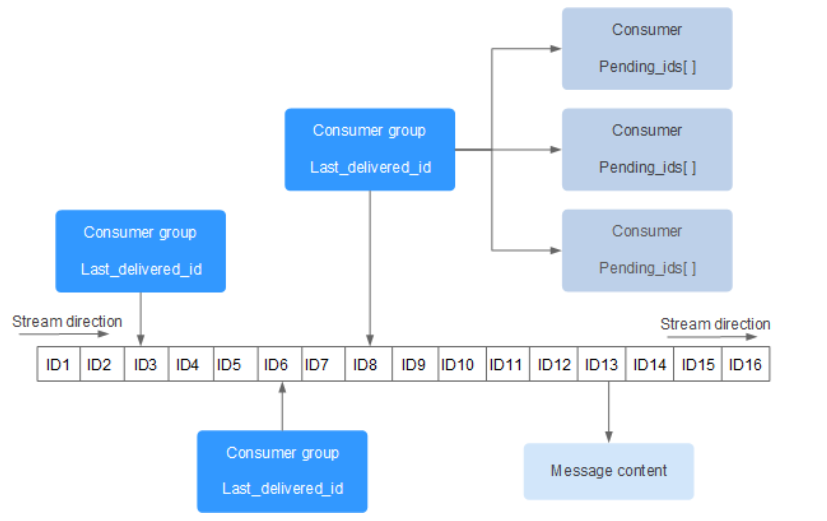

# JDBC

Connection：代表一个JDBC连接，相当于Java程序到数据库的TCP连接；
- 打开一个Connection时，需要准备URL、用户名和口令
- URL是由数据库厂商指定的格式
  - MySQL的URL：
```
jdbc:mysql://<hostname>:<port>/<db>?key1=value1&key2=value2
```


获取数据库连接
- DriverManager自动扫描classpath，找到所有的JDBC驱动，然后根据传入的URL自动挑选一个合适的驱动

```JAVA
获取数据库连接，使用如下代码：

// JDBC连接的URL, 不同数据库有不同的格式:
String JDBC_URL = "jdbc:mysql://localhost:3306/test";
String JDBC_USER = "root";
String JDBC_PASSWORD = "password";
// 获取连接:
try (Connection conn = DriverManager.getConnection(JDBC_URL, JDBC_USER, JDBC_PASSWORD)) {
    ...
}
// TODO: 访问数据库...
// 关闭连接:
conn.close();

```

JDBC查询步骤
- 通过Connection提供的createStatement()方法创建一个Statement对象，用于执行一个查询；
- 执行Statement对象提供的executeQuery()，传入SQL语句，返回ResultSet结果集；
- 反复调用ResultSet的next()方法并读取每一行结果
```JAVA
try (Connection conn = DriverManager.getConnection(JDBC_URL, JDBC_USER, JDBC_PASSWORD)) {
    try (Statement stmt = conn.createStatement()) {
        try (ResultSet rs = stmt.executeQuery("SELECT id, grade, name, gender FROM students WHERE gender=1")) {
            while (rs.next()) {
                long id = rs.getLong(1); // 注意：索引从1开始
                long grade = rs.getLong(2);
                String name = rs.getString(3);
                int gender = rs.getInt(4);
            }
        }
    }
}
```

注意
- Statement和ResultSet都是需要关闭的资源，因此嵌套使用try (resource)确保及时关闭；


- rs.next()用于判断是否有下一行记录，如果有，将自动把当前行移动到下一行（一开始获得ResultSet时当前行不是第一行）；


- ResultSet获取列时，索引从1开始而不是0；


- 必须根据SELECT的列的对应位置来调用getLong(1)，getString(2)这些方法，否则对应位置的数据类型不对，将报错

使用PreparedStatement而非Statement避免SQL注入
- PreparedStatement比Statement更安全，而且更快。
```JAVA
User login(String name, String pass) {
    ...
    String sql = "SELECT * FROM user WHERE login=? AND pass=?";
    PreparedStatement ps = conn.prepareStatement(sql);
    ps.setObject(1, name);
    ps.setObject(2, pass);
    ...

    try (Connection conn = DriverManager.getConnection(JDBC_URL, JDBC_USER, JDBC_PASSWORD)) {
    try (PreparedStatement ps = conn.prepareStatement("SELECT id, grade, name, gender FROM students WHERE gender=? AND grade=?")) {
        ps.setObject(1, "M"); // 注意：索引从1开始
        ps.setObject(2, 3);
        try (ResultSet rs = ps.executeQuery()) {
            while (rs.next()) {
                long id = rs.getLong("id");
                long grade = rs.getLong("grade");
                String name = rs.getString("name");
                String gender = rs.getString("gender");
            }
        }
    }
}
}

```


SQL数据与java数据类型的映射


| SQL数据类型 | Java数据类型           |
|-------------|------------------------|
| BIT, BOOL   | boolean                |
| INTEGER     | int                    |
| BIGINT      | long                   |
| REAL        | float                  |
| FLOAT, DOUBLE | double               |
| CHAR, VARCHAR | String               |
| DECIMAL     | BigDecimal             |
| DATE        | java.sql.Date, LocalDate|
| TIME        | java.sql.Time, LocalTime|

插入
- 使用executeUpdate()执行insert语句，返回int代表插入的记录数量
```JAVA
try (Connection conn = DriverManager.getConnection(JDBC_URL, JDBC_USER, JDBC_PASSWORD)) {
    try (PreparedStatement ps = conn.prepareStatement(
            "INSERT INTO students (id, grade, name, gender) VALUES (?,?,?,?)")) {
        ps.setObject(1, 999); // 注意：索引从1开始
        ps.setObject(2, 1); // grade
        ps.setObject(3, "Bob"); // name
        ps.setObject(4, "M"); // gender
        int n = ps.executeUpdate(); // 1
    }
}
```

插入并获取自增主键
- 在创建PreparedStatement时，指定一个RETURN_GENERATED_KEYS标志位，表示JDBC驱动必须返回插入的自增主键
- 执行后必须调用.getGeneratedKeys获取一个ResultSet对象，这个对象仅包含所有自增的值，可能有多行多列
- Statement.RETURN_GENERATED_KEYS是一个常量
```JAVA
try (Connection conn = DriverManager.getConnection(JDBC_URL, JDBC_USER, JDBC_PASSWORD)) {
    try (PreparedStatement ps = conn.prepareStatement(
            "INSERT INTO students (grade, name, gender) VALUES (?,?,?)",
            Statement.RETURN_GENERATED_KEYS)) {
        ps.setObject(1, 1); // grade
        ps.setObject(2, "Bob"); // name
        ps.setObject(3, "M"); // gender
        int n = ps.executeUpdate(); // 1
        try (ResultSet rs = ps.getGeneratedKeys()) {
            if (rs.next()) {
                long id = rs.getLong(1); // 注意：索引从1开始
            }
        }
    }
}
```

更新


```JAVA
try (Connection conn = DriverManager.getConnection(JDBC_URL, JDBC_USER, JDBC_PASSWORD)) {
    try (PreparedStatement ps = conn.prepareStatement("UPDATE students SET name=? WHERE id=?")) {
        ps.setObject(1, "Bob"); // 注意：索引从1开始
        ps.setObject(2, 999);
        int n = ps.executeUpdate(); // 返回更新的行数
    }
}
```

删除
```JAVA
try (Connection conn = DriverManager.getConnection(JDBC_URL, JDBC_USER, JDBC_PASSWORD)) {
    try (PreparedStatement ps = conn.prepareStatement("DELETE FROM students WHERE id=?")) {
        ps.setObject(1, 999); // 注意：索引从1开始
        int n = ps.executeUpdate(); // 删除的行数
    }
}
```

## 事务

事务执行
- conn.setAutoCommit(false)：关闭自动提交
  - 自动提交时，每条sql作为一个事务执行
- 事务以commit()方法结束。
- 事务执行失败抛出异常，捕捉后执行conn.rollback()回滚事务
- 在finally中通过conn.setAutoCommit(true)把Connection对象的状态恢复到初始值
```JAVA
Connection conn = openConnection();
try {
    // 关闭自动提交:
    conn.setAutoCommit(false);
    // 执行多条SQL语句:
    insert(); update(); delete();
    // 提交事务:
    conn.commit();
} catch (SQLException e) {
    // 回滚事务:
    conn.rollback();
} finally {
    conn.setAutoCommit(true);
    conn.close();
}
```

隔离级别
- MySQL的默认隔离级别是REPEATABLE_READ

| Isolation Level    | 脏读（Dirty Read） | 不可重复读（Non Repeatable Read） | 幻读（Phantom Read） |
|---------------------|---------------------|------------------------------------|----------------------|
| Read Uncommitted    | Yes                 | Yes                                | Yes                  |
| Read Committed      | -                   | Yes                                | Yes                  |
| Repeatable Read     | -                   | -                                  | Yes                  |
| Serializable        | -                   | -                                  | -                    |
```JAVA

// 设定隔离级别为READ COMMITTED:
conn.setTransactionIsolation(Connection.TRANSACTION_READ_COMMITTED);
```

## BATCH

SQL数据库对SQL语句相同，但只有参数不同的若干语句可以作为batch执行，即批量执行


执行
- 对同一个PreparedStatement反复设置参数并调用addBatch()
- 调用executeBatch()而非executeUpdate()，并返回int[]

```JAVA
try (PreparedStatement ps = conn.prepareStatement("INSERT INTO students (name, gender, grade, score) VALUES (?, ?, ?, ?)")) {
    // 对同一个PreparedStatement反复设置参数并调用addBatch():
    for (Student s : students) {
        ps.setString(1, s.name);
        ps.setBoolean(2, s.gender);
        ps.setInt(3, s.grade);
        ps.setInt(4, s.score);
        ps.addBatch(); // 添加到batch
    }
    // 执行batch:
    int[] ns = ps.executeBatch();
    for (int n : ns) {
        System.out.println(n + " inserted."); // batch中每个SQL执行的结果数量
    }
}
```

## 连接池

标准接口javax.sql.DataSource，常用的JDBC连接池：HikariCP、C3P0、BoneCP、Druid
- 添加相应JDBC连接池依赖
- 创建DataSource全局实例

```JAVA
HikariConfig config = new HikariConfig();
config.setJdbcUrl("jdbc:mysql://localhost:3306/test");
config.setUsername("root");
config.setPassword("password");
config.addDataSourceProperty("connectionTimeout", "1000"); // 连接超时：1秒
config.addDataSourceProperty("idleTimeout", "60000"); // 空闲超时：60秒
config.addDataSourceProperty("maximumPoolSize", "10"); // 最大连接数：10
DataSource ds = new HikariDataSource(config);
```
- 从DataSource全局实例获取Connection连接
```JAVA
try (Connection conn = ds.getConnection()) { // 在此获取连接
    ...
} // 在此“关闭”连接
```

通过连接池获取连接时，并不需要指定JDBC的相关URL、用户名、口令等信息，因为这些信息已经存储在连接池内部了（创建HikariDataSource时传入的HikariConfig持有这些信息）。一开始，连接池内部并没有连接，所以，第一次调用ds.getConnection()，会迫使连接池内部先创建一个Connection，再返回给客户端使用。当我们调用conn.close()方法时（在try(resource){...}结束处），不是真正“关闭”连接，而是释放到连接池中，以便下次获取连接时能直接返回。

因此，连接池内部维护了若干个Connection实例，如果调用ds.getConnection()，就选择一个空闲连接，并标记它为“正在使用”然后返回，如果对Connection调用close()，那么就把连接再次标记为“空闲”从而等待下次调用。这样一来，我们就通过连接池维护了少量连接，但可以频繁地执行大量的SQL语句。

通常连接池提供了大量的参数可以配置，例如，维护的最小、最大活动连接数，指定一个连接在空闲一段时间后自动关闭等，需要根据应用程序的负载合理地配置这些参数。此外，大多数连接池都提供了详细的实时状态以便进行监控。


# Redis

## 简介

redis服务器以单线程单进程的方式与多个客户端建立TCP或Unix socket连接，接收并处理客户端命令请求，
- redis客户端可由第三方供应商提供
- redis服务器通过I/O 多路复用技术处理文件系统
- 服务器为每个客户端建立redis.h/redisClient 结构，该结构保存客户端当前的状态信息，以及执行相关功能时需要用到的数据结构。

redis提供redis-server、redis-cli及以下工具
- redis-check-dump：RDB 文件修复工具


- redis-check-aof：AOF 文件修复工具


- redis-benchmark：性能测试工具
  - 模拟同时由 N 个客户端发送 M 个 SETs/GETs 查询

- redis.windows.conf： 配置文件


- redis.windows-service.conf：配置文件

## redis-cli命令

字符串
```bash
# 字符串
SET name "redis.com.cn"
GET name
```


### 哈希命令
| 序号 | 命令                  | 描述                                                                                      |
|------|-----------------------|-------------------------------------------------------------------------------------------|
| 1    | HDEL key field1 [field2] | 删除一个或多个哈希表字段。                                                                |
| 2    | HEXISTS key field       | 查看哈希表 key 中指定字段是否存在。                                                      |
| 3    | HGET key field          | 获取存储在哈希表中指定字段的值。                                                          |
| 4    | HGETALL key             | 获取在哈希表中指定 key 的所有字段和值。                                                   |
| 5    | HINCRBY key field increment | 为哈希表 key 中指定字段的整数值加上增量 increment。                                        |
| 6    | HINCRBYFLOAT key field increment | 为哈希表 key 中指定字段的浮点数值加上增量 increment。                                   |
| 7    | HKEYS key               | 获取哈希表中的所有字段。                                                                  |
| 8    | HLEN key                | 获取哈希表中字段的数量。                                                                  |
| 9    | HMGET key field1 [field2] | 获取所有给定字段的值。                                                                   |
| 10   | HMSET key field1 value1 [field2 value2 ] | 同时将多个 field-value (域-值)对设置到哈希表 key 中。                                |
| 11   | HSET key field value   | 将哈希表 key 中的字段 field 的值设为 value。                                              |
| 12   | HSETNX key field value | 只有在字段 field 不存在时，设置哈希表字段的值。                                           |
| 13   | HVALS key               | 获取哈希表中所有值。                                                                      |
| 14   | HSCAN key cursor [MATCH pattern] [COUNT count] | 迭代哈希表中的键值对。                                                               |
```bash
# 哈希
HMSET user:1 username ajeet password redis alexa 2000
# 哈希对象：user:1
# 映射集合：username ajeet、password redis、alexa 2000
HGETALL user:1
# 返回：
# "username"
# "ajeet"
# "password"
# "redis"
# "alexa"
# "2000"
```

### 列表命令

命令
| 序号 | 命令                                   | 描述                                                                                         |
|------|----------------------------------------|----------------------------------------------------------------------------------------------|
| 1    | BLPOP key1 [key2 ] timeout             | 移出并获取列表的第一个元素，如果列表没有元素会阻塞列表直到等待超时或发现可弹出元素为止。       |
| 2    | BRPOP key1 [key2 ] timeout             | 移出并获取列表的最后一个元素，如果列表没有元素会阻塞列表直到等待超时或发现可弹出元素为止。       |
| 3    | BRPOPLPUSH source destination timeout | 从列表中弹出一个值，将弹出的元素插入到另外一个列表中并返回它；如果列表没有元素会阻塞列表直到等待超时或发现可弹出元素为止。 |
| 4    | LINDEX key index                       | 通过索引获取列表中的元素。                                                                    |
| 5    | LINSERT key BEFORE\|AFTER pivot value | 在列表的元素前或者后插入元素。                                                               |
| 6    | LLEN key                               | 获取列表长度。                                                                               |
| 7    | LPOP key                               | 移出并获取列表的第一个元素。                                                                 |
| 8    | LPUSH key value1 [value2]              | 将一个或多个值插入到列表头部。                                                               |
| 9    | LPUSHX key value                       | 将一个值插入到已存在的列表头部。                                                             |
| 10   | LRANGE key start stop                  | 获取列表指定范围内的元素。                                                                   |
| 11   | LREM key count value                   | 移除列表元素。                                                                               |
| 12   | LSET key index value                   | 通过索引设置列表元素的值。                                                                   |
| 13   | LTRIM key start stop                   | 对一个列表进行修剪(trim)，就是说，让列表只保留指定区间内的元素，不在指定区间之内的元素都将被删除。 |
| 14   | RPOP key                               | 移除列表的最后一个元素，返回值为移除的元素。                                                 |
| 15   | RPOPLPUSH source destination           | 移除列表的最后一个元素，并将该元素添加到另一个列表并返回。                                     |
| 16   | RPUSH key value1 [value2]              | 在列表中添加一个或多个值到列表尾部。                                                         |
| 17   | RPUSHX key value                       | 为已存在的列表添加值。                                                                       |

```bash
LPUSH runoobkey redis
# (integer) 1

LPUSH runoobkey mongodb
# (integer) 2

LPUSH runoobkey mysql
# (integer) 3

LRANGE runoobkey 0 10
# 1) "mysql"
# 2) "mongodb"
# 3) "redis"
```

### Set命令

| 序号 | 命令                                     | 描述                                                       |
|------|------------------------------------------|------------------------------------------------------------|
| 1    | SADD key member1 [member2]               | 向集合添加一个或多个成员。                                 |
| 2    | SCARD key                                | 获取集合的成员数。                                         |
| 3    | SDIFF key1 [key2]                        | 返回第一个集合与其他集合之间的差异。                       |
| 4    | SDIFFSTORE destination key1 [key2]       | 返回给定所有集合的差集并存储在 destination 中。            |
| 5    | SINTER key1 [key2]                       | 返回给定所有集合的交集。                                   |
| 6    | SINTERSTORE destination key1 [key2]      | 返回给定所有集合的交集并存储在 destination 中。            |
| 7    | SISMEMBER key member                     | 判断 member 元素是否是集合 key 的成员。                   |
| 8    | SMEMBERS key                             | 返回集合中的所有成员。                                     |
| 9    | SMOVE source destination member          | 将 member 元素从 source 集合移动到 destination 集合。      |
| 10   | SPOP key                                 | 移除并返回集合中的一个随机元素。                           |
| 11   | SRANDMEMBER key [count]                  | 返回集合中一个或多个随机数。                               |
| 12   | SREM key member1 [member2]               | 移除集合中一个或多个成员。                                 |
| 13   | SUNION key1 [key2]                       | 返回所有给定集合的并集。                                   |
| 14   | SUNIONSTORE destination key1 [key2]      | 所有给定集合的并集存储在 destination 集合中。             |
| 15   | SSCAN key cursor [MATCH pattern] [COUNT count] | 迭代集合中的元素。                                    |
```redis
SADD runoobkey redis
(integer) 1

SADD runoobkey mongodb
(integer) 1

SADD runoobkey mysql
(integer) 1

SADD runoobkey mysql
(integer) 0

SMEMBERS runoobkey
1) "mysql"
2) "mongodb"
3) "redis"
```

### 有序集合（Sorted Set）

命令
| 序号 | 命令                                            | 描述                                                                                    |
|------|-------------------------------------------------|-----------------------------------------------------------------------------------------|
| 1    | ZADD key score1 member1 [score2 member2]        | 向有序集合添加一个或多个成员，或者更新已存在成员的分数。                                 |
| 2    | ZCARD key                                       | 获取有序集合的成员数。                                                                    |
| 3    | ZCOUNT key min max                              | 计算在有序集合中指定区间分数的成员数。                                                    |
| 4    | ZINCRBY key increment member                    | 有序集合中对指定成员的分数加上增量 increment。                                            |
| 5    | ZINTERSTORE destination numkeys key [key ...]   | 计算给定的一个或多个有序集的交集并将结果集存储在新的有序集合 destination 中。            |
| 6    | ZLEXCOUNT key min max                           | 在有序集合中计算指定字典区间内成员数量。                                                  |
| 7    | ZRANGE key start stop [WITHSCORES]              | 通过索引区间返回有序集合指定区间内的成员。                                                |
| 8    | ZRANGEBYLEX key min max [LIMIT offset count]    | 通过字典区间返回有序集合的成员。                                                          |
| 9    | ZRANGEBYSCORE key min max [WITHSCORES] [LIMIT]  | 通过分数返回有序集合指定区间内的成员。                                                    |
| 10   | ZRANK key member                                | 返回有序集合中指定成员的索引。                                                            |
| 11   | ZREM key member [member ...]                    | 移除有序集合中的一个或多个成员。                                                          |
| 12   | ZREMRANGEBYLEX key min max                      | 移除有序集合中给定的字典区间的所有成员。                                                  |
| 13   | ZREMRANGEBYRANK key start stop                  | 移除有序集合中给定的排名区间的所有成员。                                                  |
| 14   | ZREMRANGEBYSCORE key min max                    | 移除有序集合中给定的分数区间的所有成员。                                                  |
| 15   | ZREVRANGE key start stop [WITHSCORES]           | 返回有序集中指定区间内的成员，通过索引，分数从高到低。                                    |
| 16   | ZREVRANGEBYSCORE key max min [WITHSCORES]       | 返回有序集中指定分数区间内的成员，分数从高到低排序。                                      |
| 17   | ZREVRANK key member                            | 返回有序集合中指定成员的排名，有序集成员按分数值递减(从大到小)排序。                      |
| 18   | ZSCORE key member                              | 返回有序集中，成员的分数值。                                                              |
| 19   | ZUNIONSTORE destination numkeys key [key ...]   | 计算给定的一个或多个有序集的并集，并存储在新的 key 中。                                  |
| 20   | ZSCAN key cursor [MATCH pattern] [COUNT count]  | 迭代有序集合中的元素（包括元素成员和元素分值）。                                         |


```bash

ZADD runoobkey 1 redis
# (integer) 1

ZADD runoobkey 2 mongodb
# (integer) 1

ZADD runoobkey 3 mysql
# (integer) 1

ZADD runoobkey 3 mysql
# (integer) 0

ZADD runoobkey 4 mysql
# (integer) 0

ZRANGE runoobkey 0 10 WITHSCORES
# 1) "redis"
# 2) "1"
# 3) "mongodb"
# 4) "2"
# 5) "mysql"
# 6) "4"
```

### 基数统计（HyperLogLogs）

命令
| 序号 | 命令                                | 描述                               |
|------|-------------------------------------|------------------------------------|
| 1    | PFADD key element [element ...]     | 添加指定元素到 HyperLogLog 中。     |
| 2    | PFCOUNT key [key ...]               | 返回给定 HyperLogLog 的基数估算值。 |
| 3    | PFMERGE destkey sourcekey [sourcekey ...] | 将多个 HyperLogLog 合并为一个 HyperLogLog。 |


```redis
PFADD unique::ip::counter '192.168.0.1'
PFADD unique::ip::counter '127.0.0.1'
PFADD unique::ip::counter '255.255.255.255'
PFCOUNT unique::ip::counter
```
### 连接

| 序号 | 命令              | 描述                 |
|------|-------------------|----------------------|
| 1    | AUTH password     | 验证密码是否正确     |
| 2    | ECHO message      | 打印字符串           |
| 3    | PING              | 查看服务是否运行     |
| 4    | QUIT              | 关闭当前连接         |
| 5    | SELECT index      | 切换到指定的数据库   |

### 订阅发布

命令

| 序号 | 命令                                     | 描述                                        |
|------|------------------------------------------|---------------------------------------------|
| 1    | PSUBSCRIBE pattern [pattern ...]         | 订阅一个或多个符合给定模式的频道。            |
| 2    | PUBSUB subcommand [argument [argument ...]] | 查看订阅与发布系统状态。                     |
| 3    | PUBLISH channel message                  | 将信息发送到指定的频道。                     |
| 4    | PUNSUBSCRIBE [pattern [pattern ...]]      | 退订所有给定模式的频道。                     |
| 5    | SUBSCRIBE channel [channel ...]           | 订阅给定的一个或多个频道的信息。             |
| 6    | UNSUBSCRIBE [channel [channel ...]]       | 指退订给定的频道。                          |
## 数据类型


字符串（String）

- Redis不会解析转码二进制序列


哈希（Hash）
- 每个哈希是一个对象，该对象由多个映射组成，每个映射从一个字符串映射到另一个字符串

列表（List）

字符串列表，按插入顺序排序
- 可添加一个元素到列表的头部或尾部

集合（Set）

字符串的无序集合（元素唯一）
- 通过哈希表实现，intset或hashtable作为元素编码
- 底层哈希表，添加，删除，查找的复杂度都是 O(1)

有序集合（Sorted Set）
- 顺序可重复集合，每个元素关联一个分数

基数统计（HyperLogLogs）
- 统计个数，不保存数据内容，只统计数据对象的个数，占用存储空间固定为12kb，误差在0.8%左右，使用的可能场景
  - 统计注册 IP 数

  - 统计每日访问 IP 数

  - 统计页面实时 UV 数

  - 统计在线用户数

  - 统计用户每天搜索不同词条的个数


## 发布订阅


- 发布者和订阅者都是 Redis 客户端
- Channel属于Redis服务器端

缺点
- 订阅动作单线程阻塞，因此需要客户端另起线程
- 服务器挂掉后，消息不会持久化
- 用户挂掉后，掉线后的消息会彻底消失


## 事务


`MULTI`标记一个事务块的开始，`EXEC`将执行所有事务块内的命令
- 放入事务块中的命令将被放入队列缓存，而不是立即执行
- 在事务执行过程，其他客户端提交的命令请求不会插入到事务执行命令序列中

原子性
- Redisd仅保证单个命令是原子性的
- 事务块没有原子性保证，仅仅是一个打包的批量执行脚本，中间某条指令的失败既不会导致前面已做指令回滚，也不会造成后续的指令不做


## 脚本

内嵌支持 Lua 解释器环境

## 消息队列&Stream

Stream主要用于消息队列MQ/Message Queue
- 发布订阅pub/sub实现消息队列时，只能分发，无法持久化
- Stream 提供消息持久化和主备复制功能
  - 服务器允许任何客户端访问任何时刻的数据
  - 服务器能记住每个客户端的访问位置，保证消息不丢失。

Redis Stream结构
- 
- 每个消息关联唯一的ID
- Consumer Group消费组：使用 `XGROUP CREATE` 命令创建，一个消费组有多个消费者Consumer
- last_delivered_id 游标：每个消费组管关联一个游标，任意一个消费者读取消息都会使游标往前移动
- pending_ids ：每个消费者关联一个pending_ids，记录当前已经被客户端读取，但是还没有ack /Acknowledge character的消息

## Spring Cloud Config

分布式应用，有多个Spring Boot应用需要启动时，分散在各个应用中的配置既不便于管理，也不便于复用相同的配置
- Spring Cloud Config提供了一个通用的分布式应用的配置解决方案。它把配置分为两部分：

- Config Server：配置服务器，负责读取所有配置；
- Config Client：嵌入到各个Spring Boot应用中，本地无配置信息，启动时向服务器请求配置。

引入预定义依赖
```XML
<dependency>
    <groupId>org.springframework.cloud</groupId>
    <artifactId>spring-cloud-config-server</artifactId>
</dependency>
```

编写一个ConfigApplication入口，标注@EnableConfigServer：
```java
@EnableConfigServer
@SpringBootApplication
public class ConfigApplication {
    public static void main(String[] args) {
        SpringApplication.run(ConfigApplication.class, args);
    }
}
```

在application.yml中设置如何搜索配置
- Spring Cloud Config支持多种配置方式：从本地文件、Git仓库、数据库等多个地方读取配置
- 在/config-repo目录下存放每个应用的配置文件
  - {name}-{xxx}.yml：针对某个应用+某个profile的特定配置
    - 例如：ui-test.yml，ui-default.yml
  - {name}.yml：针对某个应用+所有profile的配置
  - application-{profile}.yml：针对某个profile的全局配置
  - application.yml：所有应用的全局配置；例如数据库连接

```YML
server:
  port: 8888

spring:
  application:
    name: config-server
  profiles:
    # 从文件读取配置时，Config Server激活的profile必须设定为native:
    active: native
  cloud:
    config:
      server:
        native:
          # 设置配置文件的搜索路径:
          search-locations: file:./config-repo, file:../config-repo, file:../../config-repo
```

- 启动配置服务器后保持该服务器运行，每个负责业务的Spring Boot应用从Spring Cloud Config Server读取配置
  - Config Server将返回匹配的配置文件，多个配置文件出现相同配置项时，优先级高的配置文件生效
- 各应用的基础application.yml配置如下
```YML

spring:
  application:
    # 设置app名称:
    name: ui
  config:
    # 导入Config Server地址:
    import: configserver:${CONFIG_SERVER:http://localhost:8888}
```
- 在业务应用中添加依赖
```XML
<dependency>
    <groupId>org.springframework.cloud</groupId>
    <artifactId>spring-cloud-starter-config</artifactId>
</dependency>
```


# MongoDB


MongoDB 将数据存储为一个文档，数据结构由键值(key=>value)对组成。MongoDB 文档类似于 JSON 对象。字段值可以包含其他文档，数组及文档数组。
# Mysql


# DBMS

- DBMS抽象为三个层次:视图层、逻辑层、物理层
  - 
- 代码以mysql代码为标准
## 关系数据库

- 关系
  - 同一个关系不能含有相同元组
  - 超码superkey：一个或多个属性，不同元组的唯一标识
  - 候选码candidate key：superkey的真子集
  - 主码primary key：candidatekey的一个
  - 外码foreign key：其它关系的主码作为本关系的属性

```sql

/**为Orders表增加属性fk_CustomerID，作为外键参考Customers表的属性CustomerID*/
ALTER TABLE Orders
ADD CONSTRAINT fk_CustomerID
FOREIGN KEY (CustomerID)
REFERENCES Customers(CustomerID);

```
- DDL：Data Definition Language：数据定义语言
  - 关系模式的定义、修改、删除
  - 完整性约束
  - 视图定义
  - 对视图或关系的访问授权
- DML：Data Manipulation Language：数据操纵语言

## 注释

```sql

-- 单行注释

/*带API说明的注释，或者多行注释
可注释API包括查询、关系、属性等*/
```
## 数据类型

- 整数：`INT`、`TINYINT`、`SMALLINT`、`MEDIUMINT`
- 浮点：`FLOAT`、`DOUBLE`、
  - `DECIMAL`、`NUMERIC`：适用于货币等高精度数据
- 字符串
  - 单引号标识字符串，两个连续的单引号表示打印单引号，双引号不能标识字符串，双引号可以直接打印，单引号也可以使用转义字符打印
   - `CHAR`：固定长度字符
   - `VARCHAR`：可变长度字符
   - `TEXT`：大文本数据
```sql

-- 查看当前服务器、数据库使用的字符集，默认utf8mb4或utf8
SHOW VARIABLES LIKE 'character_set_%';

```
- 日期和时间
   - `DATE`：年-月-日
   - `TIME`：时:分:秒
   - `DATETIME`：日期和时间
   - `TIMESTAMP`：UTC时间戳

- 布尔：`BOOLEAN` 、`BOOL`
- 二进制Binary Types
  - `BINARY`：固定长度二进制
   - `VARBINARY`：可变长度的二进制数据
   - `BLOB`：大二进制数据，如图像或文件

- 枚举：用于存储预定义的枚举值列表中的一个
- 集合：用于存储预定义的字符串值集合中的一个或多个
- 自动增量类型：`AUTO_INCREMENT`：通常用于创建自动增长的整数主键

## 模式定义与完整性约束命令

- 逻辑连词：`and、or、not`
```sql

/**创建数据库*/
CREATE DATABASE mydb;

/**选择数据库*/
USE mydb;


```

- 查看关系模式

```sql

DESCRIBE table_name;
SHOW COLUMNS FROM table_name;

```

- 使用`ALTER TABLE`命令修改表结构

```SQL

//更改表结构

/**创建表格
 * 约束主键将拒绝主码为空、相同的修改，使用AUTO_INCREMENT数据格式将同时满足这两个条件
 *同一个关系只能有一个属性是AUTO_INCREMENT
 */
CREATE TABLE employees (
    employee_id INT AUTO_INCREMENT PRIMARY KEY,
    first_name VARCHAR(50) NOT NULL,
    last_name VARCHAR(50) DEFAULT 'Unknown',
    hire_date DATE
);

/**将已有列设为主键*/
ALTER TABLE employees
ADD PRIMARY KEY (employee_id);

/**将已有列设置为候选码，保证其值唯一*/
ALTER TABLE employees
ADD UNIQUE (email);

/**将已有列设为外键
 * 拒绝外码值不属于被参照关系对应属性的修改
 */
ALTER TABLE orders
ADD FOREIGN KEY (customer_id)
REFERENCES customers(customer_id);

/**为已有列添加断言，断言失败将拒绝修改元组*/
ALTER TABLE employees
ADD CHECK (salary >= 0);

/**为已有列添加默认值，若该关系已有元组在该列值为null，将设置为*/
ALTER TABLE employees
ALTER COLUMN salary SET DEFAULT 50000;

/*添加列*/
ALTER TABLE table_name
ADD column_name datatype;

/*删除列*/
ALTER TABLE table_name
DROP COLUMN column_name;

/*更改数据类型*/
ALTER TABLE table_name
MODIFY column_name new_datatype;

/*更改表名*/
ALTER TABLE old_table_name
RENAME TO new_table_name;

```

- 授权

```SQL

//授权

/**授予SELECT权限给用户：授权用户执行SELECT查询的权限*/
GRANT SELECT ON database_name.table_name TO 'username'@'hostname';

/**授予INSERT权限给用户：授权用户执行INSERT插入数据的权限*/
GRANT INSERT ON database_name.table_name TO 'username'@'hostname';

/**授予UPDATE权限给用户：授权用户执行UPDATE更新数据的权限*/
GRANT UPDATE ON database_name.table_name TO 'username'@'hostname';

/**授予DELETE权限给用户：授权用户执行DELETE删除数据的权限*/
GRANT DELETE ON database_name.table_name TO 'username'@'hostname';

/**授予ALL PRIVILEGES权限给用户：授予用户执行所有操作的权限，包括SELECT、INSERT、UPDATE、DELETE等*/
GRANT ALL PRIVILEGES ON database_name.table_name TO 'username'@'hostname';

/**授予特定数据库的权限：如果要授权用户对整个数据库的权限，而不是单个表格，可以使用以下命令*/
GRANT permission_type ON database_name.* TO 'username'@'hostname';

/**授权所有数据库的权限：如果要授权用户对所有数据库的权限，可以使用通配符* */
GRANT permission_type ON *.* TO 'username'@'hostname';

/**授予GRANT OPTION权限：GRANT OPTION权限允许用户授予他人权限。通常，只有具有SUPER权限的用户才能使用GRANT OPTION*/
GRANT permission_type ON database_name.table_name TO 'username'@'hostname' WITH GRANT OPTION;

/**回收权限：使用REVOKE命令可以撤销之前授予的权限*/
REVOKE permission_type ON database_name.table_name FROM 'username'@'hostname';


```

## 数据库DML命令

```sql

USE database_name;

SHOW DATABASES;

DROP DATABASE database_name;


```


```sql

/**增加元组*/
INSERT INTO table_name (column1, column2, ...)
VALUES (value1, value2, ...);

/**更新元组*/
UPDATE table_name
SET column1 = new_value1, column2 = new_value2, ...
WHERE condition;

/**删除元组*/
DELETE FROM table_name
WHERE condition;


/**检索元组*/
SELECT column1, column2, ...
FROM table_name
WHERE condition;

/**如果主键重复则更新元组，否则插入元组*/
INSERT INTO table_name (column1, column2, ...)
VALUES (value1, value2, ...)
ON DUPLICATE KEY UPDATE column1 = new_value1, column2 = new_value2, ...;

/**插入元组，如果主键重复则删除旧元组并插入新元组*/
REPLACE INTO table_name (column1, column2, ...)
VALUES (value1, value2, ...);

```

- insert into

```sql

/**默认选中关系的所有列*/
INSERT INTO student
VALUES (1, 'John', 25);


/**选中指定列
 * 未选中的列将使用默认值存储，如果未指定默认值，将采用NULL存储，如果约定NOT NULL将不允许插入该列
 */
INSERT INTO student (column1, column2, ...)
VALUES 
    (value1_1, value1_2, ...),
    (value2_1, value2_2, ...),
    (value3_1, value3_2, ...);
INSERT INTO student (column1, column2, ...)
SELECT *
FROM another_student_table

```

- delete

```sql


/**删除所有元组后，将不会重置auto increment*/
DELETE FROM table_name
WHERE condition1 AND condition2
LIMIT N;--仅选中前N行

/**重置auto_increment的值为指定值*/
DELETE FROM table_name;
ALTER TABLE table_name AUTO_INCREMENT = 1;

```

- drop：不可逆的删除

```sql

DROP TABLE table_name; -- 删除关系

DROP DATABASE database_name;-- 删除数据库

DROP VIEW student_view;-- 删除视图

DROP PROCEDURE procedure_name;-- 删除存储过程

DROP TRIGGER trigger_name;-- 删除触发器

```

- update

```sql

UPDATE table_name
SET column1 = value1, column2 = value2,...
WHERE condition;


```

## 查询与谓词

- select：返回一个关系模式及满足谓词为真的元组
- 使用as重命名属性名、关系名、算术表达式
  - 查询过程中、返回的关系中将使用新名称
  - 解决命名冲突(关系命名冲突，即一个关系和自己进行笛卡尔积运算的情况)
  - `select *`：选中from返回关系中的所有属性
  - select默认元组可重复，等价于`select all`，使用`select distinct`去除重复元组
```sql

/*解释
 *笛卡尔积将产生一个关系，其属性名为A.name,B.salary,B.departure等
 *where子句将检查每一个元组的属性是否满足A.salary > B.salary & B.department = 'computer'
 *因此该sql语句的含义是：工资至少比计算机部门其中一个教授高的教授集合
 */
-- 关系名instructor，属性：name、department、salary
select A.name
from instructor as A , instructor as B 
where A.salary > B.salary and B.department = 'computer';

```
- 比较:比较对象可以是单个或多个属性
  - `<=		=		<>`
  - `between...and...`、`not between...and...`

```SQL

where (A.ID,C.name)=(B.ID,D.name)

```

- case end

```sql

-- case end将按顺序依次检查是否满足条件，如果第一次满足条件则立即返回该值，并结束匹配检查

CASE
    WHEN condition1 THEN result1
    WHEN condition2 THEN result2
    ...
    ELSE else_result
END

SELECT
    employee_id,
    first_name,
    last_name,
    CASE
        WHEN salary > 50000 THEN 'High Salary'
        WHEN salary > 30000 THEN 'Medium Salary'
        ELSE 'Low Salary'
    END AS salary_category
FROM
    employees;


```

### 子查询

- where子句嵌套子查询：外查询的元组满足与子查询的指定关系时被保留(必要条件是属性相同)
  - `IN`：检查外查询的元组是否在内查询中
  - `SOME`：至少与子查询中的一个元组满足关系
  - `ALL`：与子查询的每个元组都满足关系
  - 连接词`SOME、ALL`通常与比较运算符一起使用

```sql

SELECT name
FROM students
WHERE age IN (25, 30);

SELECT name
FROM students
WHERE age > SOME (SELECT age FROM other_students WHERE grade = 'A');

SELECT name
FROM students
WHERE age > ALL (SELECT age FROM other_students WHERE grade = 'A');


```

- exists/not exists条件谓词
  - 当且仅当子查询不为空时，该where exists返回true，即保留该元组
  - 通常用于相关子查询，即子查询使用外查询的关系/属性
    - 子查询与父查询命名冲突时，只有子查询的命名有效
  - `where not exists(B except A)`检查B是否为A的子集

```sql


SELECT customer_name
FROM customers c
WHERE EXISTS (
    SELECT 1
    FROM orders o
    WHERE o.customer_id = c.customer_id
);


```


- from子查询

```sql

SELECT city, AVG(grade) AS avg_grade
FROM (
    SELECT s.city, g.grade
    FROM students s
    JOIN grades g ON s.student_id = g.student_id
) AS subquery
GROUP BY city;


```
- with子句
1.with子句：构建一个或多个临时关系；
(1)with
(2)table-name-A(attribute A,attribute B) as(clause)
(3)table-name-B(attribute A,attribute B) as(clause))
(4)...
2.with子句构造的临时关系存储在临时表空间
(1)该临时关系可以被后续SQL语句使用
3.一个with子句内部不能嵌套with子句
在同级select前有多个查询定义的时候，第1个用with，后面的不用with，并且用逗号隔开
## 过滤

- order by
  - 默认为升序，按字典顺序排列
```sql

ORDER BY column1 ASC | DESC, column2 ASC | DESC,;

```

- 分组聚集：
  - 副作用：更改元组顺序，更改聚集函数的作用域
- 聚集函数视为单个属性，其属性名为聚集函数名(被聚集的属性名)，可以使用as为该属性重命名
  - 通常与group by一起使用
  - 除count外，其它聚集函数忽略空值

```sql

SELECT city, SUM(sales)
FROM sales_data
GROUP BY city;


```
- having：必须在group by子句后使用，这意味着having可操控的属性有限

```sql

SELECT customer_id, SUM(order_total) AS total_order
FROM orders
GROUP BY customer_id
HAVING SUM(order_total) > 1000;


```
- 标量子查询：返回具有单一属性、仅有一个元组的关系
## 数据处理函数与模式匹配

- 字符串处理

```sql

/*字符串处理*/

CONCAT()--串联字符串
SUBSTR()/SUBSTRING() --提取子串
LENGTH() 或 LEN()
UPPER() 或 UCASE()
LOWER() 或 LCASE()
REPLACE(原始文本，原始文本中被替代的部分，需要替换的新文本)
TRIM('   Hello   ')去除字符串的前导和尾随空格或指定字符
LEFT() 和 RIGHT()： 用于从字符串的左边或右边截取指定数量的字符
INSTR() 或 LOCATE()： 用于查找子串在字符串中的位置
CONVERT() 或 CAST()： 用于将字符串从一种字符集转换为另一种字符集。

```

- LIKE对单个属性进行通配符匹配
  - '%'匹配0个或多个字符，'_'匹配单个字符，使用'/'进行转移

```sql
SELECT * FROM products WHERE product_name LIKE 'Apple%'; -- 匹配以 "Apple" 开头的产品名
SELECT * FROM customers WHERE last_name LIKE 'Smi_h'; -- 匹配 "Smith" 或 "Smyth" 等姓氏


```

- REGEXP：正则表达式匹配
  - .：匹配任何字符
  - *：匹配前一个字符的零次或多次重复。
  - +：匹配前一个字符的一次或多次重复。
  - ?：匹配前一个字符的零次或一次重复。
  - []：用于定义字符类，例如 [abc] 匹配 'a'、'b' 或 'c' 中的一个字符。
  - [^]：用于否定字符类，例如 [^0-9] 匹配除数字之外的任何字符。
  - ()：用于创建子模式。
  - |：用于表示或
  - \：用于转义特殊字符

## 集合运算

- 运算对象：关系模式兼容的两个关系，返回关系模式与首个关系相同的关系及其元组；
- union
  - union /union distinct：保证元组不重复
    - 最后的结果是有序的，因为在排列前排序元组，所有元组只需要遍历一次就可以确保去除重复元组
  - union all：将所有元组合并到同一个关系中，最后的结果不会是有序的
- intersect
  - intersect all：仅求交集，保留交集中的所有重复元组
  - intersect：去除交集中的重复元组，最后的结果是有序的
- except
  - except：如果参与运算的两个关系都含有相同元组，那么该元组将不会出现在集合中；
  - except all：关系A exccept all 关系B；如果一个元组在A中出现x次，在B中出现y次，x<=y，将不会保留该元组；x>y，将保留x-y个该元组

## 空值

- 算术运算：有空值参与的算术表达式结果为空
- 比较运算：
  - 逻辑值：`true、unknown、false`
  - `not unknown`返回`unknown`
  - 任意值与`null`进行逻辑比较总是返回`unknown`
  - `where A is null`将返回所有A属性为空值的元组
  - `where A=null`将返回空表，因为等价于子句where unknown
- 集合运算包括select distinct中，null将不参与元组相等条件的判定；

## 连接

- 笛卡尔积：返回一个关系，属性由所有关系的属性组成，无论是否同名(因此不要求关系有相同属性)

```sql

SELECT * 
FROM table1, table2;

```

- 内连接：返回的关系模式包括所有关系的属性
  - 与笛卡尔积不同的是：当且仅当在指定属性上值相等(必要条件是数据类型兼容)时，才会进行组合；

```sql

-- 使用on子句进行连接
SELECT * FROM TableA
INNER JOIN TableB ON TableA.Column1 = TableB.Column2;

-- 使用using指定相同属性名作为连接条件
SELECT * FROM TableA
INNER JOIN TableB USING (CommonColumn);

-- 为笛卡尔积使用where子句相当于内连接
SELECT * FROM TableA, TableB
WHERE TableA.Column1 = TableB.Column2;

```

- 自然连接：主动匹配的内连接
  - 与内连接不同的是，用于匹配的属性仅出现一次
  - 通常不与on、using一起使用

```SQL

-- 自动寻找两个表中所有同名的属性作为值匹配条件
SELECT * FROM TableA
NATURAL JOIN TableB;

```
- 外连接：
  - `Left Join`：保留左表的所有元组，如果左表的某个元组与右表中的某个元组相同则将该元组写入返回结果的另一半，否则返回结果中的右表属性全部设为NULL
  - `Right Join`
  - 'full outer Join'：保留左表和右表的所有行，当且仅当两个元组在指定属性上相等时才会处于返回结果的同一个元组中
  - 匹配条件：ON子句、USING子句

## 递归

- 定义初始查询：首先，你需要定义一个初始查询，这是递归查询的起点。该查询将返回基本（或初始）结果集。
- 定义递归部分：然后，你需要定义一个递归部分，这是一个 RCTE，它将引用自身。递归部分通常包括一个 UNION 运算符和一个引用自身的查询。
- 结合初始查询和递归部分：最后，你需要使用 UNION 运算符将初始查询和递归部分组合在一起。

```sql

WITH RECURSIVE EmployeeHierarchy AS (
    -- 初始查询，找出根节点（顶级员工）
    SELECT employee_id, employee_name, manager_id
    FROM employees
    WHERE manager_id IS NULL
    
    UNION ALL
    
    -- 递归部分，连接下级员工
    SELECT e.employee_id, e.employee_name, e.manager_id
    FROM employees e
    JOIN EmployeeHierarchy eh ON e.manager_id = eh.employee_id
)
-- 最终查询，选择所有下属
SELECT * FROM EmployeeHierarchy;


```

# 数据库设计


# 索引和散列
# 查询处理和优化
# 事务
# 并发控制
# 恢复系统
# END