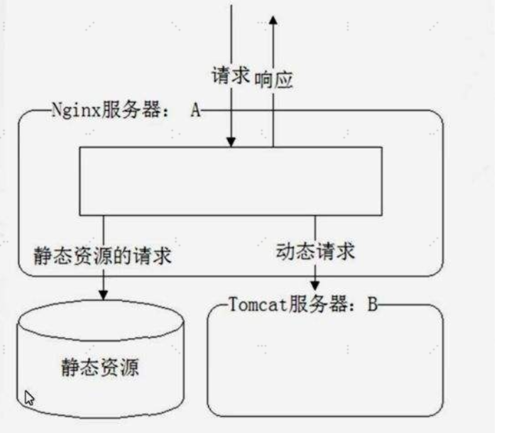
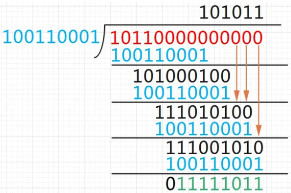
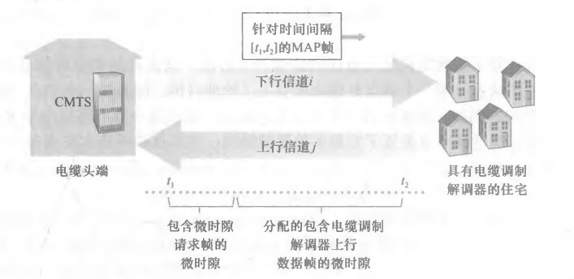

# Java Network

### Java TCP

服务端代码
- 通过ServerSocket实例监听指定端口，通过该端口不断接受客户端请求，并在其它未使用端口建立与该客户端的TCP/IP连接
```JAVA
public class Server {
  public static void main(String[] args) throws IOException {
      ServerSocket ss = new ServerSocket(6666); // 监听指定端口
      
      while(true) {
        // 该方法将阻塞主线程
        Socket sock = ss.accept();
        //可使用lambda传入run方法
        Thread t = new Handler(sock);
        t.start();
      }
  }
}

class Handler extends Thread {
  Socket sock;
  public Handler(Socket sock) {
      this.sock = sock;
  }
  @Override
  public void run() {...}
}
```

客户端代码

```JAVA
public class Client {
  public static void main(String[] args) throws IOException {
    Socket sock = new Socket("localhost", 6666); // 连接指定服务器和端口
    try (InputStream input = sock.getInputStream()) {
      try (OutputStream output = sock.getOutputStream()) 
        {...}
    }
    sock.close();
  }
}
```

Socket实例
- 使用InputStream和OutputStream封装Socket的数据流
```JAVA
// 用于读取网络数据:
InputStream in = sock.getInputStream();
// 用于写入网络数据:
OutputStream out = sock.getOutputStream();
```
- 写入网络数据时调用`flush()`方法，避免等待缓冲区满才发送

### Java UDP

UDP和TCP使用端口号0~65535，但是两套端口独立，即TCP使用端口xxx时，UDP同样能使用端口xxx

服务器端代码
- 因为没有UDP是无状态协议，所以每接收一个UDP包就需要立即回复UDP包
```JAVA
DatagramSocket ds = new DatagramSocket(6666); // 监听指定端口
while(true){

  byte[] buffer = new byte[1024];// 数据缓冲区:
  DatagramPacket packet = new DatagramPacket(buffer, buffer.length);
  ds.receive(packet); // 收取一个UDP数据包


  // 收取到的数据存储在buffer中，由packet.getOffset(), packet.getLength()指定起始位置和长度
  String s = new String(packet.getData(),
      packet.getOffset(),
      packet.getLength(),
      StandardCharsets.UTF_8);


  // 发送数据:
  byte[] data = "ACK".getBytes(StandardCharsets.UTF_8);
  packet.setData(data);
  ds.send(packet);
}
```


客户端代码
- 客户端无需指定端口，由操作系统自动指定一个当前未使用的端口
- 使用UDP时，只需要指定服务器端的ip和端口发送UDP包，然后接收返回的UDP包
- 客户端需要指定延迟，否则会持续阻塞

- 第一种方法：创建两个DatagramSocket实例，用connect()连接到不同的服务器；
```JAVA
DatagramSocket ds = new DatagramSocket();
ds.setSoTimeout(1000);
ds.connect(InetAddress.getByName("localhost"), 6666);

// 发送:
byte[] data = "Hello".getBytes();
DatagramPacket packet = new DatagramPacket(data, data.length);
ds.send(packet);


// 接收:
byte[] buffer = new byte[1024];
packet = new DatagramPacket(buffer, buffer.length);
ds.receive(packet);
String resp = new String(packet.getData(), packet.getOffset(), packet.getLength());


ds.disconnect();//取消对端口的占用

// 关闭:
ds.close();
```

- 第二种方法：不使用connect()，在创建DatagramPacket的时候指定服务器地址，用一个DatagramSocket实例发送DatagramPacket到不同的服务器

```JAVA
DatagramSocket ds = new DatagramSocket();
ds.setSoTimeout(1000);

// 发送到localhost:6666:
byte[] data1 = "Hello".getBytes();
var packet1 = new DatagramPacket(data1, data1.length, InetAddress.getByName("localhost"), 6666);
ds.send(packet1);

// 发送到localhost:8888:
byte[] data2 = "Hi".getBytes();
var packet2 = new DatagramPacket(data2, data2.length, InetAddress.getByName("localhost"), 8888);
ds.send(packet2);

// 关闭:
ds.close();
```
### 发送Email

SMTP
- java使用标准API：JavaMail直接发送邮件
- 流程：编写MUA：Mail User Agent，将邮件发送到MTA：Mail Transfer Agent
  - 邮件将存储在MDA：Mail Delivery Agent上
  - MUA使用SMTP协议向MTA发送邮件，使用标准端口25或加密端口465/587


MUA代码需要如下信息
- 发送人邮件地址+用户口令
- 接收人邮件地址
- MTA邮件服务器地址和端口号

| 邮箱类型 | SMTP服务器     | 端口   |
|----------|----------------|--------|
| QQ邮箱   | smtp.qq.com    | 465/587|
| 163邮箱  | smtp.163.com   | 465    |
| Gmail邮箱| smtp.gmail.com | 465/587|


```JAVA
String smtp = "smtp.office365.com";
String username = "";
String password = "";

// 连接到SMTP服务器587端口:
Properties props = new Properties();
props.put("mail.smtp.host", smtp); // SMTP主机名
props.put("mail.smtp.port", "587"); // 主机端口号
props.put("mail.smtp.auth", "true"); // 是否需要用户认证
props.put("mail.smtp.starttls.enable", "true"); // 启用TLS加密

// 获取Session实例:
Session session = Session.getInstance(props, new Authenticator() {
    protected PasswordAuthentication getPasswordAuthentication() {
        return new PasswordAuthentication(username, password);
    }
});

// 设置debug模式便于调试:
session.setDebug(true);
```

发送邮件
- 使用session实例发送文本邮件

```JAVA
MimeMessage message = new MimeMessage(session);
// 设置发送方地址:
message.setFrom(new InternetAddress("me@example.com"));
// 设置接收方地址:
message.setRecipient(Message.RecipientType.TO, new InternetAddress("xiaoming@somewhere.com"));
// 设置邮件主题:
message.setSubject("Hello", "UTF-8");
// 设置邮件正文:
message.setText("Hi Xiaoming...", "UTF-8");
// 发送:
Transport.send(message);

```

发送HTML邮件
- 发送HTML邮件和文本邮件是类似的，只需要把`message.setText(body, "UTF-8");`改为：`message.setText(body, "UTF-8", "html");`
- 要求发送的body中的字符串满足HTML格式，在邮件客户端直接显示为网页格式

发送附件
- 在邮件中携带附件不能直接调用`message.setText()`方法，而是要构造一个Multipart对象
- 一个Multipart对象可以添加若干个BodyPart
- BodyPart依靠setContent()决定添加的内容
  - 纯文本：setContent("...", "text/plain;charset=utf-8")
  - HTML文本：setContent("...", "text/html;charset=utf-8")
  - 附件：
    - 设置文件名（不一定和真实文件名一致）
    - 添加一个DataHandler()，传入文件的MIME类型
    - 二进制文件：application/octet-stream
    - Word文档则是application/msword
- 通过setContent()把Multipart添加到Message中
```JAVA
Multipart multipart = new MimeMultipart();
// 添加text:
BodyPart textpart = new MimeBodyPart();
textpart.setContent(body, "text/html;charset=utf-8");
multipart.addBodyPart(textpart);

// 添加image:
BodyPart imagepart = new MimeBodyPart();
imagepart.setFileName(fileName);
imagepart.setDataHandler(new DataHandler(new ByteArrayDataSource(input, "application/octet-stream")));
multipart.addBodyPart(imagepart);

// 设置邮件内容为multipart:
message.setContent(multipart);
```

发送内嵌图片的HTML邮件
- 外部图片链接通常会被邮件客户端过滤
- 图片必须内嵌才能正常在邮件中显示，而内嵌图片实际上也是一个附件，即邮件本身也是Multipart
- 在HTML邮件中引用图片时，需要设定一个ID，用类似引用
- 添加图片作为BodyPart时，除了要正确设置MIME类型，还需要设置一个Header：`imagepart.setHeader("Content-ID", "<img01>")`，这个ID和HTML中引用的ID对应起来
```JAVA
Multipart multipart = new MimeMultipart();

// 添加text:
BodyPart textpart = new MimeBodyPart();
textpart.setContent("<h1>Hello</h1><p></p>", "text/html;charset=utf-8");
multipart.addBodyPart(textpart);

// 添加image:
BodyPart imagepart = new MimeBodyPart();
imagepart.setFileName(fileName);
imagepart.setDataHandler(new DataHandler(new ByteArrayDataSource(input, "image/jpeg")));

// 与HTML的关联:
imagepart.setHeader("Content-ID", "<img01>");
multipart.addBodyPart(imagepart);
```

### 接收Email

接收Email：MTA将邮件发送给MDA后，客户端从MDA抓取邮件到本地；
- 协议POP3：Post Office Protocol version 3，建立在TCP连接之上，使用标准端口是110或加密端口995
- 协议IMAP：Internet Mail Access Protocol，使用标准端口143或加密端口993
- IMAP和POP3的主要区别
  - IMAP协议在本地的所有操作都会自动同步到服务器上
  - IMAP允许用户在邮件服务器的收件箱中创建文件夹
- JavaMail同时支持POP3和IMAP

获取Store对象
```JAVA
// 准备登录信息:
String host = "pop3.example.com";
int port = 995;
String username = "";
String password = "";

Properties props = new Properties();
props.setProperty("mail.store.protocol", "pop3"); // 协议名称
props.setProperty("mail.pop3.host", host);// POP3主机名
props.setProperty("mail.pop3.port", String.valueOf(port)); // 端口号

// 启动SSL:
props.put("mail.smtp.socketFactory.class", "javax.net.ssl.SSLSocketFactory");
props.put("mail.smtp.socketFactory.port", String.valueOf(port));

// 连接到Store:
URLName url = new URLName("pop3", host, post, "", username, password);
Session session = Session.getInstance(props, null);
session.setDebug(true); // 显示调试信息
Store store = new POP3SSLStore(session, url);
store.connect();
```

取邮件

```JAVA
// 获取收件箱:
Folder folder = store.getFolder("INBOX");
// 以读写方式打开:
folder.open(Folder.READ_WRITE);

// 打印邮件总数/新邮件数量/未读数量/已删除数量:
System.out.println("Total messages: " + folder.getMessageCount());
System.out.println("New messages: " + folder.getNewMessageCount());
System.out.println("Unread messages: " + folder.getUnreadMessageCount());
System.out.println("Deleted messages: " + folder.getDeletedMessageCount());

// 获取每一封邮件:
Message[] messages = folder.getMessages();
for (Message message : messages) {
    // 打印每一封邮件:
    printMessage((MimeMessage) message);
}
```

- 获取到一个Message对象时，可以强制转型为MimeMessage，然后打印出邮件主题、发件人、收件人等信息：
```JAVA
void printMessage(MimeMessage msg) throws IOException, MessagingException {
    // 邮件主题:
    System.out.println("Subject: " + MimeUtility.decodeText(msg.getSubject()));
    // 发件人:
    Address[] froms = msg.getFrom();
    InternetAddress address = (InternetAddress) froms[0];
    String personal = address.getPersonal();
    String from = personal == null ? address.getAddress() : (MimeUtility.decodeText(personal) + " <" + address.getAddress() + ">");
    System.out.println("From: " + from);
    // 继续打印收件人:
    ...
}
```

- 一个MimeMessage对象也是一个Part对象，它可能只包含一个文本，也可能是一个Multipart对象，即由几个Part构成，因此，需要递归地解析出完整的正文：
```JAVA
String getBody(Part part) throws MessagingException, IOException {
    if (part.isMimeType("text/*")) {
        // Part是文本:
        return part.getContent().toString();
    }
    if (part.isMimeType("multipart/*")) {
        // Part是一个Multipart对象:
        Multipart multipart = (Multipart) part.getContent();
        // 循环解析每个子Part:
        for (int i = 0; i < multipart.getCount(); i++) {
            BodyPart bodyPart = multipart.getBodyPart(i);
            String body = getBody(bodyPart);
            if (!body.isEmpty()) {
                return body;
            }
        }
    }
    return "";
}

//关闭Folder和Store
folder.close(true); // 传入true表示删除操作会同步到服务器上（即删除服务器收件箱的邮件）
store.close();
```
### Http
HTTP请求由HTTP Header和HTTP Body组成
- 除Get请求外都具有HTTP Body
- HTTP Body要求设置Content-Type表示Body的类型，Content-Length表示Body的长度
- GET请求的参数必须附加在URL上，并以URLEncode方式编码
  - URL具有长度限制，因此GET请求的参数不能太多
- 其它请求的参数必须放到Body中，因此请求的参数没有长度限制，请求参数的编码方式由Content-Type决定

HTTP响应由Header和Body两部分组成

- Http具有固定的响应代码

| 响应代码 | 含义                                                                                     | 示例                                      |
|----------|------------------------------------------------------------------------------------------|-------------------------------------------|
| 1xx      | 表示一个提示性响应，例如101表示将切换协议，常见于WebSocket连接                           | 101 切换协议                             |
| 2xx      | 表示一个成功的响应，例如200表示成功，206表示只发送了部分内容                               | 200 成功，206 部分内容                    |
| 3xx      | 表示一个重定向的响应，例如301表示永久重定向，303表示客户端应该按指定路径重新发送请求         | 301 永久重定向，303 重新发送请求           |
| 4xx      | 表示一个因为客户端问题导致的错误响应，例如400表示因为Content-Type等各种原因导致的无效请求 | 400 无效请求，404 路径不存在              |
| 5xx      | 表示一个因为服务器问题导致的错误响应，例如500表示服务器内部故障，503表示服务器暂时无法响应   | 500 服务器故障，503 无法响应             |


客户端的HTTP编程
- jDK11使用HttpClient进行链式调用
  - HttpClient实例应设置为全局单例，因为HttpClient内部使用线程池优化多个HTTP连接
  - `static HttpClient httpClient = HttpClient.newBuilder().build();`
- 如果是Get请求文本内容，则使用HttpResponse.BodyHandlers.ofString()返回`HttpResponse<String>`
- 如果是Get请求二进制内容，则使用HttpResponse.BodyHandlers.ofByteArray()返回`HttpResponse<byte[]>`
- 如果响应的内容很大，不希望一次性全部加载到内存，可以使用`HttpResponse.BodyHandlers.ofInputStream()`获取一个InputStream流

```JAVA
public class Main {
    // 全局HttpClient:
    static HttpClient httpClient = HttpClient.newBuilder().build();

    public static void main(String[] args) throws Exception {
        String url = "https://www.sina.com.cn/";
        HttpRequest request = HttpRequest.newBuilder(new URI(url))
            // 设置Header:
            .header("User-Agent", "Java HttpClient").header("Accept", "*/*")
            // 设置超时:
            .timeout(Duration.ofSeconds(5))
            // 设置版本:
            .version(Version.HTTP_2).build();
        HttpResponse<String> response = httpClient.send(request, HttpResponse.BodyHandlers.ofString());
        // HTTP允许重复的Header，因此一个Header可对应多个Value:
        Map<String, List<String>> headers = response.headers().map();
        for (String header : headers.keySet()) {
            System.out.println(header + ": " + headers.get(header).get(0));
        }
        System.out.println(response.body().substring(0, 1024) + "...");
    }
}
```
- Post请求:准备好发送的Body数据并正确设置Content-Type：

```JAVA

String url = "http://www.example.com/login";
String body = "username=bob&password=123456";
HttpRequest request = HttpRequest.newBuilder(new URI(url))
    // 设置Header:
    .header("Accept", "*/*")
    .header("Content-Type", "application/x-www-form-urlencoded")
    // 设置超时:
    .timeout(Duration.ofSeconds(5))
    // 设置版本:
    .version(Version.HTTP_2)
    // 使用POST并设置Body:
    .POST(BodyPublishers.ofString(body, StandardCharsets.UTF_8)).build();
HttpResponse<String> response = httpClient.send(request, HttpResponse.BodyHandlers.ofString());
String s = response.body();

```
- Jdk11之前
```JAVA
URL url = new URL("http://www.example.com/path/to/target?a=1&b=2");
HttpURLConnection conn = (HttpURLConnection) url.openConnection();
conn.setRequestMethod("GET");
conn.setUseCaches(false);
conn.setConnectTimeout(5000); // 请求超时5秒
// 设置HTTP头:
conn.setRequestProperty("Accept", "*/*");
conn.setRequestProperty("User-Agent", "Mozilla/5.0 (compatible; MSIE 11; Windows NT 5.1)");
// 连接并发送HTTP请求:
conn.connect();
// 判断HTTP响应是否200:
if (conn.getResponseCode() != 200) {
    throw new RuntimeException("bad response");
}		
// 获取所有响应Header:
Map<String, List<String>> map = conn.getHeaderFields();
for (String key : map.keySet()) {
    System.out.println(key + ": " + map.get(key));
}
// 获取响应内容:
InputStream input = conn.getInputStream();
...
```


### RMI远程调用

RMI：Remote Method Invocation：一个JVM中的代码可以通过网络实现远程调用另一个JVM的某个方法
- 提供服务的一方称之为服务器，而实现远程调用的一方我们称之为客户端
- 要实现RMI，服务器和客户端必须共享同一个接口派生自java.rmi.Remote，并在每个方法声明抛出RemoteException

```JAVA
public interface WorldClock extends Remote {
    LocalDateTime getLocalDateTime(String zoneId) throws RemoteException;
}
```

服务器
- 实现该共同接口

```JAVA
public class WorldClockService implements WorldClock {
    @Override
    public LocalDateTime getLocalDateTime(String zoneId) throws RemoteException {
        return LocalDateTime.now(ZoneId.of(zoneId)).withNano(0);
    }
}
```

- 转换为远程服务接口
```JAVA
public class Server {
    public static void main(String[] args) throws RemoteException {
        System.out.println("create World clock remote service...");
        // 实例化一个WorldClock:
        WorldClock worldClock = new WorldClockService();
        // 将此服务转换为远程服务接口:
        WorldClock skeleton = (WorldClock) UnicastRemoteObject.exportObject(worldClock, 0);
        // 将RMI服务注册到1099端口:
        Registry registry = LocateRegistry.createRegistry(1099);
        // 注册此服务，服务名为"WorldClock":
        registry.rebind("WorldClock", skeleton);
    }
}

```

客户端调用
- 定义相同的接口，并连接服务器进行调用

```JAVA
public class Client {
    public static void main(String[] args) throws RemoteException, NotBoundException {
        // 连接到服务器localhost，端口1099:
        Registry registry = LocateRegistry.getRegistry("localhost", 1099);
        // 查找名称为"WorldClock"的服务并强制转型为WorldClock接口:
        WorldClock worldClock = (WorldClock) registry.lookup("WorldClock");
        // 正常调用接口方法:
        LocalDateTime now = worldClock.getLocalDateTime("Asia/Shanghai");
        // 打印调用结果:
        System.out.println(now);
    }
}
```

Java的RMI严重依赖序列化和反序列化，而这种情况下可能会造成严重的安全漏洞，因为Java的序列化和反序列化不但涉及到数据，还涉及到二进制的字节码，即使使用白名单机制也很难保证100%排除恶意构造的字节码。因此，使用RMI时，双方必须是内网互相信任的机器，不要把1099端口暴露在公网上作为对外服务。
‘
此外，Java的RMI调用机制决定了双方必须是Java程序，其他语言很难调用Java的RMI。如果要使用不同语言进行RPC调用，可以选择更通用的协议，例如gRPC。
# Nginx

Nginx：高性能的HTTP服务器，反向代理web服务器，同时也提供了IMAP/POP3/SMTP服务
## 反向代理

Nginx在做反向代理时，提供性能稳定，并且能够提供配置灵活的转发功能。Nginx可以根据不同的正则匹配，采取不同的转发策略，比如图片文件结尾的走文件服务器，动态页面走web服务器，只要你正则写的没问题，又有相对应的服务器解决方案，你就可以随心所欲的玩。并且Nginx对返回结果进行错误页跳转，异常判断等。如果被分发的服务器存在异常，他可以将请求重新转发给另外一台服务器，然后自动去除异常服务器。


## 负载均衡

轮询法（默认方法）：
每个请求按时间顺序逐一分配到不同的后端服务器，如果后端服务器down掉，能自动剔除。
适合服务器配置相当，无状态且短平快的服务使用。也适用于图片服务器集群和纯静态页面服务器集群。
weight权重模式（加权轮询）：
指定轮询几率，weight和访问比率成正比，用于后端服务器性能不均的
情况。
这种方式比较灵活，当后端服务器性能存在差异的时候，通过配置权重，可以让服务器的性能得到充分发挥，有效利用资源。weight和访问比率成正比，用于后端服务器性能不均的情况。权重越高，在被访问的概率越大
ip_hash：
上述方式存在一个问题就是说，在负载均衡系统中，假如用户在某台服务器上登录了，那么该用户第二次请求的时候，因为我们是负载均衡系统，每次请求都会重新定位到服务器集群中的某一个，那么已经登录某一个服务器的用户再重新定位到另一个服务器，其登录信息将会丢失，这样显然是不妥的。
我们可以采用ip_hash指令解决这个问题，如果客户已经访问了某个服务器，当用户再次访问时，会将该请求通过哈希算法，自动定位到该服务器。每个请求按访问ip的hash结果分配，这样每个访客固定访问一个后端服务器，可以解决session的问题。
## web缓存
Nginx的静态处理能力很强，但是动态处理能力不足，因此，在企业中常用动静分离技术。动静分离技术其实是采用代理的方式，在server{}段中加入带正则匹配的location来指定匹配项针对PHP的动静分离：静态页面交给Nginx处理，动态页面交给PHP-FPM模块或Apache处理。在Nginx的配置中，是通过location配置段配合正则匹配实现静态与动态页面的不同处理方式
目前，通过使用Nginx大大提高了网站的响应速度，优化了用户体验，让网站的健壮性更上一层楼！



# TCP/IP

Physical Layer：对应OSI的物理层

Link Layer：对应OSI的数据链路层

Internet Layer： 对应OSI的网络层

Transport Layer： 对应OSI的传输层

Application Layer： 对应OSI的应用层

# Physical Layer

Physical Layer

- 向链路层提供的服务：对链路层而言，物理层抽象为能够确保传输比特的<FONT COLOR=RED>链路，该链路不会跨越局域网</FONT>

- 物理层中不同局域网中的设备不能直接交流（具有不同的网段）
  - 链路层中的设备能够在不同的局域网（具有不同的网段）中交流

物理层有两个重要设备
- 中继器Repeater职责：重新生成信号，延长LAN局域网的网络距离
  - 中继器又称放大器：仅有两个端口，一个端口接受信号，另一个端口发送重新生成的信号

- 集线器Hub职责：作为多端口中继器构建星型网络，连接不同的计算机到同一局域网
  - 集线器Hub接收任意信号后，所有端口都会发送重新生成的信号
  
  - 集线器Hub因信号碰撞概率高被交换机替代
# Link Layer

***Data Link Layer***数据链路层
- 链路层向网络层提供的服务：
  - framing：接收网络层数据报，并封装为帧frame
  - MAC协议--Medium Access Control：链路接入、节点之间传输frame帧的规则
  - 差错检测和纠正：可以不提供可靠交付服务，如果提供必须确保数据报无差错交付
- 链路层的组成：*node、link*
  - *node*：链路层中的任何设备
    - 主机->网卡（Wifi接入点）->路由器/交换机->网卡（Wifi接入点）->主机
  - *link*：相邻*node*节点之间的通信信道；
    - *link*链路使用物理层提供的服务（物理层设备对链路层透明，交换机除外）


## bit level error detection and correction

*network adapter*网络适配器、*Network Interface Card, NIC*网络接口卡

- 主机和网卡之间是一段*link*链路，主机将数据报经该链路交付给网卡
- 网卡负责farming、比特级差错检测和纠正、链路接入

**bit level error detection and correction**比特级差错检测和纠正
- 检测 = 判断发生几个错误
- 定位 = 判断某个bit位是否发生错误（因此定位和纠正错误是相同的语义）


### parity bit
<FONT COLOR=RED>**parity bit**</FONT>：奇偶校验位

*n bit*的数据，*1 bit*奇偶校验位
- 接收方和发送方事先约定采用奇校验或偶校验；

- 采用偶校验时
  - 发送方确保*n+1*位数据中共有偶数个1
  - 如果接收到奇数个1，那么证明出现了差错
- 采用奇校验
  - 发送方确保*n+1*位数据中共有奇数个1
  - 如果接收到偶数个1，那么证明出现了差错
- 综上所述：
  - 无论是奇校验还是偶校验，单位奇偶校验只能判断是否发生奇数个bit位错误
  - 如果出现偶数个bit位错误，接收方仍认为是正确的数据

二维奇偶校验

- 接收方和发送方事先约定采用奇校验或偶校验，并约定将*n*位数据划分为*i * j*矩阵
- 发送方
  - 将*n*位数据分为*i * j*矩阵，每一行和每一列都执行一次单位奇偶校验
  - 按顺序将列单位奇偶校验、行单位奇偶校验、数据放入帧中发送给接收方
  - 下图假定采用偶校验

|       | column1 | column2 | column3 | 行单位奇偶校验 |
|-------|---------|---------|---------|------------|
| row1  |    0    |    1    |    1    |      0     |
| row2  |    1    |    0    |    1    |      0     |
| row3  |    1    |    1    |    0    |      0     |
| row4  |    0    |    1    |    1    |      0     |
| row5  |    1    |    0    |    0    |      1     |
| 列单位奇偶校验 |    1    |    1    |    1    |     1       |

- 接收方
  - 从帧中取出列单位奇偶校验、行单位奇偶校验、数据，并填入表格
  - 每一行每一列都执行一次单位奇偶校验
  - 假设(row4、column2)上的数据出错，可以定位到该错误


|       | column1 | column2 | column3 | 行单位奇偶校验 |
|-------|---------|---------|---------|------------|
| row1  |    0    |    <FONT COLOR=orange>1</FONT>    |    1    |      0     |
| row2  |    1    |    <FONT COLOR=orange>0</FONT>    |    1    |      0     |
| row3  |    1    |    1    |    0    |      0     |
| row4  |    <FONT COLOR=orange>0</FONT>    |    <FONT COLOR=red>0</FONT>    |    <FONT COLOR=orange>1</FONT>    |      <FONT COLOR=orange>0</FONT>     |
| row5  |    1    |    <FONT COLOR=orange>0</FONT>    |    0    |      1     |
| 列单位奇偶校验 |    1    |    1    |    1    |     1       |

小结

- 单位奇偶检验
  - 只能判断是否发生奇数个错误，没有定位（和纠正）能力
- 二维奇偶校验
  - 具有定位（并纠正）一个错误的能力
  - 具有检测0个错误、一个错误、两个错误的能力，否则只能判别发生3个或更多的错误

### Cyclic Redundancy Check, CRC


***Forward Error Correction, FEC***前向纠错
- 指接收方具有检测和纠正差错的能力
- 减少发送方重发的次数，允许接收方立即纠正差错，避免不得不等待的往返时延
- 奇偶校验仅是为了介绍前向纠错的原理，下面介绍实际应用的检测

<FONT COLOR=RED>***Cyclic Redundancy Check, CRC***</FONT>

- 发送方和接收方事先协商一个*generator*记为$G$，约定$n$位数据需要附加 $r$ 位校验位
- 发送方
  - $n$位数据左移$r$位，得到的结果对G进行模2运算的到$R$
  - 模2运算举例
    - 在运算过程中的加减运算不进位也不借位，等价于XOR异或运算
    - 
- 接收方
  - 提取出$n+r$位的二进制序列，对该序列进行模$2$运算
    - 若余数是0，则有很大概率没有差错
    - 若余数$0<R<r+1$，则$R$的值定位到出错的$bit$位
- 更多的$CRC$知识：略


## multiple access protocol

点对点链路连接一个发送方和一个接收方
- 点对点链路的协议：PPP（point-to-point protocol，点对点协议）、HDLC（high level data link control，高级数据链路控制）

广播链路

- 定义：一条链路连接多个发送方和多个接收方
- 任何一个节点传输一个帧，每个其他节点都收到一个副本
  - 注：以太网Ethernet：该技术标准使用广播链路实现局域网通信，是一种技术标准；大多数局域网使用Ethernet标准是计算机网络实际上采用Tcp/Ip模型的根本原因
  - 注：无线局域网同样采用广播链路技术
- 广播链路需要解决的问题：如何协调多个发送节点和多个接收节点对一个共享的广播信道的访问，即多路访问问题(muhiple access problem)；


muhiple access problem多路访问问题

- collide：当一个节点正在接收帧时，同时接收到其它帧；这意味着此时，所有节点大概率都同时接收到多个帧，即发生碰撞的帧的比特流纠缠在一起，这些帧将不会被任何一个节点正确获取；
- 因此，当发生碰撞时，称此次碰撞的所有帧丢失，有帧纠缠在一起的时间里广播信道被浪费；
- 若只要一个节点发送帧，则不存在多路访问问题，例如电视广播；
- 只要有多于一个节点频繁发送帧，大量碰撞将浪费大量链路带宽
- 因此只要一个信道被多个发送节点、接收节点共享，就需要实现（并遵守）multiple access protocol多路访问协议


multiple access protocol多路访问协议

- 三种类型的multiple access protocol：channel partitioning protocol ,random access protocol、taking-turns protocol
- 若广播信道速率为$R\;bps$，只要该信道采用并遵守多路访问协议，则该信道具有如下性质：
  - 当仅有$1$个节点发送数据时，该节点具有$R \;bps$的吞吐量；
    - 吞吐量：在较长的时间间隔中，传输成功的平均时间字节数
  - 当有$n$个节点发送数据时，每个节点吞吐量为$R/n\;bps$
  - 信道不依赖于节点，节点故障不会影响系统崩溃
  - 协议易于实现

### channel partitioning protocol

channel partitioning protocol：信道划分协议将广播信道的带宽划分为n份，然后分发给n个节点专用，有两种经典的协议：TDM、FDM


***Time Division Multiplexing：TDM***

- 时分多路复用：将时间线划分为*time frame*时间帧，每个时间帧由$n$个slot时隙组成，将第$i$个时隙分配给节点$i$，在每个时间帧的第$i$个slot中，节点$i$单独使用链路；
- 避免碰撞，但是完全的公平意味着低效率，每个节点的吞吐量上限为$R/n\;bps$，即使它是唯一活跃的节点

***Frequency Division Multiplexing：FDM***
- 频分多路复用：将信道划分为$n$个频段，因此每个频段具有$R/n\;bps$的带宽，将第$i$个频段分配给第$i$个节点
- 避免碰撞，每个节点的吞吐量上限为$R/n\;bps$，即使它是唯一活跃的节点

***Code Division Multiple Access：CDMA***

- CDMA使用唯一的编码一一标识节点；节点使用其获得的唯一编码对数据进行编码，即使发生碰撞也不会导致接收方正确接收，只要接收方持有用于标识发送方的编码；
- 无线信道使用CDMA技术

### Random Access Protocol

Random Access Protocol：符合以下概念的协议即属于随机接入协议
- 允许节点占用信道的全部吞吐量发送帧；
- 允许涉及碰撞的每个节点检测到碰撞，并且在合适的时机不断重发，知道该帧无碰撞被接收；
- 合适的时机：在检测到碰撞后，每个节点独立选择一个随机的时延，随机时延到期后进行重发；
- 经典的随机接入协议：*ALOHA*协议、*CSMA*协议
- 理想的Random Access Protocol
  - 仅有$1$个节点活跃吋，该活跃节点的吞吐量为$R\;bps$
  - 有$n$个节点活跃时，每个活跃节点的吞吐量接近$R/n\; bps$


#### Slotted ALOHA

本节将计算时隙ALOHA的效率，因此假设如下模型介绍$Slotted\;ALOHA$
- 所有帧长$L\;bit$
- 使用$L/R\;s$的时隙划分时间线，使得单个时隙恰好能够传输单个帧
- 只允许节点在每个时隙开始时传输单个帧，时隙结束时恰好传输完；通过这种方式时每个节点的发送和接收动作同步；
- 若某个时隙发生碰撞，假设在该时隙结束前，所有节点都能检测到该碰撞
- 节点$i$监听到帧传输失败后，在此后的每个时隙以概率$p$决定是否重传，即第$k$个节点的随机时延$T_k$服从几何分布；
- 当且仅当帧被无碰撞接收时，准备下一个帧的发送；

*Slotted ALOHA*的效率
- 当有多个活跃节点时，若发生碰撞，则以下时隙被浪费
  - 碰撞所涉及的帧被发送时，所占用的时隙的并集
  - 碰撞发生后的时隙将处于空闲状态，空闲状态占用的时隙个数为$min{T_k}$
  - 未浪费的时隙个数：有且只有一个节点在传输帧的时隙；称为成功时隙$successful\;slot$
- 效率efficiency定义为：当有大量的活跃节点且每个节点总有大量的帧要发送时，长期运行的间隔中成功时隙的占比

对*Slotted ALOHA*的效率估计
- 假设在第*i*时隙开始时，每个节点发送帧的概率都为$p$，则$$P(slot\;i\;is\;successful\;slot)=C^1_n p(1-p)^{(n-1)}$$
- $$max(\lim_{n\to \infin}np(1-p)^{(n-1)})=\frac{1}{e}=0.37$$

因此，尽管*Slotted ALOHA*能够在单个节点活跃时达到$100\%$的效率，但是长时间运行的吞吐量低于$37\%R$


#### ALOHA

*ALOHA*协议
- 与*Slotted ALOHA*协议的不同之处：帧需要传送时，不必等待，节点立即将该帧传入信道

估计*ALOHA*的最大效率

- 仍将时间线分割为时隙，每个时隙恰好能传送一个帧
- 若一个时隙是成功时隙，则某个节点在该时隙的任何位置开始发送帧，直到下一个时隙的该位置处结束，其它节点不发送帧；因此$$P(slot\;i\;is\;successful\;slot)=C^1_n p(1-p)^{2(n-1)}$$
- 取极限求得*ALOHA*协议的最大效率仅为$\displaystyle\frac{1}{2e}$，刚好是*Slotted ALOHA*的一半

#### CSMA

下面分析*Slotted ALOHA*效率低下的原因以及CSMA改进的方法
- 一个节点是否决定传输帧，仅依赖于概率$p$；而不依赖于其它节点的状态
  - 假设节点持有某一时刻其它节点的状态信息，并且决定只有该时刻没有节点占用信道时才占用帧，那么碰撞的几率或许能够减小；
  - 节点通过carrier sensing（载波侦听）嗅探某时刻是否有其它节点使用信道；
- 一个节点开始传输帧后，即使该节点知道已经发生碰撞，但是仍不停止帧的发送
  - collision detection碰撞检测：要求节点在传输时必须侦听信道，如果检测到碰撞，该节点必须停止传输帧
  - 停止传输后，等待一段长为$T$的随机时间后，重复侦听-当空闲时传输-碰撞检测的动作循环


***Carrier Sense Multiple Access,：CSMA***
- CSMA为什么会发生碰撞？
  - 一个节点是否在$t$时刻决定传输帧，仅取决于$t$时刻信道在该节点处的状态
  - 若$t$时刻信道在该节点处没有帧传输，则该节点认为信道全部空闲，实际上在$t_0\leq t$时刻，可能已经有多个其它节点同样认为信道空闲并开始传输，但是其帧未到达该节点处；
  - 同样的，该帧开始传输后，其它帧同样可能会误判信道状态，并开始传输帧
  - 即：受限于协议的实现成本，一个节点不可能持有所有节点的同步信息，载波监听的信息延迟误差导致碰撞仍可能发生；
- 综上所述，信道传播时延越小，载波监听侦听到网络中另一个节点已经开始传输的概率越大

***CSMA with Collision Detection, CSMA/CD*** 
- *CSMA/MD*要求节点只要监听到碰撞就立即停止传输，然后等待一个随机时间量$T$，下面介绍$T$的选取
- 选取标准
  - $T$的均值不会在碰撞节点少时相对大，避免$min\{T_i\}$的均值过大，以至于信道空闲时间长；
  - $T$的均值不会在碰撞节点多时相对小，否则两个碰撞节点取相近$T$的概率将增加
- binary exponential backoff二进制指数后退算法符合上述选取标准
  - Ethernet采用该算法，并且规定随机时间量$$T=k\times \frac{512\;bit}{R\;bps},k\in A=\{0,1,2,\cdots,2^{n}-1\}$$其中，$n$代表这是第几次碰撞，每次发生碰撞时，从集合$A$中等概率选出一个值作为$k$的值


下面估计*CSMA*的效率
- 首先定义*CSMA/CD*的效率：当有大量的活跃节点且每个节点有大量的帧要发送时，帧在信道中无碰撞地传输的那部分时间在长期运行时间中所占的份额；
- 模型定义如下
  - $d_prop=$信号在两个节点之间传播所需的最长时间
  - $d_trans=$帧完整的从节点进入信道的时间
- 可推导（略）$$Efficiency=\frac1{1+5\displaystyle \frac{d_{\mathrm{prop}}}{d_{\mathrm{trans}}}}$$
  - $d_prop=0$时，效率接近1
  - $d_trans很大$时，效率接近1，因为节点占用信道的信息更容易被其它节点获取

### taking- turns protocol

Random Access Protocol的缺点
- 当有n个活跃节点时，每个节点的吞吐量低于$R/n\; bps$

***taking-turns protocol***：
- 在*taking-turns protocol*中，每个节点的状态不再由自己决定，所有节点的状态信息被某个主体持有、决定，从而避免碰撞和空时隙

- 两种方向实现*taking-turns protocol*：*polling protocol*（轮询协议）、*token-passing protocol*（令牌传递协议）

***polling protocol*** 
- 为每个链路指定一个主节点，主节点循环轮询poll每个节点
  - 轮询动作：向节点$i$发送一个报文，告知节点$i$最多能传输多少帧
  - 若节点当前有帧需要发送，则要求该帧立即发送，否则直到下次被轮询时都不能发送帧
  - 主节点发送报文后载波侦听，在合理时间间隔内若没有嗅探到帧传播则直接向下一个节点发起轮询动作；
- 缺点：
  - 引入轮询时延
  - 当仅有一个节点活跃时，该节点以小于$R\;bps$的速率传输帧
  - 若主节点出现故障，则信道停止工作；


***token-passing protocol***

- 令牌传递协议没有主节点，token令牌（一种特殊帧）代表使用信道的权利；节点以固定的次序交换token令牌
- 当一个节点收到令牌时，当且仅当它有帧要发送时，才可以持有令牌，然后开始发送帧，直到发送帧数达到上限或直到无帧可发；否则，该节点立即向下一个节点转发该令牌
- 缺点
  - 一个节点的故障可能会使整个信道崩溃


### DOCSIS

***Data-Over-Cable Service Interface-DOCSIS***：规定电缆因特网接入链路层规则的协议；
- 电缆接入网
  - 
  - Cable Modem Termination System, CMTS电缆调制解调器端接系统
  - $n$个电缆调制解调器共享上行信道和下行信道接入CMTS
  - DOCSIS规定上行信道和下行信道使用FDM技术，其中下行信道不存在多路访问问题
- 上行信道使用FDM技术划分为多条上行信道，每条信道使用TDM技术分割为时隙序列
  - CMTS允许电缆调制解调器在特定的时隙中向CMTS发送请求帧
  - CMTS收到请求帧后，在下行信道发送MAP控制报文，告知所有发送请求帧的电缆调制解调器可使用的特定信道的特定时隙
- 综上DOCSIS能够在上行信道中避免碰撞
- 电缆调制解调器向CMTS发送的请求帧以Random Access Protocal的方式接入链路，因此可能碰撞
  - 若某个电缆调制解调器发送请求帧后，收到了MAP控制报文，但是没有获取准许，则可推断该电缆调制解调器收到的微时隙请求帧经历了一次碰撞，从而无需载波监听和碰撞检测
  - 当电缆调制解调器确定这是第$k$次碰撞，将使用二进制指数回退算法确定随机时延，并在时延结束后重新发送请求帧
- 当上行信道上有很少的流量时，允许电缆调制解调器直接使用特定信道的特定时隙，而无需等待时隙的分配；这个时隙是在名义上分配给该电缆调制解调器的

## Switched Local Area Network


### Data Link Layer Switch

Switch交换机的职责：从入链路接收帧，并决定转发到哪些出链路，入链路和出链路属于相同的局域网

***switch table***交换机表
- 表项$x、T、A$的意义：接口$x$曾在$T$时刻收到过源MAC地址为$A$的帧
  - 在$t>T$时刻，从接口$x$出发有概率能够到达MAC地址为$A$的节点；
- 仅存放该交换机所属局域网中，部分主机、路由器、交换机的MAC地址

| 接口 | 时刻 | MAC地址 |
|------|------|------------------|
| 1    | 9:32 | 62-FE-F7-11-89-A3 |
| 3    | 9:36 | 7C-BA-B2-B4-91-10 |


***filtering***过滤：决定是否丢弃该帧，若不丢弃则执行forwarding
- 当且仅当目的*MAC*地址为$D$的帧从接口$x$到达，在交换机表项中存在一条接口为$x$、*MAC*地址为$D$的表项时，丢弃该帧，因为将帧原路返回没有意义

***forwarding***转发：决定该帧应被转发到哪些出链路的接口
- 当目的*MAC*地址为$D$的帧从接口$x$到达时
- 若存在一条接口为$y\neq x$、*MAC*地址为$D$的表项，则将该帧放入接口$y$的输出缓存
- 若不存在MAC地址为$D$的帧，则将该帧放入除接口$x$外的所有接口的输出缓存

***switch table***交换机表的自学习过程
- 交换机是*selflearning*的，动态的自治的，即插即用，无需手动配置表项
- 交换机表初始为空。
- 每收到一个入帧，若不存在该入帧的源MAC地址，则插入一个新的表项，否则更新已有表项的接口和时间
- 按时间排序表项，删除*agingtime*之外的帧，代表这段时间没有接收到以该地址作为源地址的帧

链路层中的交换机
- 假设局域网使用交换机连接，则每个链路一定被两个接口相连，这两个接口属于两个不同的节点；
- 交换机的输出缓存每次只发送一个帧，因此没有碰撞
- 链路独立，加入新的链路不会影响旧链路的工作

毒化交换机
- 假定目的主机和源主机已被交换机维护，则交换机不会发送广播帧，第三方攻击者不能嗅探到目标帧
- 毒化交换机：向交换机发送大量的具有不同伪造源MAC地址的分组，用伪造表项填满交换机表，合法主机将只能使用广播帧，因而能被攻击者嗅探

交换机的局限性

- 仅从互联主机的角度来看，交换机能够胜任可达的任务；
- 但是交换机不具备隔离性，即若某个主机持续发送大量的帧，交换机将向所有节点转发这些帧；
- 因此交换机仅用于几百台主机的局域网网段的互联；
- 对于更大的网路，则必须使用路由器
  - <A HREF='#networklayer'>路由器参阅</A>

## Virtula Local Network

交换机的端口可连接到主机或交换机；一级交换机连接主机，二级交换机连接一级网络形成更大的子网；
- 交换机不能完全隔离流量，广播帧和其它特殊的广播帧会跨越整个交换机网络，这个特性具有安全和隐私风险
  - 当某个节点因故障持续发送大量帧时，交换机将转发这些帧；
  - 使用<A HREF='#networklayer'>路由器</A>、或支持VLAN的交换机以实现完全的流量隔离

***Virtula Local Network-VLAN***

- 允许经一个单一的物理局域网基础设施定义多个虚拟局域网
# NetworkLayer