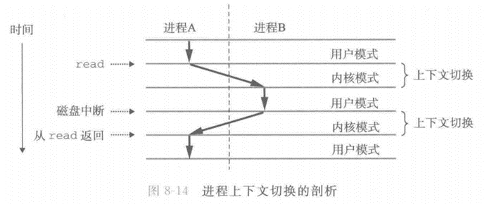
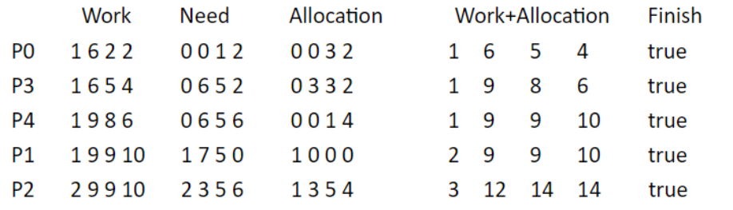
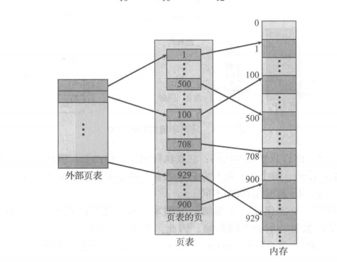
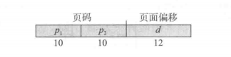

# 进程

## 进程 = 控制流 & 虚拟内存

- 通过进程为App提供两个假象
  - 一个独立的逻辑控制流：即应用程序独占地使用处理器，处理器不间断地执行该程序的指令
  - 一个私有的地址空间：即应用程序独占地使用内存，系统内存唯一的对象是该程序的代码和数据
- 术语
  - 进程实例/线程实例：所执行的程序；
  - 上下文：实例正确运行所需要的信息和数据，存储在进程PCB；
  - 并发与并行
    - 并发流concurrent flow：两个逻辑流的生命周期重叠，而与处理器核数无关；逻辑流A开始且未结束，逻辑流B开始，那么A、B是并发流
    - 并行：同一时刻执行多任务
  - 时间片time slice：一个进程占用CPU的时间段
  - 多任务：进程之间轮流运行
- 逻辑控制流：逻辑控制流是PC程序计数器值的序列；该序列中的每个值唯一对应
  - 可执行目标文件中的指令
  - 或在运行时动态链接到程序的共享对象中的指令
- 虚拟地址空间
  - $\begin{matrix} 进程地址空间的区域 && 备注 
                  \\内核虚拟内存  && 代码、数据、堆、栈，该部分用户代码不可访问
                  \\ 用户栈 && 运行时创建，包括临时数据(如函数参数、返回地址和局部变量）)%esp栈指针存储其起始地址
                  \\    && 空闲区
                  \\共享库的内存映射区域
                  \\   &&空闲区
                  \\ 运行时堆 && 运行时malloc分配
                  \\ 读／写段(数据段) && .data(包括全局变量、静态变量) .bss(未初始化虚拟空间)
                  \\ 只读代码段 && (程序文本).init、.text、.rodata
    \end{matrix}$
- 用户/内核模式
    - 由处理器中的某控制寄存器的值决定进程所处模式
    - 内核模式：允许进程执行指令集中的任何指令，访问任何内存位置，意味着该进程可以读写所有进程的虚拟地址空间的所有位置
      - 特权指令privileged instruction，例如系统函数所使用的指令
    - 用户模式：若该用户进程直接引用虚拟地址空间内核区中的代码和数据，会导致致命的保护故障
      - 通过系统调用接口，间接地访问内核代码和数据
    - 
      - 上下文切换、系统调用在内核模式下进行的；
      - 调度器、sleep函数显式休眠、中断如定时器导致上下文切换
- 进程组：逻辑概念，用于管理进程；
    - 一个进程只能属于一个进程组
  ```c
  #include <unistd.h> 

  pid_t getpgrp(void);

  //返回：调用进程的进程组ID。
  ```
  - 默认情况：父子进程同属于一个进程组
    - 如果不使用setpgid函数显式改变进程组，那么所有进程同属一个进程组
  - setpgid(pid_t pid, pid_t pgid)
    - 将进程pid的进程组改为pgid
    - 如果pid是0，那么就使用当前进程的PID
    - 如果pgid是0，那么就用pid指定的进程的PID作为进程组号
    - setpgid(0,0)，当前进程号53
      - 相当于setpgid(53,53)；
      - 创建新的进程组53，并将进程53加入到进程组53
```c
  #include <unistd.h>

  int setpgid(pid_t pid, pid_t pgid);

  \\返回：若成功则为0，若错误则为—1。
```
- 作业：包含一个或多个进程的进程组，shell创建
  - 前台作业：0个或1个，与终端进行数据交互
  - 后台作业：0个或多个，不与终端输入输出
  - 取进程组中的一个父进程ID作为进程组ID

  
## Posfix

- 进程状态
  - 运行：占用Cpu时间片，或处于就绪队列
  - 阻塞：接收到阻塞信号、或执行显式系统调用
  - 终止：接收到终止信号、从进程实例返回、执行exit(0)
  
- pid_t进程标识符
  - 作为索引，唯一识别线程的方式，以init进程为例，pid为1的init进程可能派生多个相同名字的进程；
  - pid_t：经过typedef重命名的unsigned int数据结构，_t说明pid_t不透明
    - 不透明：不能直接访问，只能通过函数接口进行读写；

```c

#include <sys/types.h>

pid_t getpid(void);

pid_t getppid(void);


```


- fork是系统调用，其执行效果如下：
    - 遵循进程提供的假象：pid不同的进程，控制流和虚拟内存独立；
    - 子进程的虚拟内存：大部分与父进程的数据和代码相同
      - 子进程继承父进程的上下文
      - 子进程继承文件描述符等资源
    - 子进程的控制流：与父进程相同，但是程序计数器指向创建自己的fork()语句，得到返回值0，但是不会再创建进程；
      - 因此在两个控制流中都执行了一次fork函数，呈现fork()调用一次，返回两次的假象；
    - 通过偏序偏序构建进程树，分析关键语句的输出；
      - 父进程定义的文件描述符会被继承，父子进程需要注意并发问题
    - Unix处理fork的两种形式
      - 复制所有线程
      - fork的同时执行execev函数，仅复制调用系统调用fork的线程
```c

#include <sys/types.h>
#include <unistd.h>


/*父进程中fork返回正整数，即子进程的pid
 *子进程中 fork返回0
 *父进程中fork返回负数，子进程创建失败
 */
pid_t fork(void);


```

```c
  #include <stdio.h>
  #include <sys/types.h>
  #include <unistd.h>

/*本程序演示fork()调用一次，返回两次的假象*/
  int main() {
    pid_t child_pid;

    child_pid = fork();

    if (child_pid == -1) {
        perror("fork");
        return 1;
    }
    else if (child_pid == 0) {
        printf("I am the child process. My PID is %d.\n", getpid());
    }
    else {
        printf("I am the parent process. My PID is %d", getpid());
    }
    return 0;
  }

```


- exit
  - 效果
    - 执行用户使用atexit函数注册的终止处理程序
    - 关闭打开的文件流
    - 刷新I/O缓冲区，确保文件系统与内存同步
    - 释放内存、清理临时文件
    - 将status状态码通过操作系统传递给父进程，父进程可以使用wait/waitpid函数接收该状态码；
  - 无返回值
  - 参数status8位状态码，值范围0-255
    - 0：成功，预定义宏EXIT_SUCCESS
    - 非0：错误，预定义宏EXIT_FAILURE
    - 约定的特殊状态码：状态码128+信号值表示导致进程终止的信号；例如：130表示SIGINT导致进程终止；
    - 开发者自定义status的含义，操作系统负责将其传递给调用了wait/waitpid的父进程；
  - ps：exit执行后，该进程仍在进程表中占用条目，该进程成为僵尸进程；需要父进程调用wait/waitpid函数清除该条目；

```c
void exit(int status);

```

- 父进程结束时，不会等待子进程结束
  - 若父进程先于子进程结束，则子进程更改父进程为init进程，验证程序如下
  - ps：init进程：内核空间初始化结束后创建init进程，ID为1；
  - ps：init进程是第一个用户进程，所有进程的祖先进程；

```c 

#include <stdio.h>
#include <stdlib.h>
#include <unistd.h>
#include <sys/types.h>
#include <sys/wait.h>

/*该演示程序有可能错误*/
int main() {
    pid_t pid = fork();
    
    if (pid < 0) {
        perror("Fork failed");
        return 1;
    }
    else if (pid == 0) {
        // 子进程
        sleep(10);
        printf("子进程的父进程ID：%d\n", getppid());
    }
    else {
        // 父进程
        printf("父进程的ID：%d\n", getpid());
    }
    return 0;
}

```

- wait和waitpid：
  - 更改父进程状态为阻塞，等待子进程的exit状态码；
    - 没有子进程等价于跳过该语句；
  - 接收到子进程的exit状态码后，操作系统清除该僵尸进程在进程表中的条目
    - 僵尸进程：已调用exit终止，但是未被waitpid/wait函数接收状态码的子进程；
    - 用户在接收状态码后，应检查子进程的终结状态
    - 如果exit完全清除子进程的内存占用，那么父进程将不会得知子进程的结束状态
  - 父进程成为僵尸进程后，子进程无法将其作为父进程，Linux立即更改该孤儿进程的父进程为init进程，更改其进程组为init所在的进程组；
  - 如果父进程未调用wait/waitpid清除僵尸进程，僵尸进程会一直占用进程表条目，直到操作系统清理它们。

- waitpid系统调用
  - pid
    - -1：同wait函数，等待任何一个子进程
    - 0：等待与调用 waitpid() 的父进程在同一个进程组中的任何子进程
    - $>$ 0：等待指定进程ID的子进程
  - status：
    - 一个指向 int 类型的变量的指针
    - 用于保存子进程的退出状态
    - 如果不关心退出状态，可以将该参数设置为 NULL
  - options：指定父进程的等待行为
    - `WCONTINUED`：等待任何已经停止的子进程继续执行
    - `WNOHANG`：如果已有子进程成为僵尸进程，返回其pid；否则立即返回0，不会阻塞；
    - `WUNTRACED`：阻塞父进程，直到有一个子进程终止
  - 返回值
    - 返回子进程pid，若没有子进程或出现错误，返回-1；

```c
#include <sys/types.h>
#include <sys/wait.h>

pid_t waitpid(pid_t pid, int *status, int options);

```

- wait系统调用：等价`waitpid(-1,&status,0)`

- execev函数
  - 覆盖进程代码和数据，执行新程序；但不改动资源
  - 通常fork子进程并调用execev，不改动父进程程序，继承父进程资源，并执行新程序；
  - execev函数执行成功时不会返回，因为新程序会覆盖旧程序
  - 如果执行失败，不会加载新程序，而是返回-1给旧程序的调用点;

```c

int execve(const char *filename,
           char *const argv[],
           char *const envp[]);
/*filename：可执行文件路径
 *argv：字符串数组指针，该数组以空指针结尾，用于传递命令行参数
 *envp：字符串数组指针，该数组以空指针结尾，用于传递环境变量
 *返回-1执行失败，否则表示成功
 */
```

```c

#include <stdio.h>
#include <unistd.h>
#include <sys/types.h>
#include <sys/wait.h>

/*execev函数会覆盖原线程实例，重置PC；
 *该程序输出目录条目名及文件名
 */
int main() {
    char* args[] = { "/bin/ls", "-l", NULL };
    execv(args[0], args);
    printf("这行代码不会被执行\n");
    return 0;
}

```


## task_struct

- LinuxPCB进程控制块，使用task_struct数据结构表
  - 位于虚拟内存区域内核区中的与进程相关的区域，每个进程的该区域映射到不同的物理页；
- PCB大概的分类区域：进程状态、程序计数器、Cpu寄存器、调度、内存管理、记账、I/O状态、线程信息


- 进程调度


```c

int on_rq;                         // 进程是否在运行队列上，1表示在队列上，0表示不在队列上

int prio;                          // 动态优先级，由调度器动态调整
int static_prio;                   // 静态优先级（不会被调度器改变）
int normal_prio;                   // 普通优先级（动态优先级的基准值）
unsigned int rt_priority;          // 实时优先级，用于实时调度策略

struct sched_entity se;            // 进程的调度实体，包含与进程调度相关的信息
struct sched_rt_entity rt;         // 用于实时调度策略的调度实体
struct sched_dl_entity dl;         // 用于实时周期性调度策略（Deadline Scheduling）的调度实体
const struct sched_class* sched_class;  // 指向调度器类的指针，定义了调度器的操作和行为

```
- 进程队列
  - 由调度器及其组件维护，用于管理和调度；
  - 该队列包含系统的所有进程中的tasks结构体
  - 由tasks结构体构成的进程队列是Linux 内核中进程管理操作的主要列表
  - 使用current指针指向当前系统执行的进程

```c

struct list_head	tasks;

```

- list_head结构体
  - 链表头entry始终存在
  - 链表是循环链表
    - 链表的第一个元素的prev指向链表的最后一个元素
    - 链表的最后一个元素的next指向链表的第一个元素
    - 若仅有entry，则entry的prev、next指向自己；
  - 若链表有进程
    - entry的next指向第一个PCB中的tasks；
    - 第一个PCB中的next指向下一个PCB中的tasks；
    - 第一个PCB中的prev指向entry；

```c

struct list_head {
    struct list_head *next, *prev;
};

```

- `mm_struct`内存管理
  - mmlist:list_head类型，将mmlist添加到内存管理子系统维护的进程列表中；
  - 由tasks结构体和mm_struct结构体构成的链表是独立的，由不同的系统维护；
  - 
  - mm_struct成员变量如下，附vm_area_struct结构体

```c

struct mm_struct {
    struct vm_area_struct *mmap;      // 进程的内存映射表
    struct rb_root mm_rb;             // 红黑树，用于管理进程的虚拟地址空间

    pgd_t *pgd;                       // 进程页表的顶级页目录项
    atomic_t mm_users;                // 引用计数，用于追踪共享该地址空间的进程数
    atomic_t mm_count;                // 引用计数，用于追踪对该地址空间的引用数
    int map_count;                    // 进程的内存映射计数器
    rwlock_t mmap_lock;               // 用于保护对内存映射的并发访问

    struct list_head mmlist;          // 进程链表中的链表节点

    unsigned long hiwater_rss;        // 高水位标记，表示进程的最高物理内存使用量
    unsigned long hiwater_vm;         // 高水位标记，表示进程的最高虚拟内存使用量
    unsigned long total_vm;           // 进程的总虚拟内存大小
    unsigned long locked_vm;          // 进程的锁定（无法交换）的虚拟内存大小
    unsigned long pinned_vm;          // 进程的固定（无法换出）的虚拟内存大小
    unsigned long data_vm;            // 进程的数据段虚拟内存大小
    unsigned long stack_vm;           // 进程的栈段虚拟内存大小

    struct mmu_notifier_mm *mmu_notifier_mm;

    struct file *exe_file;            // 可执行文件的文件结构体指针
    unsigned long start_code;         // 进程代码段的起始地址
    unsigned long end_code;           // 进程代码段的结束地址
    unsigned long start_data;         // 进程数据段的起始地址
    unsigned long end_data;           // 进程数据段的结束地址
    unsigned long start_brk;          // 进程堆的起始地址
    unsigned long brk;                // 当前进程堆的结束地址
    unsigned long start_stack;        // 进程栈的起始地址
    unsigned long arg_start;          // 进程命令行参数的起始地址
    unsigned long arg_end;            // 进程命令行参数的结束地址
    unsigned long env_start;          // 进程环境变量的起始地址
    unsigned long env_end;            // 进程环境变量的结束地址
};

//vm_area_struct 结构体用于描述进程的虚拟内存区域的属性和相关信息

struct vm_area_struct {
    struct mm_struct *vm_mm;         // 指向所属进程的 mm_struct 结构体的指针
    unsigned long vm_start;          // 虚拟内存区域的起始地址
    unsigned long vm_end;            // 虚拟内存区域的结束地址
    pgprot_t vm_page_prot;           // 页保护标志
    unsigned long vm_flags;          // 区域的标志和属性
    struct rb_node vm_rb;            // 红黑树节点，用于管理虚拟内存区域
    union {
        struct {
            struct mmu_notifier_range vm_mmuref;  // mmu_notifier 相关信息
            unsigned long vm_pgoff;               // 虚拟页偏移量
        };
        struct {
            struct list_head anon_vma_node;        // 匿名 VMA 的链表节点
            struct anon_vma *anon_vma;             // 匿名 VMA 结构体指针
        };
    };
    struct vm_operations_struct *vm_ops;   // VMA 操作函数指针
    unsigned long vm_pgoff;                 // 虚拟页偏移量（备用）
    struct file *vm_file;                   // 映射的文件结构体指针
    void *vm_private_data;                  // 指向私有数据的指针
};

```

- 进程关系
  - 在task_struct中，通过list_head类型的children/sibling结构体，将本进程PCB块加入子进程链表、兄弟进程链表
  - SIGHLD信号：子进程终止或停止时，OS向父进程发送SIGHLD信号
  - wait4()：阻塞父进程，等待子进程的终止并获取其状态信息

SIGHLD信号的主要作用是通知父进程子进程的终止状态，以便
  
```c
struct task_struct __rcu* real_parent;             // 始终指向创建该进程的进程
struct task_struct __rcu* parent;                  // 接收 SIGCHLD信号和wait4()报告的进程，当使用setppid函数更改父进程时，该成员变量的值随之改变

struct list_head children;                         // 子进程链表
struct list_head sibling;                          // 兄弟进程链表

struct task_struct* group_leader;                  // 进程组的领导进程
struct list_head ptraced;                          // 正在使用 ptrace() 跟踪的任务列表
struct list_head ptrace_entry;                     // 当前任务在父进程的 ptraced 链表中的链接
struct pid* thread_pid;                            // 进程的 PID 结构指针
struct hlist_node pid_links[PIDTYPE_MAX];          // 进程在 PID 哈希表中的链接
struct list_head thread_group;                     // 进程组的链表
struct list_head thread_node;                      // 进程在线程组中的链接
struct completion* vfork_done;                     // vfork() 完成的信号量

int __user* set_child_tid;                         // CLONE_CHILD_SETTID 的子进程 TID 指针
int __user* clear_child_tid;                       // CLONE_CHILD_CLEARTID 的清除子进程 TID 的指针
void* worker_private;                              // 工作线程的私有数据

```

- 文件系统
  - `fs_struct`:文件系统信息
  - `files_struct`：已打开文件信息

```c
/* 文件系统信息 */
struct fs_struct* fs;

/* 打开文件信息 */
struct files_struct* files;


\\fs_struct的实现

struct fs_struct {
    atomic_t count;                         // 引用计数，用于跟踪结构体的引用数
    struct rw_semaphore lock;               // 文件系统锁，用于保护对文件系统结构的并发访问
    int umask;                              // umask 值
    struct path root;                       // 根目录的路径
    struct path pwd;                        // 当前工作目录的路径
    struct path altroot;                    // 备用根目录的路径
    struct dentry *rootmnt;                  // 根目录的挂载点
    struct dentry *pwdmnt;                   // 当前工作目录的挂载点
    struct dentry *altrootmnt;               // 备用根目录的挂载点
    struct vfsmount *rootmnt_mnt;            // 根目录的挂载信息
    struct vfsmount *pwdmnt_mnt;             // 当前工作目录的挂载信息
    struct vfsmount *altrootmnt_mnt;         // 备用根目录的挂载信息
    struct list_head mounts;                 // 挂载点链表
    struct list_head pending_mounts;         // 待挂载点链表
    struct list_head umounts;                // 待卸载点链表
    struct list_head mnt;                    // 挂载点链表（简化版本）
    struct list_head mountpoints;            // 挂载点链表（按挂载点排序）
    struct list_head mnt_users;              // 挂载点用户链表
    struct list_head mnt_groups;             // 挂载点组链表
    struct list_head inotify_watches;        // inotify 监听链表
    struct user_namespace *user_ns;          // 用户命名空间
    struct ucounts *ucounts;                 // ucounts 结构指针
    struct ucounts *pid_ns_ucounts;          // 与 pid 命名空间相关的 ucounts 结构指针
    struct rcu_head rcu;                     // RCU（Read-Copy-Update）回收机制
};


\\files_struct的实现
struct files_struct {
    atomic_t count;                             // 引用计数，用于跟踪结构体的引用数
    struct fdtable *fdt;                        // 文件描述符表指针
    struct fdtable fdtab;                       // 文件描述符表
    struct file *fd_array[NR_OPEN_DEFAULT];      // 文件指针数组，用于存储打开的文件
    unsigned long close_on_exec_init[BITS_TO_LONGS(OPEN_FD_SET_SIZE)];   // 存储执行 exec 时需要关闭的文件标记
    unsigned long open_fds_init[BITS_TO_LONGS(OPEN_FD_SET_SIZE)];       // 存储打开的文件标记
    struct rcu_head rcu;                        // RCU（Read-Copy-Update）回收机制
    struct list_head file_locks;                // 文件锁链表
};

```

- 信号

```c


/* Signal handlers: */
struct signal_struct* signal;               // 信号处理结构体
struct sighand_struct __rcu* sighand;       // 信号处理程序结构体
sigset_t blocked;                           // 阻塞的信号集合
sigset_t real_blocked;                      // 真实阻塞的信号集合
/* Restored if set_restore_sigmask() was used: */
sigset_t saved_sigmask;                     // 保存的信号屏蔽字
struct sigpending pending;                   // 挂起的信号
unsigned long sas_ss_sp;                     // 信号栈指针
size_t sas_ss_size;                          // 信号栈大小
unsigned int sas_ss_flags;                   // 信号栈标志

struct callback_head* task_works;            // 任务工作项链表

```

- 线程
  - `thread_struct`是变长结构体
  - 必须放在`task_struct`的末尾
  - 

```c

struct thread_struct   thread;

```

## 调度算法

- 进程周期：CPU执行、I/O执行
  - CPU执行：进程在CPU时间片执行以下任务：
    - 执行指令流、读写内存、上下文切换
  - I/O执行：执行以下同步指令、或异步事件时
    - 输入：外部设备写入内存，OS等待外部设备的响应
    - 输出：内存写入外部设备，OS等待外部设备的响应
    - 异常
- 调度
  - 非抢占调度：一直占用Cpu，直到进程状态更改为阻塞、终止
  - 抢占调度：只要进程状态从运行、阻塞更改为就绪，那么该进程就可以强制占用Cpu
- 调度算法与进程周期执行时间分布的关系
  - 根据CPU执行、I/O执行占比，将程序分为I/O密集型程序和CPU密集型程序；前者CPU执行时间短，主要依赖于与外部设备的交互；后者CPU执行时间长，主要处理计算与复杂算法；
  - 调度算法的选择依赖于执行时间的分布
- 调度程序：在用户模式下快速进行用户级进程切换，避免切换到内核模式
  - 完成以下工作：切换上下文、切换到用户模式、跳转到用户程序的合适位置，以便重新启动程序
  - 短期调度程序：在位于内存的就绪队列中选择进程
  - 长期调度程序：从硬盘缓冲池选择程序加载到内存
  - 中期调度程序
    - 交换：执行的进程从Cpu中换出，之后从硬盘调入内存中的就绪队列
- 调度准则：平均以下指标权重
  - CPU使用率：40%_轻负荷系统,90%_重负荷系统
  - 吞吐量：单位时间单元内完成的进程数
    - 长进程调度：吞吐量可能为每小时一个进程
    - 短进程调度：吞吐量可能为每秒十个进程
  - 周转时间：进程提交开始计时，进程结束停止计时
  - 等待时间：就绪队列中的时间和
  - 响应时间：从发出请求到系统开始响应的时间;交互式系统；
- Gantt图
  - 一维坐标给出进程进入就绪队列的时间
  - 另一个一维坐标给出Cpu调度的顺序
- FCFS
  - 非抢占：Cpu密集型进程长时间运行，大幅增加平均等待延迟(假设有n个进程等待，每1s增加总等待延迟ns)
  - 实现：不需要额外的数据结构，使用现有的就绪队列；
- 最短作业优先shortest job first
  - 更准确的说法：最短下次CPU执行
    - 如果能够0开销得知程序运行花销，那么sjf算法是最优的；对于长期运行调度，额外的预测花销是必要的；在短期cpu调度上，没有办法实现
  - 预测方式：$\tau_{n+1}=\alpha t_n+(1-\alpha) \tau_n$
    - $\tau_{n}$：上次的预测值
    - $\tau_{n+1}$：使用最近信息更新后的预测值
    - $\alpha$：权重
      - $α = 0$：最近信息不重要，完全以历史数据为准
      - $α = 1$：完全以上次运行结果为准
    - $t_n$：上次运行的花销；
    - 展开预测公式$\tau_{n+1}=\alpha t_n+(1-\alpha) \alpha t_{n-1}+\cdots+(1-\alpha)^j \alpha t_{n-j}+\cdots+(1-\alpha)^{n+1} \tau_0$
    - 因为`α、(1-α)`都小于1，所以历史信息的权重依次递减；
  - SJF可以设计为抢占或非抢占
- 优先级调度
  - 给定每个进程的优先级，设计抢占或非抢占
  - 主要问题：饥饿
  - 解决方案：老化
    - 按时间递减进程优先级
- 轮转
  - 为每个进程分配时间片，时间片到时后上下文切换到就绪队列中的下一个进程
  - 要么一个时间片结束，要么被抢占
  - 时间片极大，即FCFS算法，时间片极小，大量的上下文切换
  - 时间片设计为10%是上下文切换，因此不同程序时间片长度不同
- 多级队列调度
  - 前台程序：交互、后台程序：批处理
  - 将就绪队列分类为多个队列，每个队列拥有自己的调度算法，队列之间需要调度算法，通常为固定优先级调度；也可以设计为p%的时间片分配给p队列；
- 多级反馈调度
  - 增加老化：体现在进程可以在不同的队列间移动
  - 执行时间过长的作业降低优先级，执行时间较短的作业提升优先级。
- 实时调度
## 线程调度

- 线程库管理用户级线程，被映射到内核级线程，然后才能够被内核级线程执行；
  - 线程库Thread Library负责用户级线程的创建、调度和销毁
  - 用户级线程在应用程序层次创建管理，线程库仅能执行用户线程调度，需要映射到内核才能被Cpu执行；
  - 用户级线程映射到内核级线程：
    - 内核级线程由内核线程调度器管理调度，是线程的实际执行单位
    - 线程库将用户级线程映射到一个或多个内核级线程，将控制权交给内核，由内核级线程来执行该用户级线程的任务
- 多对一模型:多个用户级线程映射到一个内核线程
  - 缺点：如果一个线程执行阻塞系统调用，该内核线程所处的进程会阻塞
  - 该内核线程的管理的所有用户线程不能在多个处理器上并行
  - 目前没有操作系统使用多对一模型
- 一对一模型
  - 每个用户线程到一个内核线程
  - 允许多个线程并行运行在多处理器系统上
  - 缺点：创建一个用户线程就要创建一个相应的内核线程。为了避免同时线程数过多，限制能创建的内核线程数，创建内核线程的开销会影响应用程序的性能
- 多对多模型:多路复用多个用户级线程到同样数量或更少数量的内核线程
  - 内核线程的数量被限制，因此内核线程类似线程池以调度用户线程
  - 双层模型：允许多对多模型，同时允许绑定用户线程和一个内核线程
  - .png)
  - .png)
- 线程库
  - 实现一： 在用户空间中提供一个没有内核支持的库。这种库的所有代码和数据结构都位于用户空间。这意味着，调用库内的一个函数只是导致了用户空间内的一个本地函数的调用，而不是系统调用
  - 实现二：由操作系统直接支持的内核级的一个库；库内的代码和数据结构位于内核空间。调用库中的一个API函数通常会导致对内核的系统调用
  - Pthreads：可以提供用户级或内核级的库
  - Windows线程库：Windows操作系统的内核级线程库
  - Java线程API允许线程在Java程序中直接创建和管理，Java线程API采用宿主系统的线程库来实现
- 轻量级线程LWP：一定数量的Lwp供用户级线程使用
  - 用户级和内核级进程的中间数据结构
  - 对用户级线程库，Lwp是虚拟处理器
  - 每个LWP与一个内核线程相连，只有内核线程实际运行于物理处理器。如果内核线程阻塞，LWP也会阻塞，Lwp所连接的所有用户线程阻塞
 ## 同步

- 临界区：执行写共享变量的代码块
- 解决临界区需要满足：
  - 互斥：冲突进程在临界区互斥
  - 进步：临界区没有进程在执行，就允许该进程进入临界区；并负责选择下一个进入该临界区的进程
  - 有限等待：不能发生饿死进程
- 信号量
  - 定义信号量`s`和两个原子操作`P(s)、V(s)`
    - 信号量s：初始化值是允许使用共享变量的最大的线程数；非负全局变量
  - `P(s)`：
    - 若`s>0`：允许线程获取资源，s--；该操作应是原子性的，不能同时由两个线程对同一个s进行自减；
    - 若`s==0`：共享资源不可用，阻塞线程；
      - 直到某个线程调用`V(s)`使`s>0`，并选择唤醒该线程；
      - 线程被唤醒后，继续执行`P(s)`
  - `V(s)`：s++
    - 线程执行V操作，释放资源，使s++；
    - 该操作应同时根据竞争策略选择被`P(s)`阻塞的线程执行`P(s)`；触发P(s)也是原子性的
- 信号量实现
  - 二元互斥锁：`s`初始化为1
  - 计数信号量：作为一组可用资源的计数器的信号量
    - 不能同时对一个资源进行写操作
- Linux信号量

```c
/*Posix定义的信号量操作函数*/
#include <semaphore.h>

int sem_init(sem_t *sem, //信号量
             int pshared,//0：互斥锁；非0：共享锁
             unsigned int value//信号量的初始值
             );

 /*初始化*/

int sem_wait(sem_t *s);  /*P(s)*/ 

int sem_post(sem_t *s);  /*V(s)*/


// 返回：若成功则为0，若出错则为—1

```
### 经典同步问题

- 读写者
  - 共享对象
  - 无限的写者，写者必须独占共享对象
  - 无限的读者，读者可以和无限多个读者共享对象
  - 读者/写着优先级不同，对应不同的实现
- 实现一：读者优先
  - 读者不会等待，除非写者已占据共享对象
  - 一般效果：只要读者不为0，那么写者永远不会进行写
  - 特殊的效果：下述代码的优先级低是较低的，因为V操作会唤醒另一个写者，一群写者可能使一个读者饥饿；
- 饥饿：线程无限期阻塞

```c
/*伪代码，伪代码，伪代码*/


int readcnt; 
sem_t mutex, w; 
/*共享变量有两个，readcnt和被读写的共享对象，mutex保护mutex，w保护共享对象*/

/* 初始化：readcnt = 0, mutex = 1, w = 1 ，锁1为解锁，0为加锁*/

void reader(void) {
    while (1) {
        //修改readcnt
        P(&mutex); 
        readcnt++; 
        if (readcnt == 1) 
            P(&w); // 防止writer修改共享变量
        V(&mutex); 


        //修改共享变量的操作


        //修改readcnt
        P(&mutex); // 获取互斥信号量，锁住临界区
        readcnt--; // 读者计数器减1
        if (readcnt == 0) // 最后一个读者离开
            V(&w); // 释放写者信号量，允许写者进入临界区
        V(&mutex); // 释放互斥信号量，允许其他读者进入临界区
    }
}

void writer(void) {
    while (1) {
        // 修改共享变量
        P(&w); 
        /*操作*/
        V(&w);
    }
}


```

- 哲学家就餐


- 管程：封装信号量和p、v操作
## 死锁

- 死锁成立的条件
  - 互斥、占用一个资源并等待另一个资源、非抢占(自愿释放资源)、循环等待
  - 循环等待：$\left\{P_0, P_1, \cdots, P_n\right\}$中，进程$P_{i-1}$等待的资源被$P_i$占有，$P_{n}$等待的资源被$P_0$占有
- 上述条件等价的资源分配图：点{进程、资源}，边{进程->资源(申请)，资源->进程(已分配)}
    - 如果互斥，那么出现环代表出现死锁
- 死锁处理
  - 通过协议确保不会死锁
  - 允许系统进入死锁，检测死锁并加以恢复
  - 忽视死锁，认为死锁不可能在系统内发生
- 操作系统默认忽略死锁，需要用户自行避免死锁
- 死锁预防：确保上面的条件至少有一个不成立
  - 条件二：申请部分资源时，未给其他资源上锁
  - 条件三：申请资源被占有时，检查自己持有的资源是否被目标占有，如果不是就等待，如果是就抢夺资源
  - 条件四：维持一个资源分配图
    - 资源分配id，形成自小到大的集合；
    - 进程只能申请比持有资源大的资源；
- 死锁避免：动态检查资源分配状态，确保循环等待条件不能成立
  - 安全状态：安全状态的进程序列$\left\langle P_1, P_2, \cdots, P_n\right\rangle$，$P_i$满足：可以申请的资源数小于当前可用资源数加上所有满足j<i进程$P_j$所占有的资源数；此时允许进程等待；
  - 资源分配图算法：互斥
    - 引入需求边，用虚线表示；表示未来会申请该边
    - 重新定义申请表：当前申请的边
    - 进程开始时，所有需求边位于资源分配图
    - 假设进程P申请资源R：当且仅当将申请边P->R，变成分配边R→P，无环时允许申请
  - 银行家算法：计数
    - 确保不会为某个进程分配过多资源
    - 新进程进入时，应声明可能需要的每种类型资源实例的最大数量，这一数量不能超过系统资源的总和
    - 用户申请一组资源时，系统确定这些资源的分配是否仍会使系统处于安全状态。如果会，就可分配资源；否则，进程应等待，直到某个其他进程释放足够多的资源为止
    - 数据结构：
      - Available[i]=k，资源i可用数为k
      - Max[i][j]=k，进程i对资源j的最大需求是k
      - Allocation[i][j]=k:，进程i已分配k个资源j
      - Need[i][j]=Max[i][j]-Allocation[i][j]
    - 执行安全性检查的操作
      - work数组是Available的副本
      - Finish数组标记第i进程分配了资源并且已完成
      - work和Finish是安全性检查的局部变量
      - 第一步：当前work是否满足至少一个未完成的进程的need
        - 满足进行第二步，否则说明系统不安全
      - 第二步：假设满足该进程的need后，将该work分配给它，然后它完成工作释放所有资源
        - 简略该步骤表示为：work+第一步检查可满足的进程的allocation，然后将该进程标记为已完成
      - 第三步返回第一步，
      - 
      - FInish所有值都为真后，说明该系统是安全的，至少存在一个可完成的安全序列；
    - 资源请求算法：试探将资源分配给进程，检查分配后是否为不安全状态。如果资源请求通过了安全性检查，则分配资源给该进程，否则将请求阻塞；
    - 银行家算法过程
      - 新进程请求资源的合法性检查：request<need&&request<Available，否则阻塞
      - 假定分配并暂时修改数据，执行安全性检查
      - 通过检查，则修改；否则恢复原来的状态；
- 死锁检测
  - 开销：检测的花销+恢复检测的损失
  - 每种资源类型只有单个实例：
    - 资源分配图删除进程得到仅有边和资源的等待图
    - 当等待图出现环，说明死锁存在；
  - 每种资源有多个实例
    - 环是死锁的必要条件
    - .png)
- 死锁检测时机
  - 调用时机1：请求得不到满足就调用死锁检测，适用于死锁频繁的系统；可确定造成死锁的进程
  - 调用时机2：定时检测是否死锁，花销相对低
- 死锁恢复
  - 通过进程终止恢复死锁
    - 方法一：中止所有死锁进程
    - 方法二：每次中止一个进程，并调用死锁检测，直到死锁消除
    - 选择被终止程序的策略；估计最小代价
  - 通过抢占资源恢复死锁
    - 选择被牺牲进程：抢占被牺牲进程的资源，确定抢占的顺序与
    - 避免同一个进程老是被抢占饿死


# 多线程编程

- 隐式多线程：线程的创建与管理交给编译器和运行时库来完成

## 线程池

- 优点：
  - 无需创建线程；直接服务请求；
  - 限制同一时间运行的线程数量；
- 概念
  - 对象：生产者、消费者、n个槽位作为共享变量
  - 生产者：若有槽位可用，则插入item，标志该槽位不可用；若无槽位可用就等待；
  - 消费者：若有item可用，操作该item，并标志该槽位可用；

```c
// 生产者-消费者实现
typedef struct {
	int* buf;     /* 缓冲区数组 */
	int n；       /* 槽位的最大数，当插入到n-1索引项时，不再增长数组，而是在(front+1)%n=0索引项上插入item */
	int front;    /* 若信号量允许，则可从索引(front+1)%n 处取出项目；front总是++ */
	int rear;	  /* 若信号量允许，则可在索引(rear+1)%n 处插入项目;rear总是++ */
	sem_t mutex;  /* 互斥信号量，保证同一时间只有一个线程写共享变量buf */
	sem_t slots;  /* 计数信号量，若slots==0，则没有可用槽位，线程阻塞 */
	sem_t items;  /* 计数信号量，若items==0，则没有可用item，线程阻塞 */
} sbuf_t;
```

```c
#include <stdlib.h>
#include <semaphore.h>


typedef struct {
	int* buf;     /* 缓冲区数组 */
	int n；       /* 槽位的最大数，当插入到n-1索引项时，不再增长数组，而是在(front+1)%n=0索引项上插入item */
	int front;    /* 初始化为0，若信号量允许，则可从索引(front)%n 处取出项目；front总是++ */
	int rear;	  /* 初始化为0，若信号量允许，则可在索引(rear)%n 处插入项目;rear总是++ */
	sem_t mutex;  /* 互斥信号量，保证同一时间只有一个线程写共享变量buf */
	sem_t slots;  /* 计数信号量，若slots==0，则没有可用槽位，线程阻塞 */
	sem_t items;  /* 计数信号量，若items==0，则没有可用item，线程阻塞 */
} sbuf_t;


/* 创建一个空的、有界的共享 FIFO 缓冲区，大小为 n */
void sbuf_init(sbuf_t* sp, int n) {
    sp->buf = (int*)malloc(n, sizeof(int));
    sp->n = n;
    sp->front = sp->rear = 0;
    sem_init(&sp->mutex, 0, 1);
    sem_init(&sp->slots, 0, n);
    sem_init(&sp->items, 0, 0);
}

/* 清理缓冲区 sp */
void sbuf_deinit(sbuf_t* sp) {
    free(sp->buf);
}

/* 将项目插入共享缓冲区 sp 的尾部 */
void sbuf_insert(sbuf_t* sp, int item) {
    sem_wait(&sp->slots);      // 若无槽位，阻塞线程；否则槽位--；
    sem_wait(&sp->mutex);      // 若执行到这个步骤，则可写；因为所有线程都是只能写第一个槽，所以必须获得互斥锁
    sp->buf[(++sp->rear) % (sp->n)] = item;      // 插入项目并更新rear；
    sem_post(&sp->mutex);      // 解锁缓冲区
    sem_post(&sp->items);      // 声明可用项目
}

/* 从缓冲区 sp 中移除并返回第一个项目 */
int sbuf_remove(sbuf_t* sp) {
    int item;
    sem_wait(&sp->items);      // 等待可用项目
    sem_wait(&sp->mutex);      // 若执行到这个步骤，则可写；因为所有线程都是只能写第一个槽，所以必须获得互斥锁
    item = sp->buf[(++sp->front) % (sp->n)];      // 复制项目并更新front，显式的归零是傻鸟操作
    sem_post(&sp->mutex);      // 解锁缓冲区
    sem_post(&sp->slots);      // 解锁front前的槽位(将)
    return item;
}
```

- 基于预线程化的并发服务器

- 预线程化
  - 主线程+一组工作者线程组成的服务器，限制线程数，而不是为每个客户端请求都开辟线程
  - 生产者：主线程监听描述符，并将返回的连接描述符插入缓冲区
  - 槽位：连接描述符
  - 消费者：工作者线程池不断处理缓冲区的已连接描述符


```c

#include "csapp.h"
#include "sbuf.h"

#define NTHREADS 4  \\线程数 
#define SBUFSIZE 16 \\缓冲器大小

void echo_cnt(int connfd); \\请求处理函数
void* thread(void* vargp);  \\定义线程入口函数

sbuf_t sbuf; /* 缓冲区槽位 */

int main(int argc, char** argv)
{
    int i, listenfd, connfd;
    socklen_t clientlen;
    struct sockaddr_storage clientaddr;
    pthread_t tid;

    if (argc < 2) {
        fprintf(stderr, "usage: %s <port>\n", argv[0]);
        exit(0);
    }

    listenfd = Open_listenfd(argv[1]);
    sbuf_init(&sbuf, SBUFSIZE);

    for (i = 0; i < NTHREADS; i++) {
        /* Create worker threads */
        Pthread_create(&tid, NULL, thread, NULL);
    }

    while (1) {
        clientlen = sizeof(struct sockaddr_storage);
        connfd = Accept(listenfd, (SA*)&clientaddr, &clientlen);
        sbuf_insert(&sbuf, connfd); /* Insert connfd in buffer */
    }
}

void* thread(void* vargp)
{
    Pthread_detach(pthread_self());

    while (1) {
        int connfd = sbuf_remove(&sbuf); /* Remove connfd from buffer */
        echo_cnt(connfd); /* Service client */
        Close(connfd);
    }
}


```
- 大中央调度
  - 以块block为调度单位并行运行；
  - 串行：维持一个队列以调度块，将链首的块分配给线程池，并移出调度队列；
  - 每个进程默认有主队列main queue，创建本进程的其它串行队列,实现并发

```c

//字符“,并使用{}标注块的代码
"{printf(*I am a block");}

```


# 信号

- Linux信号：某种事件发生时，向用户进程发送信号，当用户进程得到Cpu时间时，先转而执行信号处理程序；两种信号如下：
  - 软件形式的异常：允许内核和进程通过软件的方式**异步**中断其他进程；例如：
    - 进程作业执行时发生键盘键入，内核向前台进程组中的每个进程发送SIGINT信号
    - 一个进程向另一个进程发送SIGKILL信号以强制终止它
    - 子进程终止，内核向父进程发送SIGCHLD信号；
  - 执行进程指令发生低层的硬件异常时，向进程**同步**发送信号；
    - SIGSEGV段错误：进程访问无效的内存地址或进行非法的内存操作
    - SIGFPE浮点异常：除以零或产生无穷大结果时
    - SIGILL非法指令：尝试执行非法的指令
- 内核发送信号
    - 内核接收到发送信号的请求
      - 请求来源一：内核检测到一个系统事件，如除零错误或者子进程终止
      - 请求来源二：一个进程调用了kill函数，显式地要求内核发送一个信号给目的进程(可以要求内核向自己发送信号)
    - 触发信号处理程序
      - 默认信号处理程序
      - 用户定义的信号处理程序
- 接收信号
  - 进程在获得Cpu时间后执行指令流之前，处理信号
    - 忽略并丢弃信号
    - 发生异常，转而执行信号处理函数
- pending/blocked位向量
  - 内核向进程发送k信号，该进程的pending位置1；
    - 重复信号不会排队，但是也可能发生信息丢失
  - 进程接受信号，将pending位置0；
  - $\begin{matrix}pending && blocked&&解释\\ 0 && 0 &&信号已被处理，或没有信号\\ 1 && 0 && 未处理\\ 1 &&1&& 进程忽略该信号，该信号被阻塞\\ 0 &&1&& 无信号发出，且进程阻塞该信号\end{matrix}$
- 信号发送
  - /bin/kill程序发送信号
    - /bin/ki1l -9 15：给进程15发送信号9
    - /bin/ki11 -9 -15：给进程组15的每一个进程发送信号
  - 键盘输入
    - 在终端输入：Ctrl+C终止前台作业：内核发送SIGINT给前台进程组的每个进程
    - 在终端输入：Ctrl+Z挂起前台作业：内核发送SIGTSTP给前台进程组的每个进程
- **未完成-上界**

- 进程调用kill函数发送信号给其他进程(包括自己)
```c
#include <sys/types.h>
#include <signal.h>
  int kill(pid_t pid, int sig);
  \\返回：若成功则为 0， 若错误则为—1。
```
- kill(pid_t pid, int sig)
  - sig：要发送的信号号码
  - pid>0：目标进程是进程pid
  - pid=0：目标进程是，发送进程所在进程组的全部进程(包括自己)
  - pid<0：目标进程是，进程组|pid|中的全部进程
- 演示父进程向子进程发送SIGKILL信号
  - 该程序不会有打印结果；
```c
#include <stdio.h>
#include <stdlib.h>
#include <unistd.h>
#include <sys/types.h>
#include <signal.h>

int main() {
	pid_t pid;
	if ((pid = fork()) == 0) {
		pause();/*子进程等待SIGKILL的到来，并在接收该信号后直接结束，不会执行后面的所有语句*/
		printf("contro1 should never reach here!\n"); 
		exit(0);
	}
	/*父进程不会进入if语句，向子进程发送SIGKILL信号*/
	kill(pid, SIGKILL);
	exit(0);
}
  \\以上函数不包括错误处理
  \\fork()、kill()应包含错误处理如下：
  \\{
  \\  perror("fork");或者perror("kill");
  \\  exit(EXIT_FAILURE);
  \\}
```


- 进程调用alarm函数向自己发送SIGALRM信号
```c
  #include <unistd.h>

    unsigned int alarm(unsigned int secs)；

    //返回：前一次闹钟剩余的秒数，若以前没有设定闹钟，则为0。
```
- int alarm(unsigned int secs)
  - 内核调度安排闹钟
  - 内核在secs秒后发送一个SIGALRM信号给调用进程
  - 重复调用alarm函数
    - 重复调用参数为0：取消设置的闹钟；
      - 如果有待处理闹钟，返回剩余秒数
      - 如果没有待处理闹钟，返回0
    - 重复调用参数不为0，设置新的闹钟以替代旧闹钟
      - alarm函数只能为每个进程设置一个全局闹钟
  - 演示代码如下
```c
#include <stdio.h>
#include <unistd.h>
#include <signal.h>

void handle_alarm(int signum) {
    printf("Received SIGALRM signal\n");
}

int main() {
    signal(SIGALRM, handle_alarm);  // 注册信号处理函数

    unsigned int remaining = alarm(5);  // 设置闹钟为5秒
    printf("First alarm set for 5 seconds\n");

    sleep(2);  // 模拟一个耗时操作

    remaining = alarm(3);  // 重置闹钟为3秒
    printf("Second alarm set for 3 seconds\n");

    sleep(5);  // 模拟一个耗时操作

    remaining = alarm(0);//内核返回0表示当前进程没有pending alarm

    if (remaining > 0) {
        printf("There was a pending alarm with %u seconds remaining\n", remaining);
    }
    else {
        printf("No pending alarm\n");
    }

    return 0;
}

```
  - 运行结果
    - First alarm set for 5 seconds
    - Second alarm set for 3 seconds
    - Received SIGALRM signal
    - No pending alarm


- $G_i$:接收信号的不同阶段
- $G_0$：
  - 在kernel-mode切换user-mode之前,内核检查该进程的pending&&！blocked信号集合$α$
    - 进程不需要随时检测信号的到来
    - 信号处理程序是异步函数
  - 若$α$为空，则执行进程P的逻辑控制流的下一条指令$I_{next}$
  - 若$α$不空，则进行信号接收
- $G_1$:
  - 执行signal handler之前的工作
    - 内核清除该信号的pending位
    - 
  - 信号处理程序：
    - 操作系统为每个，信号准备默认的信号处理程序；
    - 应用开发者通过signal()注册信号处理程序；替代默认的信号处理程序

  - 

- 过程描述：
  - 内核模式切换到进程P的用户模式
  - 确认进程P的未被阻塞且待处理信号的集合：
    - pending为1，且blocked为0的信号
  - 若集合空：执行进程P的逻辑控制流的下一条指令$I_{next}$
  - 若集合不空
    - 强制进程接收该信号
    - 在用户态调用信号注册函数
    - 在内核态执行应用开发者的信号注册函数
      - 若未注册信号函数则执行操作系统的预定义默认行为,默认行为可能有
        - 进程终止。
        - 进程终止并转储内存，转储内存过程如下
          - 产生core dump核心转储文件，用于调试和分析
          - 在磁盘中保存进程在内核中的当前状态以及相关信息
            - 记录进程在接收信号时的内存映像，包括程序的代码、堆栈、寄存器状态等信息
            - 了解进程崩溃的原因和发生故障的位置
            - 核心转储文件可能包含敏感信息，生产时应禁用核心转存
      - 进程挂起直到被SIGCONT信号重启
      - 进程忽略该信号
    - 处理完集合中的所有信号后，控制传递回逻辑控制流中的下一条指令$I_{next}$

\\控制流指向信号处理程序，参数signum，因此可以在同一段程序处理多个信号

  - 信号处理程序return/函数末尾后，控制通常传递给进程的$I_{next}$
  - 在程序运行时捕获到信号，将控制转交给信号处理程序
  - 信号处理程序也可以被其他信号处理程序中断
    - 默认情况下，信号处理程序是信号屏蔽的，持续执行直到程序结束
    - 在信号处理函数设置合适的信号处理选项

**未完成-下界**


- Linux支持
  - POSIX信号(标准信号),signum:0-31
  - POSIX实时信号(real-time signals),signum:32-
- signal dispositions:
  - current disposition determines how the process bahaves when it is delivered the signal;
  - 进程通过系统调用：sigaction/signal函数更改signal disposition
    - SIGSTOP和SIGKILL不能被操作系统捕获或忽略，因此也不能被进程修改处理方式；是操作系统级别的强制停止和终止机制；
    - signal()更portable，但是系统不同函数行为不同，使用sigaction而非signal
    - sighandler_t handler可接受参数有三种
      - SIG＿IGN:该进程ignore信号signum
      - SIG＿DFL:信号signum被默认disposition处理
      - sighandler_t类型的参数：指向具有该签名的函数$void \ handler(int\ signum)$
    - 
```c
#include <signal.h>

  typedef void (*sighandler_t)(int);

  sighandler_t signal(int signum, sighandler_t handler);

//返回：若成功则为指向前次处理程序的指针，若出错则为SIG＿ERR(不设置errno)
```


  - signum:信号的类型号
  - handler：
    - SIG＿IGN:忽略signum
    - SIG＿DFL：恢复signum为默认行为
    - 应用开发者定义的函数地址，该函数称为信号处理程序
  - 设置信号处理程序installing the handler：通过把处理程序的地址传递到signal函数从而改变默认行为，因此在进程初始化时，就已经注册信号处理函数，以替代默认行为
    - 内核检查到信号就直接调用signal函数并通过signal函数找到信号处理程序的入口
```c
signal()
signal(SIGINT, signal_handler);
signal(SIGTERM, signal_handler);

```

```c
void signal_handler(int signum) {
    printf("Received signal: %d\n", signum);

    // 根据信号类型执行相应的操作
    if (signum == SIGINT) {
        printf("Handling SIGINT signal\n");
        // 执行 SIGINT 信号的处理逻辑
    } else if (signum == SIGTERM) {
        printf("Handling SIGTERM signal\n");
        // 执行 SIGTERM 信号的处理逻辑
    } else {
        printf("Unknown signal\n");
    }
}
```
# 物理内存

- 进程虚拟内存所映射的物理内存范围由基地址寄存器(确定最小物理内存地址)和界限地址寄存器(范围)
  - 仅允许内核模式访问基地址寄存器和界限地址寄存器
  - 判断用户访问地址是否在进程映射的物理地址范围内，如果不在则发生段错误；
- 载（dynamic loading）。采用动态加载时，一个程序只有在调用时才会加载。所有程序都以可重定位加载格式保存在磁盘上。主程序被加载到内存，并执行。当一个程序需要调用另一个程序时，调用程序首先检查另一个程序是否已加载。如果没有，可重定位链接程序会加载所需的程序到内存，并更新程序的地址表以反映这一变化。接着，控制传递给新加载的
- 如果有动态链接，在二进制映像内，每个库程序的引用都有一个存根（stub）。存根是一小段代码，用来指出如何定位适当的内存驻留库程序，或者在程序不在内存内时应如何加载库。当执行存根时，它首先检查所需程序是否已在内存中。如果不在，就将程序加到内存。不管如何，存根会用程序地址来替换自己，并开始执行程序。因此，下次再执行该程序代码
- 交换
  - 进程必须在内存中以便执行。不过，进程可以暂时从内存交换（swap）到备份存储（backing store），当再次执行时再调回到内存中（图8—5）。交换有可能让所有进程的总的物理地址空间超过真实系统的物理地址空间，从而增加了系统的多道程序程度。
  - 重定位寄存器方案提供了一种有效方式，以便允许操作系统动态改变大小。许多情况都需要这一灵活性。例如，操作系统的驱动程序需要代码和缓冲空间。如果一个驱动程序（或其他操作系统的服务）不常使用，可以不必在内存中保留它的代码和数据，这部分空间可以用于其他目的。这类代码有时称为暂时（transient）的操作系统代码；它们根据需要再调入或调出。因此，使用这种代码可以在程序执行时动态改变操作系统的大小。
- 连续内存分配（contiguous memory allocation）时， 
  - 每个进程位于一个连续的内存区域，与包含下一个进程的内存相连。
  - 现在我们讨论内存分配。最为简单的内存分配方法之一，就是将内存分为多个固定大小的分区（partition）。每个分区可以只包含一个进程。因此，多道程序的程度受限于分区数。
  - 对于可变分区（variable—partition）方案，操作系统有一个表，用于记录哪些内存可用和哪些内存已用。开始，所有内存都可用于用户进程，因此可以作为一大块的可用内存，称为孔（hole）。最后，正如将会看到的，内存有一个集合，以包含各种大小的孔。
    - 这种方法是通用动态存储分配问题（dynamic storage—allocation problem） （根据一组空闲孔来分配大小为n的请求）的一个特例。这个问题有许多解决方法。从一组可用孔中选择一
    - ·首次适应：分配首个足够大的孔。查找可以从头开始，也可以从上次首次适应结束时开始。一旦找到足够大的空闲孔，就可以停止。
    - ·最优适应：分配最小的足够大的孔。应查找整个列表，除非列表按大小排序。这种2方法可以产生最小剩余孔。
    - ·最差适应：分配最大的孔。同样，应查找整个列表，除非列表按大小排序。这种方法可以产生最大剩余孔，该孔可能比最优适应产生的较小剩余孔更为适用。
  - 外部碎片（external fragmentation）：驻留硬盘的进程之间的空隙不足以供进程使用；
  - 内部碎片：块，进程未使用最后一个块的剩余字节
  - 解决办法：紧缩，对可重定位代码移动到另一个位置；静态链接的代码不可移动
- 理地址。这个地址是通过段表（segment table）来实现的。段表的每个条目都有段基地址（segment base）和段界限（segment limit）。段基地址包含该段在内存中的开始物理地址，而期总接站
- **对程序员视角，分段更为方便；在操作系统的视角，分页更好管理，避免了外部碎片和紧缩，**
  - 分页为物理内存提供支持：硬盘物理帧、内存页之间交换
  - 分页允许逻辑内存远比真实内存大
  - 分页硬件支持：Cpu生成页码和页偏移，查找页码在页表中的索引，条目存储基地址，基地址+页偏移等于物理页所在位置；
    - 页大小与帧大小相同
- 页表
  - 分层分页
    - 
    - 
    - 其中 p1是用来访问外部页表的索引，而 p2是内部页表的页偏移。
  - 哈希页表
    - 哈希值：虚拟页码
    - 哈希表：每个条目是链，处理碰撞


# 虚拟内存

- 暂时未分类
  -  写时复制：Copy-On-Write，COW：优化进程创建、内存管理
          - 创建子进程时，将父进程的虚拟地址页面标记为共享
          - 如果子进程修改页面，触发页错误异常Page Fault Exception，并将虚拟地址空间映射到新的物理页面，将被要修改父进程页面的内容复制到新的物理页面，并进行修改
- 页面置换
  - 
# 文件系统与系统级I/O

- Linux-/proc文件系统
  - /proc 文件系统将内核数据结构输出为用户可读的文本文件，通过这种方式允许用户模式进程访问内核数据结构
  - /proc文件系统并不实际存在于硬盘，而是一个接口，每次调用该接口时，会实时动态生成/proc文件系统的内容和属性；每次访问时都会实时更新；
- 

# EOF


# Q

- 用户级线程映射内核级线程是怎么实现的？


