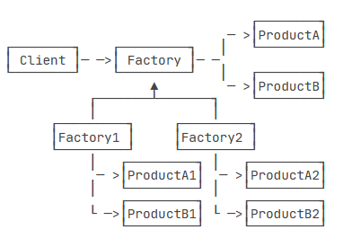
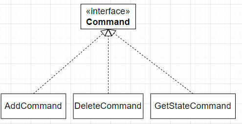

# 需求分析

## 有效沟通

- 明确分割问题与方案
  - 明确问题只需要用户和需求工程师的参与
  - 用户：遇到问题->自己想出一些解决方案，认定这些解决方案的实现需要工程师->向工程师描述自己的需求
  - 接收一个人的意见往往会让他获取被尊重的感觉，因此用户不会区分问题和自己想的解决方案，甚至不会描述自己的问题，而只讲解决方案，甚至希望工程师直接采用这个方案；
  - 需求收集最重要的原则就是区分问题和解决方案，用户所提出的解决方案往往不是解决问题的最优方案，需求收集最忌讳的就是讲解决方案；
  - 引导用户讲清楚问题，挖掘用户最开始遇到的问题是什么，而不是把用户所想的解决方案当作需求；
  - 一个问题的组成：
    - 谁在什么场景下使用这个需求，多久使用一次
    - 不完成这个需求谁会生气，多久生气一次
- 提出解决方案
  - 解决方案是开发人员针对所有问题设计的面向用户的系统，这个系统包括
  - 解决方案面向用户的效果，包括功能设计、UI和demo演示、非功能说明
  - 问题解决的重要性排序，包括实现顺序、时间和金钱成本
# 设计与测试

- 需求驱动前端，前端驱动接口，接口驱动后端；业务流程的数据流程决定前后端接口设计；
## 接口设计与白盒测试
- 接口的参数对象的状态、返回对象的状态/抛出异常的状态决定白盒测试数据集；
- 接口设计应遵从单一原则
  - 一个对象的职责包括：参数、返回正常的业务对象
  - 单一职责：从参数到返回数据的路径是唯一的
    - 负责业务逻辑的对象不应该处理异常
    - 一个对象的职责在语义上应该是单一的
  - 前后端都不应该期望对方能够约束参数的状态；信任意味着依赖；
- 接口是实现面向对象、面向测试、面向切面的基础，但是如果系统的复杂度不高，接口会是过度设计，将带来多余的工作；
  - 通过流程图、类图理清业务流程，使用AOP、OOP完成单一职责的设计


# 设计模式

每一种设计模式都实现了职责分离，因此每种设计模式不再阐述这一特点

设计模式的原则

- 增加代码而不是更改代码

- 调用父类方法成功后再调用子类方法，如果得到相同结果则子类设计良好

- 依赖强弱取决于责任的分离程度

名词

- 用户：类和对象的使用者，主动产生依赖的一方

- 依赖：持有被依赖者的信息

## 创建型模式

核心思想：分离对象的创建和使用

### 工厂方法

目的：对用户隐藏细节
  
  - 用户只需了解产品的功能、产品的使用方法
  
  - 当产品工作良好时，用户不需要知道产品是怎么生产的、工厂在什么时候做了哪些优化

适用标准

 - 抽象产品固定（抽象产品固定时抽象工厂一定可以固定）

完整的工厂方法：
  
  - 用户：持有抽象工厂和抽象产品的信息
  
  - 抽象工厂：负责返回实际工厂，因此抽象工厂一定持有实际工厂的信息
  
  - 实际工厂：负责返回实际产品，实际工厂持有实际产品的信息
  
  - 实际产品：负责满足用户期望、预测并满足用户的隐藏期望

简化的工厂方法：

  - 产品持有工厂方法

Integer类的new方法和valueOf静态方法

```java
/**Integer是产品、抽象工厂、实际工厂
 * valueOf作为返回产品的抽象工厂方法、实际工厂方法
 * 满足用户使用Integer的期望
 * 预测用户高效使用Integer的期望
*/
public final class Integer {
  public static Integer valueOf(int i) {
    if (i >= IntegerCache.low && i <= IntegerCache.high)
      return IntegerCache.cache[i + (-IntegerCache.low)];
    return new Integer(i);
  }
}
```

里氏依赖原则

- 用户只持有抽象产品的信息，而工厂方法可以返回实际产品继承链中的任意一个对象，前提是继承链符合里氏依赖原则
```java

List<String> list = List.of("A", "B", "C");

/**实际上List.of是静态工厂方法，可以根据参数的不同，判断返回ArrayList或其它List的实现*/
```
### 抽象工厂

目的：对用户隐藏细节，解耦工厂、产品

- 用户依然只知道抽象产品和抽象方法
- 实际工厂有n个，实际产品有m种，在确保分离产品的创建与使用的前提下，随时切换到另一个工厂所生产的另一组产品

适用标准：

- 有较多的工厂和产品（工厂方法不足以应对）
- 每个工厂都生产相同种类的产品

完整的抽象工厂方法

- 抽象产品和抽象方法
- 一系列的实际工厂和每个工厂所生产的一系列实际产品
- 


### 生成器
目的：对用户隐藏细节

- 用户只持有产品信息
- 产品过于复杂，需要解耦其生产过程


简化的生成器

- 对用户暴露生产接口，以完成链式调用

```java

StringBuilder builder = new StringBuilder();
builder.append(secure ? "https://" : "http://")
       .append("www.liaoxuefeng.com")
       .append("/")
       .append("?t=0");
String url = builder.toString();

```
### 原型
目的：通过拷贝创建对象

### 单例

目的：保证一个类仅有一个实例，并提供一个访问它的全局访问点

- 约定：不具有状态或线程安全的状态类应主动使用单例模式

使用枚举完成单例模式，避免序列化和反序列化绕过private构造方法从而创建出多个实例
```java
public class Singleton {
  private static final Singleton INSTANCE = new Singleton();

  public static Singleton getInstance() {
    return INSTANCE;
  }

  private Singleton(){}
}


public enum World {
	INSTANCE;

	private String name = "world";

	public String getName() {
		return this.name;
	}

	public void setName(String name) {
		this.name = name;
	}
}
```

- 单例模式下延迟加载且不加锁只能通过ClassLoader机制完成
## 结构型模式

组合优先，不到迫不得已拒绝使用继承

### 适配器Adapter/Wrapper

目的：通过包装复用代码而不是继承

适用标准：已存在的接口和需要的接口不兼容
  
  - 对象A是接口1，持有目标代码/目标数据，通过接口1的方法a调用
  - 对象B需要接口2，通过接口2的方法b调用
  - 适配器是接口2，持有接口1，通过接口1调用方法a实现方法b

如何编写Adapter

- Adapter实现需求接口
- Adapter持有一个已存在的接口引用
- Adapter实现需求接口要求的抽象方法：已存在的接口引用调用已存在的方法

决定Adapter成败的关键

- 面向接口编程：Adapter只依赖于接口，而不是实现
- 如果Adapter不应持有实现引用

```java
/**Task是已存在接口Callable<?>
 * Thread是需求接口Runnable接口
*/
public class Task implements Callable<Long> {
    private long num;
    public Task(long num) {
        this.num = num;
    }
    public Long call() throws Exception {
        long r = 0;
        for (long n = 1; n <= this.num; n++) {
            r = r + n;
        }
        System.out.println("Result: " + r);
        return r;
    }
}


public class RunnableAdapter implements Runnable {
    private Callable<?> callable;

    public RunnableAdapter(Callable<?> callable) {
        this.callable = callable;
    }

    public void run() {
        try {
            callable.call();
        } catch (Exception e) {
            throw new RuntimeException(e);
        }
    }
}

Callable<Long> callable = new Task(123450000L);
Thread thread = new Thread(new RunnableAdapter(callable));
thread.start();

/**Thread接收Runnable接口，但不接收Callable接口
 * Callable<Long> callable = new Task(123450000L);
 * Thread thread = new Thread(callable);
 * thread.start();
*/
```

Java中使用大量适配器

```java
String[] exist = new String[] {"Good", "morning", "Bob", "and", "Alice"};
Set<String> set = new HashSet<>(Arrays.asList(exist));

InputStream input = Files.newInputStream(Paths.get("/path/to/file"));
Reader reader = new InputStreamReader(input, "UTF-8");
readText(reader);
```
### 桥接
目的：分离抽象与实现，使抽象和实现可以独立变化

- 使用继承实现用户购车，需要120个类

| 类层次       | 类描述   | 当前类的数量/种            |
|------------|------------|---------------------|
| Car接口    | 用户需要一辆汽车          | 1                 |
| 品种类      | 用户需要选择一个牌子的汽车          | 1 × 8             |
| 车型类      | 用户需要决定该牌子汽车的动力系统          | 1 × 8 × 3         |
| 颜色类      | 用户需要决定该牌子汽车的某种动力系统的颜色          | 1 × 8 × 3 × 5     |

- 使用桥接实现用户购车，避免继承导致的子类爆炸
  - 抽象部分最少有4个类，实现部分最少有16种

抽象部分

```java

public abstract class Car{
  protected Engine engine;
  protected Color color;
  protected Brand brand;

  public Car(Engine engine, Color color, Brand brand){
    this.engine=engine;
    this.color=color;
    this.brand=brand;
  }
  public abstract void drive(){
    System.out.println("driving");
  }
}

public interface Engine {
    void start();
}

public interface Color {
    void paint();
}

public interface Brand {
    void wrapper();
}

/**如果需要额外的共同的逻辑，可以增加抽象链长度和分支*/
public abstract class RefinedCar extends Car {...}
```

实现部分

- 提供Engine、Color、Brand的不同实现
- 将组装的任务交给用户决定
## 组合

目的：将对象组合成树形结构以表示“部分-整体”的层次结构，使得用户对单个对象和组合对象的使用具有一致性。

- 定义接口0作为树节点的类型，定义类A、B、C...实现接口0
- 每个类持有其它节点的信息，同时也是一个节点
- ps：在Java标准库中，有很多类不仅持有接口A引用，同时也是接口A
- 
### 装饰器

目的：分离核心功能和附加功能，运行时为核心功能添加附加功能

装饰器与桥接

- 目的相同：避免类爆炸，同时由用户决定一个产品的构成

- 装饰器：核心功能能够独立工作，是一个完整的产品，附加功能必须依附于核心功能

- 桥接：只有组件和完整产品两种角色，必须通过组装组件来得到完整产品

```java

// 创建原始的数据源:
InputStream fis = new FileInputStream("test.gz");
// 增加缓冲功能:
InputStream bis = new BufferedInputStream(fis);
// 增加解压缩功能:
InputStream gis = new GZIPInputStream(bis);


InputStream input = new GZIPInputStream(
                      new BufferedInputStream(
                          new FileInputStream("test.gz")
                        ));
```


### 外观

目的：当用户想要达成某一目的所需要交涉的子系统过多时，提供一个中介系统，由中介系统与子系统交涉，用户只与中介系统交涉

### 享元

目的：运用共享技术有效地支持大量细粒度的对象。

- 反复包装同一个值的对象是愚蠢的，例如Byte只有256种状态，因此Byte.valueOf()创建的Byte实例，全部都是缓存对象

适用标准：频繁访问、少量修改、状态可控的对象集

- Redis、Cache...

### 代理

目的：用户以为自己访问的是被代理对象，实际访问的是代理对象；

- 对象一旦被代理，就不应绕过代理对象访问被代理对象，否则就是设计的逻辑错误
  - AOP是对OOP的补充，抽离逻辑仅仅是作为一个切面完成分离职责和测试边界的任务
  - 代码的分离不代表职责的分离，代理对象中的逻辑实际上是被代理对象的一部分，从复用的角度完成OOP做不到的事情

Java代理

- Jdk动态代理
  - 装饰器：Adapter将接口1包装为接口2
    - 装饰器只有一个作用：装饰，它只负责在接口2的方法中调用接口1的方法
  - Jdk动态代理的完成逻辑：
    - Proxy是接口0，因此Proxy持有和被代理对象完全相同的方法集合
    - Proxy持有接口0引用，可指向被代理对象
    - Proxy执行某个方法时不仅会通过接口0引用调用同名方法，还会在执行该方法的前后执行其它逻辑；
  - Jdk动态代理的实现细节：
    - Proxy是运行时通过反射生成的
    - 观察上述所说的完成逻辑，只需要在编译时说明执行方法前后的其它逻辑以及被代理对象，就可以在运行时创建代理对象
- CGLIB动态代理
  - 不要求被代理对象和代理对象具有相同的接口
  - CGLIB动态代理的完成逻辑
    - 代理对象继承被代理对象的类，并在字节码层面重写其方法
  - CGLIB动态代理的实现细节
    - java只支持公有继承，因此final和private方法无法被代理
    - 在被代理对象中直接访问域是危险的，因为运行时访问的域不是被代理对象的域，而是代理对象的域；

## 行为型模式


### 责任链
目的：用户要求请求得到处理，而无需知道是谁在处理


完整的责任链模式

- 抽象处理器：其实现组成责任链
- 抽象请求：责任链所传递的、请求继承链上的对象组成的集合

责任链设计

- 责任链由相同种类的处理器组成，则处理器在责任链中的顺序很重要
- 责任链由不同种类的处理器组成，则必须在某个地方维护处理器的顺序信息，以便处理器主动调用其它处理器；

财务审批责任链：相同处理器构成的责任链

- 员工报销费用时只需持有责任链的信息，而无需持有任何一个处理器的信息
  - Manager：只能审核1000元以下的报销；
  - Director：只能审核10000元以下的报销；
  - CEO：可以审核任意额度
```java

//请求对象
public class Request {
    private String name;
    private BigDecimal amount;

    public Request(String name, BigDecimal amount) {
        this.name = name;
        this.amount = amount;
    }

    public String getName() {
        return name;
    }

    public BigDecimal getAmount() {
        return amount;
    }
}

//处理器抽象
public interface Handler {
  /**@return true成功/false拒绝/null交给下一个处理*/
	Boolean process(Request request);
}

//三个处理器

public class ManagerHandler implements Handler{
  public Boolean process(Request request) {
    if (request.getAmount().compareTo(BigDecimal.valueOf(1000)) > 0)
        return null;
    // 该管理员对Bob有偏见:
    return !request.getName().equalsIgnoreCase("bob");
  }
}

public class DirectorHandler implements Handler{...}
public class CeoHandler implements Handler{...}

//责任链
public class HandlerChain {
  // 持有所有Handler:
  private List<Handler> handlers = new ArrayList<>();

  public void addHandler(Handler handler) {
      this.handlers.add(handler);
  }

  public boolean process(Request request) {
    for (Handler handler : handlers) {
      Boolean r = handler.process(request);
      if (r != null) {
        // 如果返回TRUE或FALSE，处理结束:
        System.out.println(request + " " + (r ? "Approved by " : "Denied by ") + handler.getClass().getSimpleName());
        return r;
      }
    }
    throw new RuntimeException("Could not handle request: " + request);
  }
}
```

Servlet规范定义的过滤器：不同处理器构成的责任链

```java

public class AuditFilter implements Filter {
  public void doFilter(ServletRequest req, ServletResponse resp, FilterChain chain) throws IOException, ServletException {
    log(req);
    if (check(req)) {
      chain.doFilter(req, resp);
    } else {
      sendError(resp);
    }
  }
}

```
### 命令
目的：用户只关心发出命令，而不关心命令如何执行

- 分离命令的创建和执行，封装具体的操作实现
- 通过对象调用方法：实际上创建了命令并执行它
- 将调用封装为命令，在分离创建与执行的基础上，增强创建

```java
public class TextEditor {
  private StringBuilder buffer = new StringBuilder();

  public void add(String s) {...}

  public void delete() {...}

  public String getState() {...}
}

```


- 中间类持有List记录历史命令
- 由中间类将命令映射到Command实现，映射关系可实现以下功能：请求排队、请求日志、请求Undo/Redo

### 解释器

目的：通过正则表达式将语言映射到可执行代码

### 迭代器
目的：当用户知道对象是集合时，就相信该对象持有$n$个迭代器

- 集合应持有的迭代器种类：顺序种类 $\times$ 线程是否安全

### 中介
目的：中介持有所有对象的信息，但是一个对象最多持有中介信息


### 备忘录
目的：在不破坏封装性的前提下，捕获一个对象的内部状态，并在该对象之外保存这个状态。

- Java Bean遵从备忘录模式，封装所有域并设置更改器、访问器方法

### 观察者
目的：

- 观察者告诉被观察者：如果你状态更改，请通知我（注册行为）
- 被观察者状态更改时，通知所有已注册的观察者

观察者模式实现的细节

- 当状态更迭时，通知观察者的动作应是异步的，避免调用观察者注册的方法时阻塞被观察者线程
通过中介实现

- 由中介持有所有观察者的信息，以及每个观察者希望中介做出的动作

通过接口实现：

- 被观察者不关心观察者是谁，只要观察者实现Observe接口，并实现其抽象方法供被观察者调用
- 观察者不需要时刻观察目标，只需要等待回调函数

通过Event实现

- 广义的观察者模式包括所有的消息系统，由消息系统负责将所有生产者的消息转交给消费者，经典的消息系统可参考ROS框架

### 状态
目的：将对象的状态封装到不同的状态类中，通过有限状态机描述对象的状态转换

### 策略
目的：将算法分割为易变部分和固定部分，将易变部分封装为策略（对算法而言，策略是算法的上下文）

```java
/**考虑Java的排序算法
 * 易变部分为比较规则，不变部分为快排算法过程
 * 将比较规则封装为策略
*/
Arrays.sort(T[] a, Comparator<? super T> c)
```

考虑购物车结算算法
- 算法的固定部分：计算总价、返回实际应付金额
- 算法的易变部分：将总价映射到应付金额
- 固定部分封装为Pay，Pay持有一个折扣策略，要求用户在实例化Pay时传入一个折扣策略

```java
/**封装策略*/
public interface DiscountStrategy {
  BigDecimal getDiscount(BigDecimal total);
}

//实现一
public class Pay{
  private BigDecimal getTotal(){...};
  public BigDecimal getPayAmount(DiscountStrategy discountStrategy){
    return discountStrategy.getDiscount(getTotal())
  }
}
//实现二

public class Pay{
  private DiscountStrategy discountStrategy;
  public void setStrategy(DiscountStrategy strategy) {...};
  public DiscountStrategy getStrategy() {...};
}
```
### 模板方法
目的：定义一个操作中的算法的骨架，而将一些步骤延迟到子类中，使得子类可以不改变一个算法的结构即可重定义该算法的某些特定步骤。

- 父类定义骨架，子类实现某些细节
- 父类使用final修饰方法，防止子类覆写骨架
- 需要子类覆写的抽象方法声明为protected

java的clone方法
### 访问者
目的：对已存在的集合，使用访问者在不更改对象本身的条件下，增加对对象的新操作


简化的访问者模式

- 即先拿到对象，再访问对象；可变的是访问对象，不变的是拿到对象；分割对象、拿到对象、访问对象；实现在不更改对象本身的条件下增加操作
- 简化的访问者模式的角色
  - 访问者抽象及其不同实现，代表对每个元素的不同操作
  - 持有访问者的实现，获取对象并以回调方式调用访问者

```java
public interface Visitor {
  // 访问文件夹:
  void visitDir(File dir);
  // 访问文件:
  void visitFile(File file);
}

public class FileStructure {
  // 持有数据:
  private File path;
  public FileStructure(File path) {
      this.path = path;
  }
  //持有访问者
  public void handle(Visitor visitor) {
		scan(this.path, visitor);
	}

	private void scan(File file, Visitor visitor) {
		if (file.isDirectory()) {
			visitor.visitDir(file);
			for (File sub : file.listFiles()) {
				scan(sub, visitor);
			}
		} else if (file.isFile()) {
			visitor.visitFile(file);
		}
	}
}

```