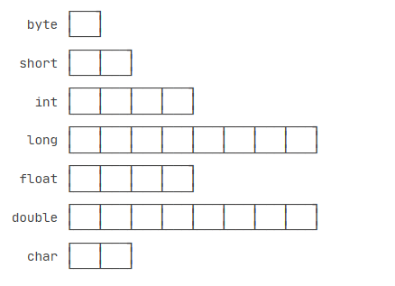
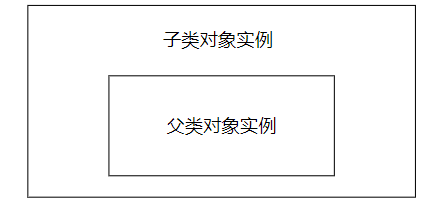
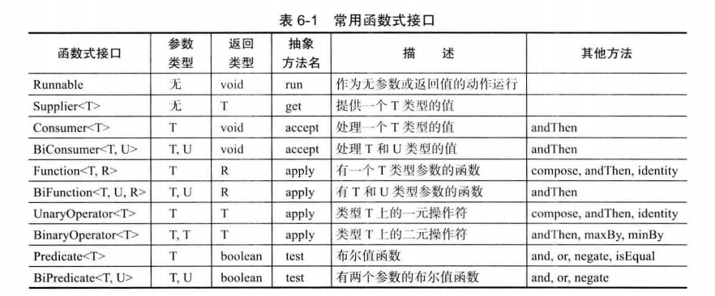
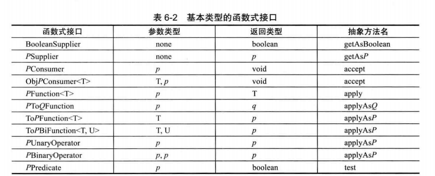
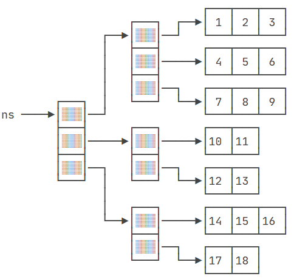
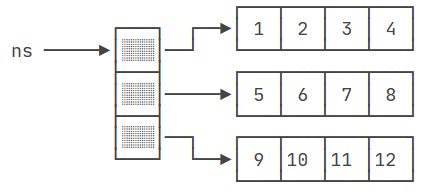

Inversion of Control：your code calls a library but a framework calls your code

# 数据类型
变量的类型 = 基本数据类型 + 引用类型
- 引用类型仅可指向对象实例、数组实例的位置，若引用指向的位置没有实例，则该引用的值为`null`
- 引用的值只能通过赋值更改，更改引用的值将使引用指向不同的对象实例、数组，规定引用不能用于计算

声明与初始化
  - 声明变量的类型，将指定数量的内存单元标识为变量名
  - 初始化：在变量名标识的内存空间中存储二进制数
  - 基本数据类型变量所存储的值完全由开发者决定
  - 引用类型变量所存储的值，由垃圾回收器管理，开发者仅需也仅可管理引用与实例之间的指向关系

若对象声明时未显式初始化，JVM将为该对象的域赋予初始值
- number->0、boolean->false、reference->null
- 若局部变量必须在声明时显式初始化

final
- 被final修饰的变量一经初始化就不可更改值
- 被final修饰的reference：代表引用关系固定，该引用应指向不可变对象实例，若指向可变对象则引用变量没有必要被final修饰
- 被final修饰的基本数据类型变量的名字全大写

boolean：不能与其它类型发生类型转换；其值域为true、false，不能写入其它类型的值

数字变量的值只能使用二进制存储
- 整型和浮点型的二进制序列表示方法不同
- 整型采用二进制补码
- 浮点数遵循<A HREF="https://zh.wikipedia.org/zh-hans/IEEE_754">IEEE-754规范</A>
- java不支持无符号数

数字变量的值可翻译为二进制0b、八进制0、十六进制0x、十进制供人阅读
- java：数据的存储和显示分离

数字基本数据类型
  - 
    - 一个小方块代表一个内存单元
    - 一个内存单元代表`1byte=8bit`，使用两个十六进制数表示
  - 约定开发者应总是使用int/double，仅在整型变量的值可能截断时替换为long
    - 200->int，200L/l->long
    - 1.1F/f->单精度浮点数，1.1、1.1D/d->双精度浮点数
  - 类型转换
    - 不允许将使用内存单元更多的字面量或变量，赋值给使用内存单元更少的变量，可以通过强制类型转换打破该规定
    - 
    - 实线：允许隐式类型转换，无溢出风险
    - 虚线：只允许强制类型转换，有溢出/指数截断、尾数截断风险
      - int转float，float指数可偏移127位不存在指数截断的风险，但是尾数只有23位，而int最大数0x7FFF_FFFF，会发生尾数截断造成精度丢失
    - 浮点数转整型时，转科学计数法后直接抛弃小数部分，表现为向下取整；
      - ps：Math.round()工具类提供四舍五入

| 语句                               | 是否合法 | 是否类型转换 | 解释                                                                         |
| ---------------------------------- | -------- | ------------ | ------------------------------------------------------------------------------ |
| `long n = 0xF_FFFF_FFFF`            | 不合法   |            | 数字字面量超过int类型范围，编译器将报错                          |
| `long n = 0xF_FFFF_FFFFL`           | 合法     | 否           | 开发者初始化long变量时，应总是为字面量添加后缀`L/l`                                  |
| `short n = 0xFFFF_FFFF`             | 合法     | 是           | 发生溢出并被计算机截断，变量值为-1                                    |
|float f=3.14|非法||
int = (int)0xFl|合法|是

  
IEEE-754
  - 浮点数二进制序列构成：符号位、指数、尾数
    - 双精度浮点数：符号位1位、指数8位、尾数23位
    - 单精度浮点数：符号位1位、指数11位、尾数52位
  - 浮点数二进制序列转浮点数科学计数法：
    - 假定采用小端法，尾数域的最左边权为$2^{-1}$，转为小数后记为$a$
    - 指数视为无符号二进制转整数记为$b$
    - $1+a$作为有效数字部分
    - 浮点数的科学计数法表示为$(1+a)E(b-127)$或$(1+a)E(b-1023)$
  - IEEE-754规范定义了特殊的变量值的二进制序列，及其翻译出来的记号

| 二进制序列                                   | 记号         | 中文意义        |
| -------------------------------------------- | ------------ | --------------- |
| `01111111100000000000000000000000`           | +∞           | 正无穷大         |
| `11111111100000000000000000000000`           | -∞           | 负无穷大         |
| `00000000000000000000000000000000`  | +0           | 正零             |
| `10000000000000000000000000000000`  | -0           | 负零             |
| `0111111111xxxxxxxxxxxxxxxxxxxxxx`           | NaN          | 非数值（Not a Number） |


运算
  - 关系运算：==、！=、>=等运算符返回boolean类型的字面量
  - 逻辑运算：&&、||采用短路方式从左往右运算
    - `x != 0 && 1/x > x+y`避免产生0除异常
    - && 的优先级高于 ||
  - 三元操作符`?:`
  - 位运算：以二进制位而不是内存单元作为原子单位进行运算
    - `&、|、^、~`
    - 位运算不采用短路
    - \>\>使用符号位填充高位，>>>使用0填充高位，<<使用0填充低位；

char由两个字节存储，使用单引号标注char字面量
- 编码方式决定存储文本文件的二进制序列
- Unicode编码指UTF-16定长编码，英文字符的高字节总是00浪费空间，因此Java使用UTF-8变长编码
- UTF-8共17个语言级别，将char分割为两个码点，通过判断码点的值范围，判断这个码点所属的编码属于哪个语言级别，然后读取1-4个字节转义为文本字符
- UTF-8编码的容错能力强；传输时某些字符出错，不会影响后续字符
- java将UTF-8编码的字符串转换为使用其它编码方式编码的二进制序列方法如下：

```JAVA
/**转换为系统默认编码后的二进制序列*/
byte[] b1 = "Hello".getBytes(); 

/**转换为UTF-8编码后的二进制序列*/
byte[] b2 = "Hello".getBytes("UTF-8"); 

/**转换为GBK编码后的二进制序列*/
byte[] b2 = "Hello".getBytes("GBK");

/**转换为UTF-8编码后的二进制序列*/
byte[] b3 = "Hello".getBytes(StandardCharsets.UTF_8); 

```
- 按指定编码方法，将二进制序列转为UTF-8编码的String
```JAVA

byte[] b = ...
String s1 = new String(b, "GBK");
String s2 = new String(b, StandardCharsets.UTF_8);

```

# 面向对象编程

## Class

名称约定：除类名开头大写，其它命名一律开头小写；

访问控制符可修饰Field、Method、Constructor
- public：所有人可见
- protected：同一个包或子类可见
- 无访问控制符：同一个包可见
- private：类内可见

构造器Constructor
  - 当且仅当没有提供构造器时，编译器才会提供默认的无参构造器
  - 提供自定义构造器后，想调用无参构造器就必须由开发者自行声明
- 与访问控制符、static、final相关的约定：
  - 总是使用private修饰Field
    - 域的名字为$A$时，其更改器访问器方法名为`setA、getA`
  - 不被static修饰的Field标识对象状态，被static修饰的Field标识类状态
  - 当对象状态、类状态一经初始化就不再更改时，应使用final修饰
  - Method不直接或间接依赖对象状态时，应使用static修饰
  - 使用final修饰Method，表示该方法不能被子类重写
- 方法、构造器的参数
  - 参数传递总是进行值的复制
  - 方法、构造器的参数不为空时，代表该方法、构造器对外界具有依赖关系
  - 对非static的方法：传递隐式参数this和显式参数，隐式参数使用this表示，代表调用该方法的对象
  - 对static方法：只有显式参数
  - 对构造器
    - this(parameters)将调用本类的符合参数列表要求的其它构造器，与非static的隐式参数具有不同性质
    - super(parameters)将调用父类的符合参数列表要求的构造器
  - 可变参数列表
    - (int...args)
    - 在方法或构造器内部将args视为数组类型的引用变量进行调用
    - 若没有可变参数列表，就需要定义大量的重载方法，出现大量重复代码
- 局部变量
  - 局部变量的生效范围是整个代码块
  - 对该代码块中的子代码块，不允许定义同名局部变量
  - 局部变量更改值对局部变量代码块之外不可见
  - 局部引用变量更改对象状态后，局部变量代码块之外可见该对象状态的改变
- 方法重载
  - 方法使用方法签名=方法名+参数列表进行标识
    - 方法签名相同时，即使返回值类型不同，编译器也会报错
  - 约定：方法名相同的方法具有单一功能，处理不同的
- 初始化块
  - 对初始化块的数量和位置没有要求
  - 非static初始化块在对象实例化期间进行，每个对象实例化时都会执行一次初始化块
  - static初始化块只会执行一次，在类初次被加载时执行
- 执行顺序
  - 域声明语句，若域声明语句未初始化，则由JVM赋予默认值
  - 按从上到下的顺序依次执行初始化块
  - 按递归的形式执行构造器方法链
  - 约定：
    - 构造器的参数列表不应该依赖于初始化块的执行结果
    - 总是将域的初始化放置在构造器中，确保对象状态的一致性
- 访问器、更改器
  - 约定：即使是在类内部，也不应直接访问域，而是应该通过更改器、访问器方法间接访问，<A HREF="#动态代理">原因</A>
  - 域是布尔类型时，更改器和访问器不应该是get/set，应是is/set
  - 只有getter的域是只读域，只有setter的域是只写域

### Extends

- 规范
  - 引用类型是对象类型的父类或接口类型
- 引用、对象实例相关的约定
  - 判断是否为null$\ne$域是否为空
  - 通过引用调用方法前，必须判断引用是否为null
  - 通过引用访问域前，先判断引用是否为null，再判断对象实例的域是否为空
    - 例：String s，`if(s != null && !s.isEmpty())`
  - 设计时应明确分割类职责和对象职责
    - 类职责、对象职责决定类状态、对象状态
    - 类状态由更改器、static初始化块进行控制
    - 对象状态由更改器、构造器、工厂方法、非static初始化块进行控制
- 继承
  - 
  - 引用指向子类对象，可调用子类对象及父类对象的public方法
    - 子类构造器的第一行必须调用父类构造器，子类构造器不能负责控制父类对象状态
    - 如果第一行不是super(parameters)，那么JVM插入代码调用无参构造器，如果父类没有无参构造器将报错；
    - 子类对象内部不仅可通过super.方法名调用父类的public方法，还可以调用父类的protected方法
  - 约定
    - 调用父类方法时只依赖于父类对象的状态
    - 调用子类方法时只依赖于子类对象的状态
  - java只支持公有继承，公有继承与组合的区别：
    - 公有继承时，引用所指的对象中最多只有一个对象，并且该引用既能调用子类对象也能调用父类对象
    - 组合时，引用所指的对象中可有多个对象，每个对象有明确的引用
    - 因此java不支持多重继承，继承链只多只有一条
- 抽象类使用abstract进行标识，表示该类不能实例化
  - 允许抽象类具有域、使用abstract修饰的方法、不被abstract修饰的方法
  - 如果一个类具有被abstract修饰的方法，则必须声明为abstract类
  - 当一个类实现接口或继承抽象类但是不能实现其方法时，必须使用abstract进行修饰
  - 抽象类可以不具有抽象方法
- 重写 & 重载
  - 约定：方法签名不变，职责就不应更改
    - 方法职责 = 参数状态到方法行为的映射集合
    - 方法职责不变 = 映射集合遵守父类定义的契约或映射集合是父类的真子集
    - 方法行为 = 异常、返回的变量、通过引用更改外界定义的对象
  - 重写不应违背里氏替换原则
    - 父类要求子类重构：父类定义契约，子类遵守契约
      - 重写equals()需要遵守五个原则（自反性、对称性、传递性、一致性、null参数总是映射到false）
    - 接口、抽象类要求子类实现抽象方法：子类应遵守接口、抽象类定义的契约
    - 子类因父类算法陈旧等原因重构父类方法：子类不能更改方法职责（参数状态到方法行为的映射关系）；
    - 重写后，指向子类对象的引用不能调用父类方法
    - 重写使用`@Override`注解进行标注
    - 父类不希望子类重写方法时，使用final修饰方法（该方法必须是public否则使用final修饰没有意义），仍可被继承
    - 使用final修饰类，表示不能被继承
  - 重载不应违背里氏替换原则
    - 在子类定义的方法与父类方法同名，但是参数列表不同时，发生重载
    - 子类方法与父类方法处理的参数列表交集为空时，不违背里氏替换原则
    - 子类方法与父类方法处理的参数列表交集不为空时，子类方法的参数列表状态必须是父类参数列表状态的超集
      - 表现为：父类方法能处理的参数状态总是调用父类方法，父类方法无法处理的参数状态才调用子类的重载后的方法
  - 重写、重载后的方法的行为需遵守以下规则
    - 返回值类型是父类方法返回值类型的子类
    - 抛出的异常是父类方法抛出异常的子类，如果父类方法没有抛出异常，则子类不能抛出异常
    - 子类的可见性不能比父类低
  - 遵守上述设计符合里氏替换原则：父类对象能正确工作的地方，替换为子类对象后不会有任何改变
- 继承访问器、更改器方法（不限于setter，包括所有更改域的方法）
  - 当继承访问器、更改器方法时，对外界观察者而言，子类继承了父类的私有域，此时开发者就应当检查访问器、更改器方法是否在子类状态上运算封闭
  - 例如Holiday继承Day的set和get方法时，就必须重写set和get方法，确保指向Holiday的引用不会得到、操控非节假日的日期；
- 优雅地使用多态，而不是愚蠢地使用if

### Object

源码：
  - `getClass()`：不可重写
  - `toString()`所有子类都应重写
  - `hashCode()、equals(Object obj)`：要么都重写要么都不重写
  - `clone()`：要调用就必须先重写

```java
package java.lang;

/** Object类是类层次结构的根，是所有对象的超类：包括数组、异常*/
public class Object {
    public Object() {}

    /**返回运行时静态擦除后的Class对象*/
    public final native Class<?> getClass();

    /**重写hashCode方法必须遵守以下契约：
     *  职责：
     *      返回值作为哈希值供哈希表使用
     *      遵守契约减少冲突概率，提高哈希表性能
     *  一致性：
     *      应用上下文不变（同一个应用程序）且对象状态不变时，多次调用hashCode方法返回相同的哈希值
     *    哈希值不能在对象序列化和反序列化时标识对象
     *  自反、等价：
     *      对象A调用equals方法传入对象B返回true时，A.hashCode()==B.hashCode()返回true
     *      对象A调用equals方法传入对象B返回false时，A.hashCode()==B.hashCode()返回false
     * Object实现了此方法，只要对象不同，返回的哈希值就不同
     * 重写equals方法需要同步重写hashCode方法，该契约规定：相等的对象必须具有相等的哈希码*/
    public native int hashCode();

    /**重写equals()应遵守以下契约
     *  职责：
     *     检查某个对象是否与此对象相等
     *  自反性：
     *    对任何非空引用x，x.equals(x)返回true
     *  对称性：
     *     对任何非空引用x、y，若x.equals(y)返回true，则y.equals(x)返回true
     *  传递性：
     *      对任何非空引用x、y、z，若x.equals(y)返回true且y.equals(z)返回true，则x.equals(z)返回true
     *  一致性：
     *      对任何非空引用x、y，若对象状态未更改，则多次调用x.equals(y)一致地返回true或一致地返回false
     *  null不等价于任何对象
     *    对于任何非空引用值x，x.equals(null)应返回false
     * 遵循以上契约的equals将所有对象划分为等价类或非等价类，等价类的所有成员相互相等
     * Object实现了equals方法，当且仅当引用值相等时，equals返回true，即每个等价类有且只有一个元素，即该对象本身
     * 重写equals方法需要同步重写hashCode方法，该契约规定：相等的对象必须具有相等的哈希码
    */
    public boolean equals(Object obj) {
        return (this == obj);
    }

    /**Object实现clone()方法：构造一个新的对象，该对象状态等于源对象状态，Object实现的clone()方法满足以下约定
     *    x.clone()!=x返回true
     *    x.clone().getClass() == x.getClass()返回true
     *    x.clone().equals(x)返回true
     *    x.hashCode()==x.clone().hashCode()返回true
     * 子类如何调用clone()方法
     *    将clone()方法的可见性从protected升级到public
     *    实现Cloneable标记接口
     *    更改方法体内容，更改返回值的类型为更严格的子类型
     *    因为子类一定会重写clone方法，浅拷贝和深拷贝的区别只有方法体的实现
     *    如果方法体只有一条语句：super.clone()，则代表采用浅拷贝
     *    如果方法体对每个指向可变对象的引用调用clone()方法，则代表采用深拷贝
     * 浅拷贝与深拷贝
     *    若对象状态仅由基本数据类型和指向不可变对象的引用组成，则适合使用浅拷贝；只要对象状态具有指向可变对象的引用，则必须采用深拷贝
     *    因为需要对每个指向可变对象的引用调用clone()方法，因此需要保证这些可变对象的类重写clone()方法并实现Cloneable接口，通过这种方法，替换引用所指的对象和引用的值；
     * 约定
     *    只要遵守上述步骤实现浅拷贝或深拷贝，就能满足Object定义Clone方法的契约，尽管这不是必须遵守的
     *    数组对象实现Cloneable接口，只要可变的数组元素引用实现Cloneable接口就能正常调用Cloneable接口
    */
    protected native Object clone() throws CloneNotSupportedException;

    /**Object实现的toString方法
     *    类名@无符号十六进制哈希值
     * 默认的toString方法依赖于哈希值，间接依赖于对象状态、JVM实现、应用程序上下文
     *    不能在不同时间、不同JVM之间稳定
     * 所有子类都应该覆盖此方法
    */
    public String toString() {
        return getClass().getName() + "@" + Integer.toHexString(hashCode());
    }
}


```

==与equals
  - ==的含义：是否引用同一个对象实例
  - equals的含义：两个对象实例是否属于同一个等价类
- 调用equals()、hashCode()前应判断是否为null，一共四种状态共需判断三次，因此采用方法二使用静态方法对方法一进行封装
  - java.util.Objects.equals(s1,s2)
  - 基本数据类型转换为封装类：统一使用静态方法Double.hashCode()
  - Objects.hashCode()
    - 对象为null时返回0
  - Arrays.hashCode()
    - 将使用所有数组元素返回的hashCode进行运算
  - Objects.hash(变量)
    - 对所有变量（引用变量和基本数据类型）调用hashCode进行加权运算
```java

/*方法一：不推荐使用*/
if (s1 == null && s2 == null)
    return true;
else if (s1 == null || s2 == null)
    return false;
else
    return s1.equals (s2)

/*方法二*/
java.util.Objects.equals(s1,s2)

```

重写toString()
  - 测试（Assert&debug）、日志、打印对象、打印Collection
  - 约定：
    - 对象总是应该重写toString方法，如果不重写，就不该通过实例化对象调用toString方法
    - 重写toString方法时，打印对象状态，每个域使用,进行分割
    - 子类重写toString方法时通过super.toString进行调用
  - 自定义实现
    - 使用StringBuilder(初始容量)进行固定格式的拼接（使用String的拼接性能差）
    - 例如：`id=1,name=小王,sex=女`
  - 数组对象没有重写toString方法，因此不该通过数组引用调用toString
    - 使用静态方法Arrays.toString()返回String

重写equals()、hashCode()
  - 约定
    - 要么同时重写equals和hashCode方法，要么都不重写
    - 重写时，只要对象状态相同，equals就应该返回true，其hashCode也是相同的
    - 重写时，如果语义相等是对象状态的子集，那么equals和hashCode使用的子集应是相等的；
    - 重写时，不能直接使用引用的值判断，而应使用静态方法`java.util.Objects.equals`，因为要求参与比较的对象也重写了equals方法
  - 重写的细节
    - equals内部需要判断是否指向同一个对象
    - 然后判断该对象是否为null
    - 然后判断两个对象的类型关系，这里涉及两个对象在同一条继承链上的问题，如果用于判断是否相等的域子类和父类都有，那么只需要判断能否转型为某个父类（instanceof），如果用于判断是否相等的域只有本类拥有，就需要判断能否转型为该子类（getClass然后判断两个Class对象是否相等）
    - 然后依次判断基本数据类型，对引用字段调用`java.util.Objects.equals`
  - 集合判断key是否相同时，使用hashCode而不是equals
  - 重写hashCode时需要选择每个域所使用的倍数，通常选择17等质数；

重写clone()
  - implement Cloneable接口
  - 重写clone方法，第一句总是调用thisClass a = (thisClass)super.clone()方法，并转型
  - 然后对a域中的引用类型依次调用clone方法，返回值通过更改器方法重新赋予给该字段
    - 注意按照约定，即使是内类部也应该通过更改器对域进行访问，避免动态代理报错；
  - 将访问控制提升到public（非必要）
  - 将返回类型从Object提升到thisClass


### Inner Class

内部类是编译器级别的处理，虚拟机只知道内部类对象通过隐式引用访问外部类对象；

### null

任何类型都可以赋值null，因此null可以视为任何引用类型的有效值

两个不同类型在判等时，如果两个对象都为null，那么将返回true
- 在覆写equals时，一律使用Objects.equals，避免自己进行null判断

### wrapper

包装类包括：`Integer、Long、Float、Double、Short、Byte、Character`

当包装类不是null时，通过自动拆箱和自动装箱实现基本数据类型与包装类的等价
- 对null进行自动拆箱将抛出异常
- 因为包装类的域被final修饰，所以混用基本数据类型与包装类时将返回基本数据类型
- 总是使用静态工厂方法valueOf进行装箱，因为包装类是不变类，同String，不同的引用可以指向相同的实例，如果使用new，底层系统就失去了优化的机会

parse开头代表将字符串转为指定类型的静态API
- `Integer.parseInt("100", 16)`按十六进制将指定字符串转义为整数

整型转字符串
- `toString(100)`：转十进制
- Integer.toString(100, 36)：转36进制
- Integer.toHexString(100)： 转16进制
- Integer.toOctalString(100)： 转8进制
- Integer.toBinaryString(100)： 转2进制

所有包装类继承自Number，将一个数装箱后，获取该数的不同表示
- `Number num = new Integer(999);`
- `byte b = num.byteValue();`
- `int n = num.intValue();`
- `long ln = num.longValue();`
- `float f = num.floatValue();`
- `double d = num.doubleValue();`

使用静态工具类将有符号数转无符号数
- `Byte.toUnsignedInt(x)`
- 若x是-1，则结果为255
### Enum

枚举类通过enum进行声明
  - 枚举类通过构造函数构造常量，每个常量是枚举类的一个对象实例

下面两种class实际上等价，但是枚举类遵守语义更易理解
```java
public enum ErrorResponse{
    ITEM_NOT_FOUND(1001, "项目不存在");
    ErrorResponse (int code, String msg){
        this.code=code;
        this.msg=msg;
    }
    private final int code;
    private final String msg;
}

public class ErrorResponse{
    public final static ErrorResponse ITEM_NOT_FOUND = newErrorResponse(1001, "项目不存在");
    
    ErrorResponse (int code, String msg){
        this.code=code;
        this.msg=msg;
    }
    
    private final int code;
    private final String msg;
}
```

所有枚举类继承自Enum接抽象类
```JAVA
public abstract class Enum<E extends Enum<E>>
        implements Constable, Comparable<E>, Serializable {
    /**枚举实例的名字，通过toString进行访问*/
    private final String name;

    /**返回枚举实例的名字*/
    public final String name() {
        return name;
    }

    /**该字段表示枚举实例构造的顺序，表现为在枚举类中从上到下的声明顺序；非必要不使用该字段*/
    private final int ordinal;

    /**返回枚举实例声明的顺序*/
    public final int ordinal() {
        return ordinal;
    }

    /**返回枚举实例的名字，但是可以由开发者重写*/
    public String toString() {
        return name;
    }

    /**因为枚举实例是单例模式，因此使用==和equals效果一样，但是语义不同*/
    public final boolean equals(Object other) {
        return this==other;
    }

    /**不允许克隆，如果在子类内部调用该方法总是抛出异常，标记为final不允许继承*/
    protected final Object clone() throws CloneNotSupportedException {
        throw new CloneNotSupportedException();
    }

    /**首先判断二者的类型能否比较，再判断二者声明顺序的大小*/
    public final int compareTo(E o) {
        Enum<?> other = (Enum<?>)o;
        Enum<E> self = this;
        if (self.getClass() != other.getClass() && // optimization
            self.getDeclaringClass() != other.getDeclaringClass())
            throw new ClassCastException();
        return self.ordinal - other.ordinal;
    }
```

### String

常用核心方法
```java

int length();

boolean equals(Object obj)

/**判断忽略大小写后的字符串是否相等*/
boolean equalsIgnoreCase(String anotherString)

/**字符串长度不为0返回true*/
boolean isEmpty();

/**字符串包含非空白字符返回true*/
boolean isBlank();
```

拆分||拼接

```java
/**根据给定的正则表达式拆分字符串*/
String[] split(String regex);

String concat(String s)

/**静态方法*/
String.join(String...strs)
```


子串||索引

```java
/**返回指定位置的字符*/
char charAt(int index);

/**返回指定子字符串在此字符串中第一次出现的索引*/
int indexOf(String str);

/**返回指定子字符串在此字符串中最右边出现的索引*/
int lastIndexOf(String str);

/**返回从指定索引开始到末尾的子字符串
 * 包含起始索引上的字符
 * */
String substring(int beginIndex);

/**返回指定范围内的子字符串
 * 包含起始索引上的字符
 * 不包含结束索引上的字符
 * */
String substring(int beginIndex, int endIndex);

/**判断是否以指定字符串为前缀*/
boolean startsWith(String prefix);

/**判断是否以指定字符串为后缀*/
boolean endsWith(String suffix);

/**判断字符串是否包含指定的字符序列*/
boolean contains(CharSequence sequence);
```


显示控制
```java
String toLowerCase();

String toUpperCase();

/**删除首尾空格，返回副本*/
String trim();

/**删除首尾空格，包括中文的空格字符\u3000*/
String strip()
```


格式化字符串
  
```java
/**将参数依次替换字符串中的占位符*/
String formatted()

/**静态方法*/
String.format()

String s = "Hi %s, your score is %d!";
System.out.println(s.formatted("Alice", 80));
System.out.println(String.format("Hi %s, your score is %.2f!", "Bob", 59.5));
```

正则

```java
/**将所有旧字符替换为新字符，返回一个新字符串*/
String replace(char oldChar, char newChar);

/**使用新字符串替换正则表达式匹配的所有子字符串*/
String replaceAll(String regex, String replacement);

/**判断字符串是否与给定的正则表达式匹配*/
boolean matches(String regex);
```


valueOf

```java
/**返回对象的字符串表示形式*/
static String valueOf(Object obj);

/**返回字符数组的字符串表示形式*/
static String valueOf(char[] data);

/**返回字符数组的指定范围的字符串表示形式*/
static String valueOf(char[] data, int offset, int count);

/**返回布尔值的字符串表示形式*/
static String valueOf(boolean b);

/**返回字符的字符串表示形式*/
static String valueOf(char c);

/**返回整数的字符串表示形式*/
static String valueOf(int i);

/**返回长整数的字符串表示形式*/
static String valueOf(long l);

/**返回浮点数的字符串表示形式*/
static String valueOf(float f);

/**返回双精度浮点数的字符串表示形式*/
static String valueOf(double d);

```
### StringBuilder

- 每次使用+拼接Stirng或调用String的append操作都会创建临时String对象然后由GC进行回收
  - 不需要使用StringBuilder替代普通的字符串+操作
  - JVM在编译时自动把多个连续的+操作编码为StringConcatFactory，自动优化为StringBuilder
- 现在完全没有必要使用StringBuffer
- StringBuilder
  - 职责：在预分配的可变长度缓冲区中高效操作字符串
- 构造器
```java
/**无参构造器，默认预留16个char大小的空缓冲区*/
public StringBuilder(){
  super(16)
}

/**创建指定大小的空缓冲区*/
public StringBuilder(int capacity) {
    super(capacity);
}

/**创建一个缓冲区，其长度为str.length + 16*/
public StringBuilder(String str) {
    super(str);
}

/**创建一个缓冲区，其长度为seq.length + 16*/
public StringBuilder(CharSequence seq) {
    super(seq);
}
```
- append
  - 追加字符串，如果参数为空，则追加字符串"null"
  - 返回this，因此允许链式操作
```java
public StringBuilder append(Object obj)

public StringBuilder append(String str)

public StringBuilder append(StringBuffer sb)

public StringBuilder append(CharSequence s)

public StringBuilder append(CharSequence s, int start, int end)

public StringBuilder append(char[] str)

public StringBuilder append(char[] str, int offset, int len) 

public StringBuilder append(boolean b)
public StringBuilder append(char c)
public StringBuilder append(int i)
public StringBuilder append(long lng)
public StringBuilder append(float f)
public StringBuilder append(double d)
```

### SpringJoiner

```JAVA

private final String prefix;
private final String delimiter;
private final String suffix;

/**StringJoiner没有添加prefix、suffix或调用add方法时，调用toString返回空字符串
 * 设置EmptyValue后，当调用toString返回EmptyValue的值
*/
setEmptyValue(CharSequence emptyValue)


/**若既没有调用setEmptyValue，也没有调用add，也没有初始化prefix、suffix，则返回空字符串*/
StringJoiner(CharSequence delimiter)

/**若没有调用add
 *  优先返回setEmptyValue
 * 若没有设置setEmptyValue则返回prefix + suffix*/
StringJoiner(CharSequence delimiter, CharSequence prefix, CharSequence suffix)

/**没有元素返回prefix + suffix或emptyValue
 * 否则返回prefix+到目前为止使用 delimiter 分隔的值+suffix
*/
toString()

/**如果 newElement 为 null，则添加 "null"
 * 分隔符只存在于两个元素之间
*/
add(CharSequence newElement)

/**合并两个StringJoiner
 * 如果other不为空，则将其内容的副本添加为下一个元素
 * 如果other使用不同的分隔符，则将另一个 StringJoiner 中的元素与该分隔符连接起来，将结果附加到此 StringJoiner 作为单个元素。
*/
merge(StringJoiner other)

/**返回toString返回的内容的长度
 * 如果没有调用 add 方法，则将返回字符串表示形式的长度（即 prefix + suffix 或 emptyValue 的长度）*/
length()
```

### BigInteger
<a href="https://www.liaoxuefeng.com/wiki/1252599548343744/1279767986831393">1</a>

### BigDecimal
<a href="https://www.liaoxuefeng.com/wiki/1252599548343744/1279768011997217">1</a>


## Interface

接口的设计思想
  - 接口是对实现类职责的公开声明，当不向他人提供服务时，就不该定义接口；当使用他人服务时，必须通过接口调用其服务
  - 信任规范所定义的接口，不信任接口的实现，使用接口类型的引用而不是实现类型的引用，避免第三方服务侵入业务逻辑代码；

语法
  - 每个类有且仅有一条继承链，但是可以拥有$[0,\infin)$个接口链
    - 判断接口的类型：`object instanceof aInterface`

允许接口链与继承链拥有相同的方法签名，但是当接口链提供方法实现时可能会产生冲突
- 定义相同的方法签名往往是为了在注释中说明不同的职责，实现者应同时承担接口链中与继承链中的职责；
- 若继承链在相同的方法签名中提供实现，那么接口链中提供实现是一种错误设计，因为接口中的实现总是会被覆盖；此时允许接口链中提供相同的方法签名，在注释中写明额外职责并期望实现者会遵守约束
- 若继承链未在相同的方法签名中提供实现，那么在接口链中提供实现时，设计者要求继承链中的相同方法现在不会，以后也不会提供实现；
- 接口链中有且至少有一个相同方法提供实现时，会在实现类产生冲突，解决冲突的方式有两种：当冲突无法在该实现类解决时，使用abstract修饰实现类；当冲突可以在该实现类解决时，提供实现即可（重写）
```java
public interface service {
    //不能声明非static域
    private static double StandardPI = 3.14;
    private static double ExtendedPI = 3.1415;
    //非default、static修饰的方法不能添加方法体
    static double getStandardPI(){
        return StandardPI;
    }
    default double getExtendedPI(){
        return ExtendedPI;
    }
}

```
遗留问题
  - jdk1.8之前不允许在接口中定义方法，出现许多成对的接口-工具类（提供静态方法）
  - 实际上完全可以将工具类的静态方法添加到接口中；为了所谓的符合抽象规范（实际上为接口方法添加实现并没有任何不合理的地方），提高了设计成本、使用成本；是一种过度设计

### 函数式接口
Java不支持单独定义函数，静态方法可视为独立的函数，实例方法隐含地传入了一个this变量

在`java.util.function`中定义了大量函数式接口
  - 
  - 
  - 约定
    - 小写字母代表主数据类型，大写字母代表类
    - 函数式接口的名称及其意义与参数列表、返回类型匹配
    - 函数式接口存在大量形如intSupplier的接口，以避免自动装箱拆箱
```java

/**@FunctionalInterface注解：声明该接口为函数式接口
 *    启动编译时检查，若该接口定义多个抽象方法或未定义抽象方法，将不会通过编译
 *    启用对lambda表达式、方法引用、构造器引用的支持
*/
@FunctionalInterface
/**T类型的对象集合映射到R类型的对象集合*/
public interface Function<T, R> {
    R apply(T t);

    /**@return复合函数Function<V, R> @param <V> {@code before}：
     *    先调用before接口的抽象方法：T apply(V v)
     *    再调用本接口的R apply(T t)
     *    V类型的对象集合(调用者输入的参数)->T类型的对象集合->R类型的对象集合(调用者得到的参数)
     * @throws NullPointerException               ，若before是null
     */
    default <V> Function<V, R> compose(Function<? super V, ? extends T> before) {
        Objects.requireNonNull(before);
        return (V v) -> apply(before.apply(v));
    }

    /**@return复合函数Function<T, V> @param <T> {@code after}：
     *    先调用本接口的抽象方法：R apply(T t)
     *    再调用after接口的V apply(R r)
     *    T类型的对象集合(调用者输入的参数)->R类型的对象集合->V类型的对象集合(调用者得到的参数)
     * @throws NullPointerException 如果after为null
     */
    default <V> Function<T, V> andThen(Function<? super R, ? extends V> after) {
        Objects.requireNonNull(after);
        return (T t) -> after.apply(apply(t));
    }
}
```

将所有只拥有一个抽象方法的接口视为函数式接口并开启函数式编程的支持；
  - `@FunctionalInterface`注解将单方法接口标注为函数式接口
  - 函数式接口仅拥有一个方法，其它方法都是default方法或static方法

```java

@FunctionalInterface
public interface Comparator<T> {
  int compare(T o1, T o2);
}


@FunctionalInterface
public interface runService {
    void runService();
}
public static void main(String[] args){
    runService run = (i)->{System.out.println (i);};
    int i=0;
    while(i<10){
        run.runService (i++);
    }
}
```

lambda语法

```java
/**括号
 *    无参数或多个参数时必须书写()
 *    仅有一个参数时省略()
 * 花括号
 *    仅有一条语句时，省略花括号和return
 * 类型说明
 *    代码块所装入的方法明确约束类型参数时，可在lambda中省略类型说明
 * return
 *    若存在if语句，则必须在每个条件分支都写上return语句
 *    当只有一条语句时，省略return并将该语句的表达值作为返回值（如果有的话）
 * 
*/
(params here)->{code here};
/**此处代码块所装载的方法明确指出参数类型是String，所以无需在lambda表达式中说明类型参数为String，交给JVM自行判断*/
Comparator<String> comp=(first, second)->first.length()-second.length(); 


```

lambda作用域
  - lambda语句中可使用外围作用域中的自由变量，当传递代码块时，被lambda使用的自由变量将会被捕获装入匿名类一同传递，遵守值的复制
  - 当lambda延迟调用时，源自由变量被析构不会对lambda中使用的变量有任何危害
  - 当lambda并发调用时，源自由变量更改或者代码块中更改被捕获的自由变量都有可能造成并发问题，因此要求源自由变量是最终值，代码块中不允许对自由变量进行更改；
  - lambda中的变量，与lambda所在作用域中的变量不能同名

自定义函数式接口
  - 使用注解`@FunctionalInterface`标记接口
  - 任意有且仅拥有一个抽象方法的接口都是函数式接口，但是使用注解将避免增加抽象方法

lambda、方法引用、构造器引用有且只有一个能力：将参数、代码块、返回值分别装入函数式接口的抽象方法
  - 在没有函数式编程时，需要定义一个实现类，实现某个仅拥有一个抽象方法的接口，并用业务逻辑代码实现抽象方法，然后实例化这个实现类，并通过传递对象的形式间接传递代码块；
  - Jdk1.8之后对所有仅拥有一个抽象方法的接口开启函数式编程的支持
  - 调用参数中拥有函数式接口的方法时，只需传入lambda表达式、构造器引用、方法引用，Jvm将自动实现匿名类
  - 函数式编程的优势：清晰简洁地传递代码块，而无需考虑代码块的命名，只需关注业务逻辑，包括：参数、实现、返回值；方法名不再重要；

```java
Function<Integer,Integer> function = (num)->{return num*num;};
function.apply (1);
```


再谈Comparator
  - Comparator是仅有一个抽象方法的接口，Arrays.sort静态方法允许传入数组及比较器，其定义和使用lambda的方式如下
  - 数组元素T本身可实现Comparable接口，但是Comparable接口只能定义一种自然顺序，当T类型的对象组成的集合拥有不止一种自然顺序时，就需要Comparator比较器定义另一种自然顺序；
  - 例如，String实现了Comparable接口，使用字典顺序作为自然顺序；但是当业务逻辑需要使用字符数量作为自然顺序时，自然就需要Comparator；
  - 假定我们需要复用排序规则以确定更复杂的自然排序，那么就需要使用thenComparing系列方法，此处省略，在需要时阅读源码即可
  - comparing、thenComparing提供形如comparingInt等形式的方法，避免自动装箱拆箱
  - 同时Comparator提供reverseOrder以支持将自然顺序进行逆序

```java

public static <T> void sort(T[] a, Comparator<? super T> c){
  if (c == null) {
    sort(a);
  } else {
    if (LegacyMergeSort.userRequested)
      legacyMergeSort(a, c);
    else
      TimSort.sort(a, 0, a.length, c, null, 0, 0);
  }
}
public static void main(String[] args){
  String[] a={"1234","12","1","123"};
  Arrays.sort (a,(str1,str2)->{return str1.length ()-str2.length ();});
  System.out.println (Arrays.toString (a));
}
//方法引用，等价实现
public static void main(String[] args){
  String[] a={"1234","12","1","123"};
  Arrays.sort (a, Comparator.comparingInt (String::length));
  System.out.println (Arrays.toString (a));
}


```

方法引用、构造器引用
  - 使用现成的方法、构造器完成代码的传递
  - 上述使用键提取器完成比较器的构造使用了方法引用，假设现在的排序规则是对字符串排序而不考虑字母的大小写，可使用以下方法
    - `Arrays.sort({"dsA","acs","Adb"},String::compareToIgnoreCase)`
  - 假设需要传递打印的动作，只需传递以下表达式
    - `System.out::println`
  - 因此方法引用允许三种情况
    - object::instanceMethod，this::instanceMethod，super::instanceMethod
    - Class::staticMethod
    - Class::instanceMethod
  - 比较特殊的是第三种情况，需要在调用时额外传入该类的对象作为第一个参数
    - 例如传递`String::compareToIgnoreCase)`等价于
    - `(x,y)->x.compareToIgnoreCase(y)`
  - 传递方法引用时并未提供参数列表，因此默认开启重载
    - 当调用时，会从上下文选择合适的重载方法
  - 同lambda表达式，方法引用同样会被装入函数式接口
- 构造器引用和方法引用不同的地方在于，通过new引用，也是默认开启重载
  - 比较特殊的数组类型，也可以建立构造器引用
    - `int[]::new`：一个方法参数作为数组的长度
    - 等价于lambda表达式:`x->new int[x]`
  
```java
ArrayList<String> names = {"Jogn","Mose","Regure"};
Stream<Person> stream = names.stream().map(Person::new);
List<Person> people =stream.collect(Collectors.tolist());

```


### Comparable接口&Comparator比较器接口

`Comparable<T>`
  - String实现Comparable接口，按字典顺序比较大小

```java

public interface Comparable<T>{
  /**职责：比较当前T类型对象与指定T类型对象的顺序
   *    T类型对象的集合具有从"小"到"大"的顺序
   *    当前对象"小于"指定对象时，返回负整数
   *    相等，返回零
   *    当前对象"大于"指定对象时，返回正整数
   * 实现者必须确保对于所有的 x 和 y
   *    signum(x.compareTo(y)) == -signum(y.compareTo(x))
   *    若y.compareTo(x)抛出异常，则x.compareTo(y)必须抛出异常
   *    此外还必须确保关系是传递的：(x.compareTo(y) > 0 && y.compareTo(z) > 0) 意味着 x.compareTo(z) > 0
   *    对于所有 z，x.compareTo(y) == 0 意味着 signum(x.compareTo(z)) == signum(y.compareTo(z))
   * 异常说明
   *    如果指定的对象为 null，抛出 NullPointerException
   *    如果指定对象的类型不允许与当前对象进行比较，抛出ClassCastException
   * 强烈建议但不是严格要求
   *    x.compareTo(y) == 0 的同时有 x.equals(y)
   *    若实现类违反上述要求应指明这一事实
   *    建议的标注是：注意：这个类具有与 equals 不一致的自然排序
   * */
  public int compareTo(T o);
}

```

Comparator比较器接口

```java
@FunctionalInterface
public interface Comparator<T> {
  /**职责：类型T的所有对象组成集合S，比较两个参数在S中的自然顺序
   *    返回一个负整数、零或正整数，分别表示第一个参数小于、等于或大于第二个参数
   * 实现者必须确保对于所有的 x 和 y
   *    signum(compare(x, y)) == -signum(compare(y, x))
   *    只有在 compare(y, x) 抛出异常时，compare(x, y) 才能抛出异常
   *    关系是可传递的：((compare(x, y) > 0) && (compare(y, z) > 0)) 意味着 compare(x, z) > 0。
   *    必须确保 compare(x, y) == 0 意味着对于所有的 z，signum(compare(x, z)) == signum(compare(y, z))。
   * 异常：
   *    NullPointerException：如果一个参数为null，而这个比较器不允许null参数。
   *    ClassCastException：如果参数的类型阻止它们被这个比较器比较
   * 约定
   *    compare(x, y) == 0 等价于 x.equals(y)
   *    任何违反这个条件的比较器应该清楚地指出这一事实
   *    推荐的表述是
   *        注意：此比较器施加的排序与 equals 不一致
   * */
  int compare(T o1, T o2);

  /**从类型T提取用于比较的键，实现键的比较并返回比较器
   * 如果keyExtractor是可序列化的，则返回的比较器也是可序列化的
  */
  public static <T, U extends Comparable<? super U>> Comparator<T> comparing(
          Function<? super T, ? extends U> keyExtractor)
  {
      Objects.requireNonNull(keyExtractor);
      return (Comparator<T> & Serializable)
          (c1, c2) -> keyExtractor.apply(c1).compareTo(keyExtractor.apply(c2));
  }


  default <U> Comparator<T> thenComparing(
            Function<? super T, ? extends U> keyExtractor,
            Comparator<? super U> keyComparator)
    {
        return thenComparing(comparing(keyExtractor, keyComparator));
    }
  /**限制说明   
   *    本方法遵守Object.equals(Object)的一般约定
   *    对于每个对象引用o1和o2，当且仅当signum(comp1.compare(o1, o2)) == signum(comp2.compare(o1, o2))时comp1.equals(comp2)
   * 不重写Object.equals(Object)通常是安全的。然而，在某些情况下，重写此方法可能会提高性能，允许程序确定两个不同的比较器施加相同的顺序
   * */
  boolean equals(Object obj);
```

### Serializable接口

对象序列化：将实现Serializable接口的对象写入输出流，并在之后读回
- 当对象持有其它对象的引用时，保存该引用的值是没有价值的
- 写入对象的算法
  - 每个对象引用关联一个序列号
  - 每个对象第一次序列化时，保存其对象数据到输出流中
  - 若某个对象之前已经被保存过，那么只写出如下信息：该对象与序列号为x的对象相同，此对象已保存到输出流
- 读入对象的算法
  - 第一次遇到一个对象的序列号时，构建它，并使用流中数据来初始化它，然后记录这个序列号和新对象之间的关联
  - 当遇到如下信息：该对象与序列号为x的对象相同，此对象已保存到输出流时，获取与这个序列号相关联的对象引用

```java
class Employee implements Serializable{...}

ObjectOutputStream out=new ObjectOutputStream(new FileOutputStream("employee.dat"));

Employee harry=new Employee("Harry Hacker", 50000, 1989, 10, 1); 

out.writeObject(harry);

ObjectInputStream in=new ObjectInputStream(new FileInputStream("employee.dat"));

Employee el =(Employee) in.read0bject();
```


某些数据域序列化是无效的，例如本地的文件句柄或敏感信息，使用transient修饰这些域，在对象序列化时跳过这些域


单例模式的类序列化时，不仅需要implements Serializable，而且需要额外的支持才能确保在反序列化时保持单例
- 反序列化机制可绕过私有构造器并构造新的对象，参考如下代码
```JAVA
Orientation original= Orientation.HORIZONTAL;

ObjectOutputStream out=...;
out.write(original);
out.close();

ObjectInputStream in=...;
Orientation saved=(Orientation) in.read();

//测试将失败
if(saved==Orientation.HORIZONTAL)...
```

- 解决办法：定义readResolve方法，在对象被序列化之后调用。该方法必须返回一个对象
## 反射


## 注解

编译器使用的注解不会被编译进入.class文件
- `@Override`：编译器检查该方法是否正确地实现覆写后丢弃该注解
- `@SuppressWarnings`：通知编译器忽略此处代码产生的警告


工具使用的注解在编译时动态修改.class文件，将这些注解写入.class文件，加载后不留在内存中，不需要程序员处理

程序运行时由Java代码读取的注解，在加载后一直存在于JVM中，
- `@PostConstruct`：被注解的方法在调用构造方法后自动被调用

定义注解时可定义配置参数，配置参数可以是所有的基本类型，但是在编译前必须是常量；
- 允许所有配置参数拥有缺省默认值
- 所有注解拥有一个名为value的配置参数
- 如果只写注解，相当于全部使用默认值
- 如果仅赋予一个值，如`@Check(99)`等价于`@Check(value=99)`
- 如果需要赋予多个值，则必须全部写出，如`@Check(min=0, max=100, value=55)`

注解定义
- 约定最常用的参数命名为value
```JAVA
public @interface Report {
    int type() default 0;//default设定默认值
    String level() default "info";
    String value() default "";
}

```

元注解：修饰其它注解的注解
- @Target：定义注解可使用的合法位置
  - 合法位置可以多个

```JAVA
@Target(ElementType.METHOD)
public @interface Report {...}

@Target({
    ElementType.METHOD,
    ElementType.FIELD
})
public @interface Report {...}
```

| 位置  | 参数 
| ---------------------------------- | -------- | 
| 类或接口            | ElementType.TYPE   |                                |
| 字段           | ElementType.FIELD     |                                           
| 方法           | ElementType.METHOD                | 
|构造方法|ElementType.CONSTRUCTOR|
方法参数|ElementType.PARAMETER

- @Retention定义Annotation的生命周期
  - RetentionPolicy.SOURCE编译期结束后丢弃

  - RetentionPolicy.CLASS：仅保存在class文件中不会被加载进JVM

  -RetentionPolicy.RUNTIME：加载进JVM，并且在运行期可以被程序读取。
- 如果@Retention不存在，则该Annotation默认为CLASS


## 处理注解

注解是一种class，继承自java.lang.annotation.Annotation，使用反射中的相关API处理某个类、域、方法或构造器中的注解

先判断是否存在再读取
```JAVA
// 判断Person类是否存在@Check注解
Person.class.isAnnotationPresent(Check.class);

// 获取Person类中定义的@Check注解:
Check check = Person.class.getAnnotation(Check.class);

double min = check.min();
double max = check.max();
double value = check.value();
```

直接读取，若不存在则返回null

```JAVA
Class cls = Person.class;
Check check = cls.getAnnotation(Check.class);
if (check != null) {...}
```

获取方法参数的注解需要使用二维数组，因为每个参数可定义多个注解

```java
// 获取Method实例:
Method m = ...
// 获取所有参数的Annotation:
Annotation[][] annos = m.getParameterAnnotations();
// 第一个参数（索引为0）的所有Annotation:
Annotation[] annosOfName = annos[0];
for (Annotation anno : annosOfName) {
    if (anno instanceof Range r) { // @Range注解
        r.max();
    }
    if (anno instanceof NotNull n) { // @NotNull注解
        //
    }
}

```
@Range注解

- 定义

```JAVA
@Retention(RetentionPolicy.RUNTIME)
@Target(ElementType.FIELD)
public @interface Range {
    int min() default 0;
    int max() default 255;
}
```

- 使用

```JAVA

public class Person {
    @Range(min=1, max=20)
    public String name;

    @Range(max=10)
    public String city;
}

```

- 处理
```JAVA
void check(Person person) throws IllegalArgumentException, ReflectiveOperationException {
    // 遍历所有Field:
    for (Field field : person.getClass().getFields()) {
        // 获取Field定义的@Range:
        Range range = field.getAnnotation(Range.class);
        // 如果@Range存在:
        if (range != null) {
            // 获取Field的值:
            Object value = field.get(person);
            // 如果值是String:
            if (value instanceof String s) {
                // 判断值是否满足@Range的min/max:
                if (s.length() < range.min() || s.length() > range.max()) {
                    throw new IllegalArgumentException("Invalid field: " + field.getName());
                }
            }
        }
    }
}
```
# 面向切面编程


## 动态代理

### JDK动态代理

- 运行时反射生成代理实例，通过关联处理器实现对被代理对象
```java
interface Entertainment {
    void offerEntertainment ();
}

class Cinema implements Entertainment {
    @Override
    public void offerEntertainment () {
        System.out.println ("The movie theater is currently offering movie-watching services.");
    }
}

class Stadium implements Entertainment {
    @Override
    public void offerEntertainment () {
        System.out.println ("The stadium is currently providing sports");
    }
}

class EntertainmentProxy implements InvocationHandler {
    private Entertainment entertainment;

    public EntertainmentProxy (Entertainment entertainment) {
        this.entertainment = entertainment;
    }

    @Override
    public Object invoke(Object proxy, Method method, Object[] args) throws Throwable {
        System.out.println("preparing");
        method.invoke(entertainment, args);
        System.out.println("Cleaning");
        return null;
    }
}

public class DynamicProxyExample {
    public static void main(String[] args) {
        Scanner scanner = new Scanner(System.in);
        Entertainment realEntertainment;
        if (scanner.nextInt() == 1)
            realEntertainment = new Cinema();
        else
            realEntertainment = new Stadium();
        Entertainment proxy = (Entertainment) Proxy.newProxyInstance(
                Entertainment.class.getClassLoader(),
                new Class[]{Entertainment.class},
                new EntertainmentProxy(realEntertainment)
        );
        proxy.offerEntertainment();
    }
}
```
### CGLIB动态代理

# 异常

异常设计的第一个目标：当且仅当开发者需要终止当前线程时线程才会终止

异常设计的第二个目标：正常业务处理逻辑与错误处理逻辑分离

设计BaseException继承自RuntimeException，并从BaseException派生子类
- 为BaseException设计多个构造方法
- 因为继承自RuntimeException，因此属于非受查异常，在方法中抛出后，仅需在全局异常处理器中统一处理
  - 
  - 受查异常：IOException及其子类；要求方法处理或声明
  - 非受查异常：Error及RuntimeException及其子类，不要求捕获或抛出；非受查异常将沿栈抛出直到被捕获


 `try-catch-finally`
  - 无论有多少个catch，每次最多只有一个catch分支会被执行，一个catch分支可以使用|处理多个异常
  - 当`try-catch-finally`用于打开资源

## 断言

使用assert进行断言，若断言失败将自动抛出AssertionError附带断言内容
- 断言仅用于开发、测试，在生产环境关闭断言

```JAVA
assert x >= 0;

```

## 日志

### Commons Logging&Log4j

Commons Logging作为日志门户自动挂接Log4j日志系统
- Commons Logging的API：Log、LogFactory
```JAVA
Log log = LogFactory.getLog(Main.class);
```


CommonsLogging日志接口自动搜寻Log4j日志实现，因此只需引入CommonsLogging包，然后确保Log4j设置即可

log4j2.xml

```XML
<?xml version="1.0" encoding="UTF-8"?>
<Configuration>
	<Properties>
        <!-- 定义日志格式 -->
		<Property name="log.pattern">%d{MM-dd HH:mm:ss.SSS} [%t] %-5level %logger{36}%n%msg%n%n</Property>
        <!-- 定义文件名变量 -->
		<Property name="file.err.filename">log/err.log</Property>
		<Property name="file.err.pattern">log/err.%i.log.gz</Property>
	</Properties>
    <!-- 定义Appender，即目的地 -->
	<Appenders>
        <!-- 定义输出到屏幕 -->
		<Console name="console" target="SYSTEM_OUT">
            <!-- 日志格式引用上面定义的log.pattern -->
			<PatternLayout pattern="${log.pattern}" />
		</Console>
        <!-- 定义输出到文件,文件名引用上面定义的file.err.filename -->
		<RollingFile name="err" bufferedIO="true" fileName="${file.err.filename}" filePattern="${file.err.pattern}">
			<PatternLayout pattern="${log.pattern}" />
			<Policies>
                <!-- 根据文件大小自动切割日志 -->
				<SizeBasedTriggeringPolicy size="1 MB" />
			</Policies>
            <!-- 保留最近10份 -->
			<DefaultRolloverStrategy max="10" />
		</RollingFile>
	</Appenders>
	<Loggers>
		<Root level="info">
            <!-- 对info级别的日志，输出到console -->
			<AppenderRef ref="console" level="info" />
            <!-- 对error级别的日志，输出到err，即上面定义的RollingFile -->
			<AppenderRef ref="err" level="error" />
		</Root>
	</Loggers>
</Configuration>
```

### SLF4J&Logback

工程开发使用SLF4J&Logback

SLF4J：日志接口，API共两个类：Logger、LoggerFactory；

配置logback.xml

```XML
<?xml version="1.0" encoding="UTF-8"?>
<configuration>

	<appender name="CONSOLE" class="ch.qos.logback.core.ConsoleAppender">
		<encoder>
			<pattern>%d{HH:mm:ss.SSS} [%thread] %-5level %logger{36} - %msg%n</pattern>
		</encoder>
	</appender>

	<appender name="FILE" class="ch.qos.logback.core.rolling.RollingFileAppender">
		<encoder>
			<pattern>%d{HH:mm:ss.SSS} [%thread] %-5level %logger{36} - %msg%n</pattern>
			<charset>utf-8</charset>
		</encoder>
		<file>log/output.log</file>
		<rollingPolicy class="ch.qos.logback.core.rolling.FixedWindowRollingPolicy">
			<fileNamePattern>log/output.log.%i</fileNamePattern>
		</rollingPolicy>
		<triggeringPolicy class="ch.qos.logback.core.rolling.SizeBasedTriggeringPolicy">
			<MaxFileSize>1MB</MaxFileSize>
		</triggeringPolicy>
	</appender>

	<root level="INFO">
		<appender-ref ref="CONSOLE" />
		<appender-ref ref="FILE" />
	</root>
</configuration>

```


# 泛型

向上转型，若A是B的子类，T是Y的子类
- `A<T>`可向上转型为`B<T>`
  - 例如`ArrayList<T>`可以向上转型为`List<T>`
- `A<T>`不可向上转型为`A<Y>`、`B<Y>`
  - 假设U是Y的子类，`A<T>`向上转型为`A<Y>`后可接受`A<U>`

使用泛型
```JAVA
// 可省略泛型类型声明
// 此处使用向上转型
List<Number> list = new ArrayList<>();
```

静态方法、静态域使用泛型

```JAVA
// 该代码无法通过编译
// 原因：静态方法使用的T类型需要在运行时才能确定
public class Pair<T> {
    private T first;
    private T last;
    public Pair(T first, T last) {
        this.first = first;
        this.last = last;
    }
    public T getFirst() { ... }
    public T getLast() { ... }

    // 对静态方法使用<T>:
    public static Pair<T> create(T first, T last) {
        return new Pair<T>(first, last);
    }
}

```
- 但是静态域、静态方法可以在泛型类、普通类中单独定义泛型
  - 即使将下述代码中的K更改为T，Pair`<T>`与静态方法中的`<T>`也是不相关的
```JAVA
public class Pair<T> {
    private T first;
    private T last;
    public Pair(T first, T last) {
        this.first = first;
        this.last = last;
    }
    public T getFirst() { ... }
    public T getLast() { ... }

    // 静态泛型方法应该使用其他类型区分:
    public static <K> Pair<K> create(K first, K last) {
        return new Pair<K>(first, last);
    }
}

```

擦除
- 编译器将擦除泛型后的代码交给虚拟机
- 因为采取擦除，所以泛型不能是基本类型，也无法取得运行时实际类型的class，总是返回擦除后的类型
  - 例如`Pair<String>`一定返回`Pair<Object>`；因为虚拟机永远只能看到`Pair<Object>`
- 不能获取泛型的实例，`new T()`是非法的
  - 可以通过Class实例的newInstance方法获取实例
```JAVA

public class Pair<T> {
    private T first;
    private T last;
    public Pair(Class<T> clazz) {
        first = clazz.newInstance();
        last = clazz.newInstance();
    }
}

```

泛型继承
- `public class HttpResult<T> extends HashMap<String,Object>`
- 子类和父类的泛型没有关系，非泛型子类可继承泛型父类`public class MyList extends ArrayList<Integer>`，通常情况下正常使用即可
- 子类确实保存了父类的泛型信息，也可以获取父类的泛型类型(略)


## 通配符

### extends
使用extends通配符扩展方法参数或方法返回值的泛型类型
- 假设T是K的父类，`A<T>`作为方法参数或方法返回值时，仅匹配`A<T>`或`B<T>`类型（B是A的父类或接口类型），不接受`A<K>`类型
- 使用? extends上界通配符，在方法参数或方法返回值中扩展可匹配类型：`A<? extends T>`接受`A<K>`类型
- 尽管上界通配符在方法参数中能够扩展可匹配类型，但是存在限制；传入的引用只能调用读方法，但是不能调用写方法
  - 调用读方法仍然可以向上转型兼容
  - 调用写方法可能因为不同子类之间相互赋值而不兼容，因此该行为被编译器禁止
  - 如果方法参数传入null，可以通过传递给写方法的参数的检查；
- `List<Integer>`允许读写
- `List<? extends Integer>`只读
```JAVA
// 正确代码
int sumOfList(List<? extends Integer> list) {
    int sum = 0;
    for (int i=0; i<list.size(); i++) {
        Integer n = list.get(i);
        sum = sum + n;
    }
    return sum;
}

// 错误代码
void setAll(List<? extends Integer> list) {
    for (int i = 5; i>0; i--) {
        list.add(i);
    }
}

```

extends通配符限定T类型

```JAVA

//此时只能定义Number及其子类的泛型
public class Pair<T extends Number> { ... }

```

### super

在方法参数中使用`Pair<? super Integer>`扩展可匹配类型，此时允许传入`Pair<Integer>`、`Pair<Number>`及`Pair<Object>`三种引用
- 在该方法内部，允许对该对象调用set类型的方法，因为实际对象是向下兼容的
  - 若实际对象不允许调用则属于逻辑问题
- 调用get类型的方法时，只能使用Object类型的引用接收，若使用任何其它类型的引用，假设传入的是其父类引用，就会发生向下转型，而向下转型是不允许的
- 综上所述：使用<? super Integer>通配符作为方法参数，表示方法内部代码对于参数只能写，不能读。
```JAVA

void set(Pair<? super Integer> p, Integer first, Integer last) {
    p.setFirst(first);
    p.setLast(last);
}
```
### extends vs super

该库代码展示extends和super在方法参数中使用的意图
- copy()方法内部不会读取dest，因为不能调用dest.get()来获取T的引用
- copy()方法内部也不会修改src，因为不能调用src.add(T)
```JAVA

public class Collections {
    // 把src的每个元素复制到dest中:
    public static <T> void copy(List<? super T> dest, List<? extends T> src) {
        for (int i=0; i<src.size(); i++) {
            T t = src.get(i);
            dest.add(t);
        }
    }
}
```
### 无限定通配符

因为<?>通配符既没有extends，也没有super，因此：
- 不允许调用set(T)方法并传入引用（null除外）；
- 不允许调用T get()方法并获取T引用（只能获取Object引用）
- 既不能读，也不能写，那只能做一些null判断：
```JAVA

void sample(Pair<?> p) {
}

```
# 集合

接口与实现分离
- Collection作为除Map外其它集合类的根接口
- java.util包提供三个类型的接口：List有序表、Set集合、Map
- Java集合通过Iterator提供的统一API进行统一访问，而无需关注集合的存储实现
  - 注意Map不能使用Iterator遍历

迭代器与接口分离
- `Iterable`接口

```JAVA

public interface Iterable<T> {
    Iterator<T> iterator();
```
- 实现了`Iterable`接口的集合类，都可以使用for each循环遍历，等价于下面的Iterator调用
  - Map没有实现Iterable

```JAVA
List<String> list = List.of("apple", "pear", "banana");
for (Iterator<String> it = list.iterator(); it.hasNext(); ) {
    String s = it.next();
    System.out.println(s);
}

for (String s : list) {}
```
- 编译器无需关注集合的内部实现，只需调用iterator方法获取集合实现的迭代器，将for each循环变成上述Iterator循环调用
- 通过每个接口返回的Iterator对象进行遍历的效率总是最高的

List、Set、Map接口提供of方法收集Element元素，返回不可变集合，要求Element非null
- Set提供的of方法要求不能有重复的元素
- Map提供的of方法要求键不能重复
- 为什么是只读集合？因为of方法在接口中实现，返回的对象并不是通常的集合实现，而是不可变的接口实现
  - 例如，List.of返回的不是ArrayList或LinkedList类型，而是不可变集合实现`ImmutableCollections`


编写equals方法
- List实现下面的方法
  - `int indexOf(Object o)`：返回某个元素的索引，如果元素不存在，就返回-1
  - `boolean contains(Object o)`：判断List是否包含某个指定元素。
- 在List内部，调用equals方法来判断两个Element是否相等，因此如果Element没有正确的覆写equals方法，将会使使用equals的方法得不到预期结果
## 数组

数组特点
- 数组不属于Java集合
- foreach遍历数组等价使用索引的for循环
- 数组对象未重写toString、equals、hashCode等方法，也未提供sort方法，调用静态工具类Arrays完成重新后的操作
  - Arrays.sort原地快排

多维数组：嵌套数组
- 
- 
- 同理Arrays提供deepToString方法打印嵌套的数组


## List


List互转Array
- List提供重载的toArray方法如下
```JAVA
/*最推荐*/
Integer[] array = list.toArray(Integer[]::new);

/*
1. 如果传入的数组size小于list，那么会返回新的数组，大小为list
2. 如果传入的数组size大于list，那么剩余的位置填充null
3. 如果传入的数组类型不一致，不能转型抛出异常
4. 如果调用无参的toArray方法，那么返回Object数组，丢失类型信息
*/
Integer[] array = list.toArray(new Integer[list.size()]);
```

- Array转List时，使用Arrays提供的`Arrays.asList(T...)`方法把数组转换成List

## Map

正确使用Map
- 同时覆写键的equals和hashCode方法，避免出现等价类不如预期的情况
  - 注意在覆写hashCode时，如果引用为null调用对象的hashCode方法可能会出错，因此同样规定一律使用Objects.hash完成计算
- `V put(K key, V value);`
  - 重复put键相等的键值对不会有任何问题，旧的值将会被覆盖，同时put将会返回被覆盖的值；如果当前键是首次放入，则返回null
- 遍历Map
  - Map没有实现Iterable接口，提供`Set<K> keySet();`


```JAVA
for (String key : map.keySet()) {
    Integer value = map.get(key);
    System.out.println(key + " = " + value);
}
```


Map接口定义内部类Entry表示Hash键值对
- Map提供`Set<Map.Entry<K, V>> entrySet()`获取所有键值对

```JAVA
interface Entry<K, V>
```
### HashMap
内部结构：
- **数组**：存储链表或红黑树的头节点，数组的每个槽位被称为一个桶bucket
- **链表**：解决哈希冲突
- **红黑树**：当链表的长度超过8时，链表会转换为红黑树以提高搜索效率


动态扩容
- `HashMap`允许在初始化时指定初始容量和加载因子

```JAVA
public HashMap(int initialCapacity, float loadFactor) 
```
- **扩容和重哈希**：
  - 当 `HashMap` 中的元素数量超过容量与加载因子的乘积时，`HashMap` 会扩容到原来的两倍
  - 并且现有的元素会重新哈希到新的桶数组中
- HashMap的容量总是为$2^n$
  - 即使指定$initialCapacity=z\neq2^n$，也会选取最小的$n$使$2^n>z$
  - 频繁扩容会导致性能下降，因此估计并选取合适的Capacity进行初始化很重要


确定索引
- hashCode & (Capacity-1)得到索引
- 计算hashCode的过程如下

```JAVA
//获取键的hashCode，并将其与自身循环右移16位后的值做位与运算后得到的结果，作为最终使用的hashCode
static final int hash(Object key) {
    int h;
    return (key == null) ? 0 : (h = key.hashCode()) ^ (h >>> 16);
}

```

注意
- HashMap非线程安全类，多线程环境使用ConcurrentHashMap
- HashMap性能表现依赖于key的hashCode的质量，初始容量以及加载因子


### EnumMap

适用情况：键的类型为Enum


### SortedMap & TreeMap

接口SortedMap：解决Map内部Key无序的问题
- 要求Key实现Comparable接口，或者在创建TreeMap时传入 Comparator比较器（此时不要求key实现Comparable接口）


实现类TreeMap
- TreeMap内部根据比较结果对Key进行排序
- 不要求key实现equals和hashCode，因为TreeMap不使用equals()和hashCode()
  - 但是java开发者建议comparable所划分的等价类与equals、hashCode等价
  - 当Comparator的compare方法、或者Comparable接口的compareTo返回0时，代表两个Element是等价类，此时建议调用equals时返回true

## Set

Set：存储元素唯一的集合，需要元素正确实现equals和hashCode
- 适用场景：去重

### HashSet

HashSet：封装HashMap的无序Set
```JAVA
public class HashSet<E> implements Set<E> {
    // 持有一个HashMap:
    private HashMap<E, Object> map = new HashMap<>();

    // 放入HashMap的value:
    private static final Object PRESENT = new Object();

    public boolean add(E e) {
        return map.put(e, PRESENT) == null;
    }

    public boolean contains(Object o) {
        return map.containsKey(o);
    }

    public boolean remove(Object o) {
        return map.remove(o) == PRESENT;
    }
}
```


### SortedSet & TreeSet


## Queue
### PriorityQueue
### Deque


## Stack
## Iterator
## Collections
# 流

java.util.stream提供Stream API

- 与java.io对比

|            | java.io                    | java.util.stream                     |
|------------|----------------------------|--------------------------------------|
| 存储       | 顺序读写的byte或char        | 顺序输出的任意Java对象实例           |
| 用途       | 序列化至文件或网络          | 内存计算/业务逻辑                 |

- List同样能顺序输出Java对象序列，与Stream API的不同

|            | java.util.List               | java.util.stream                   |
|------------|-----------------------------|------------------------------------|
| 元素       | 已分配并存储在内存           | 可能未分配，实时计算                |
| 用途       | 操作一组已存在的Java对象      | 惰性计算                           |


Stream的特点与用例
- 支持函数式编程和链式操作；
- 使用Stream表示全体自然数的集合
```JAVA
Stream<BigInteger> naturals = createNaturalStream(); 
```
- 对每个自然数做一个平方，将该Stream转换为另一个Stream
```JAVA

Stream<BigInteger> streamNxN = naturals.map(n -> n.multiply(n)); 
```
- 对Stream做最终处理，假设截取100个元素`limit()`并对每个元素进行操作`forEach()`

```JAVA

naturals.map(n -> n.multiply(n)) 
        .limit(100)
        .forEach(System.out::println);

streamNxN.limit(100).forEach(System.out::println)
```

- 惰性计算：如果不对流进行最终处理，则流仅存储转换规则，不会做任何计算
- 流支持链式调用，上述代码等价于
```JAVA
createNaturalStream()
    .map(BigInteger::multiply)
    .limit(100)
    .forEach(System.out::println);

```

forEach
- forEach()方法相当于内部循环调用，要求传入的方法引用满足Consumer接口：`void accept(T t)`

## 创建Stream

无论哪种方法创建Stream，Stream本身不会存储元素；

Stream.of静态方法

```JAVA
Stream<String> stream = Stream.of("A", "B", "C", "D");
```

基于Collection或数组创建Stream
- 数组->Stream：使用Arrays.stream()方法
- Collection->Stream，直接对Collection实例调用stream()方法返回`Stream<V>`

```JAVA
Stream<String> stream1 = Arrays.stream(new String[] { "A", "B", "C" });

Stream<String> stream2 = List.of("X", "Y", "Z").stream();
```

基于Supplier
- 向`Stream.generate()`方法传入一个Supplier对象
```JAVA
Stream<String> s = Stream.generate(Supplier<String> sp);

```
- 基于Supplier创建的Stream不仅保存转换规则，而且保存算法，该算法供Supplier.get()方法使用，不断调用该方法以生产下一个元素；通过这种方式表示无限序列；例如自定义自然数Supplier如下

```JAVA
public class Main {
  public static void main(String[] args) {
    Stream<Integer> natual = Stream.generate(new NatualSupplier());
    natual.limit(20).forEach(System.out::println);
  }
}

class NatualSupplier implements Supplier<Integer> {
    int n = 0;
    public Integer get() {
        n++;
        return n;
    }
}
```

- 上述代码可知Stream不会存储元素，而是实时惰性计算

从其它API提供的接口获取Stream
- Files提供lines()方法将文件转变为stream，每个元素代表一行
```JAVA
try (Stream<String> lines = Files.lines(Paths.get("/path/to/file.txt"))) {
    ...
}
```
- 正则表达式的Pattern对象提供splitAsStream()方法，将长字符串分割成Stream序列而不是数组：
```JAVA
Pattern p = Pattern.compile("\\s+");
Stream<String> s = p.splitAsStream("The quick brown fox jumps over the lazy dog");
s.forEach(System.out::println);

```

Stream对基本类型提供支持
- 使用IntStream、LongStream和DoubleStream避免频繁装箱拆箱


## map

map：映射函数，通过map实现流的转换
- map()方法接收Function对象，要求传入apply函数，接收T类型返回R类型，即转换函数
```JAVA
<R> Stream<R> map(Function<? super T, ? extends R> mapper);

@FunctionalInterface
public interface Function<T, R> {
    // 将T类型转换为R:
    R apply(T t);
}
```

```JAVA
List.of("  Apple ", " pear ", " ORANGE", " BaNaNa ").stream()
  .map(String::trim) // 去空格
  .map(String::toLowerCase) // 变小写
  .forEach(System.out::println); // 打印
```

## filter

filter：映射函数，将不满足条件的元素过滤掉
- filter()方法接收的Predicate接口对象，要求传入test()方法，负责判断元素是否符合条件：

```JAVA
@FunctionalInterface
public interface Predicate<T> {
    // 判断元素t是否符合条件:
    boolean test(T t);
}
```
```JAVA
IntStream.of(1, 2, 3, 4, 5, 6, 7, 8, 9)
        .filter(n -> n % 2 != 0)
        .forEach(System.out::println);

```

## reduce

reduce：聚合函数，对所有元素调用计算函数并返回一个结果
- reduce()方法
  - 第一个参数：初值
  - 第二个参数：BinaryOperator对象，要求传入`T apply(T t, T u)`
    - apply的第一个参数：上次调用apply的返回值或初值
    - apply的第二个参数：本次参与运算的元素
  - apply返回值本次运算的结果

```JAVA
@FunctionalInterface
public interface BinaryOperator<T> {
    T apply(T t, T u);
}
```

```JAVA
Stream.of(1, 2, 3, 4, 5, 6, 7, 8, 9)
      .reduce(0, (acc, n) -> acc + n);
```

将配置文件的每一行配置通过map()和reduce()操作聚合成一个`Map<String, String>`


```JAVA

// 按行读取配置文件:
List<String> props = List.of("profile=native", "debug=true", "logging=warn", "interval=500");

Map<String, String> map = props.stream()
        .map(kv -> {
            String[] ss = kv.split("\\=", 2);
            return Map.of(ss[0], ss[1]);
        })
        .reduce(new HashMap<String, String>(), (m, kv) -> {
            m.putAll(kv);
            return m;
        });
// 打印结果:
map.forEach((k, v) -> {
    System.out.println(k + " = " + v);
});

```

## 输出操作
分类Stream操作
- 映射函数：提供Stream之间的转换方法，例如map()、filter()
- 聚合函数：对每个元素进行计算得到一个确定的Java对象，例如reduce()
- 映射函数不会触发任何计算，聚合函数将立即进行计算

stream提供collect方法要求传入`Collector`实例，该实例将作为收集器

collect(Collectors.toList())将流的每个元素收集到List
- Collectors.toList()返回一个List对象
```JAVA
Stream<String> stream = Stream.of("Apple", "", null, "Pear", "  ", "Orange");

List<String> list = 
stream.filter(s -> s != null && !s.isBlank())
      .collect(Collectors.toList());

```
collect(Collectors.toSet())将流的每个元素收集到Set
- Collectors.toSet()返回一个Set对象


toArray()将每个元素收集到Array
- toArray()需要传入`IntFunction<String[]>`对象，要求传入`String[] apply(int)`方法

```JAVA

List<String> list = List.of("Apple", "Banana", "Orange");
String[] array = list.stream().toArray(String[]::new);
```

输出为Map


```JAVA
Stream<String> stream = Stream.of("APPL:Apple", "MSFT:Microsoft");
Map<String, String> map = stream
        .collect(Collectors.toMap(
                // 把元素s映射为key:
                s -> s.substring(0, s.indexOf(':')),
                // 把元素s映射为value:
                s -> s.substring(s.indexOf(':') + 1)));
System.out.println(map);
```

### 分组输出

Collectors.groupingBy()需要提供两个函数
- 第一个是用于分组的key：要求`R apply(T t)`;
- 第二个是分组的value：要求提供集合
```JAVA
List<String> list = List.of("Apple", "Banana", "Blackberry", "Coconut", "Avocado", "Cherry", "Apricots");
Map<String, List<String>> groups = list.stream()
        .collect(Collectors.groupingBy(s -> s.substring(0, 1), Collectors.toList()));

```

## 其它操作

sorted方法：映射函数，对流进行排序
- 要求Stream的每个元素必须实现Comparable接口
  - 注：自定义排序，传入Comparator即可


```JAVA
List<String> list = List.of("Orange", "apple", "Banana")
    .stream()
    .sorted()
    .collect(Collectors.toList());


List<String> list = List.of("Orange", "apple", "Banana")
    .stream()
    .sorted(String::compareToIgnoreCase)
    .collect(Collectors.toList());
```


去重：映射

```JAVA
List.of("A", "B", "A", "C", "B", "D")
    .stream()
    .distinct()
    .collect(Collectors.toList()); // [A, B, C, D]
```

截取：映射
- 常用于把一个无限的Stream转换成有限的Stream
- skip()：跳过当前Stream的前N个元素
- limit()：截取当前Stream最多前N个元素：
```JAVA
List.of("A", "B", "C", "D", "E", "F")
    .stream()
    .skip(2) // 跳过A, B
    .limit(3) // 截取C, D, E
    .collect(Collectors.toList()); // [C, D, E]
```


合并
- 静态Stream.concat()：
```JAVA
Stream<String> s1 = List.of("A", "B", "C").stream();
Stream<String> s2 = List.of("D", "E").stream();
// 合并:
Stream<String> s = Stream.concat(s1, s2);
System.out.println(s.collect(Collectors.toList())); // [A, B, C, D, E]

```

flatMap
- 如果Stream的元素是集合，使用flatMap将这些元素映射为Stream，然后执行合并
```JAVA
Stream<List<Integer>> s = Stream.of(
        Arrays.asList(1, 2, 3),
        Arrays.asList(4, 5, 6),
        Arrays.asList(7, 8, 9));
Stream<Integer> i = s.flatMap(list -> list.stream());
        
```

并行
- parallel()将普通Stream转换为可以并行处理的Stream
- 转换后无需编写任何多线程代码就可以自动进行并行处理
```JAVA
Stream<String> s = ...
String[] result = s.parallel() 
                   .sorted() //自动进行并行排序
                   .toArray(String[]::new);
```


聚合方法：reduce()、collect()
- count()：返回元素个数；
- max(Comparator<? super T> cp)：找出最大元素；
- min(Comparator<? super T> cp)：找出最小元素。

- 针对IntStream、LongStream和DoubleStream，还额外提供了以下聚合方法：
  - sum()：对所有元素求和；

  - average()：对所有元素求平均数。


测试Stream的元素是否满足以下条件：


- boolean allMatch(Predicate<? super T>)：测试是否所有元素均满足测试条件；

- boolean anyMatch(Predicate<? super T>)：测试是否至少有一个元素满足测试条件。


# 正则

java.util.regex内置正则表达式
- String提供matches方法用于匹配正则

```JAVA
String regex = "20\\d\\d";
System.out.println("2019".matches(regex)); // true
System.out.println("2100".matches(regex)); // false

```

## 匹配规则

正则表达式需要使用\转移特殊字符，在java中正则表达式使用String表示，因此\需要第二次转移；
- 即正则表达式`a\&c`对应的Java字符串`a\\&c`，


# XML & Json

XMLl:默认使用UTF-8编码的纯文本，可嵌套，适合表示结构化数据

## Jackson

使用Jackson将XML转换为JavaBean


## Json

JSON作为数据传输的格式，有几个显著的优点：

- JSON只允许使用UTF-8编码，不存在编码问题；

- JSON只允许使用双引号作为key，特殊字符用\转义，格式简单；

- 浏览器内置JSON支持，如果把数据用JSON发送给浏览器，可以用JavaScript直接处理。

数据类型：


- 键值对：{"key": value}

- 数组：[1, 2, 3]

- 字符串："abc"

- 数值（整数和浮点数）：12.34

- 布尔值：true或false

- 空值：null

解析json的第三方库：Jackson、Gson、Fastjson
```JAVA
InputStream input = Main.class.getResourceAsStream("/book.json");
ObjectMapper mapper = new ObjectMapper();

// 反序列化时忽略不存在的JavaBean属性:
mapper.configure(DeserializationFeature.FAIL_ON_UNKNOWN_PROPERTIES, false);

//反序列化
Book book = mapper.readValue(input, Book.class);
// 序列化
String json = mapper.writeValueAsString(book);
```

使用Jackson时自定义解析规则
- 假设Book类的isbn是一个BigInteger：

```JAVA
public class Book {
	public String name;
	public BigInteger isbn;
}
```
- 但JSON数据并不是标准的整形格式：
```JSON
{
    "name": "Java核心技术",
    "isbn": "978-7-111-54742-6"
}
```
- 直接解析，肯定报错。这时，我们需要自定义一个IsbnDeserializer，用于解析含有非数字的字符串：
```JAVA
public class IsbnDeserializer extends JsonDeserializer<BigInteger> {
    public BigInteger deserialize(JsonParser p, DeserializationContext ctxt) throws IOException, JsonProcessingException {
        // 读取原始的JSON字符串内容:
        String s = p.getValueAsString();
        if (s != null) {
            try {
                return new BigInteger(s.replace("-", ""));
            } catch (NumberFormatException e) {
                throw new JsonParseException(p, s, e);
            }
        }
        return null;
    }
}
```

- 然后，在Book类中使用注解标注：
```JAVA
public class Book {
    public String name;
    // 表示反序列化isbn时使用自定义的IsbnDeserializer:
    @JsonDeserialize(using = IsbnDeserializer.class)
    public BigInteger isbn;
}
```

- 类似的，自定义序列化时我们需要自定义一个IsbnSerializer，然后在Book类中标注@JsonSerialize(using = ...)即可
