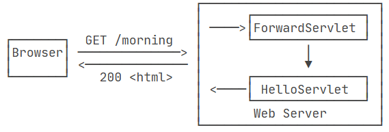
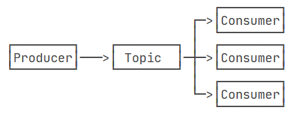

# Servlet


WebServer提供ServletAPI建立业务逻辑，以处理Http请求
- 自定义Servlet继承自HttpServlet，需要覆写doGet()或doPost()方法
- doGet()方法传入两个实例
  - HttpServletRequest封装HTTP请求
  - HttpServletResponse封装HTTP响应
- 发送响应
  - 设置正确的响应类型
  - 获取PrintWriter实例写入响应

```JAVA
// WebServlet注解表示这是一个Servlet，并映射到地址/:
@WebServlet(urlPatterns = "/")
public class HelloServlet extends HttpServlet {
  protected void doGet(HttpServletRequest req, HttpServletResponse resp)
          throws ServletException, IOException {
      // 设置响应类型:
      resp.setContentType("text/html");
      // 获取输出流:
      PrintWriter pw = resp.getWriter();
      // 写入响应:
      pw.write("<h1>Hello, world!</h1>");
      // 最后不要忘记flush强制输出:
      pw.flush();
  }
}

```

WebServer在运行时提供Servlet API，因此设置为provided
- 在4.0及之前由Oracle官方维护servlet-api，引入的依赖项是`javax.servlet:javax.servlet-api`
- 在5.0及之后由Eclipse开源社区维护servlet-api，引入的依赖项是`jakarta.servlet:jakarta.servlet-api`
- 注意war工程下的webapp目录，在高版本Servlet中，不需要/WEB-INF/web.xml配置文件
- 启动支持Servlet API的Web服务器，并由服务器加载war包以处理浏览器发送的请求
  - 支持Servlet API的Web服务器：Tomcat、Jetty、GlassFish
- 在启动Tomcat前，先启动JVM虚拟机执行Tomcat的main()方法，然后由Tomcat负责加载.war文件，并创建HelloServlet实例
  - Tomcat将以多线程的模式来处理HTTP请求
  - 当一个路径匹配的请求到来时，Tomcat将该请求转发到HelloServlet实例
  - 并且封装请求和响应到HttpServletRequest、HttpServletResponse实例
```XML
<dependency>
    <groupId>jakarta.servlet</groupId>
    <artifactId>jakarta.servlet-api</artifactId>
    <version>5.0.0</version>
    <scope>provided</scope>
</dependency>
```


Servlet类
- ServletAPI属于框架，因此无法在代码中直接通过new创建Servlet实例，必须由Servlet容器自动创建Servlet实例；
- Servlet类处于单例模式
- Servlet容器使用多线程执行doGet()或doPost()方法


编写Servlet类
- 要求Servlet类是线程安全的
- HttpServletRequest和HttpServletResponse实例是线程的局部变量，无需线程安全性
- 由于线程复用，因此在doGet()或doPost()方法中使用ThreadLocal结束后必须清理ThreadLocal，否则某个请求复用该线程时将可以看到未被清理的线程状态


自定义Servlet启动方法
1. 在pom.xml中引入Tomcat的jar包
   - 引入Tomcat依赖后将自动引入Servlet API

```XML
<properties>
    <project.build.sourceEncoding>UTF-8</project.build.sourceEncoding>
    <project.reporting.outputEncoding>UTF-8</project.reporting.outputEncoding>
    <maven.compiler.source>17</maven.compiler.source>
    <maven.compiler.target>17</maven.compiler.target>
    <java.version>17</java.version>
    <tomcat.version>10.1.1</tomcat.version>
</properties>


<dependency>
    <groupId>org.apache.tomcat.embed</groupId>
    <artifactId>tomcat-embed-core</artifactId>
    <version>${tomcat.version}</version>
    <scope>provided</scope>
</dependency>
<dependency>
    <groupId>org.apache.tomcat.embed</groupId>
    <artifactId>tomcat-embed-jasper</artifactId>
    <version>${tomcat.version}</version>
    <scope>provided</scope>
</dependency>
```
2. 编写main()方法启动Tomcat
3. 使用Tomcat加载war包

```JAVA
public class Main {
    public static void main(String[] args) throws Exception {
        // 启动Tomcat:
        Tomcat tomcat = new Tomcat();
        tomcat.setPort(Integer.getInteger("port", 8080));
        tomcat.getConnector();
        // 创建webapp:
        Context ctx = tomcat.addWebapp("", new File("src/main/webapp").getAbsolutePath());
        WebResourceRoot resources = new StandardRoot(ctx);
        resources.addPreResources(
                new DirResourceSet(resources, "/WEB-INF/classes", new File("target/classes").getAbsolutePath(), "/"));
        ctx.setResources(resources);
        tomcat.start();
        tomcat.getServer().await();
    }
}

```


通过main()方法启动Tomcat服务器并加载webapp的好处：

- 启动简单，无需下载Tomcat或安装任何IDE插件；
- 调试方便，可在IDE中使用断点调试；
- 使用Maven创建war包后，也可以正常部署到独立的Tomcat服务器中


## Servlet进阶

一个Web App由一个或多个Servlet组成
- 每个Servlet通过注解说明自己能处理的路径
```JAVA
@WebServlet(urlPatterns = "/hello")
public class HelloServlet extends HttpServlet {}

@WebServlet(urlPatterns = "/signin")
public class SignInServlet extends HttpServlet {}

@WebServlet(urlPatterns = "/")
public class IndexServlet extends HttpServlet {}
```


- Dispatcher将请求按路径发送到对应的Servlet
- 每个Servlet都有处理所有Http请求的能力，若该Servlet没有覆写对应的方法，则会返回405或400错误；
- 映射到/的Servlet将接收所有未匹配的路径，等价于/*

 
HttpServletRequest
- HttpServletRequest继承自ServletRequest
  - 设计者希望Servlet能处理多种协议，因此单独抽出了ServletRequest接口，但实际上除了HTTP外，并没有其他协议会用Servlet处理，所以这是一个过度设计

- HttpServletRequest对象可视为`Map<String, Object>`，提供方法`setAttribute()、getAttribute()`，在当前HttpServletRequest对象上附加多个Key-Value


| 方法               | 作用                                                                                           |
|--------------------|------------------------------------------------------------------------------------------------|
| getMethod()        | 返回请求方法，例如，"GET"，"POST"；                                                            |
| getRequestURI()    | 返回请求路径，但不包括请求参数，例如，"/hello"；                                                |
| getQueryString()   | 返回请求参数，例如，"name=Bob&a=1&b=2"；                                                       |
| getParameter(name) | 返回请求参数，GET请求从URL读取参数，POST请求从Body中读取参数；                                   |
| getContentType()   | 获取请求Body的类型，例如，"application/x-www-form-urlencoded"；                                 |
| getContextPath()   | 获取当前Webapp挂载的路径，对于ROOT来说，总是返回空字符串""；                                    |
| getCookies()       | 返回请求携带的所有Cookie；                                                                    |
| getHeader(name)    | 获取指定的Header，对Header名称不区分大小写；                                                    |
| getHeaderNames()   | 返回所有Header名称；                                                                          |
| getInputStream()   | 如果该请求带有HTTP Body，该方法将打开一个输入流用于读取Body；                                   |
| getReader()        | 和getInputStream()类似，但打开的是Reader；                                                    |
| getRemoteAddr()    | 返回客户端的IP地址；                                                                          |
| getScheme()        | 返回协议类型，例如，"http"，"https"；                                                          |


HttpServletResponse
- 常用的设置Header的方法：

| 方法                           | 作用                                                     |
|--------------------------------|----------------------------------------------------------|
| setStatus(sc)                  | 设置响应代码，默认是200；                                 |
| setContentType(type)          | 设置Body的类型，例如，"text/html"；                        |
| setCharacterEncoding(charset) | 设置字符编码，例如，"UTF-8"；                             |
| setHeader(name, value)        | 设置一个Header的值；                                     |
| addCookie(cookie)             | 给响应添加一个Cookie；                                   |
| addHeader(name, value)        | 给响应添加一个Header，因为HTTP协议允许有多个相同的Header； |

- 写入Body
  - 通过getOutputStream()/getWriter()写入Body，只能获取其中一个
  - 无需设置setContentLength()，服务器将根据字节数自动设置
  - 写入完毕后需要调用flush()，否则可能导致缓冲区中的内容无法及时发送到客户端
- 因为TCP连接是复用的，如果关闭写入流，将关闭TCP连接

Servlet多线程模型
- Servlet是单例模式，一个Servlet的doGet()、doPost()等处理请求的方法是多线程并发执行的
- Servlet域需要解决多线程并发访问的问题
  - HttpServletRequest和HttpServletResponse实例是局部变量
```JAVA
public class HelloServlet extends HttpServlet {
    private Map<String, String> map = new ConcurrentHashMap<>();

    protected void doGet(HttpServletRequest req, HttpServletResponse resp) throws ServletException, IOException {
        // 注意读写map字段是多线程并发的:
        this.map.put(key, value);
    }
}
```

## 重定向&转发

重定向：将指定路径下的请求重定向到新路径
- 重定向作用：当Web应用升级后，如果请求路径发生了变化，可以将原来的路径重定向到新路径

临时重定向
- `resp.sendRedirect(redirectToUrl);`方法将向浏览器发送如下消息
```HTTP
HTTP/1.1 302 Found
Location: /hello
```
- 浏览器收到该响应后将立即向新的路径重新发送请求，路由跳转对用户可见，但是无需用户参与
- 这种重定向是临时重定向，代码302

```JAVA
@WebServlet(urlPatterns = "/hi")
public class RedirectServlet extends HttpServlet {
  protected void doGet(HttpServletRequest req, HttpServletResponse resp) throws ServletException, IOException {
      // 构造重定向的路径:
      String name = req.getParameter("name");
      String redirectToUrl = "/hello" + (name == null ? "" : "?name=" + name);
      // 发送重定向响应:
      resp.sendRedirect(redirectToUrl);
  }
}
```

永久重定向：服务器返回301响应代码；浏览器将缓存/hi到/hello这个重定向的关联，下次请求/hi的时候，浏览器将直接发送/hello请求

```JAVA
resp.setStatus(HttpServletResponse.SC_MOVED_PERMANENTLY); // 301
resp.setHeader("Location", "/hello");
```


转发Forward指内部转发；
- 一个Servlet接收到对应请求时，转发给另一个Servlet处理
- 


```JAVA
@WebServlet(urlPatterns = "/morning")
public class ForwardServlet extends HttpServlet {
  protected void doGet(HttpServletRequest req, HttpServletResponse resp) throws ServletException, IOException {
      req.getRequestDispatcher("/hello").forward(req, resp);
  }
}
```

## Session和Cookie
Session：用户第一次访问服务器时，服务器向浏览器分配一个唯一的Session ID，并以Cookie的形式发送给浏览器；浏览器在后续访问中携带该Cookie
- Session ID：如果用户在一段时间内没有访问服务器，则该Session ID会自动失效，下次即使带着上次分配的Session ID访问，服务器也认为这是一个新用户，会分配新的Session ID
- Servlet API提供HttpSession对象支持Session机制；
  - 将用户标识符放入HttpSession对象
  - 用户在一定时间内访问服务器时，能直接从HttpSession取出该用户标识符
  - 当调用req.getSession()时，由Servlet容器自动创建一个Session ID并在报文中附带Cookie

```JAVA
HttpSession session = req.getSession();
session.setAttribute("user", name);
```

- 在后续访问中从HttpSession取出用户名

```JAVA

// 从HttpSession获取当前用户名:
String user = (String) req.getSession().getAttribute("user");
```

- 退出登录的逻辑：从HttpSession中移除用户相关信息
```JAVA
// 从HttpSession移除用户名:
req.getSession().removeAttribute("user");
resp.sendRedirect("/");
```


Cookie
- HttpSession通过一个名为`JSESSIONID`的Cookie跟踪用户会话
- 可自定义除`JSESSIONID`外的名称的Cookie

```JAVA
// 创建一个新的Cookie，指定该Cookie的名称和值
Cookie cookie = new Cookie("lang", lang);
// 该Cookie生效的路径范围，浏览器只会在指定路径下附带该Cookie
cookie.setPath("/");
// 该Cookie有效期:
cookie.setMaxAge(8640000); 
cookie.setSecure(true);
// 将该Cookie添加到响应:
resp.addCookie(cookie);

```


- 从请求中取出Cookie
```JAVA
// 获取请求附带的所有Cookie:
Cookie[] cookies = req.getCookies();

if (cookies != null) {
  // 循环每个Cookie:
  for (Cookie cookie : cookies) {
      // 如果Cookie名称为lang:
      if (cookie.getName().equals("lang")) {
          // 返回Cookie的值:
          return cookie.getValue();
      }
  }
}

```

- 注意，如果网页采用https协议，则需要额外调用`setSecure(true)`，否则浏览器不会发送该Cookie

## Filter

Filter过滤器：在HTTP请求到达Servlet之前，可以被一个或多个Filter预处理，例如打印日志、登录检查
- 要求自定义过滤器实现Filter接口，实现doFilter()方法，并在该方法内部通过调用chain.doFilter()将该请求转交给下一个过滤器，也可以使用重定向直接将该方法转交给某个Servlet
- `@WebFilter`注解：需要被该Filter处理的URL
  - `/*`：表示所有路径
- 将输入输出的编码更改为UTF-8
```JAVA
@WebFilter(urlPatterns = "/*")
public class EncodingFilter implements Filter {
    public void doFilter(ServletRequest request, ServletResponse response, FilterChain chain)
            throws IOException, ServletException {
        System.out.println("EncodingFilter:doFilter");
        request.setCharacterEncoding("UTF-8");
        response.setCharacterEncoding("UTF-8");
        chain.doFilter(request, response);
    }
}
```
- 检查登录
```JAVA
@WebFilter("/user/*")
public class AuthFilter implements Filter {
    public void doFilter(ServletRequest request, ServletResponse response, FilterChain chain)
            throws IOException, ServletException {
        System.out.println("AuthFilter: check authentication");
        HttpServletRequest req = (HttpServletRequest) request;
        HttpServletResponse resp = (HttpServletResponse) response;
        if (req.getSession().getAttribute("user") == null) {
            // 未登录，自动跳转到登录页:
            System.out.println("AuthFilter: not signin!");
            resp.sendRedirect("/signin");
        } else {
            // 已登录，继续处理:
            chain.doFilter(request, response);
        }
    }
}
```
- 拦截Http请求
  - 假设doFilter方法是空白，则浏览器将得到200空白响应页，因为既没有通过chain.doFilter转交，也没有重定向到Servlet
```JAVA
@WebFilter("/*")
public class MyFilter implements Filter {
    public void doFilter(ServletRequest request, ServletResponse response, FilterChain chain)
            throws IOException, ServletException {
        // TODO
    }
}
```
Servlet规范并没有对`@WebFilter`注解标注的Filter规定顺序
- 如果一定要给每个Filter指定顺序，就必须在web.xml文件中对这些Filter再配置一遍

在MVC模式中，先在Dispatcher中分发请求，然后经过Servlet处理，最后到达Servlet

### 修改请求

在某些Filter中需要生成新的HttpServletRequest、HttpServletResponse转交给下一个Filter或Servlet

使用Filter验证用户上传的文件的完整性，并在另一个Servlet中存储该文件
- 当Filter验证通过时，该请求转交给Servlet
- 当Filter验证失败时，直接返回错误信息


```JAVA
@WebFilter("/upload/*")
public class ValidateUploadFilter implements Filter {

  @Override
  public void doFilter(ServletRequest request, ServletResponse response, FilterChain chain)
          throws IOException, ServletException {
      HttpServletRequest req = (HttpServletRequest) request;
      HttpServletResponse resp = (HttpServletResponse) response;
      // 获取客户端传入的签名方法和签名:
      String digest = req.getHeader("Signature-Method");
      String signature = req.getHeader("Signature");
      if (digest == null || digest.isEmpty() || signature == null || signature.isEmpty()) {
          sendErrorPage(resp, "Missing signature.");
          return;
      }
      // 读取Request的Body并验证签名:
      MessageDigest md = getMessageDigest(digest);
      InputStream input = new DigestInputStream(request.getInputStream(), md);
      byte[] buffer = new byte[1024];
      for (;;) {
          int len = input.read(buffer);
          if (len == -1) {
              break;
          }
      }
      String actual = toHexString(md.digest());
      if (!signature.equals(actual)) {
          sendErrorPage(resp, "Invalid signature.");
          return;
      }
      // 验证成功后继续处理:
      chain.doFilter(request, response);
  }

  // 将byte[]转换为hex string:
  private String toHexString(byte[] digest) {
      StringBuilder sb = new StringBuilder();
      for (byte b : digest) {
          sb.append(String.format("%02x", b));
      }
      return sb.toString();
  }

  // 根据名称创建MessageDigest:
  private MessageDigest getMessageDigest(String name) throws ServletException {
      try {
          return MessageDigest.getInstance(name);
      } catch (NoSuchAlgorithmException e) {
          throw new ServletException(e);
      }
  }

  // 发送一个错误响应:
  private void sendErrorPage(HttpServletResponse resp, String errorMessage) throws IOException {
      resp.setStatus(HttpServletResponse.SC_BAD_REQUEST);
      PrintWriter pw = resp.getWriter();
      pw.write("<html><body><h1>");
      pw.write(errorMessage);
      pw.write("</h1></body></html>");
      pw.flush();
  }
}
```

```JAVA
@WebServlet(urlPatterns = "/upload/file")
public class UploadServlet extends HttpServlet {
    protected void doPost(HttpServletRequest req, HttpServletResponse resp) throws ServletException, IOException {
        // 读取Request Body:
        InputStream input = req.getInputStream();
        ByteArrayOutputStream output = new ByteArrayOutputStream();
        byte[] buffer = new byte[1024];
        for (;;) {
            int len = input.read(buffer);
            if (len == -1) {
                break;
            }
            output.write(buffer, 0, len);
        }
        // TODO: 写入文件:
        // 显示上传结果:
        String uploadedText = output.toString(StandardCharsets.UTF_8);
        PrintWriter pw = resp.getWriter();
        pw.write("<h1>Uploaded:</h1>");
        pw.write("<pre><code>");
        pw.write(uploadedText);
        pw.write("</code></pre>");
        pw.flush();
    }
}
```

- 当Filter读取HttpServletRequest并将该请求转交给Servlet后，该Servlet无法读取数据，因为调用getInputStream()读取HttpServletRequest只能读取一次
- 解决办法：使用代理模式伪造HttpServletRequest，对getInputStream()和getReader()返回一个新的流

```JAVA
class ReReadableHttpServletRequest extends HttpServletRequestWrapper {
    private byte[] body;
    private boolean open = false;

    public ReReadableHttpServletRequest(HttpServletRequest request, byte[] body) {
        super(request);
        this.body = body;
    }

    // 返回InputStream:
    public ServletInputStream getInputStream() throws IOException {
        if (open) {
            throw new IllegalStateException("Cannot re-open input stream!");
        }
        open = true;
        return new ServletInputStream() {
            private int offset = 0;

            public boolean isFinished() {
                return offset >= body.length;
            }

            public boolean isReady() {
                return true;
            }

            public void setReadListener(ReadListener listener) {
            }

            public int read() throws IOException {
                if (offset >= body.length) {
                    return -1;
                }
                int n = body[offset] & 0xff;
                offset++;
                return n;
            }
        };
    }

    // 返回Reader:
    public BufferedReader getReader() throws IOException {
        if (open) {
            throw new IllegalStateException("Cannot re-open reader!");
        }
        open = true;
        return new BufferedReader(new InputStreamReader(new ByteArrayInputStream(body), "UTF-8"));
    }
}

```


### 修改响应

假设每次返回的响应内容耗时且固定，就可以使用缓存
- 实现缓存的关键在于，调用doFilter()时，我们不能传入原始的HttpServletResponse，因为这样就会写入Socket，我们也就无法获取下游组件写入的内容。如果我们传入的是“伪造”的HttpServletResponse，让下游组件写入到我们预设的ByteArrayOutputStream，我们就“截获”了下游组件写入的内容，于是，就可以把内容缓存起来，再通过原始的HttpServletResponse实例写入到网络。
```JAVA
@WebFilter("/slow/*")
public class CacheFilter implements Filter {
    // Path到byte[]的缓存:
    private Map<String, byte[]> cache = new ConcurrentHashMap<>();

    public void doFilter(ServletRequest request, ServletResponse response, FilterChain chain)
            throws IOException, ServletException {
        HttpServletRequest req = (HttpServletRequest) request;
        HttpServletResponse resp = (HttpServletResponse) response;
        // 获取Path:
        String url = req.getRequestURI();
        // 获取缓存内容:
        byte[] data = this.cache.get(url);
        resp.setHeader("X-Cache-Hit", data == null ? "No" : "Yes");
        if (data == null) {
            // 缓存未找到,构造一个伪造的Response:
            CachedHttpServletResponse wrapper = new CachedHttpServletResponse(resp);
            // 让下游组件写入数据到伪造的Response:
            chain.doFilter(request, wrapper);
            // 从伪造的Response中读取写入的内容并放入缓存:
            data = wrapper.getContent();
            cache.put(url, data);
        }
        // 写入到原始的Response:
        ServletOutputStream output = resp.getOutputStream();
        output.write(data);
        output.flush();
    }
}
```


## Listener


# Spring

## IoC容器

容器：为特定组件运行提供支持的软件环境；Spring提供IoC容器管理所有的JavaBean组件，IoC容器为组件提供以下服务
- 组件生命周期管理、配置和组装、AOP支持
- 建立在AOP基础上的声明式事务服务


IoC：Inversion of Control/DI：Dependency Injection
- 将组件的创建+配置与组件的使用相分离，由IoC容器负责管理组件的生命周期
- 开发者仅告诉IoC容器组件的创建方法+组件之间的依赖关系；由IoC容器负责实例化所有的组件
- 符合JavaBean规范的类可以称为IoC容器中的组件

DI的方式：属性注入、set注入、构造器注入、方法参数注入

无侵入性：应用程序的组件无需实现Spring的特定接口
- 应用程序组件既可以在Spring的IoC容器中运行，也可以自己编写代码自行组装配置；
- 测试的时候并不依赖Spring容器，可单独进行测试，大大提高了开发效率。

创建IoC容器
- AnnotationConfigApplicationContext要求传入一个被`@Configuration`标注的类名

```JAVA

//自动从classpath中查找指定的XML配置文件
ApplicationContext context = new ClassPathXmlApplicationContext("application.xml");

```

- `@ComponentScan`：让IOC容器自动搜索当前类所在的包以及子包，自动创建被`@Component`标注的JavaBean，并根据`@Autowired`进行装配
```java
@Configuration
@ComponentScan
public class AppConfig {
  public static void main(String[] args) {
    ApplicationContext context = new AnnotationConfigApplicationContext(AppConfig.class);
  }
}
```

### 装配Bean
JavaBean的Scope
- 组件默认单例模式，若需更改为原型则需要添加@Scope注解：
```JAVA
@Component
@Scope(ConfigurableBeanFactory.SCOPE_PROTOTYPE) // @Scope("prototype")
public class MailSession {
    ...
}
```

将多个相同类型的JavaBean注入到同一个组件中
- 使用场景：将多个接口类型的实现类组件装配到List中，再注入同一个组件
```JAVA

// 假设Validator接口有多个实现类

// 在Validators中使用List注入，IoC容器将扫描所有该类型的组件并组装为List再注入
@Component
public class Validators {
    @Autowired
    List<Validator> validators;

    public void validate(String email, String password, String name) {
        for (var validator : this.validators) {
            validator.validate(email, password, name);
        }
    }
}

```

- 若要求按顺序组装进List则可使用@Order注解

```JAVA

@Component
@Order(1)
public class EmailValidator implements Validator {
    ...
}

@Component
@Order(2)
public class PasswordValidator implements Validator {
    ...
}

@Component
@Order(3)
public class NameValidator implements Validator {
    ...
}
```

可选注入
- 若未找到对应类型的组件，不抛出NoSuchBeanDefinitionException，而是使用默认值

```JAVA
@Component
public class MailService {
    @Autowired(required = false)
    ZoneId zoneId = ZoneId.systemDefault();
    ...
}
```

创建第三方Bean
- 第三方提供的组件和接口不在当前package管理范围中，则需要在@Configuration标注的类中通过方法返回，该方法需要被@Bean注解
- @Bean注解默认返回单例
```JAVA
@Configuration
@ComponentScan
public class AppConfig {
    @Bean
    ZoneId createZoneId() {
        return ZoneId.of("Z");
    }
}
```

- @Bean要求返回的Bean类型不能重复，否则抛出NoUniqueBeanDefinitionException
  - 如果一定要返回相同类型的Bean，则不能根据类名标识返回的组件名
  - 通过`@Bean(id名)`、`@Bean+@Qualifier(id名)`指定别名
  - 在注入时也不能根据类型查找，而是要求注入时使用`@Qualifier(id名)`指定`@Bean`的id名

```JAVA
@Configuration
@ComponentScan
public class AppConfig {
    @Bean("z")
    ZoneId createZoneOfZ() {
        return ZoneId.of("Z");
    }

    @Bean
    @Qualifier("utc8")
    ZoneId createZoneOfUTC8() {
        return ZoneId.of("UTC+08:00");
    }
}


@Component
public class MailService {
	@Autowired(required = false)
	@Qualifier("z") // 指定注入名称为"z"的ZoneId
	ZoneId zoneId = ZoneId.systemDefault();
    ...
}
```

- 除指定id名的方法外，可使用@Primary注解避免注入使用类名抛出异常
  - 在注入时，如果没有指出Bean的名字，Spring会注入标记有@Primary的Bean
```JAVA

@Configuration
@ComponentScan
public class AppConfig {
    @Bean
    @Primary // 指定为主要Bean
    @Qualifier("z")
    ZoneId createZoneOfZ() {
        return ZoneId.of("Z");
    }

    @Bean
    @Qualifier("utc8")
    ZoneId createZoneOfUTC8() {
        return ZoneId.of("UTC+08:00");
    }
}
```


对工厂方法的支持：要求工厂类实现`FactoryBean<T>`接口，并实现 getObject()  接口返回真正的Bean
- 该方法不常用

```java
@Component
public class ZoneIdFactoryBean implements FactoryBean<ZoneId> {

    String zone = "Z";

    @Override
    public ZoneId getObject() throws Exception {
        return ZoneId.of(zone);
    }

    @Override
    public Class<?> getObjectType() {
        return ZoneId.class;
    }
}
```


自定义初始化和销毁
- jakarta.annotation-api包提供@PostConstruct和@PreDestroy注解管理初始化和销毁
- @PostConstruct和@PreDestroy注解要求方法是非静态的、void、无参数方法，无论是单例还是原型，都仅执行一次这两个方法
- 执行顺序
  - 调用构造方法创建MailService实例；
  - 根据@Autowired进行注入；
  - 调用标记有@PostConstruct的init()方法进行初始化。

```JAVA
@Component
public class MailService {
    @Autowired(required = false)
    ZoneId zoneId = ZoneId.systemDefault();

    @PostConstruct
    public void init() {
        System.out.println("Init mail service with zoneId = " + this.zoneId);
    }

    @PreDestroy
    public void shutdown() {
        System.out.println("Shutdown mail service");
    }
}
```


### 注入资源

org.springframework.core.io.Resource提供@Value注解：根据文件位置自动定位文件
- `@Value("classpath:/logo.txt")`：在classpath下搜索目标文件
  - 可使用相对、绝对路径
- 调用Resource.getInputStream()获取输入流
```JAVA
@Component
public class AppService {
    @Value("classpath:/logo.txt")
    private Resource resource;

    private String logo;

    @PostConstruct
    public void init() throws IOException {
        try (var reader = new BufferedReader(
                new InputStreamReader(resource.getInputStream(), StandardCharsets.UTF_8))) {
            this.logo = reader.lines().collect(Collectors.joining("\n"));
        }
    }
}


```


### 注入配置

通过`@PropertySource`注解读取目标位置的配置文件，并通过@Value以${key:defaultValue}的形式注入
- "${app.zone}"：注入key为app.zone的value，如果key不存在，启动将报错；
- "${app.zone:Z}"：注入key为app.zone的value，但如果key不存在，就使用默认值Z
```JAVA
@Configuration
@ComponentScan
@PropertySource("app.properties") // 表示读取classpath的app.properties
public class AppConfig {
    @Value("${app.zone:Z}")
    String zoneId;

    @Bean
    ZoneId createZoneId() {
        return ZoneId.of(zoneId);
    }
}
```


<FONT COLOR=RED>常用方法：一个组件仅负责读取配置文件，在其它组件中通过@Value以`#{key:defaultValue}`读取该组件的域完成配置</FONT>

- `#{}` ：和`${key}`不同的是，`#{}`表示从JavaBean通过get方法读取属性
  - "#{smtpConfig.host}"：从名称为smtpConfig的Bean读取host属性，即调用getHost()方法
  - 优先使用Class名，冲突则使用id名


```JAVA
//一个组件持有所有的配置
@Component
public class SmtpConfig {
    @Value("${smtp.host}")
    private String host;

    @Value("${smtp.port:25}")
    private int port;

    public String getHost() {
        return host;
    }

    public int getPort() {
        return port;
    }
}

//在需要的地方通过#{key:defaultValue}注入
@Component
public class MailService {
    @Value("#{smtpConfig.host}")
    private String smtpHost;

    @Value("#{smtpConfig.port}")
    private int smtpPort;
}
```

### 条件装配

使用@Profile定义应用程序环境：native（开发）、test、production（生产）
- @Profile("!test")非test环境时调用
- @Profile("test")test环境时调用

```JAVA
@Configuration
@ComponentScan
public class AppConfig {
    @Bean
    @Profile("!test")
    ZoneId createZoneId() {
        return ZoneId.systemDefault();
    }

    @Bean
    @Profile("test")  
    ZoneId createZoneIdForTest() {
        return ZoneId.of("America/New_York");
    }
}
```

- 启动JVM时添加参数指定环境：`-Dspring.profiles.active=test`
- 使用多个Profile：`-Dspring.profiles.active=test,master`

```JAVA

@Bean
@Profile({ "test", "master" }) // 满足test或master
ZoneId createZoneId() {
    ...
}
```

@Conditional 
- 要求指定用于条件判断的接口实现类

```JAVA
@Component
@Conditional(OnSmtpEnvCondition.class)
public class SmtpMailService implements MailService {
    ...
}
```

- 其中OnSmtpEnvCondition类实现Condition接口，并实现matches方法
```JAVA
public class OnSmtpEnvCondition implements Condition {
    public boolean matches(ConditionContext context, AnnotatedTypeMetadata metadata) {
        return "true".equalsIgnoreCase(System.getenv("smtp"));
    }
}
```

- SpringBoot提供更多条件注解，简化实现
```JAVA

// 如果配置文件中存在app.smtp=true，则创建MailService：
@Component
@ConditionalOnProperty(name="app.smtp", havingValue="true")
public class MailService {
    ...
}

// 如果当前classpath中存在类javax.mail.Transport，则创建MailService：
@Component
@ConditionalOnClass(name = "javax.mail.Transport")
public class MailService {
    ...
}
```


## AOP

AOP 使用Proxy设计模式将横跨多个业务方法的逻辑抽出到切面中，由AOP自动将切面织入到业务代码中，实现业务逻辑与系统逻辑的分离，例如权限检查、日志、事务。AOP有三种织入方式
1. 编译期：在编译时，由编译器把切面调用编译进字节码，这种方式需要定义新的关键字并扩展编译器，AspectJ就扩展了Java编译器，使用关键字aspect来实现织入；
2. 类加载器：在目标类被装载到JVM时，通过一个特殊的类加载器，对目标类的字节码重新“增强”；
3. 运行期：动态代理

在@Configuration类上添加@EnableAspectJAutoProxy注解：自动查找带有@Aspect的Bean，然后根据每个方法的@Before、@Around等注解把AOP注入到特定的Bean中
```JAVA
@Configuration
@ComponentScan
@EnableAspectJAutoProxy
public class AppConfig {
    ...
}
```
Spring在spring-aspects包中提供对AOP的支持
- 在代理方法中注解：@Before、@After、@Around、@AfterReturning、@AfterThrowing
  - @Around：由开发者决定是否执行被代理的目标方法、执行目标方法前后以及抛出异常时的动作
  - @Before：这种拦截器先执行拦截代码，再执行目标代码。如果拦截器抛异常，那么目标代码就不执行了；
  - @After：这种拦截器先执行目标代码，再执行拦截器代码。无论目标代码是否抛异常，拦截器代码都会执行；
  - @AfterReturning：和@After不同的是，只有当目标代码正常返回时，才执行拦截器代码；
  - @AfterThrowing：和@After不同的是，只有当目标代码抛出了异常时，才执行拦截器代码；


- 切面类需要使用@Component及@Aspect注解


```JAVA
@Aspect
@Component
public class LoggingAspect {
    // 在执行UserService的每个方法前执行:
    @Before("execution(public * com.itranswarp.learnjava.service.UserService.*(..))")
    public void doAccessCheck() {
        System.err.println("[Before] do access check...");
    }

    // 在执行MailService的每个方法前后执行:
    @Around("execution(public * com.itranswarp.learnjava.service.MailService.*(..))")
    public Object doLogging(ProceedingJoinPoint pjp) throws Throwable {
        System.err.println("[Around] start " + pjp.getSignature());
        Object retVal = pjp.proceed();
        System.err.println("[Around] done " + pjp.getSignature());
        return retVal;
    }
}
```

Spring使用CGLIB动态代理
- 运行时创建代理对象，该代理对象持有原始实例的引用、切面类引用
- 原始实例中的代码不能直接访问自己的域，而是必须通过get方法访问
  - 原始实例始终会通过构造函数初始化
  - 代理对象是原始实例的子类，因此具有和原始实例相同的域和实例
  - 代理对象会初始化和原始实例相同的域，但是该域不会被初始化，而是初始化为null
    - 尽管编译器规定子类构造器的第一行必须是super()，但是在Spring中是通过反射构造的代理对象，因为没有理由构造super()，因此无需织入super()
    - 通过反射直接生成字节码，而无需通过JVM的编译检查
    - 不实例化代理对象的域是因为避免造成二义性，即set方法会被覆写并委托，因此代理对象中的域一旦初始化将无法更改，此时调用get方法和直接访问域获取到的数据不一致
  - 代理对象将覆写继承而来的方法，并覆写该方法，委托给原始实例
- 原始实例中的代理方法只能是public 非final方法，因为final方法无法被继承

### AspectJ的注入语法

不推荐使用

### 注解装配AOP

使用AspectJ的注入语法
- 好处是被代理的方法不知道自己被代理
- 坏处是被代理的方法不知道自己被代理，拦截语法复杂，且非精准匹配可能会代理无需被代理的方法

使用注解注入
- 例如@Transactional：被注解Bean(在组件上注明该注解，表示所有public非final方法都需要使用事务)或方法清楚自己被代理


定义注解
- 切面方法中使用注解@Around("@annotation(metricTime)")：符合条件的目标方法是带有@MetricTime注解的方法
- 该切面方法的参数类型是MetricTime，参数名是metricTime
- 在拦截器的参数中使用参数名而不是参数类型，因为是通过参数名获取名称
```JAVA
@Target(METHOD)
@Retention(RUNTIME)
public @interface MetricTime {
    String value();
}


@Aspect
@Component
public class MetricAspect {
    @Around("@annotation(metricTime)")
    public Object metric(ProceedingJoinPoint joinPoint, MetricTime metricTime) throws Throwable {
        String name = metricTime.value();
        long start = System.currentTimeMillis();
        try {
            return joinPoint.proceed();
        } finally {
            long t = System.currentTimeMillis() - start;
            // 写入日志或发送至JMX:
            System.err.println("[Metrics] " + name + ": " + t + "ms");
        }
    }
}
```

## 数据库访问

Spring为简化数据库访问所做的工作

- 提供简化的访问JDBC的模板类，不必手动释放资源
- 提供统一的DAO类以实现Data Access Object模式
- 把SQLException封装为DataAccessException，这个异常是一个RuntimeException，能区分SQL异常的原因
- 能方便地集成Hibernate、JPA和MyBatis这些数据库访问框架

### 使用JDBC

JDBC：使用模板方法，需要一系列回调方法定义细节
- 注入配置并使用配置创建DataSource实例，实际类型由供应商提供
- 使用DataSource实例创建JdbcTemplate实例
- 在需要访问数据库的Bean中注入JdbcTemplate实例

`T execute(ConnectionCallback<T> action)`
- 要求通过`ConnectionCallback<T>`接口传入回调代码
- 允许直接使用Connection实例，因为在jdbcTemplate实例中已经准备好该实例，并且不能在回调代码中释放Connection实例
```JAVA
//反编译源码
@Nullable
public <T> T execute(ConnectionCallback<T> action) throws DataAccessException {
  Assert.notNull(action, "Callback object must not be null");
  Connection con = DataSourceUtils.getConnection(this.obtainDataSource());

  Object var10;
  try {
      Connection conToUse = this.createConnectionProxy(con);
      var10 = action.doInConnection(conToUse);
  } catch (SQLException var8) {
      String sql = getSql(action);
      DataSourceUtils.releaseConnection(con, this.getDataSource());
      con = null;
      throw this.translateException("ConnectionCallback", sql, var8);
  } finally {
      DataSourceUtils.releaseConnection(con, this.getDataSource());
  }

  return var10;
}
```
- 在回调代码中创建的PreparedStatement、ResultSet必须用try(...)释放:

```JAVA
public User getUserById(long id) {
  return jdbcTemplate.execute((Connection conn) -> {
    try (var ps = conn.prepareStatement("SELECT * FROM users WHERE id = ?")) {
      ps.setObject(1, id);
      try (var rs = ps.executeQuery()) {
        if (rs.next()) {
            return new User( 
          rs.getLong("id"), 
          rs.getString("email"), 
          rs.getString("password"), 
          rs.getString("name")); 
        }
        throw new RuntimeException("user not found by id.");
      }
    }
  });
}
```

`T execute(String sql, PreparedStatementCallback<T> action)`
- JdbcTemplate已创建好PreparedStatement实例，不能在回调代码中释放
- 
```JAVA
public User getUserByName(String name) {
  return jdbcTemplate.execute("SELECT * FROM users WHERE name = ?", (PreparedStatement ps) -> {
    ps.setObject(1, name);
    try (var rs = ps.executeQuery()) {
      if (rs.next()) {
        return new User( 
            rs.getLong("id"), 
            rs.getString("email"), 
            rs.getString("password"), 
            rs.getString("name")); 
      }
      throw new RuntimeException("user not found by id.");
    }
  });
}
```

`T queryForObject(String sql, RowMapper<T> rowMapper, Object... args)`
- SQL语句、回调函数、参数
- 自动创建ResultSet

```JAVA
public User getUserByEmail(String email) {
  return jdbcTemplate.queryForObject("SELECT * FROM users WHERE email = ?",
    (ResultSet rs, int rowNum) -> {
      return new User( 
          rs.getLong("id"), 
          rs.getString("email"), 
          rs.getString("password"), 
          rs.getString("name")); 
    },
    email);
}
```

T query(String sql, ResultSetExtrator<T> rse)
- Spring提供BeanPropertyRowMapper将一行记录按列名转换为JavaBean，要求表的列名与JavaBean的属性名一致

```JAVA
public List<User> getUsers(int pageIndex) {
    int limit = 100;
    int offset = limit * (pageIndex - 1);
    return jdbcTemplate.query("SELECT * FROM users LIMIT ? OFFSET ?",
            new BeanPropertyRowMapper<>(User.class),
            limit, offset);
}
```

更新操作
```JAVA
public void updateUser(User user) {
    // 传入SQL，SQL参数，返回更新的行数:
    if (1 != jdbcTemplate.update("UPDATE users SET name = ? WHERE id = ?", user.getName(), user.getId())) {
        throw new RuntimeException("User not found by id");
    }
}
```
- 插入后，通过keyHolder获取自增主键的值

```JAVA
public User register(String email, String password, String name) {
    // 创建一个KeyHolder:
    KeyHolder holder = new GeneratedKeyHolder();
    if (1 != jdbcTemplate.update(
        // 参数1:PreparedStatementCreator
        (conn) -> {
            // 创建PreparedStatement时，必须指定RETURN_GENERATED_KEYS:
            var ps = conn.prepareStatement("INSERT INTO users(email, password, name) VALUES(?, ?, ?)",
                    Statement.RETURN_GENERATED_KEYS);
            ps.setObject(1, email);
            ps.setObject(2, password);
            ps.setObject(3, name);
            return ps;
        },
        // 参数2:KeyHolder
        holder)
    ) {
        throw new RuntimeException("Insert failed.");
    }
    // 从KeyHolder中获取返回的自增值:
    return new User(holder.getKey().longValue(), email, password, name);
}
```


### 声明式事务

使用PlatformTransactionManager表示事务管理器，管理所有事务，使用TransactionStatus表示事务
- 除事务外，还有分布式事务JTA-Java Transaction API
- 因此Spring为了同时支持JDBC和JTA两种事务模型，才抽象出PlatformTransactionManager
- 事务可以使用编程式或声明式，编程式很复杂，下面启用声明式事务

在AppConfig添加@EnableTransactionManagement


```JAVA
@Configuration
@ComponentScan
@EnableTransactionManagement // 启用声明式
@PropertySource("jdbc.properties")
public class AppConfig {
    ...
}
```

@Transactional注解通过AOP实现，因此
- @Transactional可以注解在Class、Method上
- 启用@EnableTransactionManagement自动开启AOP支持，而无需再声明@EnableAspectJAutoProxy

事务回滚
- 默认情况下，只要抛出RuntimeException就会回滚
- 在@Transactional中传入rollbackfor参数，指定需要回滚的条件

```JAVA
@Transactional(rollbackFor = {RuntimeException.class, IOException.class})
public buyProducts(long productId, int num) throws IOException {
    ...
}
```
- 因此应用中的异常体系应从RuntimeException上派生


事务传播：假设一个方法调用了另一个方法，而这两个方法分别都定义了一个事务，那么无论哪一方发生异常，期望的行为可能是两个方法中的事务作为一个整体回滚，这种传播行为是默认的
- 默认传播级别REQUIRED：如果当前没有事务，就创建一个新事务，如果当前有事务，就加入到当前事务中执行

定义事务的传播级别
```JAVA
@Transactional(propagation = Propagation.REQUIRES_NEW)
public Product createProduct() {
    ...
}
```


其它事务级别

- MANDATORY：表示必须要存在当前事务并加入执行，否则将抛出异常。这种传播级别可用于核心更新逻辑，比如用户余额变更，它总是被其他事务方法调用，不能直接由非事务方法调用；

- REQUIRES_NEW：表示不管当前有没有事务，都必须开启一个新的事务执行。如果当前已经有事务，那么当前事务会挂起，等新事务完成后，再恢复执行；

- NOT_SUPPORTED：表示不支持事务，如果当前有事务，那么当前事务会挂起，等这个方法执行完成后，再恢复执行；

- NEVER：和NOT_SUPPORTED相比，它不但不支持事务，而且在监测到当前有事务时，会抛出异常拒绝执行；

- NESTED：表示如果当前有事务，则开启一个嵌套级别事务，如果当前没有事务，则开启一个新事务


事务实现
- Spring总是把JDBC相关的Connection和TransactionStatus实例绑定到ThreadLocal
- 如果一个事务方法从ThreadLocal未取到事务，那么它会打开一个新的JDBC连接，同时开启一个新的事务，否则，它就直接使用从ThreadLocal获取的JDBC连接以及TransactionStatus
- 因此事务能正确传播的前提是，方法调用在一个线程内，否则两个线程中的两个方法将开启两个事务


### Dao

Spring提供了一个JdbcDaoSupport类，用于简化DAO的实现
- 核心代码：持有JdbcTemplate，供外界调用getJdbcTemplate()获得JdbcTemplate的实例
- 域jdbcTemplate没有标注@AutoWired
- 因此在自定义子类中继承JdbcDaoSupport并实现样板代码供子类继承

```JAVA
public abstract class AbstractDao<T> extends JdbcDaoSupport {
    private String table;
    private Class<T> entityClass;
    private RowMapper<T> rowMapper;

    public AbstractDao() {
        // 获取当前类型的泛型类型:
        this.entityClass = getParameterizedType();
        this.table = this.entityClass.getSimpleName().toLowerCase() + "s";
        this.rowMapper = new BeanPropertyRowMapper<>(entityClass);
    }

    public T getById(long id) {
        return getJdbcTemplate().queryForObject("SELECT * FROM " + table + " WHERE id = ?", this.rowMapper, id);
    }

    public List<T> getAll(int pageIndex) {
        int limit = 100;
        int offset = limit * (pageIndex - 1);
        return getJdbcTemplate().query("SELECT * FROM " + table + " LIMIT ? OFFSET ?",
                new Object[] { limit, offset },
                this.rowMapper);
    }

    public void deleteById(long id) {
        getJdbcTemplate().update("DELETE FROM " + table + " WHERE id = ?", id);
    }
    ...
}
```


### ORM框架

ORM-Object-Relational Mapping：记录与JavaBean的相互转换

上述知识点使用JdbcTemplate配合RowMapper实现最原始的ORM，现使用ORM框架实现更自动化的ORM
#### Hibernate

略

#### JPA

JPA就是JavaEE的一个ORM标准，它的实现其实和Hibernate没啥本质区别，但是用户如果使用JPA，那么引用的就是jakarta.persistence这个“标准”包，而不是org.hibernate这样的第三方包。因为JPA只是接口，所以，还需要选择一个实现产品，跟JDBC接口和MySQL驱动一个道理。

#### MyBatis

MyBatis作为半自动框架，只负责把ResultSet自动映射到Java Bean，或者自动填充Java Bean参数，但仍需自己写出SQL，但是结果是确定的

开启声明式事务并创建DataSource

```JAVA
@Configuration
@ComponentScan
@EnableTransactionManagement
@PropertySource("jdbc.properties")
public class AppConfig {
    @Bean
    DataSource createDataSource() { ... }
}
```

MyBatis提供SqlSessionFactory和SqlSession
- 创建SqlSessionFactoryBean
```JAVA
@Bean
SqlSessionFactoryBean createSqlSessionFactoryBean(@Autowired DataSource dataSource) {
    var sqlSessionFactoryBean = new SqlSessionFactoryBean();
    sqlSessionFactoryBean.setDataSource(dataSource);
    return sqlSessionFactoryBean;
}
```

- MyBatis使用Spring的事务管理器和声明式事务，因此需要创建事务管理器
```JAVA
@Bean
PlatformTransactionManager createTxManager(@Autowired DataSource dataSource) {
    return new DataSourceTransactionManager(dataSource);
}
```

- 使用Mapper实现映射
- 在使用@Insert执行插入时，使用@Option声明需要获取自增主键
  - keyProperty和keyColumn分别指出JavaBean的属性和数据库的主键列名。
```JAVA
public interface UserMapper {
	@Select("SELECT * FROM users WHERE id = #{id}")
	User getById(@Param("id") long id);
}

@Select("SELECT * FROM users LIMIT #{offset}, #{maxResults}")
List<User> getAll(@Param("offset") int offset, @Param("maxResults") int maxResults);

@Options(useGeneratedKeys = true, keyProperty = "id", keyColumn = "id")
@Insert("INSERT INTO users (email, password, name, createdAt) VALUES (#{user.email}, #{user.password}, #{user.name}, #{user.createdAt})")
void insert(@Param("user") User user);
```

- MyBatis提供MapperFactoryBean自动创建所有Mapper的实现类，使用@MapperScan("com.itranswarp.learnjava.mapper")启用该类


## Web开发

Spring提供Spring MVC框架封装ServletAPI
- DispatcherServlet持有IoC容器实例，通过该实例获取所有的@Controller组件
- DispatcherServlet接收所有的HTTP请求后，并根据Controller方法配置的路径，将请求转发到响应的方法


Controller
- 使用@GetMapping、@PostMapping等注解表示HTTP请求路径
- 使用@RequestParam()表示HTTP参数
- 若需要使用底层HttpServletRequest、HttpServletResponse、HttpSession，直接在参数中添加该类型参数

### RestAPI

Spring提供`@RestController`注解，该组件下的方法将作为RestAPI，接收或发送JSON格式的数据
- 要求输入或输出能被Jackson序列化或反序列化
- 在序列化时，对于JavaBean中不希望被序列化的域，仅需使用@JsonIgnore即可
- 若属性可写不可读可使用`@JsonProperty(access = Access.WRITE_ONLY)`
- 若属性可读不可写可使用`@JsonProperty(access = Access.READ_ONLY)`

### Filter

在MVC中使用Filter，Json仅按UTF-8格式编码，但是Servlet按非UTF-8编码读取参数，现使用EncodingFilter，在全局范围内将所有的HttpServletRequest和HttpServletResponse强制设置为UTF-8编码
- 问题：在Controller中设置目标组件继承自Filter时，该实例将由Servlet容器初始化，而不是Spring容器，因此该类将作为普通的JavaBean进行初始化销毁，注解@Component或@Autowired都不生效
- 解决方法：Spring容器正常组装，并且让Servlet创建的Filter对象间接引用Spring创建的对象
- 解决手段：Spring MVC提供的DelegatingFilterProxy类，通过代理，把Spring管理的Bean注册到Servlet容器中
- Spring只能通过配置文件实现，过于繁琐，参见<A HREF="#添加filter">SpringBoot/添加Filter</A>

### Interceptor
SpringMVC 提供Interceptor达到类似Filter的效果，但是仅针对Controller拦截，即仅在Spring MVC提供的DispatcherServlet的生效时期中
- 实现手段：通过AOP拦截Controller方法
- 好处：避免使用Filter无法直接注入Spring管理的Bean，并且可以通过Order指定拦截器的顺序

实现HandlerInterceptor接口，并选择实现方法
- 实现拦截器后还需要进一步注册，否则就是普通的组件
  - 将所有的Interceptor注入WebMvcConfigurer实例，供SpringMVC框架调用
```JAVA

@Bean
WebMvcConfigurer createWebMvcConfigurer(@Autowired HandlerInterceptor[] interceptors) {
    return new WebMvcConfigurer() {
        public void addInterceptors(InterceptorRegistry registry) {
            for (var interceptor : interceptors) {
                registry.addInterceptor(interceptor);
            }
        }
        ...
    };
}
```
- preHandle()：Controller方法调用前执行
  - 返回true：指示MVC继续转发到相应的Controller
  - 返回false：指示MVC直接返回错误响应
- postHandle()：Controller方法正常返回后执行
  - 通常作为缓存，使用该方法在HttpServletResponse中添加数据，而无需在每个Controller方法中重复添加
- afterCompletion()：无论Controller方法是否抛异常都会执行
  - 参数ex：Controller方法抛出的异常或null

```JAVA
@Order(1)
@Component
public class LoggerInterceptor implements HandlerInterceptor {

    final Logger logger = LoggerFactory.getLogger(getClass());

    @Override
    public boolean preHandle(HttpServletRequest request, HttpServletResponse response, Object handler) throws Exception {
        logger.info("preHandle {}...", request.getRequestURI());
        if (request.getParameter("debug") != null) {
            PrintWriter pw = response.getWriter();
            pw.write("<p>DEBUG MODE</p>");
            pw.flush();
            return false;
        }
        return true;
    }

    @Override
    public void postHandle(HttpServletRequest request, HttpServletResponse response, Object handler, ModelAndView modelAndView) throws Exception {
        logger.info("postHandle {}.", request.getRequestURI());
        if (modelAndView != null) {
            modelAndView.addObject("__time__", LocalDateTime.now());
        }
    }

    @Override
    public void afterCompletion(HttpServletRequest request, HttpServletResponse response, Object handler, Exception ex) throws Exception {
        logger.info("afterCompletion {}: exception = {}", request.getRequestURI(), ex);
    }
}
```

#### ExceptionHandler

在Controller中，Spring MVC提供@ExceptionHandler注解处理异常
- 允许被注解的方法传入Exception、HttpServletRequest等参数类型，对返回值、方法签名无要求
```JAVA
@Controller
public class UserController {
    @ExceptionHandler(RuntimeException.class)
    public ModelAndView handleUnknowException(Exception ex) {
        return new ModelAndView("500.html", Map.of("error", ex.getClass().getSimpleName(), "message", ex.getMessage()));
    }
    ...
}
```

- 仅能在Controller中使用@ExceptionHandler注解，且该方法只能拦截该Controller中的方法所抛出的指定类型的异常

全局异常处理器
- 方法一：在BaseController中使用@ExceptionHandler注解，处理BaseException异常
- 方法二：在切面类中使用@ExceptionHandler注解代理所有的Controller

```JAVA

@RestControllerAdvice//或者使用@ControllerAdvice
public class ErrorHandler {
  @ExceptionHandler(BaseException.class)
  public HttpResult<String> errorHandler(HttpServletRequest request, BaseException e){
    log.error (e.toString ());
    return HttpResult.fail (e.getErrorCode ());
  }
}

```

### CORS

浏览器中的JavaScript和后端的REST API交互时，受到浏览器的同源策略限制；若域名、协议、端口有一个不同，则js代码调用不会成功；
- CORS-Cross-Origin Resource Sharing，由HTML5规范定义的跨域访问资源方法
- 当且仅当API提供方返回响应头`Access-Control-Allow-Origin: 调用方域名`时，浏览器才允许调用方的js代码访问API提供方的API

局部CORS配置
- 允许任何域访问：`@CrossOrigin(origins = "*")`
```JAVA
@CrossOrigin(origins = "http://XXX.com:8080")
@RestController
@RequestMapping("/api")
public class ApiController {
    ...
}
```

全局CORS配置

```JAVA
@Bean
WebMvcConfigurer createWebMvcConfigurer() {
  return new WebMvcConfigurer() {
    @Override
    public void addCorsMappings(CorsRegistry registry) {
      registry.addMapping("/api/**")
              .allowedOrigins("http://local.liaoxuefeng.com:8080")
              .allowedMethods("GET", "POST")
              .maxAge(3600);
      // 可以继续添加其他URL规则:
      // registry.addMapping("/rest/v2/**")...
    }
  };
}
```

### 国际化

### 异步处理

Tomcat通过线程池处理请求，每个请求从头到尾都由某一个线程处理；JDBC事务、安全认证都基于ThreadLocal实现，确保在处理请求的过程中各个线程互不影响
- 为避免长时间的同步操作耗尽Tomcat中的线程池，需要使用异步处理提高线程池的利用效率

首先需要开启Servlet对异步的支持

第一种方法：返回`Callable<T>`对象；线程将放回线程池，并在新开的线程返回后写入响应

```JAVA
@GetMapping("/users")
public Callable<List<User>> users() {
    return () -> {
        // 模拟3秒耗时:
        try {
            Thread.sleep(3000);
        } catch (InterruptedException e) {
        }
        return userService.getUsers();
    };
}
```

第二种方法：返回一个DeferredResult对象，然后在另一个线程中，设置此对象的值并写入响应：
- 使用DeferredResult时，可以设置超时；超时会自动返回超时错误响应
- 在另一个线程中，可以调用setResult()写入结果，也可以调用setErrorResult()写入一个错误结果。
- 因此在实际开发中，常使用DeferredResult方法
```JAVA
@GetMapping("/users/{id}")
public DeferredResult<User> user(@PathVariable("id") long id) {
    DeferredResult<User> result = new DeferredResult<>(3000L); // 3秒超时
    new Thread(() -> {
        // 等待1秒:
        try {
            Thread.sleep(1000);
        } catch (InterruptedException e) {
        }
        try {
            User user = userService.getUserById(id);
            // 设置正常结果并由Spring MVC写入Response:
            result.setResult(user);
        } catch (Exception e) {
            // 设置错误结果并由Spring MVC写入Response:
            result.setErrorResult(Map.of("error", e.getClass().getSimpleName(), "message", e.getMessage()));
        }
    }).start();
    return result;
}
```


使用async异步处理的注意事项
- 两种方法都会新开线程，因此异步线程中的事务和Controller方法中执行的事务不是同一个事务，在Controller中绑定的ThreadLocal信息也无法在异步线程中获取
- Filter必须开启对异步的支持，否则面对异步请求路径时会报错

Servlet 3.0规范添加的异步支持面对高并发异步请求时的处理效率不高
- Java标准库提供了封装操作系统的异步IO包java.nio，是真正的多路复用IO模型，可以用少量线程支持大量并发
- 但是使用NIO编程复杂度比同步IO高很多，因此很少直接使用NIO
- 大部分需要高性能异步IO的应用程序可以选择Netty框架，该框架基于NIO包提供了更易于使用的API，方便开发异步应用程序
### WebSocket

Java的Servlet规范从3.1开始支持WebSocket：基于HTTP协议
- 在建立TCP连接后，若客户端希望升级为长连接的WebSocket，需要浏览器发送请求时附带以下请求头

```HTTP
GET /chat HTTP/1.1
Host: www.example.com
Upgrade: websocket
Connection: Upgrade
```
- 服务器返回升级成功的响应头
```http
HTTP/1.1 101 Switching Protocols
Upgrade: websocket
Connection: Upgrade
```

- 建立WebSocket长连接后，该TCP连接不会被服务器关闭，服务器可随时向浏览器推送消息，浏览器也可随时向服务器推送消息

依赖支持
- 嵌入式Tomcat支持WebSocket的组件：`org.apache.tomcat.embed:tomcat-embed-websocket:10.1.1`
- Spring封装的支持WebSocket的接口：`org.springframework:spring-websocket:6.0.0`

配置
- 创建WebSocketConfigurer实例：通过WebSocketHandlerRegistry注入能处理WebSocket的WebSocketHandler，以及可选的WebSocket拦截器HandshakeInterceptor

```JAVA
@Bean
WebSocketConfigurer createWebSocketConfigurer(
        @Autowired ChatHandler chatHandler,
        @Autowired ChatHandshakeInterceptor chatInterceptor){
  return new WebSocketConfigurer() {
      public void registerWebSocketHandlers(WebSocketHandlerRegistry registry) {
          // 把URL与指定的WebSocketHandler关联，可关联多个:
          registry.addHandler(chatHandler, "/chat").addInterceptors(chatInterceptor);
      }
  };
}
```

编写WebSocketHandler

- Spring提供TextWebSocketHandler和BinaryWebSocketHandler分别处理文本消息和二进制消息

```JAVA
@Component
public class ChatHandler extends TextWebSocketHandler {
    ...
}

```
- 自定义类继承WebSocketHandler类，长连接建立和中断后，Spring自动调用afterConnectionEstablished()方法和afterConnectionClosed方法，因此需要覆写这两个方法
```JAVA
@Component
public class ChatHandler extends TextWebSocketHandler {
    // 保存所有Client的WebSocket会话实例:
    private Map<String, WebSocketSession> clients = new ConcurrentHashMap<>();

    @Override
    public void afterConnectionEstablished(WebSocketSession session) throws Exception {
        // 新会话根据ID放入Map:
        clients.put(session.getId(), session);
        session.getAttributes().put("name", "Guest1");
    }

    @Override
    public void afterConnectionClosed(WebSocketSession session, CloseStatus status) throws Exception {
        clients.remove(session.getId());
    }
}
```

- 每个WebSocket会话以WebSocketSession表示，且已分配唯一ID
  - 和WebSocket相关的数据，使用WebSocket关联的get方法获取

- 用实例变量clients持有当前所有的WebSocketSession


向所有用户推送同一消息:
```JAVA
String json = ...
TextMessage message = new TextMessage(json);
for (String id : clients.keySet()) {
    WebSocketSession session = clients.get(id);
    session.sendMessage(message);
}
```

收到一个用户的消息，并广播给所有用户
```JAVA
@Component
public class ChatHandler extends TextWebSocketHandler {
    ...
    @Override
    protected void handleTextMessage(WebSocketSession session, TextMessage message) throws Exception {
        String s = message.getPayload();
        String r = ... // 根据输入消息构造待发送消息
        broadcastMessage(r); // 推送给所有用户
    }
}
```

将消息推送给指定的几个用户
- 在clients中根据条件查找出某些WebSocketSession，然后发送消息

- ChatHandshakeInterceptor继承自HttpSessionHandshakeInterceptor，在WebSocket建立连接后，把HttpSession的一些属性复制到WebSocketSession
```JAVA
@Component
public class ChatHandshakeInterceptor extends HttpSessionHandshakeInterceptor {
    public ChatHandshakeInterceptor() {
        // 指定从HttpSession复制属性到WebSocketSession:
        super(List.of(UserController.KEY_USER));
    }
}
```

注意：Servlet的线程模型并不适合大规模的长链接。基于NIO的Netty等框架更适合处理WebSocket长链接

## 集成第三方组件

### JavaMail
Spring简单封装JavaMail

添加依赖

```XML
org.springframework:spring-context-support:6.0.0
jakarta.mail:jakarta.mail-api:2.0.1
com.sun.mail:jakarta.mail:2.0.1
```
配置

- 创建JavaMailSender实例
```JAVA
@Bean
JavaMailSender createJavaMailSender(
        // smtp.properties:
        @Value("${smtp.host}") String host,
        @Value("${smtp.port}") int port,
        @Value("${smtp.auth}") String auth,
        @Value("${smtp.username}") String username,
        @Value("${smtp.password}") String password,
        @Value("${smtp.debug:true}") String debug)
{
    var mailSender = new JavaMailSenderImpl();
    mailSender.setHost(host);
    mailSender.setPort(port);
    mailSender.setUsername(username);
    mailSender.setPassword(password);
    Properties props = mailSender.getJavaMailProperties();
    props.put("mail.transport.protocol", "smtp");
    props.put("mail.smtp.auth", auth);
    if (port == 587) {
        props.put("mail.smtp.starttls.enable", "true");
    }
    if (port == 465) {
        props.put("mail.smtp.socketFactory.port", "465");
        props.put("mail.smtp.socketFactory.class", "javax.net.ssl.SSLSocketFactory");
    }
    props.put("mail.debug", debug);
    return mailSender;
}
```
- 创建自定义类封装JavaMailSender
- MimeMessage：JavaMail的邮件对象
- MimeMessageHelper：Spring提供的用于简化设置MimeMessage的类，而不必再调用比较繁琐的JavaMail接口方法

在MVC的某个Controller方法中，当用户注册成功后，启动一个新线程来异步发送邮件
```JAVA
User user = userService.register(email, password, name);
logger.info("user registered: {}", user.getEmail());
// send registration mail:
new Thread(() -> {
    mailService.sendRegistrationMail(user);
}).start();
```

使用消息服务对发送Email进行改造的好处是，发送Email的能力通常是有限的，通过JMS消息服务，如果短时间内需要给大量用户发送Email，可以先把消息堆积在JMS服务器上慢慢发送，对于批量发送邮件、短信等尤其有用
- 消息服务主要解决Producer和Consumer生产和处理速度不匹配的问题
### JMS

JMS：Java Message Service，由JavaEE定义的消息服务接口
- 消息服务，两个进程通过消息服务器传递消息，而不是直接调用API
- 消息服务的好处
  - 进程只需与消息服务器交互，服务器通过异步处理在Consumer离线时自动缓存消息
  - 如果Producer发送的消息频率高于Consumer的处理能力，消息可以积压在消息服务器，不至于压垮Consumer
  - 通过一个消息服务器，可以连接多个Producer和多个Consumer
- 常用的JMS产品：ActiveMQ（开源），WebLogic（商业）、WebSphere（商业）
- 使用ActiveMQ Artemis而不是ActiveMQ Classic
  - 支持JMS 2.0
  - 使用基于Netty的异步IO
  - 不仅提供JMS接口，还提供了AMQP接口，STOMP接口和物联网使用的MQTT接口

Artemis
- 程序目录与数据目录完全分离
- 在使用前需要创建实例（创建数据目录），再启动一个Artemis服务
- 在Spring集成Artemis时，将数据目录设定在项目目录下
- jms-data包含：消息数据、日志、自动创建的两个启动服务的命令
  - bin/artemis：在前台启动运行
  - bin/artemis-service：在后台一直d运行
- 在jms-data/bin下启动服务
- 通过URLhttp://localhost:8161/console访问管理后台
```BASH
artemis run
artemis-service run
```

JMS的消息模型：Producer&Consumer
- 消息通道有两种：Queue、Topic
  - 
  - 
- Queue：一对一通道，以集群的方式生产、消费消息，即每个消息只会被一个Consumer处理
- Topic：一对多通道，一个消息可能会被转发给多个Consumer处理
  - 若服务器不存储Topic消息，则Consumer掉线期间不会接收到该期间被生产的消息
  - 服务器是否存储Topic消息，取决于Consumer所订阅的是持久化订阅还是非持久化订阅
  - 因此服务器可以只拥有Topic模型，并通过Topic模拟Queue
- 无论是哪种模型，消息服务器都应该保证消息的有序性

JMS程序
- ConnectionFactory：连接到消息服务器的连接池
- Connection
- Session：一个经过认证后的连接会话；
- Message：一个消息对象

JMS 2.0发送消息的API接口
```JAVA
try (JMSContext context = connectionFactory.createContext()) {
    context.createProducer().send(queue, text);
}

```

#### 配置使用

依赖

```XML
org.springframework:spring-jms:6.0.0
org.apache.activemq:artemis-jakarta-client:2.27.0
```

配置使用
- 使用`@EnableJms`让Spring自动扫描JMS相关的Bean
```JAVA
@Configuration
@ComponentScan
@EnableWebMvc
@EnableJms // 启用JMS
@EnableTransactionManagement
public class AppConfig {
    ...
}
```

- 创建ConnectionFactory实例：即连接消息服务器的连接池
  - ConnectionFactory的实现类：消息服务器提供的ActiveMQJMSConnectionFactory
```JAVA
@Bean
ConnectionFactory createJMSConnectionFactory(
    @Value("${jms.uri:tcp://localhost:61616}") String uri,
    @Value("${jms.username:admin}") String username,
    @Value("${jms.password:password}") String password)
{
    return new ActiveMQJMSConnectionFactory(uri, username, password);
}
```

- 使用ConnectionFactory实例创建一个JmsTemplate实例
```JAVA
@Bean
JmsTemplate createJmsTemplate(@Autowired ConnectionFactory connectionFactory) {
    return new JmsTemplate(connectionFactory);
}
```
- 使用ConnectionFactory实例创建JmsListenerContainerFactory
  - 处理和Consumer相关的Bean
```JAVA
@Bean("jmsListenerContainerFactory")//指定Bean的名称为jmsListenerContainerFactory
DefaultJmsListenerContainerFactory createJmsListenerContainerFactory(@Autowired ConnectionFactory connectionFactory) {
    var factory = new DefaultJmsListenerContainerFactory();
    factory.setConnectionFactory(connectionFactory);
    return factory;
}
```

- 编写MessagingService来发送消息
  - JMS的消息类型
  - TextMessage：文本消息
  - BytesMessage：二进制消息
  - MapMessage：包含多个Key-Value对的消息
  - ObjectMessage：直接序列化Java对象的消息
  - StreamMessage：一个包含基本类型序列的消息
```JAVA
@Component
public class MessagingService {
    @Autowired ObjectMapper objectMapper;
    @Autowired JmsTemplate jmsTemplate;

    public void sendMailMessage(MailMessage msg) throws Exception {
        String text = objectMapper.writeValueAsString(msg);
        jmsTemplate.send("jms/queue/mail", new MessageCreator() {
            public Message createMessage(Session session) throws JMSException {
                return session.createTextMessage(text);
            }
        });
    }
}
```

- Artemis消息服务器默认配置下会自动创建Queue，因此不必手动创建一个名为jms/queue/mail的Queue
  - 但不是所有的消息服务器都会自动创建Queue，生产环境的消息服务器通常会关闭自动创建功能，需要手动创建Queue
- Consumer代码
  - 使用@JmsListener需要传入Queue的名字，发送到该Queue的消息将被该方法处理
  - 该方法的参数是Message接口，可强制转型到正确的接口
  - 该方法将被多线程执行，因此需要确保线程安全

```JAVA
@Component
public class MailMessageListener {
    final Logger logger = LoggerFactory.getLogger(getClass());

    @Autowired ObjectMapper objectMapper;
    @Autowired MailService mailService;

    @JmsListener(destination = "jms/queue/mail", concurrency = "10")//最多同时并发处理10个消息，5-10表示并发处理的线程可以在5~10之间调整
    public void onMailMessageReceived(Message message) throws Exception {
        logger.info("received message: " + message);
        if (message instanceof TextMessage) {
            String text = ((TextMessage) message).getText();
            MailMessage mm = objectMapper.readValue(text, MailMessage.class);
            mailService.sendRegistrationMail(mm);
        } else {
            logger.error("unable to process non-text message!");
        }
    }
}
```

Spring根据AppConfig的注解@EnableJms自动扫描带有@JmsListener的Bean方法，并为其创建一个MessageListener把它包装起来
- JmsListenerContainerFactory组件为每个MessageListener创建MessageConsumer并启动消息接收循环

Spring接收消息的步骤：通过JmsListenerContainerFactory配合@EnableJms扫描所有@JmsListener方法，自动创建MessageConsumer、MessageListener以及线程池，启动消息循环接收处理消息，最终由我们自己编写的@JmsListener方法处理消息，可能会由多线程同时并发处理。

### Scheduler


在AppConfig中加上@EnableScheduling开启对定时任务的支持

```JAVA
@Configuration
@ComponentScan
@EnableWebMvc
@EnableScheduling
@EnableTransactionManagement
public class AppConfig {
    ...
}
```

- 使用
```JAVA
@Component
public class TaskService {
    final Logger logger = LoggerFactory.getLogger(getClass());

    @Scheduled(initialDelay = 60_000, fixedRate = 60_000)//启动延迟60秒，并以60秒的间隔执行任务
    public void checkSystemStatusEveryMinute() {
        logger.info("Start check system status...");
    }

    @Scheduled(initialDelay = 60_000, fixedDelay = 60_000)//启动延迟60秒，两次任务结束的时间间隔是60秒
public void checkSystemStatusEveryMinute() {
    logger.info("Start check system status...");
    }
}
```

- 在同一个Bean中读取配置并定义所有定时任务


Cron任务：在指定时刻触发
- Spring支持Cron表达式：秒 分 小时 天 月份 星期 年
  - 每天凌晨2:15：`0 15 2 * * *`
  - 每个工作日12:00：`0 0 12 * * MON-FRI`
  - 每个月1号，2号，3号和10号12:00：`0 0 12 1-3,10 * *`

```JAVA
@Component
public class TaskService {
    ...

    @Scheduled(cron = "${task.report:0 15 2 * * *}")
    public void cronDailyReport() {
        logger.info("Start daily report task...");
    }
}
```
- 取代fixedRate类型的定时任务
  - 每10分钟执行： `0 */10 * * * *`
- 定时任务和Cron任务的调度在每个JVM进程中执行，如果启动两个进程或者在多台机器上启动应用，这些进程的定时任务和Cron任务独立运行互不影响
- Spring可使用Quartz在一个集群中执行任务，这个任务仅由集群中的一个任务进行
- 参考：https://docs.spring.io/spring-framework/reference/integration/scheduling.html#scheduling-quartz

### JMX

### Shiro

Apache Shiro：Java安全框架
- 核心功能：验证、授权、密码管理、会话管理
  - 验证：登录验证
  - 授权：权限检查
  - 会话管理：用户登录后会话创建，退出登录后会话结束，在会话持续过程中会话维护用户信息
  - 密码管理
    - 将密码加密存储到数据库
  - 提供缓存，加快验证授权的速度
  - 支持多线程应用的并发验证：在一个线程中开启另一个线程，能把权限自动传播过去
  - 提供测试支持
  - Remember Me
- 不提供shiro进行认证和授权所需的数据源，需要自行维护
- 接口：subject
- 核心：ShiroSecurityManager管理所有Subject，且负责进行认证、授权、会话及缓存的管理
  - Authenticator：负责Subject 认证，是一个扩展点，可以自定义实现；可以使用认证策略（Authentication Strategy），即什么情况下算用户认证通过了；
  - Authorizer：授权器
  - SessionManager：管理Session生命周期的组件；Shiro仅依赖JavaSE环境
  - CacheManager：因为用户、角色、权限多读少写，因此可放入缓存
  - Cryptography：提供多种加密组件
- Realm：用户、角色、权限的来源，一个或多个

RBAC
- 五张表：用户、角色、权限、用户角色表、角色权限表
- 解耦好处：每次新加用户时只需要授予角色就可获得相对的权限

项目配置
```XML
<dependency>
    <groupId>org.apache.shiro</groupId>
    <artifactId>shiro-spring</artifactId>
    <version>1.5.3</version>
</dependency>
```


shiro配置文件
- SpringBoot没有提供对Shiro的自动配置，因为Spring家族有自己的安全框架
```
[users]
# user 'root' with password 'secret' and the 'admin' role
root = secret, admin
# user 'guest' with the password 'guest' and the 'guest' role
guest = guest, guest
# user 'presidentskroob' with password '12345' ("That's the same combination on
# my luggage!!!" ;)), and role 'president'
presidentskroob = 12345, president
# user 'darkhelmet' with password 'ludicrousspeed' and roles 'darklord' and 'schwartz'
darkhelmet = ludicrousspeed, darklord, schwartz
# user 'lonestarr' with password 'vespa' and roles 'goodguy' and 'schwartz'
lonestarr = vespa, goodguy, schwartz

# -----------------------------------------------------------------------------
# Roles with assigned permissions
# 
# Each line conforms to the format defined in the
# org.apache.shiro.realm.text.TextConfigurationRealm#setRoleDefinitions JavaDoc
# -----------------------------------------------------------------------------
[roles]
# 'admin' role has all permissions, indicated by the wildcard '*'
admin = *
# The 'schwartz' role can do anything (*) with any lightsaber:
schwartz = lightsaber:*
# The 'goodguy' role is allowed to 'drive' (action) the winnebago (type) with
# license plate 'eagle5' (instance specific id)
goodguy = winnebago:drive:eagle5
```


编写配置ShiroConfig
- 自定义realm对象
- DefaultWebSecurityManager
- ShiroFilterFactoryBean
```JAVA
@Configuration
public class ShiroConfig {

    //3. shiroFilterFactoryBean

    @Bean
    public ShiroFilterFactoryBean getShiroFilterFactoryBean(@Qualifier("getDefaultWebSecurityManager") DefaultWebSecurityManager defaultWebSecurityManager) {
        ShiroFilterFactoryBean bean = new ShiroFilterFactoryBean();
        // 设置安全管理器
        bean.setSecurityManager(defaultWebSecurityManager);

        return bean;
    }

    //2. DefaultWebSecurityManager

    @Bean
    public DefaultWebSecurityManager getDefaultWebSecurityManager(@Qualifier("userRealm") UserRealm userRealm) {
        DefaultWebSecurityManager securityManager = new DefaultWebSecurityManager();

        // 关联userRealm
        securityManager.setRealm(userRealm);
        return securityManager;
    }
    //1. 创建realm对象，需要自定义类

    @Bean
    public UserRealm userRealm() {
        return new UserRealm();
    }
}
```
# SpringBoot

SpringBoot：通过预组装Spring的一系列组件，以尽可能少的代码和配置来开发基于Spring的Java应用程序
- SpringBoot：约定＞配置

application.yml
- Spring Boot默认的配置文件，采用YAML格式，要求文件名必须是application.yml

使用环境变量
- `${DB_HOST:localhost}`：
  - 首先从环境变量查找DB_HOST
  - 如果环境变量未定义则使用默认值localhost
- 在实际运行时传入环境变量`$ DB_HOST=10.0.1.123 DB_USER=prod DB_PASSWORD=xxxx java -jar xxx.jar`
```YML
app:
  db:
    host: ${DB_HOST:localhost}
    user: ${DB_USER:root}
    password: ${DB_PASSWORD:password}
```

logback-spring.xml/logback.xml
- `<include resource="org/springframework/boot/logging/logback/defaults.xml" />`引入Spring Boot的一个缺省配置
- 引入后允许引用类似${CONSOLE_LOG_PATTERN}这样的变量
```XML
<?xml version="1.0" encoding="UTF-8"?>
<configuration>
    <include resource="org/springframework/boot/logging/logback/defaults.xml" />

    <appender name="CONSOLE" class="ch.qos.logback.core.ConsoleAppender">
        <encoder>
            <pattern>${CONSOLE_LOG_PATTERN}</pattern>
            <charset>utf8</charset>
        </encoder>
    </appender>

    <appender name="APP_LOG" class="ch.qos.logback.core.rolling.RollingFileAppender">
        <encoder>
            <pattern>${FILE_LOG_PATTERN}</pattern>
            <charset>utf8</charset>
        </encoder>
          <file>app.log</file>
        <rollingPolicy class="ch.qos.logback.core.rolling.FixedWindowRollingPolicy">
            <maxIndex>1</maxIndex>
            <fileNamePattern>app.log.%i</fileNamePattern>
        </rollingPolicy>
        <triggeringPolicy class="ch.qos.logback.core.rolling.SizeBasedTriggeringPolicy">
            <MaxFileSize>1MB</MaxFileSize>
        </triggeringPolicy>
    </appender>

    <root level="INFO">
        <appender-ref ref="CONSOLE" />
        <appender-ref ref="APP_LOG" />
    </root>
</configuration>
```

目录结构
- Spring Boot要求main()方法所在的启动类必须放到根package下
- @SpringBootApplication实际包含以下注解，因此启动自动配置和自动扫描
  - @SpringBootConfiguration
    - @Configuration
  - @EnableAutoConfiguration
    - @AutoConfigurationPackage
  - @ComponentScan
```JAVA
@SpringBootApplication
public class Application {
    public static void main(String[] args) throws Exception {
        SpringApplication.run(Application.class, args);
    }
}
```

- pom.xml从spring-boot-starter-parent继承，引入Spring Boot的预置配置
  - 预置配置包含的相关依赖无需指定版本号，例如spring-boot-starter-web和spring-boot-starter-jdbc
  - 只有某些第三方jar包需要指定版本号
```XML
<parent>
    <groupId>org.springframework.boot</groupId>
    <artifactId>spring-boot-starter-parent</artifactId>
    <version>3.0.0</version>
</parent>
```


AutoConfiguration：尽管Spring Boot的预置配置包含spring-boot-starter-web和spring-boot-starter-jdbc，但是仍然需要引入，因为需要自动扫描所引入的XxxAutoConfiguration类
- 在pom.xml中引入spring-boot-starter-jdbc，无需代码即可自动获取DataSource、DataSourceTransactionManager、JdbcTemplate
  - DataSourceAutoConfiguration：自动创建一个DataSource，其中配置项从application.yml的spring.datasource读取
  - DataSourceTransactionManagerAutoConfiguration：自动创建了一个基于JDBC的事务管理器
  - JdbcTemplateAutoConfiguration：自动创建了一个JdbcTemplate
- 在pom.xml中引入spring-boot-starter-web
  - ServletWebServerFactoryAutoConfiguration：自动创建一个嵌入式Web服务器，默认是Tomcat；
  - DispatcherServletAutoConfiguration：自动创建一个DispatcherServlet；
  - HttpEncodingAutoConfiguration：自动创建一个CharacterEncodingFilter；
  - WebMvcAutoConfiguration：自动创建若干与MVC相关的Bean
- 在pom.xml中引入pebble-spring-boot-starter（模板引擎）
  - PebbleAutoConfiguration：自动创建了一个PebbleViewResolver


Spring Boot大量使用XxxAutoConfiguration来使得许多组件被自动化配置并创建，而这些创建过程又大量使用了Spring的Conditional功能
- 例如JdbcTemplateAutoConfiguration
    - 当满足条件@ConditionalOnClass：在classpath中能找到DataSource和JdbcTemplate；
    - @ConditionalOnSingleCandidate(DataSource.class)：在当前Bean的定义中能找到唯一的DataSource
    - 因此在引入第三方DataSource供应商时必须排除预定配置中的依赖
```JAVA
@Configuration(proxyBeanMethods = false)
@ConditionalOnClass({ DataSource.class, JdbcTemplate.class })
@ConditionalOnSingleCandidate(DataSource.class)
@AutoConfigureAfter(DataSourceAutoConfiguration.class)
@EnableConfigurationProperties(JdbcProperties.class)
@Import({ JdbcTemplateConfiguration.class, NamedParameterJdbcTemplateConfiguration.class })
public class JdbcTemplateAutoConfiguration {
}
```
- 实际创建由导入的JdbcTemplateConfiguration完成：
  - 创建JdbcTemplate之前，需要满足@ConditionalOnMissingBean(JdbcOperations.class)，即不存在JdbcOperations的Bean时才创建，避免和用户自定义的代码冲突
  - JdbcOperations是JdbcTemplate的父类
```JAVA
@Configuration(proxyBeanMethods = false)
@ConditionalOnMissingBean(JdbcOperations.class)
class JdbcTemplateConfiguration {
    @Bean
    @Primary
    JdbcTemplate jdbcTemplate(DataSource dataSource, JdbcProperties properties) {
        JdbcTemplate jdbcTemplate = new JdbcTemplate(dataSource);
        JdbcProperties.Template template = properties.getTemplate();
        jdbcTemplate.setFetchSize(template.getFetchSize());
        jdbcTemplate.setMaxRows(template.getMaxRows());
        if (template.getQueryTimeout() != null) {
            jdbcTemplate.setQueryTimeout((int) template.getQueryTimeout().getSeconds());
        }
        return jdbcTemplate;
    }
}
```

## 开发者工具

在pom.xml中引入开发者工具依赖，将通过自动扫描和条件装配自动创建
- 监控classpath路径上的文件。只要源码或配置文件发生修改，Spring Boot应用可以自动重启
- 默认配置下，针对/static、/public和/templates目录中的文件修改，不会自动重启
```XML
<dependency>
    <groupId>org.springframework.boot</groupId>
    <artifactId>spring-boot-devtools</artifactId>
</dependency>
```

## 打包Spring Boot应用

Spring Boot预置配置提供spring-boot-maven-plugin插件用来打包
- 该插件将自动定位应用程序的入口Class
- 配合Maven命令即可打包`mvn clean package
- 打包后将生成两个jar
  - springboot-exec-jar-1.0-SNAPSHOT.jar.original：Maven标准打包插件打的jar包，不包含依赖
  - springboot-exec-jar-1.0-SNAPSHOT.jar：Spring Boot打包插件创建的，包含依赖，可以直接运行
- 通过该插件可以直接将jar包上传到服务器，并直接运行，而无需预装任何服务器
- 默认情况下，spring-boot-devtools这个依赖不会被打包
```XML
<project ...>
    ...
    <build>
        <plugins>
            <plugin>
                <groupId>org.springframework.boot</groupId>
                <artifactId>spring-boot-maven-plugin</artifactId>
            </plugin>
        </plugins>
    </build>
</project>
```

加一个配置指定文件名：
```XML
<project ...>
    ...
    <build>
        <finalName>awesome-app</finalName>
        ...
    </build>
</project>
```

## 瘦身SpringBoot应用

## 使用Actuator监控应用

引入预定义依赖
```XML
<dependency>
    <groupId>org.springframework.boot</groupId>
    <artifactId>spring-boot-starter-actuator</artifactId>
</dependency>
``` 


正常启动应用程序，Actuator会把它能收集到的所有信息都暴露给JMX
- 此外，Actuator还可以通过URL/actuator/挂载一些监控点
  - 例如，输入`http://localhost:8080/actuator/health`可以查看应用程序当前状态：
```JSON
{
    "status": "UP"
}
```
- 许多网关作为反向代理需要一个URL来探测后端集群应用是否存活，这个URL就可以提供给网关使用
- Actuator默认把所有访问点暴露给JMX，但处于安全原因，只有health和info会暴露给Web
- 要暴露更多的访问点给Web，需要在application.yml中加上配置：
```YML
management:
  endpoints:
    web:
      exposure:
        include: info, health, beans, env, metrics
```
- 暴露的URL会有安全风险
  - 例如，/actuator/env可以获取当前机器的所有环境变量，不可暴露给公网。

## 使用Profiles指定环境

Spring Boot允许在application.yml中为每个环境进行配置
- 分隔符---最前面的配置是默认配置，不需要指定Profile
- 每两个分隔符中的配置都必须以spring.config.activate.on-profile.profiles: xxx开头，表示一个Profile
- 下面的配置意义如下
  - 默认使用8080端口
  - test环境使用8000端口
  - production环境使用80端口，并且启用Pebble缓存
- 如果不指定任何Profile，直接启动应用程序，Profile的值是default
- test环境启动命令：`java -Dspring.profiles.active=test -jar springboot-profiles-1.0-SNAPSHOT.jar`
- 通过Profiles、环境参数、条件装配实现在不同环境启用不同的配置
```YML
spring:
  application:
    name: ${APP_NAME:unnamed}
  datasource:
    url: jdbc:hsqldb:file:testdb
    username: sa
    password:
    dirver-class-name: org.hsqldb.jdbc.JDBCDriver
    hikari:
      auto-commit: false
      connection-timeout: 3000
      validation-timeout: 3000
      max-lifetime: 60000
      maximum-pool-size: 20
      minimum-idle: 1

pebble:
  suffix:
  cache: false

server:
  port: ${APP_PORT:8080}

---

spring:
  config:
    activate:
      on-profile: test

server:
  port: 8000

---

spring:
  config:
    activate:
      on-profile: production

server:
  port: 80

pebble:
  cache: truea
```

## Conditional

SpringBoot提供以下注解

- @ConditionalOnProperty：如果有指定的配置，条件生效；
- @ConditionalOnBean：如果有指定的Bean，条件生效；
- @ConditionalOnMissingBean：如果没有指定的Bean，条件生效；
- @ConditionalOnMissingClass：如果没有指定的Class，条件生效；
- @ConditionalOnWebApplication：在Web环境中条件生效；
- @ConditionalOnExpression：根据表达式判断条件是否生效。

定义配置

```YML
storage:
  type: ${STORAGE_TYPE:local}
```

条件注解

```JAVA
@Component
@ConditionalOnProperty(value = "storage.type", havingValue = "local", matchIfMissing = true)
public class LocalStorageService implements StorageService {
    ...
}

// 设定为aliyun时，启用AliyunStorageService：

@Component
@ConditionalOnProperty(value = "storage.type", havingValue = "aliyun")
public class AliyunStorageService implements StorageService {
    ...
}
```

## 加载配置文件

直接在组件中使用@value注解而无需定位配置文件的位置

```YML
storage:
  local:
    max-size: 102400
```

```JAVA
@Component
public class FileUploader {
    @Value("${storage.local.max-size:102400}")
    int maxSize;

    ...
}
```

在多处直接使用@Value注解缺少编译器检查，容易造成多处引用不一致
- 在一个Bean中持有一组配置，并由SpringBoot自动注入

```YML
storage:
  local:
    # 文件存储根目录:
    root-dir: ${STORAGE_LOCAL_ROOT:/var/storage}
    # 最大文件大小，默认100K:
    max-size: ${STORAGE_LOCAL_MAX_SIZE:102400}
    # 是否允许空文件:
    allow-empty: false
    # 允许的文件类型:
    allow-types: jpg, png, gif
```
定义一个Java Bean，持有该组配置
- 保证Java Bean的属性名称与配置一致
- 添加两个注解
  - @ConfigurationProperties("storage.local")：将从配置项storage.local读取该项的所有子项配置
  - @Configuration：表明 StorageConfiguration是一个Spring管理的Bean
```JAVA
@Configuration
@ConfigurationProperties("storage.local")
public class StorageConfiguration {

    private String rootDir;
    private int maxSize;
    private boolean allowEmpty;
    private List<String> allowTypes;
}
```

## 禁用自动配置


## 添加Filter

Spring Boot自动扫描所有的FilterRegistrationBean类型的Bean，然后，将它们返回的Filter自动注册到Servlet容器中，无需任何配置

- FilterRegistrationBean是工厂类，需要提供getFilter方法返回Filter实例，该实例将被注册到Servlet容器
- 在FilterRegistrationBean工厂类中注入需要的资源
- 在工厂类中定义内部类实现Filter接口
  - 内部类持有外部类引用，可以访问其所有域和方法
- `FilterRegistrationBean<Filter>`提供setOrder方法定义该Filter的顺序，数字小的在前面

自定义AuthFilterRegistrationBean继承FilterRegistrationBean
```JAVA

@Component
public class AuthFilterRegistrationBean extends FilterRegistrationBean<Filter> {
    @Autowired
    UserService userService;

    @Override
    public Filter getFilter() {
        setOrder(10);
        return new AuthFilter();
    }

    class AuthFilter implements Filter {
        ...
    }
}
```

仅过滤指定api下的Filter只需调用`setUrlPatterns(List.of("/api/*"))`方法即可

```JAVA
@Component
public class ApiFilterRegistrationBean extends FilterRegistrationBean<Filter> {
    @PostConstruct
    public void init() {
        setOrder(20);
        setFilter(new ApiFilter());
        setUrlPatterns(List.of("/api/*"));
    }

    class ApiFilter implements Filter {
        ...
    }
}
```

## 集成第三方组件
###  Open API
在pom.xml中添加依赖启用对Open API的支持
- 运行时动态生成的可交互的API文档，该API文档总是和代码保持同步

```XML
org.springdoc:springdoc-openapi-starter-webmvc-ui:2.0.0
```

在浏览器中访问`http://localhost:8080/swagger-ui.html`即可查阅自动生成的API文档
- 启用springdoc-openapi-ui后将自动引入Swagger UI用来创建API文档
- 提供@Operation，在Controller组件中注解api方法，提供描述信息
- 提供@Parameter描述参数
```JAVA
@RestController
@RequestMapping("/api")
public class ApiController {
    ...
    @Operation(summary = "Get specific user object by it's id.")
	@GetMapping("/users/{id}")
	public User user(@Parameter(description = "id of the user.") @PathVariable("id") long id) {
		return userService.getUserById(id);
	}
    ...
}
```

#### 配置反向代理

浏览器-服务器的整体设计
- 服务器仅对外开放80端口
- 用户在访问服务器时输入www.example.com，并没有指明端口因为默认80
- tomcat不监听80端口，因为需要将该端口让给Ngnix使用
- Ngnix监听80端口，并根据规定的匹配路径，将请求转发给监听指定端口的tomcat
- 同一台主机可以启动多个tomcat，或者将多个主机链接内网，由ngnix负责负载均衡


在开启Ngnix后，用户只能访问服务器域名，即使用户发送域名下的特定应用程序URL，仍然不会在浏览器上跳转网页，其URL仍显示为域名

- 要让Tomcat获取到对外暴露的域名等信息，必须在Nginx配置中传入必要的HTTP Header，常用的配置如下：
```JSON
server {
    ...
    location / {
        proxy_pass http://localhost:8080;
        proxy_set_header Host $host;
        proxy_set_header X-Real-IP $remote_addr;
        proxy_set_header X-Forwarded-Proto $scheme;
        proxy_set_header X-Forwarded-For $proxy_add_x_forwarded_for;
    }
    ...
}```
- 在Spring Boot的application.yml中，加入如下配置：
```YML
server:
  # 实际监听端口:
  port: 8080
  # 从反向代理读取相关的HTTP Header:
  forward-headers-strategy: native
  
```

### Redis

直接引入预定义设置：`spring-boot-starter-data-redis`包含下列组件：
- Lettuce：一个基于Netty的高性能Redis客户端
- RedisTemplate

配置
```YML
spring:
  redis:
    host: ${REDIS_HOST:localhost}
    port: ${REDIS_PORT:6379}
    password: ${REDIS_PASSWORD:}
    ssl: ${REDIS_SSL:false}
    database: ${REDIS_DATABASE:0}
```

注入配置

```JAVA
@Configuration
@ConfigurationProperties("spring.redis")
public class RedisConfiguration {
	private String host;
	private int port;
	private String password;
	private int database;

  //getters、setters
  @Bean
    RedisClient redisClient() {
        RedisURI uri = RedisURI.Builder.redis(this.host, this.port)
                .withPassword(this.password)
                .withDatabase(this.database)
                .build();
        return RedisClient.create(uri);
    }
}
```

Lettuce基于Netty的异步驱动，在异步访问时并不需要创建连接池，在Servlet中同步访问时必须创建连接池
- Lettuce与服务器的连接接口： `StatefulRedisConnection<String, String>`
  - 提供对 Redis 命令的同步和异步执行方法，以及管理连接的方法
- 使用模板添加Redis访问方法，并进一步封装常用命令

```JAVA

@Component
public class RedisService {
    @Autowired
    RedisClient redisClient;

    GenericObjectPool<StatefulRedisConnection<String, String>> redisConnectionPool;

    @PostConstruct
    public void init() {
        GenericObjectPoolConfig<StatefulRedisConnection<String, String>> poolConfig = new GenericObjectPoolConfig<>();
        poolConfig.setMaxTotal(20);
        poolConfig.setMaxIdle(5);
        poolConfig.setTestOnReturn(true);
        poolConfig.setTestWhileIdle(true);
        this.redisConnectionPool = ConnectionPoolSupport.createGenericObjectPool(() -> redisClient.connect(), poolConfig);
    }

    @PreDestroy
    public void shutdown() {
        this.redisConnectionPool.close();
        this.redisClient.shutdown();
    }

    @FunctionalInterface
    public interface SyncCommandCallback<T> {
        T doInConnection(RedisCommands<String, String> commands);
    }

    public <T> T executeSync(SyncCommandCallback<T> callback) {
        try (StatefulRedisConnection<String, String> connection = redisConnectionPool.borrowObject()) {
            connection.setAutoFlushCommands(true);
            RedisCommands<String, String> commands = connection.sync();
            return callback.doInConnection(commands);
        } catch (Exception e) {
            throw new RuntimeException(e);
        }
    }

    public String set(String key, String value) {
        return executeSync(commands -> commands.set(key, value));
    }

    public String get(String key) {
        return executeSync(commands -> commands.get(key));
    }

    public boolean hSet(String key, String field, String value) {
        return executeSync(commands -> commands.hset(key, field, value));
    }

    public String hGet(String key, String field) {
        return executeSync(commands -> commands.hget(key, field));
    }

    public Map<String, String> hGetAll(String key) {
        return executeSync(commands -> commands.hgetall(key));
    }
}

```

发送消息
```JAVA
@Component
public class MessagingService {
    @Autowired
    JmsTemplate jmsTemplate;

    public void sendMailMessage() throws Exception {
        String text = "...";
        jmsTemplate.send("jms/queue/mail", new MessageCreator() {
            public Message createMessage(Session session) throws JMSException {
                return session.createTextMessage(text);
            }
        });
    }
}
```

接收消息
```JAVA
@Component
public class MailMessageListener {
    final Logger logger = LoggerFactory.getLogger(getClass());

    @JmsListener(destination = "jms/queue/mail", concurrency = "10")
    public void onMailMessageReceived(Message message) throws Exception {
        logger.info("received message: " + message);
    }
}
```

#### Apache Commons Pool

Apache Commons Pool库提供一个通用对象池实现`GenericObjectPool<T>`，通过`GenericObjectPoolConfig<T>`进行配置

### shiro


# Message queue

## Kafka

Kafka Cluster(集群)
- 分布式流处理平台
- 流是记录集，记录由key、value、timestamp组成
- 每个topic标注一个流，每个流在多个分区备份；每个流的分区由1个leader服务器和0-n个followers服务器维护
  - leader server中的分区负责对流的读写请求
  - followers中的分区被动同步leader上的数据
  - 当leader宕机时，followers中的一个server自动成为leader
  - 每台server会维护多个流的一个分区，因此每个server都会成为某个流的leader，因此Kafka Cluster负载均衡
- 流的分区是有序且顺序不可变的集合，记录不断追加到分区末尾，每个记录通过offset标识；

Consumer
- Consumer被ConsumerGroup名称划分，订阅动作的执行者是ConsumerGroup
- 当Consumer需要读取记录时，由ConsumerGroup负责将该流的未分配分区分配给该Consumer
  - 不同分区中记录的顺序不一定是一致的，但是在分区内的记录是有序的，由记录写入分区的时间决定
  - 但是，同一个Producer所生产的消息在任意分区上的顺序与发送的顺序一致
- 一个分区最多可被一个Consumer实例读取，确保负载均衡；但是另一方面topic的消费者组中的消费者实例个数不能超过topic的分区的数量

Producer
- Producer的写结束标志：完全写入topic的所有分区

流处理：从topic获取流，并发布到另一个topic
## Artemis

引入预定义依赖，Spring Boot会自动创建JMS相关的ConnectionFactory、JmsListenerContainerFactory、JmsTemplate
```XML
<dependency>
    <groupId>org.springframework.boot</groupId>
    <artifactId>spring-boot-starter-artemis</artifactId>
</dependency>
```
```YML
spring:
  artemis:
    # 指定连接外部Artemis服务器，而不是启动嵌入式服务:
    mode: native
    # 服务器地址和端口号:
    host: 127.0.0.1
    port: 61616
    # 连接用户名和口令由创建Artemis服务器时指定:
    user: admin
    password: password
```

## RabbitMQ

ActiveMQ Artemis实现了JMS的消息服务协议，也支持AMQP协议
- JMS是JavaEE规定的消息服务标准接口，不适合Java程序与其它语言通过消息服务器通信


AMQP协议：Advanced Message Queuing Protocol独立于语言的消息协议
- 定义一种二进制格式的消息流，任何编程语言都可以实现该协议
- 尽管Artemis也支持AMQP，但实际应用最广泛的AMQP服务器是使用Erlang编写的RabbitMQ
# SpringCloud

项目结构
- common：公共代码
- 各服务子模块
- API模块
- config-repo：存储Spring Cloud Config服务器端的配置文件
- pom.xml；在parent模块提供最基础的配置，其他模块直接从parent继承
  - 可直接写死Spring Boot版本、Java运行版本、项目版本
  - 在父模块中，通过`<properties>`标签中以`<xxx.version>1.23</xxx.version>`的形式定义所有模块的版本，并在子模块中通过${xxx.version}引用版本号
  - 在子模块中通过`<parent>`继承父模块的配置
- 在build文件夹中创建pom.xml，用于将所有模块放在一起编译

```xml
<project xmlns="http://maven.apache.org/POM/4.0.0"
    xmlns:xsi="http://www.w3.org/2001/XMLSchema-instance"
    xsi:schemaLocation="http://maven.apache.org/POM/4.0.0
    http://maven.apache.org/maven-v4_0_0.xsd"
>
    <modelVersion>4.0.0</modelVersion>
    <groupId>com.itranswarp.exchange</groupId>
    <artifactId>build</artifactId>
    <version>1.0</version>
    <packaging>pom</packaging>
    <name>Warp Exchange</name>

    <!-- 按相对路径列出所有模块 -->
    <modules>
        <module>../common</module>
        <module>../config</module>
        <module>../parent</module>
        <module>../push</module>
        <module>../quotation</module>
        <module>../trading-api</module>
        <module>../trading-engine</module>
        <module>../trading-sequencer</module>
        <module>../ui</module>
    </modules>
</project>
```

## docker

Docker：避免各服务在不同操作系统下的差异，避免手动初始化数据
- 在build/docker-compose.yml中定义需要运行的所有服务
- 在build/docker目录中存放所有初始化数据
- 在build目录下运行`docker-compose up -d`启动容器
```YML
Vversion: "3"
services:
  zookeeper:
    image: bitnami/zookeeper:3.5
    container_name: zookeeper
    ports:
      - "2181:2181"
    environment:
      - ALLOW_ANONYMOUS_LOGIN=yes
    volumes:
      - "./docker/zookeeper-data:/bitnami"

  kafka:
    image: bitnami/kafka:3.0
    container_name: kafka
    ports:
      - "9092:9092"
    depends_on:
      - zookeeper
    environment:
      - KAFKA_BROKER_ID=1
      - KAFKA_CFG_LISTENERS=PLAINTEXT://:9092
      - KAFKA_CFG_ADVERTISED_LISTENERS=PLAINTEXT://127.0.0.1:9092
      - KAFKA_CFG_ZOOKEEPER_CONNECT=zookeeper:2181
      - KAFKA_CFG_AUTO_CREATE_TOPICS_ENABLE=true
      - ALLOW_PLAINTEXT_LISTENER=yes
    volumes:
      - "./docker/kafka-data:/bitnami"

  redis:
    image: redis:6.2
    container_name: redis
    ports:
      - "6379:6379"
    volumes:
      - "./docker/redis-data:/data"

  mysql:
    image: mysql:8
    container_name: mysql
    ports:
      - "3306:3306"
    command: --default-authentication-plugin=mysql_native_password
    environment:
      - MYSQL_ROOT_PASSWORD=password
    volumes:
      - "./sql/schema.sql:/docker-entrypoint-initdb.d/1-schema.sql:ro"
      - "./docker/mysql-data:/var/lib/mysql"


```

## Config子模块

目标：解决多个Spring Boot应用启动时读取配置文件的问题，解决方案：将配置分为两部分：
- Config Server：配置服务器，负责读取所有配置
- Config Client：嵌入到各个Spring Boot应用中，本地无配置信息，启动时向服务器请求配置


SpringCloud预配置`spring-cloud-config-server`依赖用于配置服务器
```JAVA
@EnableConfigServer
@SpringBootApplication
public class ConfigApplication {
    public static void main(String[] args) {
        SpringApplication.run(ConfigApplication.class, args);
    }
}
```

配置application.yml设置搜索配置的方法
- Spring Cloud Config支持多种配置方式：从本地文件、Git仓库、数据库等多个地方读取配置
```YML
# 配置服务器的端口，通常设置为8888:
server:
  port: 8888

spring:
  application:
    name: config-server
  profiles:
    # 从文件读取配置时，Config Server激活的profile必须设定为native:
    active: native
  cloud:
    config:
      server:
        native:
          # 设置配置文件的搜索路径:
          search-locations: file:./config-repo, file:../config-repo, file:../../config-repo
```

在模块目录下放置一系列配置文件
```
config-repo/
├── application-default.yml
├── application-test.yml
├── application.yml
├── push.yml
├── quotation.yml
├── trading-api.yml
├── trading-engine.yml
├── trading-sequencer.yml
├── ui-default.yml
└── ui.yml
```

在开发过程中保持配置服务器在后台运行，服务模块从Spring Cloud Config Server读取配置
- 服务模块的application.yml
```YML
spring:
  application:
    # 设置app名称:
    name: ui
  config:
    # 导入Config Server地址:
    import: configserver:${CONFIG_SERVER:http://localhost:8888}
```

- 在服务模块的pom.xml中添加依赖对`spring-cloud-starter-config`的依赖
- 正常启动服务模块，自动从Config Server读取配置
  - Config Server将根据spring:application:name和spring:profile:active(没写默认default)，按优先级顺序读取以下4个配置文件：
    - ui-default.yml
    - application-default.yml
    - ui.yml
    - application.yml
  - 不同配置文件中的配置项，优先级高的配置文件生效
- 生效的配置项最终写入一个JSON文件返回给服务模块
  - 访问`http://localhost:8888/ui/default`获取该JSON文件
```JSON
{
    "name": "ui",
    "profiles": [
        "default"
    ],
    "label": null,
    "version": null,
    "state": null,
    "propertySources": [
        {
            "name": "file:../config-repo/ui-default.yml",
            "source": {...}
        },
        {
            "name": "file:../config-repo/application-default.yml",
            "source": {...}
        },
        {
            "name": "file:../config-repo/ui.yml",
            "source": {...}
        },
        {
            "name": "file:../config-repo/application.yml",
            "source": {...}
        }
    ]
}
```
- 假设服务模块的application设置spring:profile:active为test，则将按顺序读取以下文件
  - ui-test.yml
  - application-test.yml
  - ui.yml
  - application.yml

如何放置配置
- {name}-{xxx}.yml：针对某个应用+某个profile的特定配置
- {name}.yml：针对某个应用+所有profile的配置
- application-{profile}.yml：针对某个profile的全局配置
- application.yml：所有应用的全局配置
  - 全局默认的配置放在application.yml中，例如数据库连接，在测试或者生产环境中，通过传入指定环境变量，并且在对应的配置文件中配置`spring:datasource`覆盖application.yml中的全局配置

Config Server不会替换任何环境变量，而是将它们原封不动地返回给服务模块
- 使用命令`java -DAPP_PORT=7000 -jar ui.jar`，则该服务模块启动的端口为7000

使用Spring Cloud Config时，读取配置文件步骤：

- 启动XxxApplication时，读取自身的application.yml，获得name和Config Server地址；
- 根据name、profile和Config Server地址，获得一个或多个有优先级的配置文件；
- 按优先级合并配置项；
- 如果配置项中存在环境变量，则使用Xxx应用本身的环境变量去替换占位符。


什么时候环境变量，而不是明文写进配置文件
- 配置敏感信息时：例如数据库连接口令