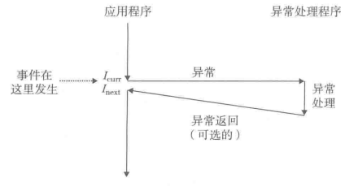

# 常用类

## 格式

1. 不区分大小写
2. 代码块
    ```java
    import java.util.*;
    /**
    *代码块
    *说明语言名-->高亮代码
    */
    ```
     - 汇编 asm 
3. **强调**
4. *斜体*
5. ***斜体并加粗***
6. 连续的空白视为单空格
7. >引用，默认tab
8. 模式
   - $\text{这是公式内使用文本模式}$
9. 指令的作用域分三种
   - 仅作用域其后第一个内容
   - 作用于其后的全部内容，截至到作用域结束
   - 作用于全部作用域
10. 更改颜色
    - <font color=blue>蓝色文字</font>
11. 换行 \
12. $行内公式$
13. $$独行公式$$
14.  \displaystyle
15.  
  
## 控制空格大小
- $x\,y$
- $x\;y$
- $x\ y$
- $x\quad y$
- $x\qquad y$

## 控制颜色
- $\color{gray}{渲染字体}$
- $\colorbox{Turquoise}{渲染背景颜色}$
- $\color{Gray}\colorbox{Turquoise}{同时渲染}$
- $\mathbf{加粗}$

# 通用符号类

## 角标
- 上标^，下标_
  - 连续使用上下标会，上下标垂直$a^2_2$ 

## 括号
- \left \middle \right生成自适应括号
  - $( \big( \Big( \bigg( \Bigg($
- 自适应圆括号
  - 和键盘输入不等价，圆括号会进行自适应
  - $\left(\right)$
  - $\left(\dfrac{1}{2}\right)$
  - $(\dfrac{1}{2})$
- 自适应方括号
  - $\left[\right]$
- 自适应花括号
  - 与圆括号方括号不同，需要在\right后添加\}
  - $\left\{\dfrac{1}{2}\right\}$
- 自适应绝对值
  - $\left|\right|$
- 向下取整
  - $\left\lfloor\dfrac{1}{2}\right\rfloor$
  - 向上取整$\left\lceil\dfrac{1}{2}\right\rceil$
- 单括号，以上符号都适用
  - $\left(\dfrac{1}{2}\right.$
  - $\left.\dfrac{1}{2}\right]$

## 大括号
  
- 条件括号
  - $\begin{cases} 1 \\ 2 \end{cases}$
  - ps:使用&在&处进行对齐，
    - $\begin{cases} 146466513 \text{if}x=0 \\ 2 \text{if}    x=1 \end{cases}$
    - $\begin{cases} 146466513 &\text{if}x=0 \\ 2 &\text{if}  x=1 \end{cases}$
- $\overbrace{这是上括号啦}$
  - $\underbrace{这是下括号哟}$

## 箭头

- $\hat{a}$
- $\uparrow$
- $\downarrow$
- $\Downarrow$
- $\leftarrow$

# 通用数学符号

## 数学格式

- $\because$
- $\therefore$
- 连等并换行
  - $\begin{aligned}
    f(x)&=(x+1)^2 \\ &=x^2+2\times x=1
  \end{aligned}$

## 四则运算、根式、分式

- $\pm$
- $*\cdot\times$
- $/\div$
- $\sqrt{2}$
- $\sqrt[2]{2}$
- $\displaystyle {123 \over 456}$

## 大型运算符

- 大型运算符后使用 _ ^ 生成上下标
  - $\sum_{i=1}^n i$
  - 如果上下标不止一个，使用{}
- $\infty,\text{\o},\text{\O}$
- $\sum$
  - \limits：移至符号之下
  - $\sum _{\substack{0<i<m\cr 0<j<n}}$
  - \substack：垂直布局公式，使用\\换行
  - $\sum \limits_{\substack{0<i<m \\ 0<j<n}}$
- $\log_nm$
- $\prod$
- $\partial x$

## 极限、导数、微分与曲面积分

- 极限
  - $\lim$
    - $\to$
    - $\lim \limits_{x \to a} f(x)$
- 导数
  - $\int$
    - $\iint$
    - $\iiint$
  - $x'$
    - $x''$
    - $x'''$
- 微分
  - $dt  \partial t$
- 曲面积分
  - $\oint$
    - $\oiint$
    - $\oiiint$
- 偏导
  - $\partial$


##  关系运算符

- 比较
  - $\geq$
  - $\leq$
  - $\ngeq$
- 判等
  - $\approx$
  - $\ne$
  - $\equiv$
  - $\not\equiv$

## 几何
- $\perp$
- $\angle$
- $\sphericalangle$
- $\measuredangle$
- $45^\circ$

## 数列

- $1,2,\ldots,n$
- $x_1^2 + x_2^2 + \cdots + x_n^2$

## 模运算
- $a\equiv1\pmod{m}$
- $a\bmod b$

# 学科数学符号

## 离散逻辑运算符

- 全称量词
  - $\forall$
  - $\exists$
  - $\nexists$
- 元素与集合
  - $\in$
  - $\notin$
  - $\not\in$
  - $\ni$
  - $\not\ni$
- 集合与集合
  - $\subset$
    - $\supset$
    - $\subseteq$
    - $\supseteq$
    - $\subsetneq$
    - $\not\subset$
- 集合运算
- $\cup$
  - $\cap$
  - $\setminus$
  - $\bigvee ,\bigwedge,\bigcap,\bigcup,\bigsqcup$
- 约定集合符号
  - $\mathbb{R}$
  - $\mathbb{Z}$
  - $\empty,\varnothing$
- 布尔运算
  - $\bar{a}$
  - 适配长度的非，也就是上划线
    - $\bar{ABC}$
    - $\overline{ABC}$
  - $\lnot$
  - $P\land Q$
  - $P\lor Q$
  - 补集 $\complement P$
- 偏序
  - $\preccurlyeq$
  - $\succcurlyeq$
## 线性代数、矩阵运算

- {}标注需要的矩阵类型
  - $\begin{matrix}a & b \\ c & d
    \end{matrix}$
  - $\begin{pmatrix}a & b \\ c & d
    \end{pmatrix}$
  - $\begin{vmatrix}a & b \\ c & d
    \end{vmatrix}$
  - $\begin{Bmatrix}a & b \\ c & d
    \end{Bmatrix}$
  - $\begin{bmatrix}a & b \\ c & d
    \end{bmatrix}$
- 矢量
  - $\vec{a}$
  - vec不适配长度，适配长度使用arrow
    - $\overrightarrow{AB}$
- ps
  - $\vdots$
  - $\cdots$
# 其他符号

## 希腊字母

- $\alpha$
  - $\beta$
  - $\gamma$
  - $\delta$
- $\epsilon$
- $\zeta$
- $\eta$
  - $\theta$
  - $\lambda$
  - $\mu$
  - $\nu$
- $\xi$
  - $\pi$
  - $\rho$
- $\sigma$
- $\phi$
  - $\omega$
  - $\psi$
  - $\chi$


