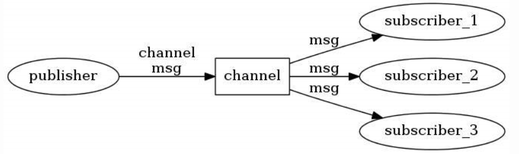

# Redis
## 简介
**高性能**
- 操作内存
- 单线程
- 异步I/O
  
**持久化**
- 快照Snapshotting：将 Redis 内存数据以二进制格式写入磁盘
- 日志追加Append-only file，AOF：追加记录Redis的操作命令来实现持久化

**发布/订阅**：支持发布/订阅模式，可用作消息代理
- 发布者将消息发送到指定的频道，订阅者则可以接收和处理这些消息
- 适用于实时通信、事件驱动系统和消息队列等场景
  
**分布式缓存**
- 主从复制：将数据复制到多个从节点，实现读写分离和数据备份
- 分片：将数据分布在多个 Redis 节点上，实现横向扩展和负载均衡
  
**事务支持**
- 支持将多个操作组合成一个原子性的操作序列
  

## 组成


windows
- redis-server：服务端


- redis-cli: 客户端


- redis-check-dump：RDB 文件修复工具


- redis-check-aof：AOF 文件修复工具


- redis-benchmark：性能测试工具
  - 模拟同时由 N 个客户端发送 M 个 SETs/GETs 查询


- redis.windows.conf： 配置文件


- redis.windows-service.conf：配置文件


# 数据类型


## 字符串（String）

Redis不会解析转码二进制序列

```redis
SET name "redis.com.cn"
GET name
```

## 哈希（Hash）

每个哈希是一个对象，该对象由多个映射组成，每个映射从一个字符串映射到另一个字符串

`HMSET user:1 username ajeet password redis alexa 2000`
- 哈希对象：user:1
- 映射集合：username ajeet、password redis、alexa 2000


`HGETALL user:1`
- 获取名为user:1的哈希对象中的所有映射
- 本命令返回一个列表如下
```redis
1) "username"
2) "ajeet"
3) "password"
4) "redis"
5) "alexa"
6) "2000"
```

命令
| 序号 | 命令                  | 描述                                                                                      |
|------|-----------------------|-------------------------------------------------------------------------------------------|
| 1    | HDEL key field1 [field2] | 删除一个或多个哈希表字段。                                                                |
| 2    | HEXISTS key field       | 查看哈希表 key 中指定字段是否存在。                                                      |
| 3    | HGET key field          | 获取存储在哈希表中指定字段的值。                                                          |
| 4    | HGETALL key             | 获取在哈希表中指定 key 的所有字段和值。                                                   |
| 5    | HINCRBY key field increment | 为哈希表 key 中指定字段的整数值加上增量 increment。                                        |
| 6    | HINCRBYFLOAT key field increment | 为哈希表 key 中指定字段的浮点数值加上增量 increment。                                   |
| 7    | HKEYS key               | 获取哈希表中的所有字段。                                                                  |
| 8    | HLEN key                | 获取哈希表中字段的数量。                                                                  |
| 9    | HMGET key field1 [field2] | 获取所有给定字段的值。                                                                   |
| 10   | HMSET key field1 value1 [field2 value2 ] | 同时将多个 field-value (域-值)对设置到哈希表 key 中。                                |
| 11   | HSET key field value   | 将哈希表 key 中的字段 field 的值设为 value。                                              |
| 12   | HSETNX key field value | 只有在字段 field 不存在时，设置哈希表字段的值。                                           |
| 13   | HVALS key               | 获取哈希表中所有值。                                                                      |
| 14   | HSCAN key cursor [MATCH pattern] [COUNT count] | 迭代哈希表中的键值对。                                                               |


## 列表（List）

字符串列表，按插入顺序排序
- 可添加一个元素到列表的头部或尾部

```redis
LPUSH runoobkey redis
(integer) 1

LPUSH runoobkey mongodb
(integer) 2

LPUSH runoobkey mysql
(integer) 3

LRANGE runoobkey 0 10
1) "mysql"
2) "mongodb"
3) "redis"
```

命令
| 序号 | 命令                                   | 描述                                                                                         |
|------|----------------------------------------|----------------------------------------------------------------------------------------------|
| 1    | BLPOP key1 [key2 ] timeout             | 移出并获取列表的第一个元素，如果列表没有元素会阻塞列表直到等待超时或发现可弹出元素为止。       |
| 2    | BRPOP key1 [key2 ] timeout             | 移出并获取列表的最后一个元素，如果列表没有元素会阻塞列表直到等待超时或发现可弹出元素为止。       |
| 3    | BRPOPLPUSH source destination timeout | 从列表中弹出一个值，将弹出的元素插入到另外一个列表中并返回它；如果列表没有元素会阻塞列表直到等待超时或发现可弹出元素为止。 |
| 4    | LINDEX key index                       | 通过索引获取列表中的元素。                                                                    |
| 5    | LINSERT key BEFORE\|AFTER pivot value | 在列表的元素前或者后插入元素。                                                               |
| 6    | LLEN key                               | 获取列表长度。                                                                               |
| 7    | LPOP key                               | 移出并获取列表的第一个元素。                                                                 |
| 8    | LPUSH key value1 [value2]              | 将一个或多个值插入到列表头部。                                                               |
| 9    | LPUSHX key value                       | 将一个值插入到已存在的列表头部。                                                             |
| 10   | LRANGE key start stop                  | 获取列表指定范围内的元素。                                                                   |
| 11   | LREM key count value                   | 移除列表元素。                                                                               |
| 12   | LSET key index value                   | 通过索引设置列表元素的值。                                                                   |
| 13   | LTRIM key start stop                   | 对一个列表进行修剪(trim)，就是说，让列表只保留指定区间内的元素，不在指定区间之内的元素都将被删除。 |
| 14   | RPOP key                               | 移除列表的最后一个元素，返回值为移除的元素。                                                 |
| 15   | RPOPLPUSH source destination           | 移除列表的最后一个元素，并将该元素添加到另一个列表并返回。                                     |
| 16   | RPUSH key value1 [value2]              | 在列表中添加一个或多个值到列表尾部。                                                         |
| 17   | RPUSHX key value                       | 为已存在的列表添加值。                                                                       |

## 集合（Set）

字符串的无序集合（元素唯一）
- 通过哈希表实现，intset或hashtable作为元素编码
- 底层哈希表，添加，删除，查找的复杂度都是 O(1)


```redis
SADD runoobkey redis
(integer) 1

SADD runoobkey mongodb
(integer) 1

SADD runoobkey mysql
(integer) 1

SADD runoobkey mysql
(integer) 0

SMEMBERS runoobkey
1) "mysql"
2) "mongodb"
3) "redis"
```

命令

| 序号 | 命令                                     | 描述                                                       |
|------|------------------------------------------|------------------------------------------------------------|
| 1    | SADD key member1 [member2]               | 向集合添加一个或多个成员。                                 |
| 2    | SCARD key                                | 获取集合的成员数。                                         |
| 3    | SDIFF key1 [key2]                        | 返回第一个集合与其他集合之间的差异。                       |
| 4    | SDIFFSTORE destination key1 [key2]       | 返回给定所有集合的差集并存储在 destination 中。            |
| 5    | SINTER key1 [key2]                       | 返回给定所有集合的交集。                                   |
| 6    | SINTERSTORE destination key1 [key2]      | 返回给定所有集合的交集并存储在 destination 中。            |
| 7    | SISMEMBER key member                     | 判断 member 元素是否是集合 key 的成员。                   |
| 8    | SMEMBERS key                             | 返回集合中的所有成员。                                     |
| 9    | SMOVE source destination member          | 将 member 元素从 source 集合移动到 destination 集合。      |
| 10   | SPOP key                                 | 移除并返回集合中的一个随机元素。                           |
| 11   | SRANDMEMBER key [count]                  | 返回集合中一个或多个随机数。                               |
| 12   | SREM key member1 [member2]               | 移除集合中一个或多个成员。                                 |
| 13   | SUNION key1 [key2]                       | 返回所有给定集合的并集。                                   |
| 14   | SUNIONSTORE destination key1 [key2]      | 所有给定集合的并集存储在 destination 集合中。             |
| 15   | SSCAN key cursor [MATCH pattern] [COUNT count] | 迭代集合中的元素。                                    |
## 有序集合（Sorted Set）

顺序可重复集合，每个元素关联一个分数

**例子：**

```redis

ZADD runoobkey 1 redis
(integer) 1

ZADD runoobkey 2 mongodb
(integer) 1

ZADD runoobkey 3 mysql
(integer) 1

ZADD runoobkey 3 mysql
(integer) 0

ZADD runoobkey 4 mysql
(integer) 0

ZRANGE runoobkey 0 10 WITHSCORES
1) "redis"
2) "1"
3) "mongodb"
4) "2"
5) "mysql"
6) "4"
```

命令
| 序号 | 命令                                            | 描述                                                                                    |
|------|-------------------------------------------------|-----------------------------------------------------------------------------------------|
| 1    | ZADD key score1 member1 [score2 member2]        | 向有序集合添加一个或多个成员，或者更新已存在成员的分数。                                 |
| 2    | ZCARD key                                       | 获取有序集合的成员数。                                                                    |
| 3    | ZCOUNT key min max                              | 计算在有序集合中指定区间分数的成员数。                                                    |
| 4    | ZINCRBY key increment member                    | 有序集合中对指定成员的分数加上增量 increment。                                            |
| 5    | ZINTERSTORE destination numkeys key [key ...]   | 计算给定的一个或多个有序集的交集并将结果集存储在新的有序集合 destination 中。            |
| 6    | ZLEXCOUNT key min max                           | 在有序集合中计算指定字典区间内成员数量。                                                  |
| 7    | ZRANGE key start stop [WITHSCORES]              | 通过索引区间返回有序集合指定区间内的成员。                                                |
| 8    | ZRANGEBYLEX key min max [LIMIT offset count]    | 通过字典区间返回有序集合的成员。                                                          |
| 9    | ZRANGEBYSCORE key min max [WITHSCORES] [LIMIT]  | 通过分数返回有序集合指定区间内的成员。                                                    |
| 10   | ZRANK key member                                | 返回有序集合中指定成员的索引。                                                            |
| 11   | ZREM key member [member ...]                    | 移除有序集合中的一个或多个成员。                                                          |
| 12   | ZREMRANGEBYLEX key min max                      | 移除有序集合中给定的字典区间的所有成员。                                                  |
| 13   | ZREMRANGEBYRANK key start stop                  | 移除有序集合中给定的排名区间的所有成员。                                                  |
| 14   | ZREMRANGEBYSCORE key min max                    | 移除有序集合中给定的分数区间的所有成员。                                                  |
| 15   | ZREVRANGE key start stop [WITHSCORES]           | 返回有序集中指定区间内的成员，通过索引，分数从高到低。                                    |
| 16   | ZREVRANGEBYSCORE key max min [WITHSCORES]       | 返回有序集中指定分数区间内的成员，分数从高到低排序。                                      |
| 17   | ZREVRANK key member                            | 返回有序集合中指定成员的排名，有序集成员按分数值递减(从大到小)排序。                      |
| 18   | ZSCORE key member                              | 返回有序集中，成员的分数值。                                                              |
| 19   | ZUNIONSTORE destination numkeys key [key ...]   | 计算给定的一个或多个有序集的并集，并存储在新的 key 中。                                  |
| 20   | ZSCAN key cursor [MATCH pattern] [COUNT count]  | 迭代有序集合中的元素（包括元素成员和元素分值）。                                         |


## 基数统计（HyperLogLogs）

统计个数，不保存数据内容，只统计数据对象的个数，占用存储空间固定为12kb，误差在0.8%左右，使用的可能场景
- 统计注册 IP 数

- 统计每日访问 IP 数

- 统计页面实时 UV 数

- 统计在线用户数

- 统计用户每天搜索不同词条的个数

**例子：**

```redis
PFADD unique::ip::counter '192.168.0.1'
PFADD unique::ip::counter '127.0.0.1'
PFADD unique::ip::counter '255.255.255.255'
PFCOUNT unique::ip::counter
```

命令
| 序号 | 命令                                | 描述                               |
|------|-------------------------------------|------------------------------------|
| 1    | PFADD key element [element ...]     | 添加指定元素到 HyperLogLog 中。     |
| 2    | PFCOUNT key [key ...]               | 返回给定 HyperLogLog 的基数估算值。 |
| 3    | PFMERGE destkey sourcekey [sourcekey ...] | 将多个 HyperLogLog 合并为一个 HyperLogLog。 |


# 发布订阅


- 发布者和订阅者都是 Redis 客户端
- Channel属于Redis服务器端

缺点
- 订阅动作单线程阻塞，因此需要客户端另起线程
- 服务器挂掉后，消息不会持久化
- 用户挂掉后，掉线后的消息会彻底消失

命令

| 序号 | 命令                                     | 描述                                        |
|------|------------------------------------------|---------------------------------------------|
| 1    | PSUBSCRIBE pattern [pattern ...]         | 订阅一个或多个符合给定模式的频道。            |
| 2    | PUBSUB subcommand [argument [argument ...]] | 查看订阅与发布系统状态。                     |
| 3    | PUBLISH channel message                  | 将信息发送到指定的频道。                     |
| 4    | PUNSUBSCRIBE [pattern [pattern ...]]      | 退订所有给定模式的频道。                     |
| 5    | SUBSCRIBE channel [channel ...]           | 订阅给定的一个或多个频道的信息。             |
| 6    | UNSUBSCRIBE [channel [channel ...]]       | 指退订给定的频道。                          |


# 事务


`MULTI`标记一个事务块的开始，`EXEC`将执行所有事务块内的命令
- 放入事务块中的命令将被放入队列缓存，而不是立即执行
- 在事务执行过程，其他客户端提交的命令请求不会插入到事务执行命令序列中

原子性
- Redisd仅保证单个命令是原子性的
- 事务块没有原子性保证，仅仅是一个打包的批量执行脚本，中间某条指令的失败既不会导致前面已做指令回滚，也不会造成后续的指令不做


`DISCARD`：放弃执行事务块内的所有命令


# 脚本

内嵌支持 Lua 解释器环境


# 连接

| 序号 | 命令              | 描述                 |
|------|-------------------|----------------------|
| 1    | AUTH password     | 验证密码是否正确     |
| 2    | ECHO message      | 打印字符串           |
| 3    | PING              | 查看服务是否运行     |
| 4    | QUIT              | 关闭当前连接         |
| 5    | SELECT index      | 切换到指定的数据库   |


# 服务器

# Stream

Stream主要用于消息队列MQ/Message Queue
- 发布订阅pub/sub实现消息队列时，只能分发，无法持久化
- Stream 提供消息持久化和主备复制功能
  - 服务器允许任何客户端访问任何时刻的数据
  - 服务器能记住每个客户端的访问位置，保证消息不丢失。

Redis Stream结构
- 
- 每个消息关联唯一的ID
- Consumer Group消费组：使用 `XGROUP CREATE` 命令创建，一个消费组有多个消费者Consumer
- last_delivered_id 游标：每个消费组管关联一个游标，任意一个消费者读取消息都会使游标往前移动
- pending_ids ：每个消费者关联一个pending_ids，记录当前已经被客户端读取，但是还没有ack /Acknowledge character的消息