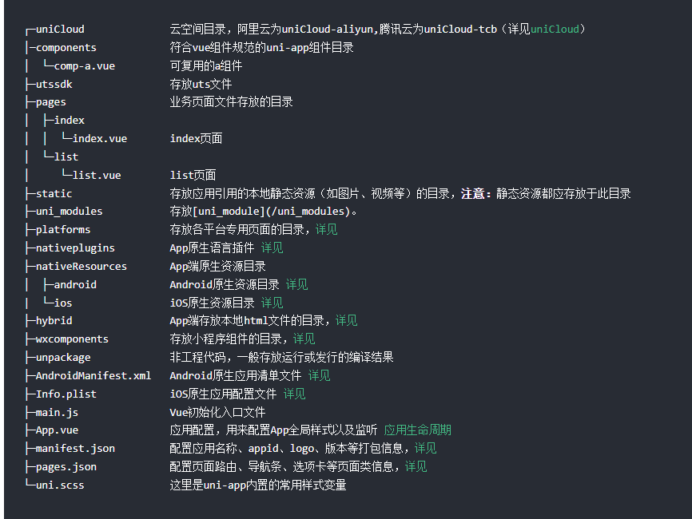
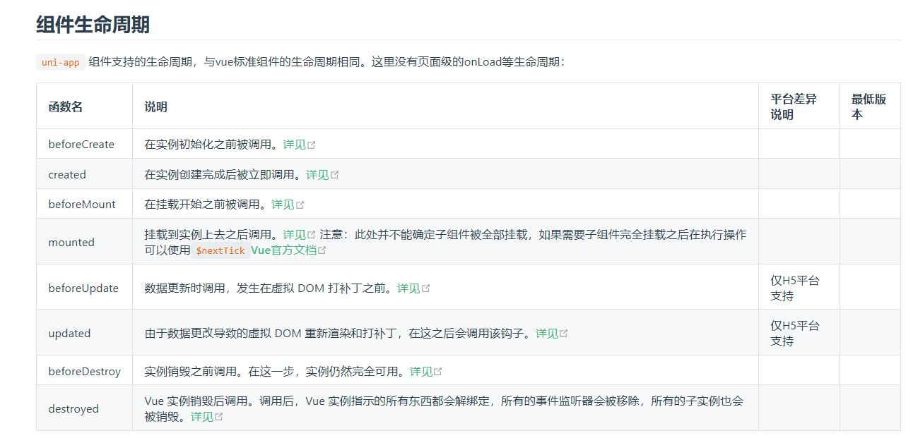
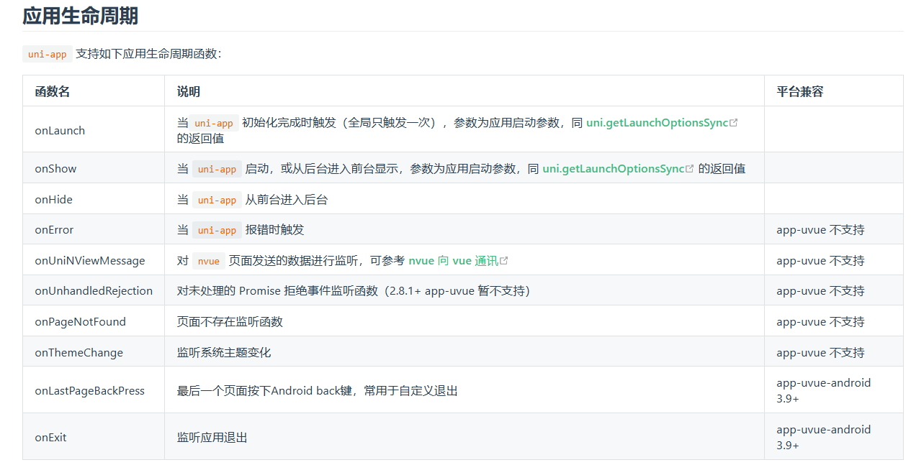

# HTML

## 标签

- `<div> `：块级容器
- `<span>`：内联容器

# CSS

## 选择器

```CSS
/* 在当前文档中选取id为idname的元素 */
#idname
```
# Js

## 函数
### 参数 & 变量 & 方法

- Js中唯一能够分割词法作用域的手段就是使用function包裹对象和变量
  - 花括号不能分割作用域；
  - 嵌套的词法作用域：受益于变量提升，外部作用域无法访问内部作用域，内部作用域却可访问外部作用域
  - 变量提升指声明提升到词法作用域的顶部，但是初始化却并未提升，所以先使用再初始化会导致undefined
- 全局作用域：定义在function之外的变量
  - 将一个脚本文件绑定到一个变量中，该变量等价于命名空间
- 将函数绑定到对象成为方法
  - 每个函数都有一个变量this，指向调用对象
  - 如果函数不通过对象进行调用，this就无法初始化，会被初始化为window，在严格模式下初始化为undefined
### 箭头函数

- 若函数体只有一条语句，则省略return和{}花括号，该语句的值作为return
```JS
x => x * x

function (x) {
    return x * x;
}
```
- 若语句有多条则不能省略花括号和return语句
```JS
x => {
    if (x > 0) {
        return x * x;
    }
    else {
        return - x * x;
    }
}
```
- 若参数不止一个或无参数则不能省略()

```js
(x, y) => x * x + y * y

// 无参数:
() => 3.14

// 可变参数:
(x, y, ...rest) => {
    var i, sum = x + y;
    for (i=0; i<rest.length; i++) {
        sum += rest[i];
    }
    return sum;
}
```
- 返回对象需要用{}声明，与箭头函数的{}冲突，所以在{}外还要用()进行包裹
```js
//报错
x => { foo: x }

//正确的返回
x => ({ foo: x })
```
- 箭头函数没有自己的this，总是继承词法作用域的this，也就是外层调用者obj
  - 普通函数总是有自己的this，只能通过调用者来初始化
  - 非严格模式下，不通过对象调用函数时，无法初始化this，因为this将初始化为window
  - 严格模式下，不通过对象调用函数时，this将初始化为undefined

```js
var obj = {
    birth: 1990,
    getAge: function () {
        var b = this.birth; // 1990
        var fn = () => new Date().getFullYear() - this.birth; // this指向obj对象
        return fn();
    }
};
obj.getAge(); // 25

//考虑将上述箭头函数替换为匿名类
var obj = {
    birth: 1990,
    getAge: function () {
        var b = this.birth; // 1990
        var fn = function () {
            return new Date().getFullYear() - this.birth; // this指向window或undefined
        };
        return fn();
    }
};
```

## Ajax

- Ajax：Asynchronous JavaScript and XML，JavaScript执行异步网络请求
  - 依靠XMLHttpRequest对象执行异步AJAX请求
  - 对XMLHttpRequest对象的onreadystatechange属性赋值回调函数，通过回调函数获取响应数据
  - 每次readyState发生变化时都会调用一次onreadystatechange引用的回调函数
  - 一个XMLHttpRequest对象一次open一个报文，然后send一次报文
    - open函数的第三个参数默认true，因此不需要传入第三个参数，如果设置为false将会取消异步
  - send
    - Get报文不需要参数
    - Post报文需要以字符串或者FormData对象
```js
function success(text) {...}
function fail(code) {...}

var request = new XMLHttpRequest();

request.onreadystatechange = ()=>{
  if (request.readyState === 4) {
    if (request.status === 200) {
      return success(request.responseText);
    } else {
      return fail(request.status);
    }
  }//若非4，则可以渲染等待动画
}

request.open('GET', '/api/categories');
request.send();
```

- XMLHttpRequest对象的readyState属性表示请求的状态

```js
0 (UNSENT)//请求未初始化。open 方法还没有被调用。
1 (OPENED)//请求已初始化。open 方法已经被调用。
2 (HEADERS_RECEIVED)//请求已接收到头部信息。send 方法已经被调用，并且头部和状态已经可获得。
3 (LOADING)//请求正在接收响应体。responseText 中已经获得部分数据。
4 (DONE)//请求已完成。整个请求过程已经完毕。
```
 
- promise
  - 以事件驱动为基础，通过状态转移、回调函数实现事件的交替执行，模拟并发操作
  - promise的状态：Pending、Fulfilled、Rejected
    - 该状态是由promise中一个不可变的、未向外界暴露的变量记录的
  - 构造函数
    - 初始化状态为Pending，并立即执行传入的函数对象
      - 若该函数对象定义其它异步事件，将发生事件转移
      - 该函数对象等待异步事件返回控制权
    - 如果调用resolve且Promise的状态为Pending，将该Promise的状态更改为Fulfilled
      - resolve方法的参数将会传递给下一个then方法的onFulfilled函数
      - 再次调用resolve或者reject是无效的
    - 如果调用reject且Promise的状态为Pending，将该Promise的状态更改为Rejected
      - reject方法的参数将会传递给下一个catch方法的onRejected函数
      - 再次调用resolve或者reject是无效的
  - promise的含义：
    - 承诺一旦状态为Fulfilled或者Rejected就不再更改
    - 承诺在将来一定会根据状态调用提供的回调函数
  - promise.then方法
    - 第一个参数是onFulfilled方法，当promise的状态为fulfilled时调用，捕捉该promise携带的参数（此处未深究，只是便于记忆的一种理解方式），这个参数可能是resolve的参数，也可能是上一个catch或then返回的非Error变量
    - 第二个参数是onRejected方法，当promise的状态为rejected时调用onRejected方法，一般不传入第二个参数，使用默认函数创建一个相同的promise对象并返回（会同时携带相同的变量信息）
  - promise.catch方法
    - 当promise的状态是rejected时，将调用catch的回调函数（catch只有一个参数），不传入函数等价于传入空函数
  - catch或then方法中的return语句
    - 当catch或then方法中return一个非Error对象的变量时，返回的promise对象将会被设置为fulfilled状态，并携带该变量
    - 当catch或then方法中return一个Error对象的变量时，返回的promise对象将被设置为rejected状态，并携带Error对象
    - 当catch或then方法中没有return时，按照js函数约定，将会返回一个undefined的promise值
```js

'use strict'
new Promise(function (resolve, reject) {
    resolve("data");
})
.then(function (r) {{console.log(r)};throw new Error("s");})
.then(function(r){console.log("1"+r)})
.catch(function (reason) {console.log("2"+reason)});

```
- 使用promise执行http请求

```js
'use strict';
function ajax(method, url, data) {
    var request = new XMLHttpRequest();
    return new Promise((resolve, reject)=>{
        request.onreadystatechange = ()=>{
            if (request.readyState === 4) {
                if (request.status === 200)
                    resolve(request.data);
                else
                    reject(request.status);
            }
        };
        request.open(method, url);
        request.send(data);
    });
}
ajax('GET', '/').then((data)=>{}).catch((status)=>{});
```

- 使用Fetch发送Get报文
```js
'use strict';
fetch('/')
  .then(response => {
    if (!response.ok) {
      throw new Error('1');
    }
    return response.json();
  })
  .then(data => {})
  .catch(error => {});
```
- 使用Fetch发送Post报文
```JS

const requestOptions = {
  method: 'POST',
  headers: {
    'Content-Type': ''
  },
  body: ''
};

fetch('/', requestOptions)
  .then(response => {
    if (!response.ok) {
      throw new Error('1');
    }
    return response.json();
  })
  .then(data => {})
  .catch(error => {});

```
- promise将执行代码和处理结果划分为两个事件，因此promise可以做到更多的事情
  - 注意then-catch链本身是串行的，因此可以执行串行任务
    - `job1.then(job2).then(job3).catch(handleError);`
    - 只要某个任务失败，后面的任务不再执行，直接转到错误处理
  - promise执行并行任务

```js
Promise.all([
  fetch('/'),
  fetch('/', requestOptions)
])
  .then(responses => {
    // responses 是一个包含两个响应对象的数组
    return Promise.all(responses.map(response => response.json()));
  })
  .then(dataArray => {
    // dataArray 是一个包含两个响应数据的数组
    const data1 = dataArray[0];
    const data2 = dataArray[1];
    // 处理响应数据
    console.log('Data from URL 1:', data1);
    console.log('Data from URL 2:', data2);
  })
  .catch(error => {
    // 处理错误
    console.error('There was a problem with the fetch operation:', error);
  });
```


# Vue
## 核心

- 框架

```bash
# 全局安装 Vue CLI
# --g/-g->将VueCLI安装到系统的全局环境，在命令行的任何位置使用 vue 命令
cnpm install --g vue-cli

vue --version

# 可视化项目管理工具：运行项目、打包项目，检查等操作，避免命令
# 创建空文件夹，以管理员打开命令行，运行下述命令，作为管理工具的运行环境
# 路由管理和状态管理使用Vue提供的依赖模块
# 创建完成后，依赖包括ECMAScript标准实现core-js、vue框架、vue-router路由管理、vuex状态管理:
vue ui
```

- 项目结构


```python
README.md             # 项目介绍
index.html            # 入口页面
build                 # 构建脚本目录
    build-server.js          # 运行本地构建服务器，可以访问构建后的页面
    build.js                # 生产环境构建脚本
    dev-client.js           # 开发服务器热重载脚本，主要用来实现开发阶段的页面自动刷新
    dev-server.js           # 运行本地开发服务器
    utils.js                # 构建相关工具方法
    webpack.base.conf.js    # wabpack基础配置
    webpack.dev.conf.js     # wabpack开发环境配置
    webpack.prod.conf.js    # wabpack生产环境配置
config                # 项目配置
    dev.env.js              # 开发环境变量
    index.js                # 项目配置文件
    prod.env.js             # 生产环境变量
    test.env.js             # 测试环境变量
mock                  # mock数据目录
    hello.js
package.json          # npm包配置文件，里面定义了项目的npm脚本，依赖包等信息
src                   # 源码目录 
    main.js                # 入口js文件
    app.vue                # 根组件
    components            # 公共组件目录
        title.vue
    assets                # 资源目录，这里的资源会被wabpack构建
        images
            logo.png
    routes                # 前端路由
        index.js
    store                 # 应用级数据（state）状态管理
        index.js
    views                 # 页面目录
        hello.vue
        notfound.vue
static                # 纯静态资源，不会被wabpack构建。
test                  # 测试文件目录（unit&e2e）
    unit               # 单元测试
        index.js             # 入口脚本
        karma.conf.js         # karma配置文件
        specs                # 单测case目录
            Hello.spec.js
```

## main.js

- main.js的职责：作为Vue.js项目的入口文件，负责初始化项目的基本配置、创建根实例，以及引入和配置全局资源和插件

```js
// 导入核心库
import Vue from 'vue'
// 导入自定义的根组件
import App from './App.vue'
// 导入已经创建好的vue-router
// 通常在router文件夹中定义index.js，在该js文件中定义vue-router模块的实例router
import router from './router'
// 导入vuestore状态管理
import store from './store'
// 导入elementui
import Element from 'element-ui'
// 导入elementui的样式表
import "element-ui/lib/theme-chalk/index.css"

// 导入axios，基于promise的http请求
import axios from 'axios'
// 导入 mavon-editor（Markdown 编辑器）和样式
import mavonEditor from 'mavon-editor'
import 'mavon-editor/dist/css/index.css'

// 导入自定义配置文件：axios配置和权限配置
import "./axios"
import "./permission"

Vue.use(Element)
Vue.use(mavonEditor)
// 关闭生产提示
Vue.config.productionTip = false
Vue.prototype.$axios = axios

创建Vue实例，配置路由和状态管理
new Vue({
    router,
    store,
    // 渲染根组件App
    render: h => h(App)
}).$mount('#app')
//将Vue实例挂载到id为app的html元素上
// 搜索范围是本文件和import的模块
// 通常在./App.vue文件中定义app名字的html元素

```

- App.vue
  - Vue实例作为管理框架，负责挂载到 DOM、数据管理、事件处理、生命周期钩子等职责
  - Vue 实例已经通过render选项将App.vue渲染到实际的Dom元素
  - 该Dom元素将作为根组件实现单页面应用，并由路由负责在该单页面中刷新
  - App.vue 中可能会包含一些局部组件、样式、过渡效果等，它负责应用程序整体的外观和布局。

```html
<template>
  <div id="app">
    <router-view/>
  </div>
</template>

<style>
  #app {
    max-width: 960px;
    margin: 0 auto;
  }
</style>

```
## vue-router

- vue-router在默认情况下使用哈希模式
  - 表现为URL中带有#：`http://example.com/#/some/path`
- vue-router使用history模式
  - 表现为URL去掉#
- 约定目录：router/index.js代表vue项目的路由配置文件
```JS
//从vue-router包导入createRouter、createWebHistory函数
//首先从当前目录寻找vue-router模块或vue-router.js文件
//然后再沿上级目录依次寻找，直到到达根目录
//最后再是node_modules中查找
import { createRouter, createWebHistory } from 'vue-router'
//导入vue单文件组件..代表从当前文件所在目录的父目录开始查找/views/HomeView.vue
import HomeView from '../views/HomeView.vue'

// 约定routes是路由配置数组
//path：路由的路径
//name：路由的名称：用于在程序中引用该路由
//component：与路由相关联的vue单文件组件
const routes = [
  {
    path: '/',
    name: 'home',
    component: HomeView
  },
  {
    path: '/about',
    name: 'about',
    component: () => import('../views/AboutView.vue')
  }
]

// createRouter：创建vue-router实例
/*createWebHistor：
        创建基于HTML5 History模式的路由历史记录管理
        在浏览器中使用 pushState 和 popstate 事件
        如果你使用 "history" 模式，这个方法将用于创建路由的 history 对象*/
/*process.env.BASE_URL
        在不同环境中设置基础 URL 的环境变量
        在开发环境和生产环境中，它将自动由 Vue CLI 设置*/
const router = createRouter({
  history: createWebHistory(process.env.BASE_URL),
  routes
})

//该router将用于main.js初始化Vue实例
export default router

```

- 懒加载
- 权限控制
```js
{
    path: '/blog/add',
    name: 'BlogAdd',
    component: BlogEdit,
    meta: {
      requireAuth: true
    }
  },
```

- 路由的导航守卫

```js
import router from "./router";

// 使用 beforeEach 方法定义了全局前置守卫。这个守卫会在每次路由切换之前执行
router.beforeEach((to, from, next) => {

  if (to.matched.some(record => record.meta.requireAuth)) { // 判断该路由是否需要登录权限

    const token = localStorage.getItem("token")
    console.log("------------" + token)

    if (token) { // 判断当前的token是否存在 ； 登录存入的token
      if (to.path === '/login') {

      } else {
        next()
      }
    } else {
      next({
        path: '/login'
      })
    }
  } else {
    next()
  }
})
```
## views

- .vue
  - 该后缀表示vue单文件组件：将一个组件的模板、样式和逻辑都放在同一个文件中

```html
<!-- 模板 -->
<template>

<!-- 逻辑 -->
<script></script>
<!-- 样式 -->
<style>
```

## vuex

```JS
import Vue from 'vue'
import Vuex from 'vuex'

Vue.use(Vuex)

// 通过 new Vuex.Store({ /* options */ }) 创建了一个 Vuex 的实
export default new Vuex.Store({
  state: {
    token: '',
    userInfo: JSON.parse(sessionStorage.getItem("userInfo"))
  },
  mutations: {
    // set
    SET_TOKEN: (state, token) => {
      state.token = token
      localStorage.setItem("token", token)
    },
    SET_USERINFO: (state, userInfo) => {
      state.userInfo = userInfo
      sessionStorage.setItem("userInfo", JSON.stringify(userInfo))
    },
    REMOVE_INFO: (state) => {
      state.token = ''
      state.userInfo = {}
      localStorage.setItem("token", '')
      sessionStorage.setItem("userInfo", JSON.stringify(''))
    }

  },
  getters: {
    // get
    getUser: state => {
      return state.userInfo
    }

  },
  actions: {
  },
  modules: {
  }
})

```

# Node.js

```bash
node -v
npm -v
```
## npm

- npm：`Node.js `生态系统的一部分
  - package.json 文件：定义项目的依赖关系和其他配置信息
  - 在node_modules目录中安装、卸载、更新和管理项目所需的依赖模块，并且修改package.json文件中的依赖关系
  - 在package.json所在目录运行npm命令，将会修改package.json 文件并且管理node_modules目录中的js依赖模块
- package.json

```json
{
  "name": "vueblog-vue",
  "version": "0.1.0",
  "private": true,
  "scripts": {
    "serve": "vue-cli-service serve",
    "build": "vue-cli-service build"
  },
  "dependencies": {
    "core-js": "^3.8.3",
    "element-ui": "^2.15.14",
    "vue": "^3.2.13",
    "vue-router": "^4.0.3",
    "vuex": "^4.0.0"
  },
  "devDependencies": {
    "@vue/cli-plugin-babel": "~5.0.0",
    "@vue/cli-plugin-router": "~5.0.0",
    "@vue/cli-plugin-vuex": "~5.0.0",
    "@vue/cli-service": "~5.0.0"
  },
  "browserslist": [
    "> 1%",
    "last 2 versions",
    "not dead",
    "not ie 11"
  ]
}


```

## 模块

- Node.js加载模块中的js文件，将该js文件包装在function中，事先准备全局变量module
  - 如果js文件的末尾准备了如下语句：`exports.createRouter = createRouter;`
  - 等价于在module的exports数组中添加键值对createRouter：createRouter
  - 这样既可以确保每个模块之间互不干扰（因为每个js文件都变成了匿名函数的局部变量）
  - 又能通过真正的全局变量module传递函数引用，同时这些函数引用依赖于各自js文件状态
  - ps：加载js是通过load进行的，未深入学习
```JS
// 从vue-router模块导入createRouter和createWebHistory方法
import { createRouter, createWebHistory } from 'vue-router'

//之所以可以从该模块导入这两个方法，是因为在vue-router模块的某个js文件的末尾暴露了这两个方法
exports.createRouter = createRouter;
exports.createWebHistory = createWebHistory;

//上述暴露方法的方法等价于
module.exports = {
    hello: hello,
    greet: greet
};
//但是推荐第一种
//ps：直接对exports赋值将报错
```

- 懒加载
  - 上述方式是静态导入，import是一个关键字
  - 动态导入是一个函数，参数是导入模块的路径，返回值是一个promise对象，所以直接使用箭头函数将返回的promise对象赋值给component属性作为路由的一部分
```js
/**/
import HomeView from '../views/HomeView.vue'
import('../views/AboutView.vue')
```


## Element UI

- 基于Vue框架的插件
```bash

cnpm install element-ui --save

```
- 在main.js中引入element-ui模块，并通过Vue.use注册插件

```js
import App from './App.vue'
import Element from 'element-ui'
import "element-ui/lib/theme-chalk/index.css"
Vue.use(Element)
```


install: 是 npm 和 cnpm 的安装命令，用于安装 Node.js 包。

element-ui: 是要安装的包的名称，这里是 Element UI，一个基于 Vue.js 的 UI 组件库。

--save: 是一个旧的 npm 参数，它告诉 npm 将包的信息添加到你的 package.json 文件中的 dependencies 部分，确保你的项目可以在其他地方重新构建时使用正确的版本。

因此，运行这个命令后，Element UI 将被下载并安装到你的项目中，并且相关的信息将被添加到你的 package.json 文件中。你就可以在你的 Vue 项目中使用 Element UI 的组件和功能了。


## axios
- Axios 是一个基于 promise 网络请求库，作用于node.js 和浏览器中
  - 它是 isomorphic 的(即同一套代码可以运行在浏览器和node.js中)
  - 在服务端它使用原生 node.js http 模块,
  - 在客户端 (浏览端) 则使用 XMLHttpRequests。
```bash
npm install axios
 yarn add axios
```

- 用例

```js
const axios = require('axios').default

// 向给定ID的用户发起请求
axios.get('/user?ID=12345')
  .then(function (response) {
    // 处理成功情况
    console.log(response);
  })
  .catch(function (error) {
    // 处理错误情况
    console.log(error);
  })
  .finally(function () {
    // 总是会执行
  });
// 上述请求也可以按以下方式完成（可选）
axios.get('/user', {
    params: {
      ID: 12345
    }
  })
  .then(function (response) {
    console.log(response);
  })
  .catch(function (error) {
    console.log(error);
  })
  .finally(function () {
    // 总是会执行
  });  

// 支持async/await用法
async function getUser() {
  try {
    const response = await axios.get('/user?ID=12345');
    console.log(response);
  } catch (error) {
    console.error(error);
  }
}
//Post请求
axios.post('/user', {
    firstName: 'Fred',
    lastName: 'Flintstone'
  })
  .then(function (response) {
    console.log(response);
  })
  .catch(function (error) {
    console.log(error);
  });

//发起多个并行请求
function getUserAccount() {
  return axios.get('/user/12345');
}

function getUserPermissions() {
  return axios.get('/user/12345/permissions');
}

const [acct, perm] = await Promise.all([getUserAccount(), getUserPermissions()]);

// OR

Promise.all([getUserAccount(), getUserPermissions()])
.then(function ([acct, perm]) {});


// 将 HTML Form 转换成 JSON 进行请求

const {data} = await axios.post('/user', document.querySelector('#my-form'), {
  headers: {
    'Content-Type': 'application/json'
  }
})


// Multipart (multipart/form-data)
const {data} = await axios.post('https://httpbin.org/post', {
    firstName: 'Fred',
    lastName: 'Flintstone',
    orders: [1, 2, 3],
    photo: document.querySelector('#fileInput').files
  }, {
    headers: {
      'Content-Type': 'multipart/form-data'
    }
  }
)


// URL encoded form (application/x-www-form-urlencoded)
const {data} = await axios.post('https://httpbin.org/post', {
    firstName: 'Fred',
    lastName: 'Flintstone',
    orders: [1, 2, 3]
  }, {
    headers: {
      'Content-Type': 'application/x-www-form-urlencoded'
    }
})
```
## 文本编辑器
### mavon-editor
### markdown-it
### github-markdown-css


# Uniapp

- Uniapp是使用 Vue.js 开发所有前端应用的框架
- 快速上手
  - 通过HBuilderX（框架开发者提供的IDE：内置相关环境），选择 uni ui项目模板（内置大量常用组件）创建工程
  - 由框架负责将源码编译到不同的平台：手机或模拟器、H5、各种小程序
  - 发布时也可打包为不同的平台
  - 编译后包在unpackage目录下
  - 各大公司因商业利益造成标准的不同
- uni-app 基于Vue 2.0实现
  - uni-app 将数据绑定功能委托给Vue
    - `<view v-bind:id="'item-' + id "></view>	`
  - 统一使用uni提供的api
  - tag：统一使用uni提供的tag
  - css：flex布局模型，rpx单位
  - 工程目录
    - 将每个vue组件放在同名目录下，所有目录放在pages目录下
    - 自定义组件-component目录，自定义组件请加上前缀
    - 静态资源：static目录下
    - pages.json配置每个页面的原生title，首页支持使用原生底部tab
- 组件：uni内置组件+扩展组件
  - 
  - 只支持web的组件是因为包含了对dom的操作
  - 全端组件不包括dom操作，而且支持双向绑定
  - 其中成套的全端兼容ui库包括：
    - uViewUI：组件丰富、文档清晰，支持nvue
    - colorUI css库：颜值很高，css库而非组件
    - unify UI：全端支持的组件库，侧重nvue
    - mypUI：全端支持的组件库，侧重nvue
    - ThorUI组件库
    - graceUI商业库
    - nPro全端nvue组件与模版库：云端一体、nvue优质商业库https://ext.dcloud.net.cn/plugin?id=5169
    - first UI：分开源版和商业版
    - 图鸟UI：高颜值UI库
    - s-ui
## 工程结构

- 
- static目录会全部打包
- 非 static 目录下的文件（vue组件、js、css 等）只有被引用时，才会被打包编译
- css、less/scss 等资源不要放在 static 目录下，建议这些公用的资源放在自建的 common 目录下。
## VUE

### export default 外的代码
  - 写在 export default {} 外面的代码，一般有几种情况：
  - 引入第三方 js/ts 模块
  - 引入非 easycom 的组件（一般组件推荐使用easycom，无需导入注册）
  - 在 ts/uts 中，对 data 进行类型定义
  - 定义作用域更大的变量
开发者应谨慎编写 export default {} 外面的代码，这里的代码有2个注意事项：

影响应用性能。这部分代码在应用启动时执行，而不是页面加载。如果这里的代码写的太复杂，会影响应用启动速度，占用更多内存。
不跟随组件、页面关闭而回收。在外层的静态变量不会跟随页面关闭而回收。如果必要你需要手动处理。比如 beforeDestroy 或 destroyed 生命周期进行处理

```html
<script lang="ts">
	const TAB_OFFSET = 1; // 外层静态变量不会跟随页面关闭而回收
	import charts from 'charts.ts'; // 导入外部js/ts模块
	import swiperPage from 'swiper-page.vue'; //导入非easycom的组件
	type GroupType = {
		id : number,
		title : string
	} // 在ts中，为下面data数据的 groupList 定义类型
	export default {
		components: {
		    swiperPage
		}, // 注册非easycom组件
		data() {
			return {
				groupList: [
					{ id: 1, title: "第一组" },
					{ id: 2, title: "第二组" },
				] as GroupType[], // 为数据groupList定义ts类型
			}
		},
		onLoad() {},
		methods: {}
	}
</script>

```

### export default {} 里
https://uniapp.dcloud.net.cn/tutorial/page.html
是页面的主要逻辑代码。包括几部分：

data：template模板中需要使用的数据。具体 另见
页面生命周期：如页面加载、隐藏、关闭，具体 见下
methods方法，如按钮点击、屏幕滚动

```html
<template>
	<view>
		<button @click="buttonClick">{{title}}</button>
	</view>
</template>

<script>
	export default {
		data() {
			return {
				title: "点我", // 定义绑定在页面上的data数据
				// 多个data在这里继续定义。逗号分隔
			}
		},
		onLoad() {
			// 页面启动的生命周期，这里编写页面加载时的逻辑
		},
		// 多个页面生命周期监听，在这里继续写。逗号分隔
		methods: {
			buttonClick: function () {
				this.title = "被点了"
			},
			// 多个方法，在这里继续写。逗号分隔
		}
	}
</script>
```
### 页面周期

- 优化白屏的方法：
页面dom太多，注意有的组件写的不好，会拖累整体页面。uni-app x 里减少dom数量的策略，详见
联网不要在onReady里，那样太慢了，在onLoad里早点联网
在pages.json里配置原生导航栏和背景色
有的页面template内容非常少，整页就是一个需要联网加载的列表，这会造成虽然首批dom飞快渲染了，但页面其实还是白的，联网后才能显示字和图。 此时需要在template里做一些简单占位组件，比如loading组件、骨架屏，让本地先显示一些内容。

页面加载时序介绍
接下来我们介绍onLoad、onReady、onShow的先后关系，页面加载的详细流程。

uni-app框架，首先根据pages.json的配置，创建页面
所以原生导航栏是最快显示的。页面背景色也应该在这里配置。

根据页面template里的组件，创建dom。
这里的dom创建仅包含第一批处理的静态dom。对于通过js/uts更新data然后通过v-for再创建的列表数据，不在第一批处理。

要注意一个页面静态dom元素过多，会影响页面加载速度。在uni-app x Android版本上，可能会阻碍页面进入的转场动画。 因为此时，页面转场动画还没有启动。

触发onLoad
此时页面还未显示，没有开始进入的转场动画，页面dom还不存在。

所以这里不能直接操作dom（可以修改data，因为vue框架会等待dom准备后再更新界面）；在 app-uvue 中获取当前的activity拿到的是老页面的activity，只能通过页面栈获取activity。

onLoad比较适合的操作是：接受上页的参数，联网取数据，更新data。

手机都是多核的，uni.request或云开发联网，在子线程运行，不会干扰UI线程的入场动画，并行处理可以更快的拿到数据、渲染界面。

但onLoad里不适合进行大量同步耗时运算，因为此时转场动画还没开始。

尤其uni-app x 在 Android上，onLoad里的代码（除了联网和加载图片）默认是在UI线程运行的，大量同步耗时计算很容易卡住页面动画不启动。除非开发者显式指定在其他线程运行。

转场动画开始
新页面开始进入的转场动画，动画默认耗时300ms，可以在路由API中调节时长。

页面onReady
第2步创建dom是虚拟dom，dom创建后需要经历一段时间，UI层才能完成了页面上真实元素的创建，即触发了onReady。

onReady后，页面元素就可以自由操作了，比如ref获取节点。同时首批界面也渲染了。

注意：onReady和转场动画开始、结束之间，没有必然的先后顺序，完全取决于dom的数量和复杂度。

如果元素排版和渲染够快，转场动画刚开始就渲染好了；

大多情况下，转场动画走几格就看到了首批渲染内容；

如果元素排版和渲染过慢，转场动画结束都没有内容，就会造成白屏。

联网进程从onLoad起就在异步获取数据更新data，如果服务器速度够快，第二批数据也可能在转场动画结束前渲染。

转场动画结束
再次强调，5和6的先后顺序不一定，取决于首批dom渲染的速度。
### 组件周期


## pages.json 页面路由

- pages.json的路由注册中不包含页面文件名后缀

```JSON
{
	"pages": [
		{
			"path": "pages/index/index", //名字叫不叫index无所谓，位置在第一个，就是首页
			"style": {
				"navigationBarTitleText": "首页" //页面标题
			}
		},
		{
			"path": "pages/my",
			"style": {
				"navigationBarTitleText": "我的"
			}
		},
	]
}
```
- pages.json 文件用来对 uni-app 进行全局配置，决定页面文件的路径、窗口样式、原生的导航栏、底部的原生tabbar 等
- https://uniapp.dcloud.net.cn/collocation/pages.html
路由
uni-app页面路由为框架统一管理，开发者需要在pages.json里配置每个路由页面的路径及页面样式。类似小程序在 app.json 中配置页面路由一样。所以 uni-app 的路由用法与 Vue Router 不同，如仍希望采用 Vue Router 方式管理路由，可在插件市场搜索 Vue-Router。

路由跳转
uni-app 有两种页面路由跳转方式：使用navigator组件跳转、调用API跳转。

注意：

页面返回时会自动关闭 loading 及 toast, modal 及 actionSheet 不会自动关闭。
页面关闭时，只是销毁了页面实例，未完成的网络请求、计时器等副作用需开发者自行处理。
## manifest.json 文件

- 是应用的配置文件，用于指定应用的名称、图标、权限等。HBuilderX 创建的工程此文件在根目录
- https://uniapp.dcloud.net.cn/collocation/manifest.html#
- 
## App.vue

- 监听应用生命周期、配置全局样式、配置全局的存储globalData
  - 
  - App.vue 不能写模板
```HTML
<script>
	// 只能在App.vue里监听应用的生命周期
	export default {
		onLaunch: function(options) {
			console.log('App Launch')
			console.log('应用启动路径：', options.path)
		},
		onShow: function(options) {
			console.log('App Show')
			console.log('应用启动路径：', options.path)
		},
		onHide: function() {
			console.log('App Hide')
		}
	}
</script>

//定义globalData
<script>  
    export default {  
        globalData: {  
            text: 'text'  
        }
    }  
</script>  
```

- 全局样式
在App.vue中，可以定义一些全局通用样式，例如需要加一个通用的背景色，首屏页面渲染的动画等都可以写在App.vue中。

注意如果工程下同时有vue和nvue文件，全局样式的所有css会应用于所有文件，而nvue支持的css有限，编译器会在控制台报警，提示某些css无法在nvue中支持。此时需要把nvue不支持的css写在单独的条件编译里。如：

<style>
    /* #ifndef APP-PLUS-NVUE */
    @import './common/uni.css';
    /* #endif*/
</style>

## main.js

- main.js/uts是 uni-app 的入口文件。uni-app js引擎版是main.js，而uni-app x则是main.uts。以下一般用main.js泛指全部。

main.js主要作用是初始化vue实例、定义全局组件、使用需要的插件如 i18n、vuex。

首先引入了Vue库和App.vue，创建了一个vue实例，并且挂载vue实例。

```JS
import Vue from 'vue'
import App from './App'
import PageHead from './components/page-head.vue' //全局引用 page-head 组件

Vue.config.productionTip = false
Vue.component('page-head', PageHead) //全局注册 page-head 组件，每个页面将可以直接使用该组件
App.mpType = 'app'

const app = new Vue({
...App
})
app.$mount() //挂载 Vue 实例


```

# EOF
