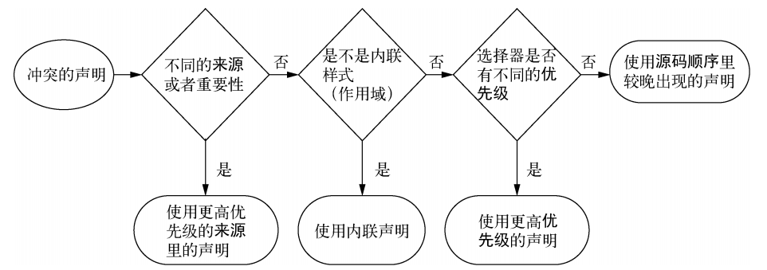
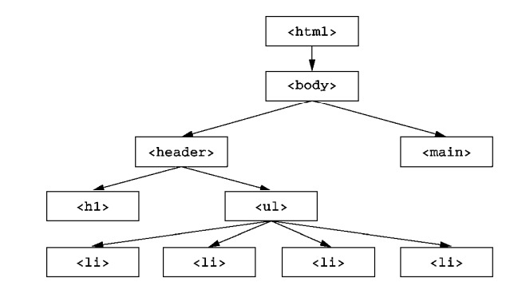

# HTML

# HTML5

## nav

`<nav>` 标签：定义导航链接块
- 默认不增加显示效果
- 由浏览器决定是否显示导航链接，让网页适应不同大小的屏幕

```HTML
<nav>
	<ul>
		<li><a href="#">Home</a></li>
		<li><a href="#">About</a></li>
		<li><a href="#">Services</a></li>
		<li><a href="#">Contact</a></li>
	</ul>
</nav>
```
- 
# CSS


CSS：Cascading Style Sheets，层叠样式表，由声明组成，一个声明=属性+值

```CSS
color: black;
```
规则集=选择器+声明块

```CSS
body {
 color: black;
 font-family: Helvetica;
}
```

## 盒模型

CSS盒模型=边距Margin，边框Border，填充Padding，和实际内容Content
- 元素的height及width属性仅能设置Content部分的长度
  - 假设两个紧邻元素的width分别设置为70%和30%，则第二个元素一定会换行

### 边框

border是简明属性，下属三个属性border-width、border-style、border-color
- border-style也是简明属性，可按顺时针方向为各边框单独设置效果，从上边开始；
  -  border-top-style
  -  border-right-color
  -  border-bottom-width
  -  border-left-style

border-style属性的值

| 值      | 含义                                        |
|---------|---------------------------------------------|
| none    | 默认无边框                                   |
| dotted  | 定义一个点线边框                              |
| dashed  | 定义一个虚线边框                              |
| solid   | 定义实线边框                                 |
| double  | 定义两个边框。 两个边框的宽度和 border-width 的值相同 |
| groove  | 定义3D沟槽边框。效果取决于边框的颜色值           |
| ridge   | 定义3D脊边框。效果取决于边框的颜色值             |
| inset   | 定义一个3D的嵌入边框。效果取决于边框的颜色值        |
| outset  | 定义一个3D突出边框。效果取决于边框的颜色值          |


border-width：长度值或三个关键字--thick、medium、thin

border-color

### 轮廓
## 文本、字体、链接

| 属性             | 描述                     | 合法值                           |
|------------------|--------------------------|----------------------------------|
| color            | 设置文本颜色             | 合法的颜色值（如 #ff0000）      |
| text-align       | 对齐元素中的文本         | left, right, center, justify     |
| text-decoration  | 向文本添加修饰           | none, underline, overline, line-through, blink |
| line-height      | 设置行高                 | 数字、百分比或 normal            |
| white-space      | 设置元素中空白的处理方式 | normal, pre, nowrap, pre-wrap, pre-line, inherit |
| letter-spacing   | 设置字符间距             | normal 或具体的距离值           |
| text-indent      | 缩进元素中文本的首行     | 像素值、em、百分比或 inherit    |
| text-transform   | 控制元素中的字母         | none, capitalize, uppercase, lowercase, initial, inherit |
| vertical-align   | 设置元素的垂直对齐       | baseline, sub, super, top, text-top, middle, bottom, text-bottom, %, length |
| direction        | 设置文本方向             | ltr（从左到右）, rtl（从右到左） |
| word-spacing     | 设置字间距               | normal 或具体的距离值           |
| text-shadow      | 设置文本阴影             | none 或 h-shadow v-shadow blur color |
| unicode-bidi     | 设置或返回文本是否被重写 | normal, embed, bidi-override, inherit |

字体：
- font-family：可以有多个字体系列，当浏览器不支持前面的字体时将采用后面的字体
- font-style：
  - normal
  - italic：斜体
  - oblique：倾斜的文字

| Property       | 描述                       | 合法值                       |
|-------------------|----------------------------|------------------------------|
| font简明属性           | 在一个声明中设置所有的字体属性 |                 |
| font-family    | 指定文本的字体系列         | 字体系列名称、具体字体名称、通用字体名称 |
| font-size      | 指定文本的字体大小         | 绝对大小（如 px）、相对大小（如 em）或百分比 |
| font-style     | 指定文本的字体样式         | normal, italic, oblique      |
| font-variant   | 以小型大写字体或者正常字体显示文本 | normal, small-caps           |
| font-weight    | 指定字体的粗细             | normal, bold, bolder, lighter 或 100-900 的整数 |


链接支持伪类用于区分链接的状态
- 受层叠的声明顺序限制，必须按特定的顺序声明伪类的CSS样式
  - a:hover 必须跟在 a:link 和 a:visited后面
  - a:active 必须跟在 a:hover后面
```CSS

/* - 正常，未访问过的链接 */
a:link 
/* - 用户已访问过的链接 */
a:visited 
/* - 当用户鼠标放在链接上时 */
a:hover 
/* - 链接被点击的那一刻 */
a:active 
```
## 选择器

普通选择器
- `#`：id选择器

```CSS
#header {
    background-color: #333;
    color: white;
}

```
- `.`：class选择器

```CSS
.btn {
    padding: 10px 20px;
    background-color: blue;
    color: white;
}
```
- 标签选择器
```CSS
h1, h2, h3, h4, h5, h6 {
    font-family: Arial, sans-serif;
}

ul, ol {
    margin-left: 20px;
}

```
嵌套关系选择器
- 后代选择器：空格
  - 选择某元素直接后代和间接后代
  - 注意区分多标签选择器

```CSS

/*选中所有以ul标签为父标签的ul标签*/
ul ul {
    margin-left: 20px;
}

/*选中所有ul标签*/
ul , ul {
    margin-left: 20px;
}
```
- 子元素选择器：>
  - 选择作为某个元素直接子元素的元素
- 相邻兄弟选择器：+
  - 目标元素后，同级的、指定标签的、第一个元素
```CSS
/*选择紧接在h2元素后的第一个p元素*/
h2 > p{
  font-size:1.2rem
}
```
- 通用兄弟选择器：~
  - 选择在同一父元素下的所有兄弟元素
```CSS
/*选择所有在与h2同一父元素下的所有p元素*/
h2 > p{
  font-size:1.2rem
}
```

### 伪类

伪类由CSS提供
```css
/* selector 为选择器名称
pseudo-class 为伪类的名称 */
selector:pseudo-class {
    property: value;
}
```

## 层叠、优先级和继承

### 层叠
层叠：规则声明冲突时，决定哪条声明生效
- 解决冲突的条件
  - 样式表来源、自定义样式、浏览器默认样式（用户代理样式表）、用户样式表
  - 选择器优先级
  - 样式在样式表里的声明顺序
- 

样式来源或重要性排列顺序如下（且渲染顺序按不重要->重要)
-  作者的!important样式表
```CSS
color: red !important;
```
-  作者的样式表
-  用户自定义样式表
-  用户代理

```CSS
color: red !important;
/* 被!important标记的声明将会被视为更高优先级的来源 */
```


行内样式：使用HTML中的style属性声明样式，该声明仅作用于当前元素
- 行内元素将覆盖任何来自样式表或者`<style>`标签的样式
- 在样式表中为声明添加!important，从而覆盖行内声明
  - 若行内样式也被标记为!important，则样式表无法覆盖行内声明

选择器优先级：使用ID选择器后将很难覆盖
- 第一优先级顺序：选择器类别
- 第二优先级顺序：选择器ID数量
- 第三优先级顺序：拥有标签名数量


| 选择器               | ID  | 类   | 标签 | 标记   |
|----------------------|-----|------|------|--------|
| html body header h1  | 0   | 0    | 4    | 0,0,4  |
| body header.page-header h1 | 0 | 1 | 3 | 0,1,3 |
| .page-header .title  | 0   | 2    | 0    | 0,2,0  |
| #page-title          | 1   | 0    | 0    | 1,0,0  |


源码顺序
- 假设来源和重要性、行内样式、选择性优先级都无法解决层叠冲突，则出现得较晚的样式胜出
- 按以下顺序书写链接样式：
  - **a:link**：未被访问的链接样式

  - **a:visited**：已被访问的链接样式

  - **a:hover**：鼠标悬停在链接上时的样式

  - **a:active**：链接被激活时的样式。用户点击链接但还没有跳转到新页面时出现

尽可能的使优先级尽可能低，当需要覆盖一些样式时才提高优先级
- 尽量不使用 ID选择器和!important修饰，这会导致样式难以覆盖

### 继承

继承：如果一个元素的某个属性没有层叠值，则该属性可能会从某个祖先元素继承值
- 例如在`<body>`元素设置 `font-family`，所有后代元素都会继承这个字体
- 

默认情况下，只有特定的一些属性能被继承，通常是和文本相关的属性：
- color
- font、font-family、font-size、
font-weight、font-variant、font-style
- line-height、letter-spacing、text-align、
text-indent、text-transform、white-space 以及 word-spacing

其它可被继承的属性
- 列表属性
  - list-style、list-style-type、
list-style-position 、 list-style-image
- 表格的边框属性
  - border-collapse、border-spacing

### 特殊值

通过inherit特殊值继承其父元素的值，覆盖另一个值
- 可以使用 inherit 关键字强制继承一个通常不会被继承的属性，比如边框和内边距
```CSS
a:link {
 color: blue;
} 
...
.footer {
 color: #666;
 background-color: #ccc;
 padding: 15px 0;
 text-align: center;
 font-size: 14px;
} 
.footer a {
 color: inherit;
 text-decoration: underline;
}
```

每一个 CSS属性都有初始默认值，将initial特殊值赋给某个属性将复位初始值
```CSS
.footer a {
 color: initial;
 text-decoration: underline;
}
```

### 简写属性

简写属性：同时给多个属性赋值的属性

- font简写属性：可用于设置多种字体属性
  - font-style、font-weight、font-size、font-height、font-family
```CSS
font: italic bold 18px/1.2 "Helvetica", "Arial", sans-serif;

font-style: italic;
font-weight: bold;
font-size: 18px;
line-height: 1.2;
font-family: "Helvetica", "Arial", sans-serif;

```

- background简写属性
  - background-color
  - background-image
    - 默认以平铺重复的形式铺满整个元素
  - background-repeat
    - 使背景图像仅在y轴或者x轴上平铺
    - `background-repeat:repeat-x;`
    - `background-repeat:no-repeat`：取消平铺
  - background-position
    - 改变图像在背景中的位置
    - `background-position:right top;`
  - background-size、
  - background-origin、
background-chip 、background-attachment

- border简写属性
  - border-width、border-style 、border-color
  - border-width是上、右、下、左四个边框宽度的简写属性
```CSS
border: 1px solid #000;

border-width: 1px 2px 3px 4px;

```

简写属性易忽略的点
- 设置简写属性时，如果未书写全所有的属性，则被省略的属性会设置为初始值
- 这些初始值可能会覆盖其它样式
- 例如以下CSS应用在元素`<h1 class="title">`上不会加粗
- 因此font简写属性的应用最容易出错，避免在`<body>`元素的通用样式以外使用 font
```CSS
h1 { 
 font-weight: bold;
} 
.title {
 font: 32px Helvetica, Arial, sans-serif;
}


/*上述简写属性等价于如下代码*/
.title {
 font-style: normal;
 font-variant: normal;
 font-weight: normal;
 font-stretch: normal;
 line-height: normal;
 font-size: 32px;
 font-family: Helvetica, Arial, sans-serif;
}
```

#### 简写值的顺序

简写属性会尽量包容指定的属性值的顺序
- 例如`border: 1px solid black`和`border: black 1px solid`等价，都会生效
- 在属性值的取值域交叉时，值的顺序很关键


上、右、下、左
- margin、padding、border-width简写属性的顺序按顺时针方向，从上开始
- 假设简写属性不足四个，则先按顺时针顺序将值赋给边，剩下的未赋值属性取对边的值
  - 若简写属性的值只有一个，则四个方向都取该值
- 大多数情况只需要指定两个值
- 对于较小的元素，左右的内边距最好大于上下内边距


坐标：background-position、box-shadow、text-shadow
- 以元素的左上角为原点（0, 0），向右为 x 轴正方向，向下为 y 轴正方向
```CSS
/* 将背景图像的左上角放置在容器的左上角 */
background-position: 0 0;

/* 将背景图像的右下角放置在容器的右下角 */
background-position: right bottom;

/* 将背景图像水平居中，垂直位置在容器底部距离50px处 */
background-position: center bottom 50px;

/* 将背景图像水平和垂直都居中 */
background-position: center;

/* 将背景图像水平居右，垂直居中 */
background-position: right center;

/*将背景图像的左上角放置在距离容器左边缘25%宽度处，距离容器上边缘75%高度处*/
background-position: 25% 75%
```


```CSS
.nav .featured {
 background-color: orange;
 /*阴影应向右偏移10px，向下偏移2px*/
 box-shadow: 10px 2px #6f9090;
}
```

## 相对单位

响应式设计：样式能够根据浏览器窗口的大小有不同的响应效果
- 基于窗口大小等比例缩放字号
- 基于基础字号设置所有元素的相对大小，通过更改基础字号的大小缩放整个网页

绝对长度单位：
- 像素px
  - CSS 像素并不严格等于显示器的像素，96px 通常等于一个物理英寸的大小
- 毫米mm、cm、英寸in
- 点pt（印刷术语，1/72英寸）、派卡pc（印刷术语，12pt）

### em、rem

#### em
em：基于当前元素的字号决定元素大小，浏览器在渲染时，根据相对值和元素字号计算出绝对值
```CSS
.padded {
 font-size: 16px;
 padding: 1em;
}
```
- `padding、height、width、border-radius`等属性适合使用em；这些属性所属的元素通常继承不同的字号，这些元素将根据字号跟随元素均匀缩放
  - 在低优先级中通过相对单位设置共同属性，例如内边距和圆角
  - 在高优先级中设置字号覆盖默认行为
  - 浏览器默认的字号是16px
```html
<span class="box box-small">Small</span>
<span class="box box-large">Large</span>
```

```CSS
.box {
 padding: 1em;
 border-radius: 1em;
 background-color: lightgray;
} 
.box-small {
 font-size: 12px;
} 
.box-large {
 font-size: 18px;
}
```

em作为字号值的单位时，不是由当前元素的字号，而是由继承的字号决定的
- 例如在body元素中字号值使用绝对单位，在所有子元素中字号值使用相对单位


em同时用于字号和其他属性
- 顺序：先计算字号，然后使用这个计算值计算其它使用em单位的属性
- 在下面的代码中，字号是1.2倍父元素字号大小，内边距是1.44倍父元素字号大小
```CSS
body {
 font-size: 16px;
} 
.slogan {
 font-size: 1.2em;
 padding: 1.2em; 
 background-color: #ccc;
}
```

em在嵌套列表中使用
- 在下面的嵌套列表中，字号会逐渐缩小

```CSS
body {
 font-size: 16px;
} 
ul {
 font-size: .8em;
}
```

```HTML
<ul>
  <li>Top level
    <ul>
      <li>Second level
        <ul>
          <li>Third level
            <ul>
              <li>Fourth level
                <ul>
                  <li>Fifth level</li>
                </ul>
              </li>
            </ul>
          </li>
        </ul>
      </li>
    </ul>
  </li>
</ul>
```
- 解决方式一
  - 不推荐使用覆盖规则集的方式

```CSS
body {
 font-size: 16px;
} 
ul {
 font-size: .8em;
}

body {
 font-size: 16px;
} 
ul ul{
 font-size: 1em;
}


```

总结：em适合用在内边距、外边距、元素大小上，但不适合用在字号上

#### rem 


rem：root em的缩写，即不是相对于父元素，而是相对于根元素；
- html根元素具有伪类:root用于选中自己
- 用户有两种方式更改字号大小
  - 缩放操作：只作用于当前标签，不会更改其它标签的字号
  - 更改浏览器默认值， 在不同的设备和不同的用户设置下，默认值不一样
- 根元素上的em是相对浏览器默认值计算的

```CSS
/*在根元素上使用em是相对浏览器默认值计算的*/
:root {
 font-size: 1em;
} 
ul { 
 font-size: .8rem; 
}
```

#### 总结

使用rem设置字号，px设置边框，em设置其他大部分属性，尤其是内边距、外边距和圆角
- 有时用百分比设置容器宽度

```CSS
.panel {
 padding: 1em;
 border-radius: 0.5em;
 border: 1px solid #999;
} 
.panel > h2 {
 margin-top: 0; /*将面板顶部的多余空间移除*/
 font-size: 0.8rem;
 font-weight: bold;
 text-transform: uppercase;
}
```
### 构造响应式面板
通过媒体查询改变根元素的字号，基于不同用户的屏幕尺寸，渲染出不同大小的面板
- 如果需要更改面板，只需更改根元素字号即可

```CSS

/*作用到所有的屏幕，但是由于声明顺序在前，所以会被后续的声明覆盖*/
:root {
 font-size: 0.75em;
}

/*仅作用到宽度 800px 及其以
上的屏幕，覆盖之前的值*/
@media (min-width: 800px) {
 :root {
 font-size: 0.875em;
 } 
}

/*仅作用到宽度 1200px 及
其以上的屏幕，覆盖前面
两个值*/
@media (min-width: 1200px) {
 :root {
 font-size: 1em;
 } 
}
```

### 视口的相对单位

#### 通过视口设置元素的宽高
视口：浏览器窗口里网页可见部分的边框区域。它不包括浏览器的地址栏、工具栏、状态栏

视口的相对单位
- vh：视口高度的 1/100
- vw：视口宽度的 1/100
- vmin：视口宽、高中较小的一方的 1/100
- vmax：视口宽、高中较大的一方的 1/100

```CSS

/*确保在任一媒介中，都能正常显示指定容器*/
.square {
 width: 90vmin;
 height: 90vmin;
 background-color: #369;
}
```

#### 通过视口设置字号

`font-size: 2vw`：字号会随着视口大小的改变平滑的过渡，避免使用媒体查询这种硬编码方式
- vw和vh实现物理屏幕大小和字号的线性大小关系
- 媒体查询只能做到区间查询，是硬编码
- 坏消息是，2vw在电脑上太大，在手机上太小

calc()函数可对两个及其以上的值进行+-*/，通过calc()函数结合不同单位的值
- 加号和减号两边必须有空白
- `calc(0.5em + 1vw)`：保证最小字号是0.5em，同时1vw确保字体会随着视口缩放
```CSS

:root {
 font-size: calc(0.5em + 1vw);
}
```

### 自定义属性
自定义属性
- 要求自定义的名字必须以前缀--开头
- 自定义属性必须在一个作用域中声明
```CSS
/*在:root作用域中声明，可以在整个网页中使用*/
:root {
 --main-font: Helvetica, Arial, sans-serif;
}
```
- 调用函数 var()使用自定义变量
```CSS
 --main-font: Helvetica, Arial, sans-serif;
} 
p {
 font-family: var(--main-font);
}
```


常用点
- 若某些值反复出现，例如颜色值，则可以在样式表某处自定义属性值，然后在其它地方复用，实现单一数据源
- var()函数可接收多个参数，若前面的参数未定义，则使用后面的元素

## 盒模型


# JavaScript

# Vue3


script
- data函数
  - 当Vue创建组件实例时将调用data()函数
  - 该函数需要return一个对象，该对象以`$data`的形式存储在该组件实例中
  - 在下面的方法中，`this.count`和`this.$data.count++`具有相同的效果
- methods

```JS
  data(){
    return{
      count:0,
    }
  },
  methods: {
    increment() {
      // `this` 指向该组件实例
      this.count++
    }
  }
```

## v指令
V指令：以 `v-` 开头的指令，在 HTML 模板中使用，将响应式数据绑定到 DOM 元素上，赋予 HTML 标签额外的功能
- 若将指令绑定到html的参数上，则需要在指令后添加:属性名="被绑定的值"
- 提供完整的js表达式支持，要求必须是表达值，语句不会生效
- `v-bind`：将数据绑定到 HTML 属性上
- `v-model`：实现表单控件与数据的双向绑定
- `v-if、v-else、v-else-if`：只有表达式返回true时渲染组件，v-else-if可以使用多次
  - v-else 、v-else-if 必须跟在 v-if 或者 v-else-if之后
- v-for指令：绑定数组或对象用于渲染一个列表
  - v-for绑定对象时将遍历一个对象的属性`<li v-for="value in object">`
    - 提供第二个参数作为键名
    - `<li v-for="(value, key) in object">`
    - 提供第三个参数为索引
    - `<li v-for="(value, key, index) in object">`
  - v-for 迭代整数
    - `<li v-for="n in 10">`
  - v-for指令支持第二个可选的参数，参数值为当前项的索引
```HTML
<li v-for="(site, index) in sites">
  {{ index }} -{{ site.text }}
</li>
```

| 指令     | 描述                                                                                     |
|----------|------------------------------------------------------------------------------------------|
| v-bind   | 用于将 Vue 实例的数据绑定到 HTML 元素的属性上。                                             |
| v-if     | 若表达式的值undefined或null，则该元素或组件不会被渲染                                                |
| v-show   | v-show 是 Vue.js 提供的一种指令，用于根据表达式的值来条件性地显示或隐藏元素。                  |
| v-for    | 用于根据数组或对象的属性值来循环渲染元素或组件。                                             |
| v-on     | 用于在 HTML 元素上绑定事件监听器，使其能够触发 Vue 实例中的方法或函数。                       |
| v-model  | 用于在表单控件和 Vue 实例的数据之间创建双向数据绑定。                                          |

```HTML
<template>
  <div>
    <h2 v-bind:title="title">{{ title }}</h2>
    <p v-if="isVisible">这是一个可见的段落。</p>
    <p v-show="isVisible">这是一个显示/隐藏的段落。</p>
    <ul>
      <li v-for="(item, index) in items" :key="index">{{ item }}</li>
    </ul>
    <button v-on:click="toggleVisibility">点击切换显示/隐藏</button>
    <input v-model="inputValue" placeholder="输入内容" />
    <p>输入的内容是：{{ inputValue }}</p>
  </div>
</template>

<script>
export default {
  data() {
    return {
      title: 'Vue.js 指令示例',
      isVisible: true,
      items: ['Apple', 'Banana', 'Cherry'],
      inputValue: ''
    };
  },
  methods: {
    toggleVisibility() {
      this.isVisible = !this.isVisible;
    }
  }
};
</script>

```

模板语法：v指令赋予html元素额外的功能，模板将数据渲染进 DOM
- 使用{{}}进行文本插值

```HTML
<div id="app">
  <p>{{ message }}</p>
</div>
```


V指令缩写
- v-bind 缩写
```HTML
<!-- 完整语法 -->
<a v-bind:href="url"></a>
<!-- 缩写 -->
<a :href="url"></a>
```
v-on 缩写
```HTML
<!-- 完整语法 -->
<a v-on:click="doSomething"></a>
<!-- 缩写 -->
<a @click="doSomething"></a>
```

v-for不仅能在li元素中使用，也能在任意子组件中使用

```HTML
<template>
  <div>
    <ul>
      <todo-item
        v-for="(todo, index) in todos"
        :key="index"
        :todo="todo"
      ></todo-item>
    </ul>
  </div>
</template>

<script>
import TodoItem from './TodoItem.vue';

export default {
  name: 'TodoList',
  components: {
    TodoItem
  },
  data() {
    return {
      todos: [
        { id: 1, text: 'Learn Vue.js', done: false },
        { id: 2, text: 'Build a project', done: false },
        { id: 3, text: 'Deploy the project', done: false }
      ]
    };
  }
};
</script>

```


- TodoItem代码如下

```HTML
<template>
  <li>{{ todo.text }}</li>
</template>

<script>
export default {
  name: 'TodoItem',
  props: ['todo']
};
</script>

```

## 组件


通过createApp函数创建应用
- `createApp()`：要求传入一个组件对象，返回应用实例
  - 该组件是根组件，作为渲染的起点，可挂载其它组件
- 应用实例提供`mount()`：要求传入一个html元素的id名
  - 渲染时，该组件将被自动注入到该元素中
  - 在 `public/index.html`文件中定义一个空的id 为 app的 div 元素


```JS
import { createApp } from 'vue'
import App from './App.vue'

//本应用将被挂载在id为app的元素上
createApp(App).mount('#app')

```

注册全局组件
- 注册后通过`<my-component-name></my-component-name>`直接调用而无需import

```JS
const app = Vue.createApp({...})

app.component('my-component-name', {
  /* 配置选项 */
})
```

局部组件
- 无论全局组件是否使用都会被构建
- 引入组件后注册为js对象，并在components选项中使用

```JS
components: {
  'component-a': ComponentA,
  'component-b': ComponentB
}
```

- 如果键和值的名称相同，可以使用简写的方式，只写值而省略键

```JS
components: {
  ComponentA,
  ComponentB
}
```

props
- 在子组件中声明props选项用于接受父组件传递过来的数据

```JS
//数组形式
props: ['title1','title2']

//对象形式，携带类型检查
props: {
  // 基础类型检查：null、undefined可以通过任何类型构建验证
  propA: Number,
  // 多个可能的基础类型检查
  propB: [String, Number],
  // 必填的，null、undefined不会通过检查
  propC: {
    type: String,
    required: true
  },
  // 带默认值
  propD: {
    type: Number,
    default: 100
  },
  // 带有默认值的对象
  propE: {
    type: Object,
    // 对象或数组默认值必须从一个工厂函数获取
    default: function () {
      return { message: 'hello' }
    }
  },
  // 自定义验证函数
  propF: {
    validator: function (value) {
      // 这个值必须匹配下列字符串中的一个
      return ['success', 'warning', 'danger'].indexOf(value) !== -1
    }
  }
}
```

## 监听

### watch
组件实例具有属性`$watch`，监听并响应数据变化，并在数据变更时执行操作
- watch监听数据变化，并在数据变化时执行Ajax
- 要求watch中的方法名与属性名相同，一个方法监听一个属性；

```HTML
<template>
  <div>
    <p>当前计数：{{ count }}</p>
    <button @click="increment">增加</button>
    <button @click="decrement">减少</button>
    <p>{{withCount}}</p>
  </div>
</template>

<script>
export default {
  name: 'MyCounter',
  data() {
    return {
      count: 0,
      withCount:0
    };
  },
  methods: {
    increment() {
      this.count++;
    },
    decrement() {
      this.count--;
    }
  },
  watch: {
    count(newVal) {
      this.withCount=newVal
    }
  }
};
</script>

```

### 事件

v-on指令将方法绑定到DOM事件上


Dom事件列表

| 事件     | 描述                 |
|----------|----------------------|
| click    | 鼠标点击事件         |
| mouseover| 鼠标移入事件         |
| mouseleave| 鼠标移出事件        |
| keydown  | 按键按下事件         |
| keyup    | 按键松开事件         |
| input    | 输入框输入事件       |
| submit   | 表单提交事件         |
| change   | 表单元素值改变事件   |
| scroll   | 滚动事件             |
| focus    | 元素获得焦点事件     |
| blur     | 元素失去焦点事件     |

Vue.js 为 v-on 提供事件修饰符来处理 DOM 事件细节
- 事件冒泡：事件从最具体的元素开始接收，然后逐级向上传播到较不具体的元素，知道到达根元素为止


| 修饰符  | 描述                   |
|----------|------------------------|
| .stop    | 阻止事件冒泡           |
| .prevent | 阻止事件默认行为       |
| .capture | 添加事件监听时使用捕获模式 |
| .self    | 只当事件是由该元素本身触发时触发回调 |
| .once    | 只触发一次事件         |
| .left    | 只在左键按下时触发     |
| .right   | 只在右键按下时触发     |
| .middle  | 只在中键按下时触发     |


```HTML
<!-- 阻止单击事件冒泡 -->
<a v-on:click.stop="doThis"></a>
<!-- 提交事件不再重载页面 -->
<form v-on:submit.prevent="onSubmit"></form>
<!-- 修饰符可以串联  -->
<a v-on:click.stop.prevent="doThat"></a>
<!-- 只有修饰符 -->
<form v-on:submit.prevent></form>
<!-- 添加事件侦听器时使用事件捕获模式 -->
<div v-on:click.capture="doThis">...</div>
<!-- 只当事件在该元素本身（而不是子元素）触发时触发回调 -->
<div v-on:click.self="doThat">...</div>

<!-- click 事件只能点击一次，2.1.4版本新增 -->
<a v-on:click.once="doThis"></a>
```


按键修饰符：在监听键盘事件时添加按键修饰符

```HTML
<!-- 只有在 keyCode 是 13 时调用 vm.submit() -->
<input v-on:keyup.13="submit">

<input v-on:keyup.enter="submit">
<input @keyup.enter="submit">
```
- 除keyCode之外提供按键别名如下
  - enter、tab、delete 、esc、space、up、down、left、right
  - 系统修饰键：ctrl、alt、shift、meta
  - 鼠标按钮修饰符：left、right、middle


exact 修饰符：允许控制由精确的系统修饰符组合触发的事件
```HTML
<!-- 即使 Alt 或 Shift 被一同按下时也会触发 -->
<button @click.ctrl="onClick">A</button>

<!-- 有且只有 Ctrl 被按下的时候才触发 -->
<button @click.ctrl.exact="onCtrlClick">A</button>

<!-- 没有任何系统修饰符被按下的时候才触发 -->
<button @click.exact="onClick">A</button>
```

## 表单

使用v-model指令在表单 `<input>、<textarea>、 <select>` 等元素上创建双向数据绑定
- 除非data选项中绑定的数据为空，否则忽略所有表单元素的 value、checked、selected属性的初始值


输入框
```HTML
<template>
  <div>
    <input type="text" v-model="message">
    <p>你输入的内容是：{{ message }}</p>
  </div>
</template>

<script>
export default {
  data() {
    return {
      message: ''
    };
  }
};
</script>

```

text、textarea元素只能使用v-model，不能使用{{}}文本插值

```HTML
<textarea v-model="message2" placeholder="多行文本输入……"></textarea>
```

复选框
- input元素和label绑定实现复选框，其中lable的for属性值为input元素的id

```HTML
<template>
  <div>
    <input type="checkbox" id="checkbox" v-model="checked">
    <label for="checkbox">{{ checked ? '已选中' : '未选中' }}</label>
  </div>
</template>

<script>
export default {
  data() {
    return {
      checked: false
    };
  }
};
</script>

```

单项选择
```HTML
<template>
  <div>
    <input type="radio" id="option1" value="option1" v-model="selectedOption">
    <label for="option1">Option 1</label>
    <br>
    <input type="radio" id="option2" value="option2" v-model="selectedOption">
    <label for="option2">Option 2</label>
    <br>
    <p>你选择的选项是：{{ selectedOption }}</p>
  </div>
</template>

<script>
export default {
  data() {
    return {
      selectedOption: 'option1'
    };
  }
};
</script>

```

select下拉列表：单选

```HTML
<template>
  <div>
    <select v-model="selectedOption">
      <option value="option1">Option 1</option>
      <option value="option2">Option 2</option>
      <option value="option3">Option 3</option>
    </select>
    <p>你选择的选项是：{{ selectedOption }}</p>
  </div>
</template>

<script>
export default {
  data() {
    return {
      selectedOption: 'option1'
    };
  }
};
</script>

```

select下拉列表：多选
- 绑定到数组

```HTML
<template>
  <div>
    <select v-model="selectedOptions" name="optionsName" multiple>
      <option value="option1">Option 1</option>
      <option value="option2">Option 2</option>
      <option value="option3">Option 3</option>
    </select>
    <p>your choices：{{ selectedOptions }}</p>
  </div>
</template>

<script>
export default {
  data() {
    return {
      selectedOptions: ''
    };
  }
};
</script>

```

select配合v-for使用
```HTML
<template>
  <div>
    <select v-model="selectedOption">
      <option v-for="option in options" :key="option.value" :value="option.value">{{ option.label }}</option>
    </select>
    <p>你选择的选项是：{{ selectedOption }}</p>
  </div>
</template>

<script>
export default {
  data() {
    return {
      selectedOption: '',
      options: [
        { value: 'option1', label: 'Option 1' },
        { value: 'option2', label: 'Option 2' },
        { value: 'option3', label: 'Option 3' }
      ]
    };
  }
};
</script>

```

在上述代码中，v-model所绑定的变量，其值域中的值往往是固定的，可以使用v-bind指令将value属性绑定到动态数据

v-model修饰符
- lazy修饰符：仅在change事件发生时同步数据
  - change事件：当 `<input>、<select>、<textarea> `元素的值发生改变，并且失去焦点时触发
  - 如果没有用lazy修饰，则在input事件发生时保持数据同步
```HTML
<template>
  <div>
    <input v-model.lazy="message" placeholder="请输入内容">
    <p>输入的内容是：{{ message }}</p>
  </div>
</template>

<script>
export default {
  data() {
    return {
      message: ''
    };
  }
};
</script>

```

- number修饰符：自动将用户的输入值转为 Number 类型
  - 如果原值的转换结果为 NaN 则返回原值
  - 通常输入的值都是字符串，因此该功能很常用
```HTML
<input v-model.number="age" type="number">
```
- trim修饰符：自动过滤用户输入的首尾空格
```html
<input v-model.trim="msg">
```
## 自定义指令

## 路由

Vue Router提供`<router-view>`组件
- 通常在应用程序的根组件或者是一个整体布局组件中使用`<router-view>`
- 路由配置并挂载到vue实例后，`<router-view></router-view>`标签将会根据用户访问的路由，匹配相应的组件，并将该组件加载到`<router-view>`中，从而实现页面内容的动态切换
```HTML
<template>
  <div id="app">
    <router-view></router-view>
  </div>
</template>

<script>
export default {
  name: 'App'
}
</script>
```


```JS
export const constantRoutes = [
  {
    path: '/login',
    component: () => import('@/views/login'),
    hidden: true,
  },
  {
    path: '/403',
    name: '403',
    component: () => import('@/views/403'),
    hidden: true,
  },
  {
    path: '/404',
    name: '404',
    component: () => import('@/views/404'),
    hidden: true,
  },
]

const router = createRouter({
  history: createWebHashHistory(),
  routes: constantRoutes,
})

export default router
```

配置路由并挂载到vue应用实例
```JS 

//在数组中定义多个路由对象，每个路由对象将url一对一映射到component
export const constantRoutes = [
  {
    path: '/login',
    component: () => import('@/views/login'),
    hidden: true,
  },
  {
    path: '/403',
    name: '403',
    component: () => import('@/views/403'),
    hidden: true,
  },
  {
    path: '/404',
    name: '404',
    component: () => import('@/views/404'),
    hidden: true,
  },
]
 
// 创建路由实例并传递 `routes` 配置
const router = VueRouter.createRouter({
  history: VueRouter.createWebHashHistory(),
  routes, // `routes: routes` 的缩写
})
 
```

接下来在main.js中创建应用实例并挂载路由配置

```JS
import { createApp } from 'vue'
import App from './App'
import router from './router'
import store from './store'

createApp(App).use(store).use(router).mount('#app')

```
Vue Router提供`<router-link>`组件
- 与a标签的区别：在不重新加载页面的情况下更改 URL并渲染相应的组件
- to属性：默认情况下调用router.push()将该属性的值记录到history，供后续返回页面使用

```html
<!-- 字符串 -->
<router-link to="home">Home</router-link>

<!-- 使用 v-bind 的 JS 表达式 -->
<router-link v-bind:to="'home'">Home</router-link>
<router-link :to="{ path: 'home' }">Home</router-link>
<router-link :to="{ name: 'user', params: { userId: 123 }}">User</router-link>

<!-- 带查询参数，下面的结果为 /register?plan=private -->
<router-link :to="{ path: 'register', query: { plan: 'private' }}">Register</router-link>
```

- 设置replace属性，将会调用router.replace()方法替代router.push()，导航后不会留校history记录
- append：在当前组件的路径后添加路径
- tag：将`<router-link>`渲染成某种标签

```HTML
<router-link to="/foo" tag="li">foo</router-link>
```
- active-class：设置 链接激活时使用的 CSS 类名
- event：声明可以用来触发导航的事件。可以是一个字符串或是一个包含字符串的数组

## Axios

## Composition API

Composition API组合式API
# uniapp

# EOF
