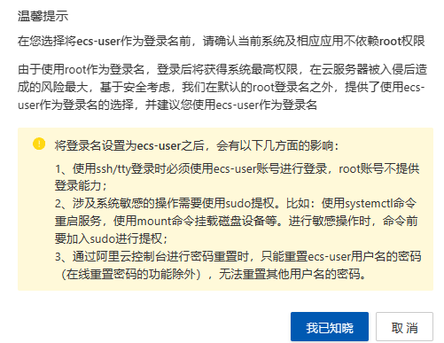

# 日记

# Password

## 本地

Active-Artemis
- C:\EngnieerEnv\Artemis\bin\jms-data
- admin
- wqs99999

## 开发

### 生产力
- chatgpt
  - ryyfv504026@gmail.com
  - Wqs20020108**.
- wxapp
  - wxac09faaec00da9dd
  - 08ecd10eda32929922717ba38438dbfd
- 阿里云
  - 自定义密码
    - ecs-user
    - Wqs99999
  - 
- 宝塔
  - 13402845389
  - Wqs99999
  - 外网面板地址: https://47.93.77.117:41042/site/php
  - username: 2gk1zwl8
  -  password: d999cf0c
  -  云服务器】请在安全组放行 41042 端口
 因默认启用自签证书https加密访问，浏览器将提示不安全点击【高级】-【继续访问】或【接受风险并继续】访问教程：https://www.bt.cn/bbs/thread-117246-1-1.html


### 开发支持

- Github
  - ryyfv504026@163.com
  - wqs99999
- Nvidia
  - ryyfv504026@163.com
  - wqs99999.
## Scu

- 教务处
  - qwaasz2002.
- 学工一体化
  - 2020141460283
  - wqs99999
- 统一认证
  - Wqs99999.    
## 其它互联网服务商

- ShadowShock
  - ryyfv504026@163.com
  - wqs99999.

### 邮箱

- Gmail
  - ryyfv504026@gmail.com
  - wqs99999
## 教育部

- 学信网
  - Wqs99999


## 游戏

- steam
  - tjqwind
  - wqs99999
  - lueweichun
  - zdc060924.
- EA
  - 602407929@qq.com
  - Wqs99999

## AI

Gamma
- ryyfv504026@163.com
- Wqs99999.


```
user  www www;
worker_processes auto;
error_log  /www/wwwlogs/nginx_error.log  crit;
pid        /www/server/nginx/logs/nginx.pid;
worker_rlimit_nofile 51200;

stream {
    log_format tcp_format '$time_local|$remote_addr|$protocol|$status|$bytes_sent|$bytes_received|$session_time|$upstream_addr|$upstream_bytes_sent|$upstream_bytes_received|$upstream_connect_time';
  
    access_log /www/wwwlogs/tcp-access.log tcp_format;
    error_log /www/wwwlogs/tcp-error.log;
    include /www/server/panel/vhost/nginx/tcp/*.conf;
}

events
    {
        use epoll;
        worker_connections 51200;
        multi_accept on;
    }

http
    {
        include       mime.types;
		#include luawaf.conf;

		include proxy.conf;
        lua_package_path "/www/server/nginx/lib/lua/?.lua;;";

        default_type  application/octet-stream;

        server_names_hash_bucket_size 512;
        client_header_buffer_size 32k;
        large_client_header_buffers 4 32k;
        client_max_body_size 50m;

        sendfile   on;
        tcp_nopush on;

        keepalive_timeout 60;

        tcp_nodelay on;

        fastcgi_connect_timeout 300;
        fastcgi_send_timeout 300;
        fastcgi_read_timeout 300;
        fastcgi_buffer_size 64k;
        fastcgi_buffers 4 64k;
        fastcgi_busy_buffers_size 128k;
        fastcgi_temp_file_write_size 256k;
		fastcgi_intercept_errors on;

        gzip on;
        gzip_min_length  1k;
        gzip_buffers     4 16k;
        gzip_http_version 1.1;
        gzip_comp_level 2;
        gzip_types     text/plain application/javascript application/x-javascript text/javascript text/css application/xml;
        gzip_vary on;
        gzip_proxied   expired no-cache no-store private auth;
        gzip_disable   "MSIE [1-6]\.";

        limit_conn_zone $binary_remote_addr zone=perip:10m;
		limit_conn_zone $server_name zone=perserver:10m;

        server_tokens off;
        access_log off;

server
    {
        listen 888;
        server_name phpmyadmin;
        index index.html index.htm index.php;
        root  /www/server/phpmyadmin;

        #error_page   404   /404.html;
        include enable-php.conf;

        location ~ .*\.(gif|jpg|jpeg|png|bmp|swf)$
        {
            expires      30d;
        }

        location ~ .*\.(js|css)?$
        {
            expires      12h;
        }

        location ~ /\.
        {
            deny all;
        }

        access_log  /www/wwwlogs/access.log;
    }
 server {
    listen 8088 default_server;
    listen [::]:8088 default_server;
    server_name _;
    root /home/www/dist;
    
    include /etc/nginx/default.d/*.conf;

    location / {
        try_files $uri $uri/ /index.html;
    }
}   
include /www/server/panel/vhost/nginx/*.conf;
}


```
