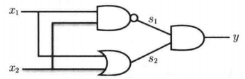
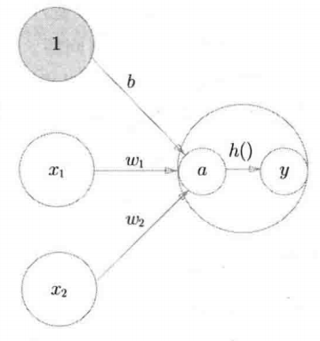
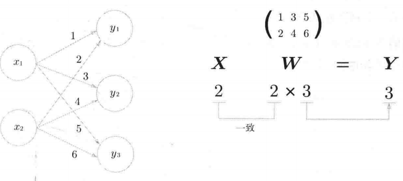
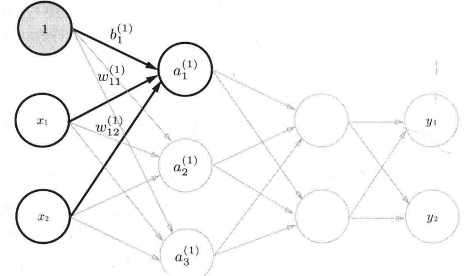
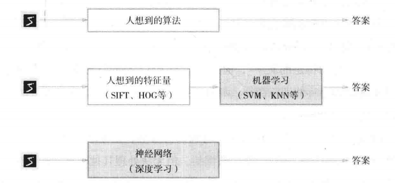
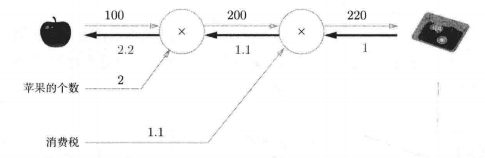
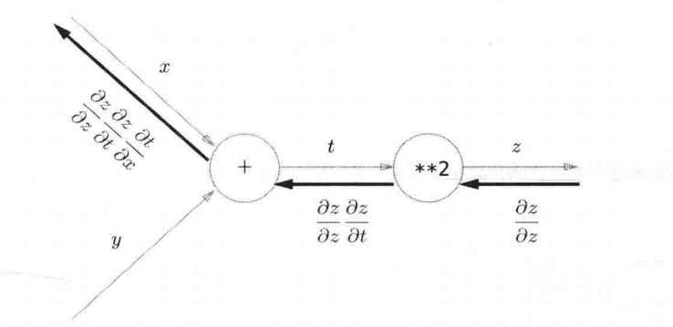

#  感知机

- 感知机接受多个输入信号${x_1,...,x_n}$，仅返回一个输出信号$y$
  - 信号：要么为$0$表示不传递信号，要么为$1$表示传递信号
  - 信号的权重$w_i$：输入信号$x_i$流入感知机的难易程度，说明该信号对感知机的重要程度
  - 感知机的阈值$\theta$：激活感知机的难易程度，当且仅当$w_1x_1+w_2x_2 > \theta$时，感知机输出$1$
  - 输出信号$y=\left\{\begin{array}{ll}0 & \left(w_{1} x_{1}+w_{2} x_{2} \leqslant \theta\right) \\1 & \left(w_{1} x_{1}+w_{2} x_{2}>\theta\right)\end{array}\right.$
  - 单层线性感知机的局限性：只能通过直线$w_{1} x_{1}+...+w_{i}x_{i}-\theta=0$将空间一分为二，以判断是否激活感知机
- 异或门
  - 多层感知机
  - 2层感知机就能构建计算机，能够表示所有函数

# 神经网络

- 神经网络：自动从数据中学习合适的权重参数
    - 层数：拥有权重的层数，输入层-中间层-输出层中的输入层不计入层数
      - 中间层：也称隐藏层
      - 从输入层开始标号依次为0，1，2...
- 激活函数
    - 
    - 计算偏置和加权输入信号的和$a=b+w_1x1+w_2x_2$
    - $h(x)=\begin{cases} 0 \;\;\;x≤0\\ 1\;\;\;x>0\end{cases}$
    - $y=h(a)$
- 神经元的激活函数
  - 通过$h(x)=\begin{cases} 0 \;\;\;x≤0\\ 1\;\;\;x>0\end{cases}$将输入值转换为输出值称为阶跃函数
  - 神经元的信号允许连续的实值；
    - 以sigmoid函数为转换函数$\displaystyle h(x)=\frac{1}{1+e^{-x}}$
  - 线性函数：输出值是输入值的常数倍
    - 无论使用线性函数作为激活函数的感知机如何叠加，总是能找到一个函数，使得使用该函数的单层感知机与之等价
  - 非线性函数：sigmoid函数和阶跃函数都是非线性函数
- ReLUa函数
  - $h(x)=\begin{cases}x\;\;x>0\\ 0 \;\;x\leq0 \end{cases}$

## 多维数组的运算

- 

## 3层神经网络的实现

- 神经网络的前向处理：中间层的运算通过矩阵内积进行
  - 
  - 偏置神经元'1'总是输出1，其权重总是为$b=-\theta$
  - 第一层的加权和为$\begin{bmatrix}a_1\\a_2\\a_3\end{bmatrix} = \begin{bmatrix}x_1\\x_2\end{bmatrix} \times \begin{bmatrix}w_{11}&&w_{21}&&w_{31}\\w_{12}&&w_{22}&&w_{32}\end{bmatrix} + \begin{bmatrix} b_1\\b_2\\b_3\end{bmatrix}$
  - 然后将向量$\overrightarrow{a}=\begin{bmatrix}a_1\\a_2\\a_3\end{bmatrix}^c$传入激活函数得到第一层神经元的输出；
- 中间层到输出层
  - 加权和的计算同上
  - 输出层所用的激活函数，要根据求解问题的性质决定。一般地，回归问题可以使用恒等函数，二元分类问题可以使用sigmoid函数，多元分类问题可以使用softmax函数

### 输出层的实现

- 机器学习的问题大致可以分为分类问题和回归问题
  - 分类问题是数据属于哪一个类别的问题
  - 回归问题是根据某个输入预测一个连续的数值的问题
- 恒等函数：中间层的最后一层的加权和作为输出层的输出；
- softmax
  - $\displaystyle y_{k}=\frac{\exp^ {\left(a_{k}\right)}}{\sum_{i=1}^{n} \exp^{\left(a_{i}\right)}}$
    - $exp$：欧拉数，$2.7182...$
  - 假设输出层共n个神经元，$y_n$：输出层的第$k$个神经元
  - 分母：中间层的最后一层的指数函数之和
  - 分子：中间层的第$k$个神经元的指数函数
- python实现softmax
  - 先实现指数然后结果相除，分子、分母都可能产生溢出问题
  - 解决方式：分子分母同时减去输入信号的最大值
- softmax的特征
  - softmax的结果处于[0.0,1.0]之间，所有输出值的总为1；
  - 输出层的每个神经元对应一个类别，其输出值代表其概率
  - 神经元的输出值经softmax函数映射后，大小顺序不会更改，和经恒等函数映射后的大小顺序相同；
- 机器学习的前向传播：
  - 学习：确定神经网路的参数
  - 推理：使用学习阶段的参数将输入映射到输出层
- 输出层的神经元数量由待解决的问题决定
  - 分类问题：神经元的数量==类别数量
- 输入层的神经元数量
  - 例如每个元组共n个属性，则可将其读入一维数组并

# 神经网络的学习

- 
  - 机器学习：人为设计特征量，然后从数据中提取特征量，然后学习参数
  - 深度学习：端到端机器学习，即从原始数据获得目标结果
- 数据处理
  - 预处理(按某种规则转换数据，例如将三维数组转换为一维数组)
  - 正规化(将数据限定到某个范围)
  - 划分为训练数据和测试数据
- 过拟合：只使用一个数据集进行学习评价，导致过度拟合；

## 损失函数

- 损失函数描述当前参数下的神经网络对测试数据(监督数据)不拟合程度的测量
- 均方误差$$E=\frac12\sum_{k}(y_{k}-t_{k})^{2}$$
- 交叉熵误差$$E=-\sum_{k}t_{k}\log y_{k}$$其中$y_{k}$是神经网络的输出，$t_{k}$是正确解标签
- mini-batch学习
  - 针对所有数据计算损失函数的值，找出令该值(权重和偏置)最小的神经网络参数$$E=-\frac{1}{N}\sum_{n}\sum_{k}t_{nk}\log y_{nk}$$
  - 当训练数据过多时，不可能以所有数据计算损失函数，而是从训练数据中选取一小部分

# 误差反向传播法

- 数值微分：不断调整损失函数关于权重参数的梯度(向使损失函数最小的方向调整)，但是该方法耗费时间

## 计算图

- 构建计算图
  - 节点：计算内容
  - 箭头链接节点，箭头标注计算的中间结果
- 正向传播：从左到右依次计算，向前传递计算结果
- 局部计算：允许多线程分别计算局部的结果，然后将结果返回给主线程进行最后结果的计算
- 反向传播：从右到左依次传递导数
  - 
  - 苹果上涨1块，支付金额会上涨2.2块
  - 导数计算时，同样可以划分多个局部图共享中间的某个结果
  - 