# Question

- 电场线条数的公式推导以及电场线密度的定义推导
- 在计算无线长均匀带电直线时，积分区间为$(-\infin,\infin)$的结果错误；
- 
  - 电荷面/体/线密度如何转换
- 
  - 怎么建立关于坐标的积分公式
- 
- 
- 
# 静电场

## 电荷

- 电荷守恒定律
  - 电中性：微观粒子中质子和电子的数量相同；
  - 物体失去/得到电荷才能处于带电状态；
  - 与外界没有电荷交换的系统中，正负电荷的代数和在任何物理过程中始终保持不变
- 电荷
  - 量子化：任何带电体的电荷是某一基本单位的整数倍，这个基本单位就是质子所带的电荷，叫做元电荷，记为$e$
  - 单位：库伦，记为$C$
- 电磁力是唯一在微观和宏观都能表现的力
  - $\displaystyle{F_{引}\over F_电}=10^{-36}$,在相同距离下，引力远远弱于电磁力；
    - 假定太阳和地球的电子数比质子数多出$10^{-18}$倍，那么日地间的电斥力将等于万有引力，同种电荷由于同性相斥难以聚集，因此天体是电中性的；
  - 电荷有正负两种，其效应相互抵消；而引力荷只有一种，它们的效应可以叠加，而同种电荷由于同性相斥却难于聚集在一起产生强电场；因此天体物理中引力起主导作用
- 基本相互作用力
  - 在各自作用范围中的数量级排序：强力、电磁力、弱力、引力
  - 质子之间的核力确保静电斥力不会使质子分离
  - 强弱力在宏观无法表现，电磁力虽然是远程力，但是因为相互抵消而不起作用；
  - 电磁力是唯一既有宏观表现也有微观表现的

## 库仑定律

- 静止的带电体之间的静电力的影响因素：电荷数、相对位置、带电体的形状、大小，带电体中的电荷分布情况；
  - 在所讨论问题的精度允许时，若带电体的线度远小于带电体之间的距离时，可以将带电体看作点电荷
- 库仑定律
  - 刻画相对于惯性系静止的两个点电荷间的静电力的规则
  - 大小相等方向相反，并且沿着它们的连线；同号电荷相斥，异号电荷相吸.
  - 大小与各自的电荷q1及q2成正比，与距离r的平方成反比，即$$F=k\frac{q_{1}q_{2}}{r^{2}}$$常量$$\displaystyle k=\frac{1}{4\pi\varepsilon_{0}}\approx9\times10^{9}\mathrm{N}\cdot\mathrm{m}^{2}/\mathrm{C}^{2}.$$常量$$\varepsilon_{0}\approx8.9\times10^{-12}\mathrm{C}^{2}/(\mathrm{N}\cdot\mathrm{m}^{2}).$$
- 库仑定律的矢量形式$${\boldsymbol{F}}_{12}=\frac{q_{1}q_{2}}{4\pi\varepsilon_{0}r^{2}}{\boldsymbol{e}}_{r12},\quad{\boldsymbol{F}}_{21}=\frac{q_{1}q_{2}}{4\pi\varepsilon_{0}r^{2}}{\boldsymbol{e}}_{r21},$$当$q_1和q_2$电荷量为负时$q$应为负值

## 静电场

- 试探电荷
  - 线度必须小到可被看做点电荷，以便确定场中每点的性质
  - 电荷要足够小，使得它的置入不引起原有电荷的重新分布
  - 场点：在场中要研究的点
  - 标量场：坐标映射标量
  - 矢量场：坐标映射矢量
  - 求带电体激发的电场：等价于求函数$\overrightarrow{E(x,y,z)}$
- 电场
  - 电场强度$\displaystyle E= \frac{F}{q}$，单位 $N/C$
  - 均匀电场：各点电场强度有相同大小和方向
  - 计算某点的电场强度时，确定坐标轴，使用单位正交向量表示；

### 电荷连续分布的物体的电场

  - 宏观物体的静电荷来自微观粒子的叠加，因此电荷在微观上一定不是连续分布；
  - 问题的尺度是宏观时，忽略微观起伏，认为电荷连续分布在某一宏观体积、曲面、曲线上
  - 为描述电荷分布，引入概念：电荷体密度$$\rho\equiv\frac{\Delta q}{\Delta V}$$其中，$\Delta V$是小体元，其拥有的电荷为$\Delta q$
  - 体元的选取尺度：
    - 在宏观上应包含足够多的电荷，反映宏观物体是否电荷均匀分布；
    - 在微观上应足够大，避免暴露电荷分布的微观起伏；
    - 物理无限小体元：宏观很小微观很大
  - 电荷体密度是一个宏观标量场，若$\rho$处处相等，则电荷在该区域是均匀分布的
  - 电荷连续分布于带电体：将带电体划分为许多小体元$dV$，拥有电荷$\rho dV$，在$P$点激发的元电场强度$$\mathrm{d}\boldsymbol{E}=\frac{\rho\mathrm{d}V}{4\pi\varepsilon_{0}r^{2}}\boldsymbol{e}_{r},$$由电场叠加原理$$E=\frac{1}{4\pi\varepsilon_{0}}\iiint\frac{\rho\mathrm{d}V}{r^{2}}e_{r},$$
  - 电荷连续分布于薄层：当场点与薄层的距离远大于薄层的厚度$\delta$时，可忽略厚度，认为电荷连续分布在几何曲面上，在某点周围取面元$\Delta S$，该面元拥有电荷$\Delta q$，则该点的电荷面密度为$$\sigma\equiv\frac{\Delta q}{\Delta S}$$等价于以$\Delta S$为底，薄层厚度$\delta$为高的小体元
  - 电曲面的电场强度计算，将每一面元$\Delta S$视为带电量为$\sigma \Delta S$$$E=\frac{1}{4\pi\varepsilon_{0}}\iint\frac{\sigma\mathrm{d}S}{r^{2}}e_{r},$$
  - 电荷连续分布于细棒：当场点与棒的距离远大于棒的半径时，可忽略其半径视为电荷分布于一条线上，定义电荷线密度$$\eta\equiv\frac{\Delta q}{\Delta l}$$$Δq$是细棒上长度为$Δl$的元段内的电荷，电场强度$$E=\frac{1}{4\pi\varepsilon_{0}}\int\frac{\eta\mathrm{d}l}{r^{2}}e_{r}$$
###  均匀带电圆盘轴线上的电场强度
  - 已知圆盘半径是$R$，电荷面密度$\sigma>0$
  - 截取一个半扇型，其边界为：半径为$r$的圆,半径为$r+dr$的圆，两条夹角为$d\varphi$
  - 因$d\varphi$很小，可将该半扇型视为矩形，其长宽为$dr、rd\varphi$：$$\mathrm{d}S=r\mathrm{d}\varphi\mathrm{d}r$$其电荷$$dq=\sigma\operatorname{d}S=\sigma r\operatorname{d}\varphi\operatorname{d}r.$$半扇型对轴上场点P贡献的电场强度$$\displaystyle \mathrm{d}E=\frac{\sigma r\mathrm{d}\varphi\mathrm{d}r}{4\pi\varepsilon_0l^2}$$其中$l$是半扇型与$P$的距离
  - 只需对沿轴的分量$dE_z$作积分$$\mathrm{d}E_{:}=\mathrm{d}E\cos\alpha=\frac{\sigma r\mathrm{d}\varphi\mathrm{d}r}{4\pi\varepsilon_{0}l^{2}}\cos\alpha=\frac{\sigma r\mathrm{d}\varphi\mathrm{d}r}{4\pi\varepsilon_{0}l^{2}}\frac{z}{l}=\frac{\sigma zr\mathrm{d}\varphi\mathrm{d}r}{4\pi\varepsilon_{0}\left(r^{2}+z^{2}\right)^{3/2}}$$其中$z$是场点$P$与圆盘的距离，对变量$r、\varphi$做二重积分得$$E=\frac{\sigma z}{4\pi\varepsilon_{0}}\int_{0}^{2\pi}\mathrm{d}\varphi\int_{0}^{R}\frac{r\mathrm{d}r}{\left(r^{2}+z^{2}\right)^{3/2}}=\frac{\sigma}{2\varepsilon_{0}}\left[1-\frac{1}{\sqrt{1+\left(R/z\right)^{2}}}\right].$$

### 无限大均匀带电圆盘

- 均匀带电圆盘${\displaystyle {R\over z}=\infin}$时，对上述结果取极限$$\displaystyle E=\frac{\sigma}{2\varepsilon_0}\lim\limits_{\frac{R}{z}\to \infin}[1-(1+({R\over z})^2)^{-{1\over 2}}]=\frac{\sigma}{2\varepsilon_0}$$尽管不存在半径无限大的带电圆盘，但只要半径$R$远大于场点与圆盘的距离$z$，场点的电场强度就可以近似为$$E=\frac{\sigma}{2\varepsilon_{0}}$$由于$E$是$\displaystyle {R\over z}$的单调函数，所以$\displaystyle {R\over z}$越大，上式误差越小
- 对不在轴线上的场点，只要场点与轴线的距离$y\ll R$，以及$z\ll R$，就可以将圆盘近似看作无限大均匀带电圆盘，其不在轴线上的场点的电场强度也可近似表达为$$E=\frac{\sigma}{2\varepsilon_{0}}$$
- 对边缘不是圆形的均匀带电盘及场点，设场点距均匀带电盘的距离$z$，场点距带电区域的边缘距离$R_{max}、R_{min}$
  - 当满足以下条件时$$z\ll R_{min},R_{max}-R_{min}\ll R_{min}$$对该场点而言可以将均匀带电盘视为无限大均匀带电平面
### 可视为点电荷的均匀带电圆盘
  - 均匀带电圆盘$\displaystyle\frac{R}{z}$很小时
  - 对下列式子中的第二项作泰勒展开
  $$
  E=\frac{\sigma}{2\varepsilon_{0}}\left[1-\frac{1}{\sqrt{1+\left(R/z\right)^{2}}}\right]
  $$
  - 得
  $$
  \left.\frac{1}{\sqrt{1+\left(R/z\right)^{2}}}=\left[\begin{array}{c}1+\left(R/z\right)^{2}\end{array}\right.\right]^{-1/2}=1-\frac{1}{2}\left(\frac{R}{z}\right)^{2}+\frac{3}{8}\left(\frac{R}{z}\right)^{4}-\cdots
  $$
  因$R\ll z$，忽略四次方及以上的项得
  $$
  \frac{1}{\sqrt{1+\left(R/z\right)^{2}}}\approx1-\frac{1}{2}\Big(\frac{R}{z}\Big)^{2}
  $$
  带入得电场强度
  $$
  E\approx\frac{\sigma}{4\varepsilon_{0}}\frac{R^{2}}{z^{2}}=\frac{\pi R^{2}\sigma}{4\pi\varepsilon_{0}z^{2}}=\frac{q}{4\pi\varepsilon_{0}z^{2}}
  $$
  该式等价于点电荷的场强公式

### 无线长均匀带电直线

- 线密度$\eta$，带正电，距直线$d$处场点的场强
  $$
  \vec E=\frac{\lambda}{2\pi\varepsilon_0d}\vec{e_n}
  $$
  - 一直线为轴作一半径为$d$，高为$h$的圆柱；

## 高斯定理

### 通量

- 流体力学速度$\vec v$是一个矢量场
  - 在流体取面元$dS$，单位时间内流过$dS$的流体体积叫做$dS$的通量
  - 因$dS$很小，所以该点处的$\vec v$近似相同，以$dS$为底、$\vec v$为母线作一柱体如下
  - 
  - $dS$的通量$\phi$在数值上等于该柱体中的流体微团(底*高)$$\mid\mathrm{d}{\phi}\mid=\mid v_{_n}\mid\mathrm{d}S$$设垂直于$dS$的单位向量$\vec {e_n}$，由$v_n=\vec v\cdot \vec{e_n}$可得$$d\phi=\vec v\cdot \vec{e_n}dS$$为简洁表示，定义矢量面元$\mathrm{d}\vec{S}=e_ndS$，于是$$d\phi=\vec v\cdot \mathrm{d}\vec{S}$$
  - 任意有限曲面的通量$\Phi$，是组成该曲面的每个面元的通量的代数和$$\phi\equiv\iint_{S}\vec v\cdot \mathrm{d}\vec{S}$$
- 通量定义可推广到任意矢量场$\vec{f(x,y,z)}$
  - 对任意矢量面元$\mathrm{d}\vec{S}$在点$(x,y,z)$处的通量定义为$$d\phi_f=\vec{f(x,y,z)}\cdot \mathrm{d}\vec{S}$$注：通量不一定具有单位时间流过面元的量的物理意义；
  - 有限曲面的$f$通量定义$$\phi_f=\iint_{s}\vec f\cdot \mathrm{d}\vec{S}$$
- 电场中面元$\vec{dS}$的电场强度通量定义$$\mathrm{d}\phi_{E}=\vec{E}\cdot\mathrm{d}\vec{S}$$
  - 有限曲面(闭合或不闭合)$S$的通量$$\phi_{E}=\iint_S\vec{E}\cdot\mathrm{d}\vec{S}$$
- $E$通量的概念
  - 电场强度和矢量面元都是矢量场，因此通量是标量
  - 通量不是标量场，因为通量是建立在曲面上，不能从一点映射到通量
  - 通量是代数量，其符号取决于矢量面元法向的选取
  - 对闭合曲线，约定向外为法向
  - 对非闭合曲线，应首先说明法向的方向

###  以点电荷为心的球面

  - 
  - 点电荷$q$激发电场，以$q$为心作半径为$r$的球面，任取一面元$d\vec{S}$，其电场通量为$$\mathrm{d}\phi=\vec{E}\cdot\mathrm{d}\vec{S}=\frac{q}{4\pi\boldsymbol{\varepsilon}_{0}r^{2}}\vec{e}_{r}\cdot\mathrm{d}\vec{S}=\frac{q}{4\pi\boldsymbol{\varepsilon}_{0}r^{2}}\mathrm{d}S$$整个球面的通量为$$\phi=\oint_{{Sphere}} \frac q{ 4  \pi \varepsilon _ 0 r}\mathrm{d}S=\frac q{4\pi\varepsilon_0r^2}\iint_{Sphere}{ \mathrm{d}S}$$因此球面通量为$$\phi=\frac q{\varepsilon_{0}}$$球面的通量与点电荷成正比而与半径无关；

### 闭合曲面内的点电荷对闭合曲面通量的贡献

  - 现证明上述结论对包围点电荷$q$的任一闭合曲面成立
  - 
  - 以$q$为心任意$r$为半径作球面$S_1$
  - 以$q$为顶点作一对宏观足够小的锥体，截取$S_1、S$上的矢量面元$d\vec{S_1}、d\vec S$，矢量面元$d\vec S_1$的$\vec E$通量         $$\mathrm{d}\phi_{S_1}=\frac{q}{4\pi\boldsymbol{\varepsilon}_{0}r_{1}^{2}}\mathrm{d}S_{1}$$
  - 取$dS、dS_1$的外法向$\vec e_n、\vec e_r$，$dS$与点电荷的距离$r_2$，$dS$的$\vec E$通量为         $$\mathrm{d}{\phi}=\vec{E}\cdot {d}\vec S=\frac{q}{4\pi\boldsymbol{\varepsilon}_{0}r_{2}^{2}}\vec{e}_{r}\cdot\vec{e}_{_{n}}\mathrm{d}S$$令法向$\vec e_n、\vec e_r$的夹角为$\theta$，则$e_n\cdot e_r=cos\theta$则             $$\mathrm{d}\phi=\frac{q}{4\boldsymbol{\pi}\boldsymbol{\varepsilon}_{0}\boldsymbol{r}_{2}^{2}}\mathrm{d}S\cos\theta$$
  - 现以$q$为心、$r_2$为半径作球面$S_2$，与锥体截出矢量面元$d\vec S_2$,因$$\mathrm{d}S_2=\mathrm{d}S\cos\theta$$所以$$\mathrm{d}\phi=\frac{q}{4\boldsymbol{\pi}\boldsymbol{\varepsilon}_{0}\boldsymbol{r}_{2}^{2}}\mathrm{d}S_2$$又因$$\frac{\mathrm{d}S_2}{\mathrm{d}S_1}=\frac{r_2^2}{r_1^2}$$所以$$\mathrm{d}\phi=\frac{q}{4\boldsymbol{\pi}\boldsymbol{\varepsilon}_{0}\boldsymbol{r}_{1}^{2}}\mathrm{d}S_1=d\phi_1$$
  - 故证得包围点电荷的任意闭合曲面$$\oiint_s\vec E\cdot\mathrm{d}\vec S=\frac q{\varepsilon_0}$$

### 闭合曲面外的点电荷对闭合曲面通量的贡献
  - 现证明不包围点电荷$q$的任意闭合面的$\vec E$通量为$0$
  - 曲面$S$是点电荷$q$外的闭合面，现使用闭合曲线$L$将$S$分为不闭合曲面$S_1、S_3$
  - 
  - 以闭合曲线$L$为边作一个不闭合曲线$S_2$，现在$S_2、S_3$以及$S_1、S_2$各自构成包围点电荷$q$的闭合曲线
  - 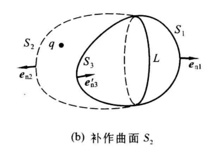
  - 设$S_1、S_2$的$\vec{E}$通量为$\phi_1、\phi_2$可得$$\phi_1+\phi_2=\frac{q}{\varepsilon_0}$$
  - 设$S_2、S_3$组成的闭合曲面为$S'$，因为约定：闭合曲面的法向为向外，所以设闭合曲面$S'$在$S_3$上的通量为$\phi_3$记为$\phi_3'$，则闭合曲面$S$在$S_3$上的通量为$-\phi_3$，则$S'$的通量有$$\phi_2+\phi_3=\frac{q}{\varepsilon_0}$$，两式相减得$$\phi_1-\phi_3=0=\phi_1+\phi_3'$$因此闭合曲线$S$的$\vec E$通量为0；

### n个点电荷对闭合曲面通量的贡献

- $n$个点电荷激发下的$\vec{E}$通量
  - 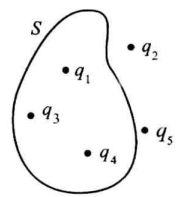
  - 电场强度叠加原理得$$\phi=\oiint_{s}\vec{E}\cdot\mathrm{d}\vec{S}=\oiint_{s}\sum\vec{E}_{i}\cdot\mathrm{d}\vec{S}=\sum\oiint_{s}\vec{E}_{i}\cdot\mathrm{d}\vec{S}=\sum{\phi}_{i}$$其中$\phi_i$是第$i$个点电荷$q_i$在$S$上的$\vec E$通量$$\phi_i=\begin{cases}\displaystyle \frac{q_i}{\varepsilon_0}&&q_i在曲面S内\\0&&q_i在曲面S外\end{cases}$$
  - 任意闭合曲面的$\vec{E}$通量为$$\phi=\frac{\displaystyle \sum q_{inside}}{\varepsilon_0}$$
  - 连续分布的电荷可分割为无限多的点电荷$dq$，同样适用上述公式，可推出高斯定理

- 高斯定理
  - 定义：静电场中任一闭合曲面的$\vec E$通量等于该曲面内电荷的代数和除以$ε_0$
  - 断言闭合曲面外的电荷对该曲面的$\vec{E}$通量没有贡献，但是对该曲面各点的电场强度有贡献
  - 因为闭合曲面外的电荷对闭合面各面元提供的通量有正有负才会导致对整个曲面的通量贡献为0
  - 库仑定律和叠加原理：从电荷分布求电场强度
  - 高斯定理：从电场强度求电荷分布

- 高斯定理求电场强度
  - 在电荷分布已知时，虽然原则上可由库仑定律和叠加原理求得各点的电场强度，但计算往往比较复杂
  - 当电荷分布具有某种对称性时，电场强度的计算可以由于应用高斯定理而大为简化

### 电荷均匀分布的无限大平面的电场强度
- 电荷均匀分布于一个无限大平面上，其面密度为$σ$，求其激发的静电场的电场强度
  - 假设电场强度不与平面垂直，将面绕垂线旋转$180^。$则电场强度理应转$180^。$，但是无限大平面旋转后电荷分布并未变化，仍然是均匀分布，所以电场强度理应不变；反证法可知电场强度与平面垂直
  - 
  - 过平面外一点$P$作与带电面平行的小平面$S_1$，并以$S_1$为底作一柱体垂直带电面，该柱体以带电面为对称轴$$\phi=\phi_{_1}+\phi_{_2}+\phi_{_\text{侧}}=\phi_{_1}+\phi_{_2}$$非闭合曲面$S_1$的通量$$\phi_1=\vec{E_1}\cdot \vec{S_1}=|\vec{E_1}|S_1=\phi_2$$(注意标量没有方向只有正负，因为电场强度和矢量面元同向，所以其通量一定为正)$$\phi=2|\vec{E_n}|S_n=\frac{\displaystyle q_{inside}}{\varepsilon_0}$$
  - 假定对应的法向量$\vec{e_n}$有$$\vec{E}=\frac{\sigma}{2\varepsilon_0}\vec{e_n}$$
  - 观察该公式：
    - 电场强度的方向受电荷面密度正负影响，当$\sigma>0$时，电场强度向外，否则，电场强度指向平面
    - 无限大平面的两侧是均匀电场
  - 对满足指定条件的场点，可将平面视为均匀带电无限大平面
- 均匀地带等量异号电荷的一对平行无限大平面
  - 以下过程是自己推导的过程，未验证
  - 电荷分布不改变，则电场强度不会改变，因此可以得出以下结论：
  - 平面之间存在匀强电场：方向垂直于平面，从正电面指向负电面；大小$\displaystyle \frac{\sigma}{\varepsilon}$
  - 平面之外电场为$\vec{0}$
- 尽管求解过程中仅使用圆柱所围的电荷，但是求得的$E$是整个无限大带电面贡献的电场强度
  - 将圆柱内的电荷贡献的电场强度设为$\vec{E}_{in}$，$$\vec{E}=\vec{E}_{in}+\vec{E}_{out}$$
  - $$\oiint_S \vec{E}\cdot\mathrm{d}\vec{S}=\frac{q_\text{内}}{\boldsymbol{\varepsilon}_0}$$
  - 同时将圆柱内的电荷单独拿出来，对场点的贡献为$$\oiint_S \vec{E}_{in}\cdot\mathrm{d}\vec{S}=\frac{q_\text{内}}{\boldsymbol{\varepsilon}_0}$$
  - 上述两式都成立，两个积分只说明圆柱的底面上$\vec{E}$通量相同，但是单独考虑$\vec{E}_{in}$时，在圆柱底面上既不与平面垂直，也不能从积分中提出，因此求不出$\vec{E}_{in}$

### 电荷均匀分布的球面

- 电荷$q$均匀分布于半径为$R$的球面上，求球内外的静电场的电场强度
  - 在球外作一同心球，其球面为$S$
  - 
  - $S$的$\vec{E}$通量为$$\phi=\oiint_{S}\vec E\cdot\mathrm{d}\vec S=\oiint_{S}E_{n}\mathrm{d}S=E_{n}\oiint_{S}\mathrm{d}S=E_{n}4\pi r^{2}$$其中$E_n$是电场强度$\vec E$在$\vec e_n$方向的投影
  - 由高斯定理得$$E_{_n}=\frac{q}{4\pi\varepsilon_0r^2}$$又$\vec e_r=\vec e_n$，得$$\vec E=\frac{q}{4\pi\varepsilon_0r^2}\vec e_r$$
  - 在求内作一同心球，其球面为$S'$，同理可得$$\phi=E_{n}4\pi r^{2}=\frac{\displaystyle q_{in}}{\varepsilon_0}$$因$S'$内的电荷量为0，因此$\vec E_{in}=\vec{0}$
  - 均匀带电球面内任一点的电场为零
  - 
- 电荷$q$均匀分布于半径为$R$的球体上，求球内外的电场强度
  - 球内电场强度大小$$E=\frac q{4\pi\varepsilon_0R^3}\boldsymbol{r}$$
  - 
- 高斯定理求电场强度需要一个适当的闭合曲面（高斯面）
  - 只有当电荷分布具有某种对称性时才可用高斯定理直接求电场
  - 在一般情况下，由已知电荷分布求电场的问题可用库仑定律配以叠加原理解决而不能单独用高斯定理解决
  - 这一事实说明，高斯定理只从一个侧面反映静电场的性质
- 对称性：以对称轴为轴心旋转，物体的电荷体密度$\rho$不会改变，将$\rho$视为以旋转中心的标量场，该函数仅与$r$有关
- 突变：电场强度的法向分量$\vec{E}$，在任意带电面的任一点（面密度为σ）都有突变，突变量都为$\displaystyle {σ\over ε_0}$
  - 这种突变是因为将薄层视为没有厚度引起的
  - 
  - 将薄层视为没有厚度的前提是，场点与平面的距离远远大于薄层的厚度
  - 当场点接近平面时不能再将该物体视为平面
  - 因此只要将物体视为薄层，询问其平面上的电场强度就是没有意义的

## 电场线

- 电场线：
  - 电场线的切线与电场强度平行
  - 穿过任意矢量面元的电场线条数$N$正比于该矢量面元的通量$$N=\phi=\oiint_Sk\vec{E}\cdot d\vec{S}$$
  - 定义电场线密度为$\displaystyle \frac{N}{S_\perp}$
  - 电场线密度正比于电场强度的大小$$\text{电场线密度}=\frac{kE\Delta S_{\perp}}{\Delta S_{\perp}}=KE$$
- 电场线的性质一
  - 电场线发自正电荷（或无限远），止于负电荷（或无限远），在无电荷处不中断
  - 构建三个高斯面：仅包括某个负电荷，仅包括某个正电荷，不包括电荷
- 电场线性质一的定量表述
  - 电场线发自（止于）点电荷所在处，点电荷$q$发出（终止）的场线条数为$$\frac{k|q|}{\varepsilon_{0}}$$
- 无限远的定义
  - 全宇宙电荷代数和为0；在研究某些电荷时，如果它们与其它电荷距离很远，那么将这些电荷视为一个系统，其电荷为$q$，全宇宙的其它所有电荷组成一个系统其电荷为$-q$
  - 这两个系统的距离视为无限远；电场线不能在没有电荷的地方终止或发出，所以只能在这无限远的距离上不断延申
  - 当足够靠近另一个系统时，电场线将弯曲并发自(止于)点电荷；
- 电场线的性质二：
  - 电势沿电场线方向不断减小，因而电场线不构成闭合曲线

## 电势

### 环路定理

- 试探电荷在点电荷$Q$激发的电场中移动
  - 
  - 试探电荷$q$从点$P_1$沿某一路径移到点$P_2$
  - 任意元位移$d\vec l$，设$q$在位移前后与$Q$的距离分别为$r$及$r'$，电场力$\vec F$在这一元位移上所做的元功$$dA＝\vec F\cdot d\vec l$$
  - 带入库仑定律$$\vec F=\frac{qQ}{4\pi\varepsilon_0r^2}\vec{e}_r$$得$$\mathrm{d}A=\frac{qQ}{4\pi\varepsilon_{0}r^{2}}\vec{e}_{r}\cdot\mathrm{d}\vec{l}=\frac{qQ}{4\pi\varepsilon_{0}r^{2}}\mathrm{d}l\cos\alpha=\frac{qQ}{4\pi\varepsilon_{0}r^{2}}\mathrm{d}r$$其中，$d\vec{l}$与$d\vec{r}$的夹角为$\alpha$,$dr=r'-r$(该信息似乎没有使用)
  - 注意$dr$的符号决定了元功的正负
  - 总功$$A=\int_{r_1}^{r_2}\frac{qQ}{4\pi\varepsilon_0}\frac{\mathrm{d}r}{r^2}=\frac{qQ}{4\pi\varepsilon_0}\Big(\frac{1}{r_1}-\frac{1}{r_2}\Big)$$
  - 上述公式说明，当点电荷$q$在任意静电场(由叠加原理可知不同电荷激发的电场同样适用)中运动时，电场力的功只取决于运动的始末位置而与路径无关
  - 势场：上述性质称为有势性，具有有势性的场称为势场；
- 环路定理
  - 矢量场$\vec{E}$沿闭合曲线$L$的环路积分(环流)：单位正点电荷在静电场$E$中沿某闭合曲线$L$运动一周的功$$\oint_L \vec E·d\vec l=0$$
  - 通过将闭合曲线分为两部分，分别使用做功的公式，可证静电场$E$沿任意闭合曲线的环流（环路积分）都为0
  - 有势性、环路定理可互相推导，是等价的表述
  - 矢量场不一定是有势场
- 电场线的性质二
  - 电场线不是闭合曲线；
  - 反证法：假设电场线是闭合曲线
  - 令单位正电荷沿电场线移动(电场线是有方向的，沿电场线默认从正电荷移至负电荷)，$\oint_L \vec E·d\vec l$中，$\vec{E}$与$d\vec{l}$的方向一直相同；积分后必定>0，不可能等于0；
- 高斯定理和环路定理都是由库伦定理、叠加原理推导出的静电场基本定理

### 电势与电势差

- 电势的引入：
  - 在电场中任取一点参考点$P_0$，将单位正电荷从点$P$沿任意路径移至$P_0$，其做功相同，即该功反映了场点$P$在电场中的性质
  - 电势：单位正电荷从$P$点移到参考点$P_0$时电场力的功叫做$P$点的电势（或电位），用$V$表示
  - 令电荷$q$从$P$移至$P_0$时的电场力做功为$$A={\int}_{P}^{P_0}\vec F\cdot d\vec l=qV$$电势与场强的关系$$V\equiv\frac{A}{q}=\frac{1}{q}{\int}_{P}^{P_0}\vec F\cdot d\vec l={\int}_{P}^{P_0}\vec E\cdot d\vec l$$
- 电场性质二的另一表述：电势沿电场线方向不断减小
- 电势场：标量场，参考点$P_0$称为零势点
  - 电势差/电压：场中任意两点电势之差$$V_{A}-V_{B}=\int_{A}^{B}\vec E\cdot d\vec l$$
  - 电场力做功$A$与电势的关系$$A=q(V_{_A}-V_{_B})$$
- 电压与电势
  - 电压不是标量场，对一点谈电势，对两点谈电压
  - 电压$U_{AB}=V_A-V_B$，因此$U_{AB}=-U_{BA}$
  - 当说明电势时，必须明确指出参考点
- 令参考点为无限远，点电荷$Q$的电场中$P$点的电势为$$V_{P}=\int_{P}^{P_{0}}\vec{E}\cdot\mathrm{d}\vec{l}=\frac{Q}{4\pi\varepsilon_{0}}\int_{r_{P}}^{\infty}\frac{\mathrm{d}r}{r^{2}}=\frac{Q}{4\pi\varepsilon_{0}r_{P}}$$其中$r_P$是点$P$离$Q$的距离
  - 如无特殊声明，就默认参考点在无限远
  - 电势的国际单位制单位由伏特$V=\displaystyle \frac{1J}{C}$，由公式$V=\displaystyle \frac{A}{q}$确定
  - 参考点能选在无限远的条件是：无限远处的所有点具有相同的电势，如果电荷连续分布到无限远处，该条件将不能被满足；

### 计算电势

- 当电荷分布已知时，可用如下两种方法计算电势
  - 用点电荷的电势公式$$V_{P}=\frac{Q}{4\pi\varepsilon_{0}r_{P}}$$因为该公式由库伦公式推导，所以电势同样满足电势叠加原理
  - 电荷以体密度$\rho$连续分布，将带电区域分为无限多个无限小体元$d\tau$，其电荷为$\rho d\tau$，其对场点$P$贡献的元电势为$$\operatorname{d}V=\frac{\rho\operatorname{d}\tau}{4\pi\varepsilon_0r},$$其中$r$是 $d\tau$ 与场点 $P$ 的距离.整个带电区域在 $P$ 点激发的电势为$$V=\frac{1}{4\pi\varepsilon_0}\iiint\frac{\rho d\tau}{r}$$积分遍及整个带电区域。当电荷按面密度$\sigma$连续分布于某曲面上时，电势公式为$$V=\frac{1}{4\pi\varepsilon_{0}}\iint\frac{\sigma\mathrm{d}S}{r}$$上述所有公式只对参考点在无限远的情况成立，当参考点不在无限远时，就不宜使用这种计算方法
- 用电势与电场强度的积分关系式$$V\equiv\int_{_P}^{P_0}\vec E\cdot\mathrm{d}\vec l$$使用本方法应选取一条积分曲线，并根据电荷分布求出该积分曲线上的各电场强度
- 求均匀带电圆盘轴线上的电势；已知圆盘半径为$R$，电荷面密度为$σ$，参考点在无限远
  - 因参考点在无限远且电荷在面上均匀分布，应使用电势叠加原理计算
  - 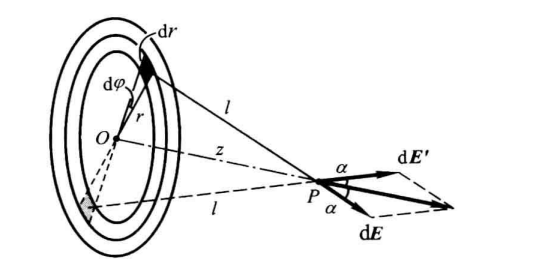
  - 使用极坐标划分面元；坐标为$r、\varphi$的面元的面积$ds＝rdφdr$，电荷为$\mathrm{d}q=\sigma\mathrm{d}S=\sigma r\mathrm{d}\varphi\mathrm{d}r$，该面元在轴上一点$P$贡献的电势为$$\mathrm{d}V=\frac{\sigma r\mathrm{d}\varphi\mathrm{d}r}{4\pi\varepsilon_{_0}\sqrt{r^2+z^2}},$$整个圆盘在$P$点贡献的电势为$$V=\iint\frac{\sigma r\mathrm{d}\varphi\mathrm{d}r}{4\pi e_{0}\sqrt{r^{2}+z^{2}}}=\frac{\sigma}{4\pi e_{0}}\int_{0}^{2\pi}\mathrm{d}\varphi\int_{0}^{R}\frac{r\mathrm{d}r}{\sqrt{r^{2}+z^{2}}}=\frac{\sigma}{2\varepsilon_{0}}(\sqrt{R^{2}+z^{2}}-z)$$
  - 
  - 尽管场强在面上突变，但是电势没有变化，将该平面还原为厚度为$\omega$的层，当$\omega\to 0$时，功$A\to 0$
- 求均匀带电球面内外的电势，已知球半径为$R$，电荷为$q$，参考点在无限远
  - 
  - 本题可用上述两种方法的任一种求解
  - 球心$O$，已知场强$$\vec E=\begin{cases}\dfrac{q}{4\pi\varepsilon_0r^2}\vec{e}_r&(r>R)\\[2ex]0&(r<R)\end{cases}$$
  - 球外(包括球面)一点$P$与球心的距离$r$$$V_p=\int_{P}^{P_0}\vec E\cdot\mathrm{d}\vec l$$选取球心为原点，球心与点$P$的连线为$x$轴$$V=\frac{q}{4\pi\varepsilon_{_0}r}\quad(r\ge R),$$
  - 再在球内取一点$B$，其与$O$的距离亦以$r$表示
  - 
  - 选$OB$的延长线为积分路径，因球内外电场强度的函数关系不同，积分要分为两段，注意到电势在带电面上无突变$$V=\int_{B}^{C}\vec{E}\cdot\mathrm{d}\vec{l}+\int_{C}^{P_{0}}\vec{E}\cdot\mathrm{d}\vec{l}=0+\int_{R}^{\infty}\frac{q}{4\pi\varepsilon_{0}}\frac{\mathrm{d}r}{r^{2}}=\frac{q}{4\pi\varepsilon_{0}R}\quad(r<R)$$
  - 

### 等势面

- 等势面：静电场中电势相等的点组成的曲面
  - 点电荷场的等势面是以电荷所在点为心的同心球面
  - 均匀带电无限大平面的场的等势面是与带电面平行的平面
  - 两个等值异号点电荷的场:其中虚线是等势面
- 等势面的重要性质：处处与电场线垂直
  - 反证法：假定在某点$P$等势面的切平面与电场线夹角$α≠\displaystyle \frac{\pi}{2}$，则沿等势面做功不为0，与假设矛盾
- 过电场中的任一点都可以作等势面
  - 为使等势面透露电场强度大小的信息，现附加规定：场中任意两个相邻等势面的电势差为常量
  - 因为电势差是电场强度沿线积分，所以等势面密度与电场强度呈正相关
  
### 电势与电场强度的微分关系

- 作点$P_1、P_2$的等势面$S_1、S_2$，其电势$V_1、V_2$，等势面之间的距离$\Delta n$
  - 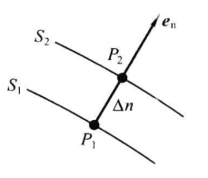
  - 电势差$$V_{1}-V_{2}=\int_{p_{1}}^{P_{2}}\vec{E}\cdot\mathrm{d}\vec{l}=\int_{P_{1}}^{P_{2}}E_{n}\vec{e}_{n}\cdot\mathrm{d}\vec{l}=\int_{P_1}^{P_2}E_n\mathrm{d}l$$因为$\Delta n\to 0$所以等势面之间某连线上的$\vec{E}$近似认为处处相等$$V_{_1}-V_{_2}=E_{_n}\Delta n$$令$\Delta V=V_1-V_2$可得$$E_n=\frac{\Delta V}{\Delta n}$$或$$\vec{E}=\frac{\Delta V}{\Delta n}\vec{e_n}$$其中$\vec e_n$是等势面法线
- 从上述结论不难看出
  - 一点的电场强度方向与过该点的等势面垂直，而且指向电势减小的方向
  - 某点电场强度的大小等于该点电势沿等势面法向的变化率，也就是说电场强度与单个点的电势无关而只与电势变化率有关
    - 在电势为0的地方场强可以不为0
    - 如果在单个点的领域中电势为0，则场强一定为0；
  - 因为以上推导只在$P_2\to P_1$的极限情况下成立，因此上述推论应严格写为$$\vec{E}=-\left(\lim\limits_{P_2\to P_1}\frac{\Delta V}{\Delta n}\right)\vec{e}_n=-\frac{\partial V}{\partial n}\vec{e}_n$$其中$\frac{\partial V}{\partial n}$是标量场$V(x,y,z)$沿等势面法向方向的导数；
- 根据标量场电势的分布$V(x,y,z)$求电场强度时，只需通过微分求某点的电势变化率，即可求得电场强度

# 有导体时的静电场

- 术语
  - 带电导体：总净电荷不为零的导体
  - 中性导体：总净电荷为零的导体
  - 孤立导体：与其他物体距离足够远的导体
  - 足够远：
    - 其他物体的电荷在我们所关心的场点上激发的电场强度小到可以忽略
    - 因此，物理上就可以说孤立导体之外没有其他物体

## 静电场中的导体

### 静电平衡

- 静电平衡
  - 静电平衡态：导体中的所有自由电子不做宏观运动，只做无规则的微观运动（热运动）
  - 电流的形成：自由电子受电场力影响，在热运动的基础上附加一种有规则的宏观运动
  - 没有非静电力时导体达到静电平衡态的必要条件：导体内部各点电场强度为零
  - 有非静电力时导体达到静电平衡态的必要条件：导体内电子受力处处为零，要求导体内部某些点的静电场的电场强度恰恰不能为零
- 静电感应
  - 
  - 设B是中性导体，在周围没有带电体时，它的内部及表面电荷密度处处为零，从而内部各点电场强度为零
  - 感生电荷与施感电荷A在中性导体B内各点激发的合电场强度为零时，B重新达到静电平衡，但这已经是一种新的平衡状态
  - 静电平衡态会因外界条件的变化而遭到破坏，但是在新的外界条件下又会达到新的平衡
- 静电平衡的性质
  - 由静电平衡的必要条件：导体内部电场强度处处为0可推导以下性质
  - 性质一：导体是等势体，导体表面是等势面
    - 任取导体表面或导体内两点，因电场强度处处为0，所以两点连线的线积分为0，两点等势
  - 性质二：导体内部电荷体密度为零，电荷只能分布在导体表面（用我自己的语言描述：导体内部每个微元的净电荷量为0，净电荷不为0只能在导体表面显示）
    - 在导体内部作一高斯面，因电场强度处处为0，所以$\vec E$通量为0，所以高斯面内部的净电荷量为0
    - 在导体表面作一高斯面，总有一部分在导体外部，而导体外的电场强度是可以非0的，因此表面处可以有（净）电荷
  - 对带电导体，其电荷既然不能存在于内部，就只能以某种面密度分布于表面
  - 对中性导体，其表面也可能由于外界影响而出现电荷面密度（某些地方为正，某些地方为负，代数和为零）
  - 性质三：在导体外部，紧靠导体表面的点的电场强度方向与导体表面垂直，电场强度大小与导体表面对应点的电荷面密度成正比
    - 
    - 导体表面是等势面+电场线与等势面垂直->导体表面附近的电场强度与表面垂直
    - 取如图高斯面
      - 圆柱体在导体内部的部分处处电场强度为0，因此底面和在导体中的侧面没有通量
      - 圆柱体在导体外的部分其电场强度与底面垂直，侧面通量为0，整个圆柱体的高斯通量为$$\vec E\cdot \Delta \vec S$$
      - 由高斯定理可得：$$\vec E\cdot \Delta \vec S=\frac{\sigma \Delta S}{\varepsilon_{0}}$$
      - 因此$$\vec E=\frac{\sigma}{\varepsilon_{0}}\vec {e_{_n}}$$
  - 性质三可表示为$$\left.\vec{E}\left(\begin{matrix}P_{i}\end{matrix}\right.\right)=\frac{\sigma\left(\begin{matrix}P_i\end{matrix}\right)}{\varepsilon_{_0}}\vec{e}_{_n}$$
  - 理解该性质的重要切入点：导体表面某点的电场强度大小仅由面密度决定，但是该点的面密度是由其它地方的所有电荷决定的
### 带电导体所受的静电力

- 一面元$\Delta S$视为点电荷$P$，其它所有电荷在$P$点激发电场强度$E^{'}(P)$，该面元所受静电场力为$$\Delta\vec {F}=\vec {E}^{\prime}({P}){\sigma}\Delta S$$假设$P_1$是点$P$沿法线稍外的一点，$P_1$点的电场强度为$$\left.\vec E\left(\begin{array}{c}P_1\end{array}\right.\right)=\frac{\sigma}{\varepsilon_0}\vec {e}_n$$将其分解为两部分$$\left.\frac{\sigma}{\varepsilon_{0}}\vec e_{n}=\vec E\left(\begin{array}{c}P_{1}\\\end{array}\right.\right)=\vec E_{\Delta S}\left(\begin{array}{c}P_{1}\\\end{array}\right)+\vec E^{\prime}\left(\begin{array}{c}P_{1}\\\end{array}\right)$$其中$\left.\vec{E}_{\Delta S}\left(\begin{array}{cc}{P_{1}}\end{array}\right.\right)$是小面元在$P^{'}$的电场强度，$\vec E^{\prime}P_{1}$是除小面元之外所有电荷在$P^{'}$的电场强度；因为$P^{'}$无限靠近面元$\Delta S$，因此面元$\Delta S$对$P^{'}$可视为无限大均匀带电平面，因此$$\vec E_{\Delta S}(P_{_1})=\frac{\sigma}{2\varepsilon_0}\vec e_{_n}$$相减可得$$E^{\prime}(P_{_1})=\frac{\sigma}{2\varepsilon_0}e_n$$总电场强度在$P$点有突变，但是除面元$\Delta S$的电荷在$P$点激发的电场强度是连续的，因此$$\boldsymbol{E}'(P)=\boldsymbol{E}'(P_{_1})=\frac{\sigma}{2\boldsymbol{\varepsilon}_0}\boldsymbol{e}_n$$带入可得该面元所受的静电场力$$\Delta\vec{F}=\frac{\sigma^2\Delta S}{2\varepsilon_0}\vec{e}_n$$
- 上述式子即导体表面任意面元所受的静电场力，沿导体表面积分即可求得导体所受静电场力
- 事实：导体静电平衡时，导体表面稍微往里的电场强度为0，导体表面稍微往外的电场强度为$$\vec E=\frac{\sigma}{\varepsilon_{0}}\vec {e_{_n}}$$
  - 上述推导表明这种突变完全是由于$\Delta S$在导体表面稍微往外和稍微往里的地方，所激发的电场强度突变所造成的，分别为$$\frac\sigma{2\varepsilon_0}\vec e_n、-\frac\sigma{2\varepsilon_0}\vec e_n$$
  - 除面元$\Delta S$外的所有电荷在导体表面、导体表面稍微往外、导体表面稍微往里的地方所激发的电场强度是连续的，因此都相等，都为$$\frac\sigma{2\varepsilon_0}\vec e_n$$
### 孤立导体形状对电荷分布的影响

- 上一节的结论表明：电荷在导体表面的分布不但与导体自身形状而且与其外界条件有关
- 只有孤立导体的电荷分布才由自身的形状及电荷总量决定
  - 孤立导体表面，向外突出的地方（曲率为正且较大）电荷较密
  - 孤立导体表面，比较平坦的地方电荷较疏
  - 孤立导体表面，向里凹进的地方（曲率为负）电荷最疏
  - 
- 尖端放电
  - 在尖端附近，电场较强，可能导致空气电离成导体，形成尖端放电现象
  - 高压导体表面应保持光滑以减少尖端放电
  - 避雷针通过尖端放电引导雷电流，保护建筑和设备
- 孤立导体形状与电荷分布的关系
  - 对于某些具有规则形状的孤立导体，可以从理论上证明曲率与$|\sigma|$呈正比关系
  - 但对于某些形状的孤立导体，该结论并不适用
- 考虑两个半径不同的金属球$A$和$B$，用细导线连接两球，其整体可看成一个孤立导体，令这个孤立导体带电，我们分两种情况讨论其电荷面密度与曲率的关系
- 情况一：两球相距足够远（即细导线足够长）的情况
  - 由于相距足够远，每个球的电荷对另一球的电场的影响可以忽略；由于导线很细，其表面的电荷总量及其对导体外电场的影响也可忽略；因此，每个球都可近似看做孤立导体球
    - 物理学家相信这样的故事：这根细导线很细，其表面没有电荷，唯一的作用就是传输电荷知道两个球等势
    - 等势以后再撤去细导线，两球的电荷分布不会有任何变化
  - 根据球对称性，电荷在两球表面均匀分布；设两球电荷分别为$q_A$和$q_B$，半径分别为$R_A$和$R_B$
  - 每球的电势为$$V_{_A}=\frac{q_{_A}}{4\pi\varepsilon_{_0}R_{_A}},\quad V_{_B}=\frac{q_{_B}}{4\pi\varepsilon_{_0}R_{_B}}$$因为二者用导线相连，所以电势相等$$\frac{q_{\lambda}}{4\pi\varepsilon_{0}R_{_{A}}}=\frac{q_{_{B}}}{4\pi\varepsilon_{_{0}}R_{_{B}}}$$所以$$\frac{q_A}{q_B}=\frac{R_A}{R_B}$$由于电荷在两球上均匀分布$$\sigma_{_A}=\frac{q_{_A}}{4\pi R_{_A}^{2}},\quad\sigma_{_B}=\frac{q_{_B}}{4\pi R_{_B}^{2}}$$因此$$\frac{\sigma_{_A}}{\sigma_{_B}}=\frac{q_{_A}}{q_{_B}}\frac{R_{_B}^2}{R_{_A}^2}=\frac{R_{_B}}{R_{_A}}$$因此电荷面密度与半径成反比，即与曲率成正比
- 情况二：两球相距不远
  - 受彼此电荷激发的电场影响，电荷分布不再均匀，然而同一球面各点的曲率相同
- 总结以上的推导
  - 对于某些形状的孤立导体，其曲率与电荷面密度的绝对值成正比
  - 对于某些形状的孤立导体，其电荷分布不仅受形状的影响还受其它因素的影响，自然曲率与电荷面密度不具有该结论

### 导体静电平衡问题的讨论方法

- 数学解决静电平衡
  - 求导体在静电平衡时的受力情况时，需要对以下式子进行积分$$\Delta\vec{F}=\frac{\sigma^2\Delta S}{2\varepsilon_0}\vec{e}_n$$
  - 问题是不可能预先知道导体所有面元的面电荷密度，可以作为已知条件的只有电荷量和电势，在分析经典平衡时可知，所有电荷激发的电场决定了每个面元处的面电荷密度，因此只能先求电场强度再求面电荷密度
  - 已知电场强度可求该点的面电荷密度，已知所有点位的面电荷密度可求该点的电场强度，因此二者总是捆绑在一起
  - 因此本节在定性范围内解决尽量多的问题，利用电场线将高斯定理和环路定理具象化，在避免想当然的同时避免繁琐的数学知识
- 例一：
  - 证明下述系统，感生负电荷的电量小于等于施感电荷的电量
  - 
  - 感生负电荷处一定有电场线止于此处，其来源可能有三种
    - 施感电荷A，感生正电荷，无限远处正电荷
    - 假设是感生正电荷，因为静电平衡的导体表面等势，因此电场线起点和终点等势，假设错误
    - 假设是无限远，由电场线性质可得电势关系$V_{\infin}>V_{B}$，又因为感生正电荷发出的电场线不能终于感生负电荷，所以只能终于无限远处，因此由电势关系可得$V_{B}>V_{\infin}$，二者矛盾
  - 因此，终于感生负电荷的电场线只能起于施感电荷
  - 终止的条数只能小于或等于发出的条数
  - 止于/发出电荷的场线条数正比于电荷量
  - 因此感生负电荷的电荷量小于等于施感电荷的电荷量
  - 因为施感电荷发出的电场线往往有些不止于感生负电荷，所以往往感生负电荷的电荷量小于施感电荷的电荷量
  - 
- 例二
  - 
  - 中性封闭金属壳内有正点电荷q，求壳内、外壁感生电荷的数量
  - 从电场线出发解决该问题
    - 正点电荷q发出的电场线条数正比于q
    - 正点电荷发出的电场线既不能在无电荷处中断，又不能穿过导体（内部电场强度为零），就只能止于壳的内壁，故壳内壁的总电荷为$—q$
    - 已知壳为中性，内外壁电荷代数和必须为零，故外壁总电荷为$q$
    - 上述证明过程并未要求壳外没有带电体，因此所得结论不论壳外有无带电体都正确
    - 因此壳外带电体的存在只影响壳外壁电荷的分布而不影响外壁的电荷总量
  - 使用高斯定理直接求解
    - 在金属壳的内部作一高斯面（图中的虚线），因导体内部没有电场线/$\vec E$通量，所以高斯面内的电荷量为0；
- 例三：两个带正电导体互相靠近
  - 两者的电荷分布都要发生变化，其中一个导体甚至有一端会出现负电荷
  - 但是可以证明在两个导体中至少有一个导体，其表面任意两点的$\sigma$是同号的
  - 假设两个导体都有一端出现负电荷，如图所示
  - 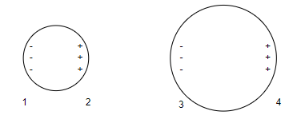
  - 2处正电荷发起的电场线必定有部分止于3处因此可得以下电势关系$$V_1=V_2>V_3=V_4$$又因为止于1处的电场线来自无穷远，4处发出的电场线终于无穷远，因此具有如下关系式$$V_\infin>V_1,V_4>V_\infin$$联系两个关系式$$V_\infin>V_1=V_2>V_3=V_4>V_\infin$$矛盾
  - 因此结论得证：两个带相同性质电荷的带电导体相互靠近时，至少有一个导体其表面任意两点的面电荷密度同号；
- 例四
  - 
  - 导体$B$接地，试证$B$上不再有$\sigma>0$的点
  - 导体接地问题：默认$V_地=V_\infin$
  - 假设导体B上存在面元$S$的$\sigma>0$，则其发出的电场线只能止于无限远，因此$V_S>V_\infin$，又因为导体B静电平衡表面等势，所以$V_S=V_\infin$
  - 假设从异性相吸同性相斥的角度分析，导线接在感生负电荷处，似乎电荷无法流入导体B，因此电场线是解决静电平衡的有力工具
- 例五 
  - 
  - 半径为 $R$、电荷为$Q$的金属球外有一个距球心为$l$的点电荷$q$，求金属球的电势（参考点在无限远处）
  - 因为金属球静电平衡，所以金属球的电势与$O$点电势相同
  - $$V_{o}=\frac{q}{4\pi\varepsilon_{0}l}+\iint_{s}\frac{\sigma^{\prime}\mathrm{d}S}{4\pi\varepsilon_{0}R}=\frac{q}{4\pi\varepsilon_{0}l}+\frac{1}{4\pi\varepsilon_{0}R}\oint_{s}\sigma^{\prime}\mathrm{d}S=\frac{q}{4\pi\varepsilon_{0}l}+\frac{Q}{4\pi\varepsilon_{0}R}$$
- 例六
  - 半径为$R$的接地金属球外有一个距球心为$l$的点电荷$q$，求金属球的电荷$q'$
  - 因为金属球接地，所以其电势为$0$，所以$$0=\frac{q}{4\pi\varepsilon_{0}l}+\iint_{s}\frac{\sigma^{\prime}\mathrm{d}S}{4\pi\varepsilon_{0}R}=\frac{q}{4\pi\varepsilon_{0}l}+\frac{1}{4\pi\varepsilon_{0}R}\oint_{s}\sigma^{\prime}\mathrm{d}S=\frac{q}{4\pi\varepsilon_{0}l}+\frac{Q}{4\pi\varepsilon_{0}R}$$所以$$q'=-q\frac{R}{l}$$
- 例五和例六体现了一个重要的定理
  - 例五：已知导体的电荷$Q$而欲求电势$V$
  - 例六：已知导体的电势$V$而欲求电荷$Q$
  - 静电唯一性定理：
    - 指定$A$的电荷分布，可以求$B$的电势，从而求$A、B$的电荷和电势
  - 对于某一区域$V$，给定其内部的自由电荷分布$\rho(x)$且边界$S$处下列条件满足其中一个：
    - 1.给定$S$上的电势分布 $\varphi_{s}$
    - 2.给定电势在$S$上法线方向的方向导数 $\displaystyle\frac{\partial \varphi}{\partial n}|{s}$
- 例七：无限大接地导体板在点电荷q影响下的感生电荷面密度的计算
  - 
  - 无限大接地金属平板左侧有一与板距离为$l$的点电荷$q$，求金属板表面的感生电荷面密度$\sigma'$及左壁总电荷
  - 金属板接地后电势为0，由静电平衡金属板内部场强和电荷体密度为0
  - 假设右侧电荷面密度$\neq 0$，则无穷远处发出的电场线会止于右侧电荷面密度，电势$V_{右侧}<V_\infin$，与既有事实矛盾，因此无限大金属平板接地的一侧电荷面密度总是为0
  - 取左侧包含点$A$的面元$\Delta S$，点$A$靠金属板内侧的极尽处点$B$，$\vec {e_n}$是从$A$指向$B$的法向量
    - 点电荷$q$在点$B$处激发的电场$$\vec{E}_{1}(B)=\frac{q}{4\pi\boldsymbol{\varepsilon}_{_0}l^{2}}{\cos}^{2}\theta\vec{e}_r$$沿$\vec {e_n}$的法向分量为$${E}_{1n}(B)=\frac{q}{4\pi\varepsilon_{0}l^{2}}{\cos}^{3}\theta$$
    - 面元$\Delta S$在点B处激发的电场可视为无限大平面所激发的电场$$E_{{2n}}(B)=\frac{\sigma^{\prime}(A)}{2\boldsymbol{\varepsilon}_{0}}$$
    - 金属板除面元$\Delta S$外其它所有面元在B处激发的电场在A、B处连续，显然这些面元在A处激发的电场平行金属侧面，因此$$\left.E_{3n}\left(\begin{array}{c}A\\\end{array}\right.\right)=\left.E_{3n}\left(\begin{array}{c}B\\\end{array}\right.\right)=0$$
    - 综上所述$B$点的总电场强度的法向分量为$$\left.E_{_n}\left(\begin{matrix}B\end{matrix}\right.\right)=E_{_{1n}}\left(\begin{matrix}B\end{matrix}\right)+E_{_{2n}}\left(\begin{matrix}B\end{matrix}\right)+E_{_{3n}}\left(\begin{matrix}B\end{matrix}\right)=\frac{q}{4\pi\varepsilon_{_0}l^{2}}\mathrm{cos}^{3}\theta+\frac{\sigma^{\prime}\left(\begin{matrix}A\end{matrix}\right)}{2\varepsilon_{_0}}$$因为B点是导体内一点，其电场强度应为0，因此$$\sigma'(A)=-\frac{q}{2\pi l^{2}}{\cos}^{3}\theta$$
  - 由上述推论可得
    - 金属板左侧的电荷面密度与施感电荷异号
    - 电荷面密度关于施感电荷与金属板的垂线对称分布
    - 距离施感电荷越远，电荷面密度越小
    - 积分可证明，金属板左侧带电量为$Q=-q$
- 例八：无限大导体板在点电荷q影响下的感生电荷面密度
  - 假设金属板不接地
  - 右侧电荷均匀分布，考虑金属板是无限大的平板，因此右侧面电荷密度仍为0
  - 左侧电荷面密度仍遵从上述推导
  - 因此不接地时，仍维持上述结论
### 平行板导体组
- 例1
  - 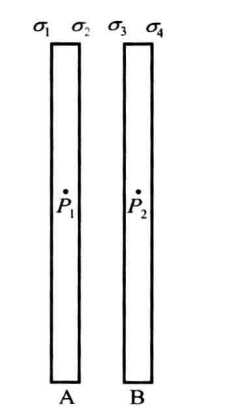
  - 长宽相等的金属平板$A$和$B$在真空中平行放置，板间距离比长宽小得多；分别令每板带$q_A、q_B$电荷，求每板表面的电荷面密度
  - 因为板的长宽比距离大得多，所以将金属板近似为无限大
  - 假设两板四壁电荷不是均匀分布，则在垂直金属壁的线在导体中的部分一定无法做到体电荷密度为0，因此两板四壁的电荷均匀分布，同时将金属板视为无限大则不考虑边缘，将其电荷面密度依次记为$\sigma_1、\sigma_2、\sigma_3、\sigma_4$
  - 在$A$板内取一点$P_1$，设$\vec e_n$是向右的单位法矢量，四个无限大带电平面在$P_1$的合电场强度为$$\vec{E}=\frac{\sigma_{1}}{2\boldsymbol{\varepsilon}_{0}}\vec{e}_{n}-\frac{\sigma_{2}}{2\boldsymbol{\varepsilon}_{0}}\vec{e}_{n}-\frac{\sigma_{3}}{2\boldsymbol{\varepsilon}_{0}}\vec{e}_{n}-\frac{\sigma_{4}}{2\boldsymbol{\varepsilon}_{0}}\vec{e}_{n}=0$$因此$$\sigma_{_1}-\sigma_{_2}-\sigma_{_3}-\sigma_{_4}=0$$同理，在B内取一点$P_2$有$$\sigma_{_1}+\sigma_{_2}+\sigma_{_3}-\sigma_{_4}=0$$因此$$\sigma_{_1}=\sigma_{_4},\quad\sigma_{_2}=-\sigma_{_3}$$
  - 因为是四个未知数，所以尚需两个方程，假设壁的面积为$S$，则$$q_{A}=\sigma_{_1}S+\sigma_{_2}S,\quad q_{B}=\sigma_{_3}S+\sigma_{_4}S$$联立解方程$$\sigma_{1}=\sigma_{4}=\frac{q_{A}+q_{B}}{2S},\quad\sigma_{2}=-\sigma_{3}=\frac{q_{A}-q_{B}}{2S}.$$
- 上述结论可用于讨论多种情况
  - 假设$q_{_A}=-q_{_B}$，则$$\sigma_{1}=\sigma_{4}=0,\quad\sigma_{2}=-\sigma_{3}=\frac{q_{A}}{S}$$
    - 例如用电池对平板电容器充电时，电荷只分布在金属板内壁两侧
  - 假设$q_{_A}=q_{_B}$，$$\sigma_{1}=\sigma_{4}=\frac{q_{4}}{S},\quad\sigma_{2}=-\sigma_{3}=0$$
    - 令金属板分别带上相同电量，电荷只分布在金属板外壁两侧；
  - 假设$q_{A}=\displaystyle\frac{-5q_{B}}{2}$，则
    - $$\sigma_{_1}=\sigma_{_4}=\frac{3q_{_4}}{10S},\quad\sigma_{_2}=-\sigma_{_3}=\frac{7q_{_\lambda}}{10S}$$
- 例2
  - 
  - 在上例两板间插入长宽相同的中性金属平板C，求六个壁的电荷面密度．
  - 每板内取一点可列三个方程，由三板的电荷又可列三个方程.联立求解得
  - $$\sigma_{1}=\sigma_{6}=\frac{q_{A}+q_{B}}{2S},\quad\sigma_{2}=-\sigma_{3}=\sigma_{4}=-\sigma_{5}=\frac{q_{A}-q_{B}}{2S}$$
  - 中性板的插入不改变原来两板的电荷分布，但中性板两壁却出现等值异号电荷
## 封闭金属壳内外的静电场

- 把导体（哪怕是中性导体）引进静电场中，电场就会因导体电荷的重新分布而改变
- 利用这个事实，可以根据需要人为地选择导体的形状来改造电场
- 这种改造应用很广，例如：
  - 用封闭金属壳把电学仪器罩住可使仪器免受外界影响，因为壳外电荷在壳内空间激发的电场强度为零
### 壳内空间的场

#### 壳内空间无带电体的情况
- 壳内空间无带电体时，壳内空间各点电场强度必然为0
  - 设壳内有一点$P$的电场强度不为零
  - 因为电势下降梯度反映电场强度，又因为壳内电场强度为0，所以该点必定在某条电场线上，这条电场线起于壳内壁某点，止于壳内壁某点
  - 因此壳内空间无带电体时，各点电场强度为零
  - 注意
    - 上述结论是结果而不是过程，即壳外任意点电荷$q$都遵从库仑定律，在壳内激发电场
    - 壳内空间电场强度之所以为零，只是因为外壳处的感生电荷分布和壳外点电荷遵从电场叠加原理，导致壳内空间任一点合电场强度为零
  - 总结上述推论，壳外全部电荷，包括壳外壁电荷，在壳内空间贡献的合电场强度为零
- 因为壳内电场强度处处为0，外壳与内壳之间电场强度处处为0，所以壳内壁的电荷面密度处处为0
#### 壳内空间有带电体的情况
- 壳内空间将因壳内带电体的存在而出现电场，壳的内壁也会出现电荷分布
- 但是可以证明，这一电场只由壳内带电体及壳的内壁形状决定而与壳外电荷分布情况无关，壳外电荷对壳内电场仍无影响
- 利用唯一性定理可以给出简洁而严格的证明

### 壳外空间的场

#### 壳外无带电体的情况
- 壳外无带电体时
  - 
  - 设壳为中性，壳内有一正点电荷$q$
  - 由高斯定理可证，壳的内壁的感生电荷分别为$—q$；由电荷守恒定律可知外壁的电荷为$q$
  - 由高斯定理可知，壳外空间的电场由外壁的电荷分布决定，是壳内电荷通过在壳外壁感应出等量电荷间接引起的
  - 壳内电荷仍遵从库仑定律，和内壁电荷在壳外的合电场强度为0；
- 现将金属壳接地消除壳外电场
  - 
  - 由于外壳和无限远处电势都为0，因此壳外空间不能存在电场线；
  - 地线的存在能过交换电荷保证壳的电势为0，但是不能保证电荷面密度为0
#### 壳外有带电体的情况

- 首先讨论壳内无电荷
  - 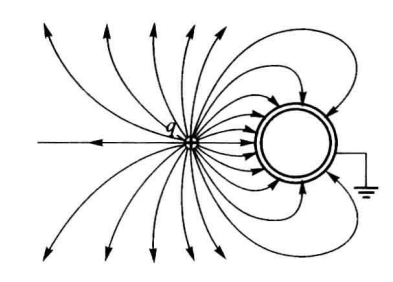
  - 假设外壳面密度为0，则整个空间只有一个点电荷$q$，其壳内空间电场强度必定不为0；因此外壳面密度不全是0；
  - 因此，接地不能保证面密度处处为0
- 假设壳内有电荷
  - 
  - 接地壳保证壳外电场不受壳内电荷的影响，即不管壳内带电情况如何，壳外电场只由壳外情况决定
  - 如果球壳不接地且为中性，则壳外壁总电荷为零，但因壳外正点电荷q的存在，壳外壁有左负右正的电荷分布，这一分布与q联合决定壳外电场
  - 如果球壳不接地且为中性，在壳内放置一点电荷$q_1$，则外壁电荷亦为$q_1$，故外壁的电荷分布必然与壳内无电荷时不同
- 综上所述可知：
  - 不论接地与否，封闭金属壳内部静电场不受壳外电荷影响，壳内电荷无法直接影响壳外电场，只能通过感生电荷间接影响壳外静电场
  - 静电屏蔽：接地时，封闭金属壳外部静电场不受壳内电荷影响
- 现在用数学描述上述结论
  - 壳内空间电荷、壳内壁电荷、壳外壁电荷、壳外部电荷分别为$q_1、q_2、q_3、q_4$
  - 不论壳是否接地，$q_1、q_2$在壳内壁之外任一点的合电场强度为0
  - 不论壳是否接地，$q_3、q_4$在壳外壁之内任一点的合电场强度为0
  - 以中性金属球壳为例．设壳内有一点电荷$q$，壳外为真空
    - 若$q$位于球心，由对称性可以肯定壳内外的电场线都为均匀辐射状，等价地，电荷在球壳外壁均匀分布
    - 
    - 若$q$改为偏心，在球壳内外壁之间任取一点$P$，一方面，由于$P$位于金属内部，其电场强度$E_P$应该为零。另一方面，根据上面的结论，$q$与内壁电荷$—q$在内壁之外任一点的合电场强度为0，所以$E_p$完全来自球壳外壁的电荷
    - 均匀分布于球面上的电荷在面内任一点的电场强度为零，因此，为了保证$q$偏心后$E_p=0$，外壁电荷不需作任何调整，仍均匀分布
    - 由此可知，$q$偏心时球壳外部的静电场与$q$在球心时的静电场完全相同
    - 
  - 因此在确定外壁电荷和壳外电荷后，就可以确定壳外的电场线，而无需考虑壳内的电荷分布

## 电容器及其电容

### 孤立导体的电容

- 本节讨论孤立导体电势与电荷的关系
- 孤立带电导体球
  - 电荷$q$均匀分布于半径为$R$的球面，则其电势为$$V=\frac{q}{4\pi\varepsilon_0R}$$即，电势与电荷成正比
- 可证明任何形状的孤立导体其电势与电荷成正比关系$$q=CV$$其中常量$C$为孤立导体的电容
- 电容取决于导体的几何因素，对导体球，$C=4\pi \varepsilon_0R$，即使电势升高一个单位所需的电荷
- 电容单位记为$F$，法拉
  - 因为实用中法拉太大，所以取微法$\mu F=10^{-6}，pF=10^{-12}$

### 电容器及其电容

- 在一个带电导体附近置入其他导体，这个带电导体的电势就会受到影响，电势与电荷的正比关系就不复成立
  - 使用最多的就是两个导体组成的电容器
  - 电容器：能够有效存储电荷的装置
  - 常见的电容器有圆柱电容器及平板电容器两种，球形电容器虽然用得不多，但能严格满足电容器的要求
#### 球形电容器
- 球形电容器：一个金属球和一个与它同心的金属球壳组合的系统
  - 
  - 因为球内电场强度为0，因此电荷在球外壁、壳内壁均匀分布
  - 因为壳中电场强度为0，由高斯定理可知，球外壁、壳内壁的电荷等值异号
  - 球形电容器的电荷等于球的电荷$q$的绝对值，记为$Q$
- 外球外壁的电荷分布受球外电荷分布影响可能很复杂，由于球壳的屏蔽作用，壳与球间的电场线总是均匀辐射状的
  - 
- 两球间的电压$U$为壳与球电势差的绝对值，电压$U$与球形电容器的电荷$Q$成正比
  - 若两球间的电场表示为$E$，则两球电势差$V_1-V_2=\vec E·\vec dl$，$$\vec E=\frac{q_1}{4\pi\varepsilon_0r^2}\vec {e}_r,R_1<r<R_2$$壳和球的半径分别为$R_2、R_1$，球电荷为$q_1$，$\vec e_r$为外向单位矢量$$V_1-V_2=\frac{q_1}{4\pi\varepsilon_0}{\int_{R_1}^{R_2}\frac{\mathrm{d}r}{r^2}=\frac{q_1}{4\pi\varepsilon_0}\frac{R_2-R_1}{R_1R_2}}$$
  - 因此$$U=\frac{R_{2}-R_{i}}{4\pi\varepsilon_{0}R_{1}R_{2}}Q$$
- 综上所述
  - 球形电容器的电压与电荷成正比，受益于球壳的静电屏蔽作用，无论外球外部带电体的情况如何改变，电压与电荷之间的比例系数都保持不变
  - 但实际上往往不要求这样严格的屏蔽，只要距离比板的长、宽都小得多，不论板外情况如何，板间的电场就基本上是均匀电场（边缘地区除外）
#### 平行板电容器
- 电池对平行板电容器充电，两板的电荷等量异号
- 可证明两板间的电压$U$与一板内壁电荷的绝对值$Q$（称为平板电容器的电荷）成正比$$U=\frac{d}{\varepsilon_{0}S}Q$$

#### 圆柱电容器

- 圆柱半径$R_1$，同轴柱形壳半径$R_2$，圆柱长$L$，圆柱和外壳距离极近
  - 
  - 圆柱外壁和外柱内壁电荷等值异号，均匀分布，记为$Q$
  - 在$R_1<r<R_2$处作一长为$L$的圆柱形高斯面可推导出以下结论$$U=\frac{\displaystyle\ln{(\frac{R_2}{R_1})}}{2\pi\varepsilon_0L}Q$$
#### 电容器的充电

- 既然电容器电荷$Q$与电压$U$的比值只与电容器自身条件有关，那么它就是描写电容器本身性质的物理量，叫做该电容器的电容，记为$C$$$C\equiv\frac{Q}{U}$$
  - 为使电容器电压升高，就要给它提供电荷（充电），电容的物理意义就是使电压升高一个单位所需的电荷
- 电容器充电
  - 
  - 未充电时，两平行板不带电荷，自然没有电压
  - 开关接通后，电子从电池负极流向电容器右板内壁，左板内壁的电子流向电池正极
    - 因为两个板的电荷总是等值异号，所以两个板的外侧总是没有电荷
- 三种电容公式
  - 球形电容器$$C=\frac{4\pi\varepsilon_0R_1R_2}{R_2-R_1}$$
  - 平板电容器$$C=\frac{\varepsilon_{0}S}{d}$$
  - 圆柱电容器$$C=\frac{2\pi\varepsilon_0L}{\ln{(R_2/R_1)}}$$
- 第三章将要证明，在电容器的两个导体之间充入绝缘介质可使电容增大
  - 实用中常利用这个方法增大电容
  - 充入均匀介质后，上述等式的右边都要乘以一个大于1的常量$\epsilon$（由介质的性质决定），即电容增至$\varepsilon$倍
#### 普遍情况的电容器

- 电容器和电容的概念还可以推广到更为普遍的场合
- 一般地说，可以认为两个任意形状的导体构成一个电容器，其电容可定义为$\displaystyle C\equiv\frac{Q}{U}$
  - 其中$U$代表两导体之间的电势差的绝对值
  - 而两个导体的电荷$q_1$和$q_2$可以非常任意，设想用一根导线将这两个导体接通，导体之间便要交换电荷直至达到新的静电平衡状态，上式中的$Q$应该理解为两个导体从接通开始到重新平衡为止所交换的电荷的绝对值
  - 球形电容器、平板电容器及圆柱电容器的电容都可看做这一定义的特例，以平板电容器来说，不难看出，两板用导线接通后交换的电荷恰好就是一板内壁的电荷
- 由两个任意形状导体构成的电容器通常只有很小的电容，而且这个电容很易受到外界的影响，因此实际上很少使用
  - 然而，在某些特殊情况下，电路中的两根导线、两个焊点或一个开关（切断时）的两个触点之间的电容可能起着一定的甚至是关键性的作用，这时就必须考虑它们的存在和影响．这种电容通常称为“潜布电容”

### 电容器的联接

- 几个电容器可以用导线按一定规律联接成为电容器组
  - 电容器的接法只有两种，并联与串联
    - 
    - 无论是并联还是串联，在没有容器外电荷时，其外壁的面电荷密度总是0
  - 比值$Q/U$叫做电容器组的电容（或总电容、等效电容），其中$U$代表两端钮$A$与$B$间的电压，$Q$代表充电时流入电容器组的总电荷
- 并联时，流入电容器组的电荷$Q$分别进入两个电容器的左板，即$Q＝Q_1＋Q_2$，故并联总电容$$C=\frac{Q}{U}=\frac{Q_{1}}{U}+\frac{Q_{2}}{U}=C_{1}+C_{2}$$即并联总电容等于每个电容器电容之和
- 串联时，流入电容器组的电荷$Q$全部进入第一个电容器的左板，其右板因感应而带$—Q$，第二个电容器左板带$＋Q$，右板带$—Q$，故串联总电容$$C=\frac{Q}{U}=\frac{Q}{U_1+U_2}=\frac{1}{\frac{U_1}{Q}+\frac{U_2}{Q}}=\frac{1}{\frac{1}{C_1}+\frac{1}{C_2}}$$即$$\begin{aligned}\frac1C=\frac1{C_1}+\frac1{C_2}\end{aligned}$$
- $n$个电容并联的总电容$$C=C_{1}+C_{2}+\cdots+C_{n}$$
- $n$个电容串联的总电容$$\begin{aligned}\frac{1}{C}=\frac{1}{C_1}+\frac{1}{C_2}+\cdots+\frac{1}{C_n}\end{aligned}$$
- 并联可以增加电容，串联可以增加耐压能力，避免击穿
  - 击穿：每个电容器的电压都有一个界限，超过界限时内部电场强度过大，使两导体间的空气或绝缘材料变为导体以至于损坏电容器

## 静电演示仪器（未学）
## 带电体系的静电能

在静电体系中引入静电势能

- 考虑由两个点电荷$q_1、q_2$构成的静电体系以及这一体系所处的两个静电状态
  - $q_1、q_2$分别静止于$1、2$两点
  - $q_1、q_2$分别静止于$1'、2'$两点
- 现假设该静电体系从第一状态逐渐运动到第二状态，定义电场力在该过程中做的功为该静电体系在新旧两种状态中的静电势能之差
- 约定$q_1、q_2$处于无限远离的静电状态时，该静电体系的静电能为0
  - 则该静电体系处于任意静电状态的静电能是明确的
  - 该值 $=$ 让两者从该状态运动到无限远离状态的过程中电场力的功

只有一个点电荷的静电体系也具有静电势能，可视为无数小块构成的静电体系，称为带电体的自能；

- 定义互能：电荷置于一定距离时两者之间的相互作用能
- 由多个带电体组成的体系的静电能等于以下两部分之和
  - 每个带电体的自能，定义为让它的每一小块无限远离时电场力的功
  - 各个带电体之间的互能，定义为令各个带电体无限远离时电场力的功

$n$个点电荷体系的互能公式

- 点电荷$q_1、q_2$位于$1、2$两点时
  - 令$q_1$不动，$q_2$从$2$点移至无限远，该过程电场力所做功为点电荷$q_1、q_2$所组成的静电体系位于$1、2$时的互能$$W_{_{12}}=q_{_2}V_{_{12}}=\frac{1}{2}(q_{_1}V_{_{21}}+q_{_2}V_{_{12}})$$其中，$V_{12}$为$q_1$在$2$点激发的静电势
- 同理可得三个点电荷的静电势能$$W_{123}=\frac{1}{2}\bigl[q_{1}(V_{21}+V_{31})+q_{2}(V_{12}+V_{32})+q_{3}(V_{13}+V_{23})\bigr]$$
- $n$个点电荷体系的互能：$$W_{ii}~=~\frac{1}{2}\sum_{i=1}^{n}q_{i}V_{i}$$其中$V_i$代表除$q_i$外所有电荷在$i$点的电势

### 电容器的静电能

充电时，电容器充电至某一状态时的电压、电荷记为$\mu、q$，区分充电结束时的电压和电荷$U、Q$
- 在该状态下将元电荷$dq$搬移至正极板电场所作功为$$-u\mathrm{d}q=-\frac{q}{C}\mathrm{d}q$$
  - 注意因为此时的$\mu$是标量，所以需要手动加正负
- 搬移电荷量$Q$静电场所做功$$A=-\int_0^Qu\mathrm{d}q=-\frac{1}{C}\int_0^Qq\mathrm{d}q=-\frac{Q^2}{2C}$$
- 因为$Q=CU$因此$$W=\frac{Q^{2}}{2C},\quad W=\frac{1}{2}QU,\quad W=\frac{1}{2}CU^{2}.$$

# 静电场中的电介质

前述内容从真空中点电荷所服从的库仑定律及叠加原理出发，推导出真空中静电场的规律；电场既可以存在于真空之中，也可以存在于实物介质内部；本章讨论真空中的静电场规律是否适用于介质中的静电场
- $α$粒子散射实验
  - 当距离远小于原子的线度$10^{—10}m$时，库仑定律仍然成立
- 将原子核视为一个整体，原子核、其所有核外电子分别视为点电荷
  - 此时真空中静电场的规律可用于介质内部的静电场
  - 但是在介质内部，许多如电场强度、电势、电荷密度的物理量涉及微观值和宏观值的问题
    - 微观值：该物理量在介质中各微观点的值，在一个微观带电粒子和另一个粒子之间，电场强度和电势的微观值发生急剧起伏
    - 宏观值：该物理量是一种平均效果，是微观值在物理无限小体积中的平均值
    - 物理无限小：宏观足够小、微观足够大（包含大量分子或原子）
  - 真空中静电场的规律对物理量的微观值成立，用求平均的方法可以证明对宏观值也成立

## 电介质与偶极子

金属导体通过导体内部的自由电子在电场作用下重新分布从而影响电场分布，进而影响电压；尽管电介质内部没有自由电子，在静电场中置入电介质后，仍会改变电场

- 电介质由电中性分子构成；
  
  - 电中性：分子中所有电荷的代数和为零
  
  - 但是从微观角度看，分子中各微观带电粒子在位置上并不重合，因而电荷代数和为零并不意味着分子在电场作用下没有反应

- 由于分子内在力的约束，电介质分子中的带电粒子不能发生宏观位移，因而这些带电粒子被称做束缚电荷；
  
  - 然而这些粒子在外电场作用下仍然可以有微观位移
  
  - 这种微观位移将激发附加电场，从而使总电场改变

- 当场点与分子的距离远大于分子的线度时，整个电中性分子激发的电场就可以近似采用一种重心模型来计算
  - 即：认为分子中所有正电荷和所有负电荷分别集中于两个几何点上，分别叫做正、负电荷的重心（两个重心不一定重合）
  
  - 电中性分子在远处激发的电场近似等于其全部正、负电荷分别集中于各自的重心时激发的电场

偶极子：两个相距很近而且等值异号的点电荷

- 很近：场点与这两个点电荷的距离比两个点电荷之间的距离大得多
- 在重心模型中，每个中性分子可近似看做一个偶极子

现讨论
- 偶极子在外电场作用下如何变化（被动）
- 偶极子如何激发电场（主动）

### 偶极子在外电场中所受的力矩

本节讨论偶极子在外电场中所受到的影响

- 外电场：除组成偶极子的电荷以外的所有电荷激发的电场
- 两个点电荷$q>0、-q$
- 记矢量$\vec l$：从$-q$指向$q$，长度为两个点电荷的距离

均匀外电场

- 组成偶极子的两个点电荷受到的电场力等值反向，整个偶极子作为一个系统（因为两个偶极子相距很近）受到的合外力为零
  - 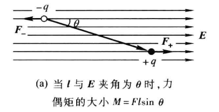
- 但是，只要这两个力的作用线不重合，偶极子将受到一个力偶矩$$\vec M=q\boldsymbol{\vec l}\times\boldsymbol{\vec E}=\vec p \times \vec E$$因此力偶矩垂直于纸面，指向读者
  - $\theta$：偶极子连线与外电场$\vec E$的夹角
  - $F$：点电荷所受电场力的大小
  - 电偶极矩/电矩$$\vec p\equiv q\boldsymbol{\vec l}$$
- 力偶矩$\vec M$力图使偶极子的偶极矩$\vec p$转到与外场$\vec E$一致的方向
  - 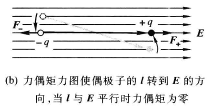
  - 当且仅当$\vec p$与$\vec E$平行或反平行时偶极子所受的力偶矩才为零；此时偶极子处于平衡状态
    - $\vec p$与$\vec E$平行：稳定平衡态
    - $\vec p$与$\vec E$反平行：不稳定平衡态，任何微小扰动都将使它越来越偏离这一状态

当外电场不均匀时，偶极子除受力矩外还受到一个合外力，详见电动力学课程

### 偶极子激发的静电场

偶极子激发的电场比点电荷的电场复杂，本小节仅推导偶极子在$\vec p$的延长线、中垂面上的电场强度表达式

偶极子在$\vec p$的延长线上的电场强度

- 在$\vec p$的延长线上取一场点$A$
  - 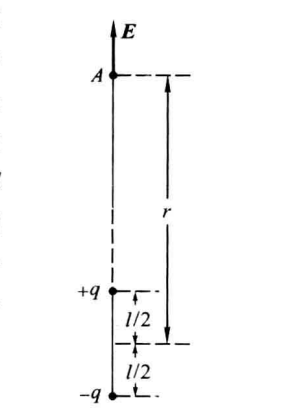
  - $+q$及$-q$在$A$点激发的电场强度大小$$E_{+}=\frac{q}{4\pi\varepsilon_{0}\left(r-\frac{l}{2}\right)^{2}},\quad E_{-}=\frac{q}{4\pi\varepsilon_{0}\left(r+\frac{l}{2}\right)^{2}},$$
  - 合电场强度大小$$E = \frac{q}{4\pi\boldsymbol{\varepsilon}_{0}}\frac{2l}{r^{3}\left(\displaystyle1-\frac{l^{2}}{4r^{2}}\right)^{2}}$$
- 偶极子定义强调两个点电荷相距很近，即$l$远小于$r$，$l/r$为小量
  - 因此合电场强度可做如下近似处理
    - 保留一级小量$l/r$
    - 忽略二级小量$(l/r)^2$
    - 注意：忽略一级小量相当于认为$+q$及$-q$重合，其电场彼此抵消，整个偶极子不激发电场
- 合电场强度近似处理为$$\vec E\approx\frac{2\vec p}{4\pi\varepsilon_0r^3}$$

偶极子在$\vec p$的中垂面上的电场强度

- 在中垂面上任取一点$A$
  - 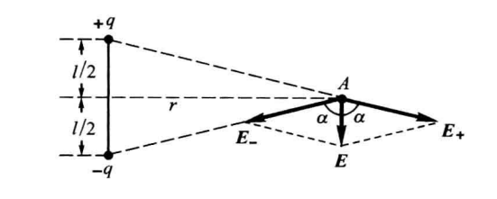
  - $r$：$A$与偶极子中心的距离
  - $E_+、E_-$的大小为$$E_{+}=E_{-}=\frac{q}{4\pi\varepsilon_{0}\Big(r^{2}+\frac{l^{2}}{4}\Big)}=\frac{q}{4\pi\varepsilon_{0}r^{2}\Big(1+\frac{l^{2}}{4r^{2}}\Big)}$$
  - $A$点的总电场强度$$\boldsymbol{\vec E}=\boldsymbol{\vec E}_{+}+\boldsymbol{\vec E}_{-}=\frac{ql}{\displaystyle 4\pi \epsilon_0r^3(1+\displaystyle \frac{l^2}{4r^2})^{\displaystyle \frac{3}{2}}}$$
- 忽略二级小量做近似处理$$\vec E\approx\displaystyle \frac{\vec p}{4\pi\varepsilon_{0}r^{3}}$$

小结：

- 偶极子在$\vec l$的延长线及中垂面上激发的电场强度取决于两个因素
  - 偶极子本身的偶极矩$\vec p$
  - 场点与偶极子中心的距离$r$
- 对比点电荷电场强度公式
  - 偶极矩$\vec p$在偶极子电场强度公式中的地位类似电荷$q$在点电荷电场强度公式中的地位
  - 但两者的电场强度对$r$的依赖关系则很不相同：
    - 点电荷电场强度与$r$的平方成反比
    - 偶极子电场强度与$r$的三次方成反比
    - 这表明偶极子电场强度随距离增大而减弱得较快

### 小结

偶极子的主、被动行为都取决于它的偶极矩$\vec p$

真空中静电场规律依赖于点电荷模型，而点电荷模型是对实际带电体的近似；偶极子是为讨论带电体中静电场规律而引入的模型
- 点电荷的行为只依赖于电荷$q$
- 均匀带电无限大平面的行为只依赖于电荷面密度$σ$
- 偶极子的行为只依赖于偶极矩$\vec p$

点电荷的特征量电荷$q$是标量，因此点电荷的静电场有球对称性

偶极子的特征量偶极矩$\vec p$是矢量，因此偶极子的静电场关于偶极矩$\vec p$对称，只具有轴对称性

## 电介质的极化

### 位移极化和取向极化

电介质可以分成两类
- 第一类电介质：每个分子的正负电荷重心在没有外电场时重合，因此分子偶极矩为零．这样的分子叫做无极分子
- 第二类电介质中：每个分子的正负电荷重心在没有外电场时不重合，因此偶极矩非零，这样的分子叫做有极分子
- 虽然每个有极分子在没有外电场时的偶极矩并不为零，但由于分子不断做无规则的热运动，各个分子偶极矩的方向杂乱无章，因此宏观看来不显电性

电介质的极化：在外电场的作用下，无极分子和有极分子都要发生变化；极化包括：位移极化、取向极化
- 无极分子的位移极化
  - 在外电场$\vec E$的作用下，无极分子中正负电荷的重心向相反方向做微小位移，两个重心不再重合，分子偶极矩不再为零，其方向与电场强度$\vec E$一致，其大小与$\vec E$成正比.这种变化叫做位移极化
  - 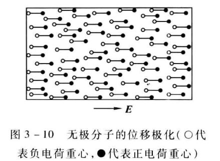
- 有极分子的取向极化
  - 无外电场时，电介质内部各有极分子偶极矩的方向杂乱无章
    - 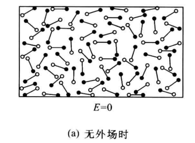
  - 有外电场$\vec E$时，每个偶极子所受到的力偶矩力图使其偶极矩转到与电场强度一致的方向
    - 如果所有有极分子的偶极矩都这样取向，这将是一种非常强烈的极化，其强度将非常可观
    - 但是由于分子的无规则热运动的干扰（热运动是规则排列的天敌），各分子偶极矩方向与完全一致相比是差得远的
    - 显然，电场$\vec E$愈强，各偶极矩转向$\vec E$方向的程度就愈大；这种由于偶极矩转向电场方向而造成的极化叫做取向极化
    - 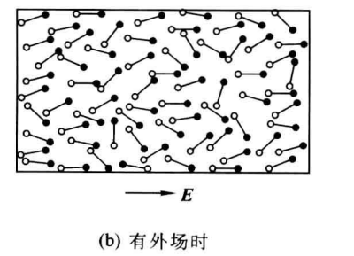
  - 实际上，有极分子在外电场作用下除了发生取向极化之外还要发生位移极化，只是在通常情况下后者比前者弱得多
    - 然而，当电场以很高的频率变化时，分子由于惯性较大，难于跟上电场的变化，取向极化将大为减弱
    - 另一方面，电子的惯性很小，于是由电子的位移所引起的位移极化就在有极分子中起主要作用

### 极化强度

极化强度：定量描述电介质极化程度的宏观物理量

- 在电介质中取物理无限小体积$ΔV$
  - 包含$m$个中性分子（$m$很大）
  - 若是无极分子，极化前每个分子的偶极矩为$0$，$ΔV$内所有分子偶极矩的矢量和显然为零
  - 若是有极分子，虽然极化前每个分子的偶极矩不为零，但各分子偶极矩的方向杂乱无章，$ΔV$内所有分子偶极矩的矢量和仍为零
- 极化后
  - 若是无极分子，每个分子都将出现一个与电场强度$\vec E$同向的偶极矩，因此$ΔV$内全部分子偶极矩的矢量和不再为零而且与$\vec E$同向
  - 若是有极分子，其偶极矩将在电场强度$\vec E$的作用下发生一定程度的取向，于是$ΔV$内所有分子偶极矩的矢量和也是一个与电场强度同向的非零矢量
  - 可见，不论哪一类电介质，极化总是意味着$ΔV$内分子偶极矩矢量和从零变为非零，而且显然极化程度愈高时这个矢量和愈大.因此可以考虑用这个矢量和作为极化程度的描写
  - 但是，在同一极化程度下，这个矢量和显然还与$ΔV$的大小有关（$ΔV$愈大矢量和愈大）.为了去掉这种对$ΔV$的依赖性，可以用这个矢量和与$ΔV$的比值作为极化程度的描写
- 定义极化强度
  - 电介质中某物理无限小体积内所有分子偶极矩矢量和与该体积$ΔV$之比$$\vec P\equiv\frac{\sum \vec p_i}{\Delta V}$$
  - 极化强度从定义开始就是宏观矢量场，极化强度的微观值没有意义
  - 如果电介质的总体或某区域内各点的$\vec P$相同，就说它是总体或在某区域内均匀极化的
  - 真空可以看做电介质的特例，其中各点的$\vec P$为零

### 极化强度与电场强度的关系

实验表明多数电介质中每点的极化强度$\vec P$与该点电场强度$\vec E$有如下关系：$$\vec P=\varepsilon_{0\chi}\vec E$$

- 满足上述关系的电介质称为各向同性电介质，即：
  - 相同大小的$\vec E$总是会引起相同大小的P
  - $\vec E$的方向总是和P相同，即$\vec E$总是令P保持与自己的方向一致
- 电介质的极化率记为$\chi>0$：反映电介质每点的宏观性质的标量
  - 各向同性的线性电介质：每点的$\chi$与$\vec E$无关的各向同性电介质；
  - 均匀电介质：各点的$\chi$都相同的电介质
  - 大多数气、液态电介质在电场不是很强的情况下都是均匀各向同性线性电介质
  - 固态电介质一般来说也是线性的，但由于它有结晶结构，往往不是各向同性的
- 非各向同性电介质的性质不能简单地用一个标量$\chi$描述
  - 不加声明时电介质一律指各向同性线性电介质

## 极化电荷

电场令电介质极化的原因，极化将产生极化电荷，极化电荷激发电场影响原电场；本节讨论极化电荷密度与极化强度的关系
- 电荷带电：微观粒子的一种属性
- 导体带电：导体失去或得到一些自由电子
- 电介质宏观上可能带电，即使电介质的电荷量为0

电介质带电来源：自由电荷或极化电荷
- 电介质内部取一个物理无限小体积$ΔV$，其所含带电粒子的电荷代数和就可能不为零
  - 以位移极化为例
  - 由于正、负电荷重心的位移，某些负电荷重心移出$ΔV$之外，另一些负电荷重心从另一侧移进$ΔV$之内
  - 如果移进和移出的数目不等，$ΔV$内的电荷代数和就不为零

几个宏观概念
  - 极化电荷：由于极化而出现的宏观电荷
  - 极化电荷体密度：$ΔV$内的极化电荷除以$ΔV$
  - 极化电荷面密度：电介质表面$ΔS$内的极化电荷除以$ΔS$
  - 自由电荷：不是由极化引起的宏观电荷
    - 电介质由于摩擦或与带电体接触而呈现的宏观电荷
    - 导体由于失去或得到自由电子而呈现的宏观电荷
 
极化电荷和自由电荷都按第一章的规律激发静电场
- $q'、\rho'、\sigma'$：极化电荷、极化电荷体密度、极化电荷面密度
- $q'_0、\rho'_0、\sigma'_0$：自由电荷、自由电荷体密度、自由电荷面密度

### 极化电荷体密度与极化强度的关系

电介质中体积为$ΔV$内的极化电荷$q'$

- 当$ΔV$缩至物理无限小时，比值$q'/ΔV$为该点的极化电荷体密度$\rho'$
- 将电介质内的中性分子视为偶极子
  - 整体位于$ΔV$内部的偶极子对$q'$的贡献是零
  - 只有被$ΔV$的边界面$S$截为两段的偶极子才对$q'$有所贡献
- 在$S$上取面元$dS$
  - 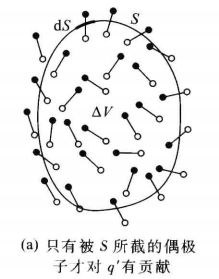
  - 因为$dS$很小，所以该面元上的$\vec E$处处相等，所以处处$\vec P$相同
- 面元处处偶极矩$\vec p=q\vec l$大小相同，与$\vec P$平行
  - 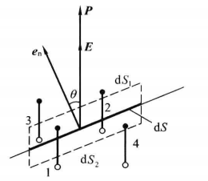
  - 在$dS$两侧对称地作两个平行于$dS$的面元$dS_1、dS_2$，两者沿$\vec P$方向的距离为$l$
  - $dS_1、dS_2$和侧壁（其母线平行于$\vec P$）围成一个斜柱状夹层
  - 中心在层内的偶极子（1、2）一定被$dS$所截
  - 中心在层外的偶极子（3、4）一定不被$dS$所截
  - 因此，对$q'$有贡献的仅是中心在层内的偶极子
- 设单位体积内的分子数为$n$，以$θ$代表$\vec P$同$dS$的外法矢$\vec e_n$的夹角
  - 夹层的体积为$l|cosθ|dS$
  - 有贡献的偶极子数为$nl|cosθ|dS$
  - 贡献的电荷为$$\mathrm{d}q^{\prime}=-qnl\cos\theta\mathrm{d}S$$
  - 负号由如下考虑得出：
    - 当$θ$为锐角时，被截的偶极子把负电荷留在$ΔV$内，$dq'$应小于零．这时$cosθ>0$，而$q、n、dS$都为正数，必须加一负号才能保证$dq'<0$
  - $ql$：每个偶极子偶极矩的大小
  - $nql$：单位体积的偶极矩矢量和（极化强度$\vec P$）的大小$$\mathrm{d}q^{\prime}=-P\cos\theta\mathrm{d}S=-P\cdot\mathrm{d}S$$
- 对$ΔV$的整个边界面$S$积分便得$ΔV$内的极化电荷总量$$q^{\prime}=-\oint_{s}P\cdot\mathrm{d}S$$
- 令$ΔV$缩为物理无限小并以$ΔV$除上式两边，便得该点的极化电荷体密度$$\rho^{'}=-\frac{\oiint_{s}P\cdot\mathrm{d}S}{\Delta V}$$

现证明均匀极化时电介质内部的极化电荷体密度为0
- 不妨想象平板电容器内充满均匀电介质的情形，这时电介质必均匀极化，即$\vec P$为常矢量场
  - 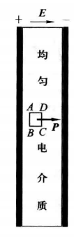
  - 在电介质中任取一个与$\vec P$垂直的长方体，截面$ABCD$
  - 显然，只有$AB、CD$所代表的左右侧面才与偶极子相截
  - 由于两面的$P$相同，两面所截偶极子数必然相等
- 如果$AB$面所截偶极子把正电荷留在长方体内，则$CD$面所截偶极子必把负电荷留在体内，且两者绝对值相等，因而长方体内$q'$为0
  - 把长方体缩为物理无限小，便可证明电介质内任一点的极化电荷体密度$p'=0$
  - 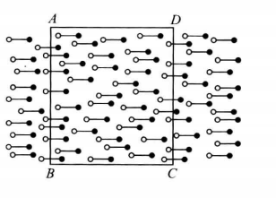

### 极化电荷面密度与极化强度的关系

现在讨论两种介质交界处的极化电荷面密度

- 这里的介质包括电介质、真空和金属
- 真空可看做一种特殊的电介质，其极化强度$\vec P$永为零
- 金属中除自由电子外还有束缚电子，也存在极化问题；不过静电场中的金属内部电场强度为零，因而不会极化；静电场中的金属内部处处有$P＝0$

设介质$1$和$2$交于界面$S$

- 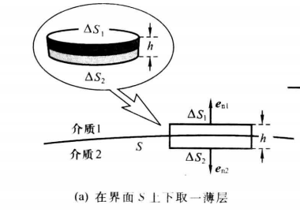
- 在$S$上任取面元$ΔS$，作如图所示的薄层，其两底为$ΔS_1$，及$ΔS_2$，其高$h$比底面周长小得多
- 层内的极化电荷$Δq'$
  - 只有被薄层上、下底面截断的偶极子才对$Δq'$有贡献
    - 侧面高度比两底周长小得多，其贡献可忽略
  - 上下底面的贡献分别为$$\Delta q_{1}^{\prime}=-\vec P_{1}\cdot\Delta \vec S_{1},\Delta q_{2}^{\prime}=-\vec P_{2}\cdot\Delta \vec S_{2}$$
  - 因此层内的极化电荷$$Δq'\left.=\Delta q_{1}^{\prime}+\Delta q_{2}^{\prime}=\left(\begin{array}{c}P_{_{2n}}-P_{_{1n}}\end{array}\right.\right)\Delta S.$$
  - 其中$P_{1n}$及$P_{2n}$分别是$\vec P_1$及$\vec P_2$在同一法向单位矢量$\vec e_n$上的投影
- 当场点与薄层的距离远大于薄层的厚度时，可以认为极化电荷$Δq'$集中在几何面$ΔS$上，其面密度为$$\sigma^{\prime}\equiv\frac{\Delta q^{\prime}}{\Delta S}=P_{_{2n}}-P_{_{1n}}=(\vec P_{2}-\vec P{_1})\cdot \vec e{_n},$$其中，$\vec e_n$是介质2指向介质1的法向量
  - 因为介质不同，因此面密度可能不为0
  - 接下来分三种情况讨论

介质2是电介质而介质1是真空，即从电介质指向真空

- $\vec P_1=0$，故$σ'＝P_2$
- 在平板电容器内放一块均匀电介质板，其两个表面$S_1$及$S_2$与金属板平行但不接触
  - 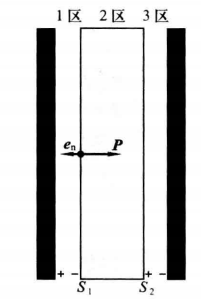
  - 则$S_1、S_2$为电介质与真空交界
- 对$S_1$
  - $e_n$的方向按约定应从电介质指向真空，即向左
  - 设电容器左板带正电而右板带负电，则电介质板内的$\vec P$向右，故$P_n<0$，即$S_1$面的极化电荷为负
- 同理可知$S_2$面的极化电荷为正
- 现讨论极化面电荷对电场的影响
  - 把电容器内分为三区
  - 就宏观而言，$S_1、S_2$面可看做两个均匀带电无限大平面，并且电荷密度等值异号（因电介质均匀极化），它们只在2区内激发附加电场，方向与金属板上的自由电荷激发的电场$E_0$相反
  - 因此，2区内的电场强度$E_2$比无电介质时的电场强度$E_0$小
  - 而1、3区的电场强度则与$E_0$相同
- 从电场线出发也可得出上述结论
  - 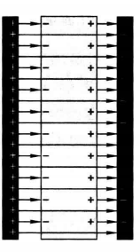
  - 由于左金属板发出的电场线有一部分要止于电介质左边的负极化电荷，所以电介质内部电场线密度会变小
  - 上述图表示：当极化电荷面密度$σ'$恰等于自由电荷面密度$σ_0/2$的情况

介质2是电介质而介质1是金属

- 电容器内充满电介质就是这种情况；金属在静电平衡时极化强度为零，即$P_{_{1n}}=0$，因此$$\sigma^{\prime}=\vec P_{2}\cdot \vec e_{n}=P_{{2n}}$$其中$\vec e_{n}$的方向是从电介质指向金属

两种介质都是电介质

- 因为$$\sigma^{\prime}\equiv\frac{\Delta q^{\prime}}{\Delta S}=P_{_{2n}}-P_{_{1n}}=(\vec P_{2}-\vec P{_1})\cdot \vec e{_n},$$所以界面上一点的$σ'$等于两电介质中与该点极近的点的极化强度法向分量之差$$P_{{2n}}-P_{{1n}}.$$

利用极化电荷的概念还可解释静电演示实验中的一个基本现象：带电棒会吸引附近的纸片等轻小不带电物体

- 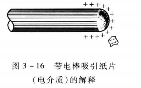
- 纸片在正电带电棒激发的电场中发生极化，两端出现等值异号的极化电荷（上负下正），它们都受电场力
- 因为上边电场强度大于下边，合力向上，所以纸片被吸向带电棒
- 显然，带电棒带负电时也同样能吸引纸片
- 这里的关键是纸片处于非均匀电场中；如果电场均匀，纸片便不受力
- 一般来说，整体不带电的电介质小块在不均匀电场中所受的力指向电场强度较大的方向

## 有电介质时的高斯定理

导体问题之所以复杂，是由于自由电子在电场作用下重新分布，结果出现的宏观面电荷反过来又影响电场；电介质虽然没有自由电子，但由电场引起的极化电荷也要激发附加电场，这就改变了原来的电场，反过来又使极化情况发生变化.如此互相影响，最后达到平衡

平衡时，空间每点的电场强度都可分为两部分：$$\boldsymbol{\vec E}=\boldsymbol{\vec E}_{0}+\boldsymbol{\vec E}^{\prime},$$
- 其中$\boldsymbol{\vec E}_{0}、\boldsymbol{\vec E}^{\prime}$分别是空间中所有自由电荷及所有极化电荷的电场强度
- 现在应该明确指出
  - 公式$\vec P＝ε_0\chi\vec E$中的$\vec E$必须理解为总电场强度而不是自由电荷的电场强度$\vec E_0$
  - 因为$\vec E'$对极化同样要起作用
- 但是，最初的极化毕竟是自由电荷引起的，没有自由电荷就没有极化电荷（铁电体例外）
  - 因此，只要知道自由电荷的分布及电介质的极化率，原则上应能求得空间的电场强度
  - 但是直接计算遇到如下困难：要由电荷分布求电场强度E，必须同时知道自由电荷及极化电荷的密度，而极化电荷密度取决于$$\rho^{'}=-\frac{\oiint_{s}P\cdot\mathrm{d}S}{\Delta V}$$和$$\sigma^{\prime}\equiv\frac{\Delta q^{\prime}}{\Delta S}=P_{_{2n}}-P_{_{1n}}=(\vec P_{2}-\vec P{_1})\cdot \vec e{_n},$$
  - $\vec P$又取决于$$\vec P=\varepsilon_{0}\chi \vec E$$
  - 克服困难的方法是列出有关$\vec E、\vec P、\rho'、\sigma'$的数量足够的方程，然后联立求解
  - 为求解方便，可先把$\rho'、\sigma'$从方程中消去，同时引入一个新矢量场$D$，最后得出一个联立方程组.下面介绍这个过程.

当空间有电介质时，只要把自由电荷和极化电荷同时考虑在内，第一章的高斯定理仍然成立：$$\oiint_{s}\vec E\cdot\mathrm{d}\vec S=\frac{(q_{0}+q^{\prime})}{\varepsilon_{0}},$$

- 现带入方程$$q^{\prime}=-\iint_{s}\vec P\cdot\mathrm{d}\vec S$$得到$$\oiint_{s}(\varepsilon_{0}\vec E+\vec P)\cdot\mathrm{d}\vec S=q_{0}$$

- 引入矢量电位移$$\vec D\equiv\varepsilon_{0}\vec E+\vec P$$化简为$$\oiint_{s}\boldsymbol{\vec D}\cdot\mathrm{d}\boldsymbol{\vec S}=q_{0}$$
- 上述式子称为有电介质时的高斯定理，简称$D$的高斯定理
  - 把真空看做电介质的特例，因其$P＝0$，则$\vec D＝ε_0\vec E$，可还原为真空中的高斯定理.

- 有电介质时的高斯定理
  - 好处：不包含极化电荷
  - 代价：出现了与$P$有关的矢量场$D$
  - 对于某些有对称性的场合，用有电介质时的高斯定理可以方便地根据自由电荷$q_0$的分布求$D$，进而求$E$
  - 按$D$的定义，要由$D$求$E$还需知道$P$，但因$P$与$E$有$P＝ε_0\chi\vec E$的关系，代入$\vec D＝ε_0\vec E＋\vec P$便得$$\left.\boldsymbol{\vec D}=\boldsymbol{\varepsilon}_{0}\left(\begin{array}{c}{1+\chi}\\\end{array}\right.\right)\boldsymbol{\vec E}.$$
  - 因此，只要知道电介质的极化率$\chi$，就可求得$D$，进而求得$E$

观察式子$\left.\boldsymbol{\vec D}=\boldsymbol{\varepsilon}_{0}\left(\begin{array}{c}{1+\chi}\\\end{array}\right.\right)\boldsymbol{\vec E}$可知

- 电介质中任一点的$D$与该点的$E$方向相同，大小成正比
- 比例系数$ε0（1＋\chi）$只与该点的电介质性质$\chi$有关，叫做电介质的介电常量，记为$ε$$$\varepsilon\equiv\varepsilon_{_0}(1+\chi).$$把真空看做电介质的特例，其$P$在任何$E$时均为零，故其$\chi＝0$，$ε＝ε0$
  - 可见，国际单位制公式中经常出现的$ε_0$原来就是真空的介电常量
  - 电介质的介电常量$ε$与真空的介电常量$ε0$之比$ε／ε_0$叫做该电介质的相对介电常量，记为$ε_r$，即$${\mathcal E}_{_r}\equiv\frac{\mathcal E}{\mathcal E}_{_0}=1+\chi.$$
  - 因此$$\vec D=\varepsilon \vec E=\varepsilon_{_0}\varepsilon_{_r}\vec E.$$

例1 半径为$R$、电荷为$q_0$的金属球埋在介电常量为$ε$的均匀无限大电介质中，求电介质内的电场强度$\vec E$及电介质与金属交界面上的极化电荷面密度$σ'$

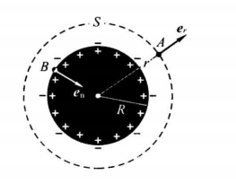

- 金属球的自由电荷极化电介质后将出现极化电荷；
  - 电介质均匀$\to$极化电荷体密度处处为零
  - 电介质与金属的界面上有极化电荷面密度$σ'$，激发附加电场$E'$
- 设$A$是介质中的任一场点；
  - 过$A$作半径为$r$的同心球面$S$，由对称性可知$S$上各点的$\vec D$大小相等且沿径向
  - $S$面上的$D$通量为$$\oiint_{s}\vec D\cdot\mathrm{d}\vec S=\oiint_{s}D_{r}\mathrm{d}S=D_r\oiint_{s}\mathrm{d}S=D_r4\pi r^{2}$$其中$D_r$是矢量$\vec D$沿$S$面外法向的投影
  - 由$$\oiint_{s}\boldsymbol{\vec D}\cdot\mathrm{d}\boldsymbol{\vec S}=q_{0}$$可得$$\vec D=\frac{q_{0}}{4\pi r^{2}}\vec e_r$$
  - 由$\vec D=\epsilon \vec E$可得$$\vec E=\frac{q_{0}}{4\pi\varepsilon r^{2}}\vec e_{r}.$$
- 现求交界面上一点$B$的$σ'$（受自由电荷和极化电荷共同影响）
  - 过$B$点作界面的法向单位矢量$e_n$，按约定由电介质指向金属
  - 由$$\sigma^{\prime}\equiv(\vec P_{2}-\vec P{_1})\cdot \vec e{_n},$$以及$$\vec P=\varepsilon_{0}\chi \vec E$$可得$$\sigma^{\prime}=\boldsymbol{\vec P}(B)\cdot\boldsymbol{\vec e}_{n}=\varepsilon_{0}\chi\boldsymbol{\vec E}(B)\cdot\boldsymbol{\vec e}_{n}=-\frac{\varepsilon_{0}\chi}{4\pi\varepsilon}\frac{q_{0}}{R^{2}}=-\frac{\varepsilon-\varepsilon_{0}}{\varepsilon}\sigma_{0},$$其中$\sigma_0$是金属球表面的自由电荷面密度
- 因此可得出以下结论
  - $σ'$与$σ_0$恒反号
    - 金属球表面的自由电荷面密度和界面上的电荷面密度异号
  - $|σ'|<|σ_0|$
    - 交界面上的极化电荷面密度在数值上一定小于自由电荷面密度；
  - 交界面上的总电荷面密度$$σ=σ_0＋σ'=σ_0[1—(ε—ε_0)/ε]=σ_0/\epsilon_r$$
    - 即总面密度减小到自由电荷面密度的$1/ε$
  - 若把电介质换为真空，则电场强度为$$q_0\boldsymbol{e}_r/(4\pi\varepsilon_0r^2)$$
    - 即充满均匀电介质时电场强度减小到无电介质时的$1/ε$
    - 因为有电介质时交界面上的总电荷减小到无电介质时的$1/ε$，而且其他地方又没有电荷

例 2 在平板电容器中充满介电常量为$ε$的均匀电介质，已知两金属板内壁自由电荷面密度为$\sigma_{01}=\sigma_{02}$，求电介质中的$\vec E$、电介质与金属板交界面的$σ'$及电容器的电容$C$

- 求电介质中的$\vec E$
  - 由对称性可知电介质中的$\vec E$及$\vec D$都与板面垂直
  - 在电介质中任取一点$A$，过$A$作与板面平行的小平面$S_1$，以$S_1$为底作柱体（其轴与$\vec D$平行），柱体的另一底$S_2$在金属板内；柱体两底及其侧面组成高斯面
  - 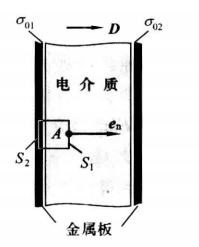
  - 静电平衡时金属内部$E$及$P$为零保证$D$为零，电介质中的$\vec D$又与高斯面的侧面平行，故高斯面的$\vec D$通量等于$S_1$面的$\vec D$通量$D_nS_1$
    - $D_n$：$\vec D$沿$S$面法向单位矢量$e_n$的投影
  - 另一方面，高斯面内的自由电荷为$σ_{01}S_1$
  - 由高斯定理得$$D_nS_1=σ_{01}S_1$$因此故$$\vec D=σ_{01}\vec e_n$$
  - 电介质中的电场强度$$\vec E=\frac{\vec D}{\varepsilon}=\frac{\sigma_{01}}{\varepsilon}\vec e_{n}$$
- 求电介质与金属板界面上的极化电荷面密度
  - 电介质与左右金属板界面上的极化电荷面密度分别为$$\sigma_{1}^{\prime}=-\vec P\cdot \vec e_{n}=-\varepsilon_{0}\chi \vec E\cdot \vec e_{n}=-\frac{\varepsilon-\varepsilon_{0}}{\varepsilon}\sigma_{01},$$以及$$\sigma_{2}^{'}=\boldsymbol{\vec P}\cdot\boldsymbol{\vec e}_{_n}=\frac{\varepsilon-\varepsilon_{_0}}{\varepsilon}\sigma_{_{01}}=-\sigma_{_1}^{'}.$$
  - 可见交界面的极化电荷面密度与自由电荷面密度异号，且绝对值比后者小
  - 充入均匀电介质后界面上总电荷面密度是无电介质时的$1/ε$，而均匀极化电介质内又无极化体电荷，故电介质中电场强度减到充入电介质前的$1/ε$
- 求充入电介质后的电容
  - 在充有电介质时，电容的定义仍是电荷与电压之比，其中电荷是指一板内壁的自由电荷（绝对值），因为把电容器接入电路时，可与外界交换的只能是自由电荷.设两板内壁距离为d，由于电压是电场强度E的线积分，而电容器内为均匀电场，故电压绝对值$U＝Ed$带入$E$的公式得$$U=\frac{σ_0d}{ε}$$，其中$\sigma_0=|\sigma_{01}|$
  - 设板面积为$S$，则$$C\equiv\frac{q_{0}}{U}=\frac{\boldsymbol{\varepsilon}S}{d}$$
  - $C = (ε/ε_0)C_0 =\epsilon_r C_0$
  - 即充入均匀电介质后，平板电容器的电容增至$ε_r$倍
  - 在任何电容器中充满均匀电介质后电容总是增至$ε_r$倍
    - 由于这个原因，相对介电常量也被称为相对电容率

## 有电介质时的静电场方程

无电介质时得静电场方程$$\oiint \vec E\cdot\mathrm{d}\vec S=\frac{q}{\varepsilon_{0}}\\\oint \vec E\cdot\mathrm{d}\boldsymbol{\vec l}=0$$
- 已知一个矢量场对任一闭曲面的通量和任一闭曲线的环流就能决定该矢量场

有电介质时得静电场方程$$\oiint \vec D\cdot\mathrm{d}\vec S=q_{0}\\\oint \vec E\cdot\mathrm{d}\boldsymbol{\vec l}=0$$
- 已知一个矢量场对任一闭曲面的通量、任一闭曲线的环流、$\vec D$与$\vec E$的关系式可决定该矢量场
  - 利用$\vec D$的定义式及$\vec P$与$\vec E$的关系就可得到$\vec D$与$\vec E$的关系式
  - 对各向同性的线性电介质，该方程是$$\vec D=\varepsilon\vec  E$$
    - 称为电介质的性能方程
    - 当自由电荷及电介质的$ε$已知时，加上适当的边界条件，原则上就可决定$\vec D$与$\vec E$

## 电场的能量

定义：电磁能量定域地存在于电磁场中
- 该定义说明电磁能量定域地存在于电磁场中并可在空间流动
- 场能密度：单位体积中的能量，描写场能的分布
- 以平板电容器为特例作一讨论
  - 电容器内的静电能$$W_{e}=\frac{1}{2}CU^{2}.$$
  - 以$S$和$d$分别代表一板的面积和板间的距离，则电容器内的体积为$V＝Sd$
  - 设电容器内充满均匀各向同性线性电介质，则$E$及$D$为常矢量场，电场能量在电容器内应均匀分布，故能量密度为$$w_{e}\equiv\frac{W_{e}}{V}=\frac{\frac{1}{2}CU^{2}}{Sd}$$
  - 由$C=\displaystyle\frac{\boldsymbol{\varepsilon}S}{d}$和$U=Ed$可得$$w_{_e}=\frac{\varepsilon E^{2}}{2}=\frac{DE}{2}$$
- 因此$$w_{_e}=\frac{1}{2}\vec D\cdot \vec E$$

各向同性线性电介质中的任意静电场的任一区域的电场能量密度公式为$$w_{_e}=\frac{1}{2}\vec D\cdot \vec E$$对真空电场能量密度可化简为$$w_{_e}=\frac{1}{2}\varepsilon_{_0}E^{2}$$

例 绝对介电常量为$ε$的均匀无限大各向同性线性电介质中有一金属球，球的半径和自由电荷分别为$R$及$q_0$，求静电场的总能量

- 由上一小节的例子可知$$\boldsymbol{\vec D}=\frac{q_{0}}{4\pi r^{2}}\boldsymbol{\vec e},\quad\boldsymbol{\vec E}=\frac{q_{0}}{4\pi\varepsilon r^{2}}\boldsymbol{\vec e},$$
- 带入$$w_{_e}=\frac{1}{2}\vec D\cdot \vec E$$可得$$w_{e}=\frac{\boldsymbol{D}\cdot\boldsymbol{E}}{2}=\frac{{q_{0}}^{2}}{32\boldsymbol{\pi}^{2}\boldsymbol{\varepsilon}r^{4}}.$$
- $$\begin{aligned}W_{e}&=\iiint_{\text{路外}}w\mathrm{d}V=\iiint\frac{q_{0}^{^{2}}}{32\pi^{2}er^{4}}r^{2}\sin\theta\mathrm{d}r\mathrm{d}\theta\mathrm{d}\varphi\\&=\frac{q_{0}^{^{2}}}{32\pi^{^{2}}e}\int_{k}^{x}\frac{1}{r^{^{2}}}\mathrm{d}r\int_{0}^{\pi}\sin\theta\mathrm{d}\theta\int_{0}^{2\pi}\mathrm{d}\varphi=\frac{q_{0}^{^{2}}}{8\pi eR}.\end{aligned}$$

# 恒定电流和电路

## 恒定电流

在真空、电介质、导体中都可由带电粒子的运动形成电流
- 导体中形成电流的带电粒子叫载流子
  - 金属中的载流子是自由电子
  - 半导体中的载流子是带负电的自由电子和带正电的空穴
  - 酸、碱、盐的水溶液中的载流子是正离子和负离子
  - 气体中的载流子是正、负离子及电子
- 本章主要讨论金属中的电流

当金属内部没有电场时，自由电子仅做无规则的热运动，不引起电荷沿任一方向的宏观迁移
- 从宏观的角度看，我们只关心带电粒子的定向运动：大量带电粒子趋向某一方向的那一部分宏观运动，以区别于无规则的微观热运动，因此电流往往也狭义地专指带电粒子的定向运动
- 实验表明，负电荷运动引起的电流与等量正电荷沿反方向运动引起的电流等效
- 规定正电荷运动的方向规定为电流的方向，单位时间内通过导线截面的电荷叫做该截面的电流，通常用$I$表示
  - 设在$Δt$时间内通过截面的电荷为$Δq$，则该截面的电流为$$I=\lim_{\Delta t\rightarrow0}\frac{\Delta q}{\Delta t}.$$
- 电流概念还可推广到不涉及导线的任意曲面
  - 单位时间内通过任意曲面的电荷叫做该曲面的电流
- 电流的国际单位制单位为安培A
  - 毫安$1mA＝10^{-3}A$
  - 微安$1μA＝10^{-6}A$
- 电流：反映导线截面的整体电流特征强弱，不描写每点的电流情况
  - 假定单位时间内通过粗细不均的导线各截面的电荷相等，则各截面的电流I相同
  
  - 然而导线内部各点的电流情况却可以存在差异
  - 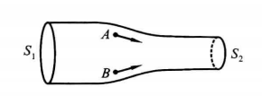
  - 例如，在粗部与细部的过渡区中取两点A和B，正电荷经过这两点时虽然都有向右的倾向，但方向并不平行，这表明A和B点的电流有不同的方向
  - 另外，在导线的粗、细两部分各取横截面$S_1$及$S_2$，则各自的单位面积上的电流分别为$I/S_1$，及$I/S_2$，两者不等，说明导线中不同点上与电流方向垂直的单位面积上流过的电流不同
  - 为了描写每点的电流情况，有必要引入一个矢量场：电流密度$J$

电流密度：
- 每点的$J$的方向：该点的正电荷运动方向
- 每点的$J$的大小：过该点并与$J$垂直的单位面积上的电流
- 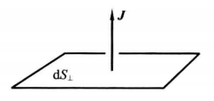
- 在场点附近取与$J$垂直的小面元$dS$，设该面元的电流为$dI$，则该点的电流密度大小$$J\equiv\frac{\mathrm{d}I}{\mathrm{d}S_{\perp}}$$方向垂直于面元$dS$

电流与电流密度
- $I$是标量，描写一个面的电流情况，因而不是标量场
- $J$是矢量场，描写每点的电流情况
- 现推导$J、I$的一般关系
  - 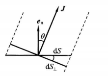
  - 过任一点作面元$dS$，其法向单位矢量$\vec e_n$与该点$J$的夹角为$θ$
  - $\mathrm{d}S_{\perp}$代表$dS$在与$J$垂直的平面上的投影，以$dI$代表$\mathrm{d}S_{\perp}$的电流$$\mathrm{d}I=J\mathrm{d}S_{_\perp}=J\mathrm{d}S\mathrm{cos}\theta=J\cdot e_{_n}\mathrm{d}S,$$即$$\mathrm{d}I=\mathbf{\vec J}\cdot\mathrm{d}\mathbf{\vec S}.$$
- 任意曲面的电流$I$则可表示为如下积分$$I=\iint_{s}\mathbf{\vec J}\cdot\mathrm{d}\mathbf{\vec S}.$$
  
曲面的电流$I$代表该曲面的$\vec J$通量
- 按照约定，闭曲面的法向为从内向外，$\vec J$通量代表由内向外流出的电流，因此可得出电流场的连续性方程$$\oiint_s\boldsymbol{\vec J}\cdot\mathrm{d}\mathbf{\vec S}=-\frac{\mathrm{d}q}{\mathrm{d}t}$$
- 因此$\vec J$关于空间坐标和时间的函数
- 恒定电流：各点的$\vec J$不随时间变化的电流
- 本章主要讨论恒定电流

用导线将带电导体球和中性导体球接通；由于两球在接通前存在电势差，刚接通时导线中出现电场，自由电子将在电场力作用下形成电流.这导致两球电势逐渐接近，导线内部电场强度逐渐减弱，电流逐渐减小，通常在很短时间内就达到静电平衡.可见，要使导体出现电流，可以设法在导体内部制造电场
- 电流场通常总是伴随着一个电场，这个电场是由空间各处（特别是导线表面）分布着的电荷激发的
- 要维持恒定电流，空间各处的电荷密度必须不随时间而变，这个必要条件称为恒定条件
- 电荷密度不变并不意味着电荷没有运动，实际的物理图像是：导体内各处的载流子尽管都在向前移动，但它们原来的位置又被后续的载流子所占据
- 只要单位时间内从任一闭曲面的一部分流出去的电荷等于从该面其他部分流进的电荷，空间各点的电荷密度就不随时间变化.
- 根据恒定条件，恒定电流场中的任一闭曲面$S$内的电荷$q$都不随时间而变，因此可推导出恒定电流的连续性方程：$$\color{red} \iint_{s}\mathbf{\vec J}\cdot\mathrm{d}\mathbf{\vec S}=0$$

引入电流线的概念形象表示恒定电流

- 电流线定义为$\vec J$线
- 恒定电流的闭合性：恒定电流场中的$\vec J$线是既无起点又无终点的闭合曲线
  - 闭合性决定恒定电流的电路必须是闭合电路
- 恒定电流场激发恒定电场
  - 恒定电场中电荷分布不随时间而变，因此恒定电流场与同样分布的静止电荷的静电场相同
  - 所以，恒定电场与静电场具有完全一样的性质
  - 静电场的高斯定理和环路定理对恒定电场也完全适用

## 直流电路

### 电路

电路：使用导线把电源、负载、以及可能存在的中间环节连接起来的电流通路
- 电路的每一组成部件包括电源和负载叫元件
- 各元件的联接关系可用电路图表示
  - 最简单的电路：无分支电路
    - 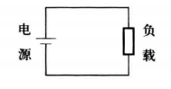
  - 将闭合的电路通过$n>1$个节点分为$n+1$段分支
    - 每段分支叫做一条支路，支路上的元件只允许串联不允许并联
    - 以下是有两个节点A、B的三条之路的电路图
    - 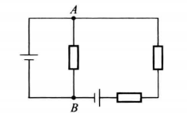
- 尽管电流场伴随着电场，电路问题与电场问题密切相关
  - 电场只关心微分量：$\vec J$、$\vec E$...
  - 电流只关心积分量，其目的是把电源的能量输送给负载；因此往往只需关心与能量输送直接有关的物理量，而不必具体探究横截面上不同点的情况
    - $I$：$J$的积分
    - 电压：静电场电场强度的线积分
    - 电动势：非静电场电场强度的线积分
 - 场和路是电磁学的两个主要内容

### 直流电路

载有恒定电流的电路叫恒定电流电路或直流电路

- 由恒定电流场$\vec J$不含时间$t$可知直流电路涉及的各积分量都不随时间而变
- 恒定电流电路的性质一：直流电路中同一支路的各个截面有相同的电流$I$
- 恒定电流电路的性质二：流进直流电路任一节点的电流等于从该节点流出的电流
  - 该定律是基尔霍夫第一定律

## 欧姆定律和焦耳定律

实验表明，线状金属导体符合不含源电路的欧姆定律$$U=IR$$
- $R$：导体的电阻；电阻的数值取决于导体的材料、形状、长短、粗细及温度等
  - 实验表明，欧姆定律对金属导体及通常情况下的电解液很好地成立；对半导体二极管、真空二极管以及许多气体导电管等元器件却不成立
  - 为描写元器件的电流与电压的关系，可以分别以电压、电流为坐标画出函数曲线，这种曲线叫做元器件的伏安特性曲线，简称伏安特性
  - 满足欧姆定律的元器件的伏安特性曲线是过原点的直线
  - 伏安特性曲线是直线的元器件叫做线性元件
  - 以下如无特别声明，所讨论的都是线性元件以及由它们组成的线性电路
- 当导体内部含有电源时，欧姆定律不再成立，其电流与电压的关系服从另一规律
- 电阻的国际制单位称为欧姆$Ω$，$1Ω＝1 V／A$
  - 千欧$kΩ$
  - 兆欧$MΩ=10^6\Omega$
- 电阻的倒数称为电导，记为$G$
  - 其国际单位制单位称为西门子
  - 欧姆定律可用电导$G$表示为$$I=GU$$

### 电阻率

一段柱形的均匀导体的电阻由下式决定：$$R=\rho\frac{l}{S}$$其中$l$和$S$分别是导体的长度和横截面积，$\rho$是与导体的材料及温度有关的量，叫做导体的电阻率
- 电阻率与电阻是两个不同概念；电阻率描写导体本身的性质，只取决于导体的材料（铜、铝、铁······）及温度
- 电阻则描写一段导体的性质，除依赖于导体的材料及温度外，还与该段导体的形状、长短及粗细有关
- 对于由不均匀材料制成的导体，其内部各处的电阻率还可以不同

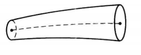

假定用不均匀材料制成长条形导体（横截面积可处处不同），只要电阻率$\rho$对每个横截面上的各点相同（对不同横截面可以不同），这个导体的电阻$R$就可用下面的线积分计算：$$R=\int\rho\frac{\mathrm{d}l}{S}$$
- 积分沿这个长条形导体中与长度方向大致平行的曲线进行，$\rho$及$S$都应看做积分流动点的函数；
- 电阻是积分量而电阻率是微分量；电阻率$\rho$的倒数$\gamma$叫做电导率，即$$\gamma\equiv\frac1\rho.$$
- 实验表明，所有纯金属的电阻率都随温度的升高而增大.当温度不太低时，电阻率与温度的关系可以很好地用以下的线性函数描写$$\rho_{\iota}=\rho_{0}\left(1+\alpha t\right),$$其中$\rho_t$和$\rho_0$分别是摄氏温度为$t$和$0$时的电阻率，$α$是常量（称为材料的温度系数），取决于材料的种类

### 欧姆定律的微分形式

限于课程性质，本课程只能从经典物理学的角度对金属的导电机制及欧姆定律在经典电子论范畴内做一个大致的解释

- 当金属内部没有电场时，自由电子的无规运动大体类似于理想气体分子的无规热运动，因此金属中自由电子的整体常又称为电子气
  - 电子在热运动过程中与金属骨架频繁碰撞并改变运动方向，其轨迹是一条多折的折线
  - 洛伦兹用经典统计力学算出电子气热运动的平均速率$\vec v$的量级为$10^5m/s$
  - 这虽然是很大的速率，但由于热运动的无规性，宏观看来单位时间内通过金属内部任一面元的电荷为零
  - 因此宏观电流密度处处为零
- 当金属内部存在电场$\vec E$时，每个自由电子都将在原有热运动的基础上附加一个逆电场强度方向的定向运动，正是它构成宏观电流
  - 这时，每个电子的速度可以分为两部分：热运动速度和定向运动速度
  - 虽然计算表明定向运动的平均速率$\vec ū$比热运动的平均速率$\overline {\vec v}$小得多（约小9个量级）
  - 然而在考虑大量电子运动的宏观效应时，只有电子的定向运动才由于方向相同而造成宏观电流
  - 可见，正是电子的定向平均速度$ū$决定电流密度的数值和方向
- 因此电场强度$\vec E$决定电子定向平均速度$\vec ū$，而$ū$则决定电流密度$\vec J$
- 现探索$\vec J$与$\vec E$的关系

找出定向运动平均速度$\vec ū$与电场强度$\vec E$的关系
- 无电场时，电子速度的大小和方向在每次碰撞时都随机地改变，在两次碰撞之间以某一（随机获得的）初速做匀速直线运动.由于没有任一特殊方向，这一初速对大量电子的平均值为零

- 当电场$\vec E$存在时，由于电场力$—e\vec E$的加速，电子除热运动速度$\vec v$外还积累起一个定向运动速度$\vec u$
- 具体地说，电子在两次碰撞之间的定向运动部分是匀加速运动，加速度为$\vec a=—e\vec E/m$（其中$m$是电子的质量）
- 电子在碰撞时所受的冲力比电场力大得多，它破坏电子运动的有向性（碰撞使它“忘记”了碰前的定向速度）；所以在两次碰撞之间定向运动部分的初速为零（与无电场时一样）
- 设两次碰撞之间的平均时间为$\overline{\tau}$，则此段时间的末速为$$\vec u_{,}=\vec a\overline{\tau}=-\frac{e\boldsymbol{\vec E}}{m}\overline{\tau}$$
- 故电子的定向运动平均速度为$$\ddot{\boldsymbol{\vec u}}=\frac{0+\boldsymbol{\vec u_f}}{2}=-\frac{e\boldsymbol{\vec E}}{2m}\overline{\tau}.$$
- 由于热运动平均速率$\vec v$远大于定向运动平均速率$ū$，上式中的$\overline{\tau}$可用$\vec v$及平均自由程$\overline l$表示为$\overline{\tau}=\overline l/\overline v$，故最终有$$\bar{\vec u}=-\frac{e\bar{l}}{2m\bar{v}}\boldsymbol{\vec E}$$

找出电流密度$\vec J$与定向运动平均速度$\vec ū$的关系

- 在金属内部取一个面积为$S$、与$\vec J$垂直的面元；以它为底、$ū$为高作一个正柱体；柱体的体积等于$ūS$
  - 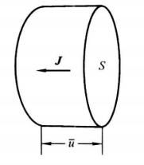
- 因为$ū$代表平均定向速率，所以在定向运动的意义上说，单位时间内只有位于柱体内部的电子才能穿过$S$面（从而构成通过S面的电流）
- 设单位体积内的自由电子数为$n$，则柱体内的自由电子数等于 $nūs$，它们在单位时间内全部穿过 $S$  面，故该面的电流为 $enūS$，体内任一点的电流密度的大小则为$J= enūS/S = enū$.
- 考虑到电子带负电，$J$ 与$u$ 应反向，便有$$\vec J=-en\bar{\boldsymbol{\vec u}}$$

电流密度$\vec J$与电场强度$\vec E$的关系：$$\boldsymbol{\vec J}=\frac{ne^2\bar{l}}{2m\bar{v}}\boldsymbol{\vec E}.$$上式说明电流密度$\vec J$与电场强度$\vec E$方向相同；大小成正比，比例系数对金属中的同一点是一个正的常量，与E无关，令$$\gamma\equiv\frac{ne^2\bar{l}}{2m\bar{v}},$$则$$\vec J=\gamma\vec E.$$

引起电流密度$\vec J$的外因是电场强度$\vec E$，被内因$\gamma$影响

- 该式子是欧姆定律$I＝GU$的微分形式
- 相应地，$I＝GU$或$U＝IR$称为欧姆定律的积分形式
- 欧姆定律的这两种形式彼此等价，可以互推

### 焦耳定律

导体在通过电流时会有热量放出；英国物理学家焦耳通过实验总结出焦耳定律

- 电流通过导体时放出的热量$Q=kI^2Rt$，其中$k$是比例常量
  - Q单位：$J$焦耳
- 若采用国际单位制：$J、A、Ω、s$，则实验测得$k＝1$；故焦耳定律的国际单位制形式为$$Q=I^{2}Rt.$$

电荷$q$从电场中一点移到另一点的过程中电场力的功等于该两点的电势差与$q$的乘积

- 设导体中的电流为$I$，则在时间$t$内共有$q＝It$的电荷从导体的一端移至另一端
- 设导体两端的电势差为$U$，电场力在时间$t$内所做的功便为$$A=qU=IUt$$
- 当欧姆定律成立时$$A=I^{2}Rt=Q$$

电场力在时间$t$内所做的功正好等于导体在时间$t$内所放出的焦耳热
- 无论有没有其它其他能量形式参与转换，这两个关系式都成立
- 当且仅当只有电势能与热能时，$A＝Q$
- 若存在与其它形式的能量转换，$A\neq Q$，欧姆定律U＝IR不成立

用电器在单位时间内吸收的电能叫做它所吸收的电功率，以$P$表示
- 设用电器电流为$I$，两端电压为$U$，电场力在时间$t$内的功为$IUt$，电功率$$P=IU$$
- 当欧姆定律成立时：$$P=I^{2}R,\quad\text{或}\quad P=\frac{U^{2}}{R}$$

## 电源和电动势

### 非静电力

从欧姆定律可知，只要保持线状导体两端的电压不变，导体中就能维持恒定电流；导体两端的恒定电压对应于导体内部的恒定电场，即静电场，恒定电流正是载流子在电场力作用下做定向运动的结果；这种恒定电场力是一种静电起源的力，简称静电力；然而，单靠静电力不可能维持恒定电流.恒定电流的电流线是闭合曲线，如果在闭合电路中各处的电流都只由静电力维持，电势沿着电流方向必然越来越低．想象一个观察者从闭合电路的某点P（见图4—13）出发沿着电流方向运动并测量各点的电势，如果载流子在电路中处处只受静电力，他一定发现电势不断降低.这样，当他运动一周回到出发点P时，必然发现电势比他出发时所测数值要小，这显然与一点只能有一个电势的事实矛盾.可见，单靠静电力不可能维持恒定电流．那么，实际电路的电势是如何变化的呢？图4—14是我们熟悉的最简单的直流电路，其电流由电源产生，电源以外的电路是外电路.由图看出，在外电路中，电流从A到B，即从高电势点到低电势点.但是，根据恒定电流的闭合性，电流在电源内部就只能从B到A，即从低势点到高势点.既然静电力不可能使电流从低势点流向高势点，电源内部就必然存在从低势点指向高势点的某种非静电力，正是它驱使正电荷逆着静电力从低势点流向高势点.这与用水泵把水从井底（低处）抽到地面（高处）类似，在水泵中必然存在一种作用于水上的非重力起源的力.非静电力的种类很多，例如化学电源中的化学力，发电机内由于电磁感应而出现的非静电力（见第六章）等.在现阶段的讨论中，可以暂且不问非静电力的具体起源，重要的是要认识电源与外电路的根本区别—电源内部存在着非静电力.

下面定性地分析电源的非静电力如何在闭合电路中维持恒定电流.

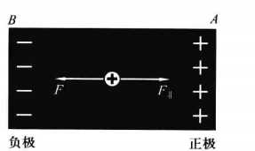

先考虑电源不接外电路的状态（叫开路状态，见图4—15）．假定电源内的正电荷受到从B向A的非静电力，它就要从B向A运动，于是A端带正电而B端带负电.A、B两端的正、负电荷激发一个从A向B的电场，因此电源内的正电荷除受非静电力$F_非$ 外还受到静电力F，两者方向相反

开始时$F$很小，$F＜F_非$，所以正电荷向A运动.随着A、B处电荷的逐渐增多，$F$逐渐变大，直到$F＝F_非$时达到平衡，A、B处电荷不再增加，A、B之间的电压也达到一个确定值

- 这就说明，电源开路时两端存在一个固定的电势差
- 通常把开路时电势高（低）的一端叫做电源的正（负）极
- 现在用导线（带一定电阻）把A、B接通形成外电路，A、B的正负电荷便在导线中激发电场，导线内的正电荷便在静电力的作用下做定向运动，形成从A经外电路至B的电流.随着正电荷这种运动的出现，A与B处的正负电荷便有减少的趋势，电源内正电荷所受的F便有小于$F_非$的倾向，于是正电荷又从B向A运动，整个电路便形成一个闭合的电流
- 应该注意，电源内外虽然都有电流，但其直接起因是不同的：在电源内部，非静电力起主导作用，因此电流从低势点B到高势点A；在外电路，正电荷只受静电力，因此电流从高势点A到低势点B.

- 电源内部的定量关系可仿照$\vec J＝\gamma \vec E$的推导方法求得
  - 在电源内部定义非静电场电场强度$$E_非＝F_非／q$（其中$F_非$是电荷$q$所受的非静电力）
  - 电源内部$$\boldsymbol{\vec J}=\gamma\left(\boldsymbol{\vec E}+\boldsymbol{\vec E}_{非}\right)$$其中$\gamma$是电源内部的电导率
- 第二章讲过，导体静电平衡的必要条件是内部各点静电场电场强度为零；这一结论其实只当导体内没有非静电力时才成立
  - 静电平衡时导体内部各点$J＝0$，即$\left(\boldsymbol{\vec E}+\boldsymbol{\vec E}_{非}\right)=0$
  - 因此更准确的提法是：静电平衡时导体内部各点的$\left(\boldsymbol{\vec E}+\boldsymbol{\vec E}_{非}\right)=0$
  - 当导体内部有非静电力时，为了$J＝0$，恰恰必须$E≠0$，正是E的存在抵消了E而保证静电平衡得以实现

### 电动势，一段含源电路的欧姆定律

$$\int_{B}^{A}\boldsymbol{E}_{\text{非}}\cdot\mathrm{d}\boldsymbol{l}=U_{AB}+IR_{\phi}.$$

上式左边的积分等于单位正电荷从负极经电源内部移到正极时非静电力所做的功，叫做电源的电动势

电动势与电压有相同的单位.按照国际惯例，以大写花斜体拉丁字母epsilon代表电动势（以区别于代表电场强度的大写斜体$E$），上式成为$$\mathcal{E}=U_{_{AB}}+IR_{_{\nu}}.$$

- 实际效果为
  - 因为插件暂时无法打出该花体，所以暂时用$\xi$表示电动势

此式说明，流过电源的电流I不但与电源两端的电压UB及内阻R有关，而且取决于电源的电动势；这是与电源以外的电路（不含源电路）的重要区别.不含源电路的欧姆定律U＝IR绝不能用于电源内部：涉及电源的电流与电压的关系时必须使用式（4—22），即必须考虑电动势$\xi$

- 一段含源电路的欧姆定律微分形式$$\boldsymbol{\vec J}=\gamma\left(\boldsymbol{\vec E}+\boldsymbol{\vec E}_{非}\right)$$
- 含源欧姆定律的积分形式$$\mathcal{\xi}=U_{_{AB}}+IR_{_{\nu}}.$$
- 含源欧姆定律适用于所有点，对于不含电源的点，其$E_非=0$，此时欧姆定律退化为不含原的欧姆定律

消去$U_{AB}$得到全电路欧姆定律$$E=I(R_{_p}+R)$$或者$$I=\frac{E}{R_{\phi_{1}}}+R.$$

上面把$\int_{B}^{A}\boldsymbol{\vec E}_{非}\cdot\mathrm{d}\boldsymbol{\vec l}$定义为电源的电动势
- 还可以把整个环路积分$\oint \boldsymbol{\vec E}_{非}\cdot\mathrm{d}\boldsymbol{\vec l}$定义为闭合电路的电动势
- 当闭合电路只含一个电源时，这个闭合电路的电动势就等于这个电源的电动势
- 当闭合电路包含多个电源（串联）时，其电动势等于所有电源电动势的代数和
- 虽然电动势与电压有相同单位，而且都是某个矢量的线积分，但这两个矢量（$E_非$和$E$）有很不相同的物理意义
- 从数学角度看，$E$是势场而$E_非$不是
  - （$E$的线积分与路径无关而$E_非$的线积分与路径有关），
  - 其后果是：指定两点就可谈及电压，但要谈电动势则必须指定一段电路（曲线）
  - “B、A两点之间的电动势”一类的提法一般没有意义.

下面再介绍电源的端压和内阻电势降的概念
- 端压亦称路端电压，是指电源正负两极之间的电压，即$U_{AB}$
- 一般情况下电源的端压不等于电动势，两者之差为$IR$，即电源电流与内阻之积，称为内阻电势降
- 对于无内阻电源，$IR＝0$，端压在数值上等于电动势
- 蓄电池和新的干电池内阻很小，一般场合下其端压与电动势近似相等.对于有内阻的电源，只要流过它的电流为零（处于开路状态的电源就如此），端压也与电动势数值相等

### 电动势的测量，电势差计

无电流时电源端压等于电动势的结论使我们有可能通过测量端压来测量电动势
- 电压表（伏特表）虽然可以方便地测出端压，但它的接入不可避免地会使电流流过电源，而电源或多或少总有内阻，因此这样测得的端压略小于电动势
- 要精确地测定电动势，可以设法在没有电流流过电源的条件下测量它的端压;采用补偿法可以做到这一点
- 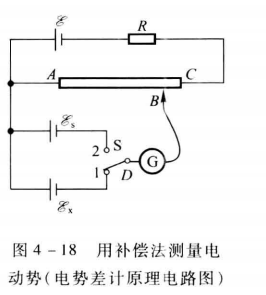

未完待续

### 导线表面的电荷分布

前面多次提到，外电路中载流子的定向运动是电场力作用的结果.现在问：激发这个电场的电荷分布在什么地方？

- 可能会这样回答：电流是电源引起的，电源两极存在着正、负电荷，因此电路内的电场是由电源两极的电荷激发的
- 这个回答非常片面.电源两极的电荷诚然要在周围空间激发电场，但电路内的电场绝不只由这些电荷激发
  - 反例
  - 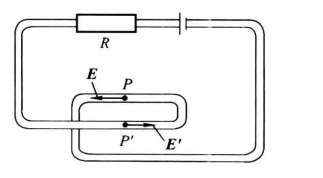
  - 将外电路的导线折一个弯，在拐弯处取两个极近的点$P$和$P'$并讨论它们的电场强度$\vec E$和$\vec E'$
  - 因为电流总沿导线流通，$\vec E$和$\vec E'$的方向应该相反
  - 然而，如果$\vec E$和$\vec E'$只由电源两极的电荷激发，如此互相靠近的两点的电场强度方向是不可能截然相反的.
  - 可见必然还有其他电荷对电场提供贡献
  - 如果电路以外没有带电体，这些其他电荷就只能是导线上积聚的电荷
- 通常电路所用导线可看做均匀导线，均匀导线内各点的电荷体密度为零；
- 然而，导线表面以及不同导线材料的接头处却可以存在电荷面密度，它们往往是导线内电场强度$\vec E$ 的主要贡献者
- 电荷在导线表面的分布与导线的形状有密切关系
  - 电荷分布的最终要求是使导线内部各点的电场强度沿着导线的方向，并从电源正极沿导线指向负极
  - 如果导线形状发生变化，原来的电荷分布便不再能保证导线中各点的$\vec E$仍沿导线方向
  - 于是电荷分布将自动调整，直至导线内的$\vec E$沿导线从电源正极指向负极为止
  - 在调整过程中电流场并不恒定（事实上也只有非恒定电流才会出现电荷分布的改变），但一般只需极短时间就能达到新的恒定状态
  - 导线表面的电荷不但在导线内部而且在导线外部激发电场

### 直流电路的能量转换

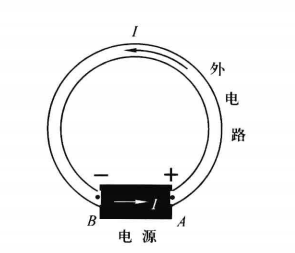

先讨论图中全电路工作时的能量转换问题
- 可能参与转换的能量有
  - 电池的化学能
  - 电阻消耗的焦耳热
  - 电场能
- 恒定电流的电场不随时间而变，电场能量应该不变
- 因此参与转换的实际上只有前两项、
- 用$I$乘全电路欧姆定律${\mathcal{E}}=I(R_{内}+R)$得$$\mathcal{E}I=I^{2}R_{内}+I^{2}R.$$
  - 上式左边的物理意义：单位正电荷从电源负极移到正极时非静电力的功等于$\mathcal{E}$
    - 而单位时间内从负极移到正极的电荷等于$I$
    - 故$\mathcal{E}I$等于非静电力在单位时间内的功
  - 上式右边，显然等于内、外电路在单位时间内所消耗的焦耳热
- 因此，上式表明电源非静电力的功全部转化为内、外电路的焦耳热，这显然是符合能量守恒定律的
- 应该指出，电场能量虽然并未参与能量转化，但电场的存在却是实现这种转化的必要前提.没有电场就没有电流，上述的能量转换过程也就不可能发生

电阻消耗的焦耳热是电场力的功转化来的．电场力既然做了功，电场的能量似乎就应减小，为什么本节又说电场的能量不变呢？这个问题要从电路的全局来考虑
- 
- 在外电路中，电流从高电势到低电势，电场力做正功，其值等于$IU_{AB}$
- 在电源内部，电流从低电势到高电势，电场力做负功（非静电力做正功），其绝对值也等于$IU$
- 整体看来电场力的功为零，因此电场的能量不变

当电路中有不止一个电源时，流过其中某一电源的电流可能与其非静电力方向相反，于是非静电力做负功，电源的非静电能不但不减小反而增加

## 基尔霍夫方程组

本节介绍复杂电路计算问题
- 使用电阻串、并联公式把电路化简为无分支闭合电路时，可能遇见难于化简的情形，原因不外两点：
  - 多个电阻的联接并非总可看做串、并联的组合
  - 当并联支路中有一条以上含源时，就无法用电阻的并联公式化简为一条支路
- 通常把不能用普通方法化简的电路叫做复杂电路，求解复杂电路的基本公式是基尔霍夫方程组
  - 对于一个不论多么复杂的线性直流电路，如果所有电源的电动势、内阻及各个电阻皆已知，利用基尔霍夫方程组就一定可以求出各支路的电流
  - 基尔霍夫方程组包含两个方程组，分别介绍如下

### 基尔霍夫第一方程组

前面已从恒定条件推出了基尔霍夫第一定律：流进直流电路任一节点的电流等于从该节点流出的电流
- 现根据这一定律对有关节点列出基氏第一方程
- n个节点可且仅可列出n-1个独立基式第一方程；这n—1个独立方程构成基氏第一方程组
  - 基氏第一方程组与基氏第二方程组联立可根据已知电动势及电阻求得每一支路的电流
- 在列出节点方程时，凡流入节点的电流都写在等式的一侧，凡从节点流出的电流都写在另一侧
  - 但是，求解复杂电路问题时，各支路电流往往是未知量，它们的方向事先并不知道
  - 这时，可以先给每个支路电流假设一个方向，并按照这一方向列出方程
- 求解基氏联立方程后，如果求得某支路电流的数值为正，则该电流的实际方向与假设方向相同，否则相反
  - 这个假设的电流方向叫做电流的正方向
  - 给每一支路电流假设一个正方向之后，就可用代数量描写每条支路的电流
  - 代数量的绝对值反映电流的大小
  - 代数量的正负则反映电流的实际方向
- 正方向一经选定，节点方程的形式就完全确定

假设将所有电流写在等式左边，右边为0

- 选定电流的正方向
- 凡流入节点的电流前写$-$号
- 凡从节点流出的电流前写$+$号
- 当$k$条支路连接于某一节点时，节点方程总是可以写为$$\sum_{i=1}^{k}\left(\pm I_{i}\right)=0,$$其中$±$号不可省略
- $I_i$本身仍可具有代数符号

### 基尔霍夫第二方程组

基氏第二方程是把恒定电场的环路定理及直流电路的欧姆定律用于回路的结果

- 定义回路：由若干支路组成的、满足如下两条件的部分：
  - 自身闭合
  - 只要切断其中任一支路就不再闭合
- 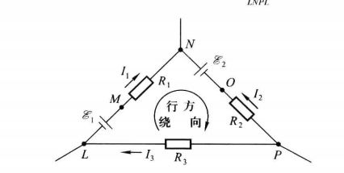
  - 图中电源的内阻都已合并到所在支路的电阻中
- 对该环路使用环路定理得$$\oint_{LNPL}\vec E\cdot\mathrm{d}\boldsymbol{\vec l}=0$$等价于$$\int_{L}^{M}\boldsymbol{E}\cdot\mathrm{d}\boldsymbol{l}+\int_{M}^{N}\boldsymbol{E}\cdot\mathrm{d}\boldsymbol{l}+\int_{\Lambda}^{0}\boldsymbol{E}\cdot\mathrm{d}\boldsymbol{l}+\int_{0}^{\nu}\boldsymbol{E}\cdot\mathrm{d}\boldsymbol{l}+\int_{\rho}^{L}\boldsymbol{E}\cdot\mathrm{d}\boldsymbol{l}=0,$$即$$U_{_{LM}}+U_{_{MN}}+U_{_{NO}}+U_{_{OP}}+U_{_{PL}}=0.$$
- 任意选定一个绕行回路的方向（叫做绕行方向）
  - 当绕行方向从负极进入电源时，其电动势前写＋号，否则写—号
  - 当绕行方向与电阻的电流正方向相同时，该电阻的IR项前写＋号，否则写—号
  - $I$本身可正可负，取决于其正方向与实际方向的关系；
  - $IR$项前可能写＋也可能写—，取决于I的正方向与绕行方向的关系.
- 带入可得$$-{\mathcal E}_{1}+I_{1}R_{1}+{\mathcal E}_{2}-I_{2}R_{2}+I_{3}R_{3}=0,$$该方程称为该回路的基尔霍夫第二方程，亦称回路方程

一个电路可以包含许多回路，但它们的
方程并非都是独立的
- 电路中所有独立的回路方程构成基氏第二方程组
- 为了列出独立的回路方程，可选择这样的回路
  - 其中每个至少包含一条其他回路所不包含的支路
  - 一个完整电路的支路数$b$、节点数$n$和独立回路数$m$之间有一个确定的关系$$b=m+n-1.$$
- 如果全部电动势及电阻皆已知，则电路共有b个未知的支路电流
- 另一方面，由前述可知，这个电路必有n—1个独立的节点方程及m个独立的回路方程，即共有m＋n—1个独立方程，恰与未知量个数b相等，因此可唯一解出各支路电流
- 当然，除支路电流外，电动势或电阻也可作为未知量，只要未知量个数为b，同样可以求解
- 可见基氏方程组原则上可以解决一切线性直流电路的计算问题
- 当电动势是待求量而且连电源的极性也未知时，可以任意地给电动势选定一个正方向（即假设一对正、负极，电动势的正方向是指从假设的负极到正极的方向），并把作为代数量列出基氏第二方程，方程中8前的＋、—号应根据绕行方向是否进入假设的负极来决定．求解后，如果x＞0，则实际极性与假设极性相同，否则相反

# 恒定电流的磁场

矢量的叉积
- $\vec c=\vec a\times \vec b\neq \vec b\times \vec a$
- $|\vec c|=|\vec{a}|\bullet|\vec{b}|\bullet\sin\theta$
- 方向满足右手定则：右手握拳，令右手四指和$\vec a$平行，然后以最短的弯曲角度弯向$\vec b$；拇指所指方向记为$\vec c$的方向
## 磁现象及其与电现象的联系

磁场：带电粒子的运动激发磁场，磁场对运动的带电粒子施加力；因此使用运动点电荷作为试探点电荷
- 实验表明，对磁场中的任意给定点$P$，不论试探电荷有怎样的$q$和$v$，必定存在唯一的矢量$B$使下式成立：$$\vec F=q\boldsymbol{\vec v}\times\boldsymbol{\vec B}.$$
- 因此$B$是描述磁场中每点性质的物理量；称为磁感应强度；运动带电粒子在磁场中所受的力称为洛伦兹力
  - $\vec F=q\boldsymbol{\vec v}\times\boldsymbol{\vec B}.$清楚地反映洛伦兹力如何依赖于其外因（磁场B）和内因（试探电荷的电荷$q$和速度$\vec v$的乘积）

- 由恒定电流激发的磁场称为恒定磁场（或静磁场）
- 与静电场类似，恒定磁场也是与时间无关的矢量场.本章只讨论恒定磁场

## 毕奥-萨伐尔定律

矢量电流元：静磁场中载有电流的元段；现讨论电流元所激发的元磁场$d\vec B$
- 设导线的电流为$I$，矢量$d\vec l$代表导线上任一有向元段，方向与电流相同
- 载流元段/电流元：$Id\vec l$
  - 由于恒定电流的闭合性，恒定电流元不会单独存在
  - 因此不可能通过实验直接测出恒定电流元的磁场
- 默认磁场与电场一样服从叠加原理，则任何形状的载有恒定电流的导线的磁场都是它的所有元段的磁场的矢量和
- 通过对不同形状的载流导线的实验研究（包括安培的平行直长载流导线的实验），人们相信电流元$Id\vec l$激发的元磁场$d\vec B$由下式表示（国际单位制）：$$\mathrm{d}\boldsymbol{\vec B}=\frac{\mu_{0}}{4\pi}\frac{I\mathrm{d}\boldsymbol{\vec l}\times\boldsymbol{\vec e}_{t}}{r^{2}}.$$
- 其中$r$是电流元$Id\vec l$（看做位于一点）与场点$P$的距离，$e_r$是从$Id\vec l$指向场点$P$的单位矢量
- $μ_0=4π\times 10^{—7}N/A^2$
- 该公式通常称为毕奥—萨伐尔定律
- $B$的国际单位制单位叫做特斯拉$Tesla$
- 任意形状的、载有恒定电流的导线的磁场都可从毕奥—萨伐尔定律出发借助积分求得

因为电荷是标量，因此点电荷激发的电场具有球对称性；电流元$Id\vec l$是矢量，因此电流元的磁场没有球对称性，但具有轴对称性
- 毕奥—萨伐尔定律明确指出电流元的磁场的对称轴是$Id\vec l$的延长线
  - 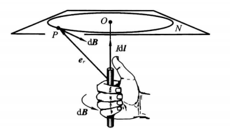
  - 设$N$是任一与$Id\vec l$延长线正交的平面；$O$为平面与延长线的交点
  - 平面上以$O$为圆心的任一圆周上各点的$d\vec B$大小相同，方向沿切向，而且与$Id\vec l$有右手螺旋关系
  - 右手螺旋：令右手拇指代表$Id\vec l$的指向，则弯曲的四指将代表$d\vec B$的方向
- 电流元的所有磁感应线都是同心圆周

### 直长载流导线的磁场

先计算有限长载流直导线的磁场$\vec B$

- 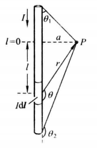
- 由毕奥—萨伐尔定律可知直导线上任一电流元在任一场点$P$的元磁场都有相同方向
- $P$点的$\vec B$的大小可由标量积分求得$$B=\int_{l_{1}}^{l_{2}}\frac{\mu_{0}}{4\pi}\frac{I\mathrm{d}l\sin\theta}{r^{2}}$$
- $\theta$随着积分点的变化而变化，关系如下$$l=-a\cot\theta,\quad r=\frac{a}{\sin\theta}$$
- 有限长载流直导线在$P$点的磁场大小$\vec B$$$B=\frac{\mu_{0}I}{4\pi a}(\cos\theta_{1}-\cos\theta_{2})$$其中$\theta_1，\theta_2$是导线两端和场点$P$的夹角
- 无限长载流直导线在$P$点的磁场大小$$B=\frac{\mu_{0}I}{2\pi a}$$
  - 无限长直导线的磁场大小取决于场点与导线的距离$a$，而且与$a$成反比

### 圆形载流导线的磁场

现计算圆形载流导线（简称圆形电流）轴线上的磁场

- 
- 在圆周上任取一点$C$；半径$OC$与轴线所在平面记为$N$
- 易知$$\mathrm{d}B=\frac{\mu_{0}}{4\pi}\frac{I\mathrm{d}l}{r^{2}}.$$

- 沿轴线的分量$$\mathrm{d}B_{\parallel}=\mathrm{d}B\cos\alpha=\frac{\mu_{0}}{4\pi}\frac{\mathrm{ld}l}{r^{2}}\mathrm{cos}\alpha=\frac{\mu_{0}}{4\pi}\frac{\mathrm{ld}l}{r^{2}}\mathrm{sin}\beta,$$
- $C$和$C'$在场点激发的磁场垂直圆形电流轴线方向上的分量抵消，沿圆周对沿轴线的分量积分可得$P$点磁场的大小$$B=\frac{\mu_{0}IR^{2}}{2\left(a^{2}+R^{2}\right)^{3/2}}.$$
- 圆心处磁场$$B=\frac{\mu_{0}I}{2R}.$$

### 载流螺线管轴线上的磁场

螺线管：均匀紧密地绕在圆柱面上的螺旋形线圈

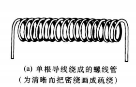

设螺线管半径为$R$，导线电流为$I$，单位长度匝数为$n$，现计算螺线管轴线上的磁场$B$
- 当导线足够细，可近似处理为并排圆电流模型，即空筒上套着许多互不联接的圆形电流，其电流都为$I$
- 每个圆平面都与筒的轴线垂直，沿轴向单位长度的圆电流个数为单位长度匝数，即$n$

- 设$P$为轴线上任一场点，以$P$为原点在轴上定义一维坐标
  - 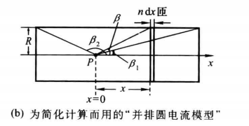
- 轴上任一元段$dx$对应着$ndx$匝，相当于电流为$Indx$的一个圆电流，在$P$点贡献的磁场大小按上一小节公式为$$\mathrm{d}B=\frac{\mu_{0}R^{2}In\mathrm{d}x}{2\left(x^{2}+R^{2}\right)^{3/2}},$$
- 引入角度变量$\beta$，表示场点与积分点$x$的关系： $$x\equiv R\cot\beta,$$带入$$\mathrm{d}B=-\frac{\mu_{0}nI\sin\beta}{2}\mathrm{d}\beta,$$
- 整个螺旋管对轴线任一点的磁场大小$$B=\frac{1}{2}\mu_{0}nI(\cos\beta_{1}-\cos\beta_{2}).$$

定义螺旋管半径$R$远小于螺线管长度$l$的螺线管为细长螺线管
- 此时可近似处理为没有半径，则$\beta_1=0,\beta_2=\pi$
- 无限长螺旋管内有均匀磁场$$B\approx\mu_{0}nI.$$
- 无限长螺旋管外的磁场大小为0

有限长的螺旋管，在螺线管的中央仍有$B\approx\mu_{0}nI.$；随着场点逐渐远离中央，$B$值逐渐减小
- 特别的，在两个端点，有$$\beta_{_1}=\pi/2,\beta_{_2}\approx\pi.$$
- 因此在端点处$$B\approx\frac{1}{2}\mu_{0}nl.$$
- 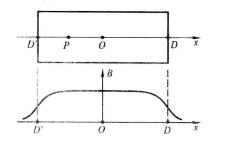
- 

## 磁场的高斯定理

本节讨论$B$的通量

磁场$B$对任一曲面$S$（无论闭合与否）的通量称为曲面$S$的磁通量，简称磁通$${\boldsymbol{\Phi}}=\iint_{S}\vec B\cdot\mathrm{d}\vec S$$
- 国际单位制单位：韦伯Weber，记为$Wb$
  - $1 Wb＝IT·㎡$
  - $T$：Tesla特斯拉

磁场的高斯定理
- 与静电场不同，磁场对任意闭合曲面的通量都为零$$\oiint_{s}\boldsymbol{\vec B}\cdot\mathrm{d\vec S}=0$$
- 在承认叠加原理的基础上，只需证明电流元的$B$满足磁场的高斯定理
- 设$S$是任一闭曲面．作以电流元$Idl$的延线为轴线、横截面为小矩形的许多立体圆环；
  - 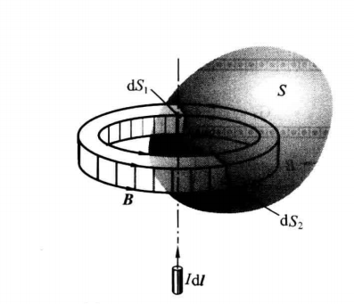
  - 不相交的立体圆环集合组成空间
- 每一圆环与$S$相交两次，相交处是$S$面的一对面元$dS_1$和$dS_2$
  - 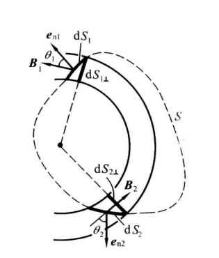
  - 这些不相交的面元对集合组成闭合曲面$S$
- 为了证明$S$的磁通为零，只需证明每对面元的磁通代数和为0
  - 为书写方便，把毕—萨定律中的$dB$简写为$B$
  - 设面元$dS_1$和$dS_2$的磁场各为$B_1$和$B_2$
  - $B_1$在$dS_1$上的投影量$$\mathrm{d}S_{_1\perp}=\mathrm{d}S_1\cos\theta_1$$其中$\theta_1$为$dS_1$与$dS_{\perp}$所夹的锐角
  - 约定$dS_1$和$dS_2$的外向单位法矢量$e_{n1}$和$e_{n2}$
- 易知$$\begin{array}{rcl}{}&{{\mathrm{d}\Phi_{_1}=B_{_1}\cdot\mathrm{d}S_{_1}=B_{_1}\mathrm{d}S_{_1},}}\\{{\mathrm{d}\Phi_{_2}=B_{_2}\cdot\mathrm{d}S_{_2}=B_{_2}\cos\left(\pi-\theta_{_2}\right)\mathrm{d}S_{_2}=-B_{_2}\mathrm{d}S_{_2\perp}.}}\end{array}$$
- 因为$dS_1$和$dS_2$是同一立体圆环的横截面，所以$dS_1=dS_2$
- 由电流元磁场的轴对称性又知$B_1＝B_2$
- 因此$$\mathrm{d}\Phi_{_1}+\mathrm{d}\Phi_{_2}=0.$$

由磁场的高斯定理可得一个重要的推论：以任一闭曲线$L$为边线的所有曲面都有相同的磁通

- 设$S_1$和$S_2$是以闭曲线$L$为边线的两个曲面，则两者合起来构成一个闭曲面$S$
- 由$B$的高斯定理得$$0=\iint_{S}B\cdot\mathrm{d}S=\iint_{S_{1}}B\cdot\mathrm{d}S+\iint_{S_{2}}\boldsymbol{B}\cdot\mathrm{d}S,\text{故}\iint_{S_{1}}\boldsymbol{B}\cdot\mathrm{d}\boldsymbol{S}=-\iint_{S_{2}}\boldsymbol{B}\cdot\mathrm{d}\boldsymbol{S}.$$

静电场$E$的高斯定理可得出结论：
- 静电场线起于正电荷、止于负电荷，在无电荷处不中断
- 因此正电荷是源、负电荷是汇

磁场$B$的高斯定理$$\oiint \vec B\cdot\mathrm{d}\vec S=\mathrm{0}$$
- 该公式暗示不存在所谓的磁荷；
- 即$B$线既无源也无汇

注意：$B$线既无源也无汇和$B$线是闭合曲线没有联系

## 安培环路定理

已知静电场具有环路积分为0的性质$$\oint_L\vec E\cdot\mathrm{d}\vec l=0$$
- 该公式暗示静电场是势场

现证明$B$不是势场,不妨设磁场$B$由无限长直导线激发

- 先讨论闭曲线$L$躺在与直导线垂直的平面内的情况
  - 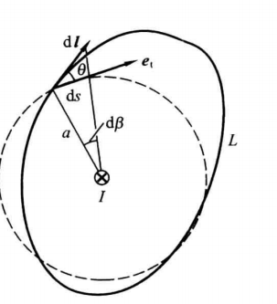
  - 任一线元$dl$对环流的贡献为$$B\cdot\mathrm{d}\boldsymbol{l}=\frac{\mu_{0}I}{2\pi a}\boldsymbol{e}_{,}\cdot\mathrm{d}\boldsymbol{l}=\frac{\mu_{0}I}{2\pi a}\mathrm{d}l\cos\theta,$$
  - $B$沿$L$的环流$$\oint_{\iota}B\cdot\mathrm{d}l=\mu_{0}I.$$
- 闭曲线$L$不围绕长直导线的情况
  - 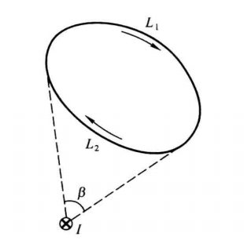
  - 从平面与导线交点出发作曲线的两条切线将曲线分为两部分$L_1$和$L_2$$$\oint_{\ell}\boldsymbol{B}\cdot\mathrm{d}\boldsymbol{l}=\int_{\ell_{1}}\boldsymbol{B}\cdot\mathrm{d}\boldsymbol{l}+\int_{\ell_{2}}\boldsymbol{B}\cdot\mathrm{d}\boldsymbol{l}=\frac{\mu_{0}}{2\pi}\Big(\int_{\ell_{1}}\mathrm{d}\boldsymbol{\beta}-\int_{\ell_{2}}\mathrm{d}\boldsymbol{\beta}\Big)=\frac{\mu_{0}\boldsymbol{l}}{2\pi}(\boldsymbol{\beta}-\boldsymbol{\beta})=0.$$
  - B沿不围绕长无限长直导线的闭曲线的环流为零

综上所述：如果闭曲线$L$围绕无限长直导线$n$周，则$$\oint_{\iota}\boldsymbol{\vec B}\cdot\mathrm{d}\boldsymbol{\vec l}=\mu_{_0}nI.$$

- 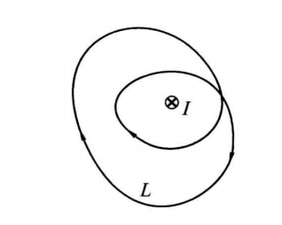

现在将上述结论推广至任意恒定磁场得到安培环路定理

- 恒定磁场$B$对任意闭曲线$L$的环流满足$$\oint_{\iota}\boldsymbol{\vec B}\cdot\mathrm{d}\boldsymbol{\vec l}=\mu_{_0}nI.$$
- 其中$I$代表$L$所围绕的电流值
- 定义围绕：
  - 以$L$作任意曲面$S$，$L$所围绕的电流值等价于穿过$S$的电流，等价于$S$的$\vec J$通量

安倍环路定理

- 只在恒定电流激发的恒定磁场成立，对非恒定电流激发的磁场一定不成立
- 安倍环路定理说明磁场不是势场；不是势场的矢量场称为涡旋场
- 在静磁学中，当电流分布有适当对称性时，单从安培环路定理就可求得恒定磁场
- 设两电流元关于平面$Σ$镜像对称，则它们在$Σ$上激发的合磁场$B$必垂直于$Σ$（除非$B＝0$）

### 无限长圆柱形均匀载流导线的磁场

### 无限长载流螺线管的磁场

### 载流螺绕环的磁场

$$B=\mu_{0}nl.$$
### 均匀载流无限大平面的磁场

## 带电粒子在电磁场中的运动

磁场对运动带电粒子的洛伦兹力$\vec F=q\vec v \times \vec B$

- $F$垂直$v$，因此洛伦磁力不做功，但是会改变粒子运动的方向

### 带电粒子在均匀恒定磁场中的运动

虽然恒定磁场$B$与时间无关，但因粒子速度可随时间而变，其所受的洛伦兹力也可随时间而变
- $u(t)$：粒子的瞬时速度，$q$：粒子的电荷
- 粒子在每个时刻所受的洛伦兹力$$\boldsymbol{\vec F}\left(t\right)=q\boldsymbol{\vec u}\left(t\right)\times\boldsymbol{\vec B}$$
### 霍耳效应

## 磁场对载流导体的作用

载流导线置于磁场$B$中，则导线内做定向运动的带电粒子必将受到$B$的洛伦兹力$\vec F＝q\vec v\times \vec B$，其方向与$\vec v$横向垂直、，但粒子因受到导线的约束而不能从横向离开导线，其结果便表现为导线本身受到一个横向力

可见安培力是洛伦兹力的一种宏观表现

电流元$dl$所受洛伦磁力
- 
- 细长导线的一个元段，是长$dl$、横截面积$S$的小柱体，可看做一个电流元$Id\vec l$；
  - 其中$I$为截面$S$的电流，$dl$是长为$dl$且与$\vec J$同向的矢量
- 设元段内单位体积的载流子数为$n$，每个载流子电荷为$q$，其定向运动速度为$\vec v$
- 元段的电流密度$\vec J＝qn\vec u$．因柱内的载流子数为$N＝nSdl$
- 柱内所有载流子所受洛伦兹力的合力为$$\mathrm{d}\boldsymbol{\vec F}=I\mathrm{d}\boldsymbol{\vec l}\times\boldsymbol{\vec B}$$
  - 任意载流导线所受安培力积分可由上式积分求得

### 载流线圈在均匀外磁场中的安培力矩

本小节只讨论平面线圈；

矩形线圈

- 线圈所在平面有两个可能法向，约定$\vec e_n$代表与电流成右手关系的那个法向的单位矢量
  - 右手四指握拳而拇指伸直
  - 四指方向与电流一致时拇指的指向为$\vec e_n$的方向
- 矩形线圈
  - 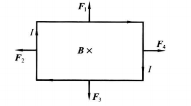
  - $B$与线圈平面垂直，即$B$与$\vec e_n$平行
    - $1、3$边所受的安培力等值反向，合力及合力矩都为零
    - $2、4$边所受的安培力等值反向，合力及合力矩都为零
    - 故线圈既不受力又不受力矩
  - $B$与线圈平面平行，即$B$与$\vec e_n$垂直
    - 
    - 若$B$与$1、3$边平行
    - 由$d\vec F＝Id\vec l\times \vec B$可知$1、3$边所受安培力为零，$2、4$边的安培力虽然合力为零，但构成一个力偶矩$M$，其方向竖直向下，大小为$$M=l_{1}F_{2}=l_{1}l_{2}IB=ISB$$
    - 定义矢量：载流线圈的磁矩$$\vec p_{{\mathfrak{m}}}=IS\vec e_{{\mathfrak{n}}},$$记为$$\vec M=\vec P_{\mathfrak{m}}\times \vec B$$
- 如果磁场B与线圈平面既不垂直又不平行，则可把B分解为与线圈平面垂直和平行的两个分量，前者对力矩无贡献，后者的贡献为$\vec M=\vec P_{\mathfrak{m}}\times \vec B_{//}$
- 结论：载流矩形线圈在任意方向的均匀外磁场中所受合力为零，合力矩$\vec M=\vec P_{\mathfrak{m}}\times \vec B{//}$

任意形状的平面载流线圈

- $I$和$S$分别代表线圈的电流和面积，仍用$\vec p_{{\mathfrak{m}}}=IS\vec e_{{\mathfrak{n}}},$定义线圈的磁矩
- 使用许多细长矩形把线圈所围的部分近似填满
  - 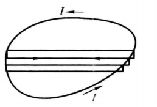
  - 每一矩形是一个载流线圈，其电流等于所论线圈的电流$I$
  - 相邻矩形的公用长边流过两个等值反向的电流$I$，它们所受的安培力抵消，所有矩形线圈所受的安培力和力矩的矢量和等于所论线圈所受的力和力矩，注意到所有矩形的法向单位矢都与所论线圈的$\vec e_{{\mathfrak{n}}}$一样，且所有矩形线圈面积之和等于所论线圈的面积、便知所有矩形线圈的磁矩矢量和等于所论线圈的磁矩
- 线圈所受力矩近似为$$\vec M=\vec P_{\mathfrak{m}}\times \vec B$$
# 电磁感应与暂态过程

## 电磁感应

法拉第电磁感应定律
- 电磁感应：当穿过闭合线圈的磁通改变时，线圈中出现感应电流

- 电动势：单位电荷从电源一端经电源内部移至另一端时非静电力的功
- 感应电流的出现说明电路内一定存在某种电动势；称电磁感应引起的电动势为感应电动势，服从如下规律$$E=k\frac{\mathrm{d}\Phi}{\mathrm{d}t}$$
- 在国际单位制下的法拉第定律$$E=\frac{\mathrm{d}\Phi}{\mathrm{d}t},$$

## 楞次定律

楞次定律的第一种表述形式：感应电流的磁通总是力图阻碍引起感应电流的磁通变化
- 当引起感应的磁通增加时，感应电流的磁通与该磁通方向相反阻碍它的增加
- 当引起感应的磁通减小时，感应电流的磁通与该磁通方向相同阻碍它的减小

考虑了楞次定律的法拉第定律表达式
- 感应电动势的方向由楞次定律确定
- 将磁通和感应电动势视为标量，并且为这两个标量约定什么时候为正
- 约定感应电动势$E$与磁通$Φ$的正方向互成右手螺旋关系
  - 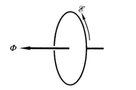
- 考虑了楞次定律的法拉第定律应写成下式：$$E=-{\frac{\mathrm{d}\Phi}{\mathrm{d}t}}$$
## 动生电动势

法拉第定律说明，只要闭合电路的磁通有变化就有感应电动势，不问这种变化起于什么原因；事实上，磁通是磁场B对某一曲面的通量，磁通变化的原因无非下列三种：
- B不随时间变化（恒定磁场）而闭合电路的整体或局部在运动，这样产生的感应电动势叫做动生电动势
- B随时间变化而闭合电路的任一部分都不动，这样产生的感应电动势叫做感生电动势
- B随时间变化且闭合电路也有运动，这时的感应电动势是动生电动势和感生电动势的叠加
### 动生电动势与洛伦兹力

计算方式一：洛伦兹力公式推出的公式
$$E_{\phi}=\int(\mathbf{\vec v}\times\mathbf{\vec B})\cdot\mathrm{d}\boldsymbol{\vec l}$$

计算方式二：法拉第定律
- 闭合电路整体或局部在恒定磁场中运动；根据运动情况求出闭合电路的磁通$Φ$与$t$的关系，求微商$dΦ／dt$便得动生电动势$E$．
- 一段不闭合导线$PQ$在恒定磁场中运动；不闭合导线不存在磁通概念，但可假想一条不动的曲线与$PQ$组成闭合曲线，其动生电动势可由法拉第定律求得.由于虚线$PMQ$不动及磁场不变，$PMQ$段没有动生电动势，故$E$也就是导线$PQ$的动生电动势
  - 

## 感生电动势和感生电场

既然静止线圈在时变磁场B中会出现感生电动势，可见线圈中的电子必然由于B的变化（aB／at≠0）而受到某种非静电力．.不妨把电场和电场力的概念加以推广，把静止电荷所受的电磁起源的力都叫做电场力，并说能提供电场力的空间存在电场．这样推广后，就有两种起因不同的电场：（1）由电荷分布按库仑定律激发的电场，称为库仑电场；（2）由时变磁场激发的电场，称为感生电场（作用于单位电荷上的感生电场力的功就是感生电动势）.在一般情况下，空间中既有电荷又有时变磁场，因而既存在库仑电场又存在感生电场.以E、E及E分别代表库仑电场、感生电场及总电场，就有$$\boldsymbol{E}\left(t\right)=\boldsymbol{E}_{_\text{库}}{\left(t\right)}+\boldsymbol{E}_{_\text{感}}{\left(t\right)},$$

### 既有磁场又有电场时的洛伦兹力公式

$$\boldsymbol{\vec F}=q\left(\boldsymbol{\vec E}+\boldsymbol{\vec v}\times\boldsymbol{\vec B}\right).$$

### 感生电场的性质

首先肯定感生电场中，环路积分必定不为0，否则任一闭合线圈的感生电动势都为0

$$\oint_{L}\vec E_{\mathrm{感}}\cdot\mathrm{d}\vec l=-\frac{\mathrm{d}\Phi}{\mathrm{d}t},$$
# 磁介质

磁介质可按其磁特性分为三类：
顺磁质
抗磁质
铁磁质
顺磁质、抗磁质的磁特性与铁磁质有很大不同，可合称为非铁磁质
# EOF

