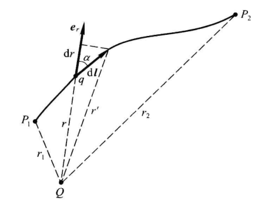
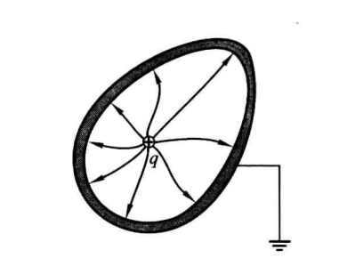
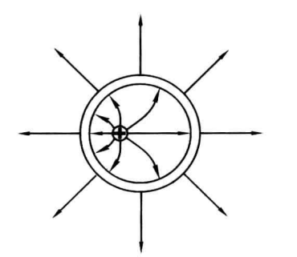
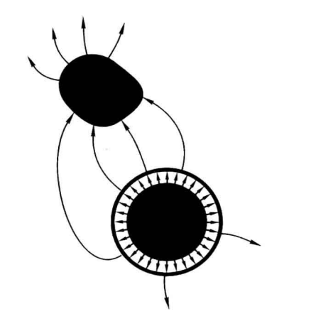

# Question

- 电场线条数的公式推导以及电场线密度的定义推导
- 在计算无线长均匀带电直线时，积分区间为$(-\infin,\infin)$的结果错误；
- 
  - 电荷面/体/线密度如何转换
- 
  - 怎么建立关于坐标的积分公式
- 
- 
- 
# 静电场

## 电荷

- 电荷守恒定律
  - 电中性：微观粒子中质子和电子的数量相同；
  - 物体失去/得到电荷才能处于带电状态；
  - 与外界没有电荷交换的系统中，正负电荷的代数和在任何物理过程中始终保持不变
- 电荷
  - 量子化：任何带电体的电荷是某一基本单位的整数倍，这个基本单位就是质子所带的电荷，叫做元电荷，记为$e$
  - 单位：库伦，记为$C$
- 电磁力是唯一在微观和宏观都能表现的力
  - $\displaystyle{F_{引}\over F_电}=10^{-36}$,在相同距离下，引力远远弱于电磁力；
    - 假定太阳和地球的电子数比质子数多出$10^{-18}$倍，那么日地间的电斥力将等于万有引力，同种电荷由于同性相斥难以聚集，因此天体是电中性的；
  - 电荷有正负两种，其效应相互抵消；而引力荷只有一种，它们的效应可以叠加，而同种电荷由于同性相斥却难于聚集在一起产生强电场；因此天体物理中引力起主导作用
- 基本相互作用力
  - 在各自作用范围中的数量级排序：强力、电磁力、弱力、引力
  - 质子之间的核力确保静电斥力不会使质子分离
  - 强弱力在宏观无法表现，电磁力虽然是远程力，但是因为相互抵消而不起作用；
  - 电磁力是唯一既有宏观表现也有微观表现的

## 库仑定律

- 静止的带电体之间的静电力的影响因素：电荷数、相对位置、带电体的形状、大小，带电体中的电荷分布情况；
  - 在所讨论问题的精度允许时，若带电体的线度远小于带电体之间的距离时，可以将带电体看作点电荷
- 库仑定律
  - 刻画相对于惯性系静止的两个点电荷间的静电力的规则
  - 大小相等方向相反，并且沿着它们的连线；同号电荷相斥，异号电荷相吸.
  - 大小与各自的电荷q1及q2成正比，与距离r的平方成反比，即$$F=k\frac{q_{1}q_{2}}{r^{2}}$$常量$$\displaystyle k=\frac{1}{4\pi\varepsilon_{0}}\approx9\times10^{9}\mathrm{N}\cdot\mathrm{m}^{2}/\mathrm{C}^{2}.$$常量$$\varepsilon_{0}\approx8.9\times10^{-12}\mathrm{C}^{2}/(\mathrm{N}\cdot\mathrm{m}^{2}).$$
- 库仑定律的矢量形式$${\boldsymbol{F}}_{12}=\frac{q_{1}q_{2}}{4\pi\varepsilon_{0}r^{2}}{\boldsymbol{e}}_{r12},\quad{\boldsymbol{F}}_{21}=\frac{q_{1}q_{2}}{4\pi\varepsilon_{0}r^{2}}{\boldsymbol{e}}_{r21},$$当$q_1和q_2$电荷量为负时$q$应为负值

### 电偶极子

- 等量异号的点电荷相距$l$，其带电量$q$；
- 均匀电场：连线与电场强度相同时稳定，否则旋转
- 电矩：$\vec p=q\vec{l}$

## 静电场

- 试探电荷
  - 线度必须小到可被看做点电荷，以便确定场中每点的性质
  - 电荷要足够小，使得它的置入不引起原有电荷的重新分布
  - 场点：在场中要研究的点
  - 标量场：坐标映射标量
  - 矢量场：坐标映射矢量
  - 求带电体激发的电场：等价于求函数$\overrightarrow{E(x,y,z)}$
- 电场
  - 电场强度$\displaystyle E= \frac{F}{q}$，单位 $N/C$
  - 均匀电场：各点电场强度有相同大小和方向
  - 计算某点的电场强度时，确定坐标轴，使用单位正交向量表示；

### 电荷连续分布的物体的电场

  - 宏观物体的静电荷来自微观粒子的叠加，因此电荷在微观上一定不是连续分布；
  - 问题的尺度是宏观时，忽略微观起伏，认为电荷连续分布在某一宏观体积、曲面、曲线上
  - 为描述电荷分布，引入概念：电荷体密度$$\rho\equiv\frac{\Delta q}{\Delta V}$$其中，$\Delta V$是小体元，其拥有的电荷为$\Delta q$
  - 体元的选取尺度：
    - 在宏观上应包含足够多的电荷，反映宏观物体是否电荷均匀分布；
    - 在微观上应足够大，避免暴露电荷分布的微观起伏；
    - 物理无限小体元：宏观很小微观很大
  - 电荷体密度是一个宏观标量场，若$\rho$处处相等，则电荷在该区域是均匀分布的
  - 电荷连续分布于带电体：将带电体划分为许多小体元$dV$，拥有电荷$\rho dV$，在$P$点激发的元电场强度$$\mathrm{d}\boldsymbol{E}=\frac{\rho\mathrm{d}V}{4\pi\varepsilon_{0}r^{2}}\boldsymbol{e}_{r},$$由电场叠加原理$$E=\frac{1}{4\pi\varepsilon_{0}}\iiint\frac{\rho\mathrm{d}V}{r^{2}}e_{r},$$
  - 电荷连续分布于薄层：当场点与薄层的距离远大于薄层的厚度$\delta$时，可忽略厚度，认为电荷连续分布在几何曲面上，在某点周围取面元$\Delta S$，该面元拥有电荷$\Delta q$，则该点的电荷面密度为$$\sigma\equiv\frac{\Delta q}{\Delta S}$$等价于以$\Delta S$为底，薄层厚度$\delta$为高的小体元
  - 电曲面的电场强度计算，将每一面元$\Delta S$视为带电量为$\sigma \Delta S$$$E=\frac{1}{4\pi\varepsilon_{0}}\iint\frac{\sigma\mathrm{d}S}{r^{2}}e_{r},$$
  - 电荷连续分布于细棒：当场点与棒的距离远大于棒的半径时，可忽略其半径视为电荷分布于一条线上，定义电荷线密度$$\eta\equiv\frac{\Delta q}{\Delta l}$$$Δq$是细棒上长度为$Δl$的元段内的电荷，电场强度$$E=\frac{1}{4\pi\varepsilon_{0}}\int\frac{\eta\mathrm{d}l}{r^{2}}e_{r}$$
###  均匀带电圆盘轴线上的电场强度
  - 已知圆盘半径是$R$，电荷面密度$\sigma>0$
  - 截取一个半扇型，其边界为：半径为$r$的圆,半径为$r+dr$的圆，两条夹角为$d\varphi$
  - 因$d\varphi$很小，可将该半扇型视为矩形，其长宽为$dr、rd\varphi$：$$\mathrm{d}S=r\mathrm{d}\varphi\mathrm{d}r$$其电荷$$dq=\sigma\operatorname{d}S=\sigma r\operatorname{d}\varphi\operatorname{d}r.$$半扇型对轴上场点P贡献的电场强度$$\displaystyle \mathrm{d}E=\frac{\sigma r\mathrm{d}\varphi\mathrm{d}r}{4\pi\varepsilon_0l^2}$$其中$l$是半扇型与$P$的距离
  - 只需对沿轴的分量$dE_z$作积分$$\mathrm{d}E_{:}=\mathrm{d}E\cos\alpha=\frac{\sigma r\mathrm{d}\varphi\mathrm{d}r}{4\pi\varepsilon_{0}l^{2}}\cos\alpha=\frac{\sigma r\mathrm{d}\varphi\mathrm{d}r}{4\pi\varepsilon_{0}l^{2}}\frac{z}{l}=\frac{\sigma zr\mathrm{d}\varphi\mathrm{d}r}{4\pi\varepsilon_{0}\left(r^{2}+z^{2}\right)^{3/2}}$$其中$z$是场点$P$与圆盘的距离，对变量$r、\varphi$做二重积分得$$E=\frac{\sigma z}{4\pi\varepsilon_{0}}\int_{0}^{2\pi}\mathrm{d}\varphi\int_{0}^{R}\frac{r\mathrm{d}r}{\left(r^{2}+z^{2}\right)^{3/2}}=\frac{\sigma}{2\varepsilon_{0}}\left[1-\frac{1}{\sqrt{1+\left(R/z\right)^{2}}}\right].$$

### 无限大均匀带电圆盘

- 均匀带电圆盘${\displaystyle {R\over z}=\infin}$时，对上述结果取极限$$\displaystyle E=\frac{\sigma}{2\varepsilon_0}\lim\limits_{\frac{R}{z}\to \infin}[1-(1+({R\over z})^2)^{-{1\over 2}}]=\frac{\sigma}{2\varepsilon_0}$$尽管不存在半径无限大的带电圆盘，但只要半径$R$远大于场点与圆盘的距离$z$，场点的电场强度就可以近似为$$E=\frac{\sigma}{2\varepsilon_{0}}$$由于$E$是$\displaystyle {R\over z}$的单调函数，所以$\displaystyle {R\over z}$越大，上式误差越小
- 对不在轴线上的场点，只要场点与轴线的距离$y\ll R$，以及$z\ll R$，就可以将圆盘近似看作无限大均匀带电圆盘，其不在轴线上的场点的电场强度也可近似表达为$$E=\frac{\sigma}{2\varepsilon_{0}}$$
- 对边缘不是圆形的均匀带电盘及场点，设场点距均匀带电盘的距离$z$，场点距带电区域的边缘距离$R_{max}、R_{min}$
  - 当满足以下条件时$$z\ll R_{min},R_{max}-R_{min}\ll R_{min}$$对该场点而言可以将均匀带电盘视为无限大均匀带电平面
### 可视为点电荷的均匀带电圆盘
  - 均匀带电圆盘$\displaystyle\frac{R}{z}$很小时
  - 对下列式子中的第二项作泰勒展开
  $$
  E=\frac{\sigma}{2\varepsilon_{0}}\left[1-\frac{1}{\sqrt{1+\left(R/z\right)^{2}}}\right]
  $$
  - 得
  $$
  \left.\frac{1}{\sqrt{1+\left(R/z\right)^{2}}}=\left[\begin{array}{c}1+\left(R/z\right)^{2}\end{array}\right.\right]^{-1/2}=1-\frac{1}{2}\left(\frac{R}{z}\right)^{2}+\frac{3}{8}\left(\frac{R}{z}\right)^{4}-\cdots
  $$
  因$R\ll z$，忽略四次方及以上的项得
  $$
  \frac{1}{\sqrt{1+\left(R/z\right)^{2}}}\approx1-\frac{1}{2}\Big(\frac{R}{z}\Big)^{2}
  $$
  带入得电场强度
  $$
  E\approx\frac{\sigma}{4\varepsilon_{0}}\frac{R^{2}}{z^{2}}=\frac{\pi R^{2}\sigma}{4\pi\varepsilon_{0}z^{2}}=\frac{q}{4\pi\varepsilon_{0}z^{2}}
  $$
  该式等价于点电荷的场强公式

### 无线长均匀带电直线

- 线密度$\eta$，带正电，距直线$d$处场点的场强
  $$
  \vec E=\frac{\lambda}{2\pi\varepsilon_0d}\vec{e_n}
  $$
  - 一直线为轴作一半径为$d$，高为$h$的圆柱；

## 高斯定理

### 通量

- 流体力学速度$\vec v$是一个矢量场
  - 在流体取面元$dS$，单位时间内流过$dS$的流体体积叫做$dS$的通量
  - 因$dS$很小，所以该点处的$\vec v$近似相同，以$dS$为底、$\vec v$为母线作一柱体如下
  - 
  - $dS$的通量$\phi$在数值上等于该柱体中的流体微团(底*高)$$\mid\mathrm{d}{\phi}\mid=\mid v_{_n}\mid\mathrm{d}S$$设垂直于$dS$的单位向量$\vec {e_n}$，由$v_n=\vec v\cdot \vec{e_n}$可得$$d\phi=\vec v\cdot \vec{e_n}dS$$为简洁表示，定义矢量面元$\mathrm{d}\vec{S}=e_ndS$，于是$$d\phi=\vec v\cdot \mathrm{d}\vec{S}$$
  - 任意有限曲面的通量$\Phi$，是组成该曲面的每个面元的通量的代数和$$\phi\equiv\iint_{S}\vec v\cdot \mathrm{d}\vec{S}$$
- 通量定义可推广到任意矢量场$\vec{f(x,y,z)}$
  - 对任意矢量面元$\mathrm{d}\vec{S}$在点$(x,y,z)$处的通量定义为$$d\phi_f=\vec{f(x,y,z)}\cdot \mathrm{d}\vec{S}$$注：通量不一定具有单位时间流过面元的量的物理意义；
  - 有限曲面的$f$通量定义$$\phi_f=\iint_{s}\vec f\cdot \mathrm{d}\vec{S}$$
- 电场中面元$\vec{dS}$的电场强度通量定义$$\mathrm{d}\phi_{E}=\vec{E}\cdot\mathrm{d}\vec{S}$$
  - 有限曲面(闭合或不闭合)$S$的通量$$\phi_{E}=\iint_S\vec{E}\cdot\mathrm{d}\vec{S}$$
- $E$通量的概念
  - 电场强度和矢量面元都是矢量场，因此通量是标量
  - 通量不是标量场，因为通量是建立在曲面上，不能从一点映射到通量
  - 通量是代数量，其符号取决于矢量面元法向的选取
  - 对闭合曲线，约定向外为法向
  - 对非闭合曲线，应首先说明法向的方向

###  以点电荷为心的球面

  - 
  - 点电荷$q$激发电场，以$q$为心作半径为$r$的球面，任取一面元$d\vec{S}$，其电场通量为$$\mathrm{d}\phi=\vec{E}\cdot\mathrm{d}\vec{S}=\frac{q}{4\pi\boldsymbol{\varepsilon}_{0}r^{2}}\vec{e}_{r}\cdot\mathrm{d}\vec{S}=\frac{q}{4\pi\boldsymbol{\varepsilon}_{0}r^{2}}\mathrm{d}S$$整个球面的通量为$$\phi=\oint_{{Sphere}} \frac q{ 4  \pi \varepsilon _ 0 r}\mathrm{d}S=\frac q{4\pi\varepsilon_0r^2}\iint_{Sphere}{ \mathrm{d}S}$$因此球面通量为$$\phi=\frac q{\varepsilon_{0}}$$球面的通量与点电荷成正比而与半径无关；

### 闭合曲面内的点电荷对闭合曲面通量的贡献

  - 现证明上述结论对包围点电荷$q$的任一闭合曲面成立
  - 
  - 以$q$为心任意$r$为半径作球面$S_1$
  - 以$q$为顶点作一对宏观足够小的锥体，截取$S_1、S$上的矢量面元$d\vec{S_1}、d\vec S$，矢量面元$d\vec S_1$的$\vec E$通量         $$\mathrm{d}\phi_{S_1}=\frac{q}{4\pi\boldsymbol{\varepsilon}_{0}r_{1}^{2}}\mathrm{d}S_{1}$$
  - 取$dS、dS_1$的外法向$\vec e_n、\vec e_r$，$dS$与点电荷的距离$r_2$，$dS$的$\vec E$通量为         $$\mathrm{d}{\phi}=\vec{E}\cdot {d}\vec S=\frac{q}{4\pi\boldsymbol{\varepsilon}_{0}r_{2}^{2}}\vec{e}_{r}\cdot\vec{e}_{_{n}}\mathrm{d}S$$令法向$\vec e_n、\vec e_r$的夹角为$\theta$，则$e_n\cdot e_r=cos\theta$则             $$\mathrm{d}\phi=\frac{q}{4\boldsymbol{\pi}\boldsymbol{\varepsilon}_{0}\boldsymbol{r}_{2}^{2}}\mathrm{d}S\cos\theta$$
  - 现以$q$为心、$r_2$为半径作球面$S_2$，与锥体截出矢量面元$d\vec S_2$,因$$\mathrm{d}S_2=\mathrm{d}S\cos\theta$$所以$$\mathrm{d}\phi=\frac{q}{4\boldsymbol{\pi}\boldsymbol{\varepsilon}_{0}\boldsymbol{r}_{2}^{2}}\mathrm{d}S_2$$又因$$\frac{\mathrm{d}S_2}{\mathrm{d}S_1}=\frac{r_2^2}{r_1^2}$$所以$$\mathrm{d}\phi=\frac{q}{4\boldsymbol{\pi}\boldsymbol{\varepsilon}_{0}\boldsymbol{r}_{1}^{2}}\mathrm{d}S_1=d\phi_1$$
  - 故证得包围点电荷的任意闭合曲面$$\oiint_s\vec E\cdot\mathrm{d}\vec S=\frac q{\varepsilon_0}$$

### 闭合曲面外的点电荷对闭合曲面通量的贡献
  - 现证明不包围点电荷$q$的任意闭合面的$\vec E$通量为$0$
  - 曲面$S$是点电荷$q$外的闭合面，现使用闭合曲线$L$将$S$分为不闭合曲面$S_1、S_3$
  - 
  - 以闭合曲线$L$为边作一个不闭合曲线$S_2$，现在$S_2、S_3$以及$S_1、S_2$各自构成包围点电荷$q$的闭合曲线
  - 
  - 设$S_1、S_2$的$\vec{E}$通量为$\phi_1、\phi_2$可得$$\phi_1+\phi_2=\frac{q}{\varepsilon_0}$$
  - 设$S_2、S_3$组成的闭合曲面为$S'$，因为约定：闭合曲面的法向为向外，所以设闭合曲面$S'$在$S_3$上的通量为$\phi_3$记为$\phi_3'$，则闭合曲面$S$在$S_3$上的通量为$-\phi_3$，则$S'$的通量有$$\phi_2+\phi_3=\frac{q}{\varepsilon_0}$$，两式相减得$$\phi_1-\phi_3=0=\phi_1+\phi_3'$$因此闭合曲线$S$的$\vec E$通量为0；

### n个点电荷对闭合曲面通量的贡献

- $n$个点电荷激发下的$\vec{E}$通量
  - 
  - 电场强度叠加原理得$$\phi=\oiint_{s}\vec{E}\cdot\mathrm{d}\vec{S}=\oiint_{s}\sum\vec{E}_{i}\cdot\mathrm{d}\vec{S}=\sum\oiint_{s}\vec{E}_{i}\cdot\mathrm{d}\vec{S}=\sum{\phi}_{i}$$其中$\phi_i$是第$i$个点电荷$q_i$在$S$上的$\vec E$通量$$\phi_i=\begin{cases}\displaystyle \frac{q_i}{\varepsilon_0}&&q_i在曲面S内\\0&&q_i在曲面S外\end{cases}$$
  - 任意闭合曲面的$\vec{E}$通量为$$\phi=\frac{\displaystyle \sum q_{inside}}{\varepsilon_0}$$
  - 连续分布的电荷可分割为无限多的点电荷$dq$，同样适用上述公式，可推出高斯定理

- 高斯定理
  - 定义：静电场中任一闭合曲面的$\vec E$通量等于该曲面内电荷的代数和除以$ε_0$
  - 断言闭合曲面外的电荷对该曲面的$\vec{E}$通量没有贡献，但是对该曲面各点的电场强度有贡献
  - 因为闭合曲面外的电荷对闭合面各面元提供的通量有正有负才会导致对整个曲面的通量贡献为0
  - 库仑定律和叠加原理：从电荷分布求电场强度
  - 高斯定理：从电场强度求电荷分布

- 高斯定理求电场强度
  - 在电荷分布已知时，虽然原则上可由库仑定律和叠加原理求得各点的电场强度，但计算往往比较复杂
  - 当电荷分布具有某种对称性时，电场强度的计算可以由于应用高斯定理而大为简化

### 电荷均匀分布的无限大平面的电场强度
- 电荷均匀分布于一个无限大平面上，其面密度为$σ$，求其激发的静电场的电场强度
  - 假设电场强度不与平面垂直，将面绕垂线旋转$180^。$则电场强度理应转$180^。$，但是无限大平面旋转后电荷分布并未变化，仍然是均匀分布，所以电场强度理应不变；反证法可知电场强度与平面垂直
  - 
  - 过平面外一点$P$作与带电面平行的小平面$S_1$，并以$S_1$为底作一柱体垂直带电面，该柱体以带电面为对称轴$$\phi=\phi_{_1}+\phi_{_2}+\phi_{_\text{侧}}=\phi_{_1}+\phi_{_2}$$非闭合曲面$S_1$的通量$$\phi_1=\vec{E_1}\cdot \vec{S_1}=|\vec{E_1}|S_1=\phi_2$$(注意标量没有方向只有正负，因为电场强度和矢量面元同向，所以其通量一定为正)$$\phi=2|\vec{E_n}|S_n=\frac{\displaystyle q_{inside}}{\varepsilon_0}$$
  - 假定对应的法向量$\vec{e_n}$有$$\vec{E}=\frac{\sigma}{2\varepsilon_0}\vec{e_n}$$
  - 观察该公式：
    - 电场强度的方向受电荷面密度正负影响，当$\sigma>0$时，电场强度向外，否则，电场强度指向平面
    - 无限大平面的两侧是均匀电场
  - 对满足指定条件的场点，可将平面视为均匀带电无限大平面
- 均匀地带等量异号电荷的一对平行无限大平面
  - 以下过程是自己推导的过程，未验证
  - 电荷分布不改变，则电场强度不会改变，因此可以得出以下结论：
  - 平面之间存在匀强电场：方向垂直于平面，从正电面指向负电面；大小$\displaystyle \frac{\sigma}{\varepsilon}$
  - 平面之外电场为$\vec{0}$
- 尽管求解过程中仅使用圆柱所围的电荷，但是求得的$E$是整个无限大带电面贡献的电场强度
  - 将圆柱内的电荷贡献的电场强度设为$\vec{E}_{in}$，$$\vec{E}=\vec{E}_{in}+\vec{E}_{out}$$
  - $$\oiint_S \vec{E}\cdot\mathrm{d}\vec{S}=\frac{q_\text{内}}{\boldsymbol{\varepsilon}_0}$$
  - 同时将圆柱内的电荷单独拿出来，对场点的贡献为$$\oiint_S \vec{E}_{in}\cdot\mathrm{d}\vec{S}=\frac{q_\text{内}}{\boldsymbol{\varepsilon}_0}$$
  - 上述两式都成立，两个积分只说明圆柱的底面上$\vec{E}$通量相同，但是单独考虑$\vec{E}_{in}$时，在圆柱底面上既不与平面垂直，也不能从积分中提出，因此求不出$\vec{E}_{in}$

### 电荷均匀分布的球面

- 电荷$q$均匀分布于半径为$R$的球面上，求球内外的静电场的电场强度
  - 在球外作一同心球，其球面为$S$
  - 
  - $S$的$\vec{E}$通量为$$\phi=\oiint_{S}\vec E\cdot\mathrm{d}\vec S=\oiint_{S}E_{n}\mathrm{d}S=E_{n}\oiint_{S}\mathrm{d}S=E_{n}4\pi r^{2}$$其中$E_n$是电场强度$\vec E$在$\vec e_n$方向的投影
  - 由高斯定理得$$E_{_n}=\frac{q}{4\pi\varepsilon_0r^2}$$又$\vec e_r=\vec e_n$，得$$\vec E=\frac{q}{4\pi\varepsilon_0r^2}\vec e_r$$
  - 在求内作一同心球，其球面为$S'$，同理可得$$\phi=E_{n}4\pi r^{2}=\frac{\displaystyle q_{in}}{\varepsilon_0}$$因$S'$内的电荷量为0，因此$\vec E_{in}=\vec{0}$
  - 均匀带电球面内任一点的电场为零
  - 
- 电荷$q$均匀分布于半径为$R$的球体上，求球内外的电场强度
  - 球内电场强度大小$$E=\frac q{4\pi\varepsilon_0R^3}\boldsymbol{r}$$
  - 
- 高斯定理求电场强度需要一个适当的闭合曲面（高斯面）
  - 只有当电荷分布具有某种对称性时才可用高斯定理直接求电场
  - 在一般情况下，由已知电荷分布求电场的问题可用库仑定律配以叠加原理解决而不能单独用高斯定理解决
  - 这一事实说明，高斯定理只从一个侧面反映静电场的性质
- 对称性：以对称轴为轴心旋转，物体的电荷体密度$\rho$不会改变，将$\rho$视为以旋转中心的标量场，该函数仅与$r$有关
- 突变：电场强度的法向分量$\vec{E}$，在任意带电面的任一点（面密度为σ）都有突变，突变量都为$\displaystyle {σ\over ε_0}$
  - 这种突变是因为将薄层视为没有厚度引起的
  - 
  - 将薄层视为没有厚度的前提是，场点与平面的距离远远大于薄层的厚度
  - 当场点接近平面时不能再将该物体视为平面
  - 因此只要将物体视为薄层，询问其平面上的电场强度就是没有意义的

## 电场线

- 电场线：
  - 电场线的切线与电场强度平行
  - 穿过任意矢量面元的电场线条数$N$正比于该矢量面元的通量$$N=\phi=\oiint_Sk\vec{E}\cdot d\vec{S}$$
  - 定义电场线密度为$\displaystyle \frac{N}{S_\perp}$
  - 电场线密度正比于电场强度的大小$$\text{电场线密度}=\frac{kE\Delta S_{\perp}}{\Delta S_{\perp}}=KE$$
- 电场线的性质一
  - 电场线发自正电荷（或无限远），止于负电荷（或无限远），在无电荷处不中断
  - 构建三个高斯面：仅包括某个负电荷，仅包括某个正电荷，不包括电荷
- 电场线性质一的定量表述
  - 电场线发自（止于）点电荷所在处，点电荷$q$发出（终止）的场线条数为$$\frac{k|q|}{\varepsilon_{0}}$$
- 无限远的定义
  - 全宇宙电荷代数和为0；在研究某些电荷时，如果它们与其它电荷距离很远，那么将这些电荷视为一个系统，其电荷为$q$，全宇宙的其它所有电荷组成一个系统其电荷为$-q$
  - 这两个系统的距离视为无限远；电场线不能在没有电荷的地方终止或发出，所以只能在这无限远的距离上不断延申
  - 当足够靠近另一个系统时，电场线将弯曲并发自(止于)点电荷；
- 电场线的性质二：
  - 电势沿电场线方向不断减小，因而电场线不构成闭合曲线

## 电势

### 环路定理

- 试探电荷在点电荷$Q$激发的电场中移动
  - 
  - 试探电荷$q$从点$P_1$沿某一路径移到点$P_2$
  - 任意元位移$d\vec l$，设$q$在位移前后与$Q$的距离分别为$r$及$r'$，电场力$\vec F$在这一元位移上所做的元功$$dA＝\vec F\cdot d\vec l$$
  - 带入库仑定律$$\vec F=\frac{qQ}{4\pi\varepsilon_0r^2}\vec{e}_r$$得$$\mathrm{d}A=\frac{qQ}{4\pi\varepsilon_{0}r^{2}}\vec{e}_{r}\cdot\mathrm{d}\vec{l}=\frac{qQ}{4\pi\varepsilon_{0}r^{2}}\mathrm{d}l\cos\alpha=\frac{qQ}{4\pi\varepsilon_{0}r^{2}}\mathrm{d}r$$其中，$d\vec{l}$与$d\vec{r}$的夹角为$\alpha$,$dr=r'-r$(该信息似乎没有使用)
  - 注意$dr$的符号决定了元功的正负
  - 总功$$A=\int_{r_1}^{r_2}\frac{qQ}{4\pi\varepsilon_0}\frac{\mathrm{d}r}{r^2}=\frac{qQ}{4\pi\varepsilon_0}\Big(\frac{1}{r_1}-\frac{1}{r_2}\Big)$$
  - 上述公式说明，当点电荷$q$在任意静电场(由叠加原理可知不同电荷激发的电场同样适用)中运动时，电场力的功只取决于运动的始末位置而与路径无关
  - 势场：上述性质称为有势性，具有有势性的场称为势场；
- 环路定理
  - 矢量场$\vec{E}$沿闭合曲线$L$的环路积分(环流)：单位正点电荷在静电场$E$中沿某闭合曲线$L$运动一周的功$$\oint_L \vec E·d\vec l=0$$
  - 通过将闭合曲线分为两部分，分别使用做功的公式，可证静电场$E$沿任意闭合曲线的环流（环路积分）都为0
  - 有势性、环路定理可互相推导，是等价的表述
  - 矢量场不一定是有势场
- 电场线的性质二
  - 电场线不是闭合曲线；
  - 反证法：假设电场线是闭合曲线
  - 令单位正电荷沿电场线移动(电场线是有方向的，沿电场线默认从正电荷移至负电荷)，$\oint_L \vec E·d\vec l$中，$\vec{E}$与$d\vec{l}$的方向一直相同；积分后必定>0，不可能等于0；
- 高斯定理和环路定理都是由库伦定理、叠加原理推导出的静电场基本定理

### 电势与电势差

- 电势的引入：
  - 在电场中任取一点参考点$P_0$，将单位正电荷从点$P$沿任意路径移至$P_0$，其做功相同，即该功反映了场点$P$在电场中的性质
  - 电势：单位正电荷从$P$点移到参考点$P_0$时电场力的功叫做$P$点的电势（或电位），用$V$表示
  - 令电荷$q$从$P$移至$P_0$时的电场力做功为$$A={\int}_{P}^{P_0}\vec F\cdot d\vec l=qV$$电势与场强的关系$$V\equiv\frac{A}{q}=\frac{1}{q}{\int}_{P}^{P_0}\vec F\cdot d\vec l={\int}_{P}^{P_0}\vec E\cdot d\vec l$$
- 电场性质二的另一表述：电势沿电场线方向不断减小
- 电势场：标量场，参考点$P_0$称为零势点
  - 电势差/电压：场中任意两点电势之差$$V_{A}-V_{B}=\int_{A}^{B}\vec E\cdot d\vec l$$
  - 电场力做功$A$与电势的关系$$A=q(V_{_A}-V_{_B})$$
- 电压与电势
  - 电压不是标量场，对一点谈电势，对两点谈电压
  - 电压$U_{AB}=V_A-V_B$，因此$U_{AB}=-U_{BA}$
  - 当说明电势时，必须明确指出参考点
- 令参考点为无限远，点电荷$Q$的电场中$P$点的电势为$$V_{P}=\int_{P}^{P_{0}}\vec{E}\cdot\mathrm{d}\vec{l}=\frac{Q}{4\pi\varepsilon_{0}}\int_{r_{P}}^{\infty}\frac{\mathrm{d}r}{r^{2}}=\frac{Q}{4\pi\varepsilon_{0}r_{P}}$$其中$r_P$是点$P$离$Q$的距离
  - 如无特殊声明，就默认参考点在无限远
  - 电势的国际单位制单位由伏特$V=\displaystyle \frac{1J}{C}$，由公式$V=\displaystyle \frac{A}{q}$确定
  - 参考点能选在无限远的条件是：无限远处的所有点具有相同的电势，如果电荷连续分布到无限远处，该条件将不能被满足；

### 计算电势

- 当电荷分布已知时，可用如下两种方法计算电势
  - 用点电荷的电势公式$$V_{P}=\frac{Q}{4\pi\varepsilon_{0}r_{P}}$$因为该公式由库伦公式推导，所以电势同样满足电势叠加原理
  - 电荷以体密度$\rho$连续分布，将带电区域分为无限多个无限小体元$d\tau$，其电荷为$\rho d\tau$，其对场点$P$贡献的元电势为$$\operatorname{d}V=\frac{\rho\operatorname{d}\tau}{4\pi\varepsilon_0r},$$其中$r$是 $d\tau$ 与场点 $P$ 的距离.整个带电区域在 $P$ 点激发的电势为$$V=\frac{1}{4\pi\varepsilon_0}\iiint\frac{\rho d\tau}{r}$$积分遍及整个带电区域。当电荷按面密度$\sigma$连续分布于某曲面上时，电势公式为$$V=\frac{1}{4\pi\varepsilon_{0}}\iint\frac{\sigma\mathrm{d}S}{r}$$上述所有公式只对参考点在无限远的情况成立，当参考点不在无限远时，就不宜使用这种计算方法
- 用电势与电场强度的积分关系式$$V\equiv\int_{_P}^{P_0}\vec E\cdot\mathrm{d}\vec l$$使用本方法应选取一条积分曲线，并根据电荷分布求出该积分曲线上的各电场强度
- 求均匀带电圆盘轴线上的电势；已知圆盘半径为$R$，电荷面密度为$σ$，参考点在无限远
  - 因参考点在无限远且电荷在面上均匀分布，应使用电势叠加原理计算
  - 
  - 使用极坐标划分面元；坐标为$r、\varphi$的面元的面积$ds＝rdφdr$，电荷为$\mathrm{d}q=\sigma\mathrm{d}S=\sigma r\mathrm{d}\varphi\mathrm{d}r$，该面元在轴上一点$P$贡献的电势为$$\mathrm{d}V=\frac{\sigma r\mathrm{d}\varphi\mathrm{d}r}{4\pi\varepsilon_{_0}\sqrt{r^2+z^2}},$$整个圆盘在$P$点贡献的电势为$$V=\iint\frac{\sigma r\mathrm{d}\varphi\mathrm{d}r}{4\pi e_{0}\sqrt{r^{2}+z^{2}}}=\frac{\sigma}{4\pi e_{0}}\int_{0}^{2\pi}\mathrm{d}\varphi\int_{0}^{R}\frac{r\mathrm{d}r}{\sqrt{r^{2}+z^{2}}}=\frac{\sigma}{2\varepsilon_{0}}(\sqrt{R^{2}+z^{2}}-z)$$
  - 
  - 尽管场强在面上突变，但是电势没有变化，将该平面还原为厚度为$\omega$的层，当$\omega\to 0$时，功$A\to 0$
- 求均匀带电球面内外的电势，已知球半径为$R$，电荷为$q$，参考点在无限远
  - 
  - 本题可用上述两种方法的任一种求解
  - 球心$O$，已知场强$$\vec E=\begin{cases}\dfrac{q}{4\pi\varepsilon_0r^2}\vec{e}_r&(r>R)\\[2ex]0&(r<R)\end{cases}$$
  - 球外(包括球面)一点$P$与球心的距离$r$$$V_p=\int_{P}^{P_0}\vec E\cdot\mathrm{d}\vec l$$选取球心为原点，球心与点$P$的连线为$x$轴$$V=\frac{q}{4\pi\varepsilon_{_0}r}\quad(r\ge R),$$
  - 再在球内取一点$B$，其与$O$的距离亦以$r$表示
  - 
  - 选$OB$的延长线为积分路径，因球内外电场强度的函数关系不同，积分要分为两段，注意到电势在带电面上无突变$$V=\int_{B}^{C}\vec{E}\cdot\mathrm{d}\vec{l}+\int_{C}^{P_{0}}\vec{E}\cdot\mathrm{d}\vec{l}=0+\int_{R}^{\infty}\frac{q}{4\pi\varepsilon_{0}}\frac{\mathrm{d}r}{r^{2}}=\frac{q}{4\pi\varepsilon_{0}R}\quad(r<R)$$
  - 

### 等势面

- 等势面：静电场中电势相等的点组成的曲面
  - 点电荷场的等势面是以电荷所在点为心的同心球面
  - 均匀带电无限大平面的场的等势面是与带电面平行的平面
  - 两个等值异号点电荷的场:其中虚线是等势面
- 等势面的重要性质：处处与电场线垂直
  - 反证法：假定在某点$P$等势面的切平面与电场线夹角$α≠\displaystyle \frac{\pi}{2}$，则沿等势面做功不为0，与假设矛盾
- 过电场中的任一点都可以作等势面
  - 为使等势面透露电场强度大小的信息，现附加规定：场中任意两个相邻等势面的电势差为常量
  - 因为电势差是电场强度沿线积分，所以等势面密度与电场强度呈正相关
  
### 电势与电场强度的微分关系

- 作点$P_1、P_2$的等势面$S_1、S_2$，其电势$V_1、V_2$，等势面之间的距离$\Delta n$
  - 
  - 电势差$$V_{1}-V_{2}=\int_{p_{1}}^{P_{2}}\vec{E}\cdot\mathrm{d}\vec{l}=\int_{P_{1}}^{P_{2}}E_{n}\vec{e}_{n}\cdot\mathrm{d}\vec{l}=\int_{P_1}^{P_2}E_n\mathrm{d}l$$因为$\Delta n\to 0$所以等势面之间某连线上的$\vec{E}$近似认为处处相等$$V_{_1}-V_{_2}=E_{_n}\Delta n$$令$\Delta V=V_1-V_2$可得$$E_n=\frac{\Delta V}{\Delta n}$$或$$\vec{E}=\frac{\Delta V}{\Delta n}\vec{e_n}$$其中$\vec e_n$是等势面法线
- 从上述结论不难看出
  - 一点的电场强度方向与过该点的等势面垂直，而且指向电势减小的方向
  - 某点电场强度的大小等于该点电势沿等势面法向的变化率，也就是说电场强度与单个点的电势无关而只与电势变化率有关
    - 在电势为0的地方场强可以不为0
    - 如果在单个点的领域中电势为0，则场强一定为0；
  - 因为以上推导只在$P_2\to P_1$的极限情况下成立，因此上述推论应严格写为$$\vec{E}=-\left(\lim\limits_{P_2\to P_1}\frac{\Delta V}{\Delta n}\right)\vec{e}_n=-\frac{\partial V}{\partial n}\vec{e}_n$$其中$\frac{\partial V}{\partial n}$是标量场$V(x,y,z)$沿等势面法向方向的导数；
- 根据标量场电势的分布$V(x,y,z)$求电场强度时，只需通过微分求某点的电势变化率，即可求得电场强度

# 有导体时的静电场

- 术语
  - 带电导体：总净电荷不为零的导体
  - 中性导体：总净电荷为零的导体
  - 孤立导体：与其他物体距离足够远的导体
  - 足够远：
    - 其他物体的电荷在我们所关心的场点上激发的电场强度小到可以忽略
    - 因此，物理上就可以说孤立导体之外没有其他物体

## 静电场中的导体

### 静电平衡

- 静电平衡
  - 静电平衡态：导体中的所有自由电子不做宏观运动，只做无规则的微观运动（热运动）
  - 电流的形成：自由电子受电场力影响，在热运动的基础上附加一种有规则的宏观运动
  - 没有非静电力时导体达到静电平衡态的必要条件：导体内部各点电场强度为零
  - 有非静电力时导体达到静电平衡态的必要条件：导体内电子受力处处为零，要求导体内部某些点的静电场的电场强度恰恰不能为零
- 静电感应
  - 
  - 设B是中性导体，在周围没有带电体时，它的内部及表面电荷密度处处为零，从而内部各点电场强度为零
  - 感生电荷与施感电荷A在中性导体B内各点激发的合电场强度为零时，B重新达到静电平衡，但这已经是一种新的平衡状态
  - 静电平衡态会因外界条件的变化而遭到破坏，但是在新的外界条件下又会达到新的平衡
- 静电平衡的性质
  - 由静电平衡的必要条件：导体内部电场强度处处为0可推导以下性质
  - 性质一：导体是等势体，导体表面是等势面
    - 任取导体表面或导体内两点，因电场强度处处为0，所以两点连线的线积分为0，两点等势
  - 性质二：导体内部电荷体密度为零，电荷只能分布在导体表面（用我自己的语言描述：导体内部每个微元的净电荷量为0，净电荷不为0只能在导体表面显示）
    - 在导体内部作一高斯面，因电场强度处处为0，所以$\vec E$通量为0，所以高斯面内部的净电荷量为0
    - 在导体表面作一高斯面，总有一部分在导体外部，而导体外的电场强度是可以非0的，因此表面处可以有（净）电荷
  - 对带电导体，其电荷既然不能存在于内部，就只能以某种面密度分布于表面
  - 对中性导体，其表面也可能由于外界影响而出现电荷面密度（某些地方为正，某些地方为负，代数和为零）
  - 性质三：在导体外部，紧靠导体表面的点的电场强度方向与导体表面垂直，电场强度大小与导体表面对应点的电荷面密度成正比
    - 
    - 导体表面是等势面+电场线与等势面垂直->导体表面附近的电场强度与表面垂直
    - 取如图高斯面
      - 圆柱体在导体内部的部分处处电场强度为0，因此底面和在导体中的侧面没有通量
      - 圆柱体在导体外的部分其电场强度与底面垂直，侧面通量为0，整个圆柱体的高斯通量为$$\vec E\cdot \Delta \vec S$$
      - 由高斯定理可得：$$\vec E\cdot \Delta \vec S=\frac{\sigma \Delta S}{\varepsilon_{0}}$$
      - 因此$$\vec E=\frac{\sigma}{\varepsilon_{0}}\vec {e_{_n}}$$
  - 性质三可表示为$$\left.\vec{E}\left(\begin{matrix}P_{i}\end{matrix}\right.\right)=\frac{\sigma\left(\begin{matrix}P_i\end{matrix}\right)}{\varepsilon_{_0}}\vec{e}_{_n}$$
  - 理解该性质的重要切入点：导体表面某点的电场强度大小仅由面密度决定，但是该点的面密度是由其它地方的所有电荷决定的
### 带电导体所受的静电力

- 一面元$\Delta S$视为点电荷$P$，其它所有电荷在$P$点激发电场强度$E^{'}(P)$，该面元所受静电场力为$$\Delta\vec {F}=\vec {E}^{\prime}({P}){\sigma}\Delta S$$假设$P_1$是点$P$沿法线稍外的一点，$P_1$点的电场强度为$$\left.\vec E\left(\begin{array}{c}P_1\end{array}\right.\right)=\frac{\sigma}{\varepsilon_0}\vec {e}_n$$将其分解为两部分$$\left.\frac{\sigma}{\varepsilon_{0}}\vec e_{n}=\vec E\left(\begin{array}{c}P_{1}\\\end{array}\right.\right)=\vec E_{\Delta S}\left(\begin{array}{c}P_{1}\\\end{array}\right)+\vec E^{\prime}\left(\begin{array}{c}P_{1}\\\end{array}\right)$$其中$\left.\vec{E}_{\Delta S}\left(\begin{array}{cc}{P_{1}}\end{array}\right.\right)$是小面元在$P^{'}$的电场强度，$\vec E^{\prime}P_{1}$是除小面元之外所有电荷在$P^{'}$的电场强度；因为$P^{'}$无限靠近面元$\Delta S$，因此面元$\Delta S$对$P^{'}$可视为无限大均匀带电平面，因此$$\vec E_{\Delta S}(P_{_1})=\frac{\sigma}{2\varepsilon_0}\vec e_{_n}$$相减可得$$E^{\prime}(P_{_1})=\frac{\sigma}{2\varepsilon_0}e_n$$总电场强度在$P$点有突变，但是除面元$\Delta S$的电荷在$P$点激发的电场强度是连续的，因此$$\boldsymbol{E}'(P)=\boldsymbol{E}'(P_{_1})=\frac{\sigma}{2\boldsymbol{\varepsilon}_0}\boldsymbol{e}_n$$带入可得该面元所受的静电场力$$\Delta\vec{F}=\frac{\sigma^2\Delta S}{2\varepsilon_0}\vec{e}_n$$
- 上述式子即导体表面任意面元所受的静电场力，沿导体表面积分即可求得导体所受静电场力
- 事实：导体静电平衡时，导体表面稍微往里的电场强度为0，导体表面稍微往外的电场强度为$$\vec E=\frac{\sigma}{\varepsilon_{0}}\vec {e_{_n}}$$
  - 上述推导表明这种突变完全是由于$\Delta S$在导体表面稍微往外和稍微往里的地方，所激发的电场强度突变所造成的，分别为$$\frac\sigma{2\varepsilon_0}\vec e_n、-\frac\sigma{2\varepsilon_0}\vec e_n$$
  - 除面元$\Delta S$外的所有电荷在导体表面、导体表面稍微往外、导体表面稍微往里的地方所激发的电场强度是连续的，因此都相等，都为$$\frac\sigma{2\varepsilon_0}\vec e_n$$
### 孤立导体形状对电荷分布的影响

- 上一节的结论表明：电荷在导体表面的分布不但与导体自身形状而且与其外界条件有关
- 只有孤立导体的电荷分布才由自身的形状及电荷总量决定
  - 孤立导体表面，向外突出的地方（曲率为正且较大）电荷较密
  - 孤立导体表面，比较平坦的地方电荷较疏
  - 孤立导体表面，向里凹进的地方（曲率为负）电荷最疏
  - 
- 尖端放电
  - 在尖端附近，电场较强，可能导致空气电离成导体，形成尖端放电现象
  - 高压导体表面应保持光滑以减少尖端放电
  - 避雷针通过尖端放电引导雷电流，保护建筑和设备
- 孤立导体形状与电荷分布的关系
  - 对于某些具有规则形状的孤立导体，可以从理论上证明曲率与$|\sigma|$呈正比关系
  - 但对于某些形状的孤立导体，该结论并不适用
- 考虑两个半径不同的金属球$A$和$B$，用细导线连接两球，其整体可看成一个孤立导体，令这个孤立导体带电，我们分两种情况讨论其电荷面密度与曲率的关系
- 情况一：两球相距足够远（即细导线足够长）的情况
  - 由于相距足够远，每个球的电荷对另一球的电场的影响可以忽略；由于导线很细，其表面的电荷总量及其对导体外电场的影响也可忽略；因此，每个球都可近似看做孤立导体球
    - 物理学家相信这样的故事：这根细导线很细，其表面没有电荷，唯一的作用就是传输电荷知道两个球等势
    - 等势以后再撤去细导线，两球的电荷分布不会有任何变化
  - 根据球对称性，电荷在两球表面均匀分布；设两球电荷分别为$q_A$和$q_B$，半径分别为$R_A$和$R_B$
  - 每球的电势为$$V_{_A}=\frac{q_{_A}}{4\pi\varepsilon_{_0}R_{_A}},\quad V_{_B}=\frac{q_{_B}}{4\pi\varepsilon_{_0}R_{_B}}$$因为二者用导线相连，所以电势相等$$\frac{q_{\lambda}}{4\pi\varepsilon_{0}R_{_{A}}}=\frac{q_{_{B}}}{4\pi\varepsilon_{_{0}}R_{_{B}}}$$所以$$\frac{q_A}{q_B}=\frac{R_A}{R_B}$$由于电荷在两球上均匀分布$$\sigma_{_A}=\frac{q_{_A}}{4\pi R_{_A}^{2}},\quad\sigma_{_B}=\frac{q_{_B}}{4\pi R_{_B}^{2}}$$因此$$\frac{\sigma_{_A}}{\sigma_{_B}}=\frac{q_{_A}}{q_{_B}}\frac{R_{_B}^2}{R_{_A}^2}=\frac{R_{_B}}{R_{_A}}$$因此电荷面密度与半径成反比，即与曲率成正比
- 情况二：两球相距不远
  - 受彼此电荷激发的电场影响，电荷分布不再均匀，然而同一球面各点的曲率相同
- 总结以上的推导
  - 对于某些形状的孤立导体，其曲率与电荷面密度的绝对值成正比
  - 对于某些形状的孤立导体，其电荷分布不仅受形状的影响还受其它因素的影响，自然曲率与电荷面密度不具有该结论

### 导体静电平衡问题的讨论方法

- 数学解决静电平衡
  - 求导体在静电平衡时的受力情况时，需要对以下式子进行积分$$\Delta\vec{F}=\frac{\sigma^2\Delta S}{2\varepsilon_0}\vec{e}_n$$
  - 问题是不可能预先知道导体所有面元的面电荷密度，可以作为已知条件的只有电荷量和电势，在分析经典平衡时可知，所有电荷激发的电场决定了每个面元处的面电荷密度，因此只能先求电场强度再求面电荷密度
  - 已知电场强度可求该点的面电荷密度，已知所有点位的面电荷密度可求该点的电场强度，因此二者总是捆绑在一起
  - 因此本节在定性范围内解决尽量多的问题，利用电场线将高斯定理和环路定理具象化，在避免想当然的同时避免繁琐的数学知识
- 例一：
  - 证明下述系统，感生负电荷的电量小于等于施感电荷的电量
  - 
  - 感生负电荷处一定有电场线止于此处，其来源可能有三种
    - 施感电荷A，感生正电荷，无限远处正电荷
    - 假设是感生正电荷，因为静电平衡的导体表面等势，因此电场线起点和终点等势，假设错误
    - 假设是无限远，由电场线性质可得电势关系$V_{\infin}>V_{B}$，又因为感生正电荷发出的电场线不能终于感生负电荷，所以只能终于无限远处，因此由电势关系可得$V_{B}>V_{\infin}$，二者矛盾
  - 因此，终于感生负电荷的电场线只能起于施感电荷
  - 终止的条数只能小于或等于发出的条数
  - 止于/发出电荷的场线条数正比于电荷量
  - 因此感生负电荷的电荷量小于等于施感电荷的电荷量
  - 因为施感电荷发出的电场线往往有些不止于感生负电荷，所以往往感生负电荷的电荷量小于施感电荷的电荷量
  - 
- 例二
  - 
  - 中性封闭金属壳内有正点电荷q，求壳内、外壁感生电荷的数量
  - 从电场线出发解决该问题
    - 正点电荷q发出的电场线条数正比于q
    - 正点电荷发出的电场线既不能在无电荷处中断，又不能穿过导体（内部电场强度为零），就只能止于壳的内壁，故壳内壁的总电荷为$—q$
    - 已知壳为中性，内外壁电荷代数和必须为零，故外壁总电荷为$q$
    - 上述证明过程并未要求壳外没有带电体，因此所得结论不论壳外有无带电体都正确
    - 因此壳外带电体的存在只影响壳外壁电荷的分布而不影响外壁的电荷总量
  - 使用高斯定理直接求解
    - 在金属壳的内部作一高斯面（图中的虚线），因导体内部没有电场线/$\vec E$通量，所以高斯面内的电荷量为0；
- 例三：两个带正电导体互相靠近
  - 两者的电荷分布都要发生变化，其中一个导体甚至有一端会出现负电荷
  - 但是可以证明在两个导体中至少有一个导体，其表面任意两点的$\sigma$是同号的
  - 假设两个导体都有一端出现负电荷，如图所示
  - 
  - 2处正电荷发起的电场线必定有部分止于3处因此可得以下电势关系$$V_1=V_2>V_3=V_4$$又因为止于1处的电场线来自无穷远，4处发出的电场线终于无穷远，因此具有如下关系式$$V_\infin>V_1,V_4>V_\infin$$联系两个关系式$$V_\infin>V_1=V_2>V_3=V_4>V_\infin$$矛盾
  - 因此结论得证：两个带相同性质电荷的带电导体相互靠近时，至少有一个导体其表面任意两点的面电荷密度同号；
- 例四
  - 
  - 导体$B$接地，试证$B$上不再有$\sigma>0$的点
  - 导体接地问题：默认$V_地=V_\infin$
  - 假设导体B上存在面元$S$的$\sigma>0$，则其发出的电场线只能止于无限远，因此$V_S>V_\infin$，又因为导体B静电平衡表面等势，所以$V_S=V_\infin$
  - 假设从异性相吸同性相斥的角度分析，导线接在感生负电荷处，似乎电荷无法流入导体B，因此电场线是解决静电平衡的有力工具
- 例五 
  - 
  - 半径为 $R$、电荷为$Q$的金属球外有一个距球心为$l$的点电荷$q$，求金属球的电势（参考点在无限远处）
  - 因为金属球静电平衡，所以金属球的电势与$O$点电势相同
  - $$V_{o}=\frac{q}{4\pi\varepsilon_{0}l}+\iint_{s}\frac{\sigma^{\prime}\mathrm{d}S}{4\pi\varepsilon_{0}R}=\frac{q}{4\pi\varepsilon_{0}l}+\frac{1}{4\pi\varepsilon_{0}R}\oint_{s}\sigma^{\prime}\mathrm{d}S=\frac{q}{4\pi\varepsilon_{0}l}+\frac{Q}{4\pi\varepsilon_{0}R}$$
- 例六
  - 半径为$R$的接地金属球外有一个距球心为$l$的点电荷$q$，求金属球的电荷$q'$
  - 因为金属球接地，所以其电势为$0$，所以$$0=\frac{q}{4\pi\varepsilon_{0}l}+\iint_{s}\frac{\sigma^{\prime}\mathrm{d}S}{4\pi\varepsilon_{0}R}=\frac{q}{4\pi\varepsilon_{0}l}+\frac{1}{4\pi\varepsilon_{0}R}\oint_{s}\sigma^{\prime}\mathrm{d}S=\frac{q}{4\pi\varepsilon_{0}l}+\frac{Q}{4\pi\varepsilon_{0}R}$$所以$$q'=-q\frac{R}{l}$$
- 例五和例六体现了一个重要的定理
  - 例五：已知导体的电荷$Q$而欲求电势$V$
  - 例六：已知导体的电势$V$而欲求电荷$Q$
  - 静电唯一性定理：
    - 指定$A$的电荷分布，可以求$B$的电势，从而求$A、B$的电荷和电势
  - 对于某一区域$V$，给定其内部的自由电荷分布$\rho(x)$且边界$S$处下列条件满足其中一个：
    - 1.给定$S$上的电势分布 $\varphi_{s}$
    - 2.给定电势在$S$上法线方向的方向导数 $\displaystyle\frac{\partial \varphi}{\partial n}|{s}$
- 例七：无限大接地导体板在点电荷q影响下的感生电荷面密度的计算
  - 
  - 无限大接地金属平板左侧有一与板距离为$l$的点电荷$q$，求金属板表面的感生电荷面密度$\sigma'$及左壁总电荷
  - 金属板接地后电势为0，由静电平衡金属板内部场强和电荷体密度为0
  - 假设右侧电荷面密度$\neq 0$，则无穷远处发出的电场线会止于右侧电荷面密度，电势$V_{右侧}<V_\infin$，与既有事实矛盾，因此无限大金属平板接地的一侧电荷面密度总是为0
  - 取左侧包含点$A$的面元$\Delta S$，点$A$靠金属板内侧的极尽处点$B$，$\vec {e_n}$是从$A$指向$B$的法向量
    - 点电荷$q$在点$B$处激发的电场$$\vec{E}_{1}(B)=\frac{q}{4\pi\boldsymbol{\varepsilon}_{_0}l^{2}}{\cos}^{2}\theta\vec{e}_r$$沿$\vec {e_n}$的法向分量为$${E}_{1n}(B)=\frac{q}{4\pi\varepsilon_{0}l^{2}}{\cos}^{3}\theta$$
    - 面元$\Delta S$在点B处激发的电场可视为无限大平面所激发的电场$$E_{{2n}}(B)=\frac{\sigma^{\prime}(A)}{2\boldsymbol{\varepsilon}_{0}}$$
    - 金属板除面元$\Delta S$外其它所有面元在B处激发的电场在A、B处连续，显然这些面元在A处激发的电场平行金属侧面，因此$$\left.E_{3n}\left(\begin{array}{c}A\\\end{array}\right.\right)=\left.E_{3n}\left(\begin{array}{c}B\\\end{array}\right.\right)=0$$
    - 综上所述$B$点的总电场强度的法向分量为$$\left.E_{_n}\left(\begin{matrix}B\end{matrix}\right.\right)=E_{_{1n}}\left(\begin{matrix}B\end{matrix}\right)+E_{_{2n}}\left(\begin{matrix}B\end{matrix}\right)+E_{_{3n}}\left(\begin{matrix}B\end{matrix}\right)=\frac{q}{4\pi\varepsilon_{_0}l^{2}}\mathrm{cos}^{3}\theta+\frac{\sigma^{\prime}\left(\begin{matrix}A\end{matrix}\right)}{2\varepsilon_{_0}}$$因为B点是导体内一点，其电场强度应为0，因此$$\sigma'(A)=-\frac{q}{2\pi l^{2}}{\cos}^{3}\theta$$
  - 由上述推论可得
    - 金属板左侧的电荷面密度与施感电荷异号
    - 电荷面密度关于施感电荷与金属板的垂线对称分布
    - 距离施感电荷越远，电荷面密度越小
    - 积分可证明，金属板左侧带电量为$Q=-q$
- 例八：无限大导体板在点电荷q影响下的感生电荷面密度
  - 假设金属板不接地
  - 右侧电荷均匀分布，考虑金属板是无限大的平板，因此右侧面电荷密度仍为0
  - 左侧电荷面密度仍遵从上述推导
  - 因此不接地时，仍维持上述结论
### 平行板导体组
- 例1
  - 
  - 长宽相等的金属平板$A$和$B$在真空中平行放置，板间距离比长宽小得多；分别令每板带$q_A、q_B$电荷，求每板表面的电荷面密度
  - 因为板的长宽比距离大得多，所以将金属板近似为无限大
  - 假设两板四壁电荷不是均匀分布，则在垂直金属壁的线在导体中的部分一定无法做到体电荷密度为0，因此两板四壁的电荷均匀分布，同时将金属板视为无限大则不考虑边缘，将其电荷面密度依次记为$\sigma_1、\sigma_2、\sigma_3、\sigma_4$
  - 在$A$板内取一点$P_1$，设$\vec e_n$是向右的单位法矢量，四个无限大带电平面在$P_1$的合电场强度为$$\vec{E}=\frac{\sigma_{1}}{2\boldsymbol{\varepsilon}_{0}}\vec{e}_{n}-\frac{\sigma_{2}}{2\boldsymbol{\varepsilon}_{0}}\vec{e}_{n}-\frac{\sigma_{3}}{2\boldsymbol{\varepsilon}_{0}}\vec{e}_{n}-\frac{\sigma_{4}}{2\boldsymbol{\varepsilon}_{0}}\vec{e}_{n}=0$$因此$$\sigma_{_1}-\sigma_{_2}-\sigma_{_3}-\sigma_{_4}=0$$同理，在B内取一点$P_2$有$$\sigma_{_1}+\sigma_{_2}+\sigma_{_3}-\sigma_{_4}=0$$因此$$\sigma_{_1}=\sigma_{_4},\quad\sigma_{_2}=-\sigma_{_3}$$
  - 因为是四个未知数，所以尚需两个方程，假设壁的面积为$S$，则$$q_{A}=\sigma_{_1}S+\sigma_{_2}S,\quad q_{B}=\sigma_{_3}S+\sigma_{_4}S$$联立解方程$$\sigma_{1}=\sigma_{4}=\frac{q_{A}+q_{B}}{2S},\quad\sigma_{2}=-\sigma_{3}=\frac{q_{A}-q_{B}}{2S}.$$
- 上述结论可用于讨论多种情况
  - 假设$q_{_A}=-q_{_B}$，则$$\sigma_{1}=\sigma_{4}=0,\quad\sigma_{2}=-\sigma_{3}=\frac{q_{A}}{S}$$
    - 例如用电池对平板电容器充电时，电荷只分布在金属板内壁两侧
  - 假设$q_{_A}=q_{_B}$，$$\sigma_{1}=\sigma_{4}=\frac{q_{4}}{S},\quad\sigma_{2}=-\sigma_{3}=0$$
    - 令金属板分别带上相同电量，电荷只分布在金属板外壁两侧；
  - 假设$q_{A}=\displaystyle\frac{-5q_{B}}{2}$，则
    - $$\sigma_{_1}=\sigma_{_4}=\frac{3q_{_4}}{10S},\quad\sigma_{_2}=-\sigma_{_3}=\frac{7q_{_\lambda}}{10S}$$
- 例2
  - 
  - 在上例两板间插入长宽相同的中性金属平板C，求六个壁的电荷面密度．
  - 每板内取一点可列三个方程，由三板的电荷又可列三个方程.联立求解得
  - $$\sigma_{1}=\sigma_{6}=\frac{q_{A}+q_{B}}{2S},\quad\sigma_{2}=-\sigma_{3}=\sigma_{4}=-\sigma_{5}=\frac{q_{A}-q_{B}}{2S}$$
  - 中性板的插入不改变原来两板的电荷分布，但中性板两壁却出现等值异号电荷
## 封闭金属壳内外的静电场

- 把导体（哪怕是中性导体）引进静电场中，电场就会因导体电荷的重新分布而改变
- 利用这个事实，可以根据需要人为地选择导体的形状来改造电场
- 这种改造应用很广，例如：
  - 用封闭金属壳把电学仪器罩住可使仪器免受外界影响，因为壳外电荷在壳内空间激发的电场强度为零
### 壳内空间的场

#### 壳内空间无带电体的情况
- 壳内空间无带电体时，壳内空间各点电场强度必然为0
  - 设壳内有一点$P$的电场强度不为零
  - 因为电势下降梯度反映电场强度，又因为壳内电场强度为0，所以该点必定在某条电场线上，这条电场线起于壳内壁某点，止于壳内壁某点
  - 因此壳内空间无带电体时，各点电场强度为零
  - 注意
    - 上述结论是结果而不是过程，即壳外任意点电荷$q$都遵从库仑定律，在壳内激发电场
    - 壳内空间电场强度之所以为零，只是因为外壳处的感生电荷分布和壳外点电荷遵从电场叠加原理，导致壳内空间任一点合电场强度为零
  - 总结上述推论，壳外全部电荷，包括壳外壁电荷，在壳内空间贡献的合电场强度为零
- 因为壳内电场强度处处为0，外壳与内壳之间电场强度处处为0，所以壳内壁的电荷面密度处处为0
#### 壳内空间有带电体的情况
- 壳内空间将因壳内带电体的存在而出现电场，壳的内壁也会出现电荷分布
- 但是可以证明，这一电场只由壳内带电体及壳的内壁形状决定而与壳外电荷分布情况无关，壳外电荷对壳内电场仍无影响
- 利用唯一性定理可以给出简洁而严格的证明

### 壳外空间的场

#### 壳外无带电体的情况
- 壳外无带电体时
  - 
  - 设壳为中性，壳内有一正点电荷$q$
  - 由高斯定理可证，壳的内壁的感生电荷分别为$—q$；由电荷守恒定律可知外壁的电荷为$q$
  - 由高斯定理可知，壳外空间的电场由外壁的电荷分布决定，是壳内电荷通过在壳外壁感应出等量电荷间接引起的
  - 壳内电荷仍遵从库仑定律，和内壁电荷在壳外的合电场强度为0；
- 现将金属壳接地消除壳外电场
  - 
  - 由于外壳和无限远处电势都为0，因此壳外空间不能存在电场线；
  - 地线的存在能过交换电荷保证壳的电势为0，但是不能保证电荷面密度为0
#### 壳外有带电体的情况

- 首先讨论壳内无电荷
  - 
  - 假设外壳面密度为0，则整个空间只有一个点电荷$q$，其壳内空间电场强度必定不为0；因此外壳面密度不全是0；
  - 因此，接地不能保证面密度处处为0
- 假设壳内有电荷
  - 
  - 接地壳保证壳外电场不受壳内电荷的影响，即不管壳内带电情况如何，壳外电场只由壳外情况决定
  - 如果球壳不接地且为中性，则壳外壁总电荷为零，但因壳外正点电荷q的存在，壳外壁有左负右正的电荷分布，这一分布与q联合决定壳外电场
  - 如果球壳不接地且为中性，在壳内放置一点电荷$q_1$，则外壁电荷亦为$q_1$，故外壁的电荷分布必然与壳内无电荷时不同
- 综上所述可知：
  - 不论接地与否，封闭金属壳内部静电场不受壳外电荷影响，壳内电荷无法直接影响壳外电场，只能通过感生电荷间接影响壳外静电场
  - 静电屏蔽：接地时，封闭金属壳外部静电场不受壳内电荷影响
- 现在用数学描述上述结论
  - 壳内空间电荷、壳内壁电荷、壳外壁电荷、壳外部电荷分别为$q_1、q_2、q_3、q_4$
  - 不论壳是否接地，$q_1、q_2$在壳内壁之外任一点的合电场强度为0
  - 不论壳是否接地，$q_3、q_4$在壳外壁之内任一点的合电场强度为0
  - 以中性金属球壳为例．设壳内有一点电荷$q$，壳外为真空
    - 若$q$位于球心，由对称性可以肯定壳内外的电场线都为均匀辐射状，等价地，电荷在球壳外壁均匀分布
    - 
    - 若$q$改为偏心，在球壳内外壁之间任取一点$P$，一方面，由于$P$位于金属内部，其电场强度$E_P$应该为零。另一方面，根据上面的结论，$q$与内壁电荷$—q$在内壁之外任一点的合电场强度为0，所以$E_p$完全来自球壳外壁的电荷
    - 均匀分布于球面上的电荷在面内任一点的电场强度为零，因此，为了保证$q$偏心后$E_p=0$，外壁电荷不需作任何调整，仍均匀分布
    - 由此可知，$q$偏心时球壳外部的静电场与$q$在球心时的静电场完全相同
    - 
  - 因此在确定外壁电荷和壳外电荷后，就可以确定壳外的电场线，而无需考虑壳内的电荷分布

## 电容器及其电容

### 孤立导体的电容

- 本节讨论孤立导体电势与电荷的关系
- 孤立带电导体球
  - 电荷$q$均匀分布于半径为$R$的球面，则其电势为$$V=\frac{q}{4\pi\varepsilon_0R}$$即，电势与电荷成正比
- 可证明任何形状的孤立导体其电势与电荷成正比关系$$q=CV$$其中常量$C$为孤立导体的电容
- 电容取决于导体的几何因素，对导体球，$C=4\pi \varepsilon_0R$，即使电势升高一个单位所需的电荷
- 电容单位记为$F$，法拉
  - 因为实用中法拉太大，所以取微法$\mu F=10^{-6}，pF=10^{-12}$

### 电容器及其电容

- 在一个带电导体附近置入其他导体，这个带电导体的电势就会受到影响，电势与电荷的正比关系就不复成立
  - 使用最多的就是两个导体组成的电容器
  - 电容器：能够有效存储电荷的装置
  - 常见的电容器有圆柱电容器及平板电容器两种，球形电容器虽然用得不多，但能严格满足电容器的要求
#### 球形电容器
- 球形电容器：一个金属球和一个与它同心的金属球壳组合的系统
  - 
  - 因为球内电场强度为0，因此电荷在球外壁、壳内壁均匀分布
  - 因为壳中电场强度为0，由高斯定理可知，球外壁、壳内壁的电荷等值异号
  - 球形电容器的电荷等于球的电荷$q$的绝对值，记为$Q$
- 外球外壁的电荷分布受球外电荷分布影响可能很复杂，由于球壳的屏蔽作用，壳与球间的电场线总是均匀辐射状的
  - 
- 两球间的电压$U$为壳与球电势差的绝对值，电压$U$与球形电容器的电荷$Q$成正比
  - 若两球间的电场表示为$E$，则两球电势差$V_1-V_2=\vec E·\vec dl$，$$\vec E=\frac{q_1}{4\pi\varepsilon_0r^2}\vec {e}_r,R_1<r<R_2$$壳和球的半径分别为$R_2、R_1$，球电荷为$q_1$，$\vec e_r$为外向单位矢量$$V_1-V_2=\frac{q_1}{4\pi\varepsilon_0}{\int_{R_1}^{R_2}\frac{\mathrm{d}r}{r^2}=\frac{q_1}{4\pi\varepsilon_0}\frac{R_2-R_1}{R_1R_2}}$$
  - 因此$$U=\frac{R_{2}-R_{i}}{4\pi\varepsilon_{0}R_{1}R_{2}}Q$$
- 综上所述
  - 球形电容器的电压与电荷成正比，受益于球壳的静电屏蔽作用，无论外球外部带电体的情况如何改变，电压与电荷之间的比例系数都保持不变
  - 但实际上往往不要求这样严格的屏蔽，只要距离比板的长、宽都小得多，不论板外情况如何，板间的电场就基本上是均匀电场（边缘地区除外）
#### 平行板电容器
- 电池对平行板电容器充电，两板的电荷等量异号
- 可证明两板间的电压$U$与一板内壁电荷的绝对值$Q$（称为平板电容器的电荷）成正比$$U=\frac{d}{\varepsilon_{0}S}Q$$

#### 圆柱电容器

- 圆柱半径$R_1$，同轴柱形壳半径$R_2$，圆柱长$L$，圆柱和外壳距离极近
  - 
  - 圆柱外壁和外柱内壁电荷等值异号，均匀分布，记为$Q$
  - 在$R_1<r<R_2$处作一长为$L$的圆柱形高斯面可推导出以下结论$$U=\frac{\displaystyle\ln{(\frac{R_2}{R_1})}}{2\pi\varepsilon_0L}Q$$
#### 电容器的充电

- 既然电容器电荷$Q$与电压$U$的比值只与电容器自身条件有关，那么它就是描写电容器本身性质的物理量，叫做该电容器的电容，记为$C$$$C\equiv\frac{Q}{U}$$
  - 为使电容器电压升高，就要给它提供电荷（充电），电容的物理意义就是使电压升高一个单位所需的电荷
- 电容器充电
  - 
  - 未充电时，两平行板不带电荷，自然没有电压
  - 开关接通后，电子从电池负极流向电容器右板内壁，左板内壁的电子流向电池正极
    - 因为两个板的电荷总是等值异号，所以两个板的外侧总是没有电荷
- 三种电容公式
  - 球形电容器$$C=\frac{4\pi\varepsilon_0R_1R_2}{R_2-R_1}$$
  - 平板电容器$$C=\frac{\varepsilon_{0}S}{d}$$
  - 圆柱电容器$$C=\frac{2\pi\varepsilon_0L}{\ln{(R_2/R_1)}}$$
- 第三章将要证明，在电容器的两个导体之间充入绝缘介质可使电容增大
  - 实用中常利用这个方法增大电容
  - 充入均匀介质后，上述等式的右边都要乘以一个大于1的常量$\epsilon$（由介质的性质决定），即电容增至$\varepsilon$倍
#### 普遍情况的电容器

- 电容器和电容的概念还可以推广到更为普遍的场合
- 一般地说，可以认为两个任意形状的导体构成一个电容器，其电容可定义为$\displaystyle C\equiv\frac{Q}{U}$
  - 其中$U$代表两导体之间的电势差的绝对值
  - 而两个导体的电荷$q_1$和$q_2$可以非常任意，设想用一根导线将这两个导体接通，导体之间便要交换电荷直至达到新的静电平衡状态，上式中的$Q$应该理解为两个导体从接通开始到重新平衡为止所交换的电荷的绝对值
  - 球形电容器、平板电容器及圆柱电容器的电容都可看做这一定义的特例，以平板电容器来说，不难看出，两板用导线接通后交换的电荷恰好就是一板内壁的电荷
- 由两个任意形状导体构成的电容器通常只有很小的电容，而且这个电容很易受到外界的影响，因此实际上很少使用
  - 然而，在某些特殊情况下，电路中的两根导线、两个焊点或一个开关（切断时）的两个触点之间的电容可能起着一定的甚至是关键性的作用，这时就必须考虑它们的存在和影响．这种电容通常称为“潜布电容”

### 电容器的联接

- 几个电容器可以用导线按一定规律联接成为电容器组
  - 电容器的接法只有两种，并联与串联
    - 
    - 无论是并联还是串联，在没有容器外电荷时，其外壁的面电荷密度总是0
  - 比值$Q/U$叫做电容器组的电容（或总电容、等效电容），其中$U$代表两端钮$A$与$B$间的电压，$Q$代表充电时流入电容器组的总电荷
- 并联时，流入电容器组的电荷$Q$分别进入两个电容器的左板，即$Q＝Q_1＋Q_2$，故并联总电容$$C=\frac{Q}{U}=\frac{Q_{1}}{U}+\frac{Q_{2}}{U}=C_{1}+C_{2}$$即并联总电容等于每个电容器电容之和
- 串联时，流入电容器组的电荷$Q$全部进入第一个电容器的左板，其右板因感应而带$—Q$，第二个电容器左板带$＋Q$，右板带$—Q$，故串联总电容$$C=\frac{Q}{U}=\frac{Q}{U_1+U_2}=\frac{1}{\frac{U_1}{Q}+\frac{U_2}{Q}}=\frac{1}{\frac{1}{C_1}+\frac{1}{C_2}}$$即$$\begin{aligned}\frac1C=\frac1{C_1}+\frac1{C_2}\end{aligned}$$
- $n$个电容并联的总电容$$C=C_{1}+C_{2}+\cdots+C_{n}$$
- $n$个电容串联的总电容$$\begin{aligned}\frac{1}{C}=\frac{1}{C_1}+\frac{1}{C_2}+\cdots+\frac{1}{C_n}\end{aligned}$$
- 并联可以增加电容，串联可以增加耐压能力，避免击穿
  - 击穿：每个电容器的电压都有一个界限，超过界限时内部电场强度过大，使两导体间的空气或绝缘材料变为导体以至于损坏电容器

## 静电演示仪器（未学）
## 带电体系的静电能
### 带电体系的静电能

- 电场既然是势场，就可以仿照重力势能概念引入静电势能的概念
- 理解势能的关键点
  - 势能不是点函数（不是标量场）：只能说某质点$m$位于高度为$h$的点$P$时具有势能$mgh$，不能说$P$点本身的势能是$mgh$
  - “质点m在P点的势能mgh”应理解为质点与地球构成的物体系的势能，它不但与质点有关，还与地球有关.若把同一质点m放在月球表面同一高度，势能并不相同.可见势能概念是属于物体系的
  - 对物体系之所以可以引入重力势能概念，是因为物体间存在万有引力，而且引力场是势场.两个物体互相靠近时，引力做正功，势能减少；反之则势能增加
  - 类似地，对静电体系也可引入静电势能的概念．考虑由两个点电荷q1、q2构成的静电体系以及这一体系所处的两个静电状态：（1）q1和q2分别静止于1、2两点；（2）q，和q2分别静止于1＇、2＇两点．设体系从第一状态逐渐运动到第二状态，则电场力在这个过程中做了功.仿照电势概念的定义方法，我们把这个功定义为体系在新旧两种状态中的静电（势）能之差．进一步约定q1、q2处于无限远离的静电状态时的静电能为零，则它们处于任意静电状态的静电能便有明确值，等于让两者从该状态运动到无限远离状态的过程中电场力的功.同理，对多个点电荷构成的静电体系也可以类似地定义静电能.

# 静电场中的电介质

# EOF