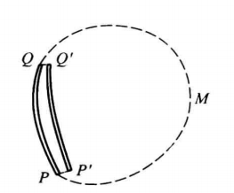

电偶极子

- 记矢量$\vec l$：从$-q$指向$q$，长度为两个点电荷的距离
- 电矩$$\vec p\equiv q\boldsymbol{\vec l}$$
- 力偶矩$$\vec M=q\boldsymbol{\vec l}\times\boldsymbol{\vec E}=\vec p \times \vec E$$
  - 力偶矩$\vec M$力图使偶极子的偶极矩$\vec p$转到与外场$\vec E$一致的方向

- 偶极子在$\vec p$的延长线上的电场强度$$\vec E\approx\frac{2\vec p}{4\pi\varepsilon_0r^3}$$

- 偶极子在$\vec p$的中垂面上的电场强度$$\vec E\approx\displaystyle \frac{\vec p}{4\pi\varepsilon_{0}r^{3}}$$

电介质
- 极化强度$\vec P$与该点电场强度$\vec E$有如下关系：$$\vec P=\varepsilon_{0\chi}\vec E$$
  - 电介质的极化率记为$\chi>0$
- 电介质均匀时，极化电荷体密度$\rho'=0$
- 面密度为$$\sigma^{\prime}\equiv\frac{\Delta q^{\prime}}{\Delta S}=P_{_{2n}}-P_{_{1n}}=(\vec P_{2}-\vec P{_1})\cdot \vec e{_n},$$其中，$\vec e_n$

电容器

- 平行板电容器
  - 两极板间的相互作用力为$$F=\frac{EQ}{2}$$

恒定电流
- $I=qnvS$
- $$J\equiv\frac{\mathrm{d}I}{\mathrm{d}S_{\perp}}.$$
- J的方向：正电荷方向，即电流方向；
- $$I=\iint_{s}\mathbf{\vec J}\cdot\mathrm{d}\mathbf{\vec S}.$$
毕奥-萨伐尔定律$$\mathrm{d}\boldsymbol{\vec B}=\frac{\mu_{0}}{4\pi}\frac{I\mathrm{d}\boldsymbol{\vec l}\times\boldsymbol{\vec e}_{t}}{d^{2}}.$$
  - 有限长载流直导线在$P$点的磁场大小$\vec B$$$B=\frac{\mu_{0}I}{4\pi r}(\cos\theta_{1}-\cos\theta_{2})$$其中$\theta_1，\theta_2$是导线两端和场点$P$的夹角
  - 无限长载流直导线在$P$点的磁场大小$$B=\frac{\mu_{0}I}{2\pi r}$$
  - 均匀分布的直导线内部的磁场大小为$$B=\frac{\mu_r\mu_{0}Ir}{2\pi R^2}$$
  - 圆形载流导线圆心处磁场$$B=\frac{\mu_{0}I}{2R}.$$

磁场的高斯定理
- 与静电场不同，磁场对任意闭合曲面的通量都为零$$\oiint_{s}\boldsymbol{\vec B}\cdot\mathrm{d\vec S}=0$$

安培环路定理

- 恒定磁场$B$对任意闭曲线$L$的环流满足$$\oint_{\iota}\boldsymbol{\vec B}\cdot\mathrm{d}\boldsymbol{\vec l}=\mu_{_0}nI.$$

磁场对载流导体的作用

- 柱内所有载流子所受洛伦兹力的合力为$$\mathrm{d}\boldsymbol{\vec F}=I\mathrm{d}\boldsymbol{\vec l}\times\boldsymbol{\vec B}$$
- 载流线圈的磁矩
  - 力矩试图让线圈与B垂直
  - 磁矩$$\vec p_{{\mathfrak{m}}}=IS\vec e_{{\mathfrak{n}}},$$
  - 力矩$$\vec M=\vec P_{\mathfrak{m}}\times \vec B$$

恒定电流的磁场
- 载流螺绕环的磁场$$B=\mu_{0}nl.$$

法拉第定律

- $$E=-{\frac{\mathrm{d}\Phi}{\mathrm{d}t}}$$
- $$\oint_{L}\vec E_{\mathrm{感}}\cdot\mathrm{d}\vec l=-\frac{\mathrm{d}\Phi}{\mathrm{d}t},$$
动生电动势与洛伦兹力

- 磁场对运动带电粒子的洛伦兹力$\vec F=q\vec v \times \vec B$
- 计算方式一：洛伦兹力公式推出的公式
$$E_{\phi}=\int(\mathbf{\vec v}\times\mathbf{\vec B})\cdot\mathrm{d}\boldsymbol{\vec l}$$

- 计算方式二：法拉第定律
  - 闭合电路整体或局部在恒定磁场中运动；根据运动情况求出闭合电路的磁通$Φ$与$t$的关系，求微商$dΦ／dt$便得动生电动势$E$．
  - 一段不闭合导线$PQ$在恒定磁场中运动；不闭合导线不存在磁通概念，但可假想一条不动的曲线与$PQ$组成闭合曲线，其动生电动势可由法拉第定律求得.由于虚线$PMQ$不动及磁场不变，$PMQ$段没有动生电动势，故$E$也就是导线$PQ$的动生电动势
    - 