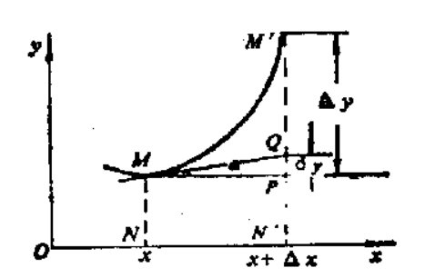
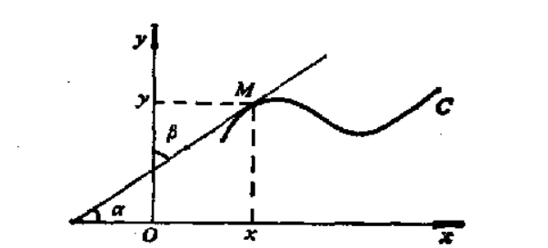

# 微积分的概念

## 函数与极限
### 数列极限与函数极限
数$a$是数列$x_n$的极限，当且仅当$x$的数值$x_n$从某项开始都与$a$相差任意小
- 若对于每一正数$\varepsilon$，不论它怎样小，恒有序号$N$，使在$n> N$时，一切$x_n$的值满足不等式$$|x_n-a|<\varepsilon,$$
称数列$x_n$的极限是$a$或数列的收敛于$a$，记为$$\lim x_{n}=a$$简写为$$x_{n}\rightarrow a$$
- 显然，当$\varepsilon$减小时，$N$需要增大，使$x_n$越接近极限$a$
- 若$\displaystyle\lim_{n\rightarrow\infty}a_{n}=A\text{,}\lim_{n\rightarrow\infty}b_{n}=B$$$\lim_{n\to\infty}(a_{n}\pm b_{n})=A\pm B$$$$\lim_{n+\infty}\left(a_{n}\cdotp b_{n}\right)=AB$$$$\lim_{n\to\infty}\frac{a_n}{b_n}=\frac AB\quad(B\neq0)$$
- 若$k$为常数$$\lim_{k\to\infty}k•q_n=kA$$
- 若$\displaystyle\lim_{x\to\infty}c_{n}=C,\text{且}a_{n}\leqslant b_{n}\leqslant c_{n}$，则$$A\leqslant B\leqslant C$$

函数$y=f(x)$当x趋向于a时的极限，记作$$\lim_{x\rightarrow a}f(x)=A$$
- 若$\lim_{x\to a}f(x)\text{ 和 lim}_{x\to a}g(x)$都存在且有限，则
$$\displaystyle\begin{aligned}
&\operatorname*{lim}_{x\to a}\left(f(x)\pm g(x)\right)=\operatorname*{lim}_{z\to a}f(x)\pm\operatorname*{lim}_{z\to a}g(x) \\
&\operatorname*{lim}_{x\to a}\left(f(x)\cdot g(x)\right)=\operatorname*{lim}_{\omega\to a}f(x)\cdot\operatorname*{lim}_{x\to a}g(x) \\
&\operatorname*{lim}_{x\to a}\frac{f(x)}{g(x)}=\operatorname*{lim}_{x\to a}f(x)\left/\operatorname*{lim}_{x\to a}g(x),(\text{假定}\lim_{x\to a}g(x)\neq0)\right. 
\end{aligned}$$
- 在点$a$附近，若$f(x)\leqslant h(x)\leqslant g(x)$且$\displaystyle\lim_{x\rightarrow a}f(x)=\lim_{x\rightarrow a}g(x)=A$则$$\displaystyle\lim_{x\rightarrow a}h(x)=A$$

### 连续函数
函数：变量之间的依赖关系
- 函数$f(t)$在$t=t_0$处连续当且仅当$\displaystyle\lim_{t\rightarrow t_{\bullet}}f(t)=f(t_{0})$成立，否则称为间断
- 函数$f(t)$是$[a,b]$或$(a,b)$上的连续函数当且仅当$x=f(t)$在闭区间$a\leqslant t\leqslant b$或开区间$a<t<b$上每点都连续

在闭区间上的连续函数一定有最大值和最小值
- 该性质在开区间不成立
- 一切初等函数在其定义区间中是连续函数

## 定积分

若$f(x)$是定义在区间$[a,b]$上的连续函数，以$T$表示用点$\alpha=x_{0}<x_{1}<x_{2}<\cdots<x_{n-1}<x_{n}=b$来分区间$[a,b]$的任意一种方法，对于这个分法，作和数$\sigma=\sum_{i=1}^{n}f(\xi_{i})\Delta x_{i}$；其中$\Delta x_{i}= x_{i}- x_{i-1}$，$\xi_{i}$是小区间$[x_{i-1}, x_{i}]$中任一点，和数称为函数$f(x)$在区间$[a,b]$上的积分和
- 当某些分法中的最大区间长度趋于0时，积分和趋于同一极限值，记为定积分$I$$$I=\int_{a}^{b}f(x)dx$$
- 被积表达式$f\left(x\right)\mathrm{d}x$，积分变量$x$，积分上限、积分下限为$a、b$
- 定积分的值仅与取值区间和函数本身有关，与积分变量的符号无关
- 规定$$\begin{aligned}&\int_{b}^{a}f\left(x\right)\mathrm{d}x=-\int_{a}^{b}f\left(x\right)\mathrm{d}x\text{,其中 }a<b\\&\int_{a}^{a}f\left(x\right)\mathrm{d}x=0\end{aligned}$$由规定可知以下性质
  - $$\int_{a}^{b}\left(f(x)\pm g(x)\right)\mathbf{d}x=\int_{a}^{b}f(x)\mathbf{d}x\pm\int_{a}^{b}g\left(x\right)\mathbf{d}x$$
  - $$\int_{a}^{b}cf(x)\mathrm{d}x=c\int_{a}^{b}f(x)\mathrm{d}x$$
  - 不论$a，b，c$三点的相互位置如何，恒有$$\int_{a}^{b}f(x)\mathrm{d}x=\int_{a}^{c}f(x)\mathrm{d}x+\int_{c}^{b}f\left(x\right)\mathrm{d}x$$
  - 若在$[a,b]$上恒有$f(a)\leqslant g(x)$，则$$\int_{a}^{b}f\left(x\right)\mathrm{d}x\leqslant\int_{a}^{b}g\left(x\right)\mathrm{d}x$$
  - 若在$[a,b]$上恒有$m\leqslant f(a)\leqslant M$，则，则$$m(b-a)\leqslant\int_{a}^{b}f(x)\mathrm{d}x\leqslant M(b-a)$$
  - 积分中值定理：对区间$[a,b]$上的任一连续函数$f(a)$，在$[a,b]$上一定有一点$ξ$，使得$$\frac{1}{b-a}\int_{a}^{b}f\left(\varphi\right)\mathrm{d}x=f(\xi)$$可证明$\xi\in(a,b)$

## 微商与微分

对一般曲线切线的定义：取两点$P、P'$，当两点无限接近时，其割线的斜率可近似为曲线在点$P$处的切线斜率$\displaystyle\lim_{\Delta x\to0}\mathrm{tg}\varphi=\lim_{\Delta x\to0}\frac{f(x_{0}+\Delta x)-f(x_{0})}{\Delta x}$
- 因此曲线求切线等价于求值问题$$\lim_{\Delta x\to0}\frac{f\left(x+\Delta x\right)-f\left(x\right)}{\Delta x}$$

微商的定义
- 设$y=f(x)$是定义在区间$[a,b]$上的一个函数，$x_0$是这个区间内的一点，如果极限$\displaystyle\lim_{\Delta x\to0}\frac{f(x_{0}+\Delta x)-f(x_{0})}{\Delta x}$存在，则称$f(x)$在$x_0$处可微
- 极限$\displaystyle\lim_{\Delta x\to0}\frac{f(x_{0}+\Delta x)-f(x_{0})}{\Delta x}$称为函数$f(x)$在$x_0$处的导数或微商，记为$$f^{\prime}\left(x_0\right)\text{或}\frac{\mathrm{d}y}{\mathrm{d}x}\left.\right|_{x=x_0}$$$$\frac{\mathbf{d}y}{\mathbf{d}x}=\lim_{\Delta x\to0}\frac{f(x+\Delta x)-f(x)}{\Delta x}=\lim_{\Delta x\to0}\frac{\Delta y}{\Delta x}$$
- 显然，$f^{\prime}\left(x_{0}\right)$随着$x$的取值变化而变化，因此，如果函数$f(x)$在区间$[a,b]$内每点都可微，则$f'(x)$是一个新的函数，称为$f(x)$的导函数

可导/可微一定连续
- 因此连续和可微是局部性质
- 连续不一定可导，即$\Delta x\to 0,\Delta y\to 0$时，$\lim_{\Delta x\to0}\frac{\Delta y}{\Delta x}$不一定存在
- 可导一定连续，当$\Delta x\to 0,\displaystyle\lim_{\Delta x\to0}\frac{\Delta y}{\Delta x}$存在时，一定有$\Delta y\to 0$，此时一定连续
  - 换而言之，若原函数处处可导，则其导函数必定处处连续

微分定义：设函数$y=f(a)$在点$x$处有微商$f'(a)$，则自变量的改变量$Δx$与微商的乘积$f'(x)\Delta x$叫做函数$y=f(a)$在点$a$的微分，记作$$\mathrm{d}y=f^{\prime}(x)\Delta x$$

- 已知改变量$\Delta y=f(x+\Delta x)-f(x)$和微商定义$\displaystyle \lim_{\Delta x\to0}\frac{\Delta y}{\Delta x}=f^{\prime}(x_{0})$不妨设$\displaystyle \frac{\Delta y}{\Delta x}-f^{\prime}(x_0)=\alpha$
- $$\Delta y=f^{\prime}(x_{0})\Delta x+\alpha\Delta x=dy+\alpha\Delta x$$
- 当差分$\Delta x$增加时，差分$\Delta y$增加的来源有两部分，一个是微商，一个是$\alpha\Delta x$，显然当$\Delta x\to 0$时，$\alpha\to 0$，因此只要$f'(x)\neq 0$，第二部分更快趋于0
- 综上，当$f'(x)\neq 0，\Delta x\to 0$时，可使用微分近似替代差分；

- 
- $$\begin{aligned}
&\boldsymbol{MP}=\Delta\boldsymbol{x} \\
&M^{\prime}P=\Delta y=PQ+QM'=dy+\alpha\Delta x \\
&{\boldsymbol{P}}Q=f^{\prime}\left(x\right)\Delta x=\mathrm{d}y
\end{aligned}$$
- 其中，PQ代表切线的纵坐标的该变量

## 微积分基本定理&不定积分

微积分基本定理的微分形式
- 函数$f(t)$在区间$[a,b]$上连续，$x$是$[a,b]$中某一固定点，令$$\Phi(x)=\int_{a}^{x}f\left(t\right)\mathrm{d}t\quad(a\leqslant a\leqslant b)$$
- 则$\Phi(x)$在$[a,b]$上可微$$\Phi^{\prime}(x)=f(x)\quad(a\leqslant x\leqslant\dot{b})$$$$\mathrm{d}\Phi(x)=f(x)\mathrm{d}x$$

微积分基本定理的积分形式

- 设$\Phi(x)$在$[a,b]$上可微，且$\displaystyle
\frac{\mathbf{d}\Phi(x)}{\mathbf{d}x}=f(x)$则$$\int_{a}^{x}f\left(t\right)\mathrm{d}t=\Phi\left(x\right)-\Phi\left(a\right)\quad\left(a\leq x\leq b\right)$$

不定积分：若函数$f(x)$在区间$[a,b]$上连续，又若可以找到$H(x)$在$[a,b]$上满足$\displaystyle\frac{\mathbf{d}H}{\mathbf{d}x}=f(x)$则$$\int_{a}^{b}f^{\prime}(t)\mathrm{d}t=H(b)-H(a)$$
- 其中，$H(x)$称为$f(x)$的原函数，且$f(x)$的任意两个原函数之间只可能相差一个常数
- 原函数的全体叫做$f(x)$的不定积分，记作$$\int f(t)\mathbf{d}t$$

积分中值定理的逆运算：微分中值定理
- 若$f(x)$在$[a,b]$上连续，在$(a,b)$可微，则在$(a,b)$中定有一点$ξ$，使得$$f(b)-f(a)=f^{\prime}(\xi)(b-a)$$即$$\frac{f(b)-f(a)}{b-}=f^{\prime}(\xi)$$

# 微积分的运算

## 微分

若$u(x),v(x)$都是可微函数$$\begin{aligned}&\left[u\left(x\right)+v\left(x\right)\right]^{\prime}=u^{\prime}\left(x\right)+v^{\prime}\left(x\right)\\&\left[u\left(x\right)-v\left(x\right)\right]^{\prime}=u^{\prime}\left(x\right)-v^{\prime}\left(x\right)\\&\left[{u}\left(x\right)v\left(x\right)\right]^{\prime}=u^{\prime}\left(x\right)v\left(x\right)+u\left(x\right)v^{\prime}\left(x\right)\\&\left[\frac{u\left(x\right)}{v\left(x\right)}\right]^{\prime}=\frac{u^{\prime}\left(x\right)v\left(x\right)-v^{\prime}\left(x\right)u\left(x\right)}{\left[v\left(x\right)\right]^{2}}\end{aligned}$$

复合函数$y=f[\varphi(x)]$，若$y＝f(u),u＝φ(x)$$$\frac{dy}{dx}=f^{\prime}(u)\varphi^{\prime}(x)$$

若$x=g(y)$是$y=f(x)$的反函数，且$f'(x)≠0$，则
$$g^{\prime}(y)=\frac{1}{f^{\prime}(x)}$$
- 几何意义

常用函数微商

$$(c)^{\prime}=0$$

$$(\tan x)^{\prime}=\sec^{2}x$$

$$(\cot x)^{\prime}=-\csc^{2}x$$

$$(\sec{x})^{\prime}=\sec{x}\tan{x}$$

$$(\csc x)^{\prime}=-\csc x\cot a$$

$$(\log_{a}x)^{\prime}=\frac{1}{x\ln a}$$

$$(a^{x})^{\prime}=a^{x}\ln a$$

$$(arcsin x)^{\prime}=\frac{1}{\sqrt{1-x^{3}}}$$

$$(arccos x)^{\prime}=\frac{-1}{\sqrt{1-x^{2}}}$$

$$(arctan x)^{\prime}=\frac{1}{1+x^{2}}$$

$$(arccot x)^{\prime}=\frac{-1}{1+x^{2}}$$

利用微分作近似计算

已知$\Delta y$可使用微分$dy$近似，即$$f(x_{0}+\Delta x)-f(x_{0})\approx f^{\prime}(x_{\psi})\Delta x$$即$$f(x_0+\Delta x)\approx f\left(x_0\right)+f^{\prime}(x_0)\Delta x$$

## 定积分

积分公式表

$$\int{0}\mathrm{d}x=C(\text{常数})$$

$$\int1\mathrm{~d}x=x+\mathcal{C}$$

$$\int x^{n}\mathrm{d}x=\frac{x^{n+1}}{n+1}+C(n\neq-1)$$

$$\int\frac{1}{x}\mathrm{d}x=\ln|x|+C$$

$$\int\cos x\mathrm{~d}x=\sin x+C$$

$$\int\sin x\mathrm{d}x=-\cos x+C$$

$$\int\mathrm{e}^x\mathrm{d}x=\mathrm{e}^x+C$$

$$\int a^x\mathrm{d}x=\frac{a^x}{\ln a}+C(a>0,a\neq1)$$

未熟练部分

$$\int\sec^2x\operatorname{d\boldsymbol{x}}=\tan x+C$$

$$\int\mathrm{csc}^{2}x\mathrm{d}x=-\mathrm{cot}x+C$$

$$\int\frac1{1+x^2}\mathrm{d}x=\text{arc tan}x+C$$

$$\int{{\frac1{\sqrt{1-x^2}}}}=\text{arc}\sin x+C$$

换元法：若${x}=\varphi\left(t\right)$可微且$\varphi^{\prime}(t)$连续，则$$\int f\left(x\right)\mathrm{d}x=\int f[\varphi(t)]\varphi^{\prime}\left(t\right)\mathrm{d}t$$

分部积分法：

- 已知$\mathrm{d}(uv)=u\mathrm{d}v+v\mathrm{d}u$，对该公式积分得$$\int u\mathrm{d}v=uv-\int v\mathrm{d}u$$
- 即$$\int uv^{\prime}\mathrm{d}x=uv-\int vu' dx$$
- 适用于：$uv'$的积分不易计算，但$u'v$易计算

# 微积分应用
## 曲线描绘

若在区间$(a,b)$内$f'(a)>0$(或$f'(a)<0)$，则函数在区间$(a,b)$内递增(或递减)
       
曲线$\widehat{\boldsymbol{AB}}$是凸曲线：曲线上每点的切线都在曲线段的上方；反之为凹
- 如果在某一区间内$f''(x)>0$，则曲线$y=f(x)$在该区间内是凹曲线
- 如果在某一区间内$f''(x)<0$，则曲线$y=f(x)$在该区间内是凸曲线

渐近线：当曲线上的一点沿着曲线离原点无限远移时，该点与某一直线的距离趋向于0，该固定直线称为曲线的渐近线
- 直线$y＝ax＋b$是函数$f(x)$的渐近线的充分必要条件为$$\lim_{x\to\infty}(f(x)-ax-b)=0\quad$$
- 计算$a$$$\lim_{x\to\infty}\frac{f(x)}x=a$$
- 再计算$b$$$\lim_{x\to\infty}(f(x)-ax)=b$$

曲率：曲线两端点处切线的夹角为$\Delta \rho$，曲线的长度$\Delta s$，$\displaystyle \frac{\Delta\rho}{\Delta s}$
刻划曲线的平均弯曲的程度，称为该曲线的平均曲率。
- 曲线在某点的曲率定义：$$k=\lim_{\Delta s\to0}\frac{\Delta\varphi}{\Delta s}$$

## 泰勒展开与极值问题

已给函数$y=f(x)$在$x=x_0$处具有$n$阶微商，找到一个$n$次多项式$P_n(x)$，使得$P_n(x)$在$x=x_0$处与$f(x)$有相同的值，且它们的一阶、二阶、...、n阶微商都相同，即要求$$P_{n}(x_{0})=f\left(x_{0}\right),P_{n}^{\prime}(x_{0})=f^{\prime}(x_{0}),P_n^{\prime\prime}\left(x_0\right)=f^{\prime\prime}\left(x_{0}\right),\cdots,P_n^{\left(n\right)}\left(x_{0}\right)=f^{\left(n\right)}(x_{0})$$
- 为满足上述等式构造如下多项式$$\begin{aligned}P_{n}(x)&=f(x_{0})+f^{\prime}\left(x_{0}\right)\left(x-x_{0}\right)+\frac{f^{''}\left(x_{0}\right)}{2!}\left(x-x_{0}\right)^{2}\\\\&+\cdots+\frac{f^{(n)}\left(x_{0}\right)}{n!}\left(x-x_{0}\right)^{n}\end{aligned}$$
- 若$f(x)$有$n＋1$阶微商，则$f(x)$在$x=x_0$处的泰勒展开式$$\begin{aligned}f(x)&=f(x_{0})+f^{\prime}\left(x_{0}\right)\left(x-x_{0}\right)+\frac{f^{\prime}}{2!}\frac{x_{0})}{2!}\left(x-x_{0}\right)^{2}\\\\&+\cdots+\frac{f^{(n)}(x_{0})}{n!}\left(x-x_{0}\right)^{n}+\frac{f^{(n+1)}\left(\xi\right)}{\left(n+1\right)!}\left(x-x_{0}\right)^{n+k}\end{aligned}$$其中$$\xi=x_{0}+\theta\left(x-x_{0}\right)$$
- $f(x)$与$P_{n}(x)$之差$$\frac{f^{(n+1)}(\xi)}{(n+1)!}\left(x-x_{0}\right)^{n+1}$$称为泰勒展开式的余项

 