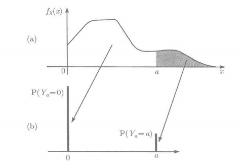
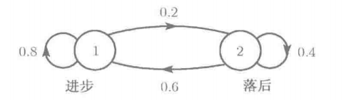
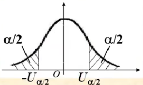
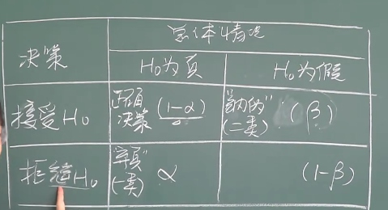

# 概率、统计、计算机科学

相同事务在统计、计算机领域中的不同术语

| 统计                  | 计算机科学               | 含义                       |
|-----------------------|------------------------|----------------------------|
| 估计                  | 学习                    | 使用数据估计未知量 
| 分类 | 有指导学习             | 由X预测离散的Y 
| 聚类     | 无指导学习   | 将数据分组 
|数据       | 训练样本    | (X1,Y1),···,(Xn,Yn)
| 协变量     | 特征 |X 
|分类器   | 假设| 协变量到结果的映射 
| 假设        | -    | 参数子集 
|置信区间      | -   | 以给定频率包括空间Θ的未知量的一个区间
|有向非循环图 |贝叶斯网络 | 给定条件独立性下的多元分布
|贝叶斯推断 | 贝叶斯推断 | 利用数据修正信度的统计方法
|频率推断 |-| 保证频率行为的统计方法
|大偏差界| PAC学习 | 误差概率上的一致有界  |

# 概率
概率是描述不确定性的数学语言；本章介绍概率论的基本概念
## 概率基础

### 样本空间和事件
| 术语                     | 含义                     |
|--------------------------|-------------------------|
|样本空间$Ω$|某试验所有可能结果的集合
|样本点、实现、元素|样本空间$Ω$中的点$ω$
|事件$A$|$Ω$的子集
| $A^c$                      | 集合A的余集（非A）
|$A\cup B$    | 属于A或属于B的$ω$的集合                
| $A\cap B$或$AB$                  | 属于A且属于B的$ω$的集合                
| $A-B$                     | 属于A但不属于B的$ω$的集合
| $A\subset B$                    | 集合包含                  
| $ø$                       | 不可能事件、零事件       
| $Ω$                       | 必然事件

- 集合序列$A_{1},A_{2},\cdots$互斥（两两不相交）：$$A_{i}\bigcap A_{j}=ø,i\neq j$$
- 互斥的集合序列$A_{1},A_{2},\cdots$是$Ω$的一个划分：$$\bigcup_{i=1}^{\infty}A_{i}=\Omega$$
- 事件A的示性函数$$\left.I_A(\omega)=I(\omega\in A)=\left\{\begin{array}{ll}1,&\omega\text{属于}A,\\0,&\omega\text{不属于}A.\end{array}\right.\right.$$
- 集合序列$A_{1},A_{2},\cdots$是单调递增序列：$$A_1\subset A_2\subset\cdots,$$
  - 单调递增序列的极限定义：$$\lim_{n\rightarrow\infty}A_{n}=\bigcup_{i=1}^{\infty}A_{i},$$
- 集合序列$A_{1},A_{2},\cdots$是单调递减序列：$$A_1\supset A_2\supset \cdots,$$
  - 单调递增序列的极限定义：$$\lim_{n\rightarrow\infty}A_{n}=\bigcap_{i=1}^{\infty}A_{i},$$

### 概率

通过函数$P$对每一事件$A$赋予实值$P(A)$以表示$A$的概率，函数$P$称为概率分布或概率测度，$P$必须满足$3$条公理：
- 非负：对$\forall A$，$$P(A)>0$$
- 可加：若$A_{1},A_{2},\cdots$互斥，$$\mathbb{P}\left(\bigcup_{i=1}^{\infty}A_{i}\right)=\sum_{i=1}^{\infty}\mathbb{P}(A_{i}).$$
- 归一化：$$P(\Omega)=1$$

概率$P$的解释
- 无论概率$P$如何解释，都必须满足$3$条公理，概率$P$可解释为频度或可信度
- 频率：$P(A)$表示重复实验中，事件$A$出现次数的最终比例
- 可信度：$P(A)$度量观察者对于$A$为真的信度
  
概率$P$性质
- $$A \subset B\Leftrightarrow \mathrm{P}(A) \leqslant \mathrm{P}(B)$$
- $$\mathrm{P}(A \cup B)=\mathrm{P}(A)+\mathrm{P}(B)-\mathrm{P}(A \cap B)=\mathrm{P}(A)+\mathrm{P}\left(A^{c} \cap B\right)$$
- $$P(\overline AB)=P(B-A)=P(B)-P(AB)$$

  - $$(A\cap B)\cup C=(A\cup C)\cap(B\cup C)$$
  - $$(A\cup B)\cap C=(A\cap C)\cup(B\cap C)$$

概率的连续性
- 若$A_{n}\rightarrow A$$$\lim_{n\to \infin}\mathbb{P}(A_n)=\mathbb{P}(A)$$

### 均匀概率分布

称概率$P$服从均匀概率分布，当概率$P$满足对每一事件$A$$$\mathbb{P}(A)=\frac{|A|}{|\Omega|}$$

### 计数理论

计数准则：第$i$阶段有$n_i$个结果，则一共有$n_1n_2...n_k$个结果
- $n$取$k$排列：$n(n-1)...(n-k+1)=\displaystyle{n!\over (n-k)!}$
- $n$取$n$排列$$n!=n(n-1)(n-2)\cdot\cdots\cdot3\cdot2\cdot1$$

$n$选$k$组合：$$C_n^k=\begin{pmatrix}n\\k\end{pmatrix}=\frac{n!}{k!(n-k)!}$$

- 组合数性质：$$\begin{pmatrix}n\\0\end{pmatrix}=\begin{pmatrix}n\\n\end{pmatrix}=1,\quad\begin{pmatrix}n\\k\end{pmatrix}=\begin{pmatrix}n\\n-k\end{pmatrix}.$$

分割：设$n_1+...+n_k=n$，将$n$个元素的集合划分为$k$个子集，每个子集的元素$n_i$个，划分方式共$$\begin{pmatrix}n\\n_1\end{pmatrix}\begin{pmatrix}n-n_1\\n_2\end{pmatrix}\begin{pmatrix}n-n_1-n_2\\n_3\end{pmatrix}\cdots\begin{pmatrix}n-n_1-\cdots-n_{r-1}\\n_r\end{pmatrix}$$
  - 化简得$\displaystyle \frac{n!}{n_1!n_2!\cdots n_r!}$
## 独立

$A、B\text{独立}\Leftrightarrow\mathbb{P}(AB)=\mathbb{P}(A)\mathbb{P}(B)$

集合$\{A_{i}:i\in I\}$中的事件独立，当且仅当对$I$的任意子集$J$，等式$\mathbb{P}\left(\bigcap_{i\in J}A_i\right)=\prod_{i\in J}\mathbb{P}(A_i)$成立

独立在什么时候出现？
- 直接断言事件独立，例如连续抛掷均匀的硬币时，就可以假设两次试验独立
- 事件的独立性不能直接从事件的性质判断，需要从公式出发证明

韦恩图与独立
- 正概率的互斥事件一定不独立
  - 因此相容是独立的必要条件
- 除互斥事件外，无法从韦恩图判断集合的独立性

独立的性质
- 若$A$与$B$相互独立，则$A$与$B^c$、$A^c$与$B^c$、$A^c$与$B$都相互独立

## 条件概率

假设$P(B)>0$，定义在$B$发生情况下$A$的条件概率如下：$$\mathbb{P}(A|B)=\frac{\mathbb{P}(AB)}{\mathbb{P}(B)}$$

$A、B\text{独立}\Leftrightarrow\mathbb{P}(AB)=\mathbb{P}(A)\mathbb{P}(B)=\mathbb{P}(A|B)\mathbb{P}(B)=\mathbb{P}(A)\mathbb{P}(B|A)\Leftrightarrow\mathbb P(A|B)=\mathbb P(A)\Leftrightarrow\mathbb P(B|A)=\mathbb P(B)$
- 若$A、B$独立，是否知道$B$的信息不会改变$A$的概率

$|$左侧满足概率公理、独立
- 例如事件$A|C、B|C$条件独立$\Leftrightarrow\mathrm{P}(A \cap B \mid C)=\mathrm{P}(A \mid C) \mathrm{P}(B \mid C)$
  - 注意事件$A|C、B|C$条件独立和事件$A、B$是否独立没有联系
  - 事件$A|C、B|C$条件独立$\Leftrightarrow P(A|B\cap C)=P(A|C)$

## 贝叶斯理论

全概率法则：令$A_1,A_2,\cdots,A_k$是$Ω$的一个划分，则对任意事件$B$$$\mathbb{P}(B)=\sum_{i=1}^k\mathbb{P}(B|A_i)\mathbb{P}(A_i).$$

贝叶斯定理：令$A_1,A_2,\cdots,A_k$是$Ω$的一个划分，对每一个$i$有$P(A_i)>0$，如果$P(B)>0$，则对$i＝1,...,k$有
$$\mathbb{P}(A_i|B)=\frac{\mathbb{P}(B|A_i)\mathbb{P}(A_i)}{\sum_j\mathbf{P}(B|A_j)\mathbf{P}(A_j)}$$
- $P(A_i)$为$A$的先验概率，$P(A_i|B)$为A的后验概率.

# 随机变量

随机变量：从样本空间$\Omega$映射到实数域$R$的函数$X$$$X:\Omega\to\mathbb{R}$$
- 随机变量独立于试验，当试验$W$服从随机变量$X$时，每一个样本点$w$可映射到一个实数$X(w)$
- 随机变量记为大写字母，其特定的一个取值记为对应的小写字母

## 离散型随机变量
离散型随机变量：随机变量的定义域是有限集/可数无限集
- 分布列$p_X= P(\{X = x\})=P(X=x)$
  - $\displaystyle \operatorname{P}(X\in S)=\sum_{x\in S}p_X(x).$

### 离散均匀分布

$$\left.p_X(x)=\left\{\begin{array}{ll}1/n,&x=1,\cdots,n,\\0,&\text{其他}.\end{array}\right.\right.$$
### 伯努利分布

有且仅有两个试验结果的试验服从伯努利随机变量，记为$X\sim\mathrm{B}(1,p)$
- 分布列$$\left.\mathtt{}p_X(x)=\left\{\begin{array}{ll}p,&\quad\text{若 }X=1,\\1-p,&\quad\text{若 }X=0.\end{array}\right.\right.$$
- 称事件$X=1$为到达

数字特征
- 期望$$\operatorname{E}[X]=1\cdot p+0\cdot(1-p)=p$$
- 方差$$\operatorname{var}(X)=\operatorname{E}[X^2]-(\operatorname{E}[X])^2=p-p^2=p(1-p).$$
  - 二阶中心矩$$\operatorname{E}[X^2]=1^2\cdot p+0^2\cdot(1-p)=p$$
### 二项分布

$n$次伯努利试验有$x$次到达的试验服从二项随机变量，记为$X\sim\mathrm{B}(n,p)$
- $p_{X}(x)=\mathrm{P}(X=x)=\left(\begin{array}{l}n \\x\end{array}\right) p^{x}(1-p)^{n-x},  x=0,1, \cdots, n$

数字特征
- 记$n$次独立的伯努利试验为$X_1,...,X_n$$$X=X_1+...+X_n$$
- 由<A HREF='#随机变量的数字特征'>期望公式</A>可得$$E(X)=E(X_1)+...+E(X_n)=np$$
- 因伯努利试验相互独立，由<A HREF='#随机变量的数字特征'>方差公式</A>可得$$Var(X)=Var(X_1)+...Var(X_n)=np(p-1)$$

### 泊松分布

若服从二项随机变量的试验，其$n$很大，$p$很小，则该试验同样服从泊松随机变量，记为$X\sim\mathrm{P}(\lambda)$
- $\lambda$是泊松强度，表示在长度为1的连续时间段内，伯努利事件到达的次数；
- 令$X\sim\mathrm{B}(n,p)$的$n$增大，$p$减小，保持$np$不变，即可近似为泊松随机变量$X\sim\mathrm{P}(\lambda)$，其中$\lambda=np$
- $\displaystyle p_{X}(x)=\mathrm{e}^{-\lambda} \frac{\lambda^{x}}{x !}, \quad x=0,1,2, \cdots,$

泊松分布的数字特征
- $E(X)=\lambda$
- $var(X)=\lambda$

强度为$λ$的泊松过程，在时间长度为$\tau$的区间内到达的总次数分布服从$X\sim\mathrm{P}(\lambda,\tau))$
- 分布列：$$p_{X}(x)=\mathrm{e}^{-\lambda\tau}\frac{(\lambda\tau)^{x}}{x!},\quad x=0,1,\cdots$$
- $\mathrm{E}[X]=\lambda\tau$
- $\mathrm{var}(X)=\lambda\tau$

#### 泊松分布的竞争指数分布

竞争指数：两个灯泡具有独立的寿命$T_a、T_b$，分别服从参数为$λ_a、λ_b$的指数分布，两个灯泡首次烧坏的时间$Z=min\{T_a,T_b\}$的分布是什么？
  - 对任意的$z$：$$\begin{aligned}F_{Z}\left(z\right)& =\mathrm{P}(\min\{T_a,T_b\}\leqslant z)  \\&=1-\mathrm{P}(\min\{T_a,T_b\}>z) \\&=1-\mathrm{P}(T_a>z,T_b>z) \\&=1-\mathrm{P}(T_a>z)\mathrm{P}(T_b>z) \\&=1-\mathrm{e}^{-\lambda_az}e^{-\lambda_bz}\\&=1-\mathrm{e}^{-(\lambda_a+\lambda_b)z}.\end{aligned}$$
  - 该分布函数是强度为$\lambda_a+\lambda_b$的指数分布
- 从泊松分布的合并和分裂可直观的解释该事实
  - 假设$T_a、T_b$分别是强度为$λ_a、λ_b$的泊松过程首次到达的时间
  - 将两个过程合并，那么首次到达的时间是$min\{T_a,T_b\}$，即强度为$λ_a+λ_b$的指数分布

结论：$n$个独立的泊松过程，强度分别为$\lambda_1,\cdots,\lambda_n$，合并后的过程仍然是泊松过程，强度为$\lambda_1+\cdots+\lambda_n.$

### 几何分布

不断进行伯努利试验，直到在第$x$次伯努利试验首次到达停止，该试验总体服从二项随机变量，记为$X\sim\mathrm{G}(p)$
- $p_X(x)=(1-p)^{x-1}p  \;\;\;\;\;\;k=0,1,\cdots$
- 分布函数$$\begin{aligned}F_{X}(x)&=\sum_{k=1}^np(1-p)^{x-1}=p\cdot\frac{1-(1-p)^x}{1-(1-p)}=1-(1-p)^x,\quad x=1,2,\cdots.\end{aligned}$$

数字特征
- $$E(X)=\frac{1}{p}$$
- $$Var(X)=\frac{1-\mathrm{p}}{\mathrm{p}^2}$$

### 阶数为k的帕斯卡分布
不断进行伯努利试验，第$k$次到达的时间$Y_k$服从阶数为$k$的帕斯卡分布

- 第$k$次相邻到达间隔时间$T_k$$$T_{1}=Y_{1},\quad T_{k}=Y_{k}-Y_{k-1},\quad k=2,3,\cdots$$
- 第$k$次到达的时间$$Y_k=T_1+...+T_k$$
  - 期望：$$\operatorname{E}[Y_{k}]=\operatorname{E}[T_{1}]+\cdots+\operatorname{E}[T_{k}]=\frac kp$$
  - 方差：$$\operatorname{var}[Y_k]=\operatorname{var}[T_1]+\cdots+\operatorname{var}[T_k]=\frac{k(1-p)}{p^2}.$$
  - 分布列：$$p_{Y_k}(t)=\binom{t-1}{k-1}p^k(1-p)^{t-k},\quad t=k,k+1,\cdots,$$
## 连续型随机变量

概率密度函数，简记为PDF：$$\displaystyle\mathrm{P}(X\in B)=\int_Bf_X(x)\mathrm{d}x$$

连续型随机变量的数字特征
- 期望$$\displaystyle\operatorname{E}[X]=\int_{-\infty}^\infty xf_X(x)\mathrm{d}x.$$

### 均匀分布

随机变量$X$服从$[a,b]$上的均匀分布，记为$X\thicksim\operatorname{U}(a,b)$
- 概率密度函数$$\left.f(x)=\left\{\begin{array}{ll}\displaystyle\frac{1}{b-a},&x\in[a,b],\\0,&\text{其他},\end{array}\right.\right.$$

数字特征
- 期望$$E(X)=\frac{a+b}{2}$$
- 方差$$var(X)=\frac{(b-a)^2}{12}$$

### 正态分布

试验服从标准正态随机变量记为$Z\sim N(0,1)$
- 概率密度函数$$\phi(z)=\frac{1}{\sqrt{2\pi}}\mathrm{e}^{\displaystyle\frac{-z^2}{2}}$$
- 分布函数$$\Phi(z)$$

标准正态随机变量的性质
- 若$Z\sim N(0,1)$，则$X=\mu+\sigma Z\sim N(0,1)$

试验服从正态随机变量记为$X\sim N(\mu,\sigma^{2})$
- 概率密度函数：$$\displaystyle f_X(x)=\frac{1}{\sqrt{2\pi}\sigma}\mathrm{e}^{\displaystyle\frac{-(x-\mu)^2}{2\sigma^2}}$$

正态随机变量$X$的性质
- 若$X\sim N(\mu,\sigma^{2})$，则$\displaystyle\frac{X-\mu}{\sigma}\sim N(0,1)$$$\frac{X-\mu}{\sigma}=Z$$
- 相互独立的$X_{i}\thicksim N(\mu_{i},\sigma_{i}^{2}),i=1,\cdots,n$$$\sum_{i=1}^{n}X_{i}\sim N\left(\sum_{i}^{n}\mu_{i},\sum_{i}^{n}\sigma_{i}^{2}\right)$$
- 若$X\sim N(\mu,\sigma^{2})$，$Y=aX+b$，则$\operatorname{E}[Y]=a\mu+b,\quad\operatorname{var}(Y)=a^2\sigma^2$，所以$Y\sim N(a\mu+b,a^2\sigma^2)$
  - 正态随机变量线性变换后的随机变量仍服从正态分布
  - 标准正态随机变量可经线性变换得到所有正态随机变量

正态随机变量的数字特征
- 期望$$E(X)=\mu$$
  - 因为概率密度函数关于直线$x=\mu$对称
- 方差$$var(X)=\sigma^2$$
#### 二维正态分布

二维正态分布记为$$\color{red}{(X,Y)}{\sim}N(\mu_1,\mu_2;\sigma_1^2,\sigma_2^2;r)$$
定义：$$f(x,y)=\frac1{2\pi\sigma_1\sigma_2\sqrt{1-r^2}}e^{\displaystyle -\frac1{2(1-r^2)}\left\{\left(\frac{x-\mu_1}{\sigma_1}\right)^2-2r\frac{(x-\mu_1)(y-\mu_2)}{\sigma_1\sigma_2}+\left(\frac{y-\mu_2}{\sigma_2}\right)^2\right\}}$$其中$$\sigma_1,\sigma_2>0,|r|<1$$

$${Cov}(X,Y)=r\sigma_1\sigma_2$$

- $r$代表相关系数，$$\rho_{XY}=r$$
- 当$r=0$时，随机变量$X、Y$一定独立，即对二维正态分布，独立与不相关等价
### 指数分布

若试验到达的概率很小，则记录试验首次到达花费时间的试验服从指数分布，记为$X\thicksim\operatorname{e}(\lambda)$
- $$\left.f_X(x)=\left\{\begin{array}{ll}\lambda\mathrm{e}^{-\lambda x},&\text{若}x\geqslant0,\\0,&\text{其他},\end{array}\right.\right.$$
- 首次到达花费时间等价于两次相邻到达的时间差

- 若试验服从几何随机变量，其该试验高频率进行伯努利试验，则该试验可使用指数随机变量近似$$p=1-\mathrm{e}^{-\lambda\delta}$$其中$\delta$为区间长度
  
数字特征
- 期望$$\displaystyle\operatorname{E}[X]=\frac1\lambda$$
- 方差$$\quad\operatorname{var}(X)=\frac1{\lambda^2}$$

无记忆性
- 由<A HREF='#条件概率密度'>条件概率密度</A>可推到指数分布具有无记忆性：两次相邻到达的时间差服从指数分布，每两次相邻到达的时间差独立；
- 在事件$A=\{T>t\}$已发生的条件下，距离下次事件发生的时间记为$X$，则$$\displaystyle\begin{aligned}P\left(X>x|A\right)& =\mathrm{P}(T>t+x|T>t)  \\&=\frac{\mathrm{P}(T>t+x\text{ 且 }T>t)}{\mathrm{P}(T>t)} \\&=\frac{\mathrm{P}(T>t+x)}{\mathrm{P}(T>t)} \\&=\frac{\mathrm{e}^{-\lambda(t+x)}}{\mathrm{e}^{-\lambda t}} \\&=\mathrm{e}^{-\lambda x},\end{aligned}$$即$$\frac{\mathrm{e}^{-\lambda(t+x)}}{\mathrm{e}^{-\lambda t}}={e^{-\lambda x}}$$

### 伽马分布

若试验到达概率很小，则记录第$k$次到达花费时间的试验服从伽马分布，记为$X\sim \Gamma(\alpha,\beta)$

- 伽马分布等价于阶数为$k$的埃尔朗分布，即服从指数分布的试验相继进行$k$次，则伽马分布$X$等于前$k$个相邻到达时间之和$$X_k=X_1+...+X_k$$
  - 期望：$$\operatorname{E}[X_k]=\operatorname{E}[X_1]+\cdots+\operatorname{E}[X_k]=\frac k\lambda$$
  - 方差：$$\operatorname{var}(X_k)=\operatorname{var}(X_1)+\cdots+\operatorname{var}(X_k)=\frac{k}{\lambda^2}$$
  - 分布函数：$$f_{Y_{k}}(x)=\frac{\lambda^{k}x^{k-1}\mathrm{e}^{-\lambda x}}{(k-1)!},\quad x\geqslant0$$
- $X\sim \Gamma(\alpha,\beta)$，其中$\alpha=k,\beta=\lambda$
- 分布函数$$f_{Y_{k}}(x)=\frac{\beta^{\alpha}x^{\alpha-1}\mathrm{e}^{-\beta x}}{\Gamma(\alpha)},\quad x\geqslant0,$$

伽马函数$$\Gamma(\alpha)=\int\begin{array}{c}+\infty\\0\end{array}x^{\alpha-1}e^{-x}dx\quad(\alpha>0)$$
- 目标：避免繁琐的积分运算
- 将阶数为$k$的埃尔朗分布作代数替换：$k=\alpha，\lambda=\beta，(k-1)!=\Gamma(\alpha)$，可得到等价的伽马分布
- 伽马函数的运算性质
  - $\Gamma(\alpha)=(\alpha-1)\Gamma(\alpha-1)=(\alpha-1)!$
  - $\Gamma(1)=1$
  - $\Gamma(\frac{1}{2})=\sqrt{\pi}$

伽马分布的数学特征
- 期望$$E(X)=\displaystyle \frac{\alpha}{\beta}$$
- 方差：$$var(X)=\frac{\alpha}{\beta^2}$$

### 卡方分布
 
$\chi^2(n)$：设$X_1,...X_n$是服从$N(0,1)$的独立随机同分布变量序列$$\chi^2(n)=\sum_{i=1}^n X_i^2$$

数字特征

- 期望$$E(\chi^2(n))=n$$
- 方差$$var(\chi^2(n))=2n$$

性质
- $n$充分大时，$$\frac{\chi^2(n)-n}{\sqrt{2n}}\sim N(0,1)$$

- 若$X,Y$独立，$X\sim \chi^{2}(n),Y\sim\chi^{2}(m)$$$X+Y\sim \chi^{2}(m+n)$$

### t分布

$t(n)$：若$X,Y$独立$X\sim N(0,1)，Y=\chi^{2}\left(n\right)$$$\frac{X\sqrt n}{\sqrt{Y}}\sim t(n)$$

### F分布

若$$X\sim\chi^{2}(n_{1}),Y\sim\chi^{2}(n_{2})$$则$$\frac{X/n_{1}}{Y/n_{2}}\sim F(n)$$

  

## 分布函数

分布函数(累积分布函数)CDF
- $$\displaystyle F_X(x)=\mathrm{P}(X\leqslant x)=\begin{cases}\sum\limits_{k\leqslant x}p_X(k),&\text{若 }X\text{ 是离散的},\\\\\int\limits_{-\infty}^xf_X(t)\mathrm{d}t,&\text{若 }X\text{ 是连续的}.\end{cases}$$
  - 若$X$服从连续随机变量$$f_X(x)=\frac{\mathrm{d}F_X}{\mathrm{d}x}(x).$$
  - 若$X$服从离散随机变量$$p_X(k)=\mathrm{P}(X\leqslant k)-\mathrm{P}(X\leqslant k-1)=F_X(k)-F_X(k-1),$$

CDF性质
- 非降$$F(x_{1})\leqslant F(x_{2})$$
- 规范$$\lim_{x\to-\infty}F(x)=0$$$$\lim_{x\to\infty}F(x)=1$$
- 右连续$$F(x^{+})=\lim_{\underset{y>x}{y>x}}F(y)$$

## 随机变量的数字特征
随机变量的期望、方差、标准差、$n$阶矩、$n$阶中心矩定义
- 期望$$E[X]=\sum\limits_{x} x p_{X}(x)$$$$\displaystyle\operatorname{E}[X]=\int_{-\infty}^\infty xf_X(x)\mathrm{d}x.$$
- 方差$$var(X)=E[(X-E[X])^2]$$
- 标准差：$$\sigma_{X}=\sqrt{\operatorname{var}(X)}$$
  - 标准差的量纲与随机变量$X$相同
  - 标准差和方差表示概率质量的离散程度
  - $D(X)=0$当且仅当随机变量$X$为$c$的概率为$1$；
- $n$阶矩表示随机变量的函数$X^n$的均值$$E(X^n)$$
- $n$阶中心矩表示随机变量的函数$E(X)-X^n$的均值$$E(E(X)-X^n)$$

随机变量函数的期望
- 离散随机变量的函数期望$$\mathrm{E}[g(X)]=\sum_{x} g(x) p_{X}(x)$$
- 连续随机变量的函数期望$$\displaystyle\operatorname{E}[g(X)]=\int_{-\infty}^\infty g(x)f_X(x)\mathrm{d}x,$$
- $n$阶矩：随机变量$X^n$的均值$$E[X^n]=\sum\limits_x x^np_X(x)$$
- 随机变量的线性函数$Y=aX+b$$$E[Y]=aE[X]+b$$$$var(Y)=a^2var(X)$$

方差计算
- $$\operatorname{var}(X)=\operatorname{E}[X^2]-(\operatorname{E}[X])^2.$$
- $$D(X+\mathfrak{c})=D(X)$$
- $$D(cX)=c^2D(X)$$

## 二元随机变量

二元随机变量：2个随机变量联合确定一个样本点
### 联合分布列

二元随机变量的联合分布列$$p_{X,Y}(x,y)=P(X=x,Y=y)$$
### 联合概率密度

二元随机变量的联合概率密度$$P((X,Y)\in B)= \iint\limits _{(x,y)\in B} f_{(X,Y)}(x,y)dxdy$$
- 其中$B$为$xoy$平面上的区域，即二元对$(x,y)$的集合
  - $$\int_{-\infty}^{\infty}\int_{-\infty}^{\infty}f_{X,Y}(x,y)\mathrm{d}x\mathrm{d}y=1$$
- 对$B=\{(x,y)|a\leq x≤b,c≤y≤d\}$，$$\mathrm{P}(a\leqslant X\leqslant b,c\leqslant Y\leqslant d)=\int_{c}^{d}\int_{a}^{b}f_{X,Y}(x,y)\mathrm{d}x\mathrm{d}y.$$

边缘概率密度函数$$f_X(x)=\int_{-\infty}^\infty f_{X,Y}(x,y)\mathrm{d}y$$$$f_Y(y)=\int_{-\infty}^\infty f_{X,Y}(x,y)\mathrm{d}x$$

- 边缘分布$$\mathrm{P}(X\in A)=\mathrm{P}(X\in A,Y\in(-\infty,\infty))=\int_A\int_{-\infty}^\infty f_{X,Y}(x,y)\mathrm{d}y\mathrm{d}x$$
### 联合分布函数
$$\begin{aligned}F_{X,Y}(x,y)&=\mathrm{P}(X\leqslant x,Y\leqslant y).\end{aligned}$$

### 二元随机变量的函数

数字特征
- 二元随机变量的函数的期望$$\operatorname{E}\left[g(X,Y)\right]=\sum_x\sum_yg(x,y)p_{X,Y}(x,y)$$$$\operatorname{E}[g(X,Y)]=\int_{-\infty}^{\infty}\int_{-\infty}^{\infty}g(x,y)f_{X,Y}(x,y)\mathrm{d}x\mathrm{d}y.$$
  - 特别的，若$g(X,Y)$是线性函数则$$\operatorname{E}[aX+bY+c]=a\operatorname{E}[X]+b\operatorname{E}[Y]+c,$$

#### 卷积

卷积为独立随机变量$X,Y$的和$Z=X+Y$的分布列或概率密度函数$$p_{Z}=\sum_xp_X(x)p_Y(z-x)$$$$f_Z(z)=\int_{-\infty}^\infty f_X(x)f_Y(z-x)\mathrm{d}x.$$
  
独立随机变量$X,Y$的差$Z=X-Y$的分布列或概率密度函数$$p_{Z}=\sum_xp_X(x)p_Y(x-z)$$$$f_Z(z)=\int_{-\infin}^{+\infin}f_X(x)f_{Y}(x-z)dx$$

  
### 条件分布

#### 条件分布列
在事件$A(P(A)>0)$已发生的条件下，随机变量$X$的条件分布列$$p_{X|A}(x)=\mathrm{P}(X=x|A)=\frac{\mathrm{P}\left(\{X=x\}\cap A\right)}{\mathrm{P}(A)}.$$

在$Y=y$已发生的条件下，随机变量$X$相对于随机变量$Y$的条件分布列$$p_{X|Y}(x|y)=\mathrm{P}(X=x|Y=y)=\frac{\mathrm{P}(X=x,Y=y)}{\mathrm{P}(Y=y)}=\frac{p_{X,Y}(x,y)}{p_Y(y)}.$$
- 易得$$p_{X,Y}(x,y)=p_Y(y)p_{X|Y}(x|y),\\\\p_{X,Y}(x,y)=p_X(x)p_{Y|X}(y|x),$$

$|$左侧满足各概率定理、推论
- $$\operatorname{E}[X|A]=\sum_xxp_{X|A}(x).$$带入$g(X)$得$$\operatorname{E}\left[g(X)|A\right]=\sum_xg(x)p_{X|A}(x).$$相对于随机变量的条件期望$$\operatorname{E}[X|Y=y]=\sum_xxp_{X|Y}(x|y).$$

全期望定理：无条件均值可由条件平均再平均得到$$\operatorname{E}[X]=\sum_{i=1}^n\operatorname{P}(A_i)\operatorname{E}[X|A_i].$$
- 等价于$$\operatorname{E}[X]=\sum_yp_Y(y)\operatorname{E}[X|Y=y].$$
- 若$P(A_i\cap B)>0$$$\operatorname{E}[X|B]=\sum_{i=1}^n\operatorname{P}(A_i|B)\operatorname{E}[X|A_i\cap B].$$
- 当随机变量的期望不好直接计算时，可将该随机变量划分为不相交的子集，通过全期望定理间接计算随机变量的期望

#### 条件概率密度

条件概率密度函数$$f_{X|Y}(x|y)=\frac{f_{X,Y}(x,y)}{f_Y(y)}$$
- 若要求$X$在$Y=y$下的条件概率密度函数，先求$f_{X|Y}(x|y)$，再将$Y=y$带入求得的函数即可，避免被除数$f_Y(y)=0$
- 若要求$X$在$Y$的某个区间下的概率密度函数，则使用以下公式
  - 在事件$A$已发生的条件下，连续随机变量$X$的条件概率密度函数$f_{X|A}(x)$的满足$$\mathrm{P}(X\in B|A)=\int_Bf_{X|A}(x)\mathrm{d}x$$
  - 若事件$A$取$\{Y\in A\}$，则 $$\mathrm{P}(X\in B|Y\in A)=\frac{\mathrm{P}(X\in A,X\in B)}{\mathrm{P}(X\in A)}=\frac{\iint_{A\cap B}f_{X,Y}(x,y)dxdy}{\int_Af_Y(y)dy}$$

- 推论
  - $$f_{X,Y}(x,y)=f_Y(y)f_{X|Y}(x|y),$$
  - $$f_{X}(x)=\int_{-\infty}^{\infty}f_{Y}(y)f_{X|Y}(x|y)\mathrm{d}y.$$

条件期望$$E[X|Y=y]=\displaystyle{\int_{\displaystyle-\infty}^{\displaystyle+\infty}xf_{X|Y=y}(x|y)\mathrm{d}x}$$

全概率定理$$f_X(x)=\sum_{i=1}^n\operatorname{P}(A_i)f_{X|A_i}(x)$$

全期望定理$$\operatorname{E}[X]=\int_{-\infty}^\infty\operatorname{E}[X|Y=y]f_Y(y)\mathrm{d}y\\=\int_{\displaystyle-\infty}^{\displaystyle+\infty}\int_{\displaystyle-\infty}^{\displaystyle+\infty}xf_{X|Y}(x|y)f_Y(y)dxdy\\=\int_{\displaystyle-\infty}^{\displaystyle+\infty}\int_{\displaystyle-\infty}^{\displaystyle+\infty}xf_{X,Y}(x,y)dxdy$$

### 独立
随机变量$X$独立于事件$A$$\Leftrightarrow\mathrm{P}(X=\text{ }x\text{且 }A)=\mathrm{P}(X=x)\mathrm{P}(A)=p_X(x)\mathrm{P}(A)$

随机变量$X,Y$相互独立$\Leftrightarrow f_{X,Y}(x,y)=f_{X}(x)f_{Y}(y)\quad\Leftrightarrow f_{X|Y}(x|y)=f_X(x)\Leftrightarrow F_{X,Y}(x,y)=F_X(x)F_Y(y)$

若随机变量$X,Y$相互独立
- $$\mathrm{E}[XY]=\mathrm{E}[X]\mathrm{E}[Y]$$
  - 另一方面：$E[X+Y]=E[X]+E[Y]$不需要任何条件
- $$\mathrm{E}[g(X)h(Y)]=\mathrm{E}[g(X)]\mathrm{E}[h(Y)]$$
- $$var(X+Y)=var(X)+var(Y)$$

条件独立$$\mathrm{P}(X=x,Y=y|A)=\mathrm{P}(X=x|A)\mathrm{P}(Y=y|A)$$

### 协方差

随机变量$X、Y$的协方差$$\begin{matrix}\mathrm{cov}(X,Y)=\mathrm{E}[(X-\mathrm{E}[X])(Y-\mathrm{E}[Y])]\\=\operatorname{E}[XY]-\operatorname{E}[X]\operatorname{E}[Y]\end{matrix}$$
- $cov(X,Y)=0$,随机变量$X、Y$不相关
- $cov(X,Y)>0$,随机变量$X、Y$正相关
- $cov(X,Y)<0$,随机变量$X、Y$负相关

协方差的性质
- $\mathrm{cov}(X,X)=\mathrm{var}(X)$
- $\operatorname{cov}(X,aY+b)=a\cdot\operatorname{cov}(X,Y)$
- $\mathrm{cov}(X,Y+Z)=\mathrm{cov}(X,Y)+\mathrm{cov}(X,Z)$
- $\displaystyle\operatorname{var}\left(\sum_{i=1}^nX_i\right)=\sum_{i=1}^n\operatorname{var}(X_i)+\sum_{\{(i,j)|i\neq j\}}\operatorname{cov}(X_i,X_j)$
  - $var(X+Y)=var(X)+var(Y)+{\color{red}{2}}cov(X,Y)$

独立与相关
- 不相关是独立的必要不充分条件
- 随机变量$X、Y$独立$\Rightarrow\operatorname{E}[XY]=\operatorname{E}[X]\operatorname{E}[Y]\Rightarrow cov(X,Y)=0\Rightarrow$随机变量$X、Y$不相关；
- $cov(X,Y)=0\Rightarrow\operatorname{E}[XY]=\operatorname{E}[X]\operatorname{E}[Y]$不能反推导随机变量$X、Y$独立

若$X、Y$独立
- $$E(XY)=E(X)E(Y)$$
- $$D(X+Y)=D(X)+D(Y)$$
- $$D(aX+bY)=a^2D(X)+b^2D(Y)$$
  - $$D(X-Y)=D(X)+D(Y)$$

### 相关系数

若${var}(X)\neq 0,{var}(Y)\neq 0$，则随机变量$X和Y$的相关系数记为$\rho(X,Y)\in (-1,1)$
- 相关系数是协方差的标准化$$\displaystyle\rho(X,Y)=\frac{\operatorname{cov}(X,Y)}{\sqrt{\operatorname{var}(X)\operatorname{var}(Y)}}$$

## 随机变量的函数

# 极限理论

- 独立同分布的样品组成的样本，可使用随机变量序列$X_1,X_2,...,$表示，$X_i$的均值为$μ$方差为$\sigma^2$
  - 随机变量的前$n$项之和为$$S_n=X_1+\cdots+X_n$$
  - 由$$\displaystyle\operatorname{var}\left(\sum_{i=1}^nX_i\right)=\sum_{i=1}^n\operatorname{var}(X_i)+\sum_{\{(i,j)|i\neq j\}}\operatorname{cov}(X_i,X_j)$$可知$$\operatorname{var}(S_n)=\operatorname{var}(X_1)+\cdots+\operatorname{var}(X_n)=n\sigma^2$$
  - $E(S_n)=n\mu,var(S_n)=n\sigma^2$，当$n\to \infin$时，期望和方差趋于无穷大
- 定义样本（样品的集合）的均值$$M_n=\frac{X_1+\cdots+X_n}n=\frac{S_n}n$$满足$$\displaystyle\operatorname{E}[M_n]=\mu,\quad\operatorname{var}(M_n)=\frac{\sigma^2}{n}$$令样本容量增加，样本均值的方差越来越小，又因为样本均值的均值是$\mu$，因此样本均值的分布越来越向$\mu$接近，因此可得出以下结论
  - 大数定律：随着样本容量的增加，样本的均值收敛于样品$X_i$的均值$\mu$，也称为分布集中于一点
  - 分布发散：分布发散的随机变量的方差很大，没有明显的集中趋势，其离散程度很高
  - 分布收敛：随机变量的取值范围随着样本数量的增加而变得越来越窄，趋向于某个固定的值或分布。分布收敛的随机变量的方差趋向于0
- 中心极限定理
  - 观察$S_n$是关于$n$的分布，通过平移拉伸使$S_n$标准化$$Z_n=\frac{S_n-n\mu}{\sigma\sqrt{n}}$$满足$$\operatorname{E}[Z_n]=0,\quad\operatorname{var}(Z_n)=1$$其均值和方差不依赖于样本容量，其分布不发散、不收敛、不满足大数定律（不集中于一点），但是当n越来越大时，$Z_n$的分布越来越接近正态分布；
  - 中心极限定理研究分布$Z_n$的渐近性质：当$n\to\infin$时，分布$Z_n$无限趋近于标准正态分布

## 不等式

当随机变量$X$的均值和方差易于计算，但分布不易计算时，使用随机变量的均值和方差估计事件的概率上限

### 马尔可夫不等式

马尔可夫不等式：如果一个非负随机变量的均值很小，则该随机变量取大值的概率也非常小
- 若随机变量$X$及常数$a$满足$X\geq0，\forall a>0$$$\operatorname{P}(X\geqslant a)\leqslant\frac{\operatorname{E}[X]}a$$
- 证明
    - 取一个常数$a$,将事件$X$是否大于$a$映射到成功的值为$a$的伯努利分布
    - 定义随机变量$$Y_a=\begin{cases}0,&\text{若 }X<a,\\[2ex]a,&\text{若 }X\geqslant a.\end{cases}$$
    - 
    - 因为随机变量$X$的取值是非负数，因此$X\geq Y_a$即$$E(X)\geq E(Y_a)$$
    - 事件$Y_a$的均值为$a\cdot P(a)$，所以$$a\mathrm{P}(X\geqslant a)\leqslant\mathrm{E}[X]$$

### 切比雪夫不等式

切比雪夫不等式：如果一个随机变量的方差（不要求随机变量为非负数）非常小的话，那么该随机变量取远离均值$μ$的概率也非常小
- 设随机变量$X$的均值为$μ$，方差为$σ^2$，则对任意$c＞0$$$\mathrm{P}(|X-\mu|\geqslant c)\leqslant\frac{\sigma^{2}}{c^{2}}.$$
- 令$c=k\mu$，其中$k$是正数，描述随机变量的取值偏离均值$k$倍标准差的概率最多为$\displaystyle\frac{1}{k^2}$$$\mathrm{P}(|X-\mu|\geqslant k\sigma)\leqslant\frac{\sigma^2}{k^2\sigma^2}=\frac1{k^2}.$$
- 假设方差未知，但是随机变量的取值范围已知$[a,b]$，因为$\sigma^2\leqslant\frac{(b-a)^2}{4}$则$$\mathrm{P}(|x-\mu|\geqslant c)\leqslant\frac{(b-a)^2}{4c^2}\quad$$

切比雪夫不等式推导
- 推导方法一：对非负随机变量$(X-\mu)^2$取常数$a=c^2$有$$\mathrm{P}((X-\mu)^2\geqslant c^2)\leqslant\frac{\mathrm{E}[(X-\mu)^2]}{c^2}=\frac{\sigma^2}{c^2}$$
  - 其中事件$|X-\mu|^2\geqslant c^2$ 等价于事件 $|X-\mu|\geqslant c$所以$$\mathrm{P}(|X-\mu|\geqslant c)=\mathrm{P}(|X-\mu|^2\geqslant c^2)\leqslant\frac{\sigma^2}{c^2}.$$
- 推导方法二：将事件$X$与均值的距离与常数的大小关系映射为随机变量$$g(x)=\begin{cases}0,&\text{若 }|x-\mu|<c,\\c^2,&\text{若 }|x-\mu|\geqslant c.&\end{cases}$$其中$$(x-\mu)^2\geqslant g(x)$$所以$$\sigma^{2}=\int_{-\infty}^{\infty}(x-\mu)^{2}f_{X}(x)\mathrm{d}x\geqslant\int_{-\infty}^{\infty}g(x)f_{X}(x)\mathrm{d}x=c^{2}\mathrm{P}(|x-\mu|\geqslant c),$$
- 证明$\sigma^2\leqslant\frac{(b-a)^2}{4}$
  - 对任意的常数$γ$$$\operatorname{E}[(X-\gamma)^2]=\operatorname{E}[X^2]-2\operatorname{E}[X]\gamma+\gamma^2,$$当$\gamma=\operatorname{E}[X]$时，该二次多项式取极小值，对任意常数$γ$$$\sigma^2=\operatorname{E}[(X-\operatorname{E}[X])^2]\leqslant\operatorname{E}[(X-\gamma)^2].$$（等号是方差的定义，不等号是上述推导的结论）
  - 令$γ=(a+b)/2$$$\sigma^2\leqslant\operatorname{E}\left[\left(X-\frac{a+b}{2}\right)^2\right]=\operatorname{E}[(X-a)(X-b)]+\frac{(b-a)^2}{4}\leqslant\frac{(b-a)^2}{4},$$（等号由直接计算得到，不等号由$x\in[a,b]，(x-a)(x-b)\leqslant0$可得）
## 大数定律
### 弱大数定律和依概率收敛

$S_n=X_1+X_2...+X_n$，$X_i$独立同分布，$E(X_i)=μ,var(σ^2)$为常数
- 样本均值$M_n=\displaystyle\frac{S_n}{n}$，$E(M_n)=\mu$，$\mathrm{var}(M_n)=\displaystyle\frac{\mathrm{var}(X_1)+\cdots+\mathrm{var}(X_n)}{n^2}=\frac{\sigma^2}n$

随机变量序列$Y_1,Y_2,\cdots$依概率收敛于实数$a$，当且仅当对$\forall \epsilon>0$$$\lim_{n\to\infty}\mathrm{P}(|Y_n-a|\geqslant\epsilon)=0$$
- 随着$n$的增大，$Y_n$和$a$之间存在一定差距的可能性将会随着$n$的增大而趋向于零

弱大数定律：$M_n$依概率收敛于$\mu$
- $\forall\epsilon＞0$，当$n\rightarrow 0$时$$\mathrm{P}(|M_n-\mu|\geqslant\epsilon)=\mathrm{P}\left(\left|\frac{X_1+\cdots+X_n}{n}-\mu\right|\geqslant\epsilon\right)\to0$$

### 强大数定律、以概率1收敛
以概率1收敛
- 在$n\to \infin$时，随机变量序列处处为$c$的概率为1：$$\mathrm{P}\left(\lim_{n\to\infty}Y_n=c\right)=1.$$

强大数定律：$M_n$以概率1收敛于$\mu$

## 中心极限定理

$M_n\sim N(\mu,\sigma^2)$，$S_n\sim N(n\mu,n\sigma^2)$
- $S_n$变换为标准正态分布$$Z_n=\frac{S_n-n\mu}{\sqrt{n}\sigma}\sim N(0,1)$$
- $n$的取值不影响$E(Z_n)、var(Z_n)$的值，但是随着$n$的增大，$Z_n$的分布将趋近于标准正态分布

### 二项分布的棣莫弗—拉普拉斯近似

$X\sim B(n,p)\Rightarrow S_n=X_1+\cdots+X_n$，其中$X_i\sim B(1,p)$，则二项分布的棣莫弗—拉普拉斯近似$$\mathrm{P}(k\leqslant S_n\leqslant l)\approx\Phi\left(\frac{l+\frac12-np}{\sqrt{np(1-p)}}\right)-\Phi\left(\frac{k-\frac12-np}{\sqrt{np(1-p)}}\right)$$

# 马尔可夫链

系统的状态取值是有限的，根据过往的状态值序列，预测未来随时间推进的状态值取值概率
  

## 离散时间的马尔可夫链

系统
- 在离散化时刻$n$，系统的状态记为$X_n$
- 状态空间记录系统所有可能的状态，记为$S=\{1,2,...,m\}$

马尔可夫链

- 当状态是$i$时，下一个状态是$j$的概率是$p_{ij}$，称为状态转移概率$$\begin{aligned}p_{ij}&=\mathrm{P}(X_{n+1}=j|X_n=i),\quad i,j\in\mathcal{S}.\end{aligned}$$
- 马尔可夫链的核心假设：$p_{ij}$只依赖于状态$i$，等价于下一个状态$X_{n+1}$的概率分布只依赖于当前状态$X_n$$$\mathrm{P}(X_{n+1}=j|X_{n}=i,X_{n-1}=i_{n-1},\cdots,X_{0}=i_{0})=\mathrm{P}(X_{n+1}=j|X_{n}=i)=p_{ij}$$
- 过去的信息、包括上次状态如何转移到本次状态，都不会提供关于下一次状态概率分布的信息，因此满足概率论的可列可加非负性$$\sum_{j=1}^{m}p_{ij}=1\text{对所有的 }i\text{ 成立}.$$
- 因此当时刻推进时，即使状态不改变，也发生了链上的状态转移

马尔可夫模型的性质由以下特征确定：

- 状态集合$S=\{1,2,...,m\}$
- 可能发生状态转移$(i,j)$的集合，即由所有$p_{ij}＞0$的$(i,j)$组成
- $p_{ij}$的取值（正值）

- 由马尔可夫模型描述的马尔可夫链是一个随机变量序列，记为$X_0,X_1,X_2,...$
  - $X_n\in S$
  - 任意的时刻$n$，所有状态$i,j\in S$，以及所有之前可能的状态序列$i_0,...,i_{n—1}$，均满足$$\begin{aligned}\mathrm{P}(X_{n+1}=j|X_n=i,X_{n-1}=i_{n-1},\ldots,X_0=i_0)=p_{ij}.\end{aligned}$$
- 转移矩阵刻画马尔可夫链$$\left.\left[\begin{array}{cccc}p_{11}&p_{12}&\cdots&p_{1m}\\\\p_{21}&p_{22}&\cdots&p_{2m}\\\vdots&\vdots&\vdots&\vdots\\\\p_{m1}&p_{m2}&\cdots&p_{mm}\end{array}\right.\right].$$
- 转移概率图刻画马尔可夫链
  - 节点表示状态
  - 连接节点的有向弧线表示可能发生的转移，并标注$p_{ij}$的数值

例1

- $$\left.\left[\begin{array}{cc}0.8&0.2\\\\0.6&0.4\end{array}\right.\right].$$
- 

只要马尔可夫模型确定，就可以确定未来任何一个给定状态序列的概率，类似序贯树的乘法法则，特别的：$$\mathrm{P}(X_0=i_0,X_1=i_1,\cdots,X_n=i_n)=\mathrm{P}(X_0=i_0)p_{i_0i_1}p_{i_1i_2}\cdots p_{i_{n-1}i_n}.$$

### n步转移概率

在当前状态的条件下，计算未来某个时刻各状态的概率分布

$$r_{ij}(n)=\mathrm{P}(X_{n}=j|X_{0}=i).$$

- $r_{ij}(n)$：表示在给定当前状态$i$的条件下，$n$个时刻后的状态将是$j$的概率
- 由以下基本迭代公式计算（查普曼—科尔莫戈罗夫方程、C-K方程）

- C-K方程：$$r_{ij}(n)=\sum_{k=1}^{m}r_{ik}(n-1)p_{kj}\text{对于所有 }n>1,i,j\text{ 成立},$$其中$$r_{ij}(1)=p_{ij}.$$

很多（但不是全部）随时间变化的概率模型都具有这样的性质：在充分长的时间后，初始条件的影响可以被忽略，即令$n\to \infin$，每个$r_{ij}(n)$收敛于一个极限值
- 该极限值不依赖于初始状态$i$
- 当时间不断增大时，每个状态都有一个正的稳态概率
- 另一方面：在$n$很小时，概率$r_{ij}(n)$依赖于初始状态$i$，随着时间的增大，这种依赖性将会逐渐消失

称一个状态为吸收状态：一旦到达了这个状态，将永远处于这个状态

## 状态的分类

马尔可夫链的不同状态在数值上具有不同的性质
- 一些状态被访问一次后，一定还会被继续访问
- 一些状态被访问后将不再被访问
- 本节对马尔可夫链的状态进行分类，重点分析状态被访问的长期频率

状态的可访问性定义：
- 称状态$j$为从状态可达，当且仅当对于某一个$n$，$n$步转移概率$r_{ij}(n)>0$
  - 即：从状态$i$出发，某个时段之后，以一个正概率可以到达状态$j$
- 另一个等价的定义：存在可能的状态序列$i,i_1,...,i_{n—1},j$
  - 开始于状态$i$，结束于状态$j$，并且其中每步转移$(i,i_1),(i_1,i_2),...,(i_{n-1},i_n)$都具有正概率
- 上述定义简称为：从$i$出发可到达$j$
  - 令$A(i)$是所有从状态$i$可达的状态集合，定义状态$i$是常返的，如果对于每个从$i$出发可达的状态$j$，相应地从$j$出发也可达$i$
  - 也就是说，对于所有属于$A(i)$的状态$j$，状态$i$属于$A(j)$

# 统计推断

## 基本概念

- 总体：试验的全部可能的观察值集合
- 个体：一个可能观察值
- 样本：从总体$𝑋$中随机取出的一些个体的集合$(𝑋_1,...,𝑋_𝑛)$ ，称为总体$𝑋$的一个样本容量为$𝑛$的简单随机样本，简称样本
- 样本$(𝑋_1,...,𝑋_𝑛)$ 的一组取值 $(𝑥1, … , 𝑥𝑛)$ 称为一个样本观测值
- 统计量：不含任何未知参数的样本的函数

### 样本的数字特征
- 样本均值$$\overline{X}=\frac{1}{n}\sum_{i=1}^{n}X_{i}$$
- 未修正的样本方差$$S_0^2=\frac1n\sum_{i=1}^n(X_i-\overline{X})^2$$
- 样本方差（修正的样本方差）：$$S^{2}=\frac{1}{n-1}\sum_{i=1}^{n}(X_{i}-\overline{X})^{2}$$
- 样本标准差：$$\mathbf{S}=\sqrt{\mathbf{S}^{2}}$$
- 样本k阶原点矩：$$A_{k}=\frac1n\sum_{i=1}^{n}X_{i}{}^{k}$$
- 样本k阶中心矩：$$B_k=\frac1n\sum_{i=1}^n(X_i-\overline{X})^k$$
- 样本1和样本2的协方差：$$S_{12}=\frac{1}{n}\sum_i^{n}(X_i-\overline{X})(Y_i-\overline{Y})$$
  - $$R=\frac{S_{12}}{S_{22}}$$

### 总体和样本的性质

总体$X$的均值为$\mu$，方差为$\sigma^2$，样本$(𝑋_1,...,𝑋_𝑛)$来自总体$𝑋$；由中心极限定理可得：
- 样本均值：$${E(\overline{X})}=\mu$$
- 样本方差：$$D(\overline{X})=\frac{\sigma^2}{n}$$
- 样本方差的均值$${E(S^2)}=\sigma^2$$

## 正态总体下的抽样分布定理

总体$X\sim N(\mu,\sigma^{2})$，样本$\{X_{1},X_{2},...,X_{n}\}$
- 已知
  - 样本方差（修正的样本方差）：$$S^{2}=\frac{1}{n-1}\sum_{i=1}^{n}(X_{i}-\overline{X})^{2}$$
  - $$\overline{X}\sim N(\mu,\frac{\sigma^{2}}{n})$$
- $$\frac{\overline{X}-\mu}{\displaystyle\frac{\sigma}{\sqrt{n}}}\sim N(0,1)$$
  - $$\frac{\overline{X}-\mu}{s}\sqrt{n}\sim t(n-1)$$
- $$\frac{(n-1)S^{2}}{\sigma^{2}}=\frac{1}{\sigma^{2}}\sum_{i=1}^{n}(X_{i}-\overline{X})^{2}\sim\chi^{2}(n-1)$$
  - $${\frac{1}{\sigma^{2}}}\sum_{i=1}^{n}(X_{i}-\mu)^{2}\sim\chi^{2}(n)$$
- ${\overline{X}}$与$S^{2}$独立

两个正态总体，$X\sim N(\mu_1,\sigma_1^{2})$，样本$\{X_{1},X_{2},...,X_{n}\}$，$Y\sim N(\mu_2,\sigma_2^{2})$，样本$\{Y_{1},Y_{2},...,Y_{n}\}$，样本均值和方差分别记为$\overline{X}、\overline{Y}、S_1^2、S_2^2$
- $$\frac{(\overline{X}-\overline{Y})-(u_{1}-u_{2})}{\sqrt{\frac{\sigma_{1}^{2}}{n_{1}}+\frac{\sigma_{2}^{2}}{n_{2}}}}\sim N(0,1)$$
- $$\frac{S_{1}^{2}/\sigma_{1}^{2}}{S_{2}^{2}/\sigma_{2}^{2}}\sim F(n_{1}-1,n_{2}-1)$$
- $$\frac{(n_1-1)S_{1}^{2}}{\sigma_{1}^{2}}\sim\chi^{2}(n_1-1)$$
- $$\frac{(n_2-1)S_{2}^{2}}{\sigma_{2}^{2}}\sim\chi^{2}(n_2-1)$$

## 参数估计

参数估计：总体$X$的分布形式已知，但分布形式存在未知参数，通过样本估计这些参数或这些参数的某一函数
- 参数估计包括：点估计和区间估计
非参数估计：总体$X$的分布形式未知，需要通过样本估计总体的分布形式

设总体$X$的分布函数为$F(X,\theta)$；若$\theta$未知，则$\theta$的取值范围称为参数空间；从总体$X$中抽取样本$(𝑋_1,...,𝑋_𝑛)$
- 点估计
  - 构造合适的统计量$\theta=T(𝑋_1,...,𝑋_𝑛)$作为参数的估计量
  - 将样本观察值$(x_1,...,x_𝑛)$代入估计量；计算出估计量的观察值$$\hat{\theta}{=}\mathbf{T}(x_1,x_2,...,x_n)$$
- 区间估计
  - 构造$$\widehat{\theta}_1=T_1(X_1,X_2,...,X_n)、\hat{\theta}_{2}=\mathrm{T}_{2}(X_{1},X_{2},\ldots,X_{n})(\theta_{1}<\theta_{2})$$
  - 用区间$(\widehat{\theta}_{1},\widehat{\theta}_{2})$作为$\theta$可能取值范围的估计

### 矩估计法

用样本的各阶矩去估计总体相应的各阶矩，而总体各阶矩都是总体分布中未知参数的函数，从而，通过估计总体矩来达到估计总体分布中未知参数的目的

设总体分布为$\mathbf{F}(\mathbf{x},\mathbf{\theta}_{1},\mathbf{\theta}_{2}......,\mathbf{\theta}_{\mathbf{k}})$，$\theta_i$未知，样本$(𝑋_1,...,𝑋_𝑛)$

- 记$$A_{m}=\frac{1}{n}\sum_{i=1}^{n}X_{i}^{m}$$
- $$\begin{cases}EX=\overline{A}=\overline{X}\\EX^2=\overline{A}\\\vdots\\EX^k=A_k\end{cases}$$

### 极大似然估计法

小概率原理：小概率事件在个别试验中几乎不可能发生
- 如果随机事件的概率很接近$1$，在个别试验中这个事件几乎一定发生
- 最大似然原理：一个随机试验如果有若干个结果$A,B,C,...$如果在一次试验中结果$A$出现，则一般认为试验条件对$A$出现有利，也即$A$出现的概率最大

对离散型总体分布列$P\{X=x\}=p(x;\theta_1,\theta_2,\cdots,\theta_k)$，样本$(𝑋_1,...,𝑋_𝑛)$，$\theta_i$为未知参数；求$(\theta_{1},\theta_{2},\cdots,\theta_{k})$的极大似然估计量的步骤

- 建立似然函数$$L(\theta_{1},\theta_{2},\cdots,\theta_{k})=\prod_{i=1}^{n}p(x_{i};\theta_{1},\theta_{2},\cdots,\theta_{k})$$
  - 样本概率相乘
- 取对数$$\ln L=\sum_{i=1}^{n}\ln P(x_{i},\theta_{1},\theta_{2},\cdots,\theta_{k});$$
- $k$个偏导数$$\left.\left\{\begin{array}{c}\displaystyle\frac{\partial\ln\mathbf{L}}{\partial\theta_1}=\mathbf{0};\\\\\displaystyle\frac{\partial\ln\mathbf{L}}{\partial\theta_2}=\mathbf{0};\\\varvdots\\\displaystyle\frac{\partial\ln\mathbf{L}}{\partial\theta_k}=\mathbf{0};\end{array}\right.\right.$$
- 解方程组求得$(\theta_{1},\theta_{2},\cdots,\theta_{k})$的极大似然估计值

## 点估计的优良性准则

无偏性

- $\hat \theta$是参数$\theta$的无偏估计量：$$\forall θ\in \Omega, E(\hat \theta)=\theta$$
- 设总体$X$有期望$E(X)=μ$与方差$D(X)=\sigma^2$，$μ、σ^2$未知；取样本$(𝑋_1,...,𝑋_𝑛)$
- 样本均值$\overline X$是对$\mu$的无偏估计
- 样本方差$S^2$是$σ^2$的无偏估计
  - $$E(S^{2})=\sigma^{2}$$
- 未修正的样本方差$S_0^2$是$σ^2$的有偏估计
- 样本标准差$S$是标准差$\sigma$的有偏估计
  - $$E(S)=\sqrt{\sigma^{2}-D(S)}\leq\sqrt{\sigma^{2}}=\sigma $$

有效性

- 设$\hat{\theta}_1$和$\hat{\theta}_2$都是参数${\theta}$的无偏估计，如果$$(\boldsymbol{D}\hat{\boldsymbol{\theta}}_1)\leq(\boldsymbol{D}\hat{\boldsymbol{\theta}}_2)\quad\theta\boldsymbol{\epsilon}\boldsymbol{\Theta}$$
称$\hat{\theta}_1$比$\hat{\theta}_2$有效
- 若$\hat{\theta}$在$θ$的一切无偏估计中，方差达到最小，则称$\hat{\theta}$为${\theta}$的最小方差无偏估计

一致性：略

## 置信区间

区间估计：在保证可靠度的条件下，尽量提高精度
- 可靠度：$P(\hat{\theta}_{1}\leq\theta\leq\hat{\theta}_{2})$尽可能大
- 精度：区间的长度尽可能小

置信区间
- 对于总体$X$的未知参数$θ$，用来自总体$X$的样本
$(𝑋_1,...,𝑋_𝑛)$构造两个统计量$\hat{\theta}_1=\hat{\theta}_1(X_1,X_2,\cdots,X_n)$与$\hat{\theta}_2=\hat{\theta}_2(X_1,X_2,\cdots,X_n)$，其中${\hat\theta}_1＜{\hat\theta}_2$
- 要求${\hat\theta}_1、{\hat\theta}_2$包含$\theta$的概率为给定值$1—α,0<\alpha<1$
- 即$$P(\hat{\theta}_1\leq\theta\leq\hat{\theta}_2)=1-\alpha$$
- 称$1—α$为置信系数或置信水平或置信度
- 随机区间$[{\hat\theta}_1,{\hat\theta}_2]$称为$0$的置信系数为$1—\alpha$的置信区间或区间估计
  - ${\hat\theta}_1、{\hat\theta}_2$称为0的置信下限与置信上限

### 一个正态总体参数的区间估计

设总体$X\sim N(\mu,\sigma^{2})$，样本$(𝑋_1,...,𝑋_𝑛)$来自总体$X$

#### 均值μ的区间估计

方差$σ^2$已知时，均值$μ$的区间估计

- 构造枢轴变量$$U=\frac{\overline{X}-\mu}\sigma\sqrt{n}\sim N(0,1)$$
- 给出$1-\alpha$下的最短置信区间$$P(-U_{\alpha/2}\leq\frac{\overline{x}-\mu}\sigma\leq U_{\alpha/2})=1-\alpha$$
  - 
- 解上述方程可知$μ$的置信系数为$1—\alpha$的置信区间$$[\overline{X}-\frac\sigma{\sqrt{n}}U_{a/2},\overline{X}+\frac\sigma{\sqrt{n}}U_{a/2}]$$

方差$σ^2$未知时，均值$μ$的区间估计
- 构造枢轴变量$$t=\frac{X-\mu}{S}\sqrt{n}\sim t(n-1)$$
- 置信系数为$1—\alpha$的置信区间$$[\overline{X}-\displaystyle\frac s{\sqrt{n}}t_{\displaystyle\frac\alpha2}(\text{n-1}),\overline{X}+\frac s{\sqrt{n}}t_{\displaystyle\frac\alpha2}(\text{n-1})]$$
#### 方差σ2的区间估计

均值$μ$已知时，方差$σ^2$的区间估计
- 构造枢轴变量$$I=\frac1{\sigma^2}\sum_{i=1}^n(X_i-\mu)^2\sim\chi^2(n)$$
- 置信系数为$1—\alpha$的置信区间$$\left[\frac{\sum_{i=1}^n(X_i-\mu)^2}{\chi_{\frac\alpha2}^2(n)},\frac{\sum_{i=1}^n(X_i-\mu)^2}{\chi_{1-\frac\alpha2}^2(n)}\right]$$

均值$μ$未知时，方差$σ^2$的区间估计
- 构造枢轴变量 $$I=\frac{(n-1)S^2}{\sigma^2}=\frac1{\sigma^2}\sum_{i=1}^n(X_i-\overline{X})^2\sim\chi^2(n-1)$$
- 置信系数为$1—\alpha$的置信区间$$\left[\frac{(n-1)\mathbf{S}^2}{\chi_{\frac a2}^2(n-1)},\frac{(n-1)\mathbf{S}^2}{\chi_{1-\frac a2}^2(n-1)}\right]$$

## 假设检验

假设检验：

- 提出假设$H_0$（该事件为大概率事件），备择假设$H_1$
- 假定$H_0$发生，取统计量的函数$T$为已知分布
- 给出置信水平$1-\alpha$，将已知分布$T$划分为拒绝域和接收域
  - 样本观测值得到的估计量落在拒绝域中，则拒绝原假设$H_0$
  

两类错误
- 样本观察值有限导致两类错误一定有概率发生
- 犯第一类错误的概率：$P($拒绝$H_0)|(H_0$为真$)=\alpha$
- 犯第二类错误的概率：$P($接受$H_0)|(H_0$为假$)$
- 
显著性检验

- 显著性检验：控制发生两类错误的概率
- 控制第一类错误发生的概率$$P\{H_0\text{为真,拒绝}H_0\}{\leq}\alpha$$
- $\alpha$称为显著性水平

