# Question

- 全期望定理计算几何随机变量的均值和方差
  - 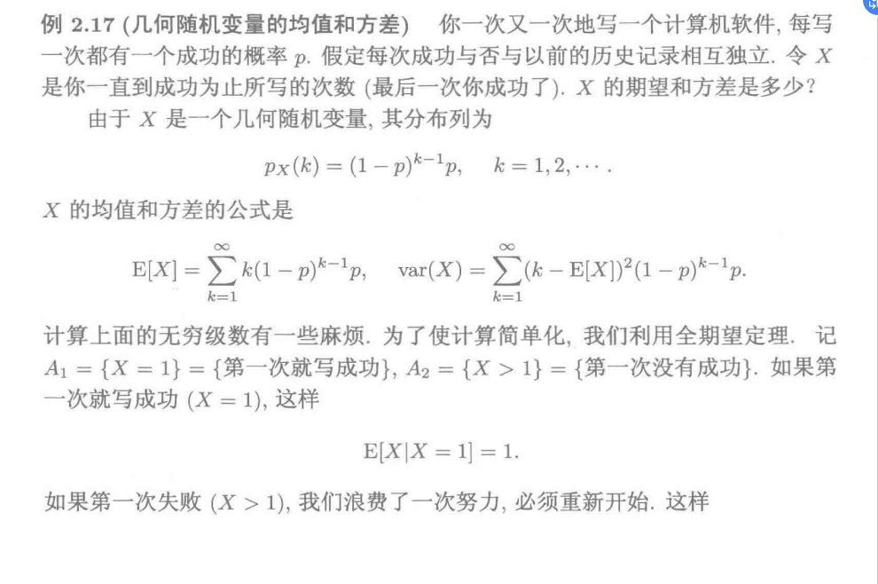
  - 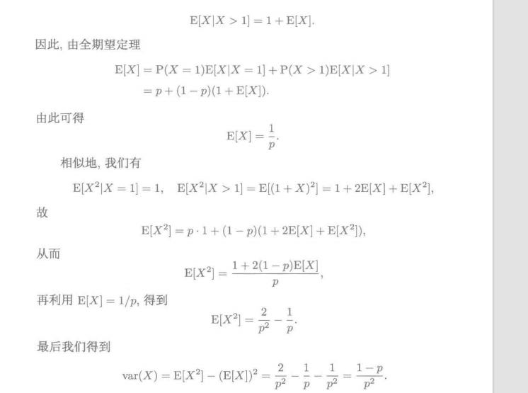
  - 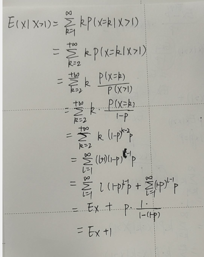

# 概率论之旅

## 概率模型

- 概率模型：对不确定事件的数学描述，由样本空间$\Omega$和概率律组成
  - 试验结果：每次不同试验的结果是互斥的；
    - 样本空间:试验结果的集合，用$\Omega$表示
    - 事件：样本空间的子集
  - 事件A的概率：试验结果的集合$A$通过概率律确定的非负数，记为$P(A)$，刻画事件A发生的似然程度
  - 概率律：事件A的概率所满足的条件
    - 非负性：$P(A)>0$
    - 可加性：若事件$A_i$不相容($P(\bigcap\limits_{i} A_i)=0$)，$P(\bigcup\limits_ {i}(A_i))=P(A_1)+...+P(A_i)$
    - 归一化：$P(\Omega)=1，P(\overline\Omega)=P(\varnothing)=0$
  - 互斥事件：$A\cap B= \varnothing$，互逆事件：不仅互斥，而且构成样本空间的一个划分；
- 概率律的性质
  - $$\mathrm{P}(A) \leqslant \mathrm{P}(B),A \subset B$$
  - $$\mathrm{P}(A \cup B)=\mathrm{P}(A)+\mathrm{P}(B)-\mathrm{P}(A \cap B)$$
  - $$\mathrm{P}(A \cup B) \leqslant \mathrm{P}(A)+\mathrm{P}(B)$$
  - $$\mathrm{P}(A \cup B \cup C)=\mathrm{P}(A)+\mathrm{P}\left(A^{c} \cap B\right)+\mathrm{P}\left(A^{c} \cap B^{c} \cap C\right)$$
  - $$(A\cap B)\cup C=(A\cup C)\cap(B\cup C)$$
    - $$(A\cup B)\cap C=(A\cap C)\cup(B\cap C)$$

## 条件概率

- 条件概率：将已发生事件作为样本空间研究新概率律
- $$\displaystyle\mathrm{P}(A \mid B)=\frac{\mathrm{P}(A \cap B)}{\mathrm{P}(B)},P(B)\ne0$$
- $$\displaystyle\mathrm{P}\left(\cap_{i=1}^{n} A_{i}\right)=\mathrm{P}\left(A_{1}\right) \mathrm{P}\left(A_{2} \mid A_{1}\right) \mathrm{P}\left(A_{3} \mid A_{1} \cap A_{2}\right) \cdots \mathrm{P}\left(A_{n} \mid \cap_{i=1}^{n-1} A_{i}\right)$$
  - 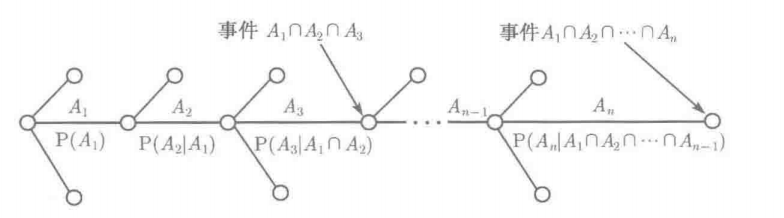
- $$P(A_1\cup A_2|B)=P(A_1|B)+P(A_2|B)$$

## 全概率定理&贝叶斯准则

- 全概率定理
  - 寻求样本空间的分割$A_i$，间接求$P(B)$
  - $P(B)$等价于$B$在$A_i$下的条件概率的加权平均，权为$P(A_i)$
  - $P(B)=P(A_1\cap B)+\cdots+P(A_n\cap B)=$$$P(A_1)P(B|A_1)+\cdots+P(A_n)P(B|A_n)$$
  - 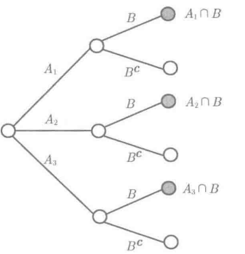
- 贝叶斯准则：推断原因
  - $\displaystyle P(A_i | B) = \frac{P(A_i)P(B | A_i)}{P(B)}= \frac{P(A_i)P(B | A_i)}{P(A_1)P(B | A_1) + \cdots + P(A_n)P(B | A_n)}$

## 独立性

  - 若$A$与$B$相互独立，则$A$与$B^c$、$A^c$与$B^c$、$A^c$与$B$都相互独立.
  - $P(A|B)=P(A)$，$P(A\bigcap B) = P(A)P(B)$
  - 独立的必要条件：相容
    - 相容不一定独立
    - 因为含有相同的试验结果，所以A发生与否不一定会影响B是否发生与否；
  - 互斥事件一定不独立
    - $P(A\bigcap B) = 0$，$P(A)P(B)\ne 0$
    - 当互斥事件中的一个发生时，另一个事件一定不发生
## 条件独立
  - 条件独立：$\mathrm{P}(A \cap B \mid C)=\mathrm{P}(A \mid C) \mathrm{P}(B \mid C)$，等价于$$P(A|B\cap C)=P(A|C)$$
    - 事件C已发生，进一步假定B发生，并不影响事件A的条件概率
  - 独立与条件独立无关
    - 事件A、B是否独立与事件A|C、B|C是否条件独立无关
- $n$个事件相互独立
  - 设 $A_{1}, \cdots, A_{n}$ 为 $n$ 个事件. 若它们满足$\mathrm{P}\left(\bigcap_{i \in S} A_{i}\right)=\prod_{i \in S} \mathrm{P}\left(A_{i}\right)$ 对 $\{1,2, \cdots, n\}$ 的任意子集 $S$ 成立,则称 $A_{1}, \cdots, A_{n}$ 为相互独立的事件
    - 事件$A_1，A_2，A_3$相互独立的条件如下
    - $P(A_1\bigcap A_2)=P(A_1)P(A_2)$
    - $P(A_1\bigcap A_3)=P(A_1)P(A_3)$
    - $P(A_2\bigcap A_3)=P(A_2)P(A_3)$
    - $P(A_1\bigcap A_2 \bigcap A_3)=P(A_1)P(A_2)P(A_3)$
  - $P(A_1\bigcap A_2 \bigcap A_3)=P(A_1)P(A_2)P(A_3)$并不能得出前三个推论

## 计数法

- 计数准则：第$i$阶段有$n_i$个结果，则一共有$n_1n_2...n_k$个结果
- $n$取$k$排列：$n(n-1)...(n-k+1)=\displaystyle{n!\over (n-k)!}$
- $n$取$k$组合：$\displaystyle{n!\over k!(n-k)!}$
- 分割：设$n_1+...+n_k=n$，将$n$个元素的集合划分为$k$个子集，每个子集的元素$n_i$个，划分方式共$$\begin{pmatrix}n\\n_1\end{pmatrix}\begin{pmatrix}n-n_1\\n_2\end{pmatrix}\begin{pmatrix}n-n_1-n_2\\n_3\end{pmatrix}\cdots\begin{pmatrix}n-n_1-\cdots-n_{r-1}\\n_r\end{pmatrix}$$
  - 化简得$\displaystyle \frac{n!}{n_1!n_2!\cdots n_r!}.$

# 离散型随机变量
- 随机变量：独立于试验的函数，陪域是实数；
  - 随机变量的函数：定义域是一个随机变量的值域的另一个随机变量；

- 离散型随机变量：随机变量的值域是有限集/可数无限集
- 离散型随机变量的分布列由所关联的样本空间及其概率律确定；对随机变量的每个值给出一个概率，记为$p_X$
- $p_X(x) = P(\{X = x\})=P(X=x)$
  - 大写字母：随机变量，小写字母：实数
  - $\displaystyle \operatorname{P}(X\in S)=\sum_{x\in S}p_X(x).$

## 伯努利随机变量

- 使用伯努利随机变量将具有$2$个试验结果的概率模型映射到实数域
  - 随机变量$X=\begin{cases}1,&\text{结果一}\\0,&\text{结果二}\end{cases}$
  - 随机变量的概率律$p_{X}(k)=\left\{\begin{array}{ll}p, & \text { 若 } k=1 ， \\1-p, & \text { 若 } k=0 .\end{array}\right.$
- 数字特征
  - $\begin{aligned}
\operatorname{E}[X]& =1\cdot p+0\cdot(1-p)=p,  \\
\operatorname{E}[X^{2}]& =1^2\cdot p+0^2\cdot(1-p)=p,  \\
\operatorname{var}(X)& =\operatorname{E}[X^2]-(\operatorname{E}[X])^2=p-p^2=p(1-p). 
\end{aligned}$
## 超几何分布X~H(n,m,p)

## 二项随机变量X~B(n,p)

- 使用二项随机变量将$n$次伯努利试验有$k$次出现预期结果的事件映射到实数域
  - $p_{X}(k)=\mathrm{P}(X=k)=\left(\begin{array}{l}n \\k\end{array}\right) p^{k}(1-p)^{n-k},  k=0,1, \cdots, n$
- 数字特征
  - $\displaystyle p={1\over 2}$时，分布列关于$\displaystyle {n\over 2}$对称，$\displaystyle p<{1\over 2}$时，分布列图像偏向0，否则偏向n
    - 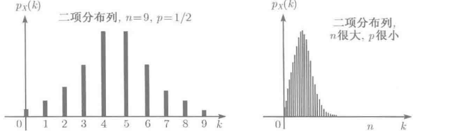
  - $E(X)=np$
## 几何随机变量𝑋~𝐺(𝑝)

- 使用几何随机变量将第$n$次伯努利试验是第一次出现预期结果的事件映射到实数域
  - $p_X(k)=(1-P)^{k-1}p  \;\;\;\;\;\;k=0,1,\cdots$
- 分布函数$$\begin{aligned}F_{\mathrm{geo}}(n)&=\sum_{k=1}^np(1-p)^{k-1}=p\cdot\frac{1-(1-p)^n}{1-(1-p)}=1-(1-p)^n,\quad n=1,2,\cdots.\end{aligned}$$
- 数字特征
  - 几何随机变量的数字特征是几何级数，衰减因子$(1-p)$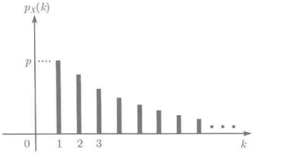
  - 

## 泊松随机变量X∼P(λ)

- 对$n$很大，$p$很小的二项随机变量结果的逼近，$\lambda =np$
  - $\displaystyle p_{X}(k)=\mathrm{e}^{-\lambda} \frac{\lambda^{k}}{k !}, \quad k=0,1,2, \cdots,$
- 数字特征
  - $E(X)=\lambda$
  - $var(X)=\lambda$

## 分布列的期望&方差

- 按推导顺序排列
- 期望：$$E[X]=\sum\limits_{x} x p_{X}(x)$$
- 方差$var(X)$：$$var(X)=E[(X-E[X])^2]$$
  - 方差刻画随机变量X以期望为中心的分散程度
- 标准差：$$\sigma_{X}=\sqrt{\operatorname{var}(X)}$$
  - 标准差的量纲与随机变量$X$相同
- $var(X)$的计算方式一
  - 计算分布列$Y=(X-E[X])^2$，再计算$E(Y)$
- 重要公式
  - 已知$X$的分布列$pX$和$g(X)$，$$\mathrm{E}[g(X)]=\sum_{x} g(x) p_{X}(x)$$
  - 通过该公式可计算$var(X)$与$n$阶矩，而无需计算中间分布列；
- $var(X)$的计算方式二$$\operatorname{var}(X)=\mathrm{E}\left[(X-\mathrm{E}[X])^{2}\right]=\sum_{x}(x-\mathrm{E}[X])^{2} p_{X}(x)$$
- $n$阶矩：随机变量$X^n$的均值$$E[X^n]=\sum\limits_x x^np_X(x)$$
- 随机变量的线性函数的均值和方差
  - 随机变量$X$的线性函数$Y=aX+b$有以下性质
  - $$E[Y]=aE[X]+b$$
  - $$var(Y)=a^2var(X)$$
- $var(X)$的计算方式三，通过$n$阶矩计算$$\operatorname{var}(X)=\operatorname{E}[X^2]-(\operatorname{E}[X])^2.$$
- 除非$g(X)$是线性函数，一般情况下$E[g(X)]\ne g(E[X])$

## 多个随机变量的联合分布列

- 多个随机变量：同一个试验结果之下产生的多个随机变量，其样本空间和概率律相同
  - $(x,y)$：$X$和$Y$的可能取值
  - $(x,y)$的概率质量：事件$\{X=x,Y=y\}$的概率$$p_{X,Y}(x,y)=P(X=x,Y=y)=\mathrm{P}(\{X=x\}\cap\{Y=y\})$$
- 多个随机变量的函数的期望$$\operatorname{E}\left[g(X,Y)\right]=\sum_x\sum_yg(x,y)p_{X,Y}(x,y).$$当，g是线性函数时$$\operatorname{E}[aX+bY+c]=a\operatorname{E}[X]+b\operatorname{E}[Y]+c,$$
- 多于两个随机变量的联合分布列$$p_{X,Y,Z}(x,y,z)=\mathrm{P}(X=x,Y=y,Z=z),$$

## 条件

- 某个事件$A(P(A)>0)$发生的条件下，随机变量$X$的条件分布列$$p_{X|A}(x)=\mathrm{P}(X=x|A)=\frac{\mathrm{P}\left(\{X=x\}\cap A\right)}{\mathrm{P}(A)}.$$
- 给定随机变量$Y$的取值$y(py(y)>0)$，随机变量$X$相对于给定$y$的条件分布列定义$$p_{X|Y}(x|y)=\mathrm{P}(X=x|Y=y).$$条件概率的重要公式$$p_{X|Y}(x|y)=\frac{\mathrm{P}(X=x,Y=y)}{\mathrm{P}(Y=y)}=\frac{p_{X,Y}(x,y)}{p_Y(y)}.$$以及乘法法则$$p_{X,Y}(x,y)=p_Y(y)p_{X|Y}(x|y),\\\\p_{X,Y}(x,y)=p_X(x)p_{Y|X}(y|x),$$
- 条件期望重要公式$$\operatorname{E}[X|A]=\sum_xxp_{X|A}(x).$$带入$g(X)$得$$\operatorname{E}\left[g(X)|A\right]=\sum_xg(x)p_{X|A}(x).$$相对于随机变量的条件期望$$\operatorname{E}[X|Y=y]=\sum_xxp_{X|Y}(x|y).$$
- 全期望定理：无条件均值可由条件平均再平均得到，有如下三个等价的公式$$\operatorname{E}[X]=\sum_{i=1}^n\operatorname{P}(A_i)\operatorname{E}[X|A_i].$$等价于$$\operatorname{E}[X]=\sum_yp_Y(y)\operatorname{E}[X|Y=y].$$进一步假定事件$B$满足对一切$i$，$P(A_i\cap B)>0$有$$\operatorname{E}[X|B]=\sum_{i=1}^n\operatorname{P}(A_i|B)\operatorname{E}[X|A_i\cap B].$$
  - 当随机变量的期望不好直接计算时，可将该随机变量划分为不相交的子集，通过全期望定理间接计算随机变量的期望
  - 例如几何随机变量的期望计算，将其划分为两个子集$$A=\{X=1\},B=\{X>1\}$$得到条件分布列$$\begin{matrix}&& A&&B\\p_{X|A}&&1&&0\end{matrix}$$以及$$\begin{matrix}&& A&&B\\p_{X|B}&&0&&1\end{matrix}$$

## 独立性

- 随机变量$X$独立于事件$A$等价于$$\mathrm{P}(X=\text{ }x\text{且 }A)=\mathrm{P}(X=x)\mathrm{P}(A)=p_X(x)\mathrm{P}(A)\text{对一切 }x\text{ 成立}$$该定义等价于$$\mathrm{P}(X=\text{ }x\text{且 }A)=p_{X|A}(x)\mathrm{P}(A)$$
- 随机变量之间相互独立等价于$$p_{X,Y}(x,y)=p_X(x)p_Y(y)\text{对一切 }x\text{和 }y\text{ 成立}.$$
- 随机变量之间的条件独立$$\mathrm{P}(X=x,Y=y|A)=\mathrm{P}(X=x|A)\mathrm{P}(Y=y|A),\text{对一切 }x\text{ 和 }y\text{ 成立},$$
- 独立与期望
  - 若随机变量$X$和$Y$相互独立, 则$$E[XY]=\mathrm{E}[X]\mathrm{E}[Y]$$，推导过程如下$$\begin{aligned}\operatorname{E}[XY]& \begin{aligned}&=\sum_x\sum_yxyp_{X,Y}(x,y)\end{aligned}  \\&=\sum_x\sum_yxyp_X(x)p_Y(y) \\&=\sum_xxp_X(x)\sum_yyp_Y(y) \\&=\operatorname{E}[X]\text{E}[Y].\end{aligned}$$
  - 若随机变量$X$和$Y$相互独立，则对任意函数$g、h$，满足$$\operatorname{E}[g(X)h(Y)]=\operatorname{E}[g(X)]\operatorname{E}[h(Y)].$$
  - 即随机变量$X$和$Y$相互独立，可推导$g(X)、h(Y)$相互独立
- 独立性和方差
  - 若随机变量$X$和$Y$相互独立，求$X+Y$的方差
  - 现在利用方差的一个性质：$var(X)=var(X+a)$，使得$E(X+Y)=0$，令$\hat X=X—E[X],\hat Y=Y-E[Y]$$$\begin{aligned}\operatorname{var}(X+Y)& =\operatorname{var}(\tilde{X}+\tilde{Y})  \\&=\operatorname{E}[(\tilde{X}+\tilde{Y})^2] \\&=\operatorname{E}[\tilde{X}^2+2\tilde{X}\tilde{Y}+\tilde{Y}^2] \\&=\operatorname{E}[\tilde{X}^2]+2\operatorname{E}[\tilde{X}\tilde{Y}]+\operatorname{E}[\tilde{Y}^2] \\&=\operatorname{E}[\tilde{X}^2]+\operatorname{E}[\tilde{Y}^2] \\&=\mathrm{var}(\tilde{X})+\mathrm{var}(\tilde{Y}) \\&=\operatorname{var}(X)+\operatorname{var}(Y).\end{aligned}$$

- 独立随机变量的和的方差等于它们的方差之和
- 随机变量之和的期望总是等于随机变量期望的和，而不需要任何条件
- 二项分布和泊松分布的方差
  - 利用方差公式$$\operatorname{var}(X_1+\cdots+X_n)=\operatorname{var}(X_1)+\cdots+\operatorname{var}(X_n)$$可得二项分布$X$方差$$\operatorname{var}(X)=\sum_{i=1}^n\operatorname{var}(X_i)=np(1-p)$$
  - 参数为$λ$的泊松随机变量$Y$可视为满足$n\to \infin，p\to 0，np\equiv λ$的二项随机变量的极限$$E[Y]=var(Y)=λ$$现证$$var(Y)=λ$$证明：$$\begin{aligned}\operatorname{E}[Y^{2}]& \begin{aligned}=\sum_{k=1}^\infty k^2\mathrm{e}^{-\lambda}\frac{\lambda^k}{k!}\end{aligned}  \\&=\lambda\sum_{k=1}^\infty k\frac{\mathrm{e}^{-\lambda}\lambda^{k-1}}{(k-1)!} \\&=\lambda\sum_{m=0}^{\infty}(m+1)\frac{\mathrm{e}^{-\lambda}\lambda^m}{m!} \\&=\lambda(\operatorname{E}[Y]+1) \\&=\lambda(\lambda+1),\end{aligned}$$$$\operatorname{var}(Y)=\operatorname{E}[Y^2]-(\operatorname{E}[Y])^2=\lambda(\lambda+1)-\lambda^2=\lambda.$$
- 独立同分布的随机变量的加权和的均值和方差
# 一般随机变量

## 连续随机变量和概率密度函数

- 连续随机变量和概率密度函数的定义：$$\displaystyle\mathrm{P}(X\in B)=\int_Bf_X(x)\mathrm{d}x$$
- 概率密度函数PDF
  - $f_X(x)\geq0$
  - $\displaystyle\int_{-\infty}^{\infty}f_X(x)\mathrm{d}x=\mathrm{P}(-\infty<X<\infty)=1.$
- 期望$$\displaystyle\operatorname{E}[X]=\int_{-\infty}^\infty xf_X(x)\mathrm{d}x.$$
- 期望的重要公式$$\displaystyle\operatorname{E}[g(X)]=\int_{-\infty}^\infty g(x)f_X(x)\mathrm{d}x,$$
## 均匀分布X~U(a,b)
## 指数随机变量X~e(λ)
- 将事件发生所用时间映射到实数域的随机变量
  - $f_{X}(x)=\left\{\begin{array}{ll}
\lambda \mathrm{e}^{-\lambda x}, & \text { 若 } x \geqslant 0, \\
0, & \text { 其他, }
\end{array}\right.$
  - $F(x)=\left\{\begin{array}{cc}
1-e^{-\lambda x} & x>0 \\
0 & x \leq 0
\end{array}\right.$$$\displaystyle F_{\exp}(x)=\int_0^x\lambda\mathrm{e}^{-\lambda t}\mathrm{d}t=-\mathrm{e}^{-\lambda t}\big|_0^x=1-\mathrm{e}^{-\lambda x},\quad x>0.$$
 - 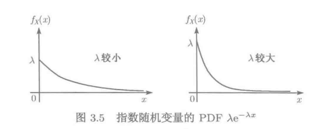
- 指数分布与几何随机变量的分布
  - 几何随机变量：以很快的频率进行伯努利试验时将逼近指数分布
  - 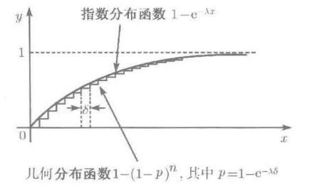
- 数字特征
  - $\displaystyle\operatorname{E}[X]=\frac1\lambda,\quad\operatorname{var}(X)=\frac1{\lambda^2}.$
## Γ函数与Γ分布X~ Γ(α,β)

- $\Gamma$函数服从以下形式$$\Gamma(\alpha)=\int\begin{array}{c}+\infty\\0\end{array}x^{\alpha-1}e^{-x}dx\quad(\alpha>0)$$
- 性质：$$\Gamma(\alpha+1)=\alpha\Gamma(\alpha),\quad\alpha>0$$$$\Gamma(1)=1,\Gamma\left(\frac{1}{2}\right)=\sqrt{\pi}$$若n为自然数，则$$\Gamma\left(n+1\right)=n!$$
- $\Gamma$分布的连续概率密度函数$$f(x)=\begin{cases}\dfrac{\beta^\alpha}{\Gamma(\alpha)}x^{\alpha-1}e^{-\beta x}&x>0\\\quad0&x\leq0\end{cases}|\alpha,\beta>0|$$称$X$服从参数为$α，β$的$Γ$分布，记为X~ Γ(α,β)

## 分布函数

- 分布函数(累积分布函数)CDF：统一刻画所有随机变量的取值规律
  - $$\displaystyle F_X(x)=\mathrm{P}(X\leqslant x)=\begin{cases}\sum\limits_{k\leqslant x}p_X(k),&\text{若 }X\text{ 是离散的},\\\\\int\limits_{-\infty}^xf_X(t)\mathrm{d}t,&\text{若 }X\text{ 是连续的}.\end{cases}$$
- X是连续随机变量时，若在$x$处可微(连续)，则$$f_X(x)=\frac{\mathrm{d}F_X}{\mathrm{d}x}(x).$$
- X是离散随机变量且X取整数时，$$p_X(k)=\mathrm{P}(X\leqslant k)-\mathrm{P}(X\leqslant k-1)=F_X(k)-F_X(k-1),$$
  

## 正态随机变量

- 一个连续随机变量$X$被称为正态随机变量的充分必要条件是其概率密度函数具有如下形式$$\displaystyle f_X(x)=\frac{1}{\sqrt{2\pi}\sigma}\mathrm{e}^{\displaystyle\frac{-(x-\mu)^2}{2\sigma^2}},$$其中，$\mu、\sigma$是两个决定PDF形状的参数，$\sigma>0$
- 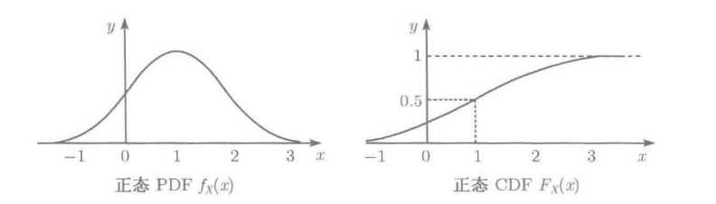
  - PDF相对于$\mu$对称，因此$E(X)=\mu$
  - $\operatorname{var}(X)=\sigma^2.$
- 正态随机变量$X$的线性函数$Y=aX+b$，其均值与方差为$$\operatorname{E}[Y]=a\mu+b,\quad\operatorname{var}(Y)=a^2\sigma^2.$$因正态随机变量经线性变换仍得到正态随机变量，因此标准正态随机变量可经线性变换得到所有正态随机变量
- 标准正态随机变量：满足$E(X)=\mu=0，var(X)=\sigma^2=1$的正态随机变量$$\Phi(y)=\mathrm{P}(Y\leqslant y)=\mathrm{P}(Y<y)=\frac{1}{\sqrt{2\pi}}\int_{-\infty}^{y}\mathrm{e}^{-t^2/2}\mathrm{d}t.$$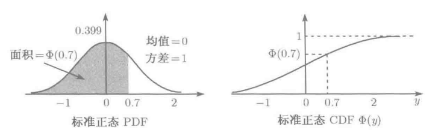，通过查找标准正态分布表而无需计算，负值的分布可通过以下公式计算$$\Phi(-y)=1-\Phi(y)\quad\text{对一切 }y\text{ 成立}.$$
- 正态随机变量$X$，其参数为$\mu、\sigma$，通过平移拉伸得到标准正态分布$$\frac{X-\mu}{\sigma}$$
- 正态随机变量CDF的计算，将$X$通过平移拉伸转换为标准正态分布$Y$，$$\operatorname{P}(X\leqslant x)=\operatorname{P}\left(\frac{X-\mu}{\sigma}\leqslant\frac{x-\mu}{\sigma}\right)=\operatorname{P}\left(Y\leqslant\frac{x-\mu}{\sigma}\right)=\Phi\left(\frac{x-\mu}{\sigma}\right)$$
- 应用：由独立效应叠加的随机变量
  - 大量的独立同分布的随机变量（不必为正态）的和的分布近似地服从正态分布，而与各个和项的具体的分布无关

## 多个随机变量的联合概率密度

- 如果$X$和$Y$是联合连续的，则存在联合概率密度函数$f_{X,Y}(x,y)\geq0$满足$$P((X,Y)\in B)= \iint\limits _{(x,y)\in B} f_{(X,Y)}(x,y)dxdy$$
  - 如果$B=\{(x,y)|a\leq x≤b,c≤y≤d\}$，$$\mathrm{P}(a\leqslant X\leqslant b,c\leqslant Y\leqslant d)=\int_{c}^{d}\int_{a}^{b}f_{X,Y}(x,y)\mathrm{d}x\mathrm{d}y.$$
  - 归一化$$\int_{-\infty}^{\infty}\int_{-\infty}^{\infty}f_{X,Y}(x,y)\mathrm{d}x\mathrm{d}y=1$$
  - $$\mathrm{P}(X\in A)=\mathrm{P}(X\in A,Y\in(-\infty,\infty))=\int_A\int_{-\infty}^\infty f_{X,Y}(x,y)\mathrm{d}y\mathrm{d}x$$
  - 又由$$\mathrm{P}(X\in A)=\int_Af_X(x)\mathrm{d}x,$$可得$X$的边缘概率密度函数$$f_X(x)=\int_{-\infty}^\infty f_{X,Y}(x,y)\mathrm{d}y.$$同理可得$Y$的边缘概率密度函数$$f_Y(y)=\int_{-\infty}^\infty f_{X,Y}(x,y)\mathrm{d}x.$$
- 联合分布函数适用离散和连续$$\begin{aligned}F_{X,Y}(x,y)&=\mathrm{P}(X\leqslant x,Y\leqslant y).\end{aligned}$$
  - 若$X,Y$具有联合概率密度，则$$F_{X,Y}(x,y)=\mathrm{P}(X\leqslant x,Y\leqslant y)=\int_{-\infty}^{x}\int_{-\infty}^{y}f_{X,Y}(s,t)\mathrm{d}t\mathrm{d}s.$$
  - 联合分布函数通过求微商得到联合密度函数$$f_{X,Y}(x,y)=\frac{\partial^2F_{X,Y}}{\partial x\partial y}(x,y).$$
- 联合连续随机变量$Z=g(X,Y)$的期望计算规则仍然有效，如下$$\operatorname{E}[g(X,Y)]=\int_{-\infty}^{\infty}\int_{-\infty}^{\infty}g(x,y)f_{X,Y}(x,y)\mathrm{d}x\mathrm{d}y.$$
- 多于两个随机变量的函数的联合概率密度$$\displaystyle \mathrm{P}((X,Y,Z)\in B)=\int_{(x,y,z)\in B}\int\int f_{X,Y,Z}(x,y,z)\mathrm{d}x\mathrm{d}y\mathrm{d}z$$
  - 以下性质成立$$\begin{aligned}f_{X,Y}(x,y)&=\int_{-\infty}^\infty f_{X,Y,Z}(x,y,z)\mathrm{d}z,\\f_X(x)&=\int_{-\infty}^\infty\int_{-\infty}^\infty f_{X,Y,Z}(x,y,z)\mathrm{d}y\mathrm{d}z.\end{aligned}$$
  - 期望计算$$\operatorname{E}[g(X,Y,Z)]=\int_{-\infty}^{\infty}\int_{-\infty}^{\infty}\int_{-\infty}^{\infty}g(x,y,z)f_{X,Y,Z}(x,y,z)\mathrm{d}x\mathrm{d}y\mathrm{d}z,$$若$g$是线性函数，则$$\operatorname{E}[aX+bY+cZ]=a\operatorname{E}[X]+b\operatorname{E}[Y]+c\operatorname{E}[Z].$$该公式可推广到n个随机变量的函数
- 
## 条件

- 以事件为条件的随机变量
  - 连续随机变量$X$在给定事件$A(P(A)>0)$发生的条件下的条件概率密度函数$f_{X|A}(x)$的满足$$\mathrm{P}(X\in B|A)=\int_Bf_{X|A}(x)\mathrm{d}x$$该条件概率密度函数非负，当$B$取全体实数时，满足$$\int_{-\infty}^{\infty}f_{X|A}(x)\mathrm{d}x=1,$$若事件$A$取$\{X\in A\}$，则 $$\mathrm{P}(X\in B|X\in A)=\frac{\mathrm{P}(X\in A,X\in B)}{\mathrm{P}(X\in A)}=\frac{\int_{A\cap B}f_X(x)\mathrm{d}x}{\mathrm{P}(X\in A)}.$$在条件集合外，条件概率密度函数为0，在条件集合内，条件概率密度函数和无条件概率密度函数拥有相同的形状，在y轴具有比例因子保证积分归一化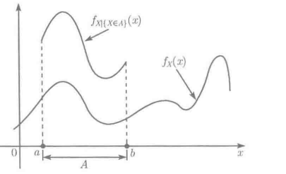
- 指数随机变量$T$的无记忆性
  - 在事件$A=\{T>t\}$已发生的条件下，距离下次事件发生的时间记为$X$，则$$\displaystyle\begin{aligned}P\left(X>x|A\right)& =\mathrm{P}(T>t+x|T>t)  \\&=\frac{\mathrm{P}(T>t+x\text{ 且 }T>t)}{\mathrm{P}(T>t)} \\&=\frac{\mathrm{P}(T>t+x)}{\mathrm{P}(T>t)} \\&=\frac{\mathrm{e}^{-\lambda(t+x)}}{\mathrm{e}^{-\lambda t}} \\&=\mathrm{e}^{-\lambda x},\end{aligned}$$即$$\frac{\mathrm{e}^{-\lambda(t+x)}}{\mathrm{e}^{-\lambda t}}=\frac{e^{-\lambda x}}{1}$$等价于图像被截取然后通过拉伸进行归一化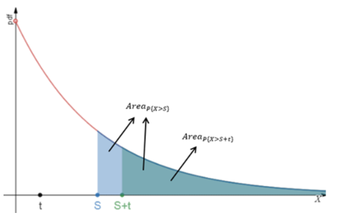
  - 指数分布通常刻画没有损耗的机器的寿命
- 联合条件概率密度函数
  - 联合连续随机变量$X,Y$，其联合概率密度函数$f_{X,Y}(x,y)$，在事件$C=\{(X,Y)\in A\}$已发生的条件下，具有联合条件概率密度函数$$f_{X,Y|C}(x,y)=\begin{cases}\dfrac{f_{X,Y}(x,y)}{\text{P}(C)},&\text{若 }(x,y)\in A,\\0,&\text{其他}.\end{cases}$$可得$X$相对条件$C$的条件概率密度函数$$f_{X|C}(x)=\int_{-\infty}^{\infty}f_{X,Y|C}(x,y)\mathrm{d}y.$$因此，当已发生的事件是由多个随机变量确定，而需要求一个随机变量相对于该事件的条件密度函数时，可以先求联合条件密度函数，再通过该公式求该随机变量的条件密度函数；
- 全概率定理的条件概率密度函数版本$$f_X(x)=\sum_{i=1}^n\operatorname{P}(A_i)f_{X|A_i}(x).$$其中$A_1...A_n$是样本空间的一个分割；例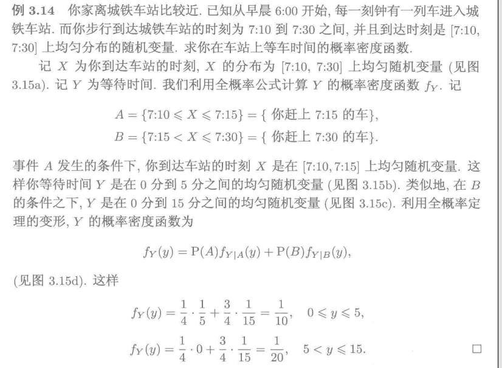

### 一个随机变量对另一个随机变量的条件

- 联合连续随机变量$X,Y$的联合概率密度函数$f_{X,Y}(x,y)$，$X$的相对于$Y=y$的条件概率密度函数$$f_{X|Y}(x|y)=\frac{f_{X,Y}(x,y)}{f_Y(y)}$$如果将$f_Y(y)$视为常数，则该条件概率密度函数与联合概率密度函数具有相同的形状，但是相差一个与$x$无关的常数因子$f_Y(y)$，及归一化因子是$f_Y(y)$
- $X$ 和$Y$ 的联合、边缘和条件概率密度函数相互关联$$f_{X,Y}(x,y)=f_Y(y)f_{X|Y}(x|y),$$以及$$f_{X}(x)=\int_{-\infty}^{\infty}f_{Y}(y)f_{X|Y}(x|y)\mathrm{d}y.$$

- 多个随机变量的条件概率密度定义$$f_{X|Y,Z}(x|y,z)=\frac{f_{X,Y,Z}(x,y,z)}{f_{Y,Z}(y,z)}\quad\text{对一切 }f_{Y,Z}(y,z)>0\text{ 成立}.$$以及$$f_{X,Y|Z}(x,y|z)=\frac{f_{X,Y,Z}(x,y,z)}{f_Z(z)}\quad\text{对一切 }f_Z(z)>0\text{ 成立},$$概率密度的乘法规则$$f_{X,Y,Z}(x,y,z)=f_{X|Y,Z}(x|y,z)f_{Y|Z}(y|z)f_{Z}(z).$$

### 条件期望&阶梯形PDF的E(X)/var(X)

- 条件期望$$E[X|Y=y]=\displaystyle{\int_{\displaystyle-\infty}^{\displaystyle+\infty}xf_{X|Y=y}(x|y)\mathrm{d}x}$$
- 全期望定理$$\operatorname{E}[X]=\int_{-\infty}^\infty\operatorname{E}[X|Y=y]f_Y(y)\mathrm{d}y\\=\int_{\displaystyle-\infty}^{\displaystyle+\infty}\int_{\displaystyle-\infty}^{\displaystyle+\infty}xf_{X|Y}(x|y)f_Y(y)dxdy\\=\int_{\displaystyle-\infty}^{\displaystyle+\infty}\int_{\displaystyle-\infty}^{\displaystyle+\infty}xf_{X,Y}(x,y)dxdy$$
- 阶梯形概率密度函数的均值和方差
  - 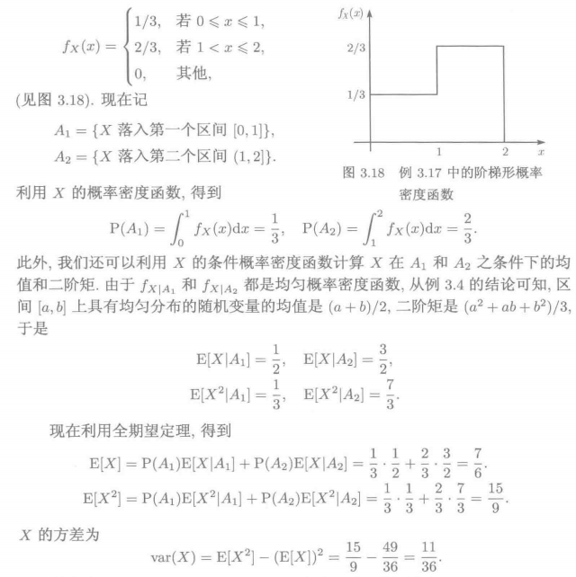
## 独立性&独立的正态随机变量

- 随机变量$X,Y$相互独立等价于$$f_{X,Y}(x,y)=f_{X}(x)f_{Y}(y)\quad\text{对一切 }x\text{ 和 }y\text{ 成立},$$等价于$$f_{X|Y}(x|y)=f_X(x)\quad\text{对一切 }x\text{ 和满足 }f_Y(y)>0\text{ 的 }y\text{ 成立}.$$由对称性，也等价于$$f_{Y|X}(y|x)=f_Y(y)\quad\text{对一切 }y\text{ 和满足 }f_X(x)>0\text{ 的 }x\text{ 成立}.$$
- 多个随机变量相互独立$$f_{X,Y,Z}(x,y,z)=f_X(x)f_Y(y)f_Z(z)\quad\text{对一切}x\text{、}y\text{、}z\text{成立}$$
- $X,Y$是相互独立的正态随机变量，其期望和方差分别是$\mu_x\text{、}\mu_y$和$\sigma_x^2\text{、}\sigma_y^2.$，其联合概率密度函数为$$f_{X,Y}(x,y)=f_X(x)f_Y(y)=\frac{1}{2\pi\sigma_x\sigma_y}\exp\left\{-\frac{(x-\mu_x)^2}{2\sigma_x^2}-\frac{(y-\mu_y)^2}{2\sigma_y^2}\right\}.$$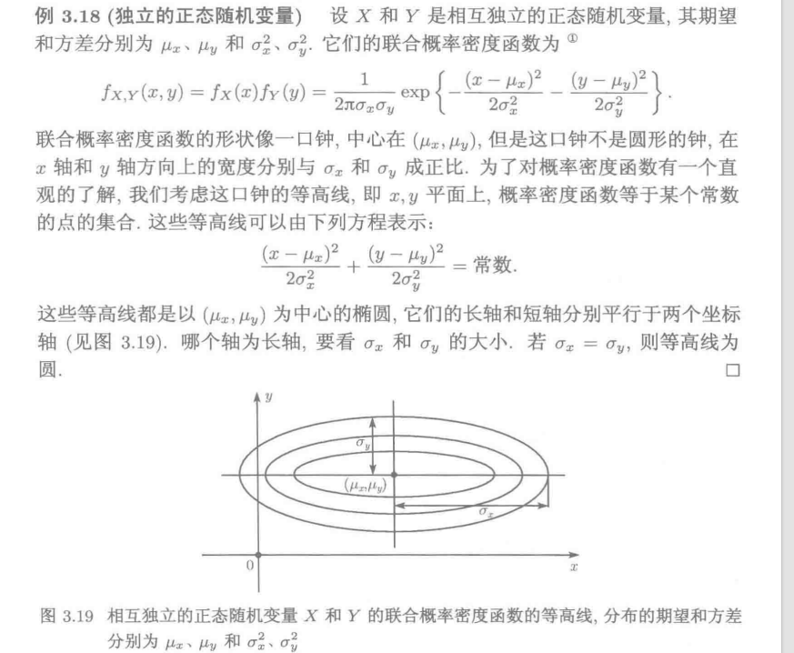
- 若$X$和$Y$相互独立，则任何两个形如$\{X\in A\}$和$\{Y\in B\}$的事件相互独立，证明$$\begin{aligned}\mathrm{P}(X\in A\text{ 且},Y\in B)& =\int_{x\in A}\int_{y\in B}f_{X,Y}(x,y)\mathrm{d}y\mathrm{d}x  \\&=\int_{x\in A}\int_{y\in B}f_X(x)f_Y(y)\mathrm{d}y\mathrm{d}x \\&=\int_{x\in A}f_X(x)\mathrm{d}x\int_{y\in B}f_Y(y)\mathrm{d}y \\&=\mathrm{P}(X\in A)\mathrm{P}(Y\in B).\end{aligned}$$
- 独立性的重要结论$$F_{X,Y}(x,y)=\operatorname{P}(X\leqslant x,Y\leqslant y)=\operatorname{P}(X\leqslant x)\operatorname{P}(Y\leqslant y)=F_X(x)F_Y(y).$$逆命题同样成立$$若F_{X,Y}(x,y)=F_X(x)F_Y(y)\text{对一切 }x\text{和 }y\text{成立}，则X、Y相互独立$$
- 独立与期望$$\mathrm{E}[g(X)h(Y)]=\mathrm{E}[g(X)]\mathrm{E}[h(Y)].$$
## 连续贝叶斯准则（没细看）

- 被需要但是不能观测到的目标对象使用随机变量$X$映射，不被需要但是能够观测到的对象使用随机变量$Y|X$表示$$f_{X|Y}(x|y)=\frac{f_X(x)f_{Y|X}(y|x)}{f_Y(y)}.$$
  - 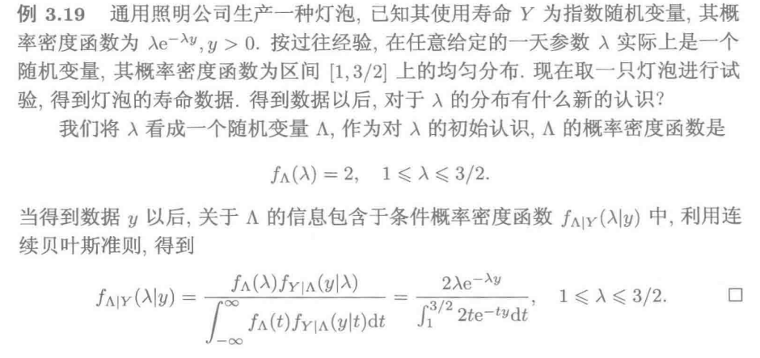
# 深入随机变量
## 随机变量函数的概率密度函数

- 已知连续随机变量$X$的PDF以及随机变量的函数$Y=g(X)$，计算$Y$的PDF的方法
  - 先通过以下公式计算$Y$的分布函数$$\displaystyle F_Y(y)=\mathrm{P}(g(X)\leqslant y)=\int_{\{x|g(x)\leqslant y\}}f_X(x)\mathrm{d}x.$$
    - $\{x|g(x)\leqslant y\}$：满足$g(x)\leqslant y$的$x$的集合
  - 然后对$F_Y$求导得到$Y$的概率密度函数$$f_Y(y)=\frac{\mathrm{d}F_Y}{\mathrm{d}y}(y).$$
- 随机变量$X$的线性函数$Y=aX+b$
  - 相对于随机变量$X$的密度函数，$Y$的密度函数将在x轴拉长a倍，在纵轴缩短a倍，并且沿x轴平移b个单位；$$f_Y(y)=\frac{1}{|a|}f_X\left(\frac{y-b}{a}\right).$$
  - 因此当随机变量$X$的密度函数和分布函数很复杂时，不用求$F_Y(y)$即可直接得到$Y$的密度函数
  - 指数随机变量的线性函数，直接带入可得$$\displaystyle f_Y(y)=\begin{cases}\dfrac{\lambda}{|a|}\mathrm{e}^{-\lambda(y-b)/a},&\text{若 }(y-b)/a\geqslant0,\\0,&\text{其他}.\end{cases}$$
  - 正态随机变量的线性函数$$\begin{aligned}f_{Y}(y)& =\frac1{|a|}f_X\left(\frac{y-b}a\right)  \\&=\frac1{|a|}\frac1{\sqrt{2\pi}\sigma}\mathrm{e}^{\displaystyle-(\frac{y-b}a-\mu)^2/2\sigma^2} \\&=\frac1{\sqrt{2\pi}|a|\sigma}\mathrm{e}^{\displaystyle-\frac{(y-b-a\mu)^2}{2a^2\sigma^2}}.\end{aligned}$$
- 将随机变量的线性函数推广到单调函数
  - 连续随机变量$X$的严格单调函数$Y=g(X)$，其概率密度函数可通过以下公式计算$$f_Y(y)=f_X(h(y))|h^{'}(y)|=f_X(h(y))\left|\frac{\mathrm{d}h}{\mathrm{d}y}(y)\right|.$$其中，$g$是严格单调函数，其逆函数$h$满足：对$X$的取值空间内任意一点x，$y=g(x)$当且仅当$x=h(y),$
  - 推导：
  - 假设$g$是严格递增，$F_Y(y)=P(g(X)≤y)=P(X≤h(y))=F_X(h(y))$
    - $g(X)≤y\Leftrightarrow h(g(X)≤h(y)\Leftrightarrow X≤h(y)$
## 两个随机变量的函数&双边指数概率密度函数
- 对$Z=f(X,Y)\rightarrow f(X,Y)\leq z$，关键点是确定z的范围，然后将不等关系转变为在二维坐标系中用面积比表示概率；
- 例一
  - 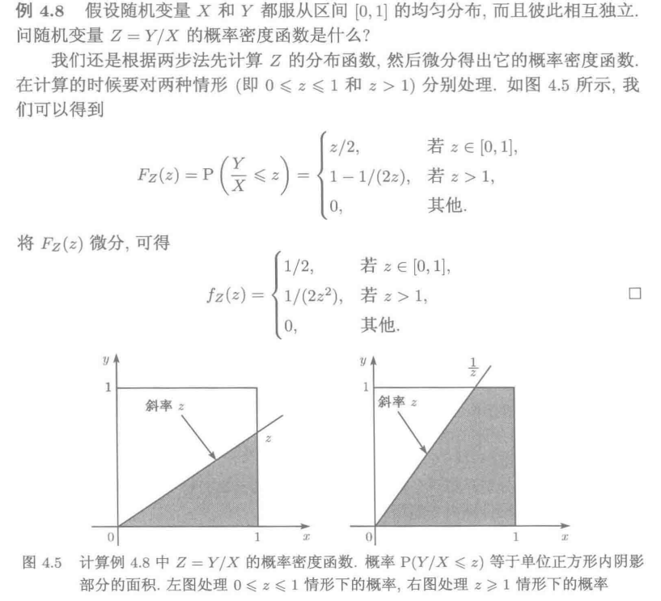
- 例二&拉普拉斯概率密度函数/双边指数概率密度函数
  - 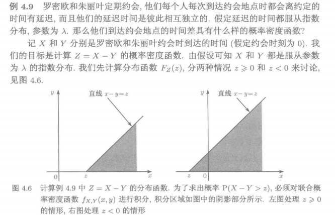
  - 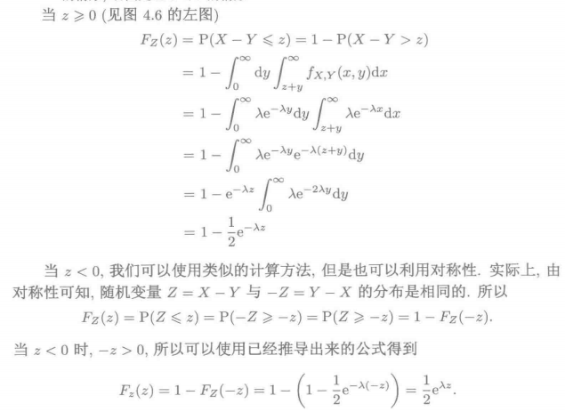
  - 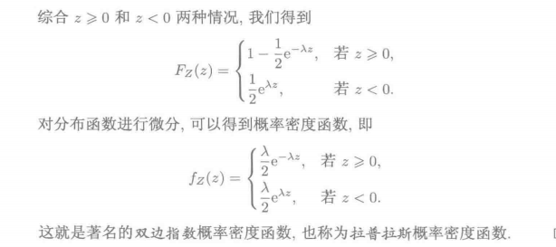

## 卷积：独立随机变量和

- 两个独立随机变量$X,Y$的和$Z=X+Y$的分布及图像
- 考虑两个离散型独立随机变量$$\begin{aligned}p_{Z}\left(z\right)& =\mathrm{P}(X+Y=z)  \\&=\sum_{\{(x,y)|x+y=z\}}\operatorname{P}(X=x,Y=y) \\&=\sum_x\mathrm{P}(X=x,Y=z-x) \\&=\sum_xp_X(x)p_Y(z-x)\end{aligned}$$
  - 分布列$p_Z$被称为$X、Y$的分布列的卷积$$p_{Z}=\sum_xp_X(x)p_Y(z-x)$$
  - $Z=3$时，$p_Z3$为所有满足$x+y=3$的点(x,y)发生的概率之和
  - $X、Y$的分布列的卷积图像示意图为
  - 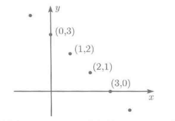
- 独立连续随机变量的概率密度函数$f_X、f_Y$，求$Z=X+Y$的概率密度函数及其卷积图像
  - 通过$X、Z$的联合概率密度函数求边际密度函数间接求得$Z$的概率密度函数
  - $$\begin{aligned}\mathrm{P}\left(Z\leqslant z|X=x\right)& =P(X+Y\leqslant z|X=x)  \\&=P(x+Y\leqslant z|X=x) \\&=\operatorname{P}(x+Y\leqslant z) \\&=P(Y\leqslant z-x),\end{aligned}$$
    - 第二个等号->第三个等号由$X、Y$的独立性推导
    - 对左右两式取$z$的微分（右侧使用复合函数的微分）得
  - $$f_{Z|X}(z|x)=f_Y(z-x)$$
    - 利用乘法法则可得
  - $$f_{X,Z}(x,z)=f_X(x)f_{Z|X}(z|x)=f_X(x)f_Y(z-x),$$
    - 求边际概率密度函数得
  - $$f_Z(z)=\int_{-\infty}^\infty f_{X,Z}(x,z)\mathrm{d}x=\int_{-\infty}^\infty f_X(x)f_Y(z-x)\mathrm{d}x.$$
  - 在z固定得情况下，卷积公式可表示为
  - 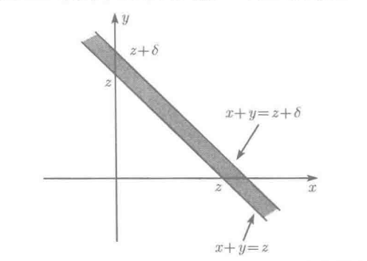
    - $delta\rightarrow 0$
- 例一：利用卷积公式直接求$Z=X+Y$的概率密度函数
  - 服从在区间[0,1]上均匀分布的独立随机变量X和Y，由卷积公式求$Z=X+Y$的概率密度函数$$f_{Z}(z)=\int_{-\infty}^{\infty}f_{X}(x)f_{Y}(z-x)\mathrm{d}x.$$
    - 其中$f_{X}(x)、f_{Y}(y)$要么为0要么为1，因此可等价表示为
  - $$f_{Z}(z)=\begin{cases}\displaystyle\int_{-\infty}^{\infty}f_{X}(x)f_{Y}(z-x)\mathrm{d}x &&x\in (0,1)且(z-x)\in(0,1)\\ 0 &&others\end{cases}$$
    - 确定$x$的积分上限$min\{1,z\}$和积分下限$max\{0,z-1\}$可的
  - $$f_Z(z)=\begin{cases}\min\{1,z\}-\max\{0,z-1\},&0\leqslant z\leqslant2,\\0,&\text{其他情况}.\end{cases}$$
  - 卷积图像
  - 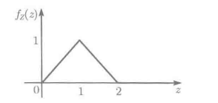
- 例二：相互独立的正态随机变量之和
  - 相互独立的正态随机变量$X、Y$，均值分别为$μ_x,μ_y$，方差分别为$\sigma_x,\sigma_y$
  - $Z＝X＋Y$，由卷积公式
    - $$f_Z(z)=\int_{-\infty}^\infty\frac{1}{\sqrt{2\pi}\sigma_x}\exp\left(-\frac{(x-\mu_x)^2}{2\sigma_x^2}\right)\frac{1}{\sqrt{2\pi}\sigma_y}\exp\left(-\frac{(z-x-\mu_y)^2}{2\sigma_y^2}\right)\mathrm{d}x.$$
  - 化简得
    - 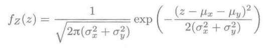
    - $$f_Z(z)=\frac{1}{\sqrt{2\pi(\sigma_x^2+\sigma_y^2)}}exp(-\frac{(z-\mu_x-\mu_y)}{2(\sigma_x^2+\sigma_y^2)})$$
  - 结论，正太随机变量之和也是正态随机变量，其方差为均值为$μ_x+μ_y$，均值为$\sigma_x^2+\sigma_y^2$
  - 又：正态随机变量的线性变换仍是正态，可知
  - $\forall a\ne0,b\ne0\rightarrow aX+bY$是正态随机变量
- 两独立随机变量之差
  - 将$Z=X-Y$视为独立随机变量$X$和$-Y$的和，即概率密度函数$f_{-Y}(y)=f_Y(-y)$
    - $f_Y(-y)$解释为在$Y=-y$时的概率质量梯度，等价于在$-Y=y$时的概率质量梯度$f_{-Y}(y)$
  - $$f_Z(z)=f_{X-Y}(z)=\int_{-\infin}^{+\infin}f_X(x)f_{-Y}(z-x)dx=\int_{-\infin}^{+\infin}f_X(x)f_{Y}(x-z)dx$$
  - 假设$X、Y$服从指数分布，即重点考虑$x>0且(x-z>0)$确认的积分上限和积分下限，分类讨论当$z>0或z<0$的情况
  - 当$z>0$时，积分区间$(z,+\infin)$$$\begin{aligned}f_{X-Y}(z)&=\int_{-\infty}^\infty f_X(x)f_Y(x-z)\mathrm{d}x\\&=\int_z^\infty\lambda\mathrm{e}^{-\lambda x}\lambda\mathrm{e}^{-\lambda(x-z)}\mathrm{d}x\\&=\lambda^2\mathrm{e}^{\lambda z}\int_z^\infty\mathrm{e}^{-2\lambda x}\mathrm{d}x\\&=\lambda^2\mathrm{e}^{\lambda z}\frac{1}{2\lambda}\mathrm{e}^{-2\lambda z}\\&=\frac{\lambda}{2}\mathrm{e}^{-\lambda z},\end{aligned}$$
  - 因为$X、Y$同分布，所以$$f_{X-Y}(z)=f_{Y-X}(z)=f_{X-Y}(-z).$$
- 使用卷积公式时，最关键的步骤是要确定正确的积分限.但是这通常是繁琐且易错的，但是可以利用下面将要介绍的图像法加以避免
  
### 卷积的图像计算法(未学)

## 协方差

- 随机变量$X、Y$的协方差记为$cov(X,Y)$，定义$$\begin{matrix}\mathrm{cov}(X,Y)=\mathrm{E}[(X-\mathrm{E}[X])(Y-\mathrm{E}[Y])]\\=\operatorname{E}[XY]-\operatorname{E}[X]\operatorname{E}[Y]\end{matrix}$$
  - 目的：量化两个随机变量之间关系的大小和方向
  - $cov(X,Y)=0$,随机变量$X、Y$不相关
  - $cov(X,Y)>0$,随机变量$X、Y$正相关
    - 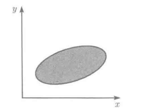
  - $cov(X,Y)<0$,随机变量$X、Y$负相关
    - 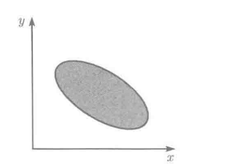
- 辨别独立和不相关
    - $cov(X,Y)=0$等价于随机变量$X、Y$不相关
    - 随机变量$X、Y$独立一定有$\operatorname{E}[XY]=\operatorname{E}[X]\operatorname{E}[Y]=cov(X,Y)=0$，即独立一定不相关；
      - 使用全期望定理推导$$\begin{aligned}\operatorname{E}[XY]& =\sum_yyp_Y(y)\mathrm{E}[X|Y=y]  \\&=\operatorname{E}[X]\sum yp_Y(y)=\operatorname{E}[X]\operatorname{E}[Y], \\\end{aligned}$$
    - 但是$cov(X,Y)=0\rightarrow\operatorname{E}[XY]=\operatorname{E}[X]\operatorname{E}[Y]$不能反推导随机变量$X、Y$独立
- 协方差的性质
  - $\mathrm{cov}(X,X)=\mathrm{var}(X)$
  - $\operatorname{cov}(X,aY+b)=a\cdot\operatorname{cov}(X,Y)$
  - $\mathrm{cov}(X,Y+Z)=\mathrm{cov}(X,Y)+\mathrm{cov}(X,Z)$
### 相关系数
- 相关系数是协方差的标准化，取值在(-1,1)
  - 两个方差非零的随机变量$X和Y$的相关系数记为$\rho(X，Y)$
  - $\displaystyle\rho(X,Y)=\frac{\operatorname{cov}(X,Y)}{\sqrt{\operatorname{var}(X)\operatorname{var}(Y)}}.$
- $\rho$的大小反映趋向程度的标准度量大小
- 例一：$\rho(X，Y)=-1$的例子
  - 抛掷$n$次硬币，每次抛掷独立，正面朝上的概率为$p$，设$X、Y$分别为正面朝上和反面朝上的次数
  - $\because X+Y=n,E[X]＋E[Y]=np+n(1-p)=n$
  - $\therefore X-E[X]=-(Y-E[Y])$
  - $\displaystyle\therefore\begin{aligned}
\operatorname{cov}(X,Y)& =\operatorname{E}\Big[(X-\operatorname{E}[X])(Y-\operatorname{E}[Y])\Big]  \\
&=-\mathrm{E}\Big[(X-\mathrm{E}[X])^2\Big] \\
&=-\operatorname{var}(X).
\end{aligned}$
  - $\displaystyle\therefore\rho(X,Y)=\frac{\operatorname{cov}(X,Y)}{\sqrt{\operatorname{var}(X)\operatorname{var}(Y)}}=\frac{-\operatorname{var}(X)}{\sqrt{\operatorname{var}(X)\operatorname{var}(X)}}=-1.$
- 结论：$\rho=1/—1$当且仅当存在一个$c/-c$满足$X-E[X]=c(Y-E[Y]).$

### 随机变量和的方差

- 计算随机变量之和的方差时，转为计算单独的随机变量方差及两两随机变量的相关系数$$\operatorname{var}\left(\sum_{i=1}^nX_i\right)=\sum_{i=1}^n\operatorname{var}(X_i)+\sum_{\{(i,j)|i\neq j\}}\operatorname{cov}(X_i,X_j).$$例如$$\mathrm{var}(X_1+X_2)=\mathrm{var}(X_1)+\mathrm{var}(X_2)+2\mathrm{cov}(X_1,X_2)$$
  - 推导忽略
  - 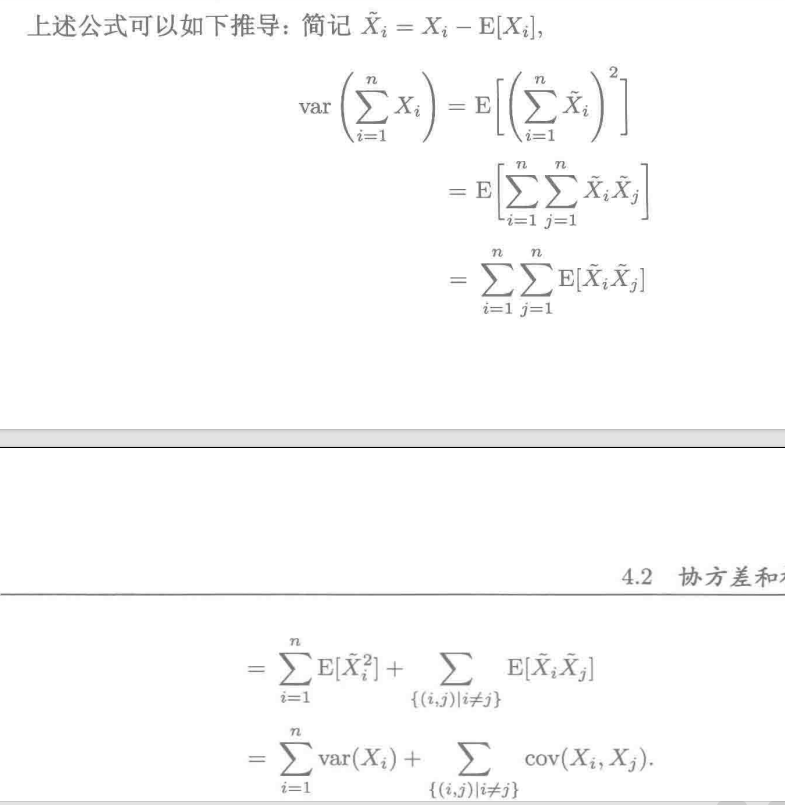

## 深入条件期望与条件方差(未看完)

- 条件期望和条件方差的定义
  - 切入点:一个随机变量$X$的条件期望$E[X|Y=y]$依赖于$Y$的值$y$
  - $\because E[X|Y=y]是y的函数,\therefore E[X|Y]$是$Y$的函数
  - $\therefore E[X|Y]$是一个随机变量，其分布依赖于$Y$的分布；
  - 因此，随机变量$E[X|Y]$也具有期望和方差，称为条件期望和条件方差
- 重期望法则$\operatorname{E}[\operatorname{E}[X|Y]]=\operatorname{E}[X]$
  - 假设不均匀硬币正面朝上的概率是在区间$(0,1)$上分布的随机变量$Y$，随机变量$X$是$n$次抛掷中正面向上的次数
  - 对$\forall y\in (0,1)$，有$E(X|Y=y)=ny$
  - 因此$E(X\Y)$是随机变量$nY$
  - 由期望法则可得
    - $$\operatorname{E}[\operatorname{E}[X|Y]]=\begin{cases}\sum_y\operatorname{E}[X|Y=y]p_Y(y),&Y\text{离散},\\[2ex]\int_{-\infty}^\infty\operatorname{E}[X|Y=y]f_Y(y)\mathrm{d}y,&Y\text{ 连续}.\end{cases}$$
  - 由全期望定理可知无论是离散还是连续，等式后的内容都等于$E(X)$
## 矩母函数（未学）

## 随机数个相互独立的随机变量之和（未学）

# 极限理论

- 独立同分布的样品组成的样本，可使用随机变量序列$X_1,X_2,...,$表示，$X_i$的均值为$μ$方差为$\sigma^2$
  - 随机变量的前$n$项之和为$$S_n=X_1+\cdots+X_n$$
  - 由$$\displaystyle\operatorname{var}\left(\sum_{i=1}^nX_i\right)=\sum_{i=1}^n\operatorname{var}(X_i)+\sum_{\{(i,j)|i\neq j\}}\operatorname{cov}(X_i,X_j)$$可知$$\operatorname{var}(S_n)=\operatorname{var}(X_1)+\cdots+\operatorname{var}(X_n)=n\sigma^2$$当$n\to \infin$时，$var(S_n)$发散不能收敛，
  - 定义样本均值$$M_n=\frac{X_1+\cdots+X_n}n=\frac{S_n}n$$满足$$\displaystyle\operatorname{E}[M_n]=\mu,\quad\operatorname{var}(M_n)=\frac{\sigma^2}{n}$$令样本容量增加，样本均值的方差越来越小，又因为样本均值的均值是$\mu$，因此样本均值的分布越来越向$\mu$接近，因此可得出以下结论
  - 大数定律：随着样本容量的增加，样本的均值收敛于样品$X_i$的均值$\mu$
- 中心极限定理
  - 观察$S_n$是关于$n$的分布，通过平移拉伸使$S_n$标准化$$Z_n=\frac{S_n-n\mu}{\sigma\sqrt{n}}$$满足$$\operatorname{E}[Z_n]=0,\quad\operatorname{var}(Z_n)=1$$通过标准化得到的分布，其均值和方差不再依赖于样本容量，其分布既不发散也不收敛
  - 中心极限定理研究分布$Z_n$的渐近性质：当$n\to\infin$时，分布$Z_n$无限趋近于标准正态分布

## 马尔可夫和切比雪夫不等式

# 贝叶斯统计推断
- 统计推断与概率理论在许多重要方面存在不同
  - 概率论是建立在第1章公理的基础上的自我完善的数学课题.在概率推理中，我们假设有一个完整的特定概率模型满足这些概率公理.然后运用数学方法对这个概率模型进行量化，以及回答感兴趣的问题.特别地，一些模棱两可的问题只有唯一的正确答案，即使这个答案有时也很难发现.概率模型从本质上看也无需与实际相一致（虽然模型有用会更好一些）.
- 统计学却不是这种情况，可以说统计学是艺术的一部分.对一个具体的问题，存在很多合理的方法，可得出不同的结论
  - 一般而言，除非人们可对所研究的问题施加一些假设或者附加约束条件，在这些条件下进行推断，得到“理想”的结论，否则没有一个绝对的准则来选择“最好”的方法.比如，只知道股票市场在最近五年回报率的历史数据，就不会有一个“最好”的方法来预测下一年的回报率.
  - 所以人们把寻找“正确”的方法局限在能得到一些理想的性质的方法上，比如当数据的样本量在无穷大的情况下能做出正确的推断.判断一种方法优于其他方法可以考虑如下几个因素：性质优良，过去的经验，共同的观点，以及统计学家对一种特定方法解决一类特殊的问题方面形成的共识.我们将重点介绍一些最流行的方法，并介绍对它们进行分析和比较的主要方法.

## 贝叶斯统计与经典统计

- 在统计领域，有两种突出但对立的思想学派：贝叶斯学派和经典学派（也称频率学派），他们之间最重要的区别就是如何看待未知模型或者变量.贝叶斯学派的观点是将其看成是已知分布的随机变量，而经典统计学派的观点是将其看成未知的
# EOF
